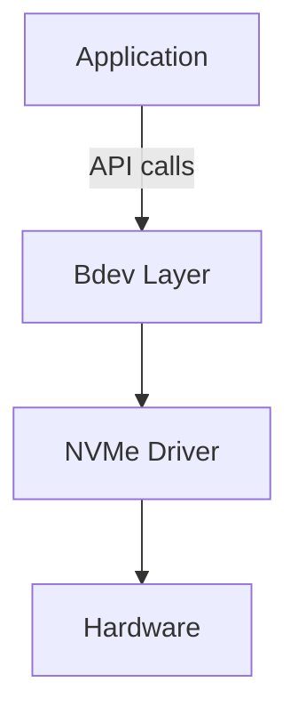
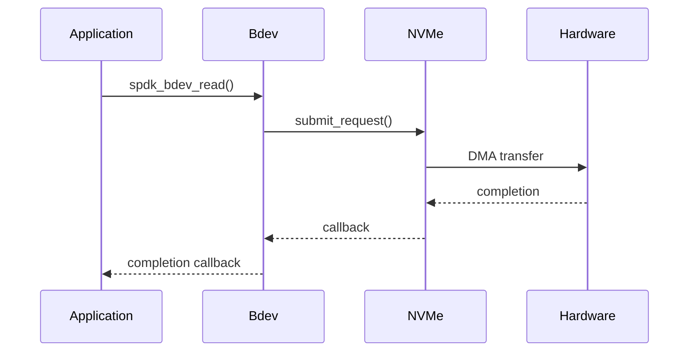
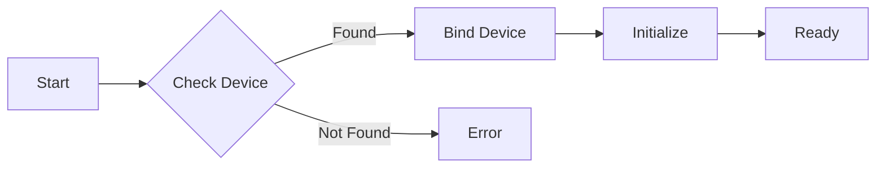

# SPDK 마스터리 코스 - 마스터 가이드라인

**버전**: 1.0
**최종 업데이트**: 2026-01-30
**목적**: 일관되고 고품질의 SPDK 코스 자료를 제작하기 위한 종합 가이드라인

---

## 코스 개요

### 대상 수강자
- **주요 대상**: 스토리지 서비스 회사의 신입 직원
- **배경**: Go 및 C++ 프로그래밍 경험
- **목표**: SPDK 개발에 기여하고 SPDK 전문가 되기
- **선수 요건**:
  - 탄탄한 프로그래밍 기초
  - Linux/Unix 커맨드 라인 숙련도
  - 스토리지 개념에 대한 기본 이해 (권장하나 필수는 아님)

### 학습 철학
**탑다운 접근법(Top-Down Approach)**: 아키텍처 → 원칙 → 구현 → 코드 세부사항

1. **How 전에 Why**: 메커니즘 전에 동기를 이해
2. **큰 그림 먼저**: 컴포넌트 세부사항 전에 시스템 아키텍처
3. **점진적 깊이**: 기초 → 구현 → 마스터리
4. **실습 기반 학습**: 이론을 실습으로 보강
5. **실무 맥락**: 실제 SPDK 코드베이스의 예제

---

## 3단계 학습 과정

### 스테이지 1: 기초 (1-3주차)
**목표**: SPDK의 아키텍처, 원칙, 설계 철학 이해

**핵심 영역**:
- SPDK가 무엇이고 왜 존재하는가
- 핵심 원칙: 유저스페이스 I/O(Userspace I/O), 폴링 모드(Polled Mode), 제로 카피(Zero-Copy)
- 시스템 아키텍처 및 컴포넌트 개요
- 스레딩 모델(Threading Model)과 동시성(Concurrency)
- 메모리 관리 기초

**학습 성과**:
- 커널 기반 I/O 대비 SPDK의 장점 설명
- 유저스페이스 드라이버(Userspace Driver) 모델 이해
- 스레딩 및 이벤트 프레임워크(Event Framework) 이해
- SPDK 코드베이스 구조 탐색

**깊이**: 최소한의 코드로 개념적 이해

### 스테이지 2: 구현 (4-8주차)
**목표**: SPDK API를 사용하여 애플리케이션 및 모듈 구축 방법 학습

**핵심 영역**:
- Bdev 추상화 계층(Abstraction Layer) 프로그래밍
- NVMe 드라이버 API 사용법
- 이벤트 프레임워크(Event Framework) 통합
- JSON-RPC 인터페이스
- 커스텀 모듈 구축
- 애플리케이션 개발 패턴

**학습 성과**:
- 간단한 SPDK 애플리케이션 구축
- 커스텀 bdev 모듈 생성
- SPDK 핵심 라이브러리를 효과적으로 사용
- JSON-RPC 관리 기능 통합
- SPDK 코딩 컨벤션 준수

**깊이**: 코드 예제를 포함한 API 수준의 이해

### 스테이지 3: 마스터리 (9-16주차)
**목표**: 고급 주제를 마스터하고 SPDK 개발에 기여

**핵심 영역**:
- NVMe-oF 타겟 내부 구조
- 성능 최적화 기법
- 고급 스레딩 패턴
- 디버깅 및 프로파일링
- SPDK 프로젝트 기여
- 프로덕션 배포 전략

**학습 성과**:
- 복잡한 서브시스템 이해 (NVMe-oF, vhost, iSCSI)
- 프로덕션 성능 최적화
- 효과적인 이슈 디버깅
- SPDK에 코드 기여
- 프로덕션 환경에서 SPDK 배포 및 관리

**깊이**: 소스 코드 분석을 통한 깊은 내부 구조 이해

---

## 문서 구조 표준

### 파일 명명 규칙

```
[Module-Number]-[Stage-Level]-[Topic-Name].md

예시:
01-S1-Why-SPDK-Exists.md
02-S1-Core-Principles.md
10-S2-Bdev-Programming.md
20-S3-NVMf-Internals.md
```

**패턴 설명**:
- `Module-Number`: 두 자리 순번 (01, 02, 03...)
- `Stage-Level`: S1 (스테이지 1), S2 (스테이지 2), S3 (스테이지 3)
- `Topic-Name`: 설명적이며 하이픈으로 구분

### 디렉토리 구조

```
claudedocs/spdk-mastery-course/
├── 00-MASTER-GUIDELINE.md (이 파일)
├── 01-COURSE-INDEX.md (진행 상황 추적이 포함된 마스터 인덱스)
│
├── stage-1-foundation/
│   ├── 01-S1-Why-SPDK-Exists.md
│   ├── 02-S1-Core-Principles.md
│   ├── 03-S1-Architecture-Overview.md
│   ├── 04-S1-Threading-Model.md
│   ├── 05-S1-Memory-Management.md
│   └── 06-S1-Build-System.md
│
├── stage-2-implementation/
│   ├── 10-S2-Environment-Setup.md
│   ├── 11-S2-Hello-World.md
│   ├── 12-S2-Event-Framework.md
│   ├── 13-S2-Bdev-Layer.md
│   ├── 14-S2-NVMe-Driver.md
│   ├── 15-S2-JSON-RPC.md
│   ├── 16-S2-Custom-Bdev-Module.md
│   └── 17-S2-Application-Development.md
│
├── stage-3-mastery/
│   ├── 20-S3-NVMf-Architecture.md
│   ├── 21-S3-Vhost-Internals.md
│   ├── 22-S3-Performance-Optimization.md
│   ├── 23-S3-Advanced-Threading.md
│   ├── 24-S3-Debugging-Techniques.md
│   ├── 25-S3-Memory-Pools.md
│   ├── 26-S3-DPDK-Integration.md
│   └── 27-S3-Contributing-Guide.md
│
├── exercises/
│   ├── EX01-Hello-Bdev.md
│   ├── EX02-Custom-Poller.md
│   ├── EX03-Simple-App.md
│   └── ...
│
├── reference/
│   ├── REF-API-Quick-Reference.md
│   ├── REF-Common-Patterns.md
│   ├── REF-Debugging-Cheatsheet.md
│   ├── REF-Performance-Tuning.md
│   └── REF-Glossary.md
│
└── assets/
    ├── diagrams/
    └── code-snippets/
```

---

## 모듈 템플릿

### 표준 모듈 구조

모든 모듈 문서는 반드시 다음 구조를 따라야 합니다:

```markdown
# [모듈 번호]: [주제명]

**스테이지**: [1/2/3]
**난이도**: [초급/중급/고급]
**예상 소요 시간**: [X시간]
**선수 과목**: [필요한 선행 모듈 목록]

---

## 학습 목표

이 모듈을 마치면 다음을 할 수 있습니다:
- [목표 1]
- [목표 2]
- [목표 3]

---

## 개요

[주제에 대한 2-3 문단의 고수준 소개]

### 왜 이것이 중요한가

[실무적 중요성과 실제 맥락 설명]

---

## 핵심 개념

### 개념 1: [이름]

[필요시 다이어그램을 포함한 설명]

**핵심 포인트**:
- 포인트 1
- 포인트 2
- 포인트 3

### 개념 2: [이름]

[패턴 계속...]

---

## 아키텍처/구현 세부사항

[스테이지에 적합한 깊이 - S1은 더 개념적, S2/S3는 더 많은 코드]

### [하위 섹션]

[적절한 코드 예제를 포함한 내용]

```c
// 명확한 주석이 있는 코드 예제
// 무엇을 하고 왜 그런지 설명
```

---

## 코드 워크스루

[S2 및 S3용: 실제 SPDK 소스 코드를 따라가기]

**파일**: `lib/[component]/[file.c]`
**위치**: Lines XXX-YYY

[코드가 하는 일에 대한 설명]

---

## 실습 예제

### 예제 1: [시나리오]

[실제 예제 또는 사용 사례]

```c
// 완전하고 실행 가능한 코드 예제
```

**설명**:
[무엇을 하고 어떻게 동작하는지]

---

## 공통 패턴

[스테이지에 적합한 패턴과 관용구]

1. **패턴 이름**
   - 언제 사용하는가
   - 구현 방법
   - 예제

---

## 주의사항 및 모범 사례

### 흔한 실수

1. **실수**: [사람들이 자주 잘못하는 것]
   **왜 잘못인가**: [설명]
   **올바른 접근법**: [올바르게 하는 방법]

### 모범 사례

1. **사례**: [권장 접근법]
   **근거**: [왜 이것이 최선인가]

---

## 실습 과제

[관련 실습 또는 미니 랩 링크]

**실습**: [exercises/EXXX-Name.md]

**목표**: [무엇을 구축/수행할 것인가]

---

## 이해도 점검

1. [이해를 테스트하는 질문]
2. [적용을 요구하는 질문]
3. [비판적 사고를 촉발하는 질문]

---

## 추가 리소스

- **SPDK 소스**: [`lib/[component]`]
- **공식 문서**: [관련 SPDK 문서 링크]
- **관련 모듈**: [선수/후속 모듈 링크]

---

## 요약

[핵심 내용의 2-3 문단 요약]

**다음 모듈**: [XX-SX-Next-Topic.md]
```

---

## 코드 예제 표준

### 코드 블록 형식

```c
/**
 * 이 코드가 무엇을 시연하는지에 대한 간략한 설명
 *
 * 컨텍스트: SPDK에서 어디에 나타나거나 이 패턴을 언제 사용하는지
 */

#include "spdk/stdinc.h"
#include "spdk/bdev.h"

// 명확하고 의미 있는 변수명
// 주석은 무엇(WHAT)이 아니라 왜(WHY)를 설명
static void
example_function(struct spdk_bdev *bdev)
{
    // 교육적 주석이 포함된 구현
    // 단순히 코드를 보여주는 것이 아니라 패턴을 가르치는 데 초점
}
```

### 코드 예제 가이드라인

1. **항상 컨텍스트 포함**
   - SPDK에서 이 패턴이 어디에 나타나는지
   - 이 접근법을 언제 사용하는지
   - 어떤 문제를 해결하는지

2. **완전하고 컴파일 가능하게**
   - 필요한 헤더 포함
   - 완전한 함수 시그니처 표시
   - 코드 조각에 대한 컨텍스트 제공

3. **점진적 복잡도**
   - 가장 간단한 동작 예제부터 시작
   - 복잡도를 점진적으로 높임
   - 각 추가 요소를 설명

4. **실제 SPDK 코드**
   - 실제 소스 파일 참조
   - 파일 경로와 라인 번호 포함
   - 현재 코드베이스 패턴 표시

5. **교육적 주석**
   - 설계 결정 설명
   - SPDK 특유의 관용구 강조
   - 흔한 함정 지적

---

## 다이어그램 표준

### 다이어그램 유형

1. **아키텍처 다이어그램**
   - 시스템 수준의 컴포넌트 관계
   - 계층 간 상호작용
   - 데이터 흐름 경로

2. **시퀀스 다이어그램**
   - 함수 호출 순서
   - 이벤트 흐름
   - 스레드 간 상호작용

3. **개념 다이어그램**
   - 추상적 개념
   - 멘탈 모델
   - 설계 패턴

### 다이어그램 형식

모든 다이어그램에 Mermaid를 사용합니다. Mermaid는 최신 마크다운 뷰어에서 전문적으로 렌더링되며 유지보수가 더 쉽습니다.

**아키텍처 다이어그램 예제**:
````markdown

````

**시퀀스 다이어그램 예제**:
````markdown

````

**플로우차트 예제**:
````markdown

````

---

## 일관성 규칙

### 작성 스타일

1. **어조**: 능동적, 직접적, 튜토리얼 스타일
   - ✓ "bdev를 생성하려면 다음 함수를 호출합니다..."
   - ✗ "bdev는 다음 함수를 호출하여 생성될 수 있습니다..."

2. **톤**: 전문적이지만 친근하게
   - 복잡한 개념을 쉽게 설명
   - 도움이 되는 비유 사용
   - 지나친 단순화는 지양

3. **명확성**: 기술적 정확성과 가독성
   - 용어를 사용하기 전에 정의
   - 불필요한 전문 용어 피하기
   - 약어는 처음 사용 시 풀어서 설명

### 용어 표준

| 용어 | 사용법 | 비고 |
|------|--------|------|
| SPDK | 항상 대문자 | Storage Performance Development Kit |
| bdev | 문장 시작이 아닌 한 소문자 | 블록 디바이스 추상화(Block Device Abstraction) |
| NVMe | 표시된 대로 대문자화 | Non-Volatile Memory Express |
| NVMe-oF | 대시, 대문자 사용 | NVMe over Fabrics |
| polled mode | 소문자 | "polling mode"가 아님 |
| thread | 소문자, SPDK 특화 | OS 스레드가 아님 |
| reactor | 소문자 | SPDK의 실행 컨텍스트 |

### 상호 참조

**내부 링크**: 항상 상대 경로 사용
```markdown
자세한 내용은 [스레딩 모델](./04-S1-Threading-Model.md)을 참조하세요.
```

**소스 코드 참조**: 저장소 루트에서의 전체 경로 사용
```markdown
구현은 `lib/event/reactor.c:245`를 참조하세요.
```

**외부 링크**: 버전 또는 날짜 포함
```markdown
[SPDK 문서](https://spdk.io/doc/) (2026-01-30 기준)
```

---

## 진행 상황 추적

### 모듈 상태

각 모듈의 상태는 `01-COURSE-INDEX.md`에서 추적됩니다:

- **미시작**: 📝 기획 단계
- **진행 중**: 🔄 적극적으로 작성 중
- **초안 완료**: ✏️ 검토 준비됨
- **검토 완료**: ✅ 내용 확인됨
- **최종 완료**: 🎯 완성 및 다듬어짐

### 품질 체크리스트

모듈을 **최종 완료**로 표시하기 전에 확인:

- [ ] 템플릿 구조를 따르는가
- [ ] 학습 목표가 명확하고 측정 가능한가
- [ ] 코드 예제가 테스트되고 정확한가
- [ ] 파일 경로와 라인 번호가 정확한가
- [ ] 상호 참조가 유효한가
- [ ] 용어가 표준을 따르는가
- [ ] 실습 링크가 동작하는가
- [ ] 이해도 점검 질문이 관련성 있는가
- [ ] 요약이 핵심 포인트를 담고 있는가
- [ ] 오타나 문법 오류가 없는가

---

## 버전 관리

### 문서 버전 관리

각 모듈 상단에 주요 변경사항을 추적:

```markdown
**버전 이력**:
- v1.0 (2026-01-30): 초기 버전
- v1.1 (2026-02-15): 성능 최적화 섹션 추가
- v1.2 (2026-03-01): SPDK v25.01 대응 코드 예제 업데이트
```

### 코드베이스 정렬

**현재 SPDK 버전**: `git describe --tags`로 확인

SPDK가 크게 업데이트될 때:
1. 영향 받는 모듈 검토
2. 코드 예제 업데이트
3. 파일 경로 및 라인 번호 확인
4. 버전 노트 업데이트

---

## 실습 과제 설계 원칙

### 실습 과제 구조

```markdown
# 실습 [번호]: [이름]

**관련 모듈**: [XX-SX-Module.md]
**난이도**: [쉬움/보통/어려움]
**소요 시간**: [XX분]

## 목표
[수강생이 구축/달성할 것]

## 선수 요건
- [필요한 지식]
- [필요한 환경 설정]

## 설정
[환경 준비 단계]

## 태스크

### 태스크 1: [이름]
[명확한 지시사항]

**힌트**: [막힐 때 도움이 되는 포인터]

### 태스크 2: [이름]
[계속...]

## 검증
[솔루션이 올바른지 확인하는 방법]

## 솔루션
[설명이 포함된 완전한 솔루션]

## 도전 과제
[고급 학습자를 위한 선택적 확장]
```

---

## 유지보수 및 업데이트

### 정기 검토 일정

- **월간**: 깨진 링크 및 오래된 참조 확인
- **분기**: 최신 SPDK 대비 코드 예제 확인
- **주요 SPDK 릴리스**: 영향 받는 모든 모듈 검토

### 피드백 반영

수강생 피드백과 자주 묻는 질문 추적:
1. 반복되는 혼란 지점 기록
2. 모듈에 설명 추가
3. 필요에 따라 보충 자료 생성

---

## 시작하기 (코스 개발자용)

### 첫 번째 단계

1. 이 가이드라인을 완전히 읽으세요
2. `01-COURSE-INDEX.md`에서 개요 검토
3. 기존 모듈 2-3개를 예제로 학습
4. 작업할 모듈 선택
5. 템플릿을 엄격히 따르기
6. 최종화 전에 검토를 위해 제출

### 개발 워크플로

1. **계획**: 모듈 내용 개요 작성
2. **조사**: SPDK 소스 코드를 철저히 학습
3. **초안**: 템플릿에 따라 작성
4. **테스트**: 모든 코드 예제 확인
5. **검토**: 품질 체크리스트 대비 확인
6. **최종화**: 인덱스에 완료로 표시

---

## 연락 및 협업

**코스 관리자**: [소속 조직의 연락처]
**최종 업데이트**: 2026-01-30
**다음 검토**: 2026-02-28

---

## 부록 A: SPDK 아키텍처 빠른 참조

### 주요 디렉토리

| 디렉토리 | 용도 |
|----------|------|
| `lib/` | SPDK 핵심 라이브러리 |
| `module/` | 플러그인 모듈 (bdev, scheduler 등) |
| `app/` | 완전한 애플리케이션 (nvmf_tgt 등) |
| `include/spdk/` | 공개 API 헤더 |
| `examples/` | 참조 구현 |
| `scripts/` | 유틸리티 스크립트 |
| `doc/` | 공식 문서 |

### 핵심 라이브러리

| 라이브러리 | 용도 | 공개 헤더 |
|-----------|------|----------|
| `lib/bdev` | 블록 디바이스 추상화 | `include/spdk/bdev.h` |
| `lib/nvme` | NVMe 드라이버 | `include/spdk/nvme.h` |
| `lib/nvmf` | NVMe-oF 타겟 | `include/spdk/nvmf.h` |
| `lib/event` | 이벤트 프레임워크 | `include/spdk/event.h` |
| `lib/thread` | 스레딩 추상화 | `include/spdk/thread.h` |
| `lib/iscsi` | iSCSI 타겟 | `include/spdk/iscsi.h` |
| `lib/vhost` | Vhost 타겟 | `include/spdk/vhost.h` |

---

## 부록 B: 약어 및 용어집

### 주요 약어

- **SPDK**: Storage Performance Development Kit
- **NVMe**: Non-Volatile Memory Express
- **NVMe-oF**: NVMe over Fabrics
- **DMA**: Direct Memory Access (직접 메모리 접근)
- **DPDK**: Data Plane Development Kit
- **RPC**: Remote Procedure Call (원격 프로시저 호출)
- **RDMA**: Remote Direct Memory Access (원격 직접 메모리 접근)
- **I/O**: Input/Output (입출력)
- **CPU**: Central Processing Unit (중앙 처리 장치)
- **PMD**: Poll Mode Driver (폴 모드 드라이버)

### 주요 용어

전체 용어집은 `reference/REF-Glossary.md`를 참조하세요.

---

*마스터 가이드라인 끝*
