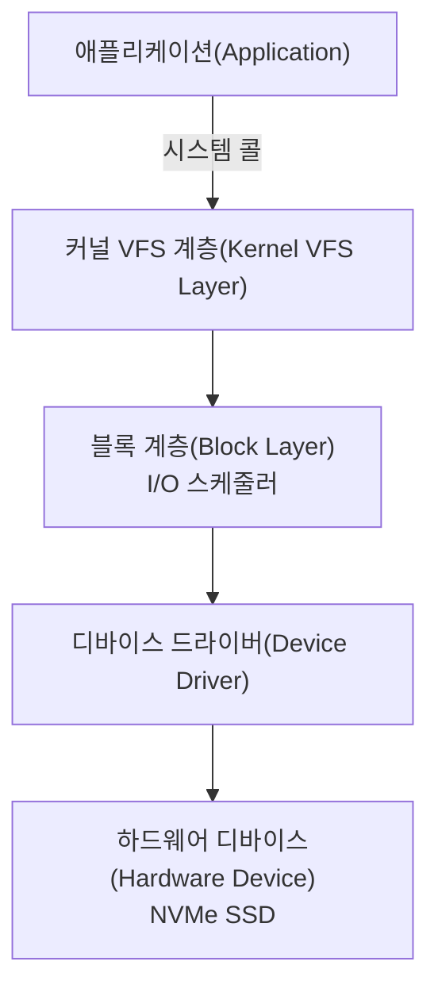
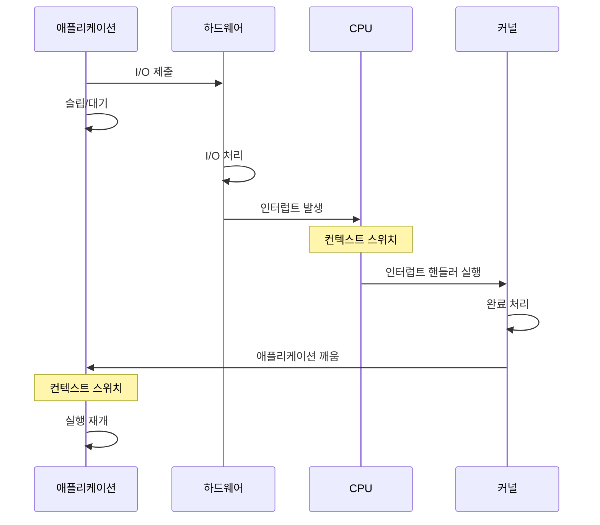
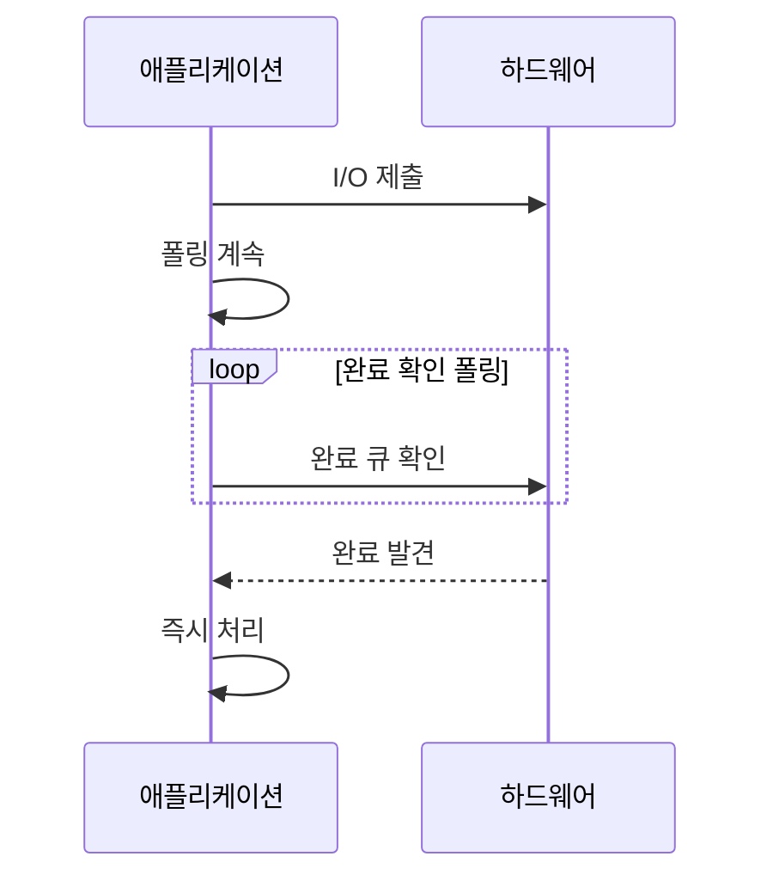
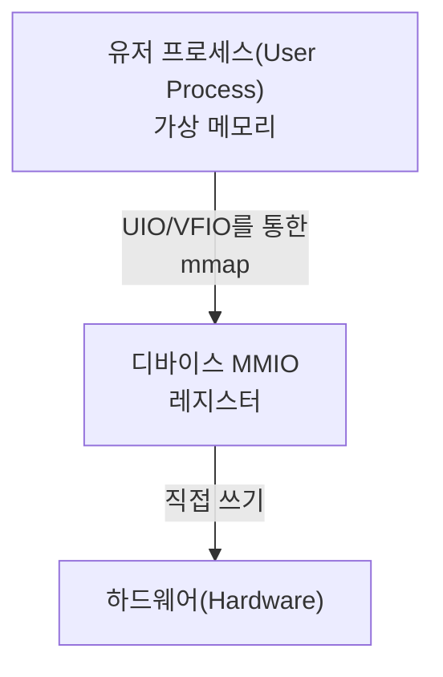
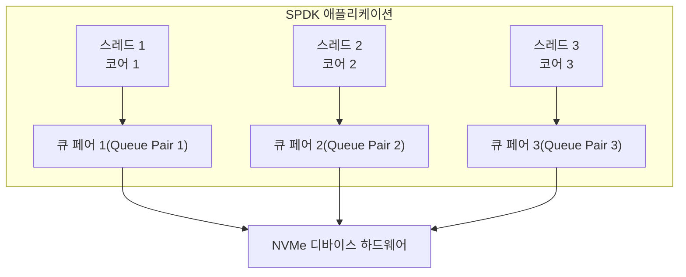
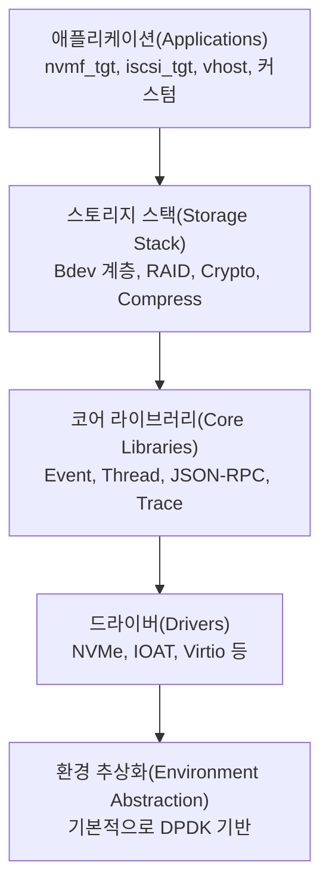

# 모듈 01: SPDK가 존재하는 이유

**스테이지**: 1 (기초)
**난이도**: 초급
**예상 소요 시간**: 2시간
**선수 과목**: 없음

**버전 이력**:
- v1.0 (2026-01-30): 초기 버전

---

## 학습 목표

이 모듈을 마치면 다음을 할 수 있습니다:
- 전통적인 커널 기반 I/O의 근본적인 문제점 설명
- 유저스페이스 드라이버(Userspace Driver)가 성능 이점을 제공하는 이유 이해
- SPDK의 핵심 가치 제안(Value Proposition) 설명
- SPDK에 적합한 사용 사례 파악
- SPDK가 적합한 경우와 그렇지 않은 경우를 구별

---

## 개요

SPDK(Storage Performance Development Kit)는 고성능 스토리지 소프트웨어를 구축하는 방식에 대한 근본적인 재고를 나타냅니다. SPDK가 왜 존재하는지 이해하려면, 먼저 전통적인 스토리지 I/O 접근법의 한계를 이해해야 합니다.

### 왜 이것이 중요한가

최신 스토리지 디바이스, 특히 NVMe SSD는 놀라울 정도로 빠릅니다. 초당 수백만 건의 I/O 작업을 마이크로초 수준의 레이턴시로 처리할 수 있습니다. 그러나 전통적인 운영체제 I/O 스택은 수십 년 전 하드 디스크 드라이브와 같은 훨씬 느린 디바이스를 위해 설계되었습니다. 이것은 심각한 불일치를 만들어냅니다: 소프트웨어 스택 자체가 병목이 되어, 애플리케이션이 하드웨어의 성능을 완전히 활용하지 못하게 합니다.

SPDK는 커널을 완전히 우회하고 스토리지 드라이버를 유저스페이스로 옮겨 폴링 모드(Polled Mode)로 동작시킴으로써 이 문제를 해결합니다. 겉보기에 단순한 이 변경이 극적인 성능 향상을 가능하게 하며, 최신 고성능 스토리지 시스템의 기초를 형성합니다.

---

## 핵심 개념

### 개념 1: 커널 I/O 병목(Bottleneck)

Linux(및 기타 운영체제)에서의 전통적인 스토리지 I/O는 다음 경로를 따릅니다:



**핵심 포인트**:
- 모든 I/O에는 유저 스페이스와 커널 스페이스 사이의 **컨텍스트 스위치(Context Switch)**가 필요
- 컨텍스트 스위치는 비용이 큼 (일반적으로 1-3 마이크로초)
- 최신 NVMe 디바이스는 **~10-20 마이크로초**만에 I/O를 완료 가능
- 소프트웨어 오버헤드가 하드웨어 레이턴시와 비슷해짐!

**문제**: 컨텍스트 스위치 오버헤드가 전체 I/O 시간의 10-30%일 때, 실제 작업이 아닌 소프트웨어 조정에 상당한 CPU 사이클을 낭비하게 됩니다.

### 개념 2: 인터럽트 기반(Interrupt-Driven) vs 폴링 I/O(Polled I/O)

**전통적인 인터럽트 기반 I/O**:


**비용**: I/O당 2회 컨텍스트 스위치 + 인터럽트 처리 오버헤드

**SPDK의 폴링 모드**:


**비용**: 메모리 읽기 (보통 CPU 캐시에서)

**핵심 포인트**:
- 폴링은 인터럽트와 그에 따른 오버헤드를 제거
- 완료 큐 확인은 빠름 (단순 메모리 읽기)
- 최신 CPU는 자주 접근하는 메모리를 캐시에 유지 (Intel DDIO)
- 컨텍스트 스위치 불필요
- CPU 코어를 폴링에 전용해야 함 (트레이드오프)

### 개념 3: 유저스페이스(Userspace) vs 커널 드라이버

**커널 드라이버의 도전 과제**:

1. **공유 자원 관리**
   - 여러 프로세스의 I/O를 처리해야 함
   - 락(Lock)과 동기화가 필요
   - 호출자 컨텍스트에 대한 가정 불가

2. **범용 설계**
   - 가능한 모든 사용 사례를 지원해야 함
   - 대부분의 애플리케이션이 필요하지 않는 기능 포함
   - 범용성으로 인해 최적화가 제한

3. **개발 마찰**
   - 커널 개발은 복잡
   - 디버깅이 어려움
   - 업데이트 시 커널 재컴파일/재부팅 필요

**유저스페이스 드라이버의 장점**:

1. **애플리케이션 특화 최적화**
   - 단일 애플리케이션에 내장된 드라이버
   - 정확한 스레딩 모델을 파악
   - 불필요한 추상화 제거 가능

2. **직접 하드웨어 접근**
   - 시스템 콜 불필요
   - 커널 중재 없음
   - 직접 메모리 매핑 I/O(MMIO)

3. **개발 민첩성**
   - 표준 유저스페이스 디버깅 도구 사용
   - 빠른 반복
   - 커널 재컴파일 불필요

### 개념 4: 하드웨어 진화

**역사적 맥락**:

| 시대 | 디바이스 | 레이턴시 | IOPS | 병목 |
|------|----------|----------|------|------|
| 1990년대 | HDD | ~10 ms | ~100 | 기계적 |
| 2000년대 | SATA SSD | ~100 μs | ~10K | 인터페이스 |
| 2010년대 | PCIe SSD | ~50 μs | ~100K | 소프트웨어 |
| 2020년대 | NVMe SSD | ~10 μs | ~1M+ | 소프트웨어 |

**전환점**: 하드웨어는 1000배 빨라졌지만, 소프트웨어 스택은 거의 변하지 않았습니다.

**핵심 통찰**: 디바이스 레이턴시가 밀리초에서 마이크로초로 떨어지면, 소프트웨어 오버헤드의 모든 마이크로초가 엄청나게 중요해집니다.

---

## SPDK의 가치 제안

### SPDK가 제공하는 것

1. **유저스페이스 NVMe 드라이버**
   - 커널 중재 없이 직접 하드웨어 접근
   - 제로 카피(Zero-Copy) 데이터 경로
   - 완전한 비동기 API

2. **폴링 모드 동작(Polled Mode Operation)**
   - 인터럽트 오버헤드 제거
   - 예측 가능한 레이턴시
   - 최대 처리량

3. **락프리 아키텍처(Lock-Free Architecture)**
   - 락 대신 메시지 패싱(Message Passing)
   - 스레드별 리소스
   - 선형적 확장성

4. **완전한 스토리지 스택**
   - 블록 디바이스 추상화 (bdev 계층)
   - 스토리지 프로토콜 (NVMe-oF, iSCSI, vhost)
   - 바로 배포 가능한 애플리케이션

### 성능 장점

**SPDK를 사용한 일반적인 개선 사항**:

| 지표 | 전통적 방식 | SPDK | 개선 효과 |
|------|------------|------|----------|
| 레이턴시 | 50-100 μs | 10-20 μs | 2-5배 낮음 |
| IOPS (코어당) | 200K | 1M+ | 5배 높음 |
| CPU 효율성 | 60-70% | 90-95% | 30% 향상 |
| 지터(Jitter) | 높음 | 매우 낮음 | 더 예측 가능 |

**실제 영향**:
- 동일한 워크로드에 더 적은 CPU 코어 필요
- 더 일관된 성능
- 더 나은 자원 활용
- 총 소유 비용(TCO) 절감

---

## SPDK를 사용해야 할 때

### 이상적인 사용 사례

✅ **고성능 스토리지 어플라이언스(Appliance)**
- NVMe-oF 타겟
- 올 플래시 어레이(All-Flash Array)
- 분산 스토리지 시스템

✅ **레이턴시 민감 애플리케이션**
- 데이터베이스 (MySQL, PostgreSQL, RocksDB)
- 키-밸류 스토어 (Redis, Memcached)
- 실시간 분석

✅ **고처리량 워크로드**
- 데이터 레이크(Data Lake)
- 오브젝트 스토리지
- 백업/복원 시스템

✅ **커스텀 스토리지 솔루션**
- 특수 목적 스토리지 엔진
- 연구 프로젝트
- 새로운 스토리지 아키텍처

### SPDK를 사용하지 말아야 할 때

❌ **범용 컴퓨팅**
- 데스크톱/노트북 시스템
- 멀티 테넌트(Multi-Tenant) 환경
- 공유 호스팅

❌ **레거시 애플리케이션 통합**
- POSIX I/O가 필요한 애플리케이션
- 수정 없이 기존 애플리케이션 사용
- 표준 파일시스템 접근 필요

❌ **자원이 제한된 환경**
- CPU 코어가 제한된 경우
- 폴링에 코어를 전용할 수 없는 경우
- 다른 워크로드와 CPU 공유가 필요한 경우

❌ **단순한 스토리지 요구사항**
- 가벼운 I/O 워크로드
- 커널 성능으로 충분한 경우
- 개발 복잡성이 이점보다 큰 경우

---

## 아키텍처/구현 세부사항

### SPDK가 목표를 달성하는 방법

**1. 디바이스 언바인딩(Device Unbinding)**

SPDK는 NVMe 디바이스의 제어권을 다음과 같이 가져옵니다:
```bash
# 커널 드라이버에서 디바이스 해제
echo "0000:04:00.0" > /sys/bus/pci/drivers/nvme/unbind

# UIO 또는 VFIO 드라이버에 바인딩
echo "0000:04:00.0" > /sys/bus/pci/drivers/uio_pci_generic/bind
```

언바인딩 후:
- `/dev/nvme0n1`이 사라짐
- 커널이 더 이상 디바이스에 접근 불가
- SPDK가 독점적 제어권 보유

**2. 직접 하드웨어 접근(Direct Hardware Access)**

SPDK는 디바이스의 PCI BAR(Base Address Register)를 유저 프로세스 메모리에 매핑합니다:



이를 통해 가능한 것:
- 직접 레지스터 조작
- 시스템 콜 없음
- 즉각적인 하드웨어 제어

**3. 스레딩 모델(Threading Model)**



**핵심 특성**:
- 스레드당 하나의 큐 페어(Queue Pair)
- 스레드 간 락 없음
- 각 스레드가 자신의 큐를 폴링
- 하드웨어 큐는 본질적으로 병렬

---

## SPDK 생태계

### 핵심 컴포넌트



---

## 실습 예제

### 예제 1: 레이턴시 비교

**시나리오**: NVMe SSD에서 4KB 데이터 읽기

**전통적인 커널 경로**:

```mermaid
gantt
    title 커널 I/O 경로 (~15 μs 총계)
    dateFormat X
    axisFormat %L

    section 레이턴시
    read() 컨텍스트 스위치  :0, 1
    커널 처리              :1, 3
    디바이스 I/O           :3, 13
    인터럽트 처리          :13, 14
    앱 깨우기 컨텍스트 스위치 :14, 15
```


**SPDK 경로**:

```mermaid
gantt
    title SPDK I/O 경로 (~10.2 μs 총계)
    dateFormat X
    axisFormat %L

    section 레이턴시
    I/O 제출 (함수 호출)     :0, 0.1
    디바이스 I/O             :0.1, 10.1
    완료 폴링 (메모리)       :10.1, 10.2
```


**절감 효과**: ~33% 레이턴시 감소

---

## 공통 패턴

### 패턴 1: 리소스 전용(Resource Dedication)

**개념**: SPDK는 폴링을 위해 전용 CPU 코어가 필요

**이유**: 폴링은 완료를 지속적으로 확인하여 CPU를 바쁘게 유지

**모범 사례**:
```bash
# SPDK용 코어 격리 (Linux)
# 커널 부트 파라미터:
isolcpus=2,3,4,5

# SPDK 스레드를 격리된 코어에 바인딩
# 애플리케이션이 코어 마스크를 지정
```

**트레이드오프**: CPU 독점 사용 비용으로 더 나은 성능 확보

---

### 패턴 2: 애플리케이션 통합

**전통적인 앱**:
```c
// 동기 I/O
int fd = open("/dev/nvme0n1", O_RDWR);
read(fd, buffer, size);  // 완료될 때까지 블로킹
process_data(buffer);
```

**SPDK 앱**:
```c
// 비동기 I/O
struct spdk_bdev *bdev;
spdk_bdev_read(bdev, channel, buffer, offset, size,
               read_complete_callback, ctx);
// 처리 계속, 완료 시 콜백 호출
```

**핵심 차이점**: 설계상 비동기이며, 다른 프로그래밍 모델이 필요

---

## 주의사항 및 모범 사례

### 흔한 실수

1. **실수**: SPDK와 커널 I/O를 동시에 사용하려는 시도
   **왜 잘못인가**: 디바이스는 하나의 드라이버만 제어 가능
   **올바른 접근법**: 커널 또는 SPDK 중 하나를 선택, 둘 다는 불가

2. **실수**: 격리된 코어 없이 SPDK 실행
   **왜 잘못인가**: CPU 스케줄러 간섭이 지터(Jitter)를 유발
   **올바른 접근법**: `isolcpus`를 사용하고 SPDK 스레드를 고정(Pin)

3. **실수**: 콜백에서 블로킹
   **왜 잘못인가**: 전체 리액터(Reactor)/스레드가 멈춤
   **올바른 접근법**: 모든 동작은 비동기이고 논블로킹이어야 함

4. **실수**: POSIX 호환성 가정
   **왜 잘못인가**: SPDK는 다른 API를 제공
   **올바른 접근법**: 애플리케이션은 SPDK API를 명시적으로 사용해야 함

### 모범 사례

1. **사례**: 전후 프로파일링
   **근거**: SPDK가 실제로 워크로드를 개선하는지 확인

2. **사례**: 예제부터 시작
   **근거**: 동작하는 코드가 패턴을 올바르게 보여줌

3. **사례**: 스레딩 모델을 사전에 계획
   **근거**: 스레딩은 SPDK 아키텍처의 근본

4. **사례**: CPU 사용률 모니터링
   **근거**: 폴링 효율이 워크로드와 일치하는지 확인

---

## 실습 과제

**실습**: [exercises/EX01-Environment-Exploration.md]

**목표**: 실제 측정을 통해 SPDK의 성능 장점 탐색

**태스크**:
1. 시스템에서 NVMe 디바이스 식별
2. `fio`로 커널 I/O 성능 측정
3. `nvme-cli`로 디바이스 성능 파악
4. SPDK 예제 애플리케이션 검토

---

## 이해도 점검

1. **최신 NVMe 디바이스에서 컨텍스트 스위칭이 왜 비용이 큰가?**
   - 힌트: 컨텍스트 스위치 시간과 디바이스 레이턴시의 관계를 생각하세요

2. **폴링 모드와 인터럽트 기반 I/O의 트레이드오프는?**
   - 힌트: CPU 사용률 vs 레이턴시를 생각하세요

3. **SPDK를 사용하지 않는 것이 좋은 경우는?**
   - 힌트: 자원 요구사항과 애플리케이션 제약을 고려하세요

4. **SPDK는 어떻게 락프리(Lock-Free) 동작을 달성하는가?**
   - 힌트: 리소스 소유권과 메시지 패싱을 생각하세요

---

## 추가 리소스

- **SPDK 소스**: [전체 저장소](https://github.com/spdk/spdk)
- **공식 문서**:
  - [Userspace Drivers](../../doc/userspace.md)
  - [Overview](../../doc/overview.md)
- **관련 모듈**:
  - 다음: [02-S1-Core-Principles.md](./02-S1-Core-Principles.md)

---

## 요약

SPDK는 최신 하드웨어 성능과 전통적인 소프트웨어 아키텍처 간의 근본적인 불일치를 해결하기 위해 존재합니다. 드라이버를 유저스페이스로 옮기고 폴링 모드로 동작함으로써, SPDK는 초고속 NVMe 스토리지에서 병목이 된 컨텍스트 스위치와 인터럽트의 오버헤드를 제거합니다.

**핵심 내용**:

1. **문제**: 빠른 디바이스에서 커널 I/O 오버헤드가 상당해짐
2. **해결책**: 유저스페이스 드라이버 + 폴링 모드 + 락프리 아키텍처
3. **결과**: 2-5배 낮은 레이턴시, 코어당 5배 높은 IOPS
4. **비용**: 전용 CPU 코어와 다른 프로그래밍 모델이 필요
5. **사용 사례**: 고성능, 레이턴시 민감 스토리지 애플리케이션

SPDK가 왜 존재하는지 - 어떤 문제를 해결하고 어떤 트레이드오프를 하는지 - 를 이해하는 것은 SPDK가 어떻게 동작하는지를 배우기 전에 필수적입니다. 이 기초는 후속 모듈에서 SPDK의 아키텍처와 구현을 탐구할 때 학습의 지침이 될 것입니다.

**다음 모듈**: [02-S1-Core-Principles.md](./02-S1-Core-Principles.md) - SPDK의 아키텍처 원칙 심층 분석

---

*모듈 01 끝*
