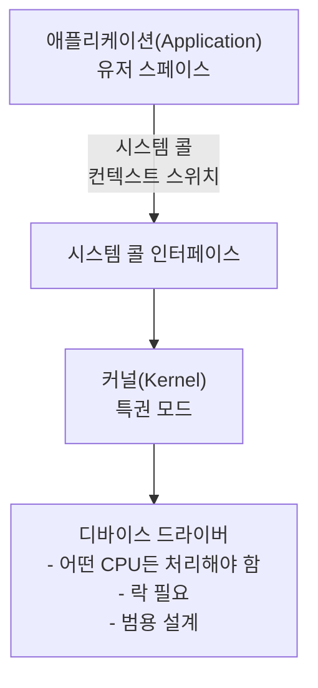
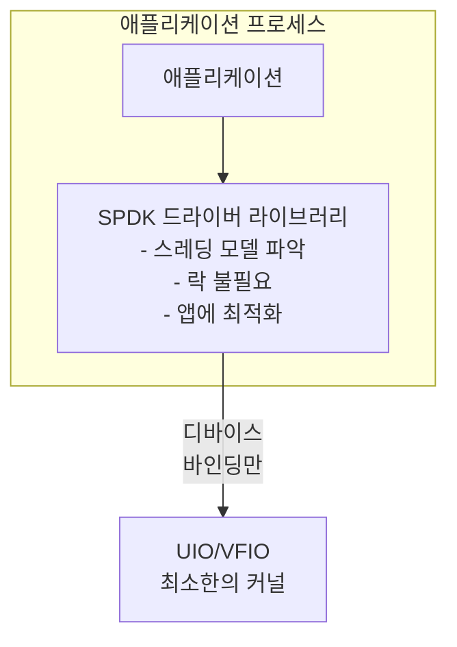
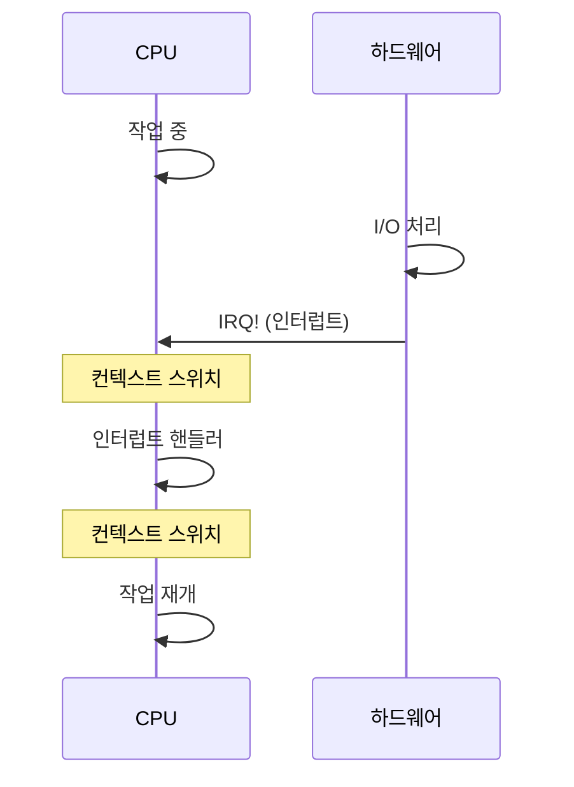
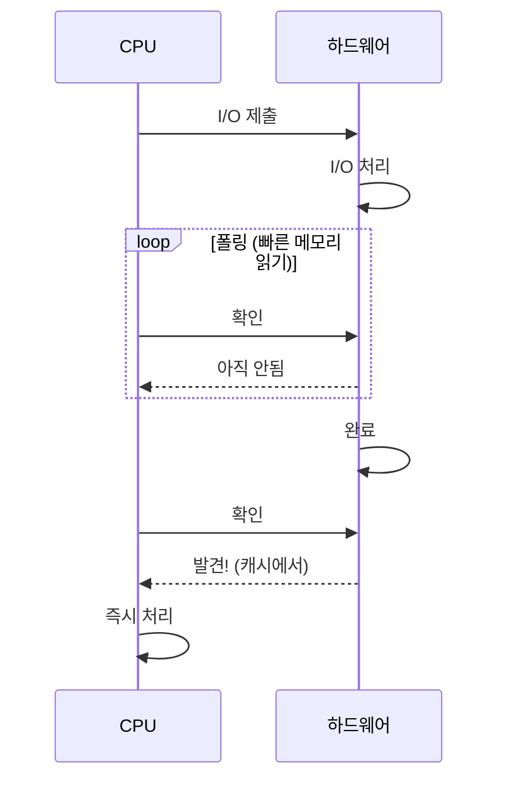
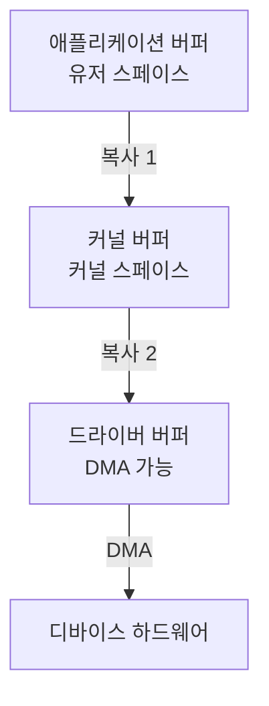
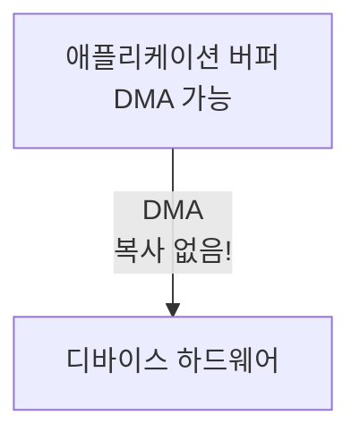
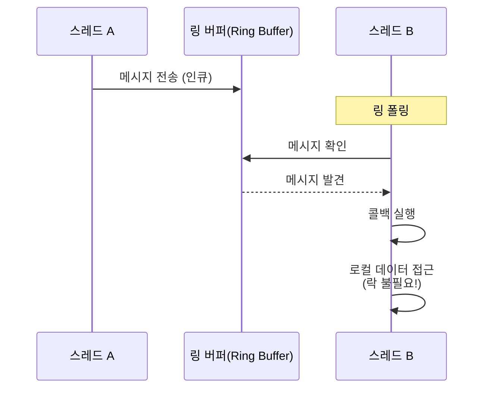

# 모듈 02: 핵심 원칙

**스테이지**: 1 (기초)
**난이도**: 초급
**예상 소요 시간**: 2시간
**선수 과목**: 모듈 01

**버전 이력**:
- v1.0 (2026-01-30): 초기 버전

---

## 학습 목표

이 모듈을 마치면 다음을 할 수 있습니다:
- SPDK의 다섯 가지 핵심 아키텍처 원칙 설명
- 유저스페이스 드라이버(Userspace Driver) 모델을 상세히 이해
- 폴링 모드(Polled Mode) 동작과 그 함의 설명
- 제로 카피(Zero-Copy) 데이터 이동 기법 설명
- 락프리 자료 구조(Lock-Free Data Structure)와 메시지 패싱(Message Passing) 이해
- 이 원칙들이 어떻게 함께 동작하는지 인식

---

## 개요

SPDK는 최대 성능을 달성하기 위해 함께 동작하는 다섯 가지 기본 아키텍처 원칙 위에 구축됩니다. 이 원칙들은 단순한 최적화가 아닙니다 - 스토리지 소프트웨어를 구축하는 근본적으로 다른 접근법을 나타냅니다.

이 원칙들을 깊이 이해하는 것은 매우 중요합니다. SPDK 애플리케이션을 구축할 때 내리는 모든 결정에 영향을 미치기 때문입니다. SPDK의 API가 왜 그런 모습인지, 왜 특정 패턴이 권장되는지, 어떤 트레이드오프를 하고 있는지를 설명해줍니다.

### 왜 이것이 중요한가

이 원칙들은 SPDK 개발자처럼 사고하는 데 필요한 멘탈 모델을 형성합니다. 이를 이해하지 못하면 SPDK 코드가 임의적이거나 혼란스럽게 보일 것입니다. 이 기초가 있으면 설계 결정이 명백하고 자연스럽게 느껴집니다.

---

## 핵심 개념

### 원칙 1: 유저스페이스 드라이버(Userspace Driver)

**정의**: 디바이스 드라이버를 커널에서 꺼내 애플리케이션 주소 공간으로 이동합니다.

#### 기술적 심층 분석

**커널 드라이버 아키텍처**:


**SPDK 유저스페이스 아키텍처**:


**핵심 메커니즘**:

1. **디바이스 언바인딩(Device Unbinding)**
   ```bash
   # 커널 제어 제거
   echo "0000:04:00.0" > /sys/bus/pci/drivers/nvme/unbind

   # 유저스페이스 프레임워크에 전달
   echo "0000:04:00.0" > /sys/bus/pci/drivers/vfio-pci/bind
   ```

2. **메모리 매핑 I/O (MMIO)**
   ```c
   // 디바이스 레지스터를 프로세스 메모리에 매핑
   void *bar = mmap(NULL, size, PROT_READ | PROT_WRITE,
                    MAP_SHARED, fd, offset);

   // 직접 하드웨어 접근 - 커널 없음!
   *(volatile uint32_t *)(bar + DOORBELL_REGISTER) = value;
   ```

3. **DMA(Direct Memory Access)**
   - 애플리케이션이 DMA 안전 메모리를 할당
   - 물리 주소로 디바이스 프로그래밍
   - 디바이스가 데이터를 직접 전송
   - 커널 버퍼 복사 없음

**장점**:
- ✅ 시스템 콜 오버헤드 없음
- ✅ 컨텍스트 스위치 없음
- ✅ 애플리케이션 특화 최적화
- ✅ 빠른 반복 및 디버깅
- ✅ 소프트웨어 계층 감소

**요구사항**:
- ⚠️ 루트 권한 (또는 capability 기반 접근)
- ⚠️ 독점 디바이스 제어
- ⚠️ 메모리가 고정(Pin)되고 DMA 안전해야 함

---

### 원칙 2: 폴링 모드 동작(Polled Mode Operation)

**정의**: 인터럽트를 기다리는 대신 I/O 완료를 지속적으로 확인합니다.

#### 폴링 동작 원리

**전통적인 인터럽트 기반 모델**:


**SPDK 폴링 모델**:


**구현 패턴**:
```c
// 전통적인 인터럽트 기반
int fd = open("/dev/nvme0n1", O_RDWR);
read(fd, buffer, size);  // 블로킹, 인터럽트로 깨어남

// SPDK 폴링 모드
void process_completions(void *ctx) {
    struct spdk_nvme_qpair *qpair = ctx;

    // 완료 확인 (하드웨어 큐 폴링)
    spdk_nvme_qpair_process_completions(qpair, 0);

    // 이 함수는 즉시 반환
    // 완료 시 콜백이 트리거됨
}

// 이벤트 루프에서 반복 호출
while (running) {
    process_completions(qpair);
    // 다른 작업 수행
}
```

**폴링이 빠른 이유**:

1. **캐시 이점**
   ```
   CPU 캐시 계층:
   L1 캐시 (4 사이클) ← 완료 큐가 여기 있을 가능성 높음
   L2 캐시 (12 사이클)
   L3 캐시 (30-40 사이클)
   메인 메모리 (100+ 사이클)
   ```
   - Intel DDIO가 NIC/SSD 업데이트를 L3 캐시에 유지
   - 폴링은 메인 메모리가 아닌 캐시에서 읽음
   - 인터럽트 경로보다 훨씬 빠름

2. **인터럽트 오버헤드 없음**
   ```
   인터럽트 비용:
   - CPU 상태 저장: ~100 사이클
   - 핸들러로 점프: ~50 사이클
   - 핸들러 실행: ~500 사이클
   - 상태 복원: ~100 사이클
   - 컨텍스트 재개: ~200 사이클
   ────────────────────────────────
   총계: ~950 사이클 (~0.3 μs)

   폴링 비용:
   - 메모리 읽기: 4-30 사이클 (<0.01 μs)
   ```

3. **예측 가능한 레이턴시**
   - 인터럽트 지터 없음
   - 스케줄러 간섭 없음
   - 일관된 성능

**트레이드오프**:

✅ **장점**:
- 초저 레이턴시
- 인터럽트 오버헤드 없음
- 예측 가능한 성능
- 더 나은 캐시 지역성

⚠️ **비용**:
- 폴링 코어에서 100% CPU 사용률
- CPU 코어 전용 필수
- 낮은 부하에서 비효율적
- 전력 소비 증가

**폴링이 적합한 경우**:
- 높은 처리량 워크로드 (>100K IOPS)
- 낮은 레이턴시 요구사항 (<50 μs)
- 예측 가능한 워크로드
- 전용 하드웨어 사용 가능

---

### 원칙 3: 제로 카피 데이터 이동(Zero-Copy Data Movement)

**정의**: 버퍼 간의 불필요한 데이터 복사를 제거합니다.

#### 전통적인 다중 복사 경로

**커널 I/O 스택**:


**비용**: 2회 메모리 복사 x 데이터 크기

**예시**:
```c
// 전통적인 읽기: 2회 복사!
char app_buffer[4096];
read(fd, app_buffer, 4096);

// 실제로 일어나는 일:
// 1. 디바이스가 커널 버퍼로 DMA
// 2. 커널이 app_buffer로 복사
```

#### SPDK 제로 카피 경로



**비용**: 0회 메모리 복사

**구현**:
```c
// DMA 가능 메모리 할당
void *buffer = spdk_dma_malloc(4096, 64, NULL);

// 이 버퍼로 직접 DMA
spdk_nvme_ns_cmd_read(ns, qpair, buffer, lba, 1,
                      read_complete, NULL, 0);

// 디바이스가 버퍼로 직접 DMA
// 커널 없음, 복사 없음!
```

**기술적 요구사항**:

1. **물리 메모리 연속성(Physical Memory Contiguity)**
   ```mermaid
   graph TD
       subgraph "가상 주소 공간 (분산될 수 있음)"
           V1["페이지 1"]
           V2["페이지 2"]
           V3["페이지 3"]
       end
       subgraph "물리 메모리 (DMA를 위해 연속이어야 함)"
           P1["페이지 1"] --> P2["페이지 2"] --> P3["페이지 3"]
       end
       V1 -.->|"매핑"| P1
       V2 -.->|"매핑"| P2
       V3 -.->|"매핑"| P3
   ```

2. **메모리 정렬(Memory Alignment)**
   ```c
   // 최적의 DMA를 위해 정렬 필수
   // 일반적으로 64바이트 정렬
   void *buffer = spdk_dma_malloc(
       size,      // 크기
       64,        // 정렬
       NULL       // 소켓 ID
   );
   ```

3. **메모리 고정(Memory Pinning)**
   - 페이지가 스왑되면 안 됨
   - 물리 주소가 안정적이어야 함
   - 휴지페이지(Hugepage)를 통해 달성

**장점**:
- ✅ 메모리 대역폭 사용 2배 감소
- ✅ 더 나은 캐시 활용
- ✅ 더 낮은 레이턴시
- ✅ CPU 사용량 감소

---

### 원칙 4: 락프리 자료 구조(Lock-Free Data Structures)

**정의**: 메시지 패싱(Message Passing)과 스레드별 리소스를 사용하여 락을 회피합니다.

#### 락 문제

**전통적인 멀티 스레드 접근법**:
```c
// 락이 있는 공유 자원
pthread_mutex_t lock = PTHREAD_MUTEX_INITIALIZER;
struct queue *shared_queue;

void thread_work(void) {
    pthread_mutex_lock(&lock);     // 경합 발생!
    process_queue(shared_queue);
    pthread_mutex_unlock(&lock);
}
```

**문제점**:
- 규모 증가에 따른 락 경합(Lock Contention)
- 캐시 라인 바운싱(Cache Line Bouncing)
- 예측 불가능한 레이턴시
- 감소된 병렬성

**락 경합 비용**:
```
1 스레드:   100% 효율성
2 스레드:    95% 효율성 (5% 락 오버헤드)
4 스레드:    85% 효율성 (15% 락 오버헤드)
8 스레드:    60% 효율성 (40% 락 오버헤드)
16 스레드:   30% 효율성 (70% 락 오버헤드!)
```

#### SPDK의 락프리 접근법

**패턴 1: 스레드별 리소스**
```c
// 각 스레드가 자신만의 큐 페어를 가짐
struct spdk_nvme_qpair *qpairs[NUM_THREADS];

void thread_init(int thread_id) {
    // 전용 큐 페어 할당
    qpairs[thread_id] = spdk_nvme_ctrlr_alloc_io_qpair(
        ctrlr, NULL, 0);
}

void thread_work(int thread_id) {
    // 락 필요 없음 - 독점 접근!
    spdk_nvme_qpair_process_completions(
        qpairs[thread_id], 0);
}
```

**패턴 2: 메시지 패싱(Message Passing)**
```c
// 스레드가 다른 스레드의 데이터에 접근하려 할 때
// 락 대신 메시지를 보냄

void thread_a_wants_data(void) {
    // 스레드 B에 메시지 전송
    spdk_thread_send_msg(thread_b,
                        do_work_on_thread_b,
                        context);
}

void do_work_on_thread_b(void *ctx) {
    // 스레드 B에서 실행됨
    // 스레드 B의 데이터에 안전하게 접근 가능
    // 락 필요 없음!
}
```

**메시지 패싱 구현**:


**락프리 링 버퍼(Lock-Free Ring Buffer)**:
```c
// DPDK 링 - 다중 생산자, 다중 소비자
struct rte_ring *ring;

// 생산자 (스레드 A)
rte_ring_enqueue(ring, message);

// 소비자 (스레드 B)
rte_ring_dequeue(ring, &message);

// 원자적 연산 사용, 락 없음!
```

**장점**:
- ✅ 선형적 확장성
- ✅ 예측 가능한 레이턴시
- ✅ 락 경합 없음
- ✅ 더 나은 캐시 지역성

---

### 원칙 5: 완료까지 실행(Run-to-Completion)

**정의**: 동작이 블로킹이나 양보 없이 완료될 때까지 실행됩니다.

#### 전통적인 블로킹 모델

```c
// 전통적인 블로킹 I/O
void process_request(struct request *req) {
    // 완료될 때까지 스레드 블로킹
    data = read_from_disk(req->offset, req->size);

    // 다시 블로킹
    result = process_data(data);

    // 한번 더 블로킹
    write_to_network(result);
}
// 스레드가 대부분의 시간 동안 블로킹됨!
```

#### SPDK 완료까지 실행 모델

```c
// 모든 동작이 비동기
void process_request(struct request *req) {
    // 읽기 시작, 즉시 반환
    spdk_bdev_read(bdev, channel, buffer, offset, size,
                   read_complete_callback, req);
    // 스레드는 다른 작업 계속 처리
}

void read_complete_callback(void *arg, int status) {
    struct request *req = arg;

    // 데이터 처리
    result = process_data(req->buffer);

    // 쓰기 시작, 즉시 반환
    write_to_network(result, write_complete_callback, req);
    // 콜백 완료, 스레드 계속
}

void write_complete_callback(void *arg, int status) {
    // 요청 완전히 처리됨
    complete_request(arg);
}
```

**특성**:

1. **논블로킹(Non-Blocking)**
   - sleep, wait, block 호출 없음
   - 모든 동작이 즉시 반환
   - 완료 시 콜백 호출

2. **상태 머신(State Machine)**
   ```
   요청 흐름:
   [제출] → [읽기 CB] → [처리 CB] → [쓰기 CB] → [완료]
      ↓          ↓            ↓             ↓
   (계속)     (계속)       (계속)        (계속)

   스레드가 절대 블로킹되지 않음!
   ```

3. **협력적 멀티태스킹(Cooperative Multitasking)**
   - 스레드가 언제 양보할지 결정
   - 선점(Preemption) 없음
   - 결정론적 스케줄링

**장점**:
- ✅ 최대 CPU 활용
- ✅ 컨텍스트 스위치 오버헤드 없음
- ✅ 예측 가능한 레이턴시
- ✅ 단순한 스레드 모델

**함의**:
- ⚠️ 블로킹 시스템 콜 사용 불가
- ⚠️ 표준 I/O 라이브러리 사용 불가
- ⚠️ 모든 곳에서 비동기 패턴 사용 필수
- ⚠️ 콜백이 복잡해질 수 있음

---

## 원칙들이 함께 동작하는 방식

### 전체 그림

```
┌─────────────────────────────────────────────┐
│         SPDK 애플리케이션                     │
│                                             │
│  ┌───────────────────────────────────┐    │
│  │  완료까지 실행 이벤트 루프          │    │
│  │                                    │    │
│  │  while (running) {                │    │
│  │    // 원칙 2: 폴링               │    │
│  │    poll_completions();            │    │
│  │                                    │    │
│  │    // 원칙 4: 메시지 패싱         │    │
│  │    process_messages();            │    │
│  │                                    │    │
│  │    // 비동기 콜백 처리             │    │
│  │    execute_callbacks();           │    │
│  │  }                                │    │
│  └───────────────────────────────────┘    │
│                                             │
│  ┌───────────────────────────────────┐    │
│  │  유저스페이스 NVMe 드라이버 (원칙 1) │  │
│  │  - 직접 MMIO 접근                  │   │
│  │  - 시스템 콜 없음                  │   │
│  └───────────────────────────────────┘    │
│                                             │
│  ┌───────────────────────────────────┐    │
│  │  DMA 버퍼 (원칙 3)               │    │
│  │  - 제로 카피 데이터 경로           │   │
│  │  - 고정된 메모리                   │   │
│  └───────────────────────────────────┘    │
└─────────────────────────────────────────────┘
         │
         │ 직접 하드웨어 접근
         ↓
┌─────────────────────────────────────────────┐
│         NVMe 디바이스                       │
└─────────────────────────────────────────────┘
```

### 시너지 예제

**시나리오**: NVMe SSD에서 4KB 읽기

```c
// 1. 제로 카피 버퍼 할당 (원칙 3)
void *buffer = spdk_dma_malloc(4096, 64, NULL);

// 2. 유저스페이스 드라이버에 제출 (원칙 1)
// 논블로킹, 즉시 반환 (원칙 5)
spdk_nvme_ns_cmd_read(ns, qpair, buffer, lba, 1,
                      read_complete, ctx, 0);

// 3. 스레드는 이벤트 루프에서 계속 (원칙 5)
while (!done) {
    // 4. 완료 폴링 (원칙 2)
    spdk_nvme_qpair_process_completions(qpair, 0);

    // 5. 메시지 처리 (원칙 4)
    spdk_thread_poll(thread);
}

// 6. 완료 시 콜백 호출
void read_complete(void *ctx, const struct spdk_nvme_cpl *cpl) {
    // 데이터가 이미 버퍼에 있음 (제로 카피)
    // 컨텍스트 스위치 없음, 락 없음
    process_data(ctx);
}
```

**결과**:
- 0회 컨텍스트 스위치
- 0개 락 획득
- 0회 메모리 복사
- ~10 μs 총 레이턴시

---

## 실습 예제

### 예제 1: 메시지 패싱 패턴

```c
struct my_context {
    struct spdk_thread *owner_thread;
    int data;
};

// 스레드 A가 스레드 B의 데이터를 수정하려 함
void thread_a_operation(struct my_context *ctx) {
    // ctx->data에 직접 접근하지 않음!
    // 소유자 스레드에 메시지 전송

    spdk_thread_send_msg(ctx->owner_thread,
                        modify_data_on_owner_thread,
                        ctx);
}

// 스레드 B(소유자)에서 실행
void modify_data_on_owner_thread(void *arg) {
    struct my_context *ctx = arg;

    // 안전하게 접근 - 소유자 스레드에 있으므로
    ctx->data += 10;

    // 락 필요 없음!
}
```

---

## 공통 패턴

### 패턴 1: 비동기 콜백 체인(Async Callback Chain)

```c
// 아래에서 위로 읽기 (SPDK에서 권장)

void final_callback(void *ctx) {
    // 모든 동작 완료
    send_response_to_client(ctx);
}

void write_callback(void *ctx, int status) {
    if (status == 0) {
        // 쓰기 성공, 이제 sync
        spdk_bdev_flush(bdev, channel,
                       final_callback, ctx);
    }
}

void read_callback(void *ctx, int status) {
    if (status == 0) {
        // 읽기 성공, 이제 쓰기
        spdk_bdev_write(bdev, channel, buffer,
                       offset, size,
                       write_callback, ctx);
    }
}

// 시작
void start_operation(void *ctx) {
    spdk_bdev_read(bdev, channel, buffer,
                   offset, size,
                   read_callback, ctx);
}
```

---

## 주의사항 및 모범 사례

### 흔한 실수

1. **실수**: SPDK 스레드에서 블로킹 함수 호출
   ```c
   // 잘못됨!
   void spdk_callback(void *ctx) {
       sleep(1);  // 전체 리액터 블로킹!
       read(fd, buf, size);  // 블로킹!
   }
   ```
   **올바른 방법**: 비동기 동작만 사용
   ```c
   void spdk_callback(void *ctx) {
       // SPDK의 비동기 파일 I/O 또는 타이머 사용
       spdk_poller_register(delayed_work, ctx, 1000000);
   }
   ```

2. **실수**: 메시지 없이 스레드 간 데이터 공유
   ```c
   // 잘못됨!
   shared_counter++;  // 레이스 컨디션(Race Condition)!
   ```
   **올바른 방법**: 메시지 패싱 사용
   ```c
   spdk_thread_send_msg(owner_thread, increment_counter, ctx);
   ```

3. **실수**: I/O 버퍼에 일반 malloc 사용
   ```c
   // 잘못됨!
   void *buffer = malloc(4096);
   spdk_bdev_read(bdev, channel, buffer, ...);  // DMA 안전하지 않음!
   ```
   **올바른 방법**: spdk_dma_malloc 사용
   ```c
   void *buffer = spdk_dma_malloc(4096, 64, NULL);
   ```

### 모범 사례

1. **원칙**: 하나의 리소스, 하나의 소유자
   **적용**: 각 큐 페어를 정확히 하나의 스레드에 할당

2. **원칙**: 큰 데이터가 아닌 작은 메시지
   **적용**: 데이터가 아닌 포인터와 컨텍스트를 전달

3. **원칙**: 효율적으로 폴링
   **적용**: 동작을 배치(Batch)하고, 매 제출 후 폴링하지 않기

---

## 이해도 점검

1. **SPDK는 왜 인터럽트 대신 폴링을 사용하는가?**
   - 성능과 레이턴시 양 측면을 고려하세요

2. **제로 카피 I/O의 세 가지 요구사항은?**
   - DMA에 필요한 메모리 속성을 생각하세요

3. **메시지 패싱은 어떻게 락을 회피하는가?**
   - 데이터 소유권과 실행 컨텍스트를 고려하세요

4. **완료까지 실행의 트레이드오프는?**
   - 프로그래밍 복잡성 vs 성능을 생각하세요

5. **SPDK에서 표준 라이브러리 I/O를 사용할 수 없는 이유는?**
   - 시스템 콜의 블로킹 특성을 고려하세요

---

## 추가 리소스

- **SPDK 소스**:
  - `lib/thread/thread.c` - 스레딩 구현
  - `lib/nvme/nvme_qpair.c` - 폴링 구현
- **공식 문서**:
  - [Concurrency Model](../../doc/concurrency.md)
  - [Memory Management](../../doc/memory.md)
- **관련 모듈**:
  - 이전: [01-S1-Why-SPDK-Exists.md](./01-S1-Why-SPDK-Exists.md)
  - 다음: [03-S1-Architecture-Overview.md](./03-S1-Architecture-Overview.md)

---

## 요약

SPDK의 다섯 가지 핵심 원칙은 통합된 아키텍처를 형성합니다:

1. **유저스페이스 드라이버**: 커널 오버헤드 제거
2. **폴링 모드**: 인터럽트 레이턴시 제거
3. **제로 카피**: 데이터 이동 제거
4. **락프리**: 선형적 확장 가능
5. **완료까지 실행**: CPU 효율성 극대화

**핵심 통찰**: 이 원칙들은 독립적인 최적화가 아닙니다 - 서로를 강화합니다. 유저스페이스가 폴링을 가능하게 하고, 폴링이 제로 카피를 가능하게 하고, 락프리가 완료까지 실행을 가능하게 하며, 모든 것이 최대 성능을 위해 함께 동작합니다.

**트레이드오프**: 더 높은 성능과 효율성의 대가:
- 전용 CPU 코어
- 다른 프로그래밍 모델
- 독점 디바이스 접근
- 더 복잡한 애플리케이션 로직

이 원칙들을 이해하는 것은 이후의 모든 것에 필수적입니다. 모든 SPDK API, 모든 설계 패턴, 모든 모범 사례가 이 다섯 가지 기초에서 비롯됩니다.

**다음 모듈**: [03-S1-Architecture-Overview.md](./03-S1-Architecture-Overview.md) - 이 원칙들이 SPDK의 아키텍처를 어떻게 형성하는지 살펴봅니다

---

*모듈 02 끝*
