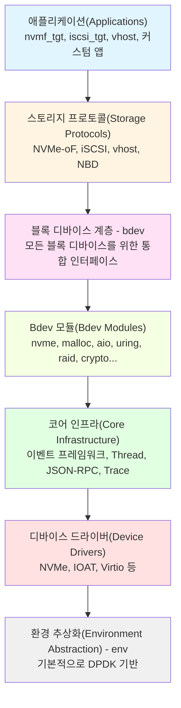
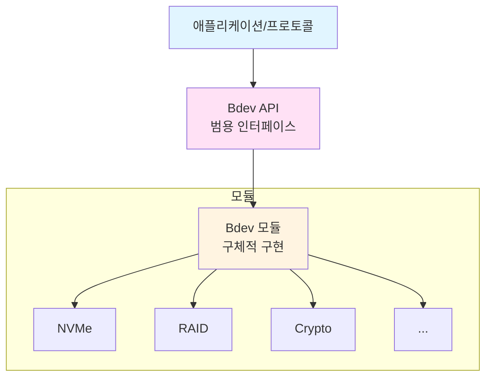
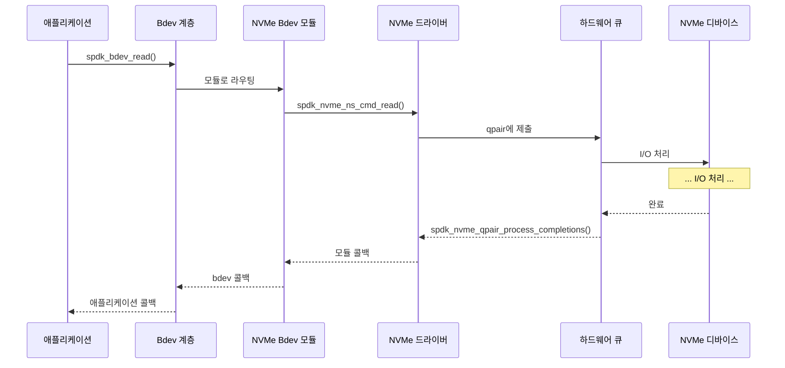

# 모듈 03: 아키텍처 개요

**스테이지**: 1 (기초)
**난이도**: 초급
**예상 소요 시간**: 3시간
**선수 과목**: 모듈 01, 모듈 02

**버전 이력**:
- v1.0 (2026-01-30): 초기 버전

---

## 학습 목표

이 모듈을 마치면 다음을 할 수 있습니다:
- SPDK 코드베이스 구조 탐색
- 계층화된 아키텍처 이해
- 각 주요 컴포넌트의 역할 파악
- 컴포넌트 간 상호작용 방식 설명
- SPDK 라이브러리를 기능에 매핑
- 모듈 시스템 이해

---

## 개요

SPDK의 아키텍처는 관심사의 명확한 분리와 컴포넌트 간의 잘 정의된 인터페이스로 신중하게 계층화되어 있습니다. 이 아키텍처를 이해하는 것은 코드베이스를 탐색하고, 애플리케이션을 구축하고, 효과적으로 기여하는 데 필수적입니다.

### 왜 이것이 중요한가

SPDK는 수십 개의 라이브러리와 모듈에 걸쳐 약 200,000줄의 C 코드를 포함합니다. 아키텍처를 이해하지 못하면 코드베이스에서 길을 잃게 됩니다. 이 멘탈 맵이 있으면 필요한 것을 정확히 어디서 찾을 수 있고 컴포넌트들이 어떻게 맞물리는지 알 수 있습니다.

---

## 핵심 개념

### 개념 1: 계층화된 아키텍처(Layered Architecture)

SPDK는 깔끔한 계층 설계를 따릅니다:



**핵심 특성**:
- 각 계층은 아래 계층에만 의존
- 계층 간 깔끔한 인터페이스
- 각 계층의 컴포넌트를 교체 가능
- 모듈화되고 확장 가능

---

### 개념 2: 디렉토리 구조

**최상위 구조**:

```
spdk/
├── lib/              ← 핵심 라이브러리
├── module/           ← 플러그인 모듈
├── app/              ← 완전한 애플리케이션
├── include/          ← 공개 API 헤더
├── examples/         ← 참조 코드
├── scripts/          ← 유틸리티
├── test/             ← 테스트 모음
├── doc/              ← 문서
└── dpdk/             ← DPDK 서브모듈
```

**핵심 원칙**: `lib/`는 핵심 기능을, `module/`은 플러그인 확장을 포함

---

### 개념 3: 라이브러리 구성

**핵심 라이브러리** (`lib/` 디렉토리):

| 라이브러리 | 용도 | 공개 헤더 |
|-----------|------|----------|
| `nvme` | NVMe 드라이버 | `spdk/nvme.h` |
| `bdev` | 블록 디바이스 추상화 | `spdk/bdev.h` |
| `nvmf` | NVMe-oF 타겟 라이브러리 | `spdk/nvmf.h` |
| `iscsi` | iSCSI 타겟 라이브러리 | `spdk/iscsi.h` |
| `vhost` | Vhost 타겟 라이브러리 | `spdk/vhost.h` |
| `event` | 애플리케이션 프레임워크 | `spdk/event.h` |
| `thread` | 스레딩 추상화 | `spdk/thread.h` |
| `json` | JSON 파서 | `spdk/json.h` |
| `jsonrpc` | JSON-RPC 서버 | `spdk/jsonrpc.h` |
| `util` | 유틸리티 함수 | `spdk/util.h` |
| `log` | 로깅 서브시스템 | `spdk/log.h` |
| `trace` | 트레이싱 프레임워크 | `spdk/trace.h` |

**각 라이브러리**:
- 자기 완결적 기능
- `include/spdk/`에 명확한 공개 API
- `lib/[name]/`에 내부 헤더
- `libspdk_[name].a`로 컴파일

---

### 개념 4: 모듈 시스템

**플러그인 모듈** (`module/` 디렉토리):

```
module/
├── bdev/              ← 블록 디바이스 모듈
│   ├── nvme/         ← NVMe bdev
│   ├── malloc/       ← RAM 디스크
│   ├── aio/          ← Linux AIO
│   ├── uring/        ← io_uring
│   ├── raid/         ← 소프트웨어 RAID
│   ├── crypto/       ← 암호화
│   ├── compress/     ← 압축
│   └── ...
├── accel/             ← 가속 모듈
└── scheduler/         ← 스레드 스케줄러
```

**모듈 특성**:
- 런타임에 플러그인 가능
- 코어 프레임워크에 등록
- 모듈 인터페이스 규약 준수
- 별도 빌드 가능

---

## 아키텍처 심층 분석

### 계층 1: 환경 추상화(Environment Abstraction, env)

**용도**: OS 및 하드웨어 세부사항 추상화

**위치**: `lib/env_dpdk/`

**책임**:
- 메모리 할당 (휴지페이지)
- PCI 디바이스 열거
- 스레드 생성 및 어피니티(Affinity)
- 메모리 배리어(Memory Barrier) 및 원자 연산(Atomic)
- DMA 메모리 관리

**주요 API**:
```c
// 메모리
void *spdk_dma_malloc(size_t size, size_t align, uint64_t *phys_addr);
void spdk_dma_free(void *buf);

// PCI
int spdk_pci_enumerate(struct spdk_pci_driver *driver,
                      spdk_pci_enum_cb enum_cb, void *ctx);

// 스레드
uint32_t spdk_env_get_current_core(void);
```

**DPDK 통합**:
```
SPDK env 계층
      ↓
  DPDK EAL (Environment Abstraction Layer)
      ↓
  운영체제
```

---

### 계층 2: 디바이스 드라이버

#### NVMe 드라이버 (`lib/nvme/`)

**용도**: 유저스페이스 NVMe 드라이버

**핵심 컴포넌트**:
```c
// 컨트롤러 관리
struct spdk_nvme_ctrlr;
struct spdk_nvme_ns;  // 네임스페이스(Namespace)

// 큐 페어(Queue Pair)
struct spdk_nvme_qpair;

// 커맨드
int spdk_nvme_ns_cmd_read(struct spdk_nvme_ns *ns,
                         struct spdk_nvme_qpair *qpair,
                         void *buffer, uint64_t lba,
                         uint32_t lba_count,
                         spdk_nvme_cmd_cb cb, void *ctx,
                         uint32_t flags);
```

**아키텍처**:
```
애플리케이션
    ↓
NVMe 드라이버 API (spdk_nvme_*)
    ↓
큐 페어 관리
    ↓
NVMe 커맨드 제출
    ↓
하드웨어 완료 폴링
```

#### 기타 드라이버

| 드라이버 | 위치 | 용도 |
|---------|------|------|
| IOAT | `lib/ioat/` | 복사용 DMA 엔진 |
| Virtio | `lib/virtio/` | Virtio 디바이스 |
| VMD | `lib/vmd/` | Intel Volume Management |

---

### 계층 3: 코어 인프라

#### 스레드 추상화 (`lib/thread/`)

**용도**: 경량 스레딩 모델

**핵심 추상화**:
```c
// 스레드
struct spdk_thread;
struct spdk_thread *spdk_thread_create(const char *name, ...);
void spdk_thread_poll(struct spdk_thread *thread);

// 폴러(Poller)
struct spdk_poller;
struct spdk_poller *spdk_poller_register(spdk_poller_fn fn,
                                         void *arg,
                                         uint64_t period_us);

// 메시지
void spdk_thread_send_msg(const struct spdk_thread *thread,
                         spdk_msg_fn fn, void *ctx);

// I/O 채널
struct spdk_io_channel;
struct spdk_io_channel *spdk_get_io_channel(void *io_device);
```

**스레딩 모델**:
```
SPDK 스레드 (경량, 스택 없음)
    ↓
시스템 스레드(pthread)에서 실행
    ↓
CPU 코어에 고정
    ↓
작업 폴링 (폴러 + 메시지)
```

#### 이벤트 프레임워크 (`lib/event/`)

**용도**: 애플리케이션 라이프사이클 관리

**핵심 컴포넌트**:
```c
// 애플리케이션 구조체
struct spdk_app_opts {
    const char *name;
    const char *json_config_file;
    const char *rpc_addr;
    int shutdown_cb;
    // ...
};

// 애플리케이션 진입점
int spdk_app_start(struct spdk_app_opts *opts,
                  spdk_app_start_cb start_cb,
                  void *ctx);

// 종료
void spdk_app_stop(int rc);
```

**애플리케이션 흐름**:
```
main()
    ↓
spdk_app_start()
    ↓
서브시스템 초기화
    ↓
RPC 서버 시작
    ↓
start_cb 호출 (애플리케이션 코드)
    ↓
이벤트 루프 (리액터 폴링)
    ↓
spdk_app_stop()
    ↓
정리 및 종료
```

#### JSON-RPC (`lib/jsonrpc/`)

**용도**: 원격 설정 및 관리

**핵심 기능**:
- JSON 기반 RPC 프로토콜
- HTTP 트랜스포트
- 메서드 등록
- 비동기 요청 처리

```c
// RPC 메서드 등록
SPDK_RPC_REGISTER("bdev_get_bdevs", rpc_bdev_get_bdevs,
                 SPDK_RPC_RUNTIME);

// RPC 핸들러
static void rpc_bdev_get_bdevs(struct spdk_jsonrpc_request *request,
                               const struct spdk_json_val *params) {
    // 요청 처리
    // JSON 응답 반환
    spdk_jsonrpc_send_response(request, w);
}
```

---

### 계층 4: 블록 디바이스 계층 (bdev)

**용도**: 통합 블록 디바이스 인터페이스

**위치**: `lib/bdev/`

**핵심 추상화**:
```c
// 블록 디바이스
struct spdk_bdev;

// I/O 채널 (스레드별)
struct spdk_bdev_io_channel;

// 디바이스 디스크립터(Device Descriptor)
struct spdk_bdev_desc;

// I/O 동작
int spdk_bdev_read(struct spdk_bdev_desc *desc,
                  struct spdk_io_channel *ch,
                  void *buf, uint64_t offset, uint64_t nbytes,
                  spdk_bdev_io_completion_cb cb, void *cb_arg);
```

**Bdev 아키텍처**:


**장점**:
- ✅ 모든 스토리지를 위한 통일된 인터페이스
- ✅ 모듈 적층 가능 (NVMe 위에 crypto 위에 RAID)
- ✅ 새로운 백엔드 타입 추가 용이
- ✅ 상위 계층에 투명

---

### 계층 5: Bdev 모듈

**주요 Bdev 모듈**:

| 모듈 | 용도 | 위치 |
|------|------|------|
| `nvme` | NVMe 디바이스 | `module/bdev/nvme/` |
| `malloc` | RAM 디스크 | `module/bdev/malloc/` |
| `aio` | Linux AIO | `module/bdev/aio/` |
| `uring` | io_uring | `module/bdev/uring/` |
| `null` | Null 디바이스 | `module/bdev/null/` |
| `raid` | 소프트웨어 RAID | `module/bdev/raid/` |
| `crypto` | 암호화 | `module/bdev/crypto/` |
| `compress` | 압축 | `module/bdev/compress/` |
| `lvol` | 논리 볼륨(Logical Volume) | `lib/lvol/` |
| `passthru` | 필터 예제 | `module/bdev/passthru/` |

**모듈 인터페이스**:
```c
// 모든 bdev 모듈이 구현하는 것:
struct spdk_bdev_module {
    const char *name;

    // 라이프사이클
    int (*module_init)(void);
    void (*module_fini)(void);

    // 설정
    int (*get_ctx_size)(void);

    // I/O 경로
    void (*submit_request)(struct spdk_io_channel *ch,
                          struct spdk_bdev_io *bdev_io);
};

// 모듈 등록
SPDK_BDEV_MODULE_REGISTER(name, &module_ops)
```

---

### 계층 6: 스토리지 프로토콜

#### NVMe-oF 타겟 (`lib/nvmf/`)

**용도**: bdev를 NVMe-oF로 내보내기

**아키텍처**:
```
┌─────────────────────────────────────┐
│         NVMe-oF 이니시에이터         │
└──────────────┬──────────────────────┘
               ↓ (RDMA/TCP)
┌─────────────────────────────────────┐
│        NVMe-oF 타겟 (tgt)          │
│  ┌─────────────────────────────┐   │
│  │   서브시스템 관리             │   │
│  └─────────────────────────────┘   │
│  ┌─────────────────────────────┐   │
│  │   트랜스포트 (RDMA/TCP)      │   │
│  └─────────────────────────────┘   │
└──────────────┬──────────────────────┘
               ↓
┌─────────────────────────────────────┐
│          Bdev 계층                  │
└─────────────────────────────────────┘
```

**핵심 개념**:
- **서브시스템(Subsystem)**: 네임스페이스의 집합
- **트랜스포트(Transport)**: RDMA, TCP, 또는 VFIO
- **컨트롤러(Controller)**: 이니시에이터별 연결

#### iSCSI 타겟 (`lib/iscsi/`)

**용도**: bdev를 iSCSI로 내보내기

**컴포넌트**:
- 포탈 그룹(Portal Group, 네트워크 리스너)
- 타겟 노드(Target Node, 스토리지 타겟)
- 논리 유닛(LUN)
- 연결 관리

#### Vhost 타겟 (`lib/vhost/`)

**용도**: bdev를 VM에 vhost를 통해 내보내기

**종류**:
- vhost-blk: 블록 디바이스
- vhost-scsi: SCSI 디바이스
- vhost-user 프로토콜

---

### 계층 7: 애플리케이션

**사전 구축된 애플리케이션** (`app/` 디렉토리):

| 애플리케이션 | 용도 | 바이너리 |
|-------------|------|---------|
| nvmf_tgt | NVMe-oF 타겟 | `spdk_tgt` |
| iscsi_tgt | iSCSI 타겟 | `iscsi_tgt` |
| vhost | Vhost 타겟 | `vhost` |
| spdk_nvme_perf | NVMe 벤치마크 | `spdk_nvme_perf` |
| spdk_nvme_identify | 디바이스 정보 | `spdk_nvme_identify` |

**애플리케이션 구조**:
```c
// 일반적인 SPDK 애플리케이션
int main(int argc, char **argv) {
    struct spdk_app_opts opts = {};

    // 옵션 초기화
    spdk_app_opts_init(&opts, sizeof(opts));
    opts.name = "my_app";
    opts.json_config_file = "config.json";

    // 애플리케이션 시작
    rc = spdk_app_start(&opts, my_app_start, NULL);

    spdk_app_fini();
    return rc;
}

void my_app_start(void *ctx) {
    // 애플리케이션 초기화

    // 종료 콜백 등록
    spdk_subsystem_init(subsystem_init_complete, NULL);
}
```

---

## 컴포넌트 상호작용

### 예제: 읽기 I/O 흐름



**핵심 포인트**:
- 모든 계층에서 비동기
- 블로킹 호출 없음
- 콜백이 위로 체이닝
- 전 구간 제로 카피

---

## 실습 예제

### 예제 1: 코드 찾기

**질문**: NVMe 커맨드 제출은 어디에 구현되어 있는가?

**답**:
1. NVMe 드라이버는 `lib/nvme/`에 위치
2. 커맨드 제출은 `lib/nvme/nvme_qpair.c`에 있음
3. 함수: `nvme_qpair_submit_request()`

**질문**: bdev 모듈은 어디에서 등록되는가?

**답**:
1. Bdev 모듈은 `module/bdev/`에 위치
2. 각 모듈에 `bdev_[name].c`가 있음
3. 등록 매크로: `SPDK_BDEV_MODULE_REGISTER()`

---

## 공통 패턴

### 패턴 1: 모듈 등록(Module Registration)

```c
// 모든 모듈이 따르는 패턴

// 모듈 동작 정의
static struct spdk_bdev_module my_module = {
    .name = "my_bdev",
    .module_init = my_module_init,
    .module_fini = my_module_fini,
    .submit_request = my_submit_request,
};

// 컴파일 시 등록
SPDK_BDEV_MODULE_REGISTER(my_bdev, &my_module)

// 프레임워크가 호출하는 함수
static int my_module_init(void) {
    // 모듈 초기화
    return 0;
}

static void my_module_fini(void) {
    // 모듈 정리
}

static void my_submit_request(struct spdk_io_channel *ch,
                              struct spdk_bdev_io *bdev_io) {
    // I/O 요청 처리
}
```

---

## 주의사항 및 모범 사례

### 흔한 실수

1. **실수**: `lib/`와 `module/` 혼동
   **왜 잘못인가**: 용도와 빌드 시스템이 다름
   **올바른 접근법**: 핵심 기능 → `lib/`, 플러그인 → `module/`

2. **실수**: bdev 계층 대신 드라이버 API를 직접 호출
   **왜 잘못인가**: 추상화의 이점을 무시
   **올바른 접근법**: 이식성을 위해 bdev API 사용

3. **실수**: 헤더 구성을 이해하지 못함
   **왜 잘못인가**: 내부 API를 잘못 사용할 수 있음
   **올바른 접근법**: `include/spdk/*.h` 공개 API만 사용

### 모범 사례

1. **사례**: 기존 패턴을 따르기
   **근거**: 일관성이 코드를 유지보수 가능하게 함

2. **사례**: 적절한 추상화 계층 사용
   **근거**: 이미 존재하는 것을 다시 만들지 않기

3. **사례**: 처음부터 작성하기 전에 예제 확인
   **근거**: 동작하는 코드에서 배우기

---

## 이해도 점검

1. **`lib/`와 `module/`의 차이점은?**

2. **OS 추상화를 제공하는 계층은?**

3. **bdev 모듈은 어떻게 자신을 등록하는가?**

4. **이벤트 프레임워크의 목적은?**

5. **NVMe-oF 트랜스포트 코드를 어디서 찾을 수 있는가?**

---

## 추가 리소스

- **SPDK 소스**:
  - `doc/overview.md` - 공식 아키텍처 문서
  - `lib/` - 핵심 라이브러리
  - `module/` - 플러그인 모듈
- **관련 모듈**:
  - 이전: [02-S1-Core-Principles.md](./02-S1-Core-Principles.md)
  - 다음: [04-S1-Threading-Model.md](./04-S1-Threading-Model.md)

---

## 요약

SPDK의 아키텍처는 모듈성과 성능을 위해 신중하게 계층화되어 있습니다:

**7개 계층**:
1. 환경 (DPDK 통합)
2. 드라이버 (NVMe, IOAT 등)
3. 인프라 (Thread, Event, RPC)
4. Bdev 계층 (통합 인터페이스)
5. Bdev 모듈 (NVMe, RAID, Crypto 등)
6. 프로토콜 (NVMe-oF, iSCSI, vhost)
7. 애플리케이션 (타겟, 도구)

**주요 디렉토리**:
- `lib/` - 핵심 라이브러리
- `module/` - 플러그인 모듈
- `app/` - 애플리케이션
- `include/spdk/` - 공개 API

**아키텍처의 이점**:
- 명확한 관심사 분리
- 모듈화되고 확장 가능
- 깔끔한 인터페이스
- 쉬운 탐색

이 아키텍처를 이해하는 것이 SPDK의 로드맵입니다. 이제 어디서 무엇을 찾고 컴포넌트들이 어떻게 연결되는지 알게 되었습니다.

**다음 모듈**: [04-S1-Threading-Model.md](./04-S1-Threading-Model.md) - SPDK 스레딩 심층 분석

---

*모듈 03 끝*
