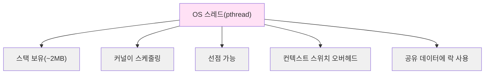
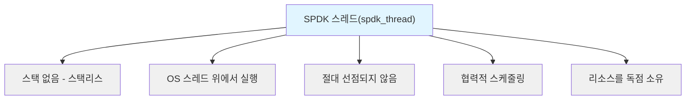
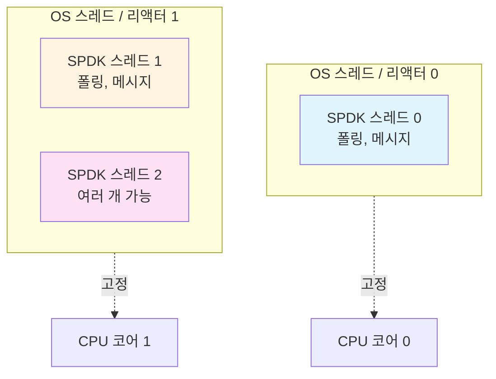
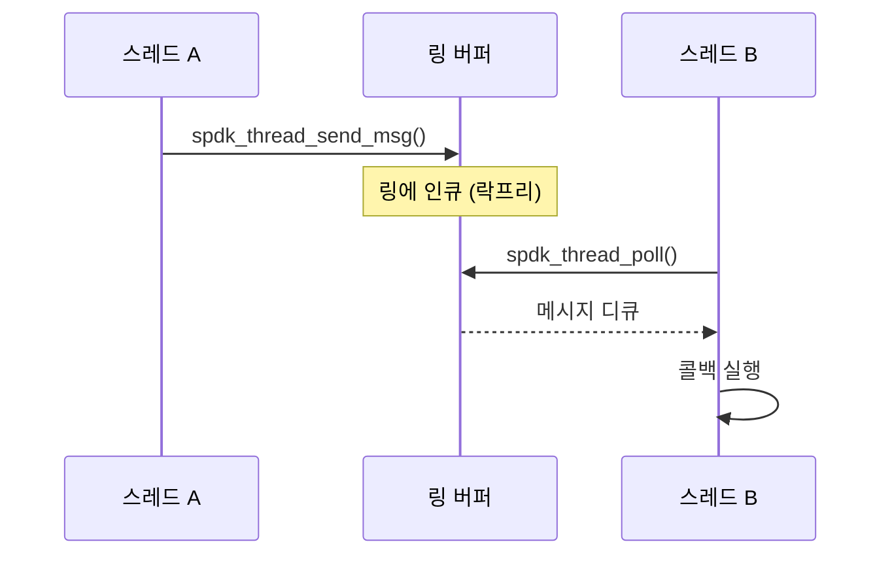
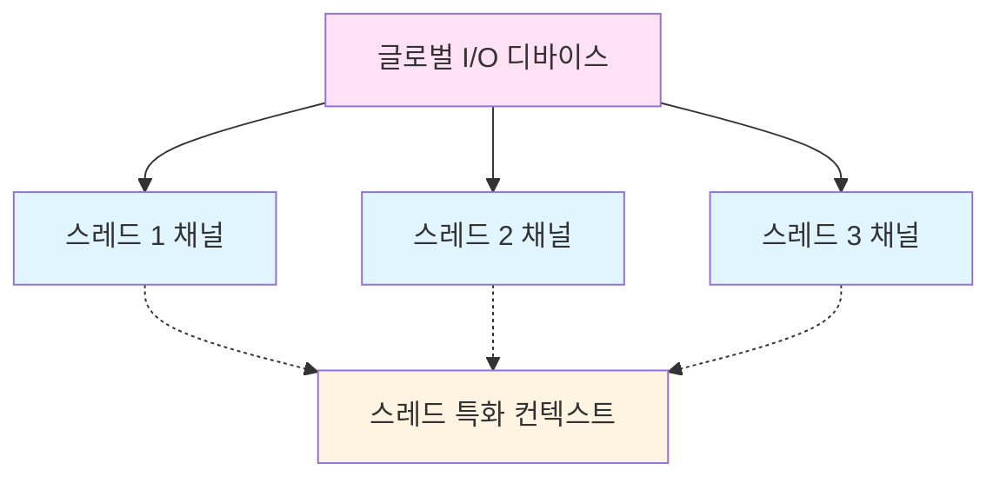

# 모듈 04: 스레딩 모델

**스테이지**: 1 (기초)
**난이도**: 초급
**예상 소요 시간**: 3시간
**선수 과목**: 모듈 01, 모듈 02, 모듈 03

**버전 이력**:
- v1.0 (2026-01-30): 초기 버전

---

## 학습 목표

이 모듈을 마치면 다음을 할 수 있습니다:
- SPDK 스레드와 OS 스레드를 구별
- 리액터 패턴(Reactor Pattern) 이해
- 폴러(Poller)와 그 사용 사례 설명
- 스레드 간 메시지 패싱(Message Passing) 설명
- I/O 채널과 디바이스 이해
- 스레드 라이프사이클 관리 인식

---

## 개요

SPDK의 스레딩 모델은 전통적인 멀티 스레드 프로그래밍과 근본적으로 다릅니다. 락이 있는 OS 스레드 대신, SPDK는 경량 스레드, 메시지 패싱, 스레드별 리소스를 사용하여 락프리 동작을 구현합니다.

### 왜 이것이 중요한가

스레딩 모델은 SPDK의 락프리 아키텍처의 기반입니다. 이를 잘못 이해하면 버그, 성능 문제, 잘못된 API 사용으로 이어집니다. 이것을 마스터하면 나머지 모든 것이 제자리에 놓입니다.

---

## 핵심 개념

### 개념 1: SPDK 스레드 vs OS 스레드

**전통적인 OS 스레드**:


**SPDK 스레드**:


**주요 차이점**:

| 측면 | OS 스레드 | SPDK 스레드 |
|------|-----------|-------------|
| 스택 | 있음 (~2MB) | 없음 |
| 스케줄링 | 선점적(Preemptive) | 협력적(Cooperative) |
| 컨텍스트 스위치 | 비용 큼 | 없음 |
| 락 | 필요 | 불필요 |
| 이동 가능 | 아니오 | 예 (OS 스레드 간) |
| 무게 | 무거움 | 경량 |

**아키텍처**:


---

### 개념 2: 리액터(Reactor)

**정의**: 리액터는 SPDK 스레드를 실행하는 OS 스레드입니다.

**리액터 구조**:
```c
// 간소화된 리액터 개념
struct spdk_reactor {
    uint32_t lcore;                    // CPU 코어
    struct spdk_thread *thread;        // 현재 스레드
    struct spdk_ring *messages;        // 메시지 큐
    bool in_interrupt;                 // 인터럽트 모드 플래그
};
```

**리액터 이벤트 루프**:
```c
// 리액터 루프 의사 코드
void reactor_run(struct spdk_reactor *reactor) {
    while (!g_shutdown) {
        // 이 리액터의 모든 스레드 폴링
        for_each_thread(reactor, thread) {
            spdk_thread_poll(thread);
        }

        // 새로운 메시지 확인
        process_reactor_messages(reactor);

        // 선택적: 시그널, 타이머 등 확인
    }
}
```

**핵심 특성**:
- CPU 코어당 하나의 리액터
- 특정 코어에 고정 (CPU 어피니티)
- 지속적으로 실행 (100% CPU)
- 라운드 로빈으로 스레드 폴링
- 리액터 간 메시지 처리

**리액터 초기화**:
```c
// 애플리케이션이 코어 마스크 지정
struct spdk_app_opts opts = {};
opts.name = "myapp";
opts.reactor_mask = "0xF";  // 코어 0,1,2,3 사용

spdk_app_start(&opts, app_start, NULL);
```

---

### 개념 3: SPDK 스레드

**스레드 추상화**:
```c
struct spdk_thread {
    char name[256];
    struct spdk_cpuset cpumask;
    struct spdk_thread_stats stats;

    // 메시지 큐
    struct spdk_ring *messages;

    // 폴러
    TAILQ_HEAD(, spdk_poller) active_pollers;
    TAILQ_HEAD(, spdk_poller) paused_pollers;

    // I/O 채널
    TAILQ_HEAD(, spdk_io_channel) io_channels;
};
```

**스레드 생성**:
```c
struct spdk_thread *thread;

// 경량 스레드 생성
thread = spdk_thread_create("my_thread", NULL);

// 스레드가 생성되었지만 아직 실행되지 않음
// 리액터에 의해 폴링되어야 함
```

**스레드 실행**:
```c
// 리액터가 이를 반복적으로 호출
int spdk_thread_poll(struct spdk_thread *thread) {
    // 1. 메시지 처리
    process_messages(thread);

    // 2. 활성 폴러 실행
    run_pollers(thread);

    // 3. 타이머 이벤트 처리
    process_timers(thread);

    return work_done;
}
```

**스레드 소멸**:
```c
// 소멸 마킹
spdk_thread_exit(thread);

// 실제 소멸은 정리 후 발생
// (콜백, 채널 정리 등)
spdk_thread_destroy(thread);
```

---

### 개념 4: 폴러(Poller)

**정의**: 작업을 확인하기 위해 반복적으로 호출되는 함수입니다.

**폴러 종류**:

1. **주기적 폴러(Periodic Poller)** - 일정 간격으로 호출
2. **바쁜 폴러(Busy Poller)** - 매 반복마다 호출 (period = 0)
3. **일시정지 폴러(Paused Poller)** - 일시적으로 비활성화

**폴러 구조**:
```c
struct spdk_poller {
    spdk_poller_fn fn;      // 호출할 함수
    void *arg;               // 컨텍스트
    uint64_t period_ticks;   // 0 = 바쁜 폴링
    uint64_t next_run_tick;  // 다음 실행 시각
};
```

**폴러 생성**:
```c
// 바쁜 폴러 (매 반복마다 실행)
struct spdk_poller *poller;
poller = spdk_poller_register(
    my_poll_function,  // 함수
    ctx,               // 컨텍스트
    0                  // 0 = 바쁜 폴링
);

// 주기적 폴러 (1ms마다 실행)
poller = spdk_poller_register(
    periodic_function,
    ctx,
    1000               // 1000 마이크로초
);
```

**폴러 함수**:
```c
// 폴러 콜백 시그니처
static int my_poll_function(void *ctx) {
    struct my_context *my_ctx = ctx;

    // 작업 수행
    bool found_work = check_for_completions(my_ctx);

    // 반환값은 작업이 수행되었는지 나타냄
    if (found_work) {
        return SPDK_POLLER_BUSY;  // 적극적으로 계속 폴링
    } else {
        return SPDK_POLLER_IDLE;  // 작업 없음
    }
}
```

**폴러 관리**:
```c
// 폴러 일시정지
spdk_poller_pause(poller);

// 폴러 재개
spdk_poller_resume(poller);

// 폴러 해제 (소멸)
spdk_poller_unregister(&poller);
```

**일반적인 사용 사례**:

| 사용 사례 | 폴러 종류 | 주기 |
|----------|----------|------|
| NVMe 완료 폴링 | 바쁜 폴러 | 0 |
| 타임아웃 확인 | 주기적 | 1000 μs |
| 주기적 통계 | 주기적 | 1000000 μs (1초) |
| 백그라운드 작업 | 주기적 | 가변 |

---

### 개념 5: 메시지 패싱(Message Passing)

**정의**: 스레드 간에 함수 호출을 전송합니다.

**메시지 구조**:
```c
// 메시지는 함수 포인터 + 컨텍스트일 뿐
struct spdk_msg {
    spdk_msg_fn fn;  // 호출할 함수
    void *arg;        // 컨텍스트 포인터
};

typedef void (*spdk_msg_fn)(void *ctx);
```

**메시지 전송**:
```c
// 어떤 스레드에서든 특정 스레드로 전송
void sender_thread_function(void) {
    spdk_thread_send_msg(
        target_thread,           // 대상 스레드
        work_on_target_thread,   // 실행할 함수
        ctx                      // 컨텍스트
    );
    // 즉시 반환, 블로킹하지 않음
}

// 대상 스레드에서 실행
void work_on_target_thread(void *ctx) {
    // 대상 스레드에서 실행됨
    // 대상 스레드의 데이터에 안전하게 접근
    process_data(ctx);
}
```

**브로드캐스트 메시지**:
```c
// 모든 스레드에 전송
spdk_for_each_thread(
    execute_on_each_thread,  // 함수
    ctx,                     // 컨텍스트
    completion_cb            // 모두 완료 시 호출
);

void execute_on_each_thread(void *ctx) {
    // 각 스레드에서 한 번씩 실행
}

void completion_cb(void *ctx) {
    // 모든 스레드 완료 후 호출
}
```

**메시지 흐름**:


**락프리 메시지 큐**:
- DPDK 락리스 링 버퍼(Lockless Ring Buffer) 사용
- 다중 생산자, 단일 소비자
- 락 불필요
- 대기 없는(Wait-Free) 인큐

---

### 개념 6: I/O 채널과 디바이스

**용도**: I/O 디바이스를 위한 스레드별 컨텍스트.

**개념**:


**I/O 디바이스 등록**:
```c
struct my_device {
    // 글로벌 디바이스 상태
    char name[32];
    uint32_t num_channels;
};

struct my_channel {
    // 스레드별 상태
    struct my_device *device;
    struct spdk_nvme_qpair *qpair;  // 스레드 독점
};

// 디바이스 등록
spdk_io_device_register(
    device,                    // 디바이스 포인터 (고유 ID)
    my_channel_create,         // 채널 생성 콜백
    my_channel_destroy,        // 채널 소멸 콜백
    sizeof(struct my_channel), // 채널 컨텍스트 크기
    "my_device"                // 이름
);
```

**채널 생성 콜백**:
```c
static int my_channel_create(void *io_device, void *ctx_buf) {
    struct my_device *device = io_device;
    struct my_channel *ch = ctx_buf;

    // 스레드별 리소스 초기화
    ch->device = device;
    ch->qpair = allocate_qpair_for_this_thread();

    return 0;
}
```

**스레드에서 채널 가져오기**:
```c
// 워커 스레드에서
struct spdk_io_channel *ch;
ch = spdk_get_io_channel(device);  // 스레드 로컬 채널 가져오기

// 우리 채널 타입으로 캐스트
struct my_channel *my_ch = spdk_io_channel_get_ctx(ch);

// 스레드 로컬 리소스 사용 (락 없음!)
submit_io(my_ch->qpair, ...);
```

**채널 정리**:
```c
// 채널 해제 (참조 카운팅)
spdk_put_io_channel(ch);

// 디바이스 등록 해제
spdk_io_device_unregister(device, unregister_cb);
```

**장점**:
- 각 스레드가 독점 채널 보유
- I/O에 락 불필요
- 자동 라이프사이클 관리
- 깔끔한 추상화

---

## 스레딩 패턴

### 패턴 1: 스레드 생성

```c
void create_worker_threads(void) {
    for (int i = 0; i < num_workers; i++) {
        struct spdk_thread *thread;
        char name[32];

        snprintf(name, sizeof(name), "worker_%d", i);

        // 이 리액터에서 스레드 생성
        thread = spdk_thread_create(name, NULL);

        // 스레드에 초기 메시지 전송
        spdk_thread_send_msg(thread,
                            worker_thread_start,
                            ctx);
    }
}

void worker_thread_start(void *ctx) {
    // 스레드 로컬 리소스 초기화
    setup_io_channels();

    // 폴러 등록
    spdk_poller_register(worker_poll_fn, ctx, 0);
}
```

---

### 패턴 2: 스레드 간 통신(Cross-Thread Communication)

```c
// 스레드 A가 스레드 B의 데이터를 원함
void thread_a_request_data(void) {
    struct request *req = malloc(sizeof(*req));
    req->requesting_thread = spdk_get_thread();

    // 스레드 B에 전송
    spdk_thread_send_msg(thread_b,
                        get_data_on_thread_b,
                        req);
}

void get_data_on_thread_b(void *arg) {
    struct request *req = arg;

    // 스레드 B의 데이터 접근 (락 없음!)
    req->data = thread_b_local_data;

    // 스레드 A에 응답 전송
    spdk_thread_send_msg(req->requesting_thread,
                        receive_data_on_thread_a,
                        req);
}

void receive_data_on_thread_a(void *arg) {
    struct request *req = arg;

    // 응답 처리
    process_data(req->data);

    free(req);
}
```

---

### 패턴 3: I/O 채널 사용

```c
// 설정
void bdev_open_complete(struct spdk_bdev *bdev, void *ctx) {
    struct my_app *app = ctx;

    app->bdev = bdev;

    // 이 스레드의 I/O 채널 가져오기
    app->ch = spdk_bdev_get_io_channel(bdev);

    // I/O 시작
    start_io(app);
}

void start_io(struct my_app *app) {
    // 채널을 사용하여 I/O 제출 (락 없음!)
    spdk_bdev_read(app->bdev_desc, app->ch,
                   buffer, offset, length,
                   read_complete, app);
}

// 정리
void cleanup(struct my_app *app) {
    // 채널 해제
    spdk_put_io_channel(app->ch);

    // bdev 닫기
    spdk_bdev_close(app->bdev_desc);
}
```

---

## 실습 예제

### 예제 1: 완전한 스레딩 설정

```c
#include "spdk/stdinc.h"
#include "spdk/thread.h"
#include "spdk/event.h"

struct worker_ctx {
    int worker_id;
    struct spdk_thread *thread;
    uint64_t io_count;
};

static int worker_poll(void *arg) {
    struct worker_ctx *ctx = arg;

    // 작업 수행
    ctx->io_count++;

    // 완료 확인
    if (ctx->io_count >= 1000000) {
        spdk_poller_unregister(&ctx->poller);
        shutdown_worker(ctx);
    }

    return SPDK_POLLER_BUSY;
}

static void worker_start(void *arg) {
    struct worker_ctx *ctx = arg;

    printf("Worker %d starting on thread %p\n",
           ctx->worker_id, spdk_get_thread());

    // 바쁜 폴러 등록
    ctx->poller = spdk_poller_register(worker_poll, ctx, 0);
}

static void create_workers(int num_workers) {
    for (int i = 0; i < num_workers; i++) {
        struct worker_ctx *ctx = calloc(1, sizeof(*ctx));
        ctx->worker_id = i;

        // 스레드 생성
        ctx->thread = spdk_thread_create("worker", NULL);

        // 해당 스레드에서 워커 시작
        spdk_thread_send_msg(ctx->thread, worker_start, ctx);
    }
}
```

---

## 주의사항 및 모범 사례

### 흔한 실수

1. **실수**: 메시지 없이 공유 데이터 접근
   ```c
   // 잘못됨! 레이스 컨디션
   global_counter++;  // 여러 스레드
   ```
   **올바른 방법**: 메시지 패싱 사용
   ```c
   spdk_thread_send_msg(owner_thread, increment, ctx);
   ```

2. **실수**: 스레드 콜백에서 블로킹
   ```c
   // 잘못됨! 리액터 블로킹
   void callback(void *ctx) {
       sleep(1);  // 블로킹!
   }
   ```
   **올바른 방법**: 비동기 동작 사용
   ```c
   void callback(void *ctx) {
       spdk_poller_register(delayed_work, ctx, 1000000);
   }
   ```

3. **실수**: I/O 채널 해제하지 않기
   ```c
   // 잘못됨! 메모리 누수
   ch = spdk_get_io_channel(device);
   // ... 채널 사용 ...
   // spdk_put_io_channel(ch) 잊음!
   ```

4. **실수**: 스레드가 같은 리액터에 유지된다고 가정
   **이유**: SPDK가 리액터 간에 스레드를 이동할 수 있음
   **올바른 방법**: 필요하면 스레드 어피니티 사용

### 모범 사례

1. **하나의 리소스, 하나의 소유자**
   - 각 큐 페어는 하나의 스레드가 소유
   - 스레드별 컨텍스트에 채널 사용

2. **스레드 간 접근에는 메시지 패싱**
   - 변경 가능한 데이터를 절대 공유하지 않기
   - 대신 메시지 전송

3. **깔끔한 라이프사이클 관리**
   - 스레드 시작 후 채널 생성
   - 스레드 종료 전 채널 해제
   - 종료 시 폴러 등록 해제

4. **효율적인 폴링**
   - 핫 패스에는 바쁜 폴러 사용
   - 비빈번한 확인에는 주기적 폴러 사용
   - 작업 없을 때 SPDK_POLLER_IDLE 반환

---

## 이해도 점검

1. **SPDK 스레드와 OS 스레드의 차이점은?**

2. **바쁜 폴러와 주기적 폴러를 언제 사용하는가?**

3. **메시지 패싱이 레이스 컨디션을 어떻게 방지하는가?**

4. **I/O 채널의 목적은?**

5. **SPDK 콜백에서 블로킹 시스템 콜을 사용할 수 없는 이유는?**

---

## 추가 리소스

- **SPDK 소스**:
  - `lib/thread/thread.c` - 스레딩 구현
  - `include/spdk/thread.h` - 공개 API
- **공식 문서**:
  - [Concurrency](../../doc/concurrency.md)
- **관련 모듈**:
  - 이전: [03-S1-Architecture-Overview.md](./03-S1-Architecture-Overview.md)
  - 다음: [05-S1-Memory-Management.md](./05-S1-Memory-Management.md)

---

## 요약

SPDK의 스레딩 모델은 락프리, 고성능 동작을 가능하게 합니다:

**핵심 개념**:
- **SPDK 스레드**: 경량, 스택리스, 협력적
- **리액터(Reactor)**: SPDK 스레드를 실행하는 OS 스레드
- **폴러(Poller)**: 작업을 위해 반복 호출되는 함수
- **메시지**: 스레드 간 함수 호출
- **I/O 채널**: 스레드별 디바이스 컨텍스트

**스레딩 원칙**:
1. 하나의 리소스 = 하나의 소유자 (공유 없음)
2. 스레드 간 접근에는 메시지 패싱
3. 협력적 스케줄링 (선점 없음)
4. 스레드별 리소스 (락 없음)
5. 모든 것이 비동기 (블로킹 없음)

**장점**:
- 락프리 동작
- 선형적 확장성
- 예측 가능한 레이턴시
- 최대 CPU 효율

이 모델을 마스터하면 SPDK의 전체 잠재력을 발휘할 수 있습니다.

**다음 모듈**: [05-S1-Memory-Management.md](./05-S1-Memory-Management.md) - DMA 및 메모리 관리

---

*모듈 04 끝*
