# 모듈 05: 메모리 관리(Memory Management)

**단계**: 1 (기초)
**난이도**: 초급
**예상 소요 시간**: 3시간
**선수 과목**: 모듈 01, 모듈 02, 모듈 03, 모듈 04

**버전 이력**:
- v1.0 (2026-01-30): 최초 버전

---

## 학습 목표

이 모듈을 완료하면 다음을 할 수 있습니다:
- 사용자 공간 I/O를 위한 DMA(Direct Memory Access) 요구사항 이해
- 휴지페이지(Hugepages)와 SPDK가 이를 사용하는 이유 설명
- SPDK 메모리 할당 API를 올바르게 사용
- RDMA를 위한 메모리 등록 이해
- 메모리 정렬 요구사항 인식
- 일반적인 메모리 관련 버그 방지

---

## 개요

SPDK의 메모리 관리는 DMA(Direct Memory Access) 요구사항 때문에 일반 애플리케이션과 근본적으로 다릅니다. 장치 드라이버는 하드웨어에 물리 주소를 제공해야 하며, 메모리는 반드시 고정(pinned)된 상태로 유지되어야 합니다.

### 왜 중요한가

잘못된 메모리 할당 API를 사용하는 것은 SPDK에서 가장 흔한 초보자 실수 중 하나입니다. 잘못된 메모리는 무음 실패, 크래시 또는 데이터 손상을 유발합니다. SPDK의 메모리 모델을 이해하면 이러한 문제를 예방할 수 있습니다.

---

## 핵심 개념

### 개념 1: 가상 메모리(Virtual Memory) vs 물리 메모리(Physical Memory)

**일반 애플리케이션의 관점**:
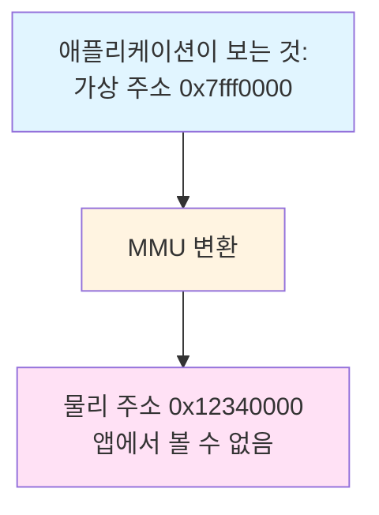

**사용자 공간 드라이버의 문제**:
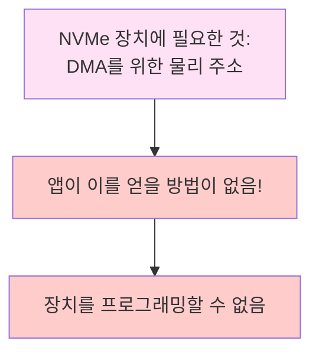

**과제**:

| 요구사항 | 일반 앱 | SPDK 앱 |
|----------|---------|---------|
| 물리 주소 인지 | 아니오 | **예** |
| 메모리 고정 유지 | 아니오 | **예** |
| DMA 안전 메모리 | 아니오 | **예** |
| 연속 페이지 | 아니오 | **권장** |

---

### 개념 2: DMA 요구사항

**DMA(Direct Memory Access)**:
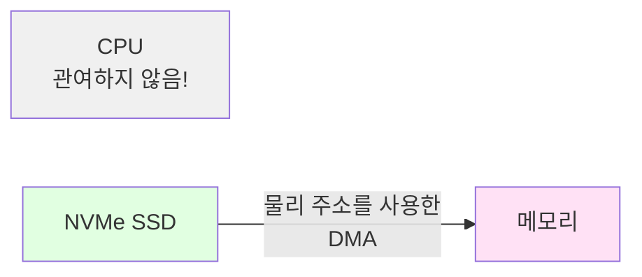

**DMA 요구사항**:

1. **물리 주소 인지 필수**
   - 장치가 물리 주소로 DMA 엔진을 프로그래밍함
   - 애플리케이션이 장치를 프로그래밍하려면 물리 주소를 알아야 함

2. **메모리 고정 필수**
   - OS가 페이지를 이동하거나 스왑하면 안 됨
   - 물리 매핑이 안정적으로 유지되어야 함
   - DMA 중 페이지 폴트 발생 불가

3. **DMA용 메모리 매핑 필수**
   - IOMMU가 장치 접근을 허용해야 함
   - 캐시 일관성(Cache coherency) 요구사항
   - 적절한 메모리 배리어(Memory barrier)

4. **정렬(Alignment)**
   - 일반적으로 64바이트 정렬
   - 일부 장치는 4KB 정렬 필요
   - 캐시 라인 최적화에 영향

---

### 개념 3: 휴지페이지(Hugepages)

**일반 페이지**:
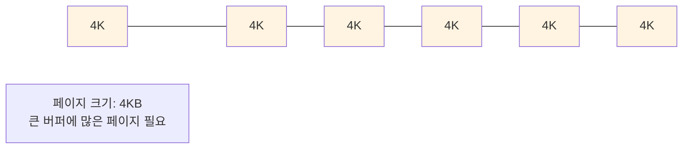

**휴지페이지**:
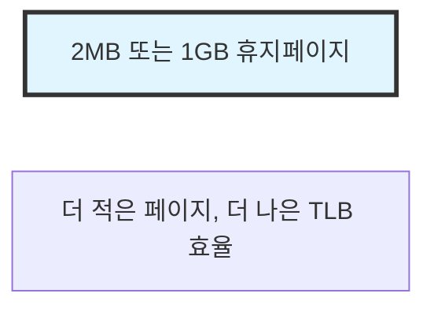

**SPDK가 휴지페이지를 사용하는 이유**:

1. **고정 보장**
   - Linux는 휴지페이지를 스왑하지 않음
   - 물리 주소가 안정적으로 유지됨
   - DMA에 안전

2. **TLB 효율**
   - 더 적은 TLB 엔트리 필요
   - TLB 미스 감소
   - 더 나은 성능

3. **연속 물리 메모리**
   - DMA 제약 조건을 더 쉽게 충족
   - 하드웨어 스캐터-개더(Scatter-Gather)에 유리

4. **관리 단순화**
   - 더 큰 할당 단위
   - 페이지 테이블 오버헤드 감소

**휴지페이지 크기**:

| 유형 | 크기 | 사용 사례 |
|------|------|-----------|
| 표준 | 4KB | 일반 페이지 |
| 2MB 휴지페이지 | 2MB | SPDK 기본값 |
| 1GB 휴지페이지 | 1GB | 매우 큰 시스템 |

---

### 개념 4: DPDK 메모리 모델

**SPDK의 메모리 기반**:
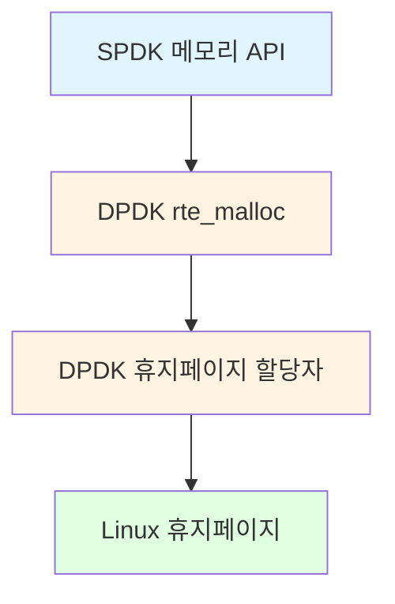

**DPDK 메모리 초기화**:
```c
// DPDK는 시작 시 휴지페이지를 할당합니다
// 출처: /dev/hugepages 또는 /mnt/huge

// 프로세스 주소 공간에 매핑합니다
// 다음을 통해 물리 주소를 파악합니다:
// 1. /proc/self/pagemap (Linux 4.0+)
// 2. VFIO IOMMU 매핑
```

**메모리 존(Memory Zone)**:
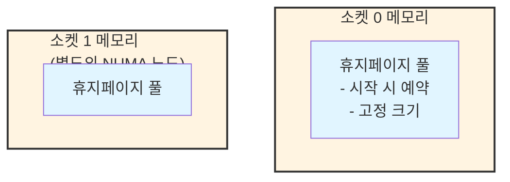

---

## SPDK 메모리 API

### 기본 할당 함수

```c
/**
 * DMA 가능 메모리 할당
 *
 * \param size 바이트 단위 크기
 * \param align 정렬 (일반적으로 64)
 * \param phys_addr 선택적: 물리 주소 반환
 *
 * \return 가상 주소 또는 NULL
 */
void *spdk_dma_malloc(size_t size, size_t align,
                      uint64_t *phys_addr);

// 사용 예시
void *buffer = spdk_dma_malloc(4096, 64, NULL);
if (buffer == NULL) {
    // 할당 실패
    return -ENOMEM;
}

// I/O에 버퍼 사용
spdk_bdev_read(bdev, ch, buffer, ...);

// 완료 후 해제
spdk_dma_free(buffer);
```

### 메모리 함수

```c
// 기본 할당
void *spdk_dma_malloc(size_t size, size_t align,
                      uint64_t *phys_addr);

// 명시적 소켓으로 할당
void *spdk_dma_malloc_socket(size_t size, size_t align,
                             uint64_t *phys_addr,
                             int socket_id);

// 할당 후 0으로 초기화
void *spdk_dma_zmalloc(size_t size, size_t align,
                       uint64_t *phys_addr);

// 재할당 (가능하면 피할 것 - 비용이 큼!)
void *spdk_dma_realloc(void *buf, size_t size, size_t align,
                       uint64_t *phys_addr);

// 해제
void spdk_dma_free(void *buf);

// 기존 버퍼의 물리 주소 얻기
uint64_t spdk_vtophys(void *buf, uint64_t *size);
```

### 메모리 풀(Memory Pool)

빈번한 소규모 할당에는 메모리 풀을 사용합니다:

```c
#include "spdk/mempool.h"

// 풀 생성
struct spdk_mempool *pool;
pool = spdk_mempool_create("my_pool",
                          1024,          // 요소 수
                          sizeof(struct my_object),
                          256,           // 캐시 크기
                          SPDK_ENV_SOCKET_ID_ANY);

// 풀에서 할당
struct my_object *obj;
obj = spdk_mempool_get(pool);

// 풀에 반환
spdk_mempool_put(pool, obj);

// 풀 소멸
spdk_mempool_free(pool);
```

---

## 물리 주소 변환(Physical Address Translation)

### 물리 주소 얻기

```c
void *virt_addr = spdk_dma_malloc(4096, 64, NULL);

// 물리 주소 얻기
uint64_t phys_addr = spdk_vtophys(virt_addr, NULL);

// 이제 phys_addr로 장치를 프로그래밍할 수 있음
```

### 동작 원리

**Linux < 4.0**:
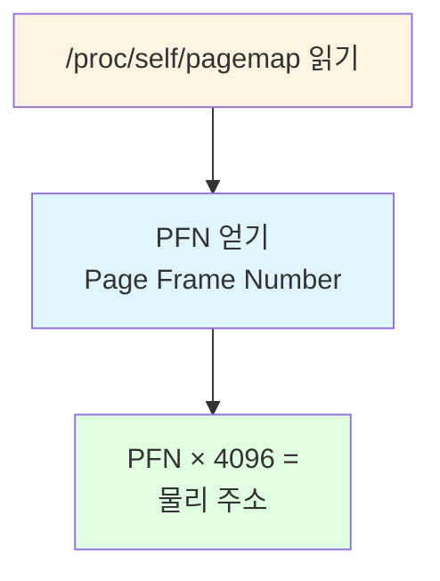

**Linux >= 4.0** (root 또는 CAP_SYS_ADMIN 필요):
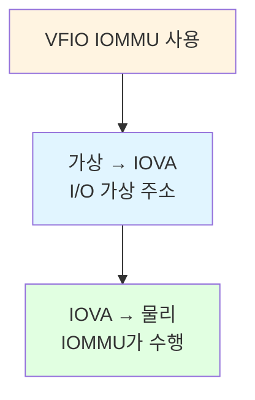

**VFIO 사용 시** (권장):
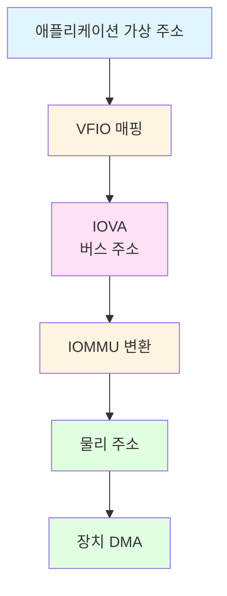

---

## IOMMU와 VFIO

### 전통적인 UIO 모델

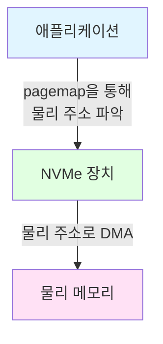

**문제점**:
- pagemap 접근에 root 권한 필요
- 장치가 오동작해도 보호 없음
- 물리 주소 노출

### VFIO 모델

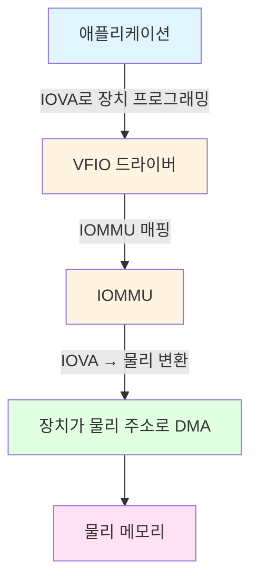

**장점**:
- root 권한 불필요 (설정 후)
- IOMMU에 의한 장치 격리
- 메모리 보호
- 미래 지향적

**설정**:
```bash
# uio 대신 vfio-pci에 바인딩
echo "0000:04:00.0" > /sys/bus/pci/drivers/nvme/unbind
echo "0000:04:00.0" > /sys/bus/pci/drivers/vfio-pci/bind
```

---

## 메모리 정렬(Memory Alignment)

### 정렬이 중요한 이유

**캐시 라인 정렬** (64바이트):
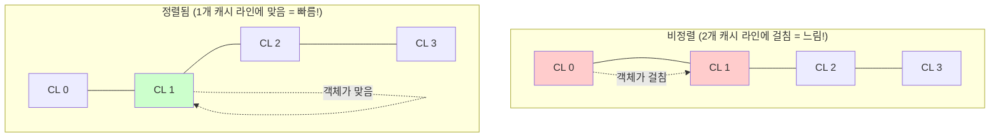

**DMA 정렬**:
- 대부분의 장치는 64바이트 정렬을 선호
- 일부는 4KB 정렬 필요
- 비정렬 시 장치 오류 발생 가능

**일반적인 정렬 값**:

| 데이터 유형 | 정렬 | 이유 |
|-------------|------|------|
| 일반 버퍼 | 64 | 캐시 라인 |
| NVMe PRP | 4 | 4바이트 경계 |
| 메타데이터 | 8 | 64비트 값 |
| 대형 구조체 | 4096 | 페이지 경계 |

---

## NUMA 인식(NUMA Awareness)

### NUMA 아키텍처

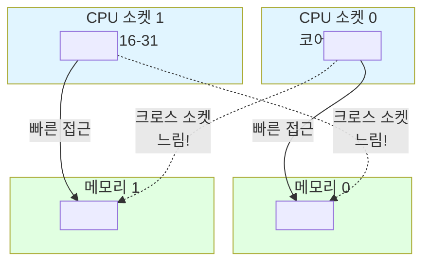

**모범 사례**: CPU와 동일한 소켓에서 메모리 할당

```c
// 현재 소켓 얻기
int socket_id = spdk_env_get_socket_id(spdk_env_get_current_core());

// 이 소켓에서 할당
void *buf = spdk_dma_malloc_socket(size, align, NULL, socket_id);
```

---

## 실습 예제

### 예제 1: I/O 버퍼 할당

```c
// 올바른 I/O 버퍼 할당
void *buffer = spdk_dma_zmalloc(4096, 64, NULL);
if (!buffer) {
    fprintf(stderr, "Failed to allocate DMA buffer\n");
    return -ENOMEM;
}

// I/O에 사용
int rc = spdk_bdev_read(bdev_desc, io_channel,
                        buffer, offset_blocks, num_blocks,
                        read_complete, ctx);

// 나중에: 해제
spdk_dma_free(buffer);
```

### 예제 2: 요청용 메모리 풀

```c
struct io_request {
    void *buffer;
    uint64_t lba;
    uint32_t num_blocks;
    void *cb_arg;
};

// 초기화 시 풀 생성
struct spdk_mempool *request_pool;

void init_request_pool(void) {
    request_pool = spdk_mempool_create(
        "io_requests",
        1024,                           // 1024개의 요청
        sizeof(struct io_request),
        0,                              // 캐시 없음
        SPDK_ENV_SOCKET_ID_ANY
    );
}

// 요청 할당
struct io_request *req = spdk_mempool_get(request_pool);
if (req) {
    req->buffer = spdk_dma_malloc(4096, 64, NULL);
    // ... 요청 사용 ...
}

// 요청 해제
spdk_dma_free(req->buffer);
spdk_mempool_put(request_pool, req);
```

### 예제 3: 스캐터-개더 리스트(Scatter-Gather List)

```c
struct iovec {
    void *iov_base;
    size_t iov_len;
};

// 여러 버퍼 할당
#define NUM_IOVS 4
struct iovec iovs[NUM_IOVS];

for (int i = 0; i < NUM_IOVS; i++) {
    iovs[i].iov_base = spdk_dma_malloc(4096, 64, NULL);
    iovs[i].iov_len = 4096;
}

// readv와 함께 사용
spdk_bdev_readv(bdev_desc, ch, iovs, NUM_IOVS,
                offset, length, complete_cb, ctx);

// 정리
for (int i = 0; i < NUM_IOVS; i++) {
    spdk_dma_free(iovs[i].iov_base);
}
```

---

## 일반적인 패턴

### 패턴 1: 버퍼 관리

```c
struct buffer_pool {
    struct spdk_mempool *pool;
    size_t buffer_size;
    size_t num_buffers;
};

int buffer_pool_create(struct buffer_pool **pool_out,
                       size_t buffer_size,
                       size_t num_buffers) {
    struct buffer_pool *pool;

    pool = calloc(1, sizeof(*pool));
    pool->buffer_size = buffer_size;
    pool->num_buffers = num_buffers;

    pool->pool = spdk_mempool_create(
        "buffers",
        num_buffers,
        buffer_size,
        256,  // 캐시 크기
        SPDK_ENV_SOCKET_ID_ANY
    );

    *pool_out = pool;
    return 0;
}

void *buffer_pool_get(struct buffer_pool *pool) {
    return spdk_mempool_get(pool->pool);
}

void buffer_pool_put(struct buffer_pool *pool, void *buf) {
    spdk_mempool_put(pool->pool, buf);
}
```

---

## 주의사항 및 모범 사례

### 흔한 실수

1. **실수**: I/O 버퍼에 malloc() 사용
   ```c
   // 잘못됨!
   void *buffer = malloc(4096);
   spdk_bdev_read(bdev, ch, buffer, ...);  // 크래시 또는 데이터 손상!
   ```
   **올바른 방법**: spdk_dma_malloc() 사용
   ```c
   void *buffer = spdk_dma_malloc(4096, 64, NULL);
   ```

2. **실수**: 메모리 해제 누락
   ```c
   // 메모리 누수!
   void *buf = spdk_dma_malloc(4096, 64, NULL);
   // ... spdk_dma_free(buf) 호출 누락
   ```

3. **실수**: I/O에 스택 버퍼 사용
   ```c
   // 잘못됨!
   void my_function(void) {
       char buffer[4096];  // 스택에 할당됨
       spdk_bdev_read(..., buffer, ...);  // 위험!
   }
   ```

4. **실수**: 크로스 NUMA 할당
   ```c
   // 비효율적: 잘못된 소켓에서 할당
   void *buf = spdk_dma_malloc(size, 64, NULL);  // 임의의 소켓
   ```
   **올바른 방법**: 로컬 소켓에서 할당
   ```c
   int socket = spdk_env_get_socket_id(spdk_env_get_current_core());
   void *buf = spdk_dma_malloc_socket(size, 64, NULL, socket);
   ```

### 모범 사례

1. **I/O 버퍼에는 항상 spdk_dma_malloc 사용**

2. **빈번한 할당에는 메모리 풀 선호**

3. **최소 64바이트로 정렬**

4. **가능하면 할당한 것과 동일한 스레드에서 메모리 해제**

5. **멀티 소켓 시스템에서 NUMA 인식**

6. **0으로 초기화된 메모리가 필요할 때 spdk_dma_zmalloc 사용**

---

## 지식 점검

1. **일반 malloc()을 DMA 버퍼에 사용할 수 없는 이유는?**

2. **휴지페이지의 장점은 무엇인가?**

3. **메모리 풀 vs 직접 할당을 언제 사용해야 하는가?**

4. **I/O 버퍼의 최소 권장 정렬은?**

5. **VFIO가 UIO보다 개선된 점은?**

---

## 추가 자료

- **SPDK 소스**:
  - `include/spdk/env.h` - 메모리 API
  - `lib/env_dpdk/env.c` - 구현
- **공식 문서**:
  - [메모리 관리](../../doc/memory.md)
- **DPDK 문서**:
  - DPDK Programmer's Guide - Memory 챕터
- **관련 모듈**:
  - 이전: [04-S1-Threading-Model.md](./04-S1-Threading-Model.md)
  - 다음: [06-S1-Build-System.md](./06-S1-Build-System.md)

---

## 요약

SPDK의 메모리 관리는 DMA를 위해 설계되었습니다:

**핵심 요구사항**:
- 물리 주소 인지
- 메모리 고정 (스왑 불가)
- 적절한 정렬
- NUMA 인식

**주요 API**:
- `spdk_dma_malloc()` - DMA 안전 메모리 할당
- `spdk_dma_free()` - 메모리 해제
- `spdk_mempool_*()` - 메모리 풀
- `spdk_vtophys()` - 물리 주소 얻기

**기술**:
- 고정을 위한 휴지페이지
- 관리를 위한 DPDK
- 안전을 위한 VFIO/IOMMU
- 성능을 위한 NUMA

**황금률**:
1. I/O 버퍼에 절대 malloc()을 사용하지 마라
2. 항상 spdk_dma_malloc()을 사용하라
3. 할당한 것은 해제하라
4. 최소 64바이트로 정렬하라
5. NUMA를 인식하라

메모리 관리를 이해하는 것은 SPDK 개발에 필수적입니다. 잘못된 메모리 = 버그. 올바른 메모리 = 성능.

**다음 모듈**: [06-S1-Build-System.md](./06-S1-Build-System.md) - SPDK 애플리케이션 빌드

---

*모듈 05 끝*
