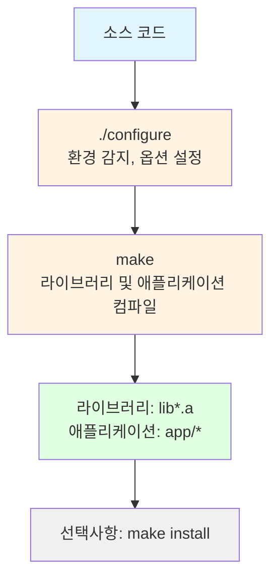
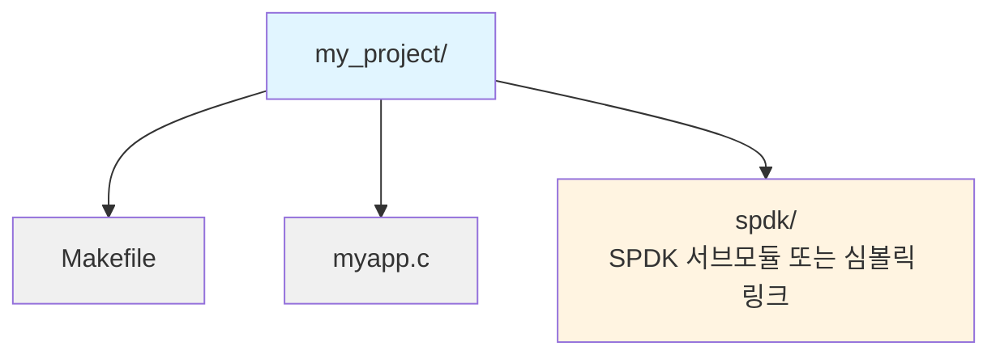

# 모듈 06: 빌드 시스템과 설정(Build System and Configuration)

**단계**: 1 (기초)
**난이도**: 초급
**예상 소요 시간**: 2시간
**선수 과목**: 모듈 01-05

**버전 이력**:
- v1.0 (2026-01-30): 최초 버전

---

## 학습 목표

이 모듈을 완료하면 다음을 할 수 있습니다:
- SPDK를 소스에서 빌드
- 빌드 옵션 설정
- SPDK에 대해 애플리케이션 링크
- SPDK에서 pkg-config 사용
- SPDK의 의존성 관리 이해
- 커스텀 빌드 설정 생성

---

## 개요

SPDK는 설정에 autoconf를, 빌드에 GNU make를 사용합니다. SPDK 애플리케이션을 개발하고 프로젝트에 기여하려면 빌드 시스템을 이해하는 것이 필수적입니다.

---

## 핵심 개념

### 개념 1: 빌드 프로세스 개요



### 개념 2: 주요 빌드 파일

| 파일 | 용도 |
|------|------|
| `configure` | 설정 스크립트 |
| `mk/spdk.common.mk` | 공통 빌드 규칙 |
| `mk/spdk.lib.mk` | 라이브러리 빌드 규칙 |
| `mk/spdk.app.mk` | 애플리케이션 빌드 규칙 |
| `Makefile` | 최상위 makefile |
| `lib/*/Makefile` | 라이브러리별 makefile |

---

## SPDK 빌드하기

### 기본 빌드

```bash
# 저장소 클론
git clone https://github.com/spdk/spdk
cd spdk
git submodule update --init

# 의존성 설치
sudo scripts/pkgdep.sh

# 설정 (기본 옵션)
./configure

# 빌드
make -j$(nproc)

# 최신 하드웨어에서 빌드 시간 약 5-10분
```

### 설정 옵션(Configure Options)

```bash
# 모든 옵션 보기
./configure --help

# 일반적인 옵션
./configure \
    --prefix=/usr/local \           # 설치 경로
    --with-dpdk=/path/to/dpdk \     # 커스텀 DPDK
    --with-rdma \                    # RDMA 활성화
    --with-crypto \                  # 암호화 활성화
    --without-vhost \                # vhost 비활성화
    --enable-debug \                 # 디버그 빌드
    --enable-asan \                  # 주소 새니타이저
    --enable-ubsan \                 # UB 새니타이저
    --disable-tests                  # 테스트 빌드 건너뛰기
```

### 빌드 대상(Build Targets)

```bash
# 전체 빌드 (기본값)
make

# 특정 컴포넌트 빌드
make -C lib/nvme

# 애플리케이션 빌드
make -C app

# 클린 빌드
make clean

# 설치 (--prefix 위치에)
sudo make install

# 단위 테스트 실행
./test/unit/unittest.sh
```

---

## 설정 옵션

### 디버그 vs 릴리스

```bash
# 디버그 빌드 (기본값)
./configure --enable-debug
# - 최적화: -O0
# - 디버그 심볼: 예
# - 어설션(Assertion): 활성화
# - 개발에 적합

# 릴리스 빌드
./configure
# - 최적화: -O2
# - 디버그 심볼: 최소
# - 어설션: 비활성화 (일부)
# - 프로덕션에 적합
```

### 기능 플래그(Feature Flags)

```bash
# 선택적 기능 활성화
./configure \
    --with-rdma \        # RDMA 전송
    --with-crypto \      # 암호화 엔진
    --with-vhost \       # Vhost 대상
    --with-virtio \      # Virtio 지원
    --with-pmdk \        # 영구 메모리(Persistent Memory)
    --with-rbd \         # Ceph RBD
    --with-iscsi-initiator \  # iSCSI 이니시에이터
    --with-vtune \       # Intel VTune 프로파일링
    --with-fio           # fio 플러그인
```

---

## SPDK에 대해 링크하기

### 방법 1: 직접 링크

```makefile
# SPDK 애플리케이션용 Makefile

SPDK_ROOT_DIR := /path/to/spdk

# SPDK의 빌드 설정 포함
include $(SPDK_ROOT_DIR)/mk/spdk.common.mk
include $(SPDK_ROOT_DIR)/mk/spdk.modules.mk

APP = myapp

# 소스 파일
C_SRCS := myapp.c

# 필요한 SPDK 라이브러리
SPDK_LIB_LIST = event event_bdev bdev nvme

# 링크
$(APP): $(OBJS) $(SPDK_LIB_FILES) $(ENV_LIBS)
	$(LINK_C)

include $(SPDK_ROOT_DIR)/mk/spdk.deps.mk
include $(SPDK_ROOT_DIR)/mk/spdk.lib.mk
```

### 방법 2: pkg-config

```bash
# SPDK는 설치 후 pkg-config 파일을 제공합니다

# 컴파일
gcc -o myapp myapp.c \
    $(pkg-config --cflags spdk_event spdk_bdev spdk_nvme) \
    $(pkg-config --libs spdk_event spdk_bdev spdk_nvme)

# 또는 Makefile에서
CFLAGS += $(shell pkg-config --cflags spdk_event spdk_bdev)
LDFLAGS += $(shell pkg-config --libs spdk_event spdk_bdev)
```

### 방법 3: spdk.mk 사용

```makefile
# 트리 외부 앱을 위한 가장 간단한 방법

SPDK_ROOT_DIR := $(abspath /path/to/spdk)

APP = myapp
C_SRCS := myapp.c

# 필요한 SPDK 라이브러리 지정
SPDK_LIB_LIST = event bdev nvme

# SPDK 빌드 시스템 포함
include $(SPDK_ROOT_DIR)/mk/spdk.common.mk
include $(SPDK_ROOT_DIR)/mk/spdk.app.mk
```

---

## 의존성(Dependencies)

### DPDK (필수)

```bash
# SPDK는 DPDK를 서브모듈로 포함
cd spdk
git submodule update --init

# DPDK는 SPDK와 함께 자동으로 빌드됨
# 위치: spdk/dpdk/

# 또는 시스템 DPDK 사용
./configure --with-dpdk=/usr/local

# DPDK 버전 확인
cat dpdk/VERSION
```

### 선택적 의존성

```bash
# 모든 선택적 의존성 설치
sudo scripts/pkgdep.sh --all

# 일반적인 선택적 패키지:
# - libibverbs-dev (RDMA)
# - libiscsi-dev (iSCSI 이니시에이터)
# - libpmem-dev (PMDK)
# - librbd-dev (Ceph RBD)
# - libfuse3-dev (FUSE)
# - libaio-dev (Linux AIO)
# - liburing-dev (io_uring)
```

---

## 애플리케이션 빌드 예제

### 완전한 Makefile

```makefile
# app/Makefile

SPDK_ROOT_DIR := $(abspath $(CURDIR)/..)

APP = hello_bdev

# SPDK 설정 포함
include $(SPDK_ROOT_DIR)/mk/spdk.common.mk

# 소스 파일
C_SRCS := hello_bdev.c

# 필요한 SPDK 라이브러리
SPDK_LIB_LIST = event event_bdev bdev bdev_malloc

# 추가 라이브러리
LIBS += -lpthread

# 대상
all: $(APP)

# SPDK 빌드 규칙 포함
include $(SPDK_ROOT_DIR)/mk/spdk.app.mk

# 정리
clean:
	$(CLEAN_C) $(APP)

.PHONY: all clean
```

### 빌드 및 실행

```bash
# 빌드
cd spdk/app
make

# 실행
sudo ./hello_bdev

# 설정 파일과 함께 실행
sudo ./hello_bdev -c config.json
```

---

## 크로스 컴파일(Cross-Compilation)

### ARM64 예제

```bash
# 크로스 컴파일러 설치
sudo apt-get install gcc-aarch64-linux-gnu

# ARM64용 설정
./configure \
    --target-arch=arm64 \
    --cross-prefix=aarch64-linux-gnu-

# 빌드
make -j$(nproc)
```

---

## 일반적인 패턴

### 패턴 1: 트리 외부 애플리케이션(Out-of-Tree Application)



```makefile
SPDK_ROOT_DIR := $(abspath spdk)

APP = myapp
C_SRCS := myapp.c
SPDK_LIB_LIST = event bdev nvme

include $(SPDK_ROOT_DIR)/mk/spdk.common.mk
include $(SPDK_ROOT_DIR)/mk/spdk.app.mk
```

### 패턴 2: 조건부 기능

```makefile
# SPDK 설정에 기반한 기능 활성화

ifeq ($(CONFIG_RDMA),y)
    C_SRCS += rdma_support.c
    SPDK_LIB_LIST += rdma
endif

ifeq ($(CONFIG_CRYPTO),y)
    C_SRCS += crypto_support.c
    SPDK_LIB_LIST += accel_crypto
endif
```

---

## 주의사항 및 모범 사례

### 흔한 실수

1. **실수**: 서브모듈 업데이트 누락
   ```bash
   # git submodule update --init 누락
   ```
   **오류**: DPDK를 찾을 수 없음

2. **실수**: 잘못된 라이브러리 순서
   ```makefile
   # 잘못됨 - 순서가 중요합니다!
   SPDK_LIB_LIST = nvme bdev  # nvme는 bdev에 의존
   ```
   **올바른 방법**: 의존성을 먼저
   ```makefile
   SPDK_LIB_LIST = bdev nvme
   ```

3. **실수**: 의존성 누락
   **오류**: 링크 시 정의되지 않은 참조
   **해결**: `ldd`로 확인하거나 누락된 라이브러리 추가

### 모범 사례

1. **제공된 빌드 시스템 사용**
   - 바퀴를 재발명하지 마세요
   - SPDK의 mk 파일이 복잡성을 처리합니다

2. **필요한 라이브러리만 지정**
   - 바이너리 크기 축소
   - 더 빠른 링크 시간

3. **설치 후 pkg-config 사용**
   - 깔끔한 분리
   - 버전 관리

---

## 지식 점검

1. **./configure 실행 전 첫 번째 단계는?**

2. **RDMA 지원을 어떻게 활성화하는가?**

3. **디버그와 릴리스 빌드의 차이점은?**

4. **SPDK 라이브러리에 대해 어떻게 링크하는가?**

5. **빌드 후 SPDK 라이브러리는 어디에 위치하는가?**

---

## 추가 자료

- **SPDK 소스**:
  - `mk/` - 빌드 시스템 파일
  - `doc/pkgconfig.md` - pkg-config 가이드
- **관련 모듈**:
  - 이전: [05-S1-Memory-Management.md](./05-S1-Memory-Management.md)
  - 다음: [07-S1-Codebase-Navigation.md](./07-S1-Codebase-Navigation.md)

---

## 요약

**빌드 프로세스**:
1. 의존성 설치: `scripts/pkgdep.sh`
2. 설정: `./configure [options]`
3. 빌드: `make -j$(nproc)`
4. 설치 (선택사항): `sudo make install`

**핵심 개념**:
- 설정을 위한 Autoconf
- 빌드를 위한 GNU make
- 서브모듈로 번들된 DPDK
- 정적 라이브러리 (lib*.a)
- pkg-config 지원

**링크 방법**:
- spdk.app.mk를 사용한 직접 링크
- pkg-config (설치 후)
- 수동 라이브러리 지정

**다음 모듈**: [07-S1-Codebase-Navigation.md](./07-S1-Codebase-Navigation.md) - SPDK 소스 탐색

---

*모듈 06 끝*
