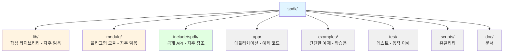
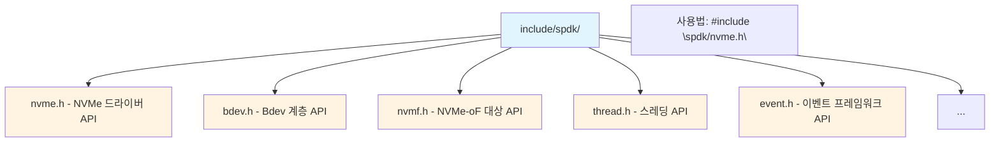
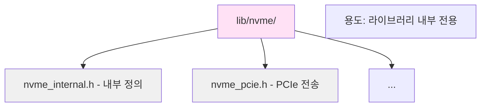
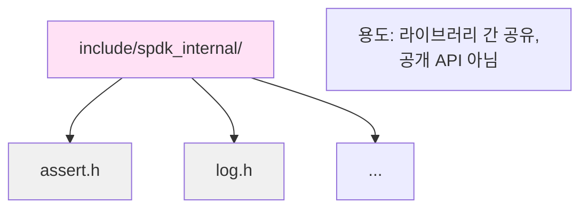
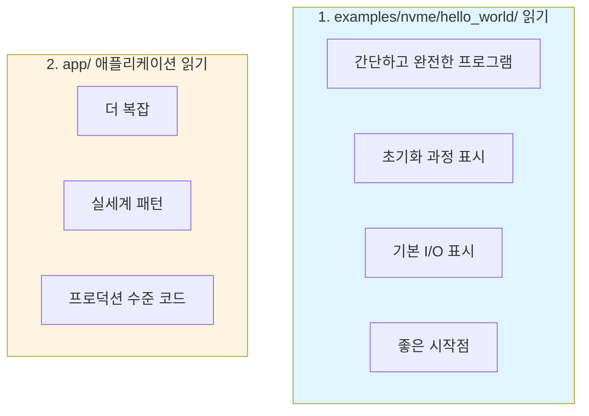
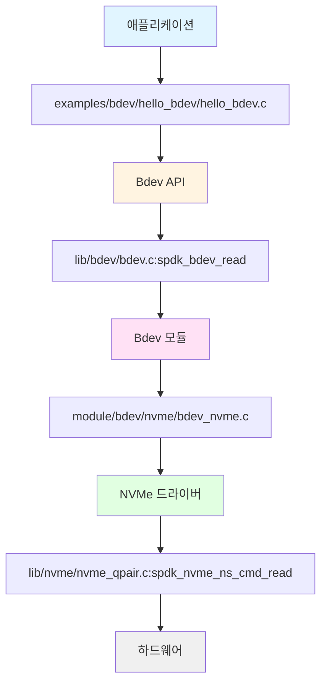
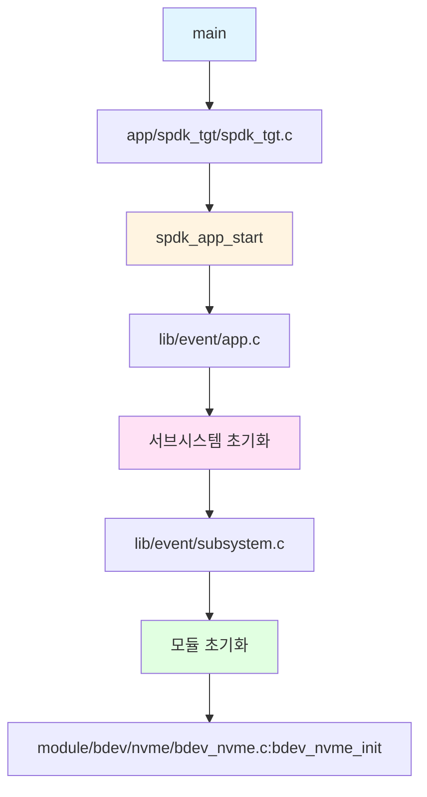
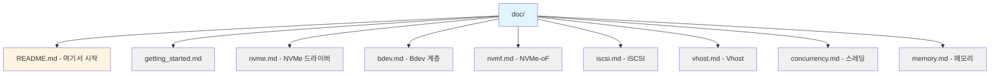
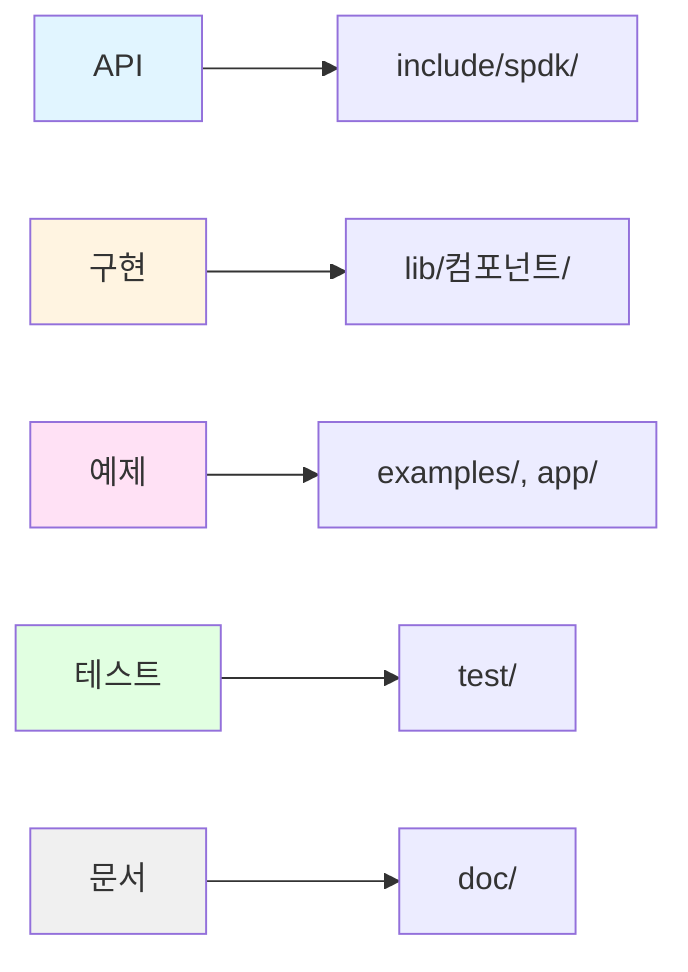

# 모듈 07: 코드베이스 탐색(Codebase Navigation)

**단계**: 1 (기초)
**난이도**: 초급
**예상 소요 시간**: 2시간
**선수 과목**: 모듈 01-06

**버전 이력**:
- v1.0 (2026-01-30): 최초 버전

---

## 학습 목표

이 모듈을 완료하면 다음을 할 수 있습니다:
- SPDK 소스 코드를 효율적으로 탐색
- 함수 구현을 빠르게 찾기
- 헤더 파일 구조 이해
- API 문서 위치 파악
- 코드 패턴을 사용하여 구현 이해
- SPDK에 효과적으로 기여

---

## 개요

SPDK는 수백 개의 파일에 걸쳐 약 200,000줄의 코드를 포함합니다. 이 코드베이스를 효율적으로 탐색하는 방법을 아는 것은 개발과 디버깅에 필수적입니다.

---

## 핵심 개념

### 개념 1: 디렉토리 빠른 참조



**탐색 전략**:
1. API 필요? → `include/spdk/`
2. 구현 필요? → `lib/[컴포넌트]/`
3. 예제 필요? → `examples/` 또는 `app/`
4. 테스트 필요? → `test/`

---

### 개념 2: 코드 찾기

**기능별**:
```
질문: NVMe 명령 제출은 어디에?
답: lib/nvme/nvme_qpair.c

질문: bdev I/O 라우팅은 어디에?
답: lib/bdev/bdev.c

질문: JSON-RPC 처리는 어디에?
답: lib/jsonrpc/jsonrpc_server.c
```

**함수 이름별**:
```bash
# 함수 정의 찾기
grep -r "function_name" lib/ module/

# 함수 사용처 찾기
grep -r "function_name(" lib/ app/

# 더 나은 방법: ctags 또는 LSP 사용
```

**모듈별**:
```
필요: NVMe 드라이버
위치: lib/nvme/

필요: RAID 구현
위치: module/bdev/raid/

필요: NVMe-oF 대상(Target)
위치: lib/nvmf/
```

---

### 개념 3: 헤더 구조

**공개 헤더(Public Headers)** (`include/spdk/`):


**내부 헤더(Internal Headers)** (`lib/[컴포넌트]/`):


**공용 헤더(Common Headers)** (`include/spdk_internal/`):


---

### 개념 4: 코드 패턴

**모듈 등록(Module Registration)**:
```c
// 이 패턴을 찾으세요
SPDK_BDEV_MODULE_REGISTER(name, &module_if)
SPDK_LOG_REGISTER_COMPONENT(name)
SPDK_RPC_REGISTER(method, handler, flags)
```

**초기화/종료 패턴(Init/Fini Pattern)**:
```c
static int
module_init(void)
{
    // 초기화
    return 0;
}

static void
module_fini(void)
{
    // 정리
}
```

**콜백 패턴(Callback Pattern)**:
```c
typedef void (*callback_fn)(void *ctx, int status);

void async_operation(callback_fn cb, void *ctx)
{
    // 작업 시작
    // ...
    // 완료 시:
    cb(ctx, 0);
}
```

---

## 탐색 기법

### 기법 1: 헤더 따라가기

```c
// 코드에서
#include "spdk/bdev.h"

// bdev.h 찾기
$ find include/ -name "bdev.h"
include/spdk/bdev.h

// API 문서를 위해 bdev.h 읽기
$ less include/spdk/bdev.h

// 구현 찾기
$ ls lib/bdev/
bdev.c  bdev.h  ...
```

### 기법 2: 효과적인 Grep 사용

```bash
# 함수 정의 찾기
grep -rn "^spdk_bdev_read" lib/

# 구조체 정의 찾기
grep -rn "^struct spdk_bdev {" lib/

# 매크로 정의 찾기
grep -rn "^#define SPDK_" include/

# RPC 메서드 찾기
grep -rn "SPDK_RPC_REGISTER.*bdev_get_bdevs" lib/

# 대소문자 무시, 파일명 표시
grep -rin "nvme_qpair" lib/nvme/
```

### 기법 3: ctags 사용

```bash
# 태그 생성
cd spdk
ctags -R .

# vim에서:
# 함수 이름 위에서 Ctrl-]로 정의로 이동
# Ctrl-T로 뒤로 이동
```

### 기법 4: Git 사용

```bash
# 함수가 추가된 시점 찾기
git log -p --all -S "spdk_bdev_read"

# 파일 이력 보기
git log --follow -- lib/bdev/bdev.c

# 누가 변경했는지 찾기
git blame lib/bdev/bdev.c

# 커밋 메시지 검색
git log --grep="bdev" --oneline
```

---

## 일반적인 코드 위치

### 핵심 인프라

| 컴포넌트 | 위치 | 주요 파일 |
|----------|------|-----------|
| 스레딩 | `lib/thread/` | `thread.c`, `thread.h` |
| 이벤트 프레임워크 | `lib/event/` | `app.c`, `reactor.c` |
| JSON-RPC | `lib/jsonrpc/` | `jsonrpc_server.c` |
| 로깅 | `lib/log/` | `log.c` |
| 트레이싱 | `lib/trace/` | `trace.c` |
| 유틸리티 | `lib/util/` | `string.c`, `cpuset.c` |

### 스토리지 스택

| 컴포넌트 | 위치 | 주요 파일 |
|----------|------|-----------|
| Bdev 계층 | `lib/bdev/` | `bdev.c`, `bdev.h` |
| NVMe 드라이버 | `lib/nvme/` | `nvme.c`, `nvme_qpair.c` |
| NVMe bdev | `module/bdev/nvme/` | `bdev_nvme.c` |
| RAID | `module/bdev/raid/` | `raid.c` |
| 암호화 | `module/bdev/crypto/` | `vbdev_crypto.c` |

### 프로토콜

| 컴포넌트 | 위치 | 주요 파일 |
|----------|------|-----------|
| NVMe-oF 대상 | `lib/nvmf/` | `nvmf.c`, `transport.c` |
| RDMA 전송 | `lib/nvmf/` | `rdma.c` |
| TCP 전송 | `lib/nvmf/` | `tcp.c` |
| iSCSI 대상 | `lib/iscsi/` | `iscsi.c` |
| Vhost 대상 | `lib/vhost/` | `vhost.c` |

---

## 효과적으로 코드 읽기

### 예제부터 시작



### I/O 경로 따라가기



### 초기화 이해하기



---

## 문서

### Doxygen 문서

```bash
# 문서 빌드
cd doc
make

# 브라우저에서 열기
firefox html/index.html

# 온라인: https://spdk.io/doc/
```

### 마크다운 문서



### 코드 주석

```c
/**
 * 블록 장치에서 데이터를 읽습니다.
 *
 * \param desc 블록 장치 디스크립터
 * \param ch I/O 채널
 * \param buf 데이터 버퍼 (DMA 가능해야 함)
 * \param offset_blocks 블록 단위 오프셋
 * \param num_blocks 블록 수
 * \param cb 완료 콜백
 * \param cb_arg 콜백 인자
 *
 * \return 성공 시 0, 실패 시 음수 errno
 */
int spdk_bdev_read(struct spdk_bdev_desc *desc, ...);
```

---

## 실습 예제

### 예제 1: NVMe 읽기 구현 찾기

```bash
# 1. 공개 API 찾기
$ grep -rn "spdk_nvme_ns_cmd_read" include/spdk/
include/spdk/nvme.h:1234:int spdk_nvme_ns_cmd_read(...);

# 2. 구현 찾기
$ grep -rn "^spdk_nvme_ns_cmd_read" lib/nvme/
lib/nvme/nvme_ns_cmd.c:123:int spdk_nvme_ns_cmd_read(...)

# 3. 구현 읽기
$ vim lib/nvme/nvme_ns_cmd.c +123
```

### 예제 2: Bdev 모듈 이해하기

```bash
# 1. 모든 bdev 모듈 나열
$ ls module/bdev/
aio/  crypto/  delay/  ...

# 2. 학습할 모듈 선택
$ cd module/bdev/nvme/

# 3. 모듈 등록 찾기
$ grep "SPDK_BDEV_MODULE_REGISTER" *.c
bdev_nvme.c:SPDK_BDEV_MODULE_REGISTER(nvme, &nvme_if)

# 4. 모듈 인터페이스 학습
$ vim bdev_nvme.c
# 찾아볼 것: nvme_if 구조체
```

---

## 모범 사례

1. **공개 API부터 시작**
   - `include/spdk/*.h`를 먼저 읽기
   - 구현 전에 계약(Contract) 이해

2. **예제 따라하기**
   - 작동하는 코드에서 패턴 학습
   - 바퀴를 재발명하지 않기

3. **git 이력 활용**
   - 코드가 존재하는 이유 이해
   - 기능의 진화 확인

4. **테스트 읽기**
   - `test/unit/`에서 단위 테스트
   - 예상 동작 표시
   - 엣지 케이스에 유용

5. **일찍 기여하기**
   - 문서 오타 수정
   - 리뷰 프로세스 학습
   - 자신감 구축

---

## 지식 점검

1. **공개 API 문서는 어디에서 찾는가?**

2. **함수의 구현 위치를 어떻게 찾는가?**

3. **bdev 모듈 구현은 어디에 위치하는가?**

4. **SPDK 학습을 시작하기 가장 좋은 곳은?**

5. **RPC 메서드 구현을 어떻게 검색하는가?**

---

## 추가 자료

- **SPDK 소스**: 전체 저장소 탐색
- **GitHub**: https://github.com/spdk/spdk
- **문서**: https://spdk.io/doc/
- **관련 모듈**:
  - 1단계 완료!
  - 다음: [2단계: 구현](../stage-2-implementation/)

---

## 요약

**탐색 전략**:


**도구**:
- 검색을 위한 grep
- 이동을 위한 ctags
- 이력을 위한 git
- API 문서를 위한 Doxygen

**학습 경로**:
1. 예제를 먼저 읽기
2. 공개 헤더 학습
3. I/O 경로 추적
4. 구현 읽기
5. 테스트 학습

**이제 기초가 완성되었습니다!**

1단계 완료! 다음을 이해하게 되었습니다:
- SPDK가 존재하는 이유
- 핵심 원칙
- 아키텍처
- 스레딩 모델
- 메모리 관리
- 빌드 시스템
- 코드베이스 탐색

**다음**: 2단계로 이동하여 실습 구현을 시작하세요!

---

*모듈 07 끝 - 1단계 완료!*
