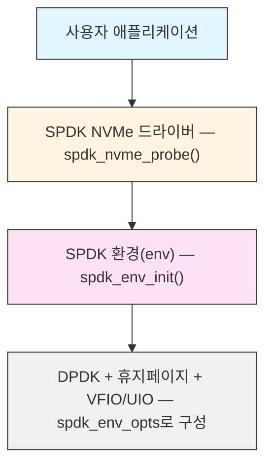
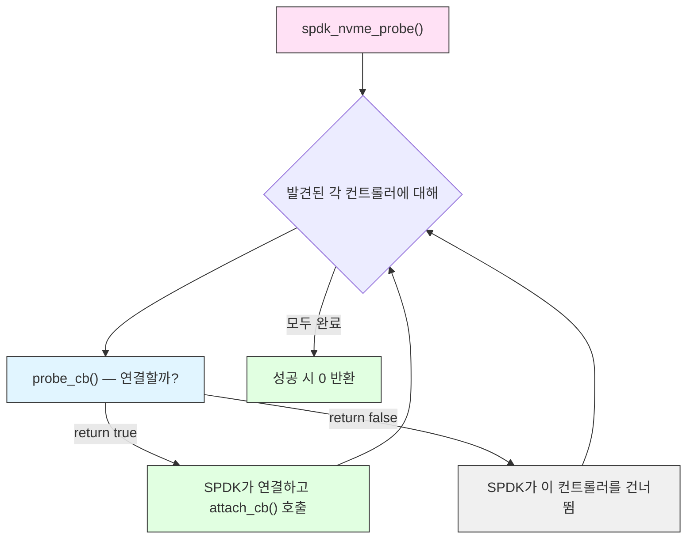
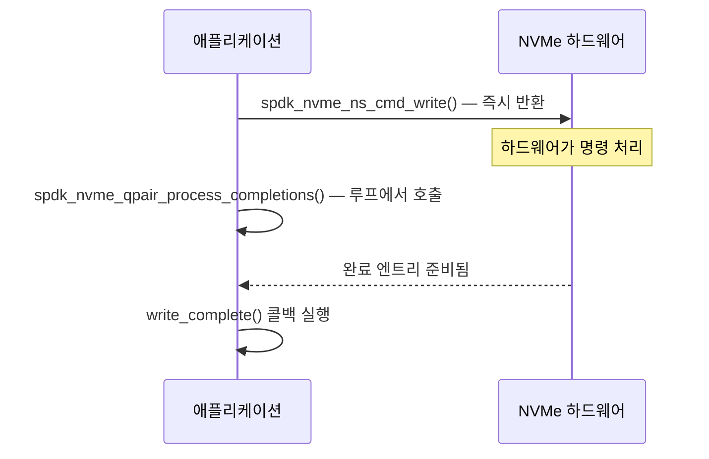

# 모듈 11: Hello World - 첫 번째 SPDK 애플리케이션

**단계**: 2 (구현)
**난이도**: 초급
**예상 소요 시간**: 3시간
**선수 과목**: 모듈 01-10

---

## 학습 목표

- 처음부터 완전한 SPDK 애플리케이션 작성하기
- SPDK 환경 초기화(Environment Initialization) 순서 이해하기
- `spdk_env_opts`를 사용하여 DPDK/휴지페이지(Hugepage) 레이어 구성하기
- NVMe 프로브/어태치 콜백 패턴(Probe/Attach Callback Pattern) 구현하기
- 컨트롤러와 네임스페이스를 열거하고 장치 정보 출력하기
- 간단한 쓰기 후 읽기(Write-then-Read) I/O 작업 수행하기
- SPDK Makefile 시스템으로 빌드하고 root 권한으로 실행하기
- 가장 흔한 초보자 실수 인식 및 수정하기

---

## 핵심 개념

### 개념 1: 두 가지 초기화 레이어

모든 SPDK 애플리케이션은 장치에 접근하기 전에 두 개의 별도 레이어를 초기화해야 합니다.



**레이어 1 - 환경 (`spdk/env.h`)**: DPDK를 설정하고, 휴지페이지 메모리를 바인딩하며, VFIO 또는 UIO를 통해 PCI 접근을 구성합니다. 이 작업은 반드시 드라이버 코드보다 먼저 실행되어야 합니다.

**레이어 2 - NVMe 드라이버 (`spdk/nvme.h`)**: `spdk_nvme_probe()`를 통해 장치를 검색하고, 선택한 컨트롤러에 연결하며, I/O를 위한 네임스페이스를 노출합니다.

이 레이어들을 건너뛰거나 순서를 변경하면 크래시 또는 조용한 실패가 발생합니다.

---

### 개념 2: 프로브/어태치 콜백 패턴(Probe/Attach Callback Pattern)

SPDK는 장치 목록을 반환하지 않습니다. 대신 열거 과정에서 사용자의 함수를 호출합니다:



이 설계를 통해 리소스를 할당하기 전에 전송 주소, 모델 번호 또는 애플리케이션별 기준으로 장치를 필터링할 수 있습니다.

---

### 개념 3: 폴링 기반 비동기 I/O (블로킹 없음, 인터럽트 없음)

SPDK I/O는 논블로킹(Non-blocking)입니다. 명령 제출은 즉시 반환되며, 큐 페어(Queue Pair)를 폴링하여 완료를 처리하고 콜백을 트리거해야 합니다:



이 경로 어디에도 블로킹 대기가 없습니다. CPU가 동일한 코어에 머물고 컨텍스트 스위치를 피하기 때문에 지연 시간이 최소화됩니다.

---

## 완전한 동작 예제

다음 애플리케이션은:
1. SPDK 환경을 초기화합니다
2. 모든 PCIe NVMe 컨트롤러를 탐색합니다
3. 컨트롤러 및 네임스페이스 정보를 출력합니다
4. 각 활성 네임스페이스의 LBA 0에 "Hello world!"를 기록합니다
5. 데이터를 다시 읽어 검증합니다
6. 올바르게 정리합니다

### 파일: `hello_world.c`

```c
/*
 * SPDK Hello World - first SPDK NVMe application.
 * Writes "Hello world!" to LBA 0 and reads it back.
 */

#include "spdk/stdinc.h"   /* wraps common system headers portably */
#include "spdk/nvme.h"     /* NVMe driver API */
#include "spdk/env.h"      /* environment init (hugepages, PCI) */
#include "spdk/log.h"      /* SPDK_NOTICELOG, SPDK_ERRLOG macros */
#include "spdk/string.h"   /* spdk_strtol */

/* The payload we will write and verify */
#define DATA_STRING "Hello world!"

/* ------------------------------------------------------------------ */
/* Data structures                                                      */
/* ------------------------------------------------------------------ */

/*
 * One entry per attached NVMe controller.
 * We keep a doubly-linked tail queue so cleanup is safe even if
 * attach_cb() is called many times.
 */
struct ctrlr_entry {
    struct spdk_nvme_ctrlr     *ctrlr;
    TAILQ_ENTRY(ctrlr_entry)    link;
    char                        name[1024];  /* "ModelNumber (SerialNumber)" */
};

/*
 * One entry per active namespace discovered.
 * A single controller can expose multiple namespaces (think partitions
 * but at the firmware level).
 */
struct ns_entry {
    struct spdk_nvme_ctrlr  *ctrlr;
    struct spdk_nvme_ns     *ns;
    TAILQ_ENTRY(ns_entry)    link;
    struct spdk_nvme_qpair  *qpair;  /* allocated per I/O session */
};

/*
 * Context passed through write_complete -> read_complete.
 * Tracks the DMA buffer and completion status.
 */
struct io_sequence {
    struct ns_entry *ns_entry;
    char            *buf;        /* DMA-mapped buffer */
    int              is_completed; /* 0 = pending, 1 = ok, 2 = error */
};

/* Global lists */
static TAILQ_HEAD(, ctrlr_entry) g_controllers =
    TAILQ_HEAD_INITIALIZER(g_controllers);
static TAILQ_HEAD(, ns_entry) g_namespaces =
    TAILQ_HEAD_INITIALIZER(g_namespaces);

/* Transport ID - describes which transport/address to probe.
 * NULL passed to spdk_nvme_probe() means "scan all local PCIe devices". */
static struct spdk_nvme_transport_id g_trid = {};

/* ------------------------------------------------------------------ */
/* Namespace registration (called from attach_cb)                       */
/* ------------------------------------------------------------------ */

static void
register_ns(struct spdk_nvme_ctrlr *ctrlr, struct spdk_nvme_ns *ns)
{
    struct ns_entry *entry;

    /*
     * Inactive namespaces exist in the IDENTIFY data but cannot
     * receive I/O. Always skip them.
     */
    if (!spdk_nvme_ns_is_active(ns)) {
        return;
    }

    entry = malloc(sizeof(*entry));
    if (entry == NULL) {
        perror("ns_entry malloc");
        exit(1);
    }

    entry->ctrlr  = ctrlr;
    entry->ns     = ns;
    entry->qpair  = NULL;   /* allocated later, before I/O */
    TAILQ_INSERT_TAIL(&g_namespaces, entry, link);

    printf("    Namespace ID: %d  size: %ju GB  sector size: %u bytes\n",
           spdk_nvme_ns_get_id(ns),
           spdk_nvme_ns_get_size(ns) / 1000000000ULL,
           spdk_nvme_ns_get_sector_size(ns));
}

/* ------------------------------------------------------------------ */
/* Probe and attach callbacks                                            */
/* ------------------------------------------------------------------ */

/*
 * probe_cb - 연결 전 발견된 각 컨트롤러마다 한 번 호출됩니다.
 *
 * true 반환  → SPDK가 이 컨트롤러를 연결하고 나중에 attach_cb를 호출합니다.
 * false 반환 → SPDK가 이 컨트롤러를 완전히 건너뜁니다.
 *
 * 여기서는 발견되는 모든 컨트롤러를 수락합니다. 실제 애플리케이션에서는
 * trid->traddr(PCI 주소)나 cdata->mn(모델명)으로 필터링할 수 있습니다.
 */
static bool
probe_cb(void *cb_ctx,
         const struct spdk_nvme_transport_id *trid,
         struct spdk_nvme_ctrlr_opts *opts)
{
    printf("Probing controller at %s\n", trid->traddr);
    /*
     * opts lets you change controller-level settings before attach:
     *   opts->num_io_queues = 4;   -- request 4 I/O queues
     *   opts->io_queue_size = 128; -- depth per queue
     * Defaults are reasonable for a hello-world application.
     */
    return true;  /* attach to every discovered controller */
}

/*
 * attach_cb - 성공적으로 연결된 각 컨트롤러마다 한 번 호출됩니다.
 *
 * 이 함수가 호출될 때는 SPDK가 이미 IDENTIFY 명령을 전송했으며
 * 컨트롤러가 I/O 준비가 되어 있습니다. cdata를 읽어 모델/시리얼 정보를 얻습니다.
 */
static void
attach_cb(void *cb_ctx,
          const struct spdk_nvme_transport_id *trid,
          struct spdk_nvme_ctrlr *ctrlr,
          const struct spdk_nvme_ctrlr_opts *opts)
{
    struct ctrlr_entry              *entry;
    const struct spdk_nvme_ctrlr_data *cdata;
    int                              nsid;
    struct spdk_nvme_ns             *ns;

    entry = malloc(sizeof(*entry));
    if (entry == NULL) {
        perror("ctrlr_entry malloc");
        exit(1);
    }

    printf("Attached to controller at %s\n", trid->traddr);

    /*
     * spdk_nvme_ctrlr_get_data() returns a pointer to the cached
     * IDENTIFY Controller data (NVMe spec section 5.15).
     * Fields mn (model name) and sn (serial number) are padded ASCII.
     */
    cdata = spdk_nvme_ctrlr_get_data(ctrlr);
    snprintf(entry->name, sizeof(entry->name),
             "%-20.20s (%-20.20s)", cdata->mn, cdata->sn);

    entry->ctrlr = ctrlr;
    TAILQ_INSERT_TAIL(&g_controllers, entry, link);

    printf("  Model: %.20s  Serial: %.20s\n", cdata->mn, cdata->sn);
    printf("  Firmware: %.8s\n", cdata->fr);
    printf("  Max transfer size: %u bytes\n",
           spdk_nvme_ctrlr_get_max_xfer_size(ctrlr));

    /*
     * Iterate over active namespaces using the recommended iterator:
     *   spdk_nvme_ctrlr_get_first_active_ns() / _get_next_active_ns()
     * Namespace IDs start at 1, not 0.  The iterator returns 0 when done.
     */
    for (nsid = spdk_nvme_ctrlr_get_first_active_ns(ctrlr);
         nsid != 0;
         nsid = spdk_nvme_ctrlr_get_next_active_ns(ctrlr, nsid)) {

        ns = spdk_nvme_ctrlr_get_ns(ctrlr, nsid);
        if (ns == NULL) {
            continue;
        }
        register_ns(ctrlr, ns);
    }
}

/* ------------------------------------------------------------------ */
/* I/O callbacks                                                        */
/* ------------------------------------------------------------------ */

/*
 * read_complete - 읽기 명령이 완료되면 실행됩니다.
 *
 * 이 시점에서 DMA 버퍼에는 장치에서 읽은 데이터가 담겨 있습니다.
 * 우리가 쓴 데이터와 일치하는지 검증한 후 시퀀스를 완료로 표시합니다.
 */
static void
read_complete(void *arg, const struct spdk_nvme_cpl *cpl)
{
    struct io_sequence *seq = arg;

    if (spdk_nvme_cpl_is_error(cpl)) {
        fprintf(stderr, "Read I/O error: %s\n",
                spdk_nvme_cpl_get_status_string(&cpl->status));
        seq->is_completed = 2;  /* signal error to polling loop */
        return;
    }

    /* Verify the data we wrote is present */
    if (strcmp(seq->buf, DATA_STRING) == 0) {
        printf("  Read back: \"%s\" (verified OK)\n", seq->buf);
    } else {
        fprintf(stderr, "  Data mismatch! Got: \"%s\"\n", seq->buf);
    }

    spdk_free(seq->buf);
    seq->buf = NULL;
    seq->is_completed = 1;  /* signal success to polling loop */
}

/*
 * write_complete - 쓰기 명령이 완료되면 실행됩니다.
 *
 * 쓰기 버퍼를 해제하고, 새로운 제로 초기화된 읽기 버퍼를 할당한 후,
 * 데이터가 장치에 기록되었는지 확인하기 위해 읽기를 제출합니다.
 */
static void
write_complete(void *arg, const struct spdk_nvme_cpl *cpl)
{
    struct io_sequence *seq     = arg;
    struct ns_entry    *ns_entry = seq->ns_entry;
    int                 rc;

    if (spdk_nvme_cpl_is_error(cpl)) {
        fprintf(stderr, "Write I/O error: %s\n",
                spdk_nvme_cpl_get_status_string(&cpl->status));
        spdk_free(seq->buf);
        seq->buf = NULL;
        seq->is_completed = 2;
        return;
    }

    printf("  Write completed OK.  Submitting read...\n");

    /*
     * 쓰기 버퍼를 해제하고 새로운 제로 초기화된 읽기 버퍼를 할당합니다.
     * spdk_zmalloc()은 휴지페이지에서 DMA 안전한 고정 메모리를 할당합니다.
     * 인자: (크기, 정렬, 물리주소_출력, NUMA ID, 플래그)
     *   SPDK_ENV_NUMA_ID_ANY   → 아무 NUMA 노드에서 할당
     *   SPDK_MALLOC_DMA        → DMA 안전 고정 보장
     */
    spdk_free(seq->buf);
    seq->buf = spdk_zmalloc(0x1000, 0x1000, NULL,
                            SPDK_ENV_NUMA_ID_ANY, SPDK_MALLOC_DMA);
    if (seq->buf == NULL) {
        fprintf(stderr, "Failed to allocate read buffer\n");
        seq->is_completed = 2;
        return;
    }

    /*
     * spdk_nvme_ns_cmd_read() - NVMe READ 명령을 제출합니다.
     *
     * 인자:
     *   ns         → 대상 네임스페이스
     *   qpair      → 사용할 I/O 큐 (스레드당 하나의 qpair 규칙!)
     *   buf        → 읽기 데이터를 위한 DMA 버퍼
     *   0          → 시작 LBA
     *   1          → 읽을 논리 블록 수
     *   read_complete → 완료 콜백
     *   seq        → 콜백 인자 (우리의 컨텍스트)
     *   0          → I/O 플래그 (0 = 기본값)
     *
     * 성공 시 0을 반환합니다; 명령은 큐에 들어갔지만 아직 전송되지 않았습니다.
     * 완료는 나중에 process_completions()로 확인합니다.
     */
    rc = spdk_nvme_ns_cmd_read(ns_entry->ns, ns_entry->qpair,
                               seq->buf,
                               0, /* LBA start */
                               1, /* number of LBAs */
                               read_complete, seq, 0);
    if (rc != 0) {
        fprintf(stderr, "Failed to submit read: %d\n", rc);
        spdk_free(seq->buf);
        seq->buf = NULL;
        seq->is_completed = 2;
    }
}

/* ------------------------------------------------------------------ */
/* Main I/O loop                                                         */
/* ------------------------------------------------------------------ */

static void
run_hello_world(void)
{
    struct ns_entry    *ns_entry;
    struct io_sequence  seq;
    int                 rc;

    TAILQ_FOREACH(ns_entry, &g_namespaces, link) {

        printf("\nRunning hello_world on namespace %d\n",
               spdk_nvme_ns_get_id(ns_entry->ns));

        /*
         * I/O 큐 페어를 할당합니다.
         *
         * 큐 페어(qpair)는 제출 큐 + 완료 큐 쌍입니다.
         * SPDK는 각 qpair가 단일 스레드에서만 접근되도록 요구합니다 -
         * 드라이버 내부에서 락이 수행되지 않습니다.
         *
         * NULL opts → 기본 큐 페어 옵션 사용
         * 0        → 기본 플래그
         */
        ns_entry->qpair = spdk_nvme_ctrlr_alloc_io_qpair(
                              ns_entry->ctrlr, NULL, 0);
        if (ns_entry->qpair == NULL) {
            fprintf(stderr, "Failed to allocate qpair\n");
            continue;
        }

        /*
         * 쓰기 페이로드를 위한 4KB DMA 버퍼를 할당합니다.
         * NVMe 사양은 데이터 버퍼가 물리적으로 연속적이고
         * 정렬되어야 함을 요구합니다. spdk_zmalloc()은 두 가지 모두를 만족합니다.
         */
        seq.buf = spdk_zmalloc(0x1000, 0x1000, NULL,
                               SPDK_ENV_NUMA_ID_ANY, SPDK_MALLOC_DMA);
        if (seq.buf == NULL) {
            fprintf(stderr, "Failed to allocate write buffer\n");
            spdk_nvme_ctrlr_free_io_qpair(ns_entry->qpair);
            continue;
        }

        /* 쓰기 버퍼를 페이로드로 채움 */
        snprintf(seq.buf, 0x1000, "%s", DATA_STRING);
        seq.ns_entry     = ns_entry;
        seq.is_completed = 0;

        printf("  Writing \"%s\" to LBA 0...\n", DATA_STRING);

        /*
         * spdk_nvme_ns_cmd_write() - NVMe WRITE 명령을 제출합니다.
         * cmd_read와 동일한 시그니처입니다. 명령은 즉시 큐에 들어갑니다;
         * write_complete()는 아래에서 완료를 폴링한 후 실행됩니다.
         */
        rc = spdk_nvme_ns_cmd_write(ns_entry->ns, ns_entry->qpair,
                                    seq.buf,
                                    0, /* LBA start */
                                    1, /* number of LBAs */
                                    write_complete, &seq, 0);
        if (rc != 0) {
            fprintf(stderr, "Failed to submit write: %d\n", rc);
            spdk_free(seq.buf);
            spdk_nvme_ctrlr_free_io_qpair(ns_entry->qpair);
            continue;
        }

        /*
         * 폴링 루프.
         *
         * spdk_nvme_qpair_process_completions(qpair, max_completions)
         *   - 완료된 명령이 있는지 하드웨어 완료 큐를 확인
         *   - 발견된 각 완료에 대해 적절한 콜백을 실행
         *   - 처리된 완료 수를 반환
         *   - 절대 블로킹하지 않음 - 준비된 것이 없으면 즉시 0 반환
         *
         * 시퀀스가 is_completed != 0으로 설정될 때까지 루프합니다.
         * 실제 애플리케이션에서는 이벤트 프레임워크가 이 루프를 처리합니다.
         */
        while (seq.is_completed == 0) {
            spdk_nvme_qpair_process_completions(ns_entry->qpair, 0);
        }

        if (seq.is_completed == 2) {
            fprintf(stderr, "  I/O sequence failed on namespace %d\n",
                    spdk_nvme_ns_get_id(ns_entry->ns));
        }

        /* 세션 완료 후 항상 qpair를 해제 */
        spdk_nvme_ctrlr_free_io_qpair(ns_entry->qpair);
        ns_entry->qpair = NULL;
    }
}

/* ------------------------------------------------------------------ */
/* Cleanup                                                              */
/* ------------------------------------------------------------------ */

static void
cleanup(void)
{
    struct ns_entry   *ns_entry,  *tmp_ns;
    struct ctrlr_entry *ctrlr_entry, *tmp_ctrlr;
    struct spdk_nvme_detach_ctx *detach_ctx = NULL;

    /* 네임스페이스 리스트 엔트리 해제 (ns 핸들은 ctrlr에 속함) */
    TAILQ_FOREACH_SAFE(ns_entry, &g_namespaces, link, tmp_ns) {
        TAILQ_REMOVE(&g_namespaces, ns_entry, link);
        free(ns_entry);
    }

    /*
     * 컨트롤러를 비동기적으로 분리한 후 모두 완료될 때까지 대기합니다.
     * spdk_nvme_detach_async()는 분리를 큐에 넣고;
     * spdk_nvme_detach_poll()는 큐에 넣은 모든 분리가 완료될 때까지 블로킹합니다.
     */
    TAILQ_FOREACH_SAFE(ctrlr_entry, &g_controllers, link, tmp_ctrlr) {
        TAILQ_REMOVE(&g_controllers, ctrlr_entry, link);
        spdk_nvme_detach_async(ctrlr_entry->ctrlr, &detach_ctx);
        free(ctrlr_entry);
    }

    if (detach_ctx) {
        spdk_nvme_detach_poll(detach_ctx);
    }
}

/* ------------------------------------------------------------------ */
/* main                                                                 */
/* ------------------------------------------------------------------ */

int
main(int argc, char **argv)
{
    struct spdk_env_opts opts;
    int rc;

    /*
     * 단계 1: spdk_env_opts를 초기화합니다.
     *
     * 항상 opts.opts_size = sizeof(opts)를 먼저 설정하세요. SPDK는 이
     * 필드를 사용하여 런타임에 ABI 버전 불일치를 감지합니다. 이를 잊으면
     * 빌드 불일치 시 원인을 알 수 없는 크래시가 발생하는 흔한 원인입니다.
     *
     * spdk_env_opts_init()은 안전한 기본값을 채웁니다:
     *   name             = NULL (호출자가 설정해야 함)
     *   mem_size         = -1   (휴지페이지 풀 기반으로 DPDK가 결정)
     *   main_core        = -1   (현재 코어 사용)
     *   shm_id           = -1   (프로세스 간 공유 메모리 없음)
     *   no_pci           = false
     *   hugepage_single_segments = false
     */
    opts.opts_size = sizeof(opts);
    spdk_env_opts_init(&opts);

    /* 애플리케이션 이름은 휴지페이지 파일 이름과 로그 출력에 표시됨 */
    opts.name = "hello_world";

    /*
     * 선택적 튜닝 옵션 (주석 처리됨 - 여기서는 기본값으로 충분):
     *
     *   opts.mem_size = 512;          // 512 MB의 휴지페이지 RAM 예약
     *   opts.main_core = 1;           // 메인 스레드를 코어 1에 고정
     *   opts.reactor_mask = "0x3";    // 코어 0과 1을 사용
     *   opts.shm_id = 0;              // 멀티 프로세스 모드 활성화
     *   opts.no_pci = true;           // PCI 비활성화 (NVMe-oF 전용)
     */

    /*
     * 단계 2: SPDK 환경을 초기화합니다.
     *
     * 이 호출은:
     *   - DPDK EAL(Environment Abstraction Layer)을 초기화
     *   - 휴지페이지 메모리를 매핑
     *   - VFIO 또는 UIO 커널 드라이버를 통해 PCI 장치에 바인딩
     *
     * 다른 모든 SPDK 함수보다 먼저 호출해야 합니다.
     * 실패 시 0보다 작은 값을 반환하며; 실패 후 복구는 불가능합니다.
     */
    if (spdk_env_init(&opts) < 0) {
        fprintf(stderr, "Unable to initialize SPDK env\n");
        return 1;
    }

    printf("SPDK environment initialized.\n");

    /*
     * 단계 3: 전송 ID를 구성합니다.
     *
     * 로컬 PCIe NVMe 장치의 경우: SPDK_NVME_TRANSPORT_PCIE.
     * NVMe-oF 대상의 경우: SPDK_NVME_TRANSPORT_TCP 또는 _RDMA를 사용하고
     * trid.traddr / trid.trsvcid / trid.subnqn을 채웁니다.
     *
     * &g_trid(PCIe)를 spdk_nvme_probe()에 전달하면 PCIe 장치로
     * 스캔이 제한됩니다. NULL을 전달하면 등록된 모든 전송을 스캔합니다.
     */
    spdk_nvme_trid_populate_transport(&g_trid, SPDK_NVME_TRANSPORT_PCIE);
    snprintf(g_trid.subnqn, sizeof(g_trid.subnqn), "%s",
             SPDK_NVMF_DISCOVERY_NQN);

    printf("Scanning for NVMe controllers...\n");

    /*
     * 단계 4: NVMe 장치를 탐색합니다.
     *
     * spdk_nvme_probe(trid, cb_ctx, probe_cb, attach_cb, remove_cb)
     *
     *   trid       - 전송 필터; NULL = 모두 스캔
     *   cb_ctx     - 모든 콜백에 전달되는 불투명 포인터
     *   probe_cb   - 발견된 컨트롤러마다 호출; true 반환 시 연결
     *   attach_cb  - 연결된 컨트롤러마다 호출; 검사 및 저장
     *   remove_cb  - 이전에 연결된 컨트롤러가 제거될 때 호출
     *                (핫플러그); NULL이면 핫플러그 처리 비활성화
     *
     * 이 함수는 동기적입니다: 모든 탐색과 연결이 완료될 때까지
     * 블로킹한 후 반환합니다.
     */
    rc = spdk_nvme_probe(&g_trid, NULL, probe_cb, attach_cb, NULL);
    if (rc != 0) {
        fprintf(stderr, "spdk_nvme_probe() failed: %d\n", rc);
        goto cleanup;
    }

    if (TAILQ_EMPTY(&g_controllers)) {
        fprintf(stderr, "No NVMe controllers found.\n");
        fprintf(stderr, "Ensure NVMe devices are bound to vfio-pci or uio_pci_generic.\n");
        rc = 1;
        goto cleanup;
    }

    printf("\nProbe complete. Running hello_world I/O...\n");

    /* 단계 5: 실제 I/O 데모 실행 */
    run_hello_world();

cleanup:
    /* 단계 6: 모든 컨트롤러를 분리하고 휴지페이지 메모리를 해제 */
    cleanup();
    spdk_env_fini();

    return rc;
}
```

---

## 주요 섹션의 라인별 설명

### 환경 초기화

```c
opts.opts_size = sizeof(opts);   // (1) ABI 버전 가드 - 절대 건너뛰지 마세요
spdk_env_opts_init(&opts);       // (2) 기본값 채우기
opts.name = "hello_world";       // (3) 필수: 휴지페이지 세그먼트 이름 지정
spdk_env_init(&opts);            // (4) DPDK 시작, 휴지페이지 매핑, PCI 열기
```

**(1)** `opts_size` 필드는 자기 기술(Self-describing) 구조체 패턴입니다. SPDK는 이를 사용하여 다른 헤더 버전으로 빌드된 애플리케이션을 감지합니다. 이 필드를 설정하지 않고 구조체 리터럴을 복사하면 어설션 실패 또는 조용한 필드 손상이 발생합니다.

**(2)** `spdk_env_opts_init()`은 모든 필드를 덮어쓰더라도 필수입니다. 패딩 바이트를 제로로 초기화하고 공개 헤더에 없는 내부 필드를 설정합니다.

**(3)** `name`은 `/dev/hugepages/` 파일 이름과 DPDK 로그 라인에 나타납니다. 리소스 누수를 디버깅할 때 도움이 되므로 설명적으로 만드세요.

**(4)** 이 호출이 반환된 후에는 휴지페이지가 매핑되고 PCI 접근이 설정됩니다. 음수 값을 반환하면 SPDK가 이미 stderr에 근본 원인을 출력했으므로, 추측하기 전에 해당 메시지를 확인하세요.

---

### probe_cb와 attach_cb의 관계

```c
static bool
probe_cb(void *cb_ctx,
         const struct spdk_nvme_transport_id *trid,
         struct spdk_nvme_ctrlr_opts *opts)
{
    // trid->traddr는 PCI 주소: "0000:01:00.0"
    // opts를 통해 큐 깊이, AER 처리 등을 변경할 수 있음
    return true;  // 이 컨트롤러를 수락
}
```

`probe_cb`는 게이트 역할을 합니다. `false`를 반환하는 일반적인 이유:
- 특정 PCI 슬롯만 원하는 경우: `strcmp(trid->traddr, "0000:03:00.0") != 0`
- 핫 리로드 경로에서 이미 이 컨트롤러에 연결되어 있는 경우
- 애플리케이션이 고정된 수의 장치만 처리하는 경우

```c
static void
attach_cb(void *cb_ctx,
          const struct spdk_nvme_transport_id *trid,
          struct spdk_nvme_ctrlr *ctrlr,
          const struct spdk_nvme_ctrlr_opts *opts)
{
    const struct spdk_nvme_ctrlr_data *cdata = spdk_nvme_ctrlr_get_data(ctrlr);
    // cdata->mn = 모델명 (20바이트, 공백 패딩, null 종료자 없음)
    // cdata->sn = 시리얼 번호 (20바이트, 동일한 형식)
    // cdata->fr = 펌웨어 리비전 (8바이트)
    // cdata->nn = 네임스페이스 수
}
```

`cdata`는 SPDK의 내부 캐시를 가리키는 포인터입니다; 해제하지 마세요. 데이터는 컨트롤러 핸들의 수명 동안 유효합니다.

---

### DMA 버퍼 할당

```c
/* 올바름: I/O 버퍼에 spdk_zmalloc 사용 */
char *buf = spdk_zmalloc(0x1000, 0x1000, NULL,
                         SPDK_ENV_NUMA_ID_ANY, SPDK_MALLOC_DMA);

/* 틀림: malloc/calloc 메모리는 NVMe DMA에 사용할 수 없음 */
char *buf = malloc(0x1000);  /* DMA 결함 또는 데이터 손상이 발생함 */
```

NVMe 컨트롤러는 메모리에 직접 접근(DMA)합니다. 메모리는 반드시:
- **물리적으로 연속적** - 표준 `malloc`은 단편화된 페이지를 반환할 수 있음
- **고정(Pinned)** - 장치가 사용하는 동안 스왑 아웃되면 안 됨
- **정렬됨** - 일반적으로 섹터 크기(512 또는 4096바이트)에 맞춰야 함

`spdk_zmalloc()`은 이 세 가지를 모두 만족하는 휴지페이지 풀에서 할당합니다. 두 번째 인자는 바이트 단위 정렬(0x1000 = 4096바이트)입니다.

---

### 폴링 루프

```c
while (seq.is_completed == 0) {
    spdk_nvme_qpair_process_completions(ns_entry->qpair, 0);
}
```

`process_completions(qpair, max_completions)`:
- `max_completions = 0` → 사용 가능한 모든 완료를 처리
- `max_completions = N` → 최대 N개 처리 (지연 시간 제한에 유용)
- 처리된 완료 수를 반환 (준비된 것이 없으면 0)
- 절대 블로킹하지 않음

이벤트 프레임워크(모듈 12)를 기반으로 한 프로덕션 SPDK 애플리케이션에서는 이 폴링 루프가 등록된 폴러(Poller)로 대체됩니다. `spdk_app_start()`를 사용하지 않는 독립 실행 애플리케이션의 경우 여기에 표시된 수동 루프가 올바릅니다.

---

## 애플리케이션 빌드

### 옵션 A: SPDK 소스 트리 내부 (학습에 권장)

`examples/nvme/` 아래에 디렉토리를 생성합니다:

```
examples/nvme/my_hello/
    hello_world.c
    Makefile
```

**Makefile**:

```makefile
#
# SPDK in-tree application Makefile.
# SPDK_ROOT_DIR must point to the top of the SPDK source tree.
#
SPDK_ROOT_DIR := $(abspath ../../..)

# Pull in common build variables (CFLAGS, compiler, etc.)
include $(SPDK_ROOT_DIR)/mk/spdk.common.mk

APP      = hello_world
C_SRCS  := hello_world.c

# List the SPDK libraries your application uses.
# The build system resolves transitive dependencies automatically.
# 'nvme' pulls in env, log, util, and others.
SPDK_LIB_LIST = nvme

# Pull in the application link rules
include $(SPDK_ROOT_DIR)/mk/spdk.app.mk
```

```bash
# SPDK 루트에서 먼저 SPDK를 빌드합니다 (한 번만):
./configure --with-vfio-user
make -j$(nproc)

# 그런 다음 애플리케이션을 빌드합니다:
cd examples/nvme/my_hello
make
```

### 옵션 B: pkg-config를 사용한 외부 빌드

SPDK를 설치하거나 `PKG_CONFIG_PATH`를 빌드 출력에 지정한 후:

```makefile
CC      = gcc
CFLAGS  = $(shell pkg-config --cflags spdk_nvme spdk_env_dpdk)
LDFLAGS = $(shell pkg-config --libs   spdk_nvme spdk_env_dpdk)

hello_world: hello_world.c
	$(CC) $(CFLAGS) -o $@ $< $(LDFLAGS)
```

---

## 애플리케이션 실행

### 사전 요구 사항

SPDK가 NVMe 장치에 접근하려면 먼저 리눅스 커널 드라이버에서 언바인드하고 VFIO 또는 UIO 드라이버에 바인드해야 합니다:

```bash
# NVMe 장치의 PCIe 주소 확인
lspci | grep -i nvme
# 예시 출력: 01:00.0 Non-Volatile memory controller: ...

# vfio-pci에 바인드 (권장 - IOMMU와 함께 동작)
sudo modprobe vfio-pci
echo "0000:01:00.0" | sudo tee /sys/bus/pci/devices/0000:01:00.0/driver/unbind
echo "1234 5678" | sudo tee /sys/bus/pci/drivers/vfio-pci/new_id   # 실제 vendor:device ID 사용

# 또는 SPDK 설정 스크립트 사용 (가장 간편):
sudo scripts/setup.sh      # 모든 NVMe 장치를 vfio-pci에 바인드
sudo scripts/setup.sh reset # 작업 완료 후 커널 nvme 드라이버로 복원
```

### 실행

```bash
# SPDK는 휴지페이지 접근과 PCI 장치 제어를 위해 root 권한이 필요합니다
sudo ./hello_world
```

실제 NVMe 장치에서의 예상 출력:

```
SPDK environment initialized.
Scanning for NVMe controllers...
Probing controller at 0000:01:00.0
Attached to controller at 0000:01:00.0
  Model: Samsung SSD 980 PRO    Serial: S5GXNF0R123456
  Firmware: 3B2QGXA7
  Max transfer size: 131072 bytes
    Namespace ID: 1  size: 500 GB  sector size: 512 bytes

Probe complete. Running hello_world I/O...

Running hello_world on namespace 1
  Writing "Hello world!" to LBA 0...
  Write completed OK.  Submitting read...
  Read back: "Hello world!" (verified OK)
```

---

## 흔한 초보자 실수 및 문제 해결

### 실수 1: `opts.opts_size` 누락

**증상**: `spdk_env_init()`에서 어설션 실패, 또는 원인을 알 수 없는 필드 손상.

```c
/* 틀림 */
struct spdk_env_opts opts;
spdk_env_opts_init(&opts);

/* 올바름 */
struct spdk_env_opts opts;
opts.opts_size = sizeof(opts);   /* spdk_env_opts_init 전에 반드시 설정 */
spdk_env_opts_init(&opts);
```

### 실수 2: I/O 버퍼에 `malloc` 사용

**증상**: DMA 접근 결함, 조용한 데이터 손상, 또는 NVMe 명령이 완료되지만 버퍼에 제로가 담김.

```c
/* 틀림 - DMA 도중 커널이 이 페이지를 스왑하거나 재매핑할 수 있음 */
char *buf = malloc(4096);
spdk_nvme_ns_cmd_read(ns, qpair, buf, ...);

/* 올바름 */
char *buf = spdk_zmalloc(4096, 4096, NULL, SPDK_ENV_NUMA_ID_ANY, SPDK_MALLOC_DMA);
```

### 실수 3: 완료 폴링 누락

**증상**: 애플리케이션이 폴링 루프에서 영원히 멈춤; 콜백이 절대 실행되지 않음.

```c
/* 틀림 - 제출만 하고 폴링하지 않음 */
spdk_nvme_ns_cmd_write(ns, qpair, buf, 0, 1, write_complete, &seq, 0);
// write_complete가 호출되길 기대... 호출되지 않음

/* 올바름 */
spdk_nvme_ns_cmd_write(ns, qpair, buf, 0, 1, write_complete, &seq, 0);
while (!seq.is_completed) {
    spdk_nvme_qpair_process_completions(qpair, 0);  /* 완료를 구동 */
}
```

### 실수 4: 스레드 간 qpair 공유

**증상**: 무작위 크래시, 손상된 완료, 또는 SPDK NVMe 드라이버 내부에서의 어설션 실패.

각 `spdk_nvme_qpair`는 반드시 하나의 스레드에서만 독점적으로 사용해야 합니다. SPDK는 설계상 qpair 접근에 대한 락을 제공하지 않습니다 - 이것이 고성능을 가능하게 하는 요소입니다.

```c
/* 틀림 - 두 스레드가 하나의 qpair를 공유 */
thread_A: spdk_nvme_ns_cmd_write(ns, shared_qpair, ...);
thread_B: spdk_nvme_qpair_process_completions(shared_qpair, 0);

/* 올바름 - 각 스레드가 자체 qpair를 할당 */
thread_A_qpair = spdk_nvme_ctrlr_alloc_io_qpair(ctrlr, NULL, 0);
thread_B_qpair = spdk_nvme_ctrlr_alloc_io_qpair(ctrlr, NULL, 0);
```

### 실수 5: NVMe 장치가 VFIO/UIO에 바인드되지 않음

**증상**: `spdk_nvme_probe()`가 0을 반환하지만 컨트롤러 목록이 비어 있음.

```bash
# 진단: 현재 바인딩 확인
ls -la /sys/bus/pci/devices/0000:01:00.0/driver
# "nvme"로 표시되면 커널이 아직 장치를 소유하고 있음

# 수정: SPDK의 설정 스크립트 사용
sudo /path/to/spdk/scripts/setup.sh

# 장치가 이제 vfio-pci에 바인드되었는지 확인
ls -la /sys/bus/pci/devices/0000:01:00.0/driver
# 이제 표시되어야 함: vfio-pci -> ../../../../bus/pci/drivers/vfio-pci
```

### 실수 6: 휴지페이지 메모리 부족

**증상**: `spdk_env_init()`이 "cannot init dpdk" 또는 "EAL: Not enough memory available"로 실패.

```bash
# 현재 휴지페이지 할당 확인
cat /proc/meminfo | grep HugePages

# 1 GB의 2MB 휴지페이지 할당 (root 필요)
echo 512 | sudo tee /sys/kernel/mm/hugepages/hugepages-2048kB/nr_hugepages

# 또는 CPU가 지원하면 1 GB 페이지 사용
echo 1 | sudo tee /sys/kernel/mm/hugepages/hugepages-1048576kB/nr_hugepages
```

### 실수 7: `cdata` 필드를 Null 종료 문자열로 접근

**증상**: 모델명 뒤에 실제 이름 이후 쓰레기 문자가 포함됨.

NVMe IDENTIFY 필드는 null 종료가 아닌 **공백 패딩 ASCII**입니다:

```c
/* 틀림 - 후행 쓰레기가 출력될 수 있음 */
printf("%s\n", cdata->mn);

/* 올바름 - 정확히 20자만 출력 */
printf("%.20s\n", cdata->mn);

/* 또는 명시적 null 종료로 복사 */
char model[21];
memcpy(model, cdata->mn, 20);
model[20] = '\0';
/* 후행 공백 제거 */
for (int i = 19; i >= 0 && model[i] == ' '; i--) model[i] = '\0';
```

---

## 컨트롤러 정보 표시 추가

이 함수는 연결된 각 컨트롤러의 구조화된 요약을 출력합니다:

```c
static void
print_controller_info(struct spdk_nvme_ctrlr *ctrlr,
                      const struct spdk_nvme_transport_id *trid)
{
    const struct spdk_nvme_ctrlr_data *cdata = spdk_nvme_ctrlr_get_data(ctrlr);
    uint32_t                           num_ns;

    printf("\n=== NVMe Controller at %s ===\n", trid->traddr);
    printf("  Model:    %.20s\n", cdata->mn);
    printf("  Serial:   %.20s\n", cdata->sn);
    printf("  Firmware: %.8s\n",  cdata->fr);

    /* 총 용량은 cdata에 없음; 네임스페이스에서 합산 */
    num_ns = spdk_nvme_ctrlr_get_num_ns(ctrlr);
    printf("  Namespaces: %u total\n", num_ns);

    /* 컨트롤러 기능 */
    printf("  Max queue depth: %u\n",
           spdk_nvme_ctrlr_get_max_io_qpairs(ctrlr));
    printf("  Max transfer:    %u bytes\n",
           spdk_nvme_ctrlr_get_max_xfer_size(ctrlr));
    printf("  Sector size:     varies by namespace\n");

    /* 장치가 지원하는 NVMe 버전 */
    struct spdk_nvme_vs_register vs = spdk_nvme_ctrlr_get_regs_vs(ctrlr);
    printf("  NVMe version:  %u.%u\n", vs.bits.mjr, vs.bits.mnr);
}
```

`attach_cb()` 내부에서 `entry`를 할당한 후 호출하세요.

---

## 연습 문제

### 연습 1: PCI 주소로 필터링

`probe_cb()`를 수정하여 특정 컨트롤러에만 연결하세요:

```c
static bool
probe_cb(void *cb_ctx,
         const struct spdk_nvme_transport_id *trid,
         struct spdk_nvme_ctrlr_opts *opts)
{
    /* TODO: "0000:01:00.0"에 있는 장치만 수락 */
    if (strcmp(trid->traddr, "0000:01:00.0") != 0) {
        return false;
    }
    return true;
}
```

여러 NVMe 장치가 있는 상태에서 실행하여 하나의 컨트롤러만 연결되는지 확인하세요.

### 연습 2: 모든 네임스페이스 세부 정보 출력

`register_ns()`를 확장하여 추가 네임스페이스 정보를 출력하세요:

```c
/* 힌트: 이 함수들은 spdk/nvme.h에서 사용 가능 */
spdk_nvme_ns_get_sector_size(ns)         /* 논리 블록당 바이트 */
spdk_nvme_ns_get_num_sectors(ns)         /* 총 LBA 수 */
spdk_nvme_ns_get_max_io_xfer_size(ns)    /* I/O 명령당 최대 바이트 */
spdk_nvme_ns_get_uuid(ns)               /* const struct spdk_uuid * 반환 */
```

### 연습 3: 여러 LBA 읽기

`run_hello_world()`를 수정하여 1개 대신 8개의 연속 LBA를 쓰고 다시 읽으세요.
주의할 점:
- 8개 섹터에 충분한 버퍼 할당
- `cmd_write`와 `cmd_read`에 `lba_count` 인자로 `8` 전달
- 8개 섹터 모두 예상 데이터를 포함하는지 확인

### 연습 4: 특정 LBA에 쓰기

어떤 LBA에 쓸지 선택하는 명령줄 인자 `-l <lba>`를 추가하세요. 공식 `examples/nvme/hello_world/hello_world.c`와 유사한 `parse_args()` 함수에서 `getopt()`로 파싱하세요.

### 연습 5: 여러 컨트롤러 처리

현재 `run_hello_world()`는 이미 여러 네임스페이스를 처리하는 `TAILQ_FOREACH`를 사용합니다. 두 개의 NVMe 장치(또는 여러 네임스페이스가 있는 장치)가 있는 시스템에서 실행하여 둘 다 정상적으로 쓰고 읽히는지 확인하세요.

---

## 핵심 개념 요약

| 개념 | API | 참고 |
|---------|-----|-------|
| 환경 초기화 | `spdk_env_opts_init()` + `spdk_env_init()` | 가장 먼저 실행; opts_size 설정 |
| 장치 검색 | `spdk_nvme_probe()` | 동기적; probe_cb + attach_cb 호출 |
| 장치 수락/거부 | `probe_cb()`가 bool 반환 | trid->traddr 또는 기타 기준으로 필터링 |
| 컨트롤러 정보 | `spdk_nvme_ctrlr_get_data()` | 캐시된 IDENTIFY 데이터 반환 |
| 네임스페이스 반복 | `get_first_active_ns()` + `get_next_active_ns()` | ID는 1부터 시작 |
| 큐 페어 | `spdk_nvme_ctrlr_alloc_io_qpair()` | 스레드당 하나의 qpair |
| DMA 버퍼 | `spdk_zmalloc(..., SPDK_MALLOC_DMA)` | I/O에 절대 malloc 사용 금지 |
| 쓰기 제출 | `spdk_nvme_ns_cmd_write()` | 논블로킹; 완료 시 콜백 실행 |
| 읽기 제출 | `spdk_nvme_ns_cmd_read()` | 쓰기와 동일한 패턴 |
| 완료 구동 | `spdk_nvme_qpair_process_completions()` | 폴링 루프에서 호출 |
| 분리 | `spdk_nvme_detach_async()` + `detach_poll()` | 효율성을 위한 비동기 |
| 환경 종료 | `spdk_env_fini()` | 모든 컨트롤러 분리 후 호출 |

---

## 요약

SPDK 환경을 초기화하고, 컨트롤러를 검색하고, 장치 정보를 읽고, 검증된 쓰기 후 읽기 I/O 시퀀스를 수행하고, 올바르게 정리하는 완전한 SPDK NVMe 애플리케이션을 빌드했습니다. 프로브/어태치 콜백 패턴, DMA 버퍼 요구사항, 수동 폴링 루프는 모든 SPDK I/O 애플리케이션에서 볼 수 있는 세 가지 기초 패턴입니다.

**다음**: [12-S2-Event-Framework.md](./12-S2-Event-Framework.md) — 수동 폴링 루프를 `spdk_app_start()` 이벤트 프레임워크와 등록된 폴러로 대체합니다.

---

*모듈 11 끝*
