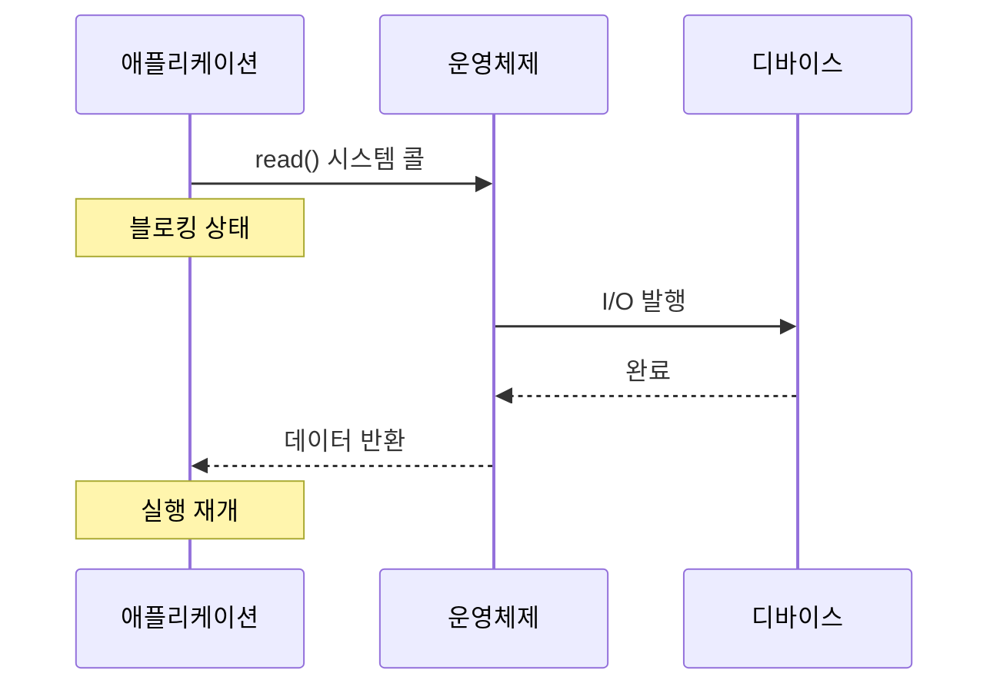
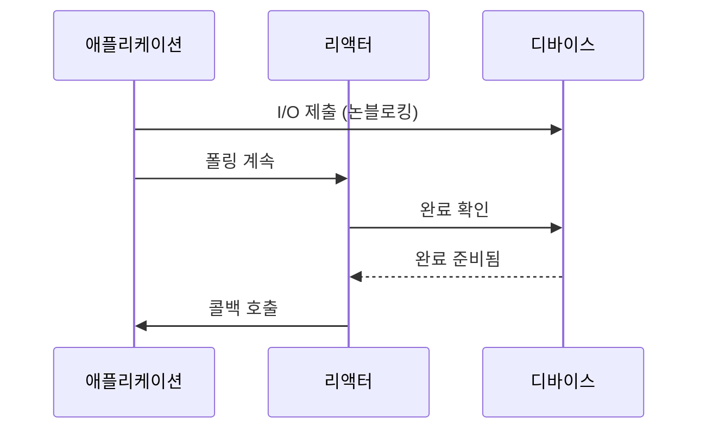
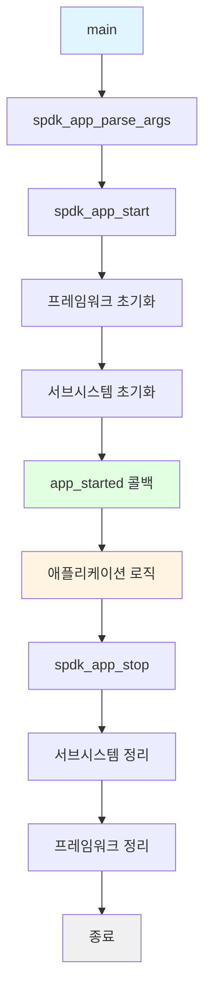
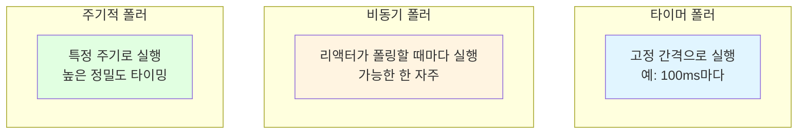
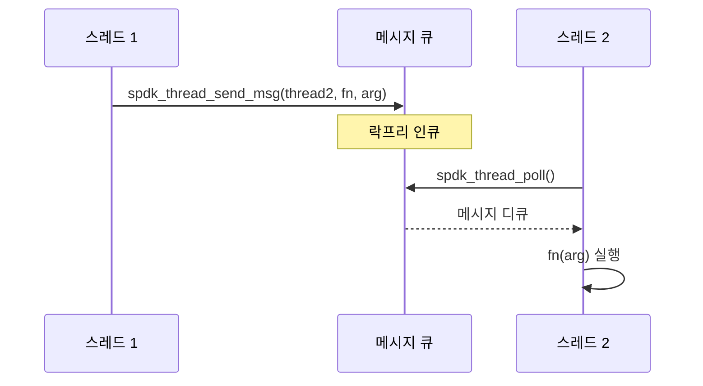
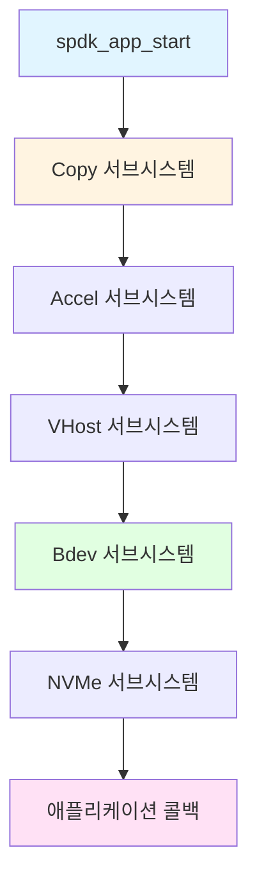

# 모듈 12: 이벤트 프레임워크(Event Framework)

**단계**: 2 (구현)
**난이도**: 중급
**예상 소요 시간**: 4시간
**선수 과목**: 모듈 01-11

---

## 학습 목표

- SPDK의 이벤트 기반 프로그래밍 모델(Event-Driven Programming Model) 이해
- spdk_app 프레임워크를 사용한 애플리케이션 구조 파악
- 폴러(Poller) 생성 및 관리 (타이머 폴러 및 비동기 폴러)
- 스레드 간 이벤트 전달
- 서브시스템(Subsystem) 적절한 초기화
- 관리용 JSON-RPC 서버 설정

---

## 핵심 개념

### 개념 1: 이벤트 기반 아키텍처(Event-Driven Architecture)

**전통적인 블로킹 I/O(Blocking I/O)**:


**SPDK 이벤트 기반 방식**:


**주요 차이점**:

| 항목 | 블로킹 방식 | 이벤트 기반 방식 |
|--------|----------|--------------|
| I/O 제출 | 스레드 블로킹 | 즉시 반환 |
| 완료 처리 | 블로킹 대기 | 콜백 호출 |
| 스레드 사용 | 작업당 하나 | 다수의 작업에서 공유 |
| 지연 시간 | 높음 (컨텍스트 스위치) | 낮음 (폴링) |
| 처리량 | 스레드 수에 제한 | 매우 높음 |

---

### 개념 2: spdk_app 프레임워크

**애플리케이션 구조**:


**기본 애플리케이션 템플릿**:
```c
#include "spdk/stdinc.h"
#include "spdk/event.h"
#include "spdk/log.h"

static void
app_started(void *arg1)
{
    SPDK_NOTICELOG("Application started!\n");

    // 여기에 초기화 코드 작성

    // 완료 시 선택적으로 중지:
    // spdk_app_stop(0);
}

static void
app_stopped(void *arg1)
{
    SPDK_NOTICELOG("Application stopped\n");
}

int
main(int argc, char **argv)
{
    struct spdk_app_opts opts = {};
    int rc;

    // 애플리케이션 이름과 기본 설정 지정
    spdk_app_opts_init(&opts, sizeof(opts));
    opts.name = "my_app";
    opts.config_file = NULL;  // 또는 JSON 설정 파일 경로
    opts.reactor_mask = "0x3"; // CPU 0과 1 사용
    opts.shutdown_cb = app_stopped;

    // 인자 파싱
    rc = spdk_app_parse_args(argc, argv, &opts, "", NULL, NULL, NULL);
    if (rc != 0) {
        return rc;
    }

    // 프레임워크 시작
    rc = spdk_app_start(&opts, app_started, NULL);

    // 정리 및 반환
    spdk_app_fini();
    return rc;
}
```

---

### 개념 3: 폴러(Poller)

**폴러 유형**:



**폴러 콜백 시그니처**:
```c
// 반환 값:
// SPDK_POLLER_BUSY - 작업을 수행했으므로 곧 다시 호출 필요
// SPDK_POLLER_IDLE - 작업 없음, 더 오래 대기 가능
static int
my_poller(void *arg)
{
    struct my_context *ctx = arg;

    // 작업 수행
    if (work_available(ctx)) {
        process_work(ctx);
        return SPDK_POLLER_BUSY;
    }

    return SPDK_POLLER_IDLE;
}
```

**폴러 생성**:
```c
#include "spdk/thread.h"

struct spdk_poller *poller;

// 타이머 폴러: 1000마이크로초마다 실행
poller = SPDK_POLLER_REGISTER(my_poller, ctx, 1000);

// 비동기 폴러: 가능한 한 빠르게 실행
poller = SPDK_POLLER_REGISTER(my_poller, ctx, 0);

// 완료 후 등록 해제
spdk_poller_unregister(&poller);
```

**실용 예제 - 주기적 상태 모니터**:
```c
struct status_monitor {
    uint64_t io_count;
    uint64_t last_count;
    struct spdk_poller *poller;
};

static int
status_poller(void *arg)
{
    struct status_monitor *mon = arg;
    uint64_t ios_per_sec;

    ios_per_sec = mon->io_count - mon->last_count;
    mon->last_count = mon->io_count;

    SPDK_NOTICELOG("I/O rate: %lu IOPS\n", ios_per_sec);

    return SPDK_POLLER_BUSY;
}

// 초기화 시:
struct status_monitor *mon = calloc(1, sizeof(*mon));
mon->poller = SPDK_POLLER_REGISTER(status_poller, mon, 1000000); // 1초
```

---

### 개념 4: 이벤트와 메시지(Events and Messages)

**이벤트 전달**:


**스레드 간 메시지 전송**:
```c
#include "spdk/thread.h"

static void
work_on_thread2(void *arg)
{
    struct my_data *data = arg;

    SPDK_NOTICELOG("Executing on thread: %s\n",
                   spdk_thread_get_name(spdk_get_thread()));

    // 스레드 2에서 작업 수행
    process_data(data);
}

// 스레드 1에서 스레드 2로 작업 전송
void
send_work_to_thread2(struct spdk_thread *thread2, struct my_data *data)
{
    spdk_thread_send_msg(thread2, work_on_thread2, data);
}
```

**크리티컬 메시지 전달(Critical Message Passing)**:
```c
// 반드시 실행되어야 하는 작업에 사용
static void
critical_work(void *arg)
{
    // 종료 중에도 이 함수는 실행됨
}

spdk_thread_send_critical_msg(target_thread, critical_work, arg);
```

---

### 개념 5: 서브시스템 프레임워크(Subsystem Framework)

**서브시스템 초기화 순서**:


**내장 서브시스템**:

| 서브시스템 | 용도 | 의존성 |
|-----------|---------|--------------|
| copy | 가속기 프레임워크 | 없음 |
| bdev | 블록 디바이스 레이어 | copy |
| nvme | NVMe 드라이버 | - |
| nvmf | NVMe-oF 타겟 | bdev |
| vhost | Vhost 타겟 | bdev |
| iscsi | iSCSI 타겟 | bdev, scsi |

**서브시스템 상태 확인**:
```c
#include "spdk/init.h"

static void
subsystems_initialized(int rc, void *arg)
{
    if (rc != 0) {
        SPDK_ERRLOG("Subsystem init failed: %d\n", rc);
        spdk_app_stop(-1);
        return;
    }

    SPDK_NOTICELOG("All subsystems ready\n");
    // 애플리케이션 로직 시작
}

// app_started 콜백에서:
spdk_subsystem_init(subsystems_initialized, NULL);
```

---

## SPDK 애플리케이션 API

### API 1: 애플리케이션 수명주기(Application Lifecycle)

**spdk_app_opts**:
```c
struct spdk_app_opts {
    const char *name;              // 애플리케이션 이름
    const char *json_config_file;  // JSON-RPC 설정 파일
    const char *rpc_addr;          // RPC 리슨 주소 (기본값: /var/tmp/spdk.sock)
    const char *reactor_mask;      // CPU 코어 마스크 (예: "0x3"은 코어 0,1)
    int shm_id;                    // 공유 메모리 ID (-1이면 자동)
    spdk_app_shutdown_cb shutdown_cb;
    spdk_msg_fn usr1_handler;      // SIGUSR1 핸들러
    bool enable_coredump;          // 코어 덤프 허용
    int mem_channel;               // DPDK 메모리 채널
    int main_core;                 // 메인 lcore
    int mem_size;                  // 메모리 풀 크기(MB) (-1이면 전체)
    bool no_pci;                   // PCI 디바이스 사용 안 함
    bool hugepage_single_segments; // 단일 파일 세그먼트 사용
    uint64_t tpoint_group_mask;    // 트레이스포인트 그룹 마스크
};
```

**초기화**:
```c
struct spdk_app_opts opts = {};

// 기본값으로 초기화
spdk_app_opts_init(&opts, sizeof(opts));

// 커스터마이즈
opts.name = "my_storage_app";
opts.reactor_mask = "0xF";  // CPU 0-3 사용
opts.rpc_addr = "/tmp/my_app.sock";
opts.mem_size = 2048;  // 2GB 메모리

int rc = spdk_app_parse_args(argc, argv, &opts, "", NULL,
                              parse_arg, usage);
```

---

### API 2: 폴러 관리(Poller Management)

**SPDK_POLLER_REGISTER**:
```c
struct spdk_poller *
SPDK_POLLER_REGISTER(spdk_poller_fn fn, void *arg, uint64_t period_microseconds);

// 예시: 100ms마다 실행
poller = SPDK_POLLER_REGISTER(my_callback, ctx, 100000);

// 예시: 연속 실행 (period = 0)
poller = SPDK_POLLER_REGISTER(fast_callback, ctx, 0);
```

**spdk_poller_unregister**:
```c
void spdk_poller_unregister(struct spdk_poller **ppoller);

// 등록 해제 후 NULL로 설정
spdk_poller_unregister(&my_poller);
```

**spdk_poller_pause/resume**:
```c
void spdk_poller_pause(struct spdk_poller *poller);
void spdk_poller_resume(struct spdk_poller *poller);

// 일시적으로 폴링 중지
spdk_poller_pause(poller);

// 나중에 재개
spdk_poller_resume(poller);
```

---

### API 3: 스레드 작업(Thread Operations)

**spdk_get_thread**:
```c
struct spdk_thread *spdk_get_thread(void);

// 현재 스레드 가져오기
struct spdk_thread *thread = spdk_get_thread();
const char *name = spdk_thread_get_name(thread);
```

**spdk_thread_send_msg**:
```c
int spdk_thread_send_msg(struct spdk_thread *thread,
                         spdk_msg_fn fn, void *ctx);

// 특정 스레드로 메시지 전송
spdk_thread_send_msg(target_thread, my_callback, my_data);
```

**스레드 로컬 컨텍스트(Thread-local Context)**:
```c
void *spdk_thread_get_ctx(struct spdk_thread *thread);
int spdk_thread_set_ctx(struct spdk_thread *thread, void *ctx);

// 애플리케이션 고유 데이터 저장
struct my_thread_ctx *ctx = malloc(sizeof(*ctx));
spdk_thread_set_ctx(thread, ctx);

// 나중에 가져오기
struct my_thread_ctx *ctx = spdk_thread_get_ctx(thread);
```

---

## 공통 패턴

### 패턴 1: 폴러가 있는 애플리케이션

```c
#include "spdk/stdinc.h"
#include "spdk/event.h"
#include "spdk/thread.h"

struct app_context {
    struct spdk_poller *poller;
    uint64_t tick_count;
};

static int
tick_poller(void *arg)
{
    struct app_context *ctx = arg;

    ctx->tick_count++;
    SPDK_NOTICELOG("Tick %lu\n", ctx->tick_count);

    if (ctx->tick_count >= 10) {
        SPDK_NOTICELOG("Done, stopping\n");
        spdk_poller_unregister(&ctx->poller);
        spdk_app_stop(0);
        return SPDK_POLLER_IDLE;
    }

    return SPDK_POLLER_BUSY;
}

static void
app_started(void *arg1)
{
    struct app_context *ctx = calloc(1, sizeof(*ctx));

    // 1초 간격 틱을 위한 폴러 등록
    ctx->poller = SPDK_POLLER_REGISTER(tick_poller, ctx, 1000000);

    SPDK_NOTICELOG("Application started\n");
}

int main(int argc, char **argv)
{
    struct spdk_app_opts opts = {};
    int rc;

    spdk_app_opts_init(&opts, sizeof(opts));
    opts.name = "tick_app";

    rc = spdk_app_start(&opts, app_started, NULL);
    spdk_app_fini();

    return rc;
}
```

---

### 패턴 2: 멀티 스레드 조율(Multi-Thread Coordination)

```c
struct work_item {
    void (*callback)(void *arg);
    void *arg;
};

static void
execute_work(void *arg)
{
    struct work_item *work = arg;

    work->callback(work->arg);
    free(work);
}

void
dispatch_work_to_thread(struct spdk_thread *thread,
                       void (*callback)(void *), void *arg)
{
    struct work_item *work = malloc(sizeof(*work));

    work->callback = callback;
    work->arg = arg;

    spdk_thread_send_msg(thread, execute_work, work);
}
```

---

### 패턴 3: JSON-RPC 설정

```c
#include "spdk/rpc.h"
#include "spdk/json.h"

struct rpc_hello_world {
    char *name;
};

static void
free_rpc_hello_world(struct rpc_hello_world *req)
{
    free(req->name);
}

static const struct spdk_json_object_decoder rpc_hello_world_decoders[] = {
    {"name", offsetof(struct rpc_hello_world, name), spdk_json_decode_string},
};

static void
rpc_hello_world(struct spdk_jsonrpc_request *request,
                const struct spdk_json_val *params)
{
    struct rpc_hello_world req = {};
    struct spdk_json_write_ctx *w;

    if (spdk_json_decode_object(params, rpc_hello_world_decoders,
                                SPDK_COUNTOF(rpc_hello_world_decoders),
                                &req)) {
        spdk_jsonrpc_send_error_response(request, SPDK_JSONRPC_ERROR_INVALID_PARAMS,
                                        "Invalid parameters");
        return;
    }

    w = spdk_jsonrpc_begin_result(request);
    spdk_json_write_object_begin(w);
    spdk_json_write_named_string(w, "message", "Hello");
    spdk_json_write_named_string(w, "name", req.name);
    spdk_json_write_object_end(w);
    spdk_jsonrpc_end_result(request, w);

    free_rpc_hello_world(&req);
}
SPDK_RPC_REGISTER("hello_world", rpc_hello_world, SPDK_RPC_RUNTIME)
```

**RPC 사용하기**:
```bash
# 커맨드 라인에서 호출
scripts/rpc.py hello_world -n "SPDK"

# 응답:
# {
#   "message": "Hello",
#   "name": "SPDK"
# }
```

---

## 연습 문제

### 연습 1: 타이머 애플리케이션

다음 기능을 가진 애플리케이션을 작성하세요:
1. spdk_app 프레임워크로 시작
2. 500ms 간격 폴러 생성
3. 각 틱마다 타임스탬프 출력
4. 10틱 후 중지

### 연습 2: 멀티 스레드 에코

2개의 스레드를 가진 애플리케이션을 작성하세요:
1. 스레드 1이 스레드 2로 메시지 전송
2. 스레드 2가 메시지를 되돌려 보냄
3. 5회 왕복 후 중지

### 연습 3: RPC 메서드

다음과 같은 커스텀 RPC 메서드를 추가하세요:
1. 숫자 매개변수를 받음
2. 해당 숫자의 제곱을 반환
3. scripts/rpc.py로 테스트

---

## 요약

**핵심 내용**:
1. spdk_app 프레임워크가 초기화/정리를 담당한다
2. 폴러(Poller)가 이벤트 기반 프로그래밍을 가능하게 한다
3. 메시지가 스레드 간 통신을 제공한다
4. 서브시스템은 의존성 순서대로 초기화된다
5. JSON-RPC가 런타임 관리를 가능하게 한다

**다음 단계**:
- 모듈 13: Bdev 레이어 (이벤트 프레임워크 활용)
- 폴러와 이벤트 연습
- SPDK 소스의 RPC 메서드 탐색

---

## 참고 자료

- `lib/event/app.c` - spdk_app 구현
- `lib/thread/thread.c` - 스레드 및 폴러 구현
- `include/spdk/event.h` - 이벤트 프레임워크 API
- `include/spdk/thread.h` - 스레드 API
- `include/spdk/rpc.h` - JSON-RPC API
- `examples/hello_world/` - 완전한 예제 애플리케이션
