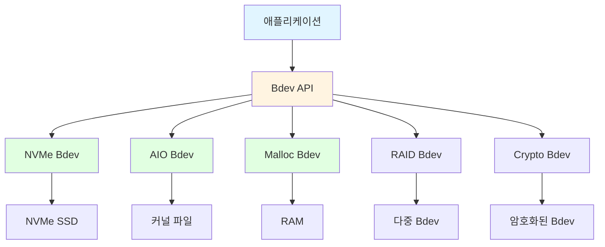
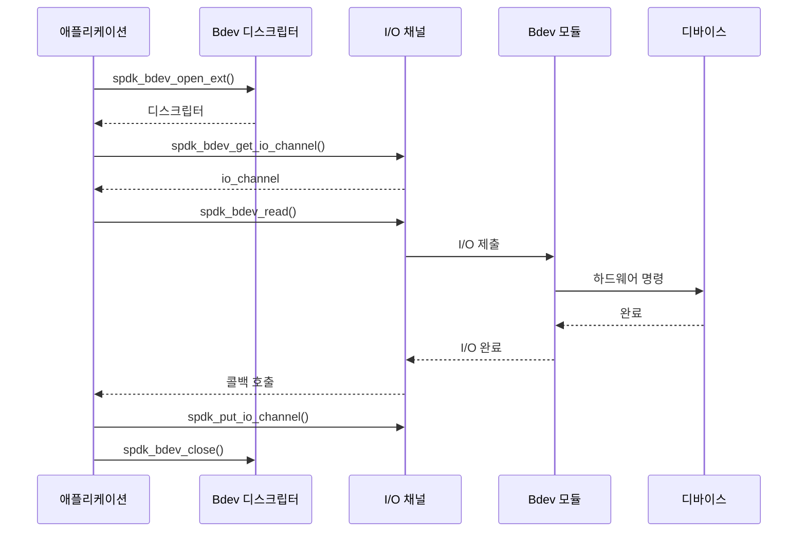
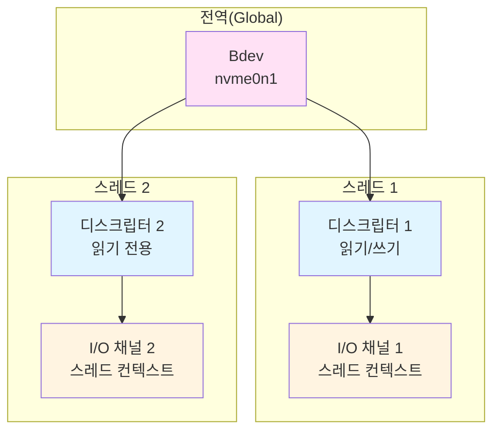

# 모듈 13: Bdev 레이어(Bdev Layer)

**단계**: 2 (구현)
**난이도**: 중급
**예상 소요 시간**: 4시간
**선수 과목**: 모듈 01-12

---

## 학습 목표

- 블록 디바이스 추상화 레이어(Bdev Abstraction Layer) 이해
- 애플리케이션에서 bdev 열기 및 사용
- I/O 작업(읽기/쓰기) 수행
- I/O 완료(Completion) 적절히 처리
- bdev 디스크립터(Descriptor)와 I/O 채널(I/O Channel) 사용
- I/O에 대한 오류 처리 구현
- bdev examine 및 claim 활용

---

## 핵심 개념

### 개념 1: Bdev 추상화

**목적**: 모든 스토리지 백엔드에 대한 통일된 인터페이스 제공.



**주요 이점**:
- **이식성**: 동일한 코드로 모든 백엔드와 작동
- **유연성**: 스토리지 유형을 쉽게 전환
- **계층화(Layering)**: bdev를 스택으로 구성 (NVMe 위에 RAID, RAID 위에 Crypto)
- **테스트**: 단위 테스트에 malloc bdev 사용 가능

---

### 개념 2: Bdev 작업 흐름



---

### 개념 3: Bdev, 디스크립터, 채널

**관계**:


**정의**:
- **Bdev**: 블록 디바이스를 나타내는 전역 객체
- **디스크립터(Descriptor)**: 특정 접근 권한(읽기/쓰기 또는 읽기 전용)을 가진 핸들
- **채널(Channel)**: 스레드별 I/O 컨텍스트 (큐 페어 등)

---

## Bdev API 사용법

### API 1: Bdev 열기 및 닫기

**spdk_bdev_open_ext**:
```c
#include "spdk/bdev.h"

struct spdk_bdev_desc *desc;
struct spdk_bdev *bdev;
int rc;

// 읽기/쓰기로 열기
rc = spdk_bdev_open_ext("nvme0n1", true, event_cb, NULL, &desc);
if (rc != 0) {
    SPDK_ERRLOG("Failed to open bdev: %d\n", rc);
    return rc;
}

// 디스크립터에서 bdev 가져오기
bdev = spdk_bdev_desc_get_bdev(desc);

SPDK_NOTICELOG("Opened %s: %lu blocks of %u bytes\n",
               spdk_bdev_get_name(bdev),
               spdk_bdev_get_num_blocks(bdev),
               spdk_bdev_get_block_size(bdev));
```

**이벤트 콜백(Event Callback)**:
```c
static void
event_cb(enum spdk_bdev_event_type type, struct spdk_bdev *bdev,
         void *event_ctx)
{
    SPDK_NOTICELOG("Bdev event: type %d bdev %s\n",
                   type, spdk_bdev_get_name(bdev));

    switch (type) {
    case SPDK_BDEV_EVENT_REMOVE:
        // bdev가 제거되는 중
        SPDK_NOTICELOG("Bdev removed, cleaning up\n");
        cleanup_and_close();
        break;
    case SPDK_BDEV_EVENT_RESIZE:
        // bdev 크기 변경
        SPDK_NOTICELOG("Bdev resized\n");
        break;
    default:
        break;
    }
}
```

**spdk_bdev_close**:
```c
void
cleanup(struct spdk_bdev_desc *desc, struct spdk_io_channel *ch)
{
    // 먼저 채널 해제
    if (ch) {
        spdk_put_io_channel(ch);
    }

    // 그 다음 디스크립터 닫기
    if (desc) {
        spdk_bdev_close(desc);
    }
}
```

---

### API 2: I/O 채널

**spdk_bdev_get_io_channel**:
```c
struct spdk_io_channel *ch;

// 현재 스레드의 I/O 채널 가져오기
ch = spdk_bdev_get_io_channel(desc);
if (ch == NULL) {
    SPDK_ERRLOG("Failed to get I/O channel\n");
    spdk_bdev_close(desc);
    return -1;
}
```

**채널이 중요한 이유**:
- 각 스레드는 자체 채널이 필요
- 채널에는 스레드 로컬 상태(큐 페어, 버퍼)가 포함
- 락프리(Lock-Free) I/O 제출 가능
- 자동 부하 분산

---

### API 3: I/O 작업

**spdk_bdev_read**:
```c
void
read_complete(struct spdk_bdev_io *bdev_io, bool success, void *cb_arg)
{
    if (!success) {
        SPDK_ERRLOG("Read failed\n");
    } else {
        SPDK_NOTICELOG("Read completed successfully\n");
        // 버퍼의 데이터 처리
    }

    // I/O 해제
    spdk_bdev_free_io(bdev_io);
}

void
do_read(struct spdk_bdev_desc *desc, struct spdk_io_channel *ch)
{
    void *buf;
    uint64_t offset = 0;  // 블록 오프셋
    uint64_t num_blocks = 1;
    int rc;

    // DMA 버퍼 할당
    buf = spdk_dma_malloc(512, 512, NULL);
    if (buf == NULL) {
        return;
    }

    // 읽기 제출
    rc = spdk_bdev_read(desc, ch, buf, offset, num_blocks,
                       read_complete, NULL);
    if (rc != 0) {
        SPDK_ERRLOG("Failed to submit read: %d\n", rc);
        spdk_dma_free(buf);
    }
}
```

**spdk_bdev_write**:
```c
void
write_complete(struct spdk_bdev_io *bdev_io, bool success, void *cb_arg)
{
    void *buf = cb_arg;

    if (!success) {
        SPDK_ERRLOG("Write failed\n");
    } else {
        SPDK_NOTICELOG("Write completed\n");
    }

    spdk_dma_free(buf);
    spdk_bdev_free_io(bdev_io);
}

void
do_write(struct spdk_bdev_desc *desc, struct spdk_io_channel *ch,
         uint64_t offset, const void *data, size_t len)
{
    struct spdk_bdev *bdev = spdk_bdev_desc_get_bdev(desc);
    uint32_t block_size = spdk_bdev_get_block_size(bdev);
    uint64_t num_blocks = len / block_size;
    void *buf;
    int rc;

    // 할당 및 데이터 복사
    buf = spdk_dma_malloc(len, block_size, NULL);
    memcpy(buf, data, len);

    // 쓰기 제출
    rc = spdk_bdev_write(desc, ch, buf, offset, num_blocks,
                        write_complete, buf);
    if (rc != 0) {
        SPDK_ERRLOG("Failed to submit write: %d\n", rc);
        spdk_dma_free(buf);
    }
}
```

**spdk_bdev_write_zeroes**:
```c
// 효율적인 제로 채우기 (하드웨어 지원 시 사용)
rc = spdk_bdev_write_zeroes(desc, ch, offset, num_blocks,
                            completion_cb, NULL);
```

**spdk_bdev_unmap**:
```c
// SSD의 TRIM/UNMAP
rc = spdk_bdev_unmap(desc, ch, offset, num_blocks,
                     completion_cb, NULL);
```

---

### API 4: Bdev 정보

**Bdev 속성 가져오기**:
```c
struct spdk_bdev *bdev = spdk_bdev_desc_get_bdev(desc);

// 기본 속성
const char *name = spdk_bdev_get_name(bdev);
uint64_t num_blocks = spdk_bdev_get_num_blocks(bdev);
uint32_t block_size = spdk_bdev_get_block_size(bdev);
uint64_t size_bytes = num_blocks * block_size;

// 기능
bool supports_unmap = spdk_bdev_io_type_supported(bdev, SPDK_BDEV_IO_TYPE_UNMAP);
bool supports_write_zeroes = spdk_bdev_io_type_supported(bdev,
                                                         SPDK_BDEV_IO_TYPE_WRITE_ZEROES);

// 정렬 요구 사항
uint32_t buf_align = spdk_bdev_get_buf_align(bdev);

// 최적 I/O 크기
uint32_t optimal_blocks = spdk_bdev_get_optimal_io_boundary(bdev);

SPDK_NOTICELOG("Bdev %s:\n"
               "  Size: %lu blocks x %u bytes = %lu bytes\n"
               "  Alignment: %u\n"
               "  Optimal I/O: %u blocks\n"
               "  UNMAP: %s\n"
               "  WRITE_ZEROES: %s\n",
               name, num_blocks, block_size, size_bytes,
               buf_align, optimal_blocks,
               supports_unmap ? "yes" : "no",
               supports_write_zeroes ? "yes" : "no");
```

---

## 공통 패턴

### 패턴 1: 간단한 읽기 애플리케이션

```c
#include "spdk/stdinc.h"
#include "spdk/event.h"
#include "spdk/bdev.h"
#include "spdk/log.h"

struct app_context {
    struct spdk_bdev_desc *desc;
    struct spdk_io_channel *ch;
    void *buf;
};

static void
read_complete(struct spdk_bdev_io *bdev_io, bool success, void *cb_arg)
{
    struct app_context *ctx = cb_arg;

    if (success) {
        SPDK_NOTICELOG("Read successful\n");
        // 처음 64바이트 출력
        spdk_log_dump(stdout, "Data:", ctx->buf, 64);
    } else {
        SPDK_ERRLOG("Read failed\n");
    }

    spdk_bdev_free_io(bdev_io);
    spdk_dma_free(ctx->buf);
    spdk_put_io_channel(ctx->ch);
    spdk_bdev_close(ctx->desc);
    free(ctx);

    spdk_app_stop(success ? 0 : -1);
}

static void
do_read(void *arg)
{
    struct app_context *ctx = arg;
    struct spdk_bdev *bdev;
    int rc;

    bdev = spdk_bdev_desc_get_bdev(ctx->desc);
    ctx->buf = spdk_dma_malloc(4096, 4096, NULL);

    rc = spdk_bdev_read(ctx->desc, ctx->ch, ctx->buf, 0, 1,
                       read_complete, ctx);
    if (rc != 0) {
        SPDK_ERRLOG("Failed to submit read\n");
        spdk_dma_free(ctx->buf);
        spdk_put_io_channel(ctx->ch);
        spdk_bdev_close(ctx->desc);
        free(ctx);
        spdk_app_stop(-1);
    }
}

static void
bdev_event_cb(enum spdk_bdev_event_type type, struct spdk_bdev *bdev,
              void *event_ctx)
{
    SPDK_WARNLOG("Bdev event: %d\n", type);
}

static void
app_started(void *arg1)
{
    struct app_context *ctx;
    int rc;

    ctx = calloc(1, sizeof(*ctx));

    rc = spdk_bdev_open_ext("Malloc0", true, bdev_event_cb, NULL, &ctx->desc);
    if (rc != 0) {
        SPDK_ERRLOG("Failed to open bdev\n");
        free(ctx);
        spdk_app_stop(-1);
        return;
    }

    ctx->ch = spdk_bdev_get_io_channel(ctx->desc);
    if (ctx->ch == NULL) {
        SPDK_ERRLOG("Failed to get I/O channel\n");
        spdk_bdev_close(ctx->desc);
        free(ctx);
        spdk_app_stop(-1);
        return;
    }

    do_read(ctx);
}

int
main(int argc, char **argv)
{
    struct spdk_app_opts opts = {};
    int rc;

    spdk_app_opts_init(&opts, sizeof(opts));
    opts.name = "bdev_reader";
    opts.json_config_file = "bdev.json";  // Malloc0 설정 포함

    rc = spdk_app_start(&opts, app_started, NULL);
    spdk_app_fini();

    return rc;
}
```

**설정 파일 (bdev.json)**:
```json
{
  "subsystems": [
    {
      "subsystem": "bdev",
      "config": [
        {
          "method": "bdev_malloc_create",
          "params": {
            "name": "Malloc0",
            "num_blocks": 65536,
            "block_size": 4096
          }
        }
      ]
    }
  ]
}
```

---

### 패턴 2: 콜백을 사용한 순차 I/O

```c
struct io_context {
    struct spdk_bdev_desc *desc;
    struct spdk_io_channel *ch;
    uint64_t current_offset;
    uint64_t total_blocks;
    uint64_t blocks_per_io;
};

static void read_next(struct io_context *io_ctx);

static void
read_complete(struct spdk_bdev_io *bdev_io, bool success, void *cb_arg)
{
    struct io_context *io_ctx = cb_arg;
    void *buf;

    if (!success) {
        SPDK_ERRLOG("I/O failed at offset %lu\n", io_ctx->current_offset);
        spdk_bdev_free_io(bdev_io);
        cleanup_and_exit(io_ctx);
        return;
    }

    // I/O에서 버퍼 가져오기
    buf = spdk_bdev_io_get_buf(bdev_io);

    // 데이터 처리
    SPDK_NOTICELOG("Read %lu blocks at offset %lu\n",
                   io_ctx->blocks_per_io, io_ctx->current_offset);

    spdk_bdev_free_io(bdev_io);

    // 다음 청크로 이동
    io_ctx->current_offset += io_ctx->blocks_per_io;

    if (io_ctx->current_offset < io_ctx->total_blocks) {
        // 계속 읽기
        read_next(io_ctx);
    } else {
        // 완료
        SPDK_NOTICELOG("Completed sequential read\n");
        cleanup_and_exit(io_ctx);
    }
}

static void
read_next(struct io_context *io_ctx)
{
    void *buf;
    uint64_t num_blocks;
    int rc;

    // 읽을 블록 수 계산
    num_blocks = spdk_min(io_ctx->blocks_per_io,
                         io_ctx->total_blocks - io_ctx->current_offset);

    // 버퍼 할당
    buf = spdk_dma_malloc(num_blocks * 4096, 4096, NULL);

    // I/O 제출
    rc = spdk_bdev_read(io_ctx->desc, io_ctx->ch, buf,
                       io_ctx->current_offset, num_blocks,
                       read_complete, io_ctx);
    if (rc != 0) {
        SPDK_ERRLOG("Failed to submit I/O\n");
        spdk_dma_free(buf);
        cleanup_and_exit(io_ctx);
    }
}
```

---

### 패턴 3: Bdev 순회(Iteration)

```c
static void
print_bdev_info(struct spdk_bdev *bdev)
{
    SPDK_NOTICELOG("Bdev: %s\n", spdk_bdev_get_name(bdev));
    SPDK_NOTICELOG("  Product: %s\n", spdk_bdev_get_product_name(bdev));
    SPDK_NOTICELOG("  Size: %lu blocks x %u bytes\n",
                   spdk_bdev_get_num_blocks(bdev),
                   spdk_bdev_get_block_size(bdev));
}

static void
enumerate_bdevs(void)
{
    struct spdk_bdev *bdev;

    // 모든 bdev 순회
    bdev = spdk_bdev_first();
    while (bdev != NULL) {
        print_bdev_info(bdev);
        bdev = spdk_bdev_next(bdev);
    }
}

// 또는 이름으로 가져오기
struct spdk_bdev *bdev = spdk_bdev_get_by_name("nvme0n1");
if (bdev) {
    print_bdev_info(bdev);
}
```

---

## 오류 처리

### I/O 오류 유형

```c
static void
io_complete(struct spdk_bdev_io *bdev_io, bool success, void *cb_arg)
{
    if (!success) {
        enum spdk_bdev_io_status status;

        status = spdk_bdev_io_get_status(bdev_io);

        switch (status) {
        case SPDK_BDEV_IO_STATUS_SUCCESS:
            // success == false이면 여기에 도달하지 않음
            break;
        case SPDK_BDEV_IO_STATUS_FAILED:
            SPDK_ERRLOG("I/O failed\n");
            break;
        case SPDK_BDEV_IO_STATUS_NVME_ERROR:
            SPDK_ERRLOG("NVMe error\n");
            // 상세한 NVMe 상태를 가져올 수 있음
            break;
        case SPDK_BDEV_IO_STATUS_SCSI_ERROR:
            SPDK_ERRLOG("SCSI error\n");
            break;
        case SPDK_BDEV_IO_STATUS_ABORTED:
            SPDK_ERRLOG("I/O aborted\n");
            break;
        default:
            SPDK_ERRLOG("Unknown error: %d\n", status);
            break;
        }
    }

    spdk_bdev_free_io(bdev_io);
}
```

---

## 메모리 관리

### DMA 버퍼 할당

```c
// DMA 안전 버퍼 할당
void *buf = spdk_dma_malloc(size, alignment, NULL);

// 특정 소켓(NUMA)에서 할당
void *buf = spdk_dma_malloc_socket(size, alignment, NULL, socket_id);

// 제로 초기화 할당
void *buf = spdk_dma_zmalloc(size, alignment, NULL);

// 해제
spdk_dma_free(buf);
```

**중요**: I/O 버퍼에는 항상 spdk_dma_malloc을 사용해야 하며, 일반 malloc을 사용하면 안 됩니다!

---

## 연습 문제

### 연습 1: Bdev 열거자(Enumerator)

다음 기능을 가진 애플리케이션을 작성하세요:
1. 사용 가능한 모든 bdev 나열
2. 크기, 블록 크기, 기능 출력
3. 정상 종료

### 연습 2: 쓰기 및 검증

다음 기능을 가진 애플리케이션을 작성하세요:
1. 블록 0에 패턴 쓰기
2. 다시 읽기
3. 데이터 일치 검증
4. 성공/실패 보고

### 연습 3: 순차 스캐너

다음 기능을 가진 애플리케이션을 작성하세요:
1. bdev를 순차적으로 읽기
2. 0이 아닌 블록 수 세기
3. 완료 시 통계 보고

---

## 요약

**핵심 개념**:
1. Bdev는 통일된 스토리지 인터페이스를 제공한다
2. 디스크립터(Descriptor)가 접근 권한을 제어한다
3. 채널(Channel)이 스레드별 락프리 I/O를 가능하게 한다
4. 모든 I/O는 콜백을 통한 비동기 방식이다
5. I/O 작업에는 DMA 버퍼가 필요하다

**모범 사례**:
- 항상 반환 코드를 확인할 것
- 완료 콜백에서 I/O를 해제할 것
- 디스크립터를 닫기 전에 채널을 먼저 해제할 것
- 적절한 버퍼 정렬을 사용할 것
- bdev 이벤트(제거, 크기 변경)를 처리할 것

**다음 단계**:
- 모듈 14: NVMe 드라이버 (기반 구현)
- 모듈 16: 커스텀 Bdev 모듈 (직접 만들기)

---

## 참고 자료

- `lib/bdev/bdev.c` - Bdev 코어 구현
- `include/spdk/bdev.h` - Bdev API
- `include/spdk/bdev_module.h` - Bdev 모듈 인터페이스
- `examples/bdev/hello_world/` - 완전한 예제
- `module/bdev/` - 내장 bdev 모듈
