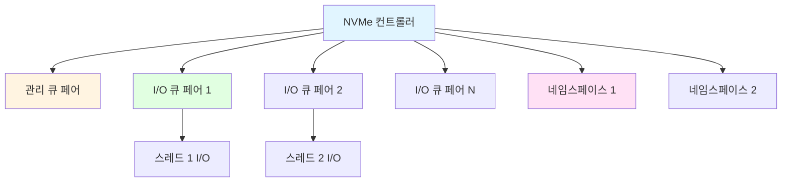
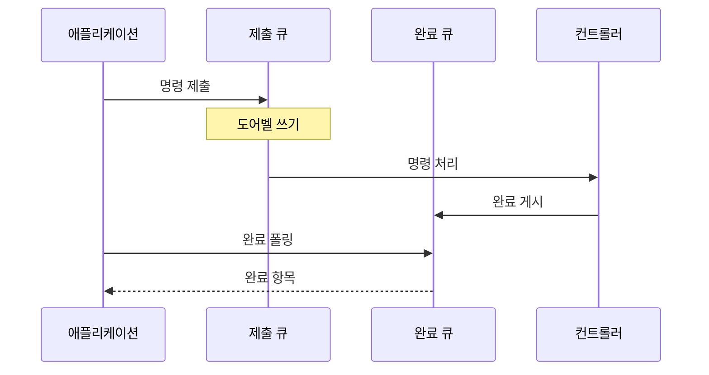

# 모듈 14: NVMe 드라이버

**단계**: 2 (구현)
**난이도**: 중급
**예상 소요 시간**: 4시간
**선수 과목**: 모듈 01-13

---

## 학습 목표

- NVMe 컨트롤러 초기화 및 사용
- 네임스페이스(Namespace)와 큐 페어(Queue Pair) 관리
- NVMe 명령 직접 제출
- NVMe 관련 오류 처리
- 관리 명령(Admin Command) 사용
- 트랜스포트 추상화(Transport Abstraction) 이해

---

## 핵심 개념

### 개념 1: NVMe 아키텍처



**구성 요소**:
- **컨트롤러(Controller)**: 물리적 NVMe 디바이스
- **네임스페이스(Namespace)**: 컨트롤러의 논리적 볼륨
- **큐 페어(Queue Pair)**: 제출 큐 + 완료 큐
- **관리 큐 페어(Admin QP)**: 관리 명령을 위한 특수 큐

---

### 개념 2: 큐 페어 모델



---

## NVMe 드라이버 API

### API 1: 프로빙 및 초기화

**spdk_nvme_probe**:
```c
#include "spdk/nvme.h"

struct nvme_context {
    struct spdk_nvme_ctrlr *ctrlr;
    struct spdk_nvme_ns *ns;
    struct spdk_nvme_qpair *qpair;
};

static bool
probe_cb(void *cb_ctx, const struct spdk_nvme_transport_id *trid,
         struct spdk_nvme_ctrlr_opts *opts)
{
    SPDK_NOTICELOG("Probing: %s\n", trid->traddr);
    return true;  // 이 디바이스에 연결
}

static void
attach_cb(void *cb_ctx, const struct spdk_nvme_transport_id *trid,
          struct spdk_nvme_ctrlr *ctrlr,
          const struct spdk_nvme_ctrlr_opts *opts)
{
    struct nvme_context *ctx = cb_ctx;
    int nsid;

    SPDK_NOTICELOG("Attached to %s\n", trid->traddr);

    ctx->ctrlr = ctrlr;

    // 첫 번째 활성 네임스페이스 가져오기
    nsid = spdk_nvme_ctrlr_get_first_active_ns(ctrlr);
    if (nsid == 0) {
        SPDK_ERRLOG("No active namespaces\n");
        return;
    }

    ctx->ns = spdk_nvme_ctrlr_get_ns(ctrlr, nsid);
    if (!spdk_nvme_ns_is_active(ctx->ns)) {
        SPDK_ERRLOG("Namespace %d not active\n", nsid);
        return;
    }

    SPDK_NOTICELOG("Namespace ID: %d, Size: %lu sectors\n",
                   nsid, spdk_nvme_ns_get_num_sectors(ctx->ns));
}

int
probe_nvme_devices(struct nvme_context *ctx)
{
    int rc;

    rc = spdk_nvme_probe(NULL, ctx, probe_cb, attach_cb, NULL);
    if (rc != 0) {
        SPDK_ERRLOG("NVMe probe failed\n");
        return rc;
    }

    return 0;
}
```

---

### API 2: 큐 페어 관리

**spdk_nvme_ctrlr_alloc_io_qpair**:
```c
struct spdk_nvme_qpair *
allocate_qpair(struct spdk_nvme_ctrlr *ctrlr)
{
    struct spdk_nvme_io_qpair_opts opts;
    struct spdk_nvme_qpair *qpair;

    spdk_nvme_ctrlr_get_default_io_qpair_opts(ctrlr, &opts, sizeof(opts));

    // 옵션 커스터마이즈
    opts.qprio = SPDK_NVME_QPRIO_URGENT;  // 높은 우선순위
    opts.io_queue_size = 128;              // 큐 깊이
    opts.io_queue_requests = 256;          // 요청 풀 크기

    qpair = spdk_nvme_ctrlr_alloc_io_qpair(ctrlr, &opts, sizeof(opts));
    if (qpair == NULL) {
        SPDK_ERRLOG("Failed to allocate queue pair\n");
        return NULL;
    }

    return qpair;
}

void
free_qpair(struct spdk_nvme_qpair *qpair)
{
    int rc = spdk_nvme_ctrlr_free_io_qpair(qpair);
    if (rc != 0) {
        SPDK_ERRLOG("Failed to free qpair\n");
    }
}
```

---

### API 3: I/O 작업

**spdk_nvme_ns_cmd_read/write**:
```c
struct io_request {
    void *buf;
    uint64_t lba;
    uint32_t lba_count;
    bool completed;
    int status;
};

static void
read_complete(void *arg, const struct spdk_nvme_cpl *completion)
{
    struct io_request *req = arg;

    if (spdk_nvme_cpl_is_error(completion)) {
        SPDK_ERRLOG("Read error: SC %02x SCT %02x\n",
                    completion->status.sc, completion->status.sct);
        req->status = -1;
    } else {
        req->status = 0;
    }

    req->completed = true;
}

int
do_nvme_read(struct spdk_nvme_ns *ns, struct spdk_nvme_qpair *qpair,
             void *buf, uint64_t lba, uint32_t lba_count)
{
    struct io_request req = { .buf = buf, .lba = lba,
                             .lba_count = lba_count,
                             .completed = false };
    int rc;

    rc = spdk_nvme_ns_cmd_read(ns, qpair, buf, lba, lba_count,
                              read_complete, &req, 0);
    if (rc != 0) {
        SPDK_ERRLOG("Failed to submit read\n");
        return rc;
    }

    // 완료 폴링
    while (!req.completed) {
        spdk_nvme_qpair_process_completions(qpair, 0);
    }

    return req.status;
}

int
do_nvme_write(struct spdk_nvme_ns *ns, struct spdk_nvme_qpair *qpair,
              void *buf, uint64_t lba, uint32_t lba_count)
{
    struct io_request req = { .completed = false };
    int rc;

    rc = spdk_nvme_ns_cmd_write(ns, qpair, buf, lba, lba_count,
                               read_complete, &req, 0);
    if (rc != 0) {
        return rc;
    }

    while (!req.completed) {
        spdk_nvme_qpair_process_completions(qpair, 0);
    }

    return req.status;
}
```

**폴러를 사용한 비동기 I/O(Async I/O with Poller)**:
```c
struct io_context {
    struct spdk_nvme_qpair *qpair;
    struct spdk_poller *poller;
    uint64_t outstanding_ios;
};

static int
completion_poller(void *arg)
{
    struct io_context *ctx = arg;
    int32_t num_completions;

    num_completions = spdk_nvme_qpair_process_completions(ctx->qpair, 0);

    if (num_completions < 0) {
        SPDK_ERRLOG("Error processing completions\n");
        return SPDK_POLLER_IDLE;
    }

    return num_completions > 0 ? SPDK_POLLER_BUSY : SPDK_POLLER_IDLE;
}

void
setup_async_io(struct io_context *ctx)
{
    // 완료를 확인하는 폴러 등록
    ctx->poller = SPDK_POLLER_REGISTER(completion_poller, ctx, 0);
}
```

---

### API 4: 관리 명령(Admin Commands)

**로그 페이지 가져오기(Get Log Page)**:
```c
struct spdk_nvme_health_information_page {
    // ... 상태 데이터 필드
};

void
get_health_info(struct spdk_nvme_ctrlr *ctrlr)
{
    struct spdk_nvme_health_information_page health;
    int rc;

    rc = spdk_nvme_ctrlr_cmd_get_log_page(ctrlr,
                                          SPDK_NVME_LOG_HEALTH_INFORMATION,
                                          SPDK_NVME_GLOBAL_NS_TAG,
                                          &health, sizeof(health),
                                          0, NULL, NULL);
    if (rc == 0) {
        SPDK_NOTICELOG("Temperature: %u K\n", health.temperature);
        SPDK_NOTICELOG("Available Spare: %u%%\n", health.available_spare);
    }
}
```

**컨트롤러 식별(Identify Controller)**:
```c
void
print_controller_info(struct spdk_nvme_ctrlr *ctrlr)
{
    const struct spdk_nvme_ctrlr_data *cdata;

    cdata = spdk_nvme_ctrlr_get_data(ctrlr);

    SPDK_NOTICELOG("Controller Information:\n");
    SPDK_NOTICELOG("  Model Number: %.40s\n", cdata->mn);
    SPDK_NOTICELOG("  Serial Number: %.20s\n", cdata->sn);
    SPDK_NOTICELOG("  Firmware: %.8s\n", cdata->fr);
    SPDK_NOTICELOG("  Max Data Transfer: %u\n", cdata->mdts);
}
```

**네임스페이스 식별(Identify Namespace)**:
```c
void
print_namespace_info(struct spdk_nvme_ns *ns)
{
    const struct spdk_nvme_ns_data *nsdata;
    uint64_t size_bytes;
    uint32_t sector_size;

    nsdata = spdk_nvme_ns_get_data(ns);
    sector_size = spdk_nvme_ns_get_sector_size(ns);
    size_bytes = spdk_nvme_ns_get_size(ns);

    SPDK_NOTICELOG("Namespace Information:\n");
    SPDK_NOTICELOG("  ID: %u\n", spdk_nvme_ns_get_id(ns));
    SPDK_NOTICELOG("  Size: %lu bytes (%lu sectors)\n",
                   size_bytes, spdk_nvme_ns_get_num_sectors(ns));
    SPDK_NOTICELOG("  Sector Size: %u bytes\n", sector_size);
    SPDK_NOTICELOG("  Optimal I/O Boundary: %u blocks\n",
                   spdk_nvme_ns_get_optimal_io_boundary(ns));
}
```

---

## 공통 패턴

### 패턴 1: 완전한 NVMe 애플리케이션

```c
#include "spdk/stdinc.h"
#include "spdk/nvme.h"
#include "spdk/env.h"

struct nvme_app {
    struct spdk_nvme_ctrlr *ctrlr;
    struct spdk_nvme_ns *ns;
    struct spdk_nvme_qpair *qpair;
    void *buf;
};

static void
cleanup(struct nvme_app *app)
{
    if (app->qpair) {
        spdk_nvme_ctrlr_free_io_qpair(app->qpair);
    }
    if (app->ctrlr) {
        spdk_nvme_detach(app->ctrlr);
    }
    if (app->buf) {
        spdk_free(app->buf);
    }
    free(app);
}

static bool
probe_cb(void *cb_ctx, const struct spdk_nvme_transport_id *trid,
         struct spdk_nvme_ctrlr_opts *opts)
{
    return true;
}

static void
attach_cb(void *cb_ctx, const struct spdk_nvme_transport_id *trid,
          struct spdk_nvme_ctrlr *ctrlr,
          const struct spdk_nvme_ctrlr_opts *opts)
{
    struct nvme_app *app = cb_ctx;
    int nsid;

    app->ctrlr = ctrlr;

    nsid = spdk_nvme_ctrlr_get_first_active_ns(ctrlr);
    app->ns = spdk_nvme_ctrlr_get_ns(ctrlr, nsid);

    print_controller_info(ctrlr);
    print_namespace_info(app->ns);
}

int
main(int argc, char **argv)
{
    struct nvme_app *app;
    struct spdk_env_opts opts;
    int rc;

    app = calloc(1, sizeof(*app));

    // SPDK 환경 초기화
    spdk_env_opts_init(&opts);
    opts.name = "nvme_app";

    rc = spdk_env_init(&opts);
    if (rc != 0) {
        free(app);
        return 1;
    }

    // NVMe 디바이스 프로빙
    rc = spdk_nvme_probe(NULL, app, probe_cb, attach_cb, NULL);
    if (rc != 0 || app->ctrlr == NULL) {
        fprintf(stderr, "No NVMe controllers found\n");
        cleanup(app);
        return 1;
    }

    // 큐 페어 할당
    app->qpair = allocate_qpair(app->ctrlr);
    if (app->qpair == NULL) {
        cleanup(app);
        return 1;
    }

    // I/O 버퍼 할당
    app->buf = spdk_zmalloc(4096, 4096, NULL, SPDK_ENV_SOCKET_ID_ANY,
                            SPDK_MALLOC_DMA);

    // I/O 수행
    rc = do_nvme_read(app->ns, app->qpair, app->buf, 0, 1);
    if (rc == 0) {
        printf("Read successful\n");
    }

    // 정리
    cleanup(app);

    return rc;
}
```

---

## 오류 처리

### NVMe 상태 코드(Status Codes)

```c
static void
handle_completion(const struct spdk_nvme_cpl *cpl)
{
    if (spdk_nvme_cpl_is_error(cpl)) {
        uint8_t sct = cpl->status.sct;  // 상태 코드 유형(Status Code Type)
        uint8_t sc = cpl->status.sc;    // 상태 코드(Status Code)

        switch (sct) {
        case SPDK_NVME_SCT_GENERIC:
            switch (sc) {
            case SPDK_NVME_SC_SUCCESS:
                break;
            case SPDK_NVME_SC_INVALID_OPCODE:
                SPDK_ERRLOG("Invalid opcode\n");
                break;
            case SPDK_NVME_SC_INVALID_FIELD:
                SPDK_ERRLOG("Invalid field\n");
                break;
            case SPDK_NVME_SC_LBA_OUT_OF_RANGE:
                SPDK_ERRLOG("LBA out of range\n");
                break;
            default:
                SPDK_ERRLOG("Generic error: SC %02x\n", sc);
                break;
            }
            break;

        case SPDK_NVME_SCT_COMMAND_SPECIFIC:
            SPDK_ERRLOG("Command-specific error: SC %02x\n", sc);
            break;

        case SPDK_NVME_SCT_MEDIA_ERROR:
            SPDK_ERRLOG("Media error: SC %02x\n", sc);
            break;

        default:
            SPDK_ERRLOG("Unknown SCT: %02x SC: %02x\n", sct, sc);
            break;
        }
    }
}
```

---

## 요약

**핵심 사항**:
1. NVMe는 I/O 제출에 큐 페어(Queue Pair)를 사용한다
2. 각 스레드는 자체 큐 페어를 가져야 한다
3. 관리 큐(Admin Queue)는 관리 명령용이다
4. 네임스페이스(Namespace)는 논리적 볼륨이다
5. 완료는 반드시 폴링해야 한다

**모범 사례**:
- 스레드당 하나의 큐 페어 사용
- 정기적으로 완료를 폴링할 것
- 오류를 적절히 처리할 것
- 정렬된 버퍼를 사용할 것
- 네임스페이스 속성을 확인할 것

**다음 단계**:
- 모듈 15: JSON-RPC 인터페이스
- 모듈 16: 커스텀 Bdev 모듈

---

## 참고 자료

- `lib/nvme/nvme.c` - NVMe 드라이버 코어
- `include/spdk/nvme.h` - NVMe API
- `include/spdk/nvme_spec.h` - NVMe 사양
- `examples/nvme/hello_world/` - 간단한 예제
- NVMe 사양: nvmexpress.org
