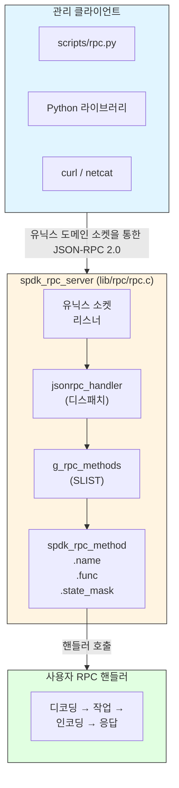

# 모듈 15: JSON-RPC 인터페이스

**단계**: 2 (구현)
**난이도**: 중급
**예상 소요 시간**: 4시간
**선수 과목**: 모듈 01-14

---

## 학습 목표

이 모듈을 완료하면 다음을 할 수 있습니다:

- SPDK의 JSON-RPC 2.0 프레임워크 아키텍처 설명하기
- `SPDK_RPC_REGISTER`를 사용하여 커스텀 RPC 메서드 등록하기
- `spdk_json_decode_object`로 요청 파라미터 파싱하기
- `spdk_json_write_*` 함수로 구조화된 응답 빌드하기
- 동기 및 비동기 RPC 핸들러 구현하기
- `scripts/rpc.py`와 Python 클라이언트 라이브러리를 프로그래밍 방식으로 사용하기
- 표준 JSON-RPC 에러 코드를 사용한 올바른 에러 보고 적용하기
- 프로덕션 RPC 배포를 위한 보안 모범 사례 적용하기
- 처음부터 완전한 커스텀 RPC 메서드 구현하기

---

## 1. RPC 프레임워크 아키텍처

### 1.1 개요

SPDK는 유닉스 도메인 소켓(Unix Domain Socket)을 통한 **JSON-RPC 2.0** 관리 인터페이스를 노출합니다 (기본값: `/var/tmp/spdk.sock`). 런타임 구성이 필요한 모든 서브시스템은 시작 시 C 생성자 함수(Constructor Function)를 통해 메서드를 등록합니다. 서버는 SPDK 앱 스레드에서 폴링되므로, 인터페이스가 단일 스레드이고 락 프리(Lock-free)로 유지됩니다.



### 1.2 주요 소스 파일

| 파일 | 용도 |
|------|---------|
| `include/spdk/rpc.h` | 공개 등록 API 및 상태 마스크 |
| `include/spdk/jsonrpc.h` | JSON-RPC 2.0 프로토콜 타입 및 응답 API |
| `include/spdk/json.h` | JSON 인코딩/디코딩 프리미티브 |
| `lib/rpc/rpc.c` | RPC 서버 구현 (디스패치, 허용 목록) |
| `lib/jsonrpc/` | 소켓을 통한 저수준 JSON-RPC 프레이밍 |
| `scripts/rpc.py` | 명령줄 클라이언트 |
| `python/spdk/rpc/client.py` | Python `JSONRPCClient` 클래스 |

### 1.3 서버 수명 주기(Lifecycle)

RPC 서버는 SPDK 앱 프레임워크에 통합되어 있습니다:

```c
/* Simplified from lib/event/app.c */

/* 1. 앱 시작 시 서버가 리스닝 시작 */
g_rpc_server = spdk_rpc_server_listen("/var/tmp/spdk.sock");

/* 2. 이벤트 루프 폴러가 매 리액터 사이클마다 accept/poll 호출 */
spdk_rpc_server_accept(g_rpc_server);

/* 3. 서브시스템이 C 생성자로 RPC 메서드 등록 */
/*    (main() 전에 실행, 우선순위 1000) */

/* 4. framework_start_init 후, 상태 전환 STARTUP -> RUNTIME */
spdk_rpc_set_state(SPDK_RPC_RUNTIME);

/* 5. 종료 시 */
spdk_rpc_server_close(g_rpc_server);
```

### 1.4 RPC 상태 머신(State Machine)

서버는 2단계 상태 모델을 적용합니다. 메서드는 어떤 단계에서 유효한지 선언해야 합니다:

```mermaid
stateDiagram-v2
    [*] --> STARTUP: 앱 시작

    state "SPDK_RPC_STARTUP (0x1)" as STARTUP {
        note right of STARTUP
            STARTUP 또는 (STARTUP | RUNTIME)
            메서드만 호출 가능.
            예: scheduler_set_options,
            sock_impl_set_options
        end note
    }

    STARTUP --> RUNTIME: framework_start_init RPC 호출

    state "SPDK_RPC_RUNTIME (0x2)" as RUNTIME {
        note right of RUNTIME
            RUNTIME 또는 (STARTUP | RUNTIME)
            메서드만 호출 가능.
            예: bdev_get_bdevs,
            spdk_kill_instance
        end note
    }
```

각 단계에 해당하는 매크로:

```c
#define SPDK_RPC_STARTUP  0x1   /* callable before framework_start_init */
#define SPDK_RPC_RUNTIME  0x2   /* callable after  framework_start_init */
/* Both phases: SPDK_RPC_STARTUP | SPDK_RPC_RUNTIME */
```

RUNTIME에서 STARTUP 전용 메서드를 호출하면 다음과 같은 에러가 발생합니다:

```json
{
  "error": {
    "code": -1,
    "message": "Method may only be called before framework is initialized. ..."
  }
}
```

---

## 2. RPC 메서드 등록

### 2.1 SPDK_RPC_REGISTER 매크로

```c
/* include/spdk/rpc.h */
#define SPDK_RPC_REGISTER(method, func, state_mask) \
static void __attribute__((constructor(1000))) rpc_register_##func(void) \
{ \
    spdk_rpc_register_method(method, func, state_mask); \
}
```

`__attribute__((constructor(1000)))`는 해당 함수가 `main()` 전에 우선순위 1000으로 자동 실행됨을 의미합니다. 그래서 "register_all_rpcs" 함수를 호출할 필요가 없습니다 - 링커가 알아서 처리합니다.

내부 레지스트리는 `lib/rpc/rpc.c`의 단일 링크 리스트(`SLIST`)입니다:

```c
struct spdk_rpc_method {
    const char              *name;
    spdk_rpc_method_handler  func;
    SLIST_ENTRY(spdk_rpc_method) slist;
    uint32_t                 state_mask;
    bool                     is_deprecated;
    struct spdk_rpc_method  *is_alias_of;
    bool                     deprecation_warning_printed;
};
```

### 2.2 핸들러 함수 시그니처

모든 RPC 핸들러는 동일한 프로토타입을 가집니다:

```c
typedef void (*spdk_rpc_method_handler)(struct spdk_jsonrpc_request *request,
                                        const struct spdk_json_val *params);
```

- `request` — 불투명 핸들; `spdk_jsonrpc_begin_result()` 또는 `spdk_jsonrpc_send_error_response()`에 전달합니다.
- `params` — `"params"` 필드의 파싱된 JSON 값; 호출자가 파라미터를 보내지 않으면 `NULL`입니다.

핸들러는 **반드시 정확히 한 번** 응답해야 합니다. 응답하지 않으면 요청 객체가 누수되고 클라이언트가 멈춥니다.

### 2.3 폐기 예정 별칭(Deprecated Aliases)

RPC 메서드 이름을 변경할 때, 기존 스크립트가 계속 동작하도록 이전 이름을 폐기 예정 별칭으로 등록합니다:

```c
/* New canonical name */
SPDK_RPC_REGISTER("bdev_malloc_create", rpc_bdev_malloc_create, SPDK_RPC_RUNTIME)

/* Old name — emits a WARN log on first use */
SPDK_RPC_REGISTER_ALIAS_DEPRECATED(bdev_malloc_create, construct_malloc_bdev)
```

---

## 3. 요청 파라미터 파싱

### 3.1 JSON 디코더 인프라

SPDK는 JSON 객체 필드를 오프셋으로 C 구조체 멤버에 매핑하는 선언적 디코더 테이블을 제공합니다:

```c
struct spdk_json_object_decoder {
    const char    *name;         /* JSON 필드 이름 */
    size_t         offset;       /* 구조체 내의 offsetof() */
    spdk_json_decode_fn decoder; /* 타입별 디코드 함수 */
    bool           optional;     /* true = 필드가 없을 수 있음 */
};
```

내장 디코더 함수:

| 디코더 | C 타입 |
|---------|--------|
| `spdk_json_decode_string` | `char *` (힙 할당, 호출자가 해제) |
| `spdk_json_decode_bool` | `bool` |
| `spdk_json_decode_int32` | `int32_t` |
| `spdk_json_decode_uint32` | `uint32_t` |
| `spdk_json_decode_int64` | `int64_t` |
| `spdk_json_decode_uint64` | `uint64_t` |
| `spdk_json_decode_object` | 중첩 구조체 (재귀) |
| `spdk_json_decode_array` | 배열 반복 |

### 3.2 간단한 객체 디코딩

```c
struct rpc_set_threshold {
    uint32_t  threshold_mb;
    bool      enable_alerts;
    char     *label;          /* optional */
};

/* 디코더 테이블 — 순서는 JSON과 일치; 선택적 필드는 true로 표시 */
static const struct spdk_json_object_decoder rpc_set_threshold_decoders[] = {
    {"threshold_mb",   offsetof(struct rpc_set_threshold, threshold_mb),
     spdk_json_decode_uint32},
    {"enable_alerts",  offsetof(struct rpc_set_threshold, enable_alerts),
     spdk_json_decode_bool},
    {"label",          offsetof(struct rpc_set_threshold, label),
     spdk_json_decode_string, true},   /* optional */
};

static void
free_rpc_set_threshold(struct rpc_set_threshold *req)
{
    free(req->label);   /* safe even if NULL */
}

static void
rpc_set_threshold(struct spdk_jsonrpc_request *request,
                  const struct spdk_json_val *params)
{
    struct rpc_set_threshold req = {};

    /* 파라미터가 있는지 확인 */
    if (params == NULL) {
        spdk_jsonrpc_send_error_response(request,
            SPDK_JSONRPC_ERROR_INVALID_PARAMS,
            "Parameters required");
        return;
    }

    if (spdk_json_decode_object(params, rpc_set_threshold_decoders,
                                SPDK_COUNTOF(rpc_set_threshold_decoders),
                                &req)) {
        SPDK_ERRLOG("spdk_json_decode_object failed\n");
        spdk_jsonrpc_send_error_response(request,
            SPDK_JSONRPC_ERROR_INVALID_PARAMS,
            "Invalid parameters");
        free_rpc_set_threshold(&req);
        return;
    }

    /* 비즈니스 규칙 검증 */
    if (req.threshold_mb == 0) {
        spdk_jsonrpc_send_error_response(request,
            SPDK_JSONRPC_ERROR_INVALID_PARAMS,
            "threshold_mb must be > 0");
        free_rpc_set_threshold(&req);
        return;
    }

    /* 설정 적용 */
    g_threshold_mb   = req.threshold_mb;
    g_enable_alerts  = req.enable_alerts;

    free_rpc_set_threshold(&req);
    spdk_jsonrpc_send_bool_response(request, true);
}
SPDK_RPC_REGISTER("set_threshold", rpc_set_threshold, SPDK_RPC_RUNTIME)
```

### 3.3 중첩 객체

```c
struct rpc_qos_limits {
    uint64_t read_iops;
    uint64_t write_iops;
};

struct rpc_create_volume {
    char              *name;
    uint64_t           size_mb;
    struct rpc_qos_limits qos;
};

static const struct spdk_json_object_decoder rpc_qos_decoders[] = {
    {"read_iops",  offsetof(struct rpc_qos_limits, read_iops),
     spdk_json_decode_uint64, true},
    {"write_iops", offsetof(struct rpc_qos_limits, write_iops),
     spdk_json_decode_uint64, true},
};

/* 래퍼: 중첩 QoS 객체 디코딩 */
static int
decode_qos(const struct spdk_json_val *val, void *out)
{
    return spdk_json_decode_object(val, rpc_qos_decoders,
                                   SPDK_COUNTOF(rpc_qos_decoders), out);
}

static const struct spdk_json_object_decoder rpc_create_volume_decoders[] = {
    {"name",    offsetof(struct rpc_create_volume, name),
     spdk_json_decode_string},
    {"size_mb", offsetof(struct rpc_create_volume, size_mb),
     spdk_json_decode_uint64},
    {"qos",     offsetof(struct rpc_create_volume, qos),
     decode_qos, true},
};
```

### 3.4 추가/알 수 없는 필드 확인

`spdk_json_decode_object`는 알 수 없는 필수 필드를 포함한 모든 실패에서 0이 아닌 값을 반환합니다. 알 수 없는 선택적 필드는 자동으로 무시됩니다. 이는 기본값으로 조용히 진행하는 대신 항상 반환 값을 확인하고 에러를 깔끔하게 보고해야 함을 의미합니다.

---

## 4. 응답 빌드

### 4.1 응답 수명 주기

모든 RPC 핸들러는 정확히 다음 중 하나를 호출해야 합니다:

1. `spdk_jsonrpc_begin_result()` 다음에 `spdk_jsonrpc_end_result()` — 성공 시.
2. `spdk_jsonrpc_send_bool_response()` — `true`/`false` 결과의 단축 표현.
3. `spdk_jsonrpc_send_error_response()` — 실패 시.
4. `spdk_jsonrpc_send_error_response_fmt()` — printf 스타일 에러 메시지.

### 4.2 프리미티브 값 작성

```c
struct spdk_json_write_ctx *w = spdk_jsonrpc_begin_result(request);

/* 프리미티브 */
spdk_json_write_null(w);
spdk_json_write_bool(w, true);
spdk_json_write_int32(w, -42);
spdk_json_write_uint32(w, 4096u);
spdk_json_write_uint64(w, UINT64_MAX);
spdk_json_write_double(w, 3.14);
spdk_json_write_string(w, "hello");
spdk_json_write_string_fmt(w, "value-%d", idx);   /* printf style */
spdk_json_write_bytearray(w, buf, len);            /* base64 encoded */
spdk_json_write_uuid(w, &uuid);

spdk_jsonrpc_end_result(request, w);
```

### 4.3 객체 작성

```c
w = spdk_jsonrpc_begin_result(request);
spdk_json_write_object_begin(w);

spdk_json_write_named_string(w,  "name",    dev->name);
spdk_json_write_named_uint64(w,  "size_mb", dev->size_mb);
spdk_json_write_named_bool(w,    "active",  dev->active);
spdk_json_write_named_int32(w,   "numa",    dev->numa_node);
spdk_json_write_named_null(w,    "parent");  /* 명시적 null */

spdk_json_write_object_end(w);
spdk_jsonrpc_end_result(request, w);
```

### 4.4 배열 작성

```c
w = spdk_jsonrpc_begin_result(request);
spdk_json_write_array_begin(w);

TAILQ_FOREACH(dev, &g_devices, link) {
    spdk_json_write_object_begin(w);
    spdk_json_write_named_string(w, "name",  dev->name);
    spdk_json_write_named_uint64(w, "iops",  dev->stats.iops);
    spdk_json_write_named_uint64(w, "bw_mb", dev->stats.bw_mb);
    spdk_json_write_object_end(w);
}

spdk_json_write_array_end(w);
spdk_jsonrpc_end_result(request, w);
```

### 4.5 이름 있는 중첩 구조체

```c
w = spdk_jsonrpc_begin_result(request);
spdk_json_write_object_begin(w);

spdk_json_write_named_string(w, "name", vol->name);

/* QoS를 위한 중첩 객체 */
spdk_json_write_named_object_begin(w, "qos");
spdk_json_write_named_uint64(w, "read_iops",  vol->qos.read_iops);
spdk_json_write_named_uint64(w, "write_iops", vol->qos.write_iops);
spdk_json_write_object_end(w);

/* 태그를 위한 중첩 배열 */
spdk_json_write_named_array_begin(w, "tags");
for (i = 0; i < vol->num_tags; i++) {
    spdk_json_write_string(w, vol->tags[i]);
}
spdk_json_write_array_end(w);

spdk_json_write_object_end(w);
spdk_jsonrpc_end_result(request, w);
```

---

## 5. 에러 보고

### 5.1 표준 JSON-RPC 에러 코드

이 코드들은 `include/spdk/jsonrpc.h`에 정의되어 있습니다:

| 상수 | 코드 | 사용 시점 |
|----------|------|-------------|
| `SPDK_JSONRPC_ERROR_PARSE_ERROR` | -32700 | 잘못된 형식의 JSON (프레임워크가 설정) |
| `SPDK_JSONRPC_ERROR_INVALID_REQUEST` | -32600 | 필수 JSON-RPC 필드 누락 |
| `SPDK_JSONRPC_ERROR_METHOD_NOT_FOUND` | -32601 | 알 수 없는 메서드 이름 |
| `SPDK_JSONRPC_ERROR_INVALID_PARAMS` | -32602 | 파라미터 검증 실패 |
| `SPDK_JSONRPC_ERROR_INTERNAL_ERROR` | -32603 | 예상치 못한 내부 실패 |
| `SPDK_JSONRPC_ERROR_INVALID_STATE` | -1 | 잘못된 RPC 상태에서 메서드 호출 |

### 5.2 에러 전송

```c
/* 단순 문자열 메시지 */
spdk_jsonrpc_send_error_response(request,
    SPDK_JSONRPC_ERROR_INVALID_PARAMS,
    "name parameter must not be empty");

/* printf 스타일 형식화된 메시지 */
spdk_jsonrpc_send_error_response_fmt(request,
    SPDK_JSONRPC_ERROR_INVALID_PARAMS,
    "device '%s' not found (checked %d entries)",
    req.name, count);

/* errno를 적절한 메시지로 매핑 */
if (rc == -ENOENT) {
    spdk_jsonrpc_send_error_response_fmt(request,
        SPDK_JSONRPC_ERROR_INVALID_PARAMS,
        "device '%s' does not exist: %s",
        req.name, spdk_strerror(-rc));
} else if (rc == -ENOMEM) {
    spdk_jsonrpc_send_error_response(request,
        SPDK_JSONRPC_ERROR_INTERNAL_ERROR,
        "out of memory");
} else {
    spdk_jsonrpc_send_error_response_fmt(request,
        SPDK_JSONRPC_ERROR_INTERNAL_ERROR,
        "operation failed: %s", spdk_strerror(-rc));
}
```

### 5.3 실제 SPDK 코드의 에러 처리 패턴

`lib/event/app_rpc.c`(kill instance 핸들러)의 패턴이 모범적입니다:

```c
/* 1. 힙 할당된 필드를 위한 해제 헬퍼 선언 */
static void
free_rpc_my_method(struct rpc_my_method *req)
{
    free(req->name);   /* safe on NULL */
    free(req->path);
}

/* 2. 해제 호출 중복을 피하기 위해 goto를 사용한 정리 */
static void
rpc_my_method(struct spdk_jsonrpc_request *request,
              const struct spdk_json_val *params)
{
    struct rpc_my_method req = {};
    int rc;

    if (spdk_json_decode_object(params, decoders,
                                SPDK_COUNTOF(decoders), &req)) {
        goto invalid;
    }

    rc = do_the_work(&req);
    if (rc != 0) {
        spdk_jsonrpc_send_error_response_fmt(request,
            SPDK_JSONRPC_ERROR_INTERNAL_ERROR,
            "work failed: %s", spdk_strerror(-rc));
        goto cleanup;
    }

    spdk_jsonrpc_send_bool_response(request, true);
    goto cleanup;

invalid:
    spdk_jsonrpc_send_error_response(request,
        SPDK_JSONRPC_ERROR_INVALID_PARAMS,
        "Invalid parameters");
cleanup:
    free_rpc_my_method(&req);
}
```

---

## 6. 비동기 RPC 메서드

많은 SPDK 작업은 비동기적으로 완료됩니다. RPC 핸들러는 컨텍스트 구조체에 `request` 포인터를 보존하고 완료 콜백에서만 응답해야 합니다.

### 6.1 기본 비동기 패턴

```c
struct rpc_format_ctx {
    struct spdk_jsonrpc_request *request;
    char                        *bdev_name;
};

static void
rpc_bdev_format_complete(void *arg, int bserrno)
{
    struct rpc_format_ctx *ctx = arg;

    if (bserrno != 0) {
        spdk_jsonrpc_send_error_response_fmt(ctx->request,
            SPDK_JSONRPC_ERROR_INTERNAL_ERROR,
            "format failed: %s", spdk_strerror(-bserrno));
    } else {
        spdk_jsonrpc_send_bool_response(ctx->request, true);
    }

    free(ctx->bdev_name);
    free(ctx);
}

struct rpc_format_bdev_args {
    char    *name;
    uint32_t block_size;
};

static const struct spdk_json_object_decoder rpc_format_bdev_decoders[] = {
    {"name",       offsetof(struct rpc_format_bdev_args, name),
     spdk_json_decode_string},
    {"block_size", offsetof(struct rpc_format_bdev_args, block_size),
     spdk_json_decode_uint32, true},
};

static void
rpc_format_bdev(struct spdk_jsonrpc_request *request,
                const struct spdk_json_val *params)
{
    struct rpc_format_bdev_args args = {.block_size = 4096};
    struct rpc_format_ctx *ctx;

    if (params == NULL ||
        spdk_json_decode_object(params, rpc_format_bdev_decoders,
                                SPDK_COUNTOF(rpc_format_bdev_decoders),
                                &args)) {
        spdk_jsonrpc_send_error_response(request,
            SPDK_JSONRPC_ERROR_INVALID_PARAMS, "Invalid parameters");
        free(args.name);
        return;
    }

    ctx = calloc(1, sizeof(*ctx));
    if (ctx == NULL) {
        spdk_jsonrpc_send_error_response(request,
            SPDK_JSONRPC_ERROR_INTERNAL_ERROR, "out of memory");
        free(args.name);
        return;
    }

    ctx->request   = request;
    ctx->bdev_name = args.name;   /* 소유권 이전 */

    /* 비동기 작업 시작 — 여기서 응답하지 않음 */
    my_bdev_format(ctx->bdev_name, args.block_size,
                   rpc_bdev_format_complete, ctx);
}
SPDK_RPC_REGISTER("format_bdev", rpc_format_bdev, SPDK_RPC_RUNTIME)
```

### 6.2 비동기 취소 처리

클라이언트가 응답 전에 연결을 끊으면, SPDK가 내부적으로 요청 객체를 해제합니다. 완료 콜백은 여전히 `spdk_jsonrpc_send_*`를 호출해야 합니다 - 프레임워크가 no-op 케이스를 안전하게 처리합니다.

---

## 7. RPC를 통한 구성 관리

### 7.1 시작 구성 (SPDK_RPC_STARTUP)

시작 전용 RPC 메서드는 리액터 스레드가 시작되기 전에 프레임워크를 구성합니다. `SPDK_RPC_STARTUP`으로 등록합니다:

```c
struct rpc_set_core_mask {
    char *mask;
};

static const struct spdk_json_object_decoder rpc_set_core_mask_decoders[] = {
    {"mask", offsetof(struct rpc_set_core_mask, mask), spdk_json_decode_string},
};

static void
rpc_set_core_mask(struct spdk_jsonrpc_request *request,
                  const struct spdk_json_val *params)
{
    struct rpc_set_core_mask req = {};

    if (spdk_json_decode_object(params, rpc_set_core_mask_decoders,
                                SPDK_COUNTOF(rpc_set_core_mask_decoders),
                                &req)) {
        spdk_jsonrpc_send_error_response(request,
            SPDK_JSONRPC_ERROR_INVALID_PARAMS, "Invalid parameters");
        return;
    }

    g_core_mask = req.mask;   /* 리액터 시작 전에 적용됨 */
    spdk_jsonrpc_send_bool_response(request, true);
}
SPDK_RPC_REGISTER("set_core_mask", rpc_set_core_mask, SPDK_RPC_STARTUP)
```

시작 전용 RPC를 실행하려면 `--wait-for-rpc`로 SPDK를 시작합니다:

```bash
./build/bin/spdk_tgt --wait-for-rpc &
sleep 1
./scripts/rpc.py set_core_mask --mask 0x3
./scripts/rpc.py framework_start_init
```

### 7.2 런타임 구성 내보내기

현재 구성을 다음 시작 시 다시 사용할 수 있는 JSON 문서로 내보내는 일반적인 패턴:

```c
static void
rpc_export_config(struct spdk_jsonrpc_request *request,
                  const struct spdk_json_val *params)
{
    struct spdk_json_write_ctx *w;
    struct my_volume *vol;

    w = spdk_jsonrpc_begin_result(request);
    spdk_json_write_object_begin(w);

    spdk_json_write_named_array_begin(w, "volumes");
    TAILQ_FOREACH(vol, &g_volumes, link) {
        spdk_json_write_object_begin(w);
        spdk_json_write_named_string(w,  "name",     vol->name);
        spdk_json_write_named_uint64(w,  "size_mb",  vol->size_mb);
        spdk_json_write_named_uint32(w,  "block_sz", vol->block_size);
        spdk_json_write_named_bool(w,    "thin_prov", vol->thin_provisioned);
        spdk_json_write_object_end(w);
    }
    spdk_json_write_array_end(w);

    spdk_json_write_named_string(w, "version", "1.0");
    spdk_json_write_object_end(w);
    spdk_jsonrpc_end_result(request, w);
}
SPDK_RPC_REGISTER("export_config", rpc_export_config,
                  SPDK_RPC_STARTUP | SPDK_RPC_RUNTIME)
```

### 7.3 두 상태 모두에서 유효한 메서드

비트 OR을 사용하여 시작과 런타임 모두에서 메서드를 허용합니다:

```c
SPDK_RPC_REGISTER("log_set_level", rpc_log_set_level,
                  SPDK_RPC_STARTUP | SPDK_RPC_RUNTIME)
```

---

## 8. 일반적인 관리 작업 패턴

### 8.1 생성 / 삭제

```c
/* CREATE: 생성된 객체의 이름을 반환 */
static void
rpc_volume_create(struct spdk_jsonrpc_request *request,
                  const struct spdk_json_val *params)
{
    /* ... 파라미터 디코딩 ... */

    vol = volume_create(req.name, req.size_mb);
    if (vol == NULL) {
        spdk_jsonrpc_send_error_response(request,
            SPDK_JSONRPC_ERROR_INTERNAL_ERROR, "create failed");
        goto cleanup;
    }

    struct spdk_json_write_ctx *w = spdk_jsonrpc_begin_result(request);
    spdk_json_write_string(w, vol->name);
    spdk_jsonrpc_end_result(request, w);
cleanup:
    /* 디코딩된 문자열 해제 */;
}
SPDK_RPC_REGISTER("volume_create", rpc_volume_create, SPDK_RPC_RUNTIME)

/* DESTROY: 성공 시 true 반환 */
static void
rpc_volume_delete(struct spdk_jsonrpc_request *request,
                  const struct spdk_json_val *params)
{
    /* ... 이름 디코딩 ... */

    rc = volume_delete(req.name);
    if (rc != 0) {
        spdk_jsonrpc_send_error_response_fmt(request,
            SPDK_JSONRPC_ERROR_INVALID_PARAMS,
            "volume '%s' not found", req.name);
    } else {
        spdk_jsonrpc_send_bool_response(request, true);
    }
    free(req.name);
}
SPDK_RPC_REGISTER("volume_delete", rpc_volume_delete, SPDK_RPC_RUNTIME)
```

### 8.2 목록 / 조회

```c
/* LIST: 객체 배열을 반환 */
static void
rpc_volume_list(struct spdk_jsonrpc_request *request,
                const struct spdk_json_val *params)
{
    struct spdk_json_write_ctx *w;
    struct my_volume *vol;
    char name_filter[256] = {};

    /* 선택적 필터 파라미터 */
    if (params != NULL) {
        /* 선택적 이름 필터 디코딩 시도 */
    }

    w = spdk_jsonrpc_begin_result(request);
    spdk_json_write_array_begin(w);

    TAILQ_FOREACH(vol, &g_volumes, link) {
        if (name_filter[0] && strcmp(vol->name, name_filter) != 0) {
            continue;
        }
        spdk_json_write_object_begin(w);
        spdk_json_write_named_string(w,  "name",    vol->name);
        spdk_json_write_named_uint64(w,  "size_mb", vol->size_mb);
        spdk_json_write_named_bool(w,    "online",  vol->online);
        spdk_json_write_named_uint64(w,  "read_ios",  vol->stats.read_ios);
        spdk_json_write_named_uint64(w,  "write_ios", vol->stats.write_ios);
        spdk_json_write_object_end(w);
    }

    spdk_json_write_array_end(w);
    spdk_jsonrpc_end_result(request, w);
}
SPDK_RPC_REGISTER("volume_list", rpc_volume_list, SPDK_RPC_RUNTIME)
```

### 8.3 원자적 Get + Set (RPC 쌍)

항상 `get`과 `set`을 별도의 메서드로 구현합니다:

```c
SPDK_RPC_REGISTER("volume_get_options",  rpc_volume_get_options, SPDK_RPC_RUNTIME)
SPDK_RPC_REGISTER("volume_set_options",  rpc_volume_set_options, SPDK_RPC_RUNTIME)
```

---

## 9. RPC 클라이언트 사용

### 9.1 scripts/rpc.py 명령줄 도구

```bash
# 기본 소켓: /var/tmp/spdk.sock
./scripts/rpc.py <method> [args...]

# 대체 소켓
./scripts/rpc.py -s /tmp/my.sock <method>

# TCP 대상 (원격 관리용)
./scripts/rpc.py -s 192.168.1.10 -p 5260 <method>

# 연결 실패 시 재시도 (시도 간 0.2초)
./scripts/rpc.py -r 5 bdev_get_bdevs

# 상세: JSON 요청 + 응답 표시
./scripts/rpc.py -v bdev_get_bdevs

# 드라이 런: 전송될 JSON을 출력하고 종료
./scripts/rpc.py --dry-run bdev_malloc_create -b Malloc0 -n 64 -s 512

# jq로 파이프하여 보기 좋은 출력
./scripts/rpc.py bdev_get_bdevs | jq '.[].name'
```

일반적인 내장 명령:

```bash
# 프레임워크
./scripts/rpc.py spdk_get_version
./scripts/rpc.py rpc_get_methods
./scripts/rpc.py rpc_get_methods --current   # 현재 유효한 메서드만

# 블록 장치
./scripts/rpc.py bdev_get_bdevs
./scripts/rpc.py bdev_malloc_create -b Malloc0 -n 64 -s 4096
./scripts/rpc.py bdev_malloc_delete -b Malloc0

# 로깅
./scripts/rpc.py log_set_level DEBUG
./scripts/rpc.py log_set_flag bdev

# 스레드 통계
./scripts/rpc.py thread_get_stats
./scripts/rpc.py framework_get_reactors

# 정상 종료
./scripts/rpc.py spdk_kill_instance SIGTERM
```

### 9.2 Python 클라이언트 라이브러리

`python/spdk/rpc/client.py`의 라이브러리가 `JSONRPCClient`를 제공합니다:

```python
#!/usr/bin/env python3
"""
Example: programmatic SPDK management via Python client library.
"""
import sys
sys.path.insert(0, '/path/to/spdk/python')

from spdk.rpc.client import JSONRPCClient, JSONRPCException

def main():
    with JSONRPCClient('/var/tmp/spdk.sock') as client:
        # SPDK 버전 조회
        version = client.call('spdk_get_version')
        print(f"SPDK {version['version']}")

        # 모든 bdev 목록 조회
        bdevs = client.call('bdev_get_bdevs')
        print(f"Found {len(bdevs)} bdevs:")
        for b in bdevs:
            print(f"  {b['name']}  {b['block_size']} B/block  "
                  f"{b['num_blocks']} blocks")

        # malloc bdev 생성
        try:
            result = client.call('bdev_malloc_create', {
                'name': 'TestMalloc',
                'num_blocks': 1024,
                'block_size': 4096,
            })
            print(f"Created bdev: {result}")
        except JSONRPCException as e:
            print(f"Error: {e.message}")

        # 삭제
        client.call('bdev_malloc_delete', {'name': 'TestMalloc'})

if __name__ == '__main__':
    main()
```

### 9.3 저수준 로우 소켓 클라이언트

SPDK Python 라이브러리를 임포트할 수 없는 경우, 프로토콜에 직접 통신합니다:

```python
#!/usr/bin/env python3
"""
Minimal JSON-RPC 2.0 client using only stdlib.
Suitable for health checks and CI automation.
"""
import json
import socket
import itertools

_id_counter = itertools.count(1)

def rpc_call(socket_path, method, params=None, timeout=10.0):
    """
    Send one JSON-RPC 2.0 request and return the result.
    Raises RuntimeError on JSON-RPC error responses.
    """
    request = {
        'jsonrpc': '2.0',
        'id':      next(_id_counter),
        'method':  method,
    }
    if params is not None:
        request['params'] = params

    with socket.socket(socket.AF_UNIX, socket.SOCK_STREAM) as sock:
        sock.settimeout(timeout)
        sock.connect(socket_path)
        sock.sendall(json.dumps(request).encode())

        # Read until we have a complete JSON object
        buf = b''
        while True:
            chunk = sock.recv(65536)
            if not chunk:
                break
            buf += chunk
            try:
                response = json.loads(buf.decode())
                break
            except json.JSONDecodeError:
                continue  # need more data

    if 'error' in response:
        err = response['error']
        raise RuntimeError(f"RPC error {err['code']}: {err['message']}")

    return response.get('result')


# 사용법
SOCK = '/var/tmp/spdk.sock'

ver = rpc_call(SOCK, 'spdk_get_version')
print(f"Version: {ver['version']}")

bdevs = rpc_call(SOCK, 'bdev_get_bdevs')
for b in bdevs:
    size_gb = b['block_size'] * b['num_blocks'] / 1e9
    print(f"  {b['name']:20s}  {size_gb:.1f} GB")
```

### 9.4 rpc.py --server 모드를 사용한 일괄 작업

많은 명령을 실행하는 자동화 스크립트의 경우, `--server` 모드를 사용하여 소켓 연결을 재사용합니다:

```bash
#!/bin/bash
# rpc.py를 서버 모드로 시작 (stdin/stdout 파이프)
coproc RPC { ./scripts/rpc.py --server; }

rpc_call() {
    echo "$@" >&"${RPC[1]}"
    # STATUS 줄까지 읽기
    while IFS= read -r -u "${RPC[0]}" line; do
        case "$line" in
            "**STATUS=0") return 0 ;;
            "**STATUS=1") return 1 ;;
            *) echo "$line" ;;
        esac
    done
}

rpc_call bdev_malloc_create -b M0 -n 1024 -s 4096
rpc_call bdev_malloc_create -b M1 -n 1024 -s 4096
rpc_call bdev_get_bdevs

# 정리
kill "${RPC_PID}"
```

---

## 10. 완전한 예제: 커스텀 속도 제한기 RPC

이 섹션에서는 가상의 I/O 속도 제한기를 위한 완전한 프로덕션 수준의 RPC 서브시스템을 구현하는 과정을 안내합니다.

### 10.1 데이터 모델

```c
/* rate_limiter.h */
#pragma once
#include <stdint.h>
#include <stdbool.h>
#include "spdk/queue.h"

struct rate_limit_entry {
    char    name[64];
    uint64_t read_iops_limit;
    uint64_t write_iops_limit;
    bool     enabled;
    TAILQ_ENTRY(rate_limit_entry) link;
};

extern TAILQ_HEAD(, rate_limit_entry) g_rate_limits;

struct rate_limit_entry *rate_limit_find(const char *name);
int  rate_limit_create(const char *name, uint64_t read_iops,
                       uint64_t write_iops);
int  rate_limit_delete(const char *name);
int  rate_limit_set_enabled(const char *name, bool enabled);
```

### 10.2 RPC 핸들러 파일

```c
/* rate_limiter_rpc.c */
#include "spdk/rpc.h"
#include "spdk/json.h"
#include "spdk/jsonrpc.h"
#include "spdk/util.h"
#include "spdk/log.h"
#include "rate_limiter.h"
#include <string.h>
#include <stdlib.h>

/* ------------------------------------------------------------------ */
/* rate_limit_create                                                   */
/* ------------------------------------------------------------------ */

struct rpc_rate_limit_create {
    char     *name;
    uint64_t  read_iops;
    uint64_t  write_iops;
};

static void
free_rpc_rate_limit_create(struct rpc_rate_limit_create *req)
{
    free(req->name);
}

static const struct spdk_json_object_decoder rpc_rate_limit_create_decoders[] = {
    {"name",       offsetof(struct rpc_rate_limit_create, name),
     spdk_json_decode_string},
    {"read_iops",  offsetof(struct rpc_rate_limit_create, read_iops),
     spdk_json_decode_uint64},
    {"write_iops", offsetof(struct rpc_rate_limit_create, write_iops),
     spdk_json_decode_uint64, true},  /* 선택적, 기본값 0 = 무제한 */
};

static void
rpc_rate_limit_create(struct spdk_jsonrpc_request *request,
                      const struct spdk_json_val *params)
{
    struct rpc_rate_limit_create req = {};
    int rc;

    if (params == NULL ||
        spdk_json_decode_object(params, rpc_rate_limit_create_decoders,
                                SPDK_COUNTOF(rpc_rate_limit_create_decoders),
                                &req)) {
        spdk_jsonrpc_send_error_response(request,
            SPDK_JSONRPC_ERROR_INVALID_PARAMS,
            "name and read_iops are required");
        free_rpc_rate_limit_create(&req);
        return;
    }

    if (req.name[0] == '\0') {
        spdk_jsonrpc_send_error_response(request,
            SPDK_JSONRPC_ERROR_INVALID_PARAMS,
            "name must not be empty");
        free_rpc_rate_limit_create(&req);
        return;
    }

    rc = rate_limit_create(req.name, req.read_iops, req.write_iops);
    if (rc == -EEXIST) {
        spdk_jsonrpc_send_error_response_fmt(request,
            SPDK_JSONRPC_ERROR_INVALID_PARAMS,
            "rate limit '%s' already exists", req.name);
    } else if (rc != 0) {
        spdk_jsonrpc_send_error_response_fmt(request,
            SPDK_JSONRPC_ERROR_INTERNAL_ERROR,
            "create failed: %s", spdk_strerror(-rc));
    } else {
        spdk_jsonrpc_send_bool_response(request, true);
    }

    free_rpc_rate_limit_create(&req);
}
SPDK_RPC_REGISTER("rate_limit_create", rpc_rate_limit_create,
                  SPDK_RPC_RUNTIME)

/* ------------------------------------------------------------------ */
/* rate_limit_delete                                                   */
/* ------------------------------------------------------------------ */

struct rpc_rate_limit_delete {
    char *name;
};

static const struct spdk_json_object_decoder rpc_rate_limit_delete_decoders[] = {
    {"name", offsetof(struct rpc_rate_limit_delete, name),
     spdk_json_decode_string},
};

static void
rpc_rate_limit_delete(struct spdk_jsonrpc_request *request,
                      const struct spdk_json_val *params)
{
    struct rpc_rate_limit_delete req = {};
    int rc;

    if (params == NULL ||
        spdk_json_decode_object(params, rpc_rate_limit_delete_decoders,
                                SPDK_COUNTOF(rpc_rate_limit_delete_decoders),
                                &req)) {
        spdk_jsonrpc_send_error_response(request,
            SPDK_JSONRPC_ERROR_INVALID_PARAMS, "name required");
        return;
    }

    rc = rate_limit_delete(req.name);
    if (rc == -ENOENT) {
        spdk_jsonrpc_send_error_response_fmt(request,
            SPDK_JSONRPC_ERROR_INVALID_PARAMS,
            "rate limit '%s' not found", req.name);
    } else if (rc != 0) {
        spdk_jsonrpc_send_error_response_fmt(request,
            SPDK_JSONRPC_ERROR_INTERNAL_ERROR,
            "delete failed: %s", spdk_strerror(-rc));
    } else {
        spdk_jsonrpc_send_bool_response(request, true);
    }

    free(req.name);
}
SPDK_RPC_REGISTER("rate_limit_delete", rpc_rate_limit_delete,
                  SPDK_RPC_RUNTIME)

/* ------------------------------------------------------------------ */
/* rate_limit_get_limits  (전체 목록)                                   */
/* ------------------------------------------------------------------ */

static void
rpc_rate_limit_get_limits(struct spdk_jsonrpc_request *request,
                          const struct spdk_json_val *params)
{
    struct spdk_json_write_ctx *w;
    struct rate_limit_entry *entry;

    /* 이 메서드는 파라미터를 받지 않음 */
    if (params != NULL) {
        spdk_jsonrpc_send_error_response(request,
            SPDK_JSONRPC_ERROR_INVALID_PARAMS, "No parameters expected");
        return;
    }

    w = spdk_jsonrpc_begin_result(request);
    spdk_json_write_array_begin(w);

    TAILQ_FOREACH(entry, &g_rate_limits, link) {
        spdk_json_write_object_begin(w);
        spdk_json_write_named_string(w,  "name",        entry->name);
        spdk_json_write_named_uint64(w,  "read_iops",   entry->read_iops_limit);
        spdk_json_write_named_uint64(w,  "write_iops",  entry->write_iops_limit);
        spdk_json_write_named_bool(w,    "enabled",     entry->enabled);
        spdk_json_write_object_end(w);
    }

    spdk_json_write_array_end(w);
    spdk_jsonrpc_end_result(request, w);
}
SPDK_RPC_REGISTER("rate_limit_get_limits", rpc_rate_limit_get_limits,
                  SPDK_RPC_RUNTIME)

/* ------------------------------------------------------------------ */
/* rate_limit_set_enabled                                              */
/* ------------------------------------------------------------------ */

struct rpc_rate_limit_set_enabled {
    char *name;
    bool  enabled;
};

static const struct spdk_json_object_decoder rpc_rate_limit_set_enabled_decoders[] = {
    {"name",    offsetof(struct rpc_rate_limit_set_enabled, name),
     spdk_json_decode_string},
    {"enabled", offsetof(struct rpc_rate_limit_set_enabled, enabled),
     spdk_json_decode_bool},
};

static void
rpc_rate_limit_set_enabled(struct spdk_jsonrpc_request *request,
                            const struct spdk_json_val *params)
{
    struct rpc_rate_limit_set_enabled req = {};
    int rc;

    if (params == NULL ||
        spdk_json_decode_object(params, rpc_rate_limit_set_enabled_decoders,
                                SPDK_COUNTOF(rpc_rate_limit_set_enabled_decoders),
                                &req)) {
        spdk_jsonrpc_send_error_response(request,
            SPDK_JSONRPC_ERROR_INVALID_PARAMS, "name and enabled required");
        free(req.name);
        return;
    }

    rc = rate_limit_set_enabled(req.name, req.enabled);
    if (rc == -ENOENT) {
        spdk_jsonrpc_send_error_response_fmt(request,
            SPDK_JSONRPC_ERROR_INVALID_PARAMS,
            "rate limit '%s' not found", req.name);
    } else {
        spdk_jsonrpc_send_bool_response(request, true);
    }

    free(req.name);
}
SPDK_RPC_REGISTER("rate_limit_set_enabled", rpc_rate_limit_set_enabled,
                  SPDK_RPC_RUNTIME)
```

### 10.3 Python 클라이언트 래퍼

```python
# python/spdk/rpc/rate_limiter.py

def rate_limit_create(client, name, read_iops, write_iops=0):
    """
    속도 제한 항목을 생성합니다.

    Args:
        name:       이 제한의 고유 식별자.
        read_iops:  최대 읽기 IOPS (필수).
        write_iops: 최대 쓰기 IOPS (0 = 무제한, 선택적).

    Returns:
        성공 시 True.
    """
    params = {'name': name, 'read_iops': read_iops}
    if write_iops:
        params['write_iops'] = write_iops
    return client.call('rate_limit_create', params)


def rate_limit_delete(client, name):
    return client.call('rate_limit_delete', {'name': name})


def rate_limit_get_limits(client):
    return client.call('rate_limit_get_limits')


def rate_limit_set_enabled(client, name, enabled):
    return client.call('rate_limit_set_enabled',
                       {'name': name, 'enabled': enabled})
```

### 10.4 셸 스크립트 워크플로우

```bash
#!/bin/bash
RPC="./scripts/rpc.py"

# 속도 제한 생성
$RPC rate_limit_create --name web-traffic   --read_iops 50000 --write_iops 20000
$RPC rate_limit_create --name backup-traffic --read_iops 5000

# 전체 목록
$RPC rate_limit_get_limits | jq '.[] | {name, read_iops, enabled}'

# 피크 시간 동안 백업 트래픽 제한 비활성화
$RPC rate_limit_set_enabled --name backup-traffic --enabled false

# 비피크 시간에 다시 활성화
$RPC rate_limit_set_enabled --name backup-traffic --enabled true

# 정리
$RPC rate_limit_delete --name web-traffic
$RPC rate_limit_delete --name backup-traffic
```

---

## 11. 보안 고려사항

### 11.1 유닉스 소켓 권한

기본 소켓 `/var/tmp/spdk.sock`은 프로세스의 umask를 상속합니다. 프로덕션에서는 명시적으로 제한적인 권한을 설정하세요:

```bash
# 전용 서비스 계정이 소유하는 소켓으로 SPDK 실행
./build/bin/spdk_tgt -S /run/spdk
# /run/spdk/spdk.sock의 소켓은 모드 0660으로 생성됨
# SPDK 프로세스의 uid/gid가 소유

# 세밀한 접근 제어를 위해 파일시스템 ACL 사용
setfacl -m u:storage-admin:rw /var/tmp/spdk.sock
```

### 11.2 RPC 허용 목록(Allowlisting)

`spdk_rpc_set_allowlist()`는 호출 가능한 메서드를 제한합니다. 이를 사용하여 최소 권한 관리 인터페이스를 구현합니다:

```c
/* 시작 시, 오케스트레이터가 필요로 하는 메서드만으로 제한 */
static const char *g_allowed_rpcs[] = {
    "spdk_get_version",
    "bdev_get_bdevs",
    "bdev_malloc_create",
    "bdev_malloc_delete",
    "rpc_get_methods",
    NULL,   /* sentinel */
};

spdk_rpc_set_allowlist(g_allowed_rpcs);
```

다른 메서드를 호출하면 `SPDK_JSONRPC_ERROR_METHOD_NOT_FOUND`가 반환됩니다.

### 11.3 입력 검증 체크리스트

모든 RPC 핸들러에 대해:

- [ ] 파라미터가 필수인 경우 `NULL` params를 거부합니다.
- [ ] 고정 크기 버퍼에 복사하기 전에 모든 문자열 길이를 확인합니다.
- [ ] 숫자 범위를 검증합니다 (제로, 음수, 오버플로우).
- [ ] 참조된 객체 (bdev 이름, NQN)가 사용 전에 실제로 존재하는지 확인합니다.
- [ ] `spdk_json_decode_object`를 사용합니다 — JSON을 수동으로 파싱하지 마세요.
- [ ] 에러 경로에서도 모든 힙 할당된 디코드 필드를 해제합니다.
- [ ] 로그가 SPDK 스레드에 남도록 `SPDK_ERRLOG` (`printf`가 아님)로 기록합니다.

### 11.4 이중 응답 방지

두 개의 응답을 보내는 핸들러는 와이어 프로토콜을 손상시킵니다. 이를 방지하세요:

```c
static void
rpc_safe_handler(struct spdk_jsonrpc_request *request,
                 const struct spdk_json_val *params)
{
    int rc;

    /* 하나의 디코드 섹션 */
    if (params == NULL) {
        spdk_jsonrpc_send_error_response(request,
            SPDK_JSONRPC_ERROR_INVALID_PARAMS, "params required");
        return;   /* <-- 조기 반환, 폴스루가 아님 */
    }

    rc = do_work();
    if (rc != 0) {
        spdk_jsonrpc_send_error_response_fmt(request,
            SPDK_JSONRPC_ERROR_INTERNAL_ERROR,
            "work failed: %s", spdk_strerror(-rc));
        return;   /* <-- 별도의 반환, 하나의 응답만 전송 */
    }

    /* 위에서 에러가 전송되지 않은 경우에만 여기에 도달 */
    spdk_jsonrpc_send_bool_response(request, true);
}
```

### 11.5 TCP 소켓 주의사항

SPDK는 원격 관리를 위해 TCP를 통한 RPC를 제공할 수 있습니다 (`-r` 플래그). 이것은 신뢰할 수 있는 관리 네트워크에서만 사용해야 합니다 - 내장 인증이나 TLS가 없습니다. SSH 포트 포워딩이나 관리 VPN을 선호하세요:

```bash
# 안전한 원격 접근: SSH를 통해 유닉스 소켓 포워딩
ssh -L /tmp/remote-spdk.sock:/var/tmp/spdk.sock storage-host

# 포워딩된 소켓을 로컬에서 사용
./scripts/rpc.py -s /tmp/remote-spdk.sock bdev_get_bdevs
```

---

## 12. RPC 문제 디버깅

### 12.1 RPC 요청/응답 로깅 활성화

```bash
# 런타임에 rpc 모듈의 DEBUG 로깅 활성화
./scripts/rpc.py log_set_level DEBUG
./scripts/rpc.py log_set_flag rpc

# 또는 디버그 플래그와 함께 SPDK 시작
./build/bin/spdk_tgt --logflag rpc
```

### 12.2 와이어 프로토콜 검사

```bash
# netcat으로 JSON-RPC 요청을 수동 전송
echo '{"jsonrpc":"2.0","id":1,"method":"spdk_get_version"}' | \
    nc -U /var/tmp/spdk.sock

# 현재 사용 가능한 메서드 확인
./scripts/rpc.py rpc_get_methods --current | jq '.[]' | sort
```

### 12.3 메서드 등록 확인

RPC 메서드가 `rpc_get_methods`에 나타나지 않으면 확인하세요:

1. `SPDK_RPC_REGISTER`를 포함하는 `.c` 파일이 컴파일되고 링크되었는지.
2. 중복 이름이 없는지 — SPDK가 시작 시 `"duplicate RPC registered..."`를 로그하고 내부 에러 플래그를 설정합니다.
3. 현재 단계에 대한 상태 마스크가 올바른지.

```bash
# 시작 시 중복 등록 확인
./build/bin/spdk_tgt 2>&1 | grep "duplicate RPC"
```

### 12.4 --dry-run을 사용한 테스트

```bash
# SPDK에 연결하지 않고 전송될 정확한 JSON 출력
./scripts/rpc.py --dry-run rate_limit_create \
    --name test --read_iops 10000
# 출력:
# {"jsonrpc":"2.0","id":1,"method":"rate_limit_create",
#  "params":{"name":"test","read_iops":10000}}
```

---

## 13. 연습 문제

### 연습 1: Hello World RPC (초급)

다음과 같은 RPC 메서드 `hello_world`를 구현하세요:
- 파라미터를 받지 않습니다.
- `{"greeting": "Hello from SPDK!", "timestamp_ns": <현재 시간>}`을 반환합니다.

힌트:
- 초 단위로 `spdk_get_ticks()` / `spdk_get_ticks_hz()`를 사용합니다.
- 나노초로 1e9를 곱합니다.
- `spdk_json_write_named_string`과 `spdk_json_write_named_uint64`를 사용합니다.

### 연습 2: 카운터 RPC (중급)

두 개의 RPC 메서드를 구현하세요:
- `counter_increment` — 전역 uint64 카운터를 증가; 선택적 `step` 파라미터 (기본값 1).
- `counter_get` — `{"value": <현재 카운트>}`를 반환합니다.

두 메서드 모두 `SPDK_RPC_RUNTIME`에서 호출 가능해야 합니다.

다음으로 확인하세요:
```bash
./scripts/rpc.py counter_get
./scripts/rpc.py counter_increment
./scripts/rpc.py counter_increment --step 5
./scripts/rpc.py counter_get
```

### 연습 3: 비동기 Ping RPC (중급)

다음과 같은 `ping_async`를 구현하세요:
1. 요청을 기록합니다.
2. `spdk_poller_register`를 사용하여 100ms 후에 콜백을 실행합니다.
3. 콜백에서 폴러를 해제하고 응답으로 `true`를 전송합니다.

이것은 실제 비동기 I/O 완료 경로를 시뮬레이션합니다.

### 연습 4: 명명된 파이프 서브시스템 (고급)

"명명된 파이프" 기능을 위한 작은 RPC 서브시스템을 설계하고 구현하세요:

| 메서드 | 설명 |
|--------|-------------|
| `pipe_create` | depth 파라미터를 가진 명명된 파이프 생성 |
| `pipe_delete` | 이름으로 명명된 파이프 삭제 |
| `pipe_list` | 이름과 depth가 포함된 모든 파이프 배열 반환 |
| `pipe_get_stats` | 하나의 파이프에 대한 send/recv 카운트 반환 |

요구사항:
- 시작: `pipe_create`는 사전 구성을 위해 `SPDK_RPC_STARTUP` 동안 호출 가능.
- 런타임: 모든 메서드 사용 가능.
- 에러 처리: 중복 이름, 존재하지 않는 이름, 유효하지 않은 depth (<1).
- 네 가지 메서드 모두에 대한 Python 래퍼 모듈 작성.

---

## 요약

**핵심 개념 정리**:

| 개념 | 핵심 포인트 |
|---------|-----------|
| 등록 | `SPDK_RPC_REGISTER`는 `main()` 전에 C 생성자로 실행 |
| 상태 마스크 | `STARTUP`, `RUNTIME`, 또는 둘 다로 메서드 호출 가능 시점 제어 |
| 디코딩 | `spdk_json_decode_object`를 사용한 선언적 디코더 테이블 |
| 인코딩 | `spdk_jsonrpc_begin_result` + `spdk_json_write_*` + `spdk_jsonrpc_end_result` |
| 에러 코드 | 잘못된 입력에 `SPDK_JSONRPC_ERROR_INVALID_PARAMS`, 시스템 에러에 `INTERNAL_ERROR` |
| 비동기 | `request` 포인터 저장; 완료 콜백에서만 응답 |
| 스레딩 | 모든 RPC 핸들러는 SPDK 앱 스레드에서 실행 — 락 불필요 |
| 보안 | 소켓 권한 제한, 프로덕션에서 허용 목록 사용 |

**모범 사례**:
- 힙 할당된 필드가 있는 구조체에는 항상 `free_rpc_*` 헬퍼를 작성합니다.
- 해제 호출 중복을 피하기 위해 `goto cleanup`을 사용합니다.
- 사이드 이펙트가 발생하기 전에 모든 파라미터를 검증합니다.
- 리액터 이전 상태를 구성하는 모든 것에 STARTUP 전용 메서드를 등록합니다.
- 단순한 성공/실패 메서드에는 `spdk_jsonrpc_send_bool_response`를 사용합니다.
- 요청을 답변 없이 남기지 마세요 — 성공과 에러 경로 모두에서 항상 응답합니다.
- 실제 SPDK 인스턴스에 연결하기 전에 `--dry-run`으로 테스트합니다.

**다음 단계**:
- 모듈 16: 커스텀 Bdev 모듈
- 모듈 17: 애플리케이션 개발 패턴

---

## 참고 자료

| 리소스 | 위치 |
|----------|----------|
| RPC 등록 API | `include/spdk/rpc.h` |
| JSON-RPC 2.0 프로토콜 타입 | `include/spdk/jsonrpc.h` |
| JSON 인코딩/디코딩 | `include/spdk/json.h` |
| RPC 서버 구현 | `lib/rpc/rpc.c` |
| 프레임워크 RPC 예제 | `lib/event/app_rpc.c`, `lib/event/log_rpc.c` |
| Python 클라이언트 클래스 | `python/spdk/rpc/client.py` |
| Python RPC 모듈 | `python/spdk/rpc/` |
| 명령줄 클라이언트 | `scripts/rpc.py` |
| JSON-RPC 사양 | `doc/jsonrpc.md` |
