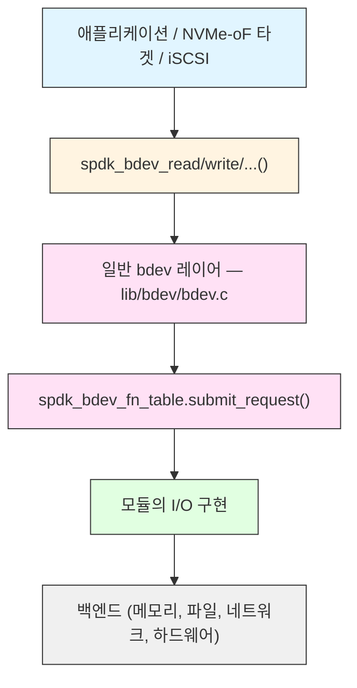

# 모듈 16: 커스텀 Bdev 모듈

**단계**: 2 (구현)
**난이도**: 고급
**예상 소요 시간**: 5시간
**선수 과목**: 모듈 01-15

---

## 학습 목표

- 전체 bdev 모듈 인터페이스(`spdk_bdev_module`, `spdk_bdev_fn_table`) 이해하기
- 모든 필수 및 일반적인 선택적 콜백 구현하기
- 동작하는 I/O 경로 구축: submit_request, io_type_supported, 채널 관리
- `SPDK_BDEV_MODULE_REGISTER`를 사용하여 모듈 등록 및 초기화하기
- 생성/삭제를 위한 JSON-RPC 메서드 노출하기
- 내부 타겟 또는 외부 공유 라이브러리로 모듈 빌드하기
- 처음부터 완전한 패스스루(Passthrough) bdev 구현 살펴보기
- 커스텀 bdev를 효과적으로 테스트하고 디버깅하기

---

## 핵심 개념

### 개념 1: Bdev 모듈 아키텍처

SPDK의 모든 bdev는 모듈에 의해 지원됩니다. bdev 레이어는 일반적인 디스패치 레이어로, 애플리케이션에서 I/O를 수신하고 잘 정의된 콜백 테이블을 통해 적절한 모듈로 라우팅합니다.



bdev 모듈에는 개념적으로 두 종류가 있습니다:

- **물리적 bdev 모듈(Physical bdev modules)**: 실제 스토리지를 노출합니다 (malloc, aio, nvme, uring). 백킹 스토리지를 직접 소유합니다.
- **가상 bdev 모듈(Virtual bdev modules, vbdev)**: 하나 이상의 기존 bdev 위에 위치하여 I/O를 변환합니다 (passthru, crypto, lvol, split, raid). 기본 bdev를 클레임하고 상위 레이어에 새 bdev를 제공합니다.

이 모듈은 두 종류 모두를 다루며, 먼저 물리적 bdev를 빌드한 후 간단한 vbdev 패스스루를 구축하는 데 중점을 둡니다.

---

### 개념 2: 두 가지 콜백 테이블

bdev 모듈은 두 개의 구조체를 채워야 합니다:

| 구조체 | 용도 |
|---|---|
| `struct spdk_bdev_module` | 모듈 수명 주기: init, fini, JSON 설정 |
| `struct spdk_bdev_fn_table` | bdev별 I/O 작업: submit, channel, destruct |

모듈 구조체는 시작 시 한 번 등록됩니다. fn_table은 생성 시 각 bdev 인스턴스에 부착됩니다.

---

## 파트 1: spdk_bdev_module 인터페이스

### 전체 구조체 정의

`include/spdk/bdev_module.h`에서:

```c
struct spdk_bdev_module {
    /* 필수: bdev 레이어가 서브시스템 init 시 호출 */
    int (*module_init)(void);

    /* 선택: 모든 모듈의 init 완료 후 호출 */
    void (*init_complete)(void);

    /* 선택: bdev 서브시스템이 종료를 시작할 때,
     * bdev가 등록 해제되기 전에 호출. 가상 bdev 모듈은
     * 상위에 vbdev가 없으면 여기서 bdev 클레임을 해제해야 함. */
    void (*fini_start)(void);

    /* 선택: 모든 bdev 등록 해제 후 호출.
     * 최종 모듈 정리에 사용. */
    void (*module_fini)(void);

    /* 선택: 재시작 시 이 모듈의 bdev를 재생성하기 위한
     * JSON-RPC 설정 작성. */
    int (*config_json)(struct spdk_json_write_ctx *w);

    /* 필수: 이름 문자열, 모든 모듈에서 고유해야 함 */
    const char *name;

    /* 선택: spdk_bdev_io->driver_ctx[]에 내장되는
     * I/O별 드라이버 컨텍스트의 바이트 크기. NULL이 아니면
     * bdev 레이어가 I/O당 이만큼의 추가 공간을 할당. */
    int (*get_ctx_size)(void);

    /* 선택: vbdev 모듈용. 새 bdev가 등록될 때
     * 동기적으로 호출. 모듈이 여기서 bdev를 클레임할 수 있음. */
    void (*examine_config)(struct spdk_bdev *bdev);

    /* 선택: vbdev 모듈용. examine_config 후 호출,
     * I/O를 발행할 수 있음. spdk_bdev_module_examine_done()을 호출해야 함. */
    void (*examine_disk)(struct spdk_bdev *bdev);

    /* module_init이 비동기적으로 완료되면 true로 설정.
     * 완료 시 spdk_bdev_module_init_done()을 호출해야 함. */
    bool async_init;

    /* module_fini가 비동기적으로 완료되면 true로 설정.
     * 완료 시 spdk_bdev_module_fini_done()을 호출해야 함. */
    bool async_fini;

    /* 내부 필드 - 건드리지 마세요 */
    struct __bdev_module_internal_fields internal;
};
```

### 최소 모듈 정의

```c
#include "spdk/bdev_module.h"

static int my_bdev_module_init(void);
static void my_bdev_module_fini(void);

static struct spdk_bdev_module my_bdev_module = {
    .name        = "my_bdev",
    .module_init = my_bdev_module_init,
    .module_fini = my_bdev_module_fini,
    .get_ctx_size = my_bdev_get_ctx_size,
};

SPDK_BDEV_MODULE_REGISTER(my_bdev, &my_bdev_module)
```

`SPDK_BDEV_MODULE_REGISTER`는 GCC 생성자 속성을 사용하여 `main()` 실행 전에 모듈 포인터를 전역 리스트에 삽입합니다. bdev 서브시스템은 시작 시 이 리스트를 순회하며 각 `module_init`을 호출합니다.

---

## 파트 2: spdk_bdev_fn_table 인터페이스

모든 bdev 인스턴스는 fn_table을 가리킵니다. 테이블은 일반적으로 `static const`로 선언되며 동일 모듈의 모든 인스턴스가 공유합니다.

```c
struct spdk_bdev_fn_table {
    /* 필수: bdev와 그 리소스를 해제.
     * 동기 destruct는 0 반환, 비동기는 1 반환
     * (완료 시 spdk_bdev_destruct_done() 호출). */
    int (*destruct)(void *ctx);

    /* 필수: I/O 요청을 백엔드에 제출. */
    void (*submit_request)(struct spdk_io_channel *ch,
                           struct spdk_bdev_io *bdev_io);

    /* 필수: bdev가 이 I/O 타입을 지원하면 true 반환. */
    bool (*io_type_supported)(void *ctx,
                              enum spdk_bdev_io_type io_type);

    /* 필수: 호출 스레드에서 이 bdev의 spdk_io_channel 반환.
     * 거의 항상:
     *   return spdk_get_io_channel(bdev_ctx_ptr); */
    struct spdk_io_channel *(*get_io_channel)(void *ctx);

    /* 선택: 이 bdev 인스턴스를 설명하는 JSON 작성
     * (bdev_get_bdevs RPC 응답에 사용). */
    int (*dump_info_json)(void *ctx, struct spdk_json_write_ctx *w);

    /* 선택: 이 bdev를 재생성하기 위한 JSON-RPC 호출 작성.
     * save_config에서 사용. 모듈 수준에서 config_json을
     * 대신 사용하면 NULL 가능. */
    void (*write_config_json)(struct spdk_bdev *bdev,
                              struct spdk_json_write_ctx *w);

    /* 선택: 채널당 스핀 시간 (마이크로초). */
    uint64_t (*get_spin_time)(struct spdk_io_channel *ch);
};
```

### 실용적인 fn_table 예제 (null bdev 패턴)

```c
static const struct spdk_bdev_fn_table my_bdev_fn_table = {
    .destruct           = my_bdev_destruct,
    .submit_request     = my_bdev_submit_request,
    .io_type_supported  = my_bdev_io_type_supported,
    .get_io_channel     = my_bdev_get_io_channel,
    .write_config_json  = my_bdev_write_config_json,
    .dump_info_json     = my_bdev_dump_info_json,
};
```

---

## 파트 3: 데이터 구조체

### 3.1 Bdev 인스턴스 구조체

`struct spdk_bdev`를 첫 번째 필드로 내장합니다. 이를 통해 외부 구조체와 `spdk_bdev *` 간의 캐스팅이 가능합니다.

```c
struct my_bdev {
    struct spdk_bdev    bdev;       /* 반드시 첫 번째 */
    void               *buf;        /* 백킹 메모리 */
    uint64_t            buf_size;
    TAILQ_ENTRY(my_bdev) link;      /* 모듈의 전역 리스트 */
};

static TAILQ_HEAD(, my_bdev) g_my_bdevs =
    TAILQ_HEAD_INITIALIZER(g_my_bdevs);
```

`spdk_bdev_register()`를 호출하기 전에 설정해야 하는 `struct spdk_bdev`의 주요 필드:

| 필드 | 타입 | 설명 |
|---|---|---|
| `name` | `char *` | 고유 bdev 이름 (힙 할당) |
| `product_name` | `const char *` | 표시 이름 (정적 문자열 가능) |
| `blocklen` | `uint32_t` | 논리 블록 크기 (바이트) |
| `phys_blocklen` | `uint32_t` | 물리 블록 크기 (선택, 기본값 blocklen) |
| `blockcnt` | `uint64_t` | 논리 블록 수 |
| `module` | `struct spdk_bdev_module *` | 모듈 포인터 |
| `fn_table` | `const struct spdk_bdev_fn_table *` | fn_table 포인터 |
| `ctxt` | `void *` | 비공개 컨텍스트 (일반적으로 `my_bdev` 포인터) |
| `write_cache` | `int` | 쓰기 캐시 활성화 시 1 |
| `required_alignment` | `uint32_t` | DMA 정렬 요구사항 |

### 3.2 I/O별 컨텍스트 구조체

bdev 레이어는 `spdk_bdev_io` 구조체를 할당합니다. `bdev_io->driver_ctx`에는 `get_ctx_size()` 바이트 크기의 영역이 내장되며, 각 I/O 전에 제로로 초기화됩니다. I/O별 모듈 상태에 이를 사용합니다.

```c
struct my_bdev_io {
    /* 미완료 비동기 작업 추적 */
    int         num_outstanding;
    enum spdk_bdev_io_status status;
    /* 백엔드가 -ENOMEM을 반환할 경우 I/O 대기 큐 */
    struct spdk_bdev_io_wait_entry bdev_io_wait;
};

static int
my_bdev_get_ctx_size(void)
{
    return sizeof(struct my_bdev_io);
}
```

submit_request에서 접근:

```c
struct my_bdev_io *my_io =
    (struct my_bdev_io *)bdev_io->driver_ctx;
```

### 3.3 스레드별 채널 구조체

채널(Channel)은 스레드별 상태를 제공합니다. bdev 레이어는 요청 시 (bdev, 스레드) 쌍당 하나의 채널을 생성하고, 스레드의 마지막 참조가 닫힐 때 파괴합니다.

```c
struct my_bdev_channel {
    struct spdk_poller              *poller;
    TAILQ_HEAD(, my_bdev_io)        pending_ios;
    /* 선택적으로, 하위 레이어 채널 */
    struct spdk_io_channel          *base_ch;
};
```

---

## 파트 4: 모듈 수명 주기

### 4.1 module_init

SPDK 시작 시 메인 스레드에서 한 번 호출됩니다. 나중에 채널을 얻을 수 있도록 여기서 I/O 디바이스를 등록합니다.

```c
static int
my_bdev_module_init(void)
{
    /*
     * I/O 디바이스를 등록합니다. 첫 번째 인자로 전달되는 주소는
     * 고유해야 합니다 - 일반적으로 모듈 전역 변수의 주소.
     * 스레드가 채널을 열거나 닫을 때 bdev 레이어가
     * create_cb / destroy_cb를 호출합니다.
     */
    spdk_io_device_register(
        &g_my_bdevs,            /* 고유 io_device id */
        my_bdev_channel_create, /* create_cb */
        my_bdev_channel_destroy,/* destroy_cb */
        sizeof(struct my_bdev_channel),
        "my_bdev_module");

    SPDK_NOTICELOG("my_bdev module initialized\n");
    return 0;
}
```

비동기 init의 경우 (예: 하드웨어를 탐색해야 하는 경우):

```c
static struct spdk_bdev_module my_bdev_module = {
    /* ... */
    .async_init  = true,
};

static int
my_bdev_module_init(void)
{
    /* 비동기 작업 시작, 그런 다음 호출: */
    /* spdk_bdev_module_init_done(&my_bdev_module); */
    return 0;
}
```

### 4.2 module_fini

이 모듈의 모든 bdev가 등록 해제된 후 호출됩니다. 여기서 I/O 디바이스를 등록 해제합니다.

```c
static void
my_bdev_channel_unregister_done(void *io_device)
{
    SPDK_NOTICELOG("my_bdev module finished\n");
    spdk_bdev_module_fini_done(); /* async_fini = true인 경우 필수 */
}

static void
my_bdev_module_fini(void)
{
    spdk_io_device_unregister(&g_my_bdevs,
                              my_bdev_channel_unregister_done);
    /* async_fini = false이면 추가 호출 불필요.
     * async_fini = true이면 위의 콜백에서
     * spdk_bdev_module_fini_done()을 호출해야 함. */
}
```

### 4.3 Bdev Destruct

bdev가 등록 해제될 때 (예: `spdk_bdev_unregister()`에서) 호출됩니다. 여기서 리소스를 해제합니다.

```c
static int
my_bdev_destruct(void *ctx)
{
    struct my_bdev *mybdev = ctx;

    TAILQ_REMOVE(&g_my_bdevs, mybdev, link);

    spdk_free(mybdev->buf);      /* DMA 메모리 */
    free(mybdev->bdev.name);
    free(mybdev);

    return 0;  /* 0 = 동기 */
}
```

---

## 파트 5: I/O 채널 관리

### 5.1 채널 생성 콜백

이 bdev에 대한 채널을 처음 요청하는 스레드에서 호출됩니다. 스레드별 리소스를 초기화합니다.

```c
static int
my_bdev_channel_create(void *io_device, void *ctx_buf)
{
    struct my_bdev_channel *ch = ctx_buf;

    TAILQ_INIT(&ch->pending_ios);

    /* 대기 큐를 비우기 위한 제로 딜레이 폴러 등록 */
    ch->poller = SPDK_POLLER_REGISTER(my_bdev_poll, ch, 0);
    if (!ch->poller) {
        return -ENOMEM;
    }

    return 0;
}
```

### 5.2 채널 파괴 콜백

스레드에서 채널의 마지막 참조가 해제될 때 호출됩니다.

```c
static void
my_bdev_channel_destroy(void *io_device, void *ctx_buf)
{
    struct my_bdev_channel *ch = ctx_buf;

    spdk_poller_unregister(&ch->poller);
    /* 남은 I/O는 완료되었거나 중단되어야 함 */
    assert(TAILQ_EMPTY(&ch->pending_ios));
}
```

### 5.3 get_io_channel

bdev 레이어가 호출 스레드의 채널을 얻기 위해 호출합니다. 모듈 수준 채널(모듈 내 모든 bdev가 공유)의 경우:

```c
static struct spdk_io_channel *
my_bdev_get_io_channel(void *ctx)
{
    /* g_my_bdevs에 키된 채널 반환 (모듈 전체) */
    return spdk_get_io_channel(&g_my_bdevs);
}
```

bdev 인스턴스별 채널(더 일반적)의 경우:

```c
static struct spdk_io_channel *
my_bdev_get_io_channel(void *ctx)
{
    struct my_bdev *mybdev = ctx;
    /* 각 bdev 인스턴스가 자체 채널 세트를 가짐 */
    return spdk_get_io_channel(mybdev);
}

/* 그리고 create_bdev()에서 인스턴스별로 등록: */
spdk_io_device_register(mybdev, create_cb, destroy_cb,
                        sizeof(struct my_bdev_channel),
                        mybdev->bdev.name);
```

---

## 파트 6: I/O 경로 구현

### 6.1 io_type_supported

이 콜백은 bdev가 주어진 I/O 타입을 처리하는지 확인하기 위해 submit_request 전에 호출됩니다. 보수적이어야 합니다: submit_request에서 처리하는 타입에 대해서만 true를 반환하세요.

```c
static bool
my_bdev_io_type_supported(void *ctx, enum spdk_bdev_io_type io_type)
{
    switch (io_type) {
    case SPDK_BDEV_IO_TYPE_READ:
    case SPDK_BDEV_IO_TYPE_WRITE:
    case SPDK_BDEV_IO_TYPE_RESET:
    case SPDK_BDEV_IO_TYPE_WRITE_ZEROES:
    case SPDK_BDEV_IO_TYPE_ABORT:
        return true;
    case SPDK_BDEV_IO_TYPE_FLUSH:
    case SPDK_BDEV_IO_TYPE_UNMAP:
    default:
        return false;
    }
}
```

일반적인 I/O 타입:

| 타입 | 설명 |
|---|---|
| `SPDK_BDEV_IO_TYPE_READ` | 블록에서 데이터 읽기 |
| `SPDK_BDEV_IO_TYPE_WRITE` | 블록에 데이터 쓰기 |
| `SPDK_BDEV_IO_TYPE_FLUSH` | 쓰기 캐시를 미디어로 플러시 |
| `SPDK_BDEV_IO_TYPE_UNMAP` | 블록 할당 해제 (TRIM) |
| `SPDK_BDEV_IO_TYPE_RESET` | 장치 리셋 |
| `SPDK_BDEV_IO_TYPE_WRITE_ZEROES` | 데이터 전송 없이 블록 제로화 |
| `SPDK_BDEV_IO_TYPE_ABORT` | 진행 중인 특정 I/O 중단 |
| `SPDK_BDEV_IO_TYPE_COMPARE` | 블록과 데이터 비교 |
| `SPDK_BDEV_IO_TYPE_ZCOPY` | 제로카피(Zero-copy) 작업 |

### 6.2 submit_request: 동기 패턴

메모리 기반 bdev(malloc과 같은)의 경우, 가장 간단한 패턴은 I/O를 인라인으로 완료하되 완료 콜백에서 더 많은 I/O를 호출하는 스택 오버플로우를 방지하기 위해 완료를 폴러로 지연시킵니다.

```c
static void
my_bdev_submit_request(struct spdk_io_channel *_ch,
                       struct spdk_bdev_io *bdev_io)
{
    struct my_bdev         *mybdev = bdev_io->bdev->ctxt;
    struct my_bdev_channel *ch = spdk_io_channel_get_ctx(_ch);
    struct my_bdev_io      *my_io =
        (struct my_bdev_io *)bdev_io->driver_ctx;
    void    *buf  = mybdev->buf;
    uint64_t offset = bdev_io->u.bdev.offset_blocks
                      * mybdev->bdev.blocklen;
    uint64_t len    = bdev_io->u.bdev.num_blocks
                      * mybdev->bdev.blocklen;

    switch (bdev_io->type) {

    case SPDK_BDEV_IO_TYPE_READ:
        spdk_copy_buf_to_iovs(bdev_io->u.bdev.iovs,
                              bdev_io->u.bdev.iovcnt,
                              buf + offset, len);
        /* 지연된 완료를 위해 큐에 삽입 */
        TAILQ_INSERT_TAIL(&ch->pending_ios, my_io, link);
        my_io->status = SPDK_BDEV_IO_STATUS_SUCCESS;
        break;

    case SPDK_BDEV_IO_TYPE_WRITE:
        spdk_copy_iovs_to_buf(buf + offset, len,
                              bdev_io->u.bdev.iovs,
                              bdev_io->u.bdev.iovcnt);
        TAILQ_INSERT_TAIL(&ch->pending_ios, my_io, link);
        my_io->status = SPDK_BDEV_IO_STATUS_SUCCESS;
        break;

    case SPDK_BDEV_IO_TYPE_WRITE_ZEROES:
        memset(buf + offset, 0, len);
        TAILQ_INSERT_TAIL(&ch->pending_ios, my_io, link);
        my_io->status = SPDK_BDEV_IO_STATUS_SUCCESS;
        break;

    case SPDK_BDEV_IO_TYPE_RESET:
        /* 메모리 bdev에서는 no-op: 모든 I/O가 이미 완료됨 */
        spdk_bdev_io_complete(bdev_io, SPDK_BDEV_IO_STATUS_SUCCESS);
        return;

    case SPDK_BDEV_IO_TYPE_ABORT:
        /* 대기 중인 I/O 중단 시도 */
        if (my_bdev_abort_io(ch, bdev_io->u.abort.bio_to_abort)) {
            spdk_bdev_io_complete(bdev_io,
                                  SPDK_BDEV_IO_STATUS_SUCCESS);
        } else {
            spdk_bdev_io_complete(bdev_io,
                                  SPDK_BDEV_IO_STATUS_FAILED);
        }
        return;

    default:
        spdk_bdev_io_complete(bdev_io, SPDK_BDEV_IO_STATUS_FAILED);
        return;
    }
}
```

### 6.3 폴러: 완료된 I/O 배출

null 및 malloc bdev 모두 큐에 쌓인 I/O를 일괄 완료하기 위해 제로 딜레이 폴러를 사용합니다. 이는 완료 콜백이 동일한 호출 스택에서 재귀적으로 더 많은 I/O를 발행하는 것을 방지합니다.

```c
static int
my_bdev_poll(void *arg)
{
    struct my_bdev_channel              *ch = arg;
    TAILQ_HEAD(, my_bdev_io)             done;
    struct my_bdev_io                   *my_io;
    struct spdk_bdev_io                 *bdev_io;

    TAILQ_INIT(&done);
    /* 대기 리스트를 원자적으로 교체 */
    TAILQ_SWAP(&ch->pending_ios, &done, my_bdev_io, link);

    if (TAILQ_EMPTY(&done)) {
        return SPDK_POLLER_IDLE;
    }

    while (!TAILQ_EMPTY(&done)) {
        my_io = TAILQ_FIRST(&done);
        TAILQ_REMOVE(&done, my_io, link);
        bdev_io = spdk_bdev_io_from_ctx(my_io);
        spdk_bdev_io_complete(bdev_io, my_io->status);
    }

    return SPDK_POLLER_BUSY;
}
```

핵심 API: `spdk_bdev_io_from_ctx(driver_ctx_ptr)`는 내장된 driver_ctx 포인터를 포함하는 `spdk_bdev_io`로 변환합니다.

### 6.4 I/O 중단 지원

```c
static bool
my_bdev_abort_io(struct my_bdev_channel *ch,
                 struct spdk_bdev_io *bio_to_abort)
{
    struct my_bdev_io *my_io;
    struct spdk_bdev_io *bdev_io;

    TAILQ_FOREACH(my_io, &ch->pending_ios, link) {
        bdev_io = spdk_bdev_io_from_ctx(my_io);
        if (bdev_io == bio_to_abort) {
            TAILQ_REMOVE(&ch->pending_ios, my_io, link);
            spdk_bdev_io_complete(bio_to_abort,
                                  SPDK_BDEV_IO_STATUS_ABORTED);
            return true;
        }
    }
    return false;
}
```

### 6.5 백엔드에서 -ENOMEM 처리

백엔드(예: 하위 레이어 bdev)가 `-ENOMEM`을 반환하면, I/O를 FAILED로 완료하지 마세요. 대신 큐에 넣고 `spdk_bdev_io_wait_entry`를 사용하여 재시도합니다:

```c
static void
my_bdev_resubmit_io(void *arg)
{
    struct spdk_bdev_io *bdev_io = arg;
    my_bdev_submit_request(
        spdk_bdev_io_get_io_channel(bdev_io), bdev_io);
}

/* submit_request에서 하위 레이어가 -ENOMEM을 반환한 경우: */
struct my_bdev_io *my_io =
    (struct my_bdev_io *)bdev_io->driver_ctx;
my_io->bdev_io_wait.bdev   = base_bdev;
my_io->bdev_io_wait.cb_fn  = my_bdev_resubmit_io;
my_io->bdev_io_wait.cb_arg = bdev_io;
spdk_bdev_queue_io_wait(base_bdev, base_ch,
                        &my_io->bdev_io_wait);
```

---

## 파트 7: Bdev 등록 및 생성

### 7.1 물리적 Bdev 생성

```c
int
create_my_bdev(const char *name, uint64_t size_mb)
{
    struct my_bdev *mybdev;
    uint64_t        buf_size;
    int             rc;

    if (name == NULL || size_mb == 0) {
        return -EINVAL;
    }

    mybdev = calloc(1, sizeof(*mybdev));
    if (!mybdev) {
        return -ENOMEM;
    }

    buf_size = size_mb * 1024 * 1024;

    /* 백킹 스토어를 위한 DMA 가능 메모리 할당 */
    mybdev->buf = spdk_zmalloc(buf_size, 512, NULL,
                               SPDK_ENV_NUMA_ID_ANY,
                               SPDK_MALLOC_DMA);
    if (!mybdev->buf) {
        free(mybdev);
        return -ENOMEM;
    }
    mybdev->buf_size = buf_size;

    /* spdk_bdev 필드 채우기 */
    mybdev->bdev.name = strdup(name);
    if (!mybdev->bdev.name) {
        spdk_free(mybdev->buf);
        free(mybdev);
        return -ENOMEM;
    }

    mybdev->bdev.product_name      = "My Custom Bdev";
    mybdev->bdev.blocklen          = 512;
    mybdev->bdev.blockcnt          = buf_size / 512;
    mybdev->bdev.module            = &my_bdev_module;
    mybdev->bdev.fn_table          = &my_bdev_fn_table;
    mybdev->bdev.ctxt              = mybdev;
    mybdev->bdev.write_cache       = 0;
    mybdev->bdev.required_alignment = 512;

    /* I/O 디바이스 등록 (인스턴스별 채널) */
    spdk_io_device_register(mybdev,
                            my_bdev_channel_create,
                            my_bdev_channel_destroy,
                            sizeof(struct my_bdev_channel),
                            name);

    /* bdev 레이어에 bdev 등록 */
    rc = spdk_bdev_register(&mybdev->bdev);
    if (rc != 0) {
        SPDK_ERRLOG("Failed to register bdev %s: %d\n", name, rc);
        spdk_io_device_unregister(mybdev, NULL);
        spdk_free(mybdev->buf);
        free(mybdev->bdev.name);
        free(mybdev);
        return rc;
    }

    TAILQ_INSERT_TAIL(&g_my_bdevs, mybdev, link);
    SPDK_NOTICELOG("Created my_bdev: %s (%" PRIu64 " MB)\n",
                   name, size_mb);
    return 0;
}
```

### 7.2 Bdev 삭제

```c
void
delete_my_bdev(const char *name,
               spdk_delete_null_complete cb_fn,
               void *cb_arg)
{
    int rc;

    rc = spdk_bdev_unregister_by_name(name, &my_bdev_module,
                                      cb_fn, cb_arg);
    if (rc != 0) {
        cb_fn(cb_arg, rc);
    }
    /* bdev 레이어가 비동기적으로 destruct()를 호출함 */
}
```

`spdk_bdev_unregister_by_name`은 이름으로 bdev를 조회하고, 이 모듈에 속하는지 확인하고, 진행 중인 모든 I/O를 배출한 다음 `destruct()`를 호출합니다.

---

## 파트 8: JSON-RPC 통합

### 8.1 설정 JSON 작성 (bdev별)

이 함수는 bdev의 구성을 직렬화하기 위해 `bdev_get_bdevs`와 `save_config`에서 호출됩니다:

```c
static void
my_bdev_write_config_json(struct spdk_bdev *bdev,
                          struct spdk_json_write_ctx *w)
{
    struct my_bdev *mybdev = bdev->ctxt;

    spdk_json_write_object_begin(w);
    spdk_json_write_named_string(w, "method", "my_bdev_create");
    spdk_json_write_named_object_begin(w, "params");
    spdk_json_write_named_string(w, "name", bdev->name);
    spdk_json_write_named_uint64(w, "size_mb",
        mybdev->buf_size / (1024 * 1024));
    spdk_json_write_object_end(w);  /* params */
    spdk_json_write_object_end(w);  /* top-level */
}
```

### 8.2 dump_info_json (선택, 진단용)

```c
static int
my_bdev_dump_info_json(void *ctx, struct spdk_json_write_ctx *w)
{
    struct my_bdev *mybdev = ctx;

    spdk_json_write_named_object_begin(w, "my_bdev");
    spdk_json_write_named_uint64(w, "buf_size", mybdev->buf_size);
    spdk_json_write_object_end(w);

    return 0;
}
```

### 8.3 JSON-RPC 메서드 등록

RPC 핸들러는 `SPDK_RPC_REGISTER`로 등록합니다. 별도의 `rpc_my_bdev.c` 파일에 배치합니다:

```c
#include "spdk/rpc.h"
#include "spdk/util.h"
#include "spdk/string.h"
#include "my_bdev.h"

/* ---- bdev_my_create ---- */

struct rpc_my_bdev_create {
    char    *name;
    uint64_t size_mb;
};

static const struct spdk_json_object_decoder rpc_my_bdev_create_decoders[] = {
    {"name",    offsetof(struct rpc_my_bdev_create, name),
     spdk_json_decode_string},
    {"size_mb", offsetof(struct rpc_my_bdev_create, size_mb),
     spdk_json_decode_uint64},
};

static void
rpc_bdev_my_create(struct spdk_jsonrpc_request *request,
                   const struct spdk_json_val *params)
{
    struct rpc_my_bdev_create req = {};
    struct spdk_json_write_ctx *w;
    int rc;

    if (spdk_json_decode_object(params,
                                rpc_my_bdev_create_decoders,
                                SPDK_COUNTOF(rpc_my_bdev_create_decoders),
                                &req)) {
        SPDK_ERRLOG("spdk_json_decode_object failed\n");
        spdk_jsonrpc_send_error_response(request,
            SPDK_JSONRPC_ERROR_INTERNAL_ERROR,
            "JSON decode failed");
        goto cleanup;
    }

    rc = create_my_bdev(req.name, req.size_mb);
    if (rc != 0) {
        spdk_jsonrpc_send_error_response(request,
            rc, spdk_strerror(-rc));
        goto cleanup;
    }

    w = spdk_jsonrpc_begin_result(request);
    spdk_json_write_string(w, req.name);
    spdk_jsonrpc_end_result(request, w);

cleanup:
    free(req.name);
}

SPDK_RPC_REGISTER("bdev_my_create", rpc_bdev_my_create,
                  SPDK_RPC_RUNTIME)

/* ---- bdev_my_delete ---- */

struct rpc_my_bdev_delete {
    char *name;
};

static const struct spdk_json_object_decoder rpc_my_bdev_delete_decoders[] = {
    {"name", offsetof(struct rpc_my_bdev_delete, name),
     spdk_json_decode_string},
};

static void
rpc_bdev_my_delete_done(void *cb_arg, int rc)
{
    struct spdk_jsonrpc_request *request = cb_arg;

    if (rc != 0) {
        spdk_jsonrpc_send_error_response(request,
            rc, spdk_strerror(-rc));
        return;
    }

    spdk_jsonrpc_send_bool_response(request, true);
}

static void
rpc_bdev_my_delete(struct spdk_jsonrpc_request *request,
                   const struct spdk_json_val *params)
{
    struct rpc_my_bdev_delete req = {};

    if (spdk_json_decode_object(params,
                                rpc_my_bdev_delete_decoders,
                                SPDK_COUNTOF(rpc_my_bdev_delete_decoders),
                                &req)) {
        spdk_jsonrpc_send_error_response(request,
            SPDK_JSONRPC_ERROR_INTERNAL_ERROR,
            "JSON decode failed");
        goto cleanup;
    }

    delete_my_bdev(req.name, rpc_bdev_my_delete_done, request);

cleanup:
    free(req.name);
}

SPDK_RPC_REGISTER("bdev_my_delete", rpc_bdev_my_delete,
                  SPDK_RPC_RUNTIME)
```

---

## 파트 9: 모듈 빌드

### 9.1 내부 모듈 (SPDK 앱에 컴파일)

애플리케이션의 모듈 리스트에 모듈을 추가합니다. 앱의 `Makefile`에서:

```makefile
SPDK_LIB_LIST += bdev_my_bdev

# lib/bdev/Makefile 또는 모듈 디렉토리에서:
LIBNAME = bdev_my_bdev
C_SRCS  = bdev_my_bdev.c rpc_my_bdev.c
```

또는 최상위 빌드 시스템을 사용하는 경우 `module/bdev/CMakeLists.txt` (CMake 사용 시) 또는 `mk/spdk.modules.mk`에 항목을 추가합니다.

hello_world 스타일 앱의 경우, 라이브러리에 대해 링크합니다:

```makefile
# app/my_app/Makefile
APP = my_app
C_SRCS = my_app.c
SPDK_LIB_LIST = bdev_my_bdev bdev malloc log ...
include $(SPDK_ROOT_DIR)/mk/spdk.app.mk
```

### 9.2 외부 / 소스 트리 외부 모듈

SPDK는 SPDK 소스 트리 외부에서 컴파일된 외부 모듈을 지원합니다. 핵심은 `SPDK_BDEV_MODULE_REGISTER`가 로드 시 자체 등록하기 위해 링커 섹션(`__attribute__((constructor))` 동등물)을 사용한다는 것입니다.

**디렉토리 구조:**

```
my_bdev_module/
  bdev_my_bdev.c
  bdev_my_bdev.h
  rpc_my_bdev.c
  Makefile
```

**외부 모듈 Makefile:**

```makefile
SPDK_ROOT_DIR := /path/to/spdk

include $(SPDK_ROOT_DIR)/mk/spdk.common.mk

LIBNAME = bdev_my_bdev
C_SRCS  = bdev_my_bdev.c rpc_my_bdev.c

CFLAGS += -I$(SPDK_ROOT_DIR)/include

include $(SPDK_ROOT_DIR)/mk/spdk.lib.mk
```

**런타임 로딩:**

```json
{
  "subsystems": [
    {
      "subsystem": "bdev",
      "config": [
        {
          "method": "framework_set_bdev_opts",
          "params": {}
        }
      ]
    }
  ]
}
```

`spdk_app_opts.json_config_file` 또는 `--json` 플래그를 사용합니다. 외부 공유 라이브러리는 `--bdev-module` 플래그 또는 `LD_PRELOAD`로 로드됩니다.

---

## 파트 10: 완전한 워크스루 - 간단한 패스스루 Bdev

패스스루(vbdev)는 기존 bdev 위에 위치하여 모든 I/O를 투명하게 전달합니다. 이것은 가능한 가장 간단한 vbdev이며 crypto, compression, 지연 주입 등의 기초입니다.

참조: `module/bdev/passthru/vbdev_passthru.c`

### 10.1 전체 헤더 (`my_passthru.h`)

```c
#pragma once

#include "spdk/bdev.h"

typedef void (*spdk_delete_my_passthru_complete)(void *cb_arg, int rc);

int  create_my_passthru(const char *pt_name,
                         const char *base_bdev_name);
void delete_my_passthru(const char *pt_name,
                         spdk_delete_my_passthru_complete cb_fn,
                         void *cb_arg);
```

### 10.2 데이터 구조체

```c
struct my_pt_bdev {
    struct spdk_bdev        *base_bdev;  /* 래핑하는 bdev */
    struct spdk_bdev_desc   *base_desc;  /* 열린 디스크립터 */
    struct spdk_bdev         pt_bdev;    /* 노출하는 가상 bdev */
    struct spdk_thread      *opener_thread; /* base를 연 스레드 */
    TAILQ_ENTRY(my_pt_bdev)  link;
};

struct my_pt_channel {
    struct spdk_io_channel *base_ch;    /* 기본 bdev에 대한 채널 */
};

struct my_pt_io {
    struct spdk_io_channel      *ch;
    struct spdk_bdev_io_wait_entry bdev_io_wait;
};
```

### 10.3 모듈 등록

```c
static int my_pt_init(void);
static void my_pt_fini(void);
static void my_pt_examine(struct spdk_bdev *bdev);
static int my_pt_get_ctx_size(void);

static struct spdk_bdev_module my_pt_module = {
    .name           = "my_passthru",
    .module_init    = my_pt_init,
    .module_fini    = my_pt_fini,
    .examine_config = my_pt_examine,
    .get_ctx_size   = my_pt_get_ctx_size,
};

SPDK_BDEV_MODULE_REGISTER(my_passthru, &my_pt_module)
```

### 10.4 I/O 제출: 기본 Bdev로 전달

```c
static void
_my_pt_complete_io(struct spdk_bdev_io *base_io,
                   bool success, void *cb_arg)
{
    struct spdk_bdev_io *orig_io = cb_arg;
    int status = success ? SPDK_BDEV_IO_STATUS_SUCCESS
                         : SPDK_BDEV_IO_STATUS_FAILED;

    spdk_bdev_io_complete(orig_io, status);
    spdk_bdev_free_io(base_io);
}

static void
my_pt_submit_request(struct spdk_io_channel *_ch,
                     struct spdk_bdev_io *bdev_io)
{
    struct my_pt_bdev    *pt  = bdev_io->bdev->ctxt;
    struct my_pt_channel *ch  = spdk_io_channel_get_ctx(_ch);
    int rc = 0;

    switch (bdev_io->type) {
    case SPDK_BDEV_IO_TYPE_READ:
        rc = spdk_bdev_readv_blocks(
            pt->base_desc, ch->base_ch,
            bdev_io->u.bdev.iovs, bdev_io->u.bdev.iovcnt,
            bdev_io->u.bdev.offset_blocks,
            bdev_io->u.bdev.num_blocks,
            _my_pt_complete_io, bdev_io);
        break;
    case SPDK_BDEV_IO_TYPE_WRITE:
        rc = spdk_bdev_writev_blocks(
            pt->base_desc, ch->base_ch,
            bdev_io->u.bdev.iovs, bdev_io->u.bdev.iovcnt,
            bdev_io->u.bdev.offset_blocks,
            bdev_io->u.bdev.num_blocks,
            _my_pt_complete_io, bdev_io);
        break;
    case SPDK_BDEV_IO_TYPE_FLUSH:
        rc = spdk_bdev_flush_blocks(
            pt->base_desc, ch->base_ch,
            bdev_io->u.bdev.offset_blocks,
            bdev_io->u.bdev.num_blocks,
            _my_pt_complete_io, bdev_io);
        break;
    case SPDK_BDEV_IO_TYPE_RESET:
        rc = spdk_bdev_reset(pt->base_desc, ch->base_ch,
                             _my_pt_complete_io, bdev_io);
        break;
    case SPDK_BDEV_IO_TYPE_UNMAP:
        rc = spdk_bdev_unmap_blocks(
            pt->base_desc, ch->base_ch,
            bdev_io->u.bdev.offset_blocks,
            bdev_io->u.bdev.num_blocks,
            _my_pt_complete_io, bdev_io);
        break;
    default:
        spdk_bdev_io_complete(bdev_io, SPDK_BDEV_IO_STATUS_FAILED);
        return;
    }

    if (rc == -ENOMEM) {
        struct my_pt_io *pt_io =
            (struct my_pt_io *)bdev_io->driver_ctx;
        pt_io->ch = _ch;
        pt_io->bdev_io_wait.bdev   = pt->base_bdev;
        pt_io->bdev_io_wait.cb_fn  = my_pt_resubmit;
        pt_io->bdev_io_wait.cb_arg = bdev_io;
        spdk_bdev_queue_io_wait(pt->base_bdev,
                                ch->base_ch,
                                &pt_io->bdev_io_wait);
    } else if (rc != 0) {
        spdk_bdev_io_complete(bdev_io, SPDK_BDEV_IO_STATUS_FAILED);
    }
}
```

### 10.5 Vbdev 채널: 기본 채널 래핑

```c
static int
my_pt_channel_create(void *io_device, void *ctx_buf)
{
    struct my_pt_bdev    *pt = io_device;
    struct my_pt_channel *ch = ctx_buf;

    ch->base_ch = spdk_bdev_get_io_channel(pt->base_desc);
    if (!ch->base_ch) {
        return -ENOMEM;
    }
    return 0;
}

static void
my_pt_channel_destroy(void *io_device, void *ctx_buf)
{
    struct my_pt_channel *ch = ctx_buf;
    spdk_put_io_channel(ch->base_ch);
}
```

### 10.6 Vbdev 생성

```c
static void
my_pt_bdev_event_cb(enum spdk_bdev_event_type type,
                    struct spdk_bdev *bdev, void *ctx)
{
    /* REMOVE 이벤트 처리: pt bdev 등록 해제 */
    if (type == SPDK_BDEV_EVENT_REMOVE) {
        struct my_pt_bdev *pt = ctx;
        spdk_bdev_unregister(&pt->pt_bdev, NULL, NULL);
    }
}

int
create_my_passthru(const char *pt_name,
                   const char *base_bdev_name)
{
    struct my_pt_bdev *pt;
    struct spdk_bdev  *base;
    int rc;

    pt = calloc(1, sizeof(*pt));
    if (!pt) {
        return -ENOMEM;
    }

    /* 기본 bdev 열기 */
    rc = spdk_bdev_open_ext(base_bdev_name, true,
                             my_pt_bdev_event_cb, pt,
                             &pt->base_desc);
    if (rc != 0) {
        SPDK_ERRLOG("Cannot open base bdev %s: %d\n",
                    base_bdev_name, rc);
        free(pt);
        return rc;
    }

    base = spdk_bdev_desc_get_bdev(pt->base_desc);
    pt->base_bdev    = base;
    pt->opener_thread = spdk_get_thread();

    /* 독점 쓰기 접근 클레임 */
    rc = spdk_bdev_module_claim_bdev(base, pt->base_desc,
                                     &my_pt_module);
    if (rc != 0) {
        SPDK_ERRLOG("Cannot claim bdev %s: %d\n",
                    base_bdev_name, rc);
        spdk_bdev_close(pt->base_desc);
        free(pt);
        return rc;
    }

    /* 기본 bdev에서 지오메트리 상속 */
    pt->pt_bdev.name         = strdup(pt_name);
    pt->pt_bdev.product_name = "Passthru";
    pt->pt_bdev.blocklen     = base->blocklen;
    pt->pt_bdev.blockcnt     = base->blockcnt;
    pt->pt_bdev.module       = &my_pt_module;
    pt->pt_bdev.fn_table     = &my_pt_fn_table;
    pt->pt_bdev.ctxt         = pt;
    pt->pt_bdev.write_cache  = base->write_cache;

    spdk_io_device_register(pt, my_pt_channel_create,
                            my_pt_channel_destroy,
                            sizeof(struct my_pt_channel),
                            pt_name);

    rc = spdk_bdev_register(&pt->pt_bdev);
    if (rc != 0) {
        spdk_io_device_unregister(pt, NULL);
        spdk_bdev_module_release_bdev(base);
        spdk_bdev_close(pt->base_desc);
        free(pt->pt_bdev.name);
        free(pt);
        return rc;
    }

    TAILQ_INSERT_TAIL(&g_pt_bdevs, pt, link);
    return 0;
}
```

---

## 파트 11: 모듈 테스트

### 11.1 bdev_ut 프레임워크를 사용한 단위 테스트

SPDK는 실제 하드웨어 없이 가짜 리액터와 bdev 레이어를 설정하는 `test/bdev/bdev_ut.c`를 제공합니다. `test/bdev/my_bdev_ut.c`를 생성합니다:

```c
#include "spdk/bdev.h"
#include "spdk_internal/mock.h"
#include "bdev/bdev.c"   /* 단위 테스트를 위해 내부 포함 */
#include "my_bdev.h"

static void
test_create_delete(void)
{
    int rc;

    rc = create_my_bdev("test0", 4 /* MB */);
    CU_ASSERT(rc == 0);

    /* bdev가 존재하는지 확인 */
    struct spdk_bdev *bdev = spdk_bdev_get_by_name("test0");
    CU_ASSERT_PTR_NOT_NULL(bdev);
    CU_ASSERT_EQUAL(bdev->blocklen, 512);
    CU_ASSERT_EQUAL(bdev->blockcnt, 4 * 1024 * 1024 / 512);

    delete_my_bdev("test0", NULL, NULL);
    CU_ASSERT_PTR_NULL(spdk_bdev_get_by_name("test0"));
}
```

### 11.2 spdk_tgt를 사용한 통합 테스트

SPDK 타겟을 실행하고 RPC를 실행합니다:

```bash
# 타겟 시작
build/bin/spdk_tgt --config my_config.json &

# bdev 생성
scripts/rpc.py bdev_my_create --name MyBdev0 --size_mb 64

# 확인
scripts/rpc.py bdev_get_bdevs --name MyBdev0

# fio 성능 테스트 실행
scripts/rpc.py bdev_get_bdevs

# bdevperf 사용
build/bin/bdevperf -c my_config.json -q 128 -o 4096 -t 10 -w randread
```

### 11.3 성능 검증을 위한 bdevperf

```bash
build/bin/bdevperf \
    --json <(scripts/rpc.py save_config) \
    -q 128 \         # 큐 깊이
    -o 131072 \      # I/O 크기 (128KB)
    -t 30 \          # 지속 시간 (초)
    -w randrw \      # 워크로드 타입
    -M 70            # 70% 읽기 비율
```

---

## 파트 12: 일반적인 함정 및 디버깅

### 함정 1: 잘못된 스레드에서 I/O 완료

`spdk_bdev_io_complete()`는 I/O를 제출한 것과 동일한 스레드(io_channel과 연결된 스레드)에서 호출해야 합니다. 백엔드가 비동기이고 다른 스레드에서 콜백하면, `spdk_thread_send_msg()`를 사용하여 되돌아가세요.

```c
/* 잘못됨: 임의의 콜백 스레드에서 complete 호출 */
/* 올바름: */
spdk_thread_send_msg(bdev_io_thread, complete_io, bdev_io);
```

### 함정 2: spdk_bdev_module_examine_done 누락

`examine_config`을 구현하면, vbdev를 생성하지 않기로 결정하더라도 반환하기 전에 반드시 `spdk_bdev_module_examine_done(&my_module)`을 호출해야 합니다. 이를 하지 않으면 SPDK 시작이 영구적으로 멈춥니다.

```c
static void
my_pt_examine(struct spdk_bdev *bdev)
{
    /* 이 bdev를 래핑해야 하는지 확인 */
    if (should_wrap(bdev)) {
        create_my_passthru("pt_" + bdev->name, bdev->name);
    }
    /* no-op 경로에서도 항상 호출 */
    spdk_bdev_module_examine_done(&my_pt_module);
}
```

### 함정 3: Destruct에서의 이중 해제

bdev 레이어는 모든 I/O 채널이 파괴되고 진행 중인 모든 I/O가 완료된 후에만 `destruct()`를 호출합니다. destruct에서 직접 I/O를 배출하려고 시도하지 마세요. 레이어가 이를 보장합니다.

### 함정 4: 이름 할당

`bdev->name`은 힙 할당된 문자열(`strdup()`)이어야 합니다. bdev 레이어가 이를 복사하지 않습니다. 스택이나 정적 문자열을 전달하면 bdev가 해제될 때 크래시가 발생합니다.

### 함정 5: io_device vs bdev

`spdk_io_device_register()`로 등록된 io_device는 키로 사용되는 고유 주소입니다. `spdk_bdev_register()`로 등록된 bdev는 논리적 장치입니다. 이 둘은 별개입니다. `module_fini`에서 io_device를 등록 해제하고 (모든 bdev가 사라진 후), `destruct()`에서는 하지 마세요.

### 함정 6: 필수 정렬

DMA 버퍼에 정렬이 필요하면 `bdev->required_alignment`을 설정하세요. bdev 레이어가 설정하면 정렬되지 않은 I/O를 자동으로 바운스 버퍼(Bounce-buffer)합니다. 이 없이는 애플리케이션이 정렬되지 않은 버퍼를 전달할 수 있고 DMA 작업에서 결함이 발생합니다.

### 디버깅 팁

```bash
# bdev 레이어의 SPDK 트레이스 로깅 활성화
export SPDK_LOG_LEVEL=DEBUG
export SPDK_LOG_PRINT_LEVEL=DEBUG
build/bin/spdk_tgt --log-level bdev:DEBUG ...

# 등록된 bdev 확인
scripts/rpc.py bdev_get_bdevs | python3 -m json.tool

# 상세 bdev 정보 덤프 (dump_info_json 호출)
scripts/rpc.py bdev_get_bdevs --name MyBdev0 | python3 -m json.tool

# I/O 통계 확인
scripts/rpc.py bdev_get_iostat --name MyBdev0

# 모듈에서 트레이스 매크로
SPDK_DEBUGLOG(my_bdev, "Submitting %s offset=%" PRIu64 "\n",
              bdev_io->type == SPDK_BDEV_IO_TYPE_READ ? "READ" : "WRITE",
              bdev_io->u.bdev.offset_blocks);

# .c 파일 상단에:
SPDK_LOG_REGISTER_COMPONENT(my_bdev)
```

---

## 파트 13: 연습 문제

### 연습 1: 제로 채움 Bdev (워밍업)

다음과 같은 bdev를 구현하세요:
- READ에서 항상 제로를 반환
- WRITE를 수락하고 조용히 데이터를 버림
- WRITE_ZEROES와 RESET 지원
- JSON-RPC를 통한 구성 가능한 크기 (`bdev_zero_create`)

예상 동작: `/dev/zero`와 유사하지만 블록 장치 시맨틱 적용.

**힌트:** `module/bdev/null/bdev_null.c`에서 시작하세요. null bdev가 이미 이 작업을 수행합니다 - 하지만 구현을 보지 않고 헤더만 보면서 처음부터 작성해 보세요.

### 연습 2: 통계 추적 Bdev

연습 1을 확장하여 채널별 통계를 추적하세요:
- 읽기 I/O 횟수 및 바이트
- 쓰기 I/O 횟수 및 바이트
- 지연 시간 히스토그램 (1us부터 1s까지 2의 거듭제곱으로 버킷)

fn_table의 `dump_device_stat_json`과 커스텀 RPC `bdev_zero_get_stats`를 통해 통계를 노출하세요.

### 연습 3: 지연 주입 Vbdev

다음과 같은 vbdev를 빌드하세요:
- 모든 기본 bdev를 래핑
- 읽기에 구성 가능한 인위적 지연 (마이크로초) 주입
- 리액터를 블로킹하지 않고 지연을 시뮬레이션하기 위해 `spdk_poller` 사용
- RPC를 통한 런타임 구성 가능

**힌트:** 폴러 기반 지연 패턴은 `module/bdev/delay/vbdev_delay.c`를 참조하세요.

### 연습 4: 미러 쓰기 Vbdev

다음과 같은 vbdev를 빌드하세요:
- 동일한 크기의 두 기본 bdev를 가짐
- WRITE 시 둘 다에 쓰기 (둘 다 성공하면 완료)
- 기본에서 읽기, 에러 시 보조에서 폴백
- 런타임에 하나의 기본 bdev가 제거되는 경우 처리

이것은 `examine_config`, `fini_start`, 그리고 에러 경로 처리를 연습합니다.

---

## 요약

**최소한의 실행 가능한 bdev 모듈에 필요한 것:**

1. `name`과 `module_init`이 있는 `struct spdk_bdev_module`
2. 자체 등록을 위한 `SPDK_BDEV_MODULE_REGISTER` 매크로
3. `destruct`, `submit_request`, `io_type_supported`, `get_io_channel`이 있는 `struct spdk_bdev_fn_table`
4. 채널 생성/파괴 콜백과 함께 `spdk_io_device_register`
5. bdev를 레이어에 노출하기 위한 `spdk_bdev_register`

**핵심 규칙:**

- 제출 스레드에서만 I/O를 완료하세요
- `examine_config`을 구현하면 항상 `spdk_bdev_module_examine_done()`을 호출하세요
- `spdk_zmalloc()`으로 할당된 DMA 메모리에는 `spdk_free()`를 사용하세요
- `spdk_bdev.internal` 필드를 건드리지 마세요
- `strdup()`로 `bdev->name`을 힙 할당하세요
- bdev 등록 전에 io_device를 등록하고; 역순으로 등록 해제하세요

**다음 단계:**

- 모듈 17: 애플리케이션 개발 - 완전한 SPDK 애플리케이션 빌드
- 폴러 기반 비동기 패턴은 `module/bdev/delay/` 탐색
- 가속 API를 사용한 파이프라인 패턴은 `module/bdev/crypto/` 탐색
- 콜백에 디스패치하는 일반 레이어를 이해하려면 `lib/bdev/bdev.c` 탐색

---

## 참고 자료

| 소스 | 설명 |
|---|---|
| `include/spdk/bdev_module.h` | 전체 모듈 및 fn_table 인터페이스 정의 |
| `include/spdk/bdev.h` | 공개 bdev API (spdk_bdev_register, spdk_bdev_io_complete 등) |
| `module/bdev/null/bdev_null.c` | 최소한의 물리적 bdev 구현 |
| `module/bdev/malloc/bdev_malloc.c` | accel API 통합이 있는 메모리 bdev |
| `module/bdev/passthru/vbdev_passthru.c` | 표준 vbdev 예제 |
| `module/bdev/delay/vbdev_delay.c` | 폴러 기반 지연 주입 vbdev |
| `module/bdev/aio/bdev_aio.c` | Linux AIO를 사용하는 파일 기반 bdev |
| `lib/bdev/bdev.c` | 일반 bdev 레이어 구현 |
| `test/bdev/bdev_ut.c` | bdev 모듈을 위한 단위 테스트 프레임워크 |
