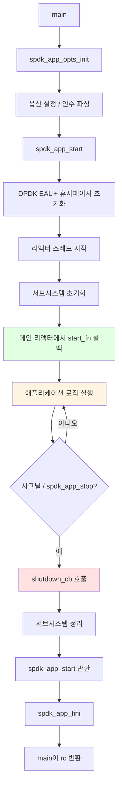

# 모듈 17: 애플리케이션 개발 패턴 (Application Development Patterns)

**단계**: 2 (구현)
**난이도**: 중급
**예상 소요 시간**: 5시간
**선수 과목**: 모듈 01-16

---

## 학습 목표

이 모듈을 완료하면 다음을 수행할 수 있습니다:

- 프로덕션 패턴에 따라 완전한 SPDK 애플리케이션을 구조화
- `spdk_app_opts`와 `spdk_app_start`를 사용한 전체 초기화 시퀀스 구현
- 표준 SPDK 플래그와 함께 커스텀 명령줄 인수를 파싱
- 우아한 종료(graceful teardown)를 위한 커스텀 종료 콜백 등록 및 사용
- 안전하게 리소스를 할당하고 올바른 순서로 해제
- 상황에 맞는 적절한 심각도 수준으로 SPDK 로깅 매크로 적용
- 컴포넌트별 디버그 플래그를 등록하고 런타임에 활성화
- JSON 기반 구성 파일을 통한 애플리케이션 설정
- 가장 흔한 애플리케이션 개발 실수를 인식하고 방지

---

## 애플리케이션 구조가 중요한 이유

SPDK의 이벤트 기반(event-driven), 폴링 모드(polled-mode) 아키텍처는 기존의 멀티스레드 서버와 근본적으로 다릅니다. 규칙은 엄격합니다:

- 모든 SPDK API 호출은 **리소스를 소유하는 스레드에서** 수행해야 합니다.
- **블로킹이 없습니다.** 모든 대기는 콜백으로 전환됩니다.
- 리소스는 엄격한 획득 및 해제 순서를 따릅니다.
- 시그널은 리액터(reactor)에서 전달되며, SPDK의 시그널 처리를 옵트아웃하지 않는 한 직접 처리할 수 없습니다.

구조를 잘못 잡으면 보통 다음과 같은 증상으로 나타납니다:

- 종료 시 세그폴트(segfault) (이중 해제, use-after-free)
- `spdk_app_stop()` 호출 누락으로 인한 행(hang)
- 잘못된 스레드에서 SPDK API를 호출할 때 발생하는 가짜 어설션 실패

이 모듈은 이러한 모든 문제를 방지하는 패턴을 가르칩니다.

---

## 개념 1: 애플리케이션 생명주기 (Application Lifecycle)

모든 SPDK 애플리케이션은 하는 일에 관계없이 동일한 시퀀스를 따릅니다.



핵심 인사이트: `spdk_app_start()`는 `spdk_app_stop()`이 호출될 때까지 **블로킹**합니다. 애플리케이션 로직은 전적으로 `start_fn`에서 시작되는 콜백 내부에서 실행됩니다. 정리 로직은 `shutdown_cb` 또는 `spdk_app_stop()`을 호출하는 함수에 위치합니다.

---

## 개념 2: spdk_app_opts — 각 필드가 하는 일

`struct spdk_app_opts`는 DPDK, 리액터, RPC 서버를 제어합니다. 어떤 필드든 수정하기 전에 항상 `spdk_app_opts_init()`으로 초기화해야 합니다. 이는 새 필드가 추가될 때 ABI 호환성을 보장합니다.

```c
struct spdk_app_opts {
    /* Application identity */
    const char *name;              /* Used for hugepage file names and logging */

    /* Configuration */
    const char *json_config_file;  /* Path to JSON config file */
    bool json_config_ignore_errors;/* Continue even if config has errors */
    void *json_data;               /* Inline JSON (mutually exclusive with file) */
    size_t json_data_size;

    /* RPC server */
    const char *rpc_addr;          /* UNIX socket path or IP:port */
    const char **rpc_allowlist;    /* NULL-terminated list of allowed methods */

    /* CPU / memory */
    const char *reactor_mask;      /* e.g. "0x3" for cores 0 and 1 */
    int main_core;                 /* Core for the main reactor (default: 0) */
    int mem_size;                  /* Hugepage memory in MB (-1 = auto) */
    bool no_pci;                   /* Skip PCI enumeration */
    bool no_huge;                  /* Use malloc instead of hugepages (testing only) */

    /* Shutdown and signals */
    spdk_app_shutdown_cb shutdown_cb; /* Called when shutdown begins */
    bool disable_signal_handlers;    /* If true, you must call spdk_app_start_shutdown() */

    /* Logging */
    enum spdk_log_level print_level; /* Minimum level printed to stderr */
    spdk_log_cb *log;                /* Custom log sink (NULL = default) */

    /* Tracing */
    const char *tpoint_group_mask;   /* Enable tracepoint groups */
    uint64_t num_entries;            /* Trace ring buffer entries per core */

    /* ABI safety — must equal sizeof(struct spdk_app_opts) */
    size_t opts_size;
};
```

### 필수 초기화 패턴

```c
struct spdk_app_opts opts = {};           /* zero the struct */
spdk_app_opts_init(&opts, sizeof(opts));  /* fill defaults, set opts_size */
opts.name = "my_app";                     /* now override what you need */
```

`spdk_app_opts_init()`을 절대 생략하지 마십시오. 이 함수 없이는 `opts_size`가 0이 되어, SPDK가 opts를 거부하거나 필드를 잘못 읽게 됩니다.

---

## 개념 3: 명령줄 인수 파싱 (Parsing Command-Line Arguments)

`spdk_app_parse_args()`는 `getopt_long`을 확장하여, 애플리케이션 고유 플래그와 SPDK의 내장 플래그(`-m` 코어 마스크, `-s` 메모리 크기 등)를 한 번에 파싱합니다.

### 표준 SPDK 플래그 (항상 사용 가능)

| 플래그 | 긴 형식 | 효과 |
|------|-----------|--------|
| `-c` | `--config` | JSON 구성 파일 경로 |
| `-m` | `--cpumask` | 리액터 코어 마스크 |
| `-s` | `--mem-size` | 휴지페이지 메모리 (MB) |
| `-r` | `--rpc-socket` | RPC 소켓 경로 |
| `-L` | `--logflag` | 명명된 로그 플래그 활성화 |
| `-u` | `--no-pci` | PCI 건너뛰기 |
| `-g` | `--single-file-segments` | 휴지페이지 세그먼트당 하나의 파일 |
| `-h` | `--help` | 도움말 출력 |

### 애플리케이션 고유 플래그 추가

```c
/* Step 1: define your option characters (must not conflict with SPDK's set) */
/* SPDK uses: c d e g h i m n p r s u v A B L R W                           */
/* Safe characters to add: f j k o q t w x y z and upper-case letters       */

static const char g_my_opts[] = "f:T:";  /* -f <file>, -T <timeout> */

static const char *g_config_path = NULL;
static int g_timeout_sec = 30;

static int
my_parse_arg(int ch, char *arg)
{
    switch (ch) {
    case 'f':
        g_config_path = arg;
        break;
    case 'T':
        g_timeout_sec = atoi(arg);
        if (g_timeout_sec <= 0) {
            fprintf(stderr, "Invalid timeout: %s\n", arg);
            return -EINVAL;
        }
        break;
    default:
        return -EINVAL;
    }
    return 0;  /* 0 = success */
}

static void
my_usage(void)
{
    printf(" -f <path>    path to application config file\n");
    printf(" -T <sec>     operation timeout in seconds (default: 30)\n");
}

int
main(int argc, char **argv)
{
    struct spdk_app_opts opts = {};
    spdk_app_parse_args_rvals_t rval;
    int rc;

    spdk_app_opts_init(&opts, sizeof(opts));
    opts.name = "my_app";

    rval = spdk_app_parse_args(argc, argv, &opts,
                               g_my_opts,      /* app-specific opt chars */
                               NULL,           /* no long options */
                               my_parse_arg,   /* callback for app opts */
                               my_usage);      /* callback for help text */
    if (rval != SPDK_APP_PARSE_ARGS_SUCCESS) {
        return rval;
    }

    rc = spdk_app_start(&opts, app_started, NULL);
    spdk_app_fini();
    return rc;
}
```

### 실제 예제: spdk_tgt

SPDK 타겟(`app/spdk_tgt/spdk_tgt.c`)은 의도적으로 최소화되어 있습니다 — 유일한 추가 플래그는 PID 파일을 위한 `-f`입니다:

```c
static void
spdk_tgt_started(void *arg1)
{
    if (g_pid_path) {
        spdk_tgt_save_pid(g_pid_path);
    }
    /* No further setup needed — config drives everything via JSON-RPC */
}

int
main(int argc, char **argv)
{
    struct spdk_app_opts opts = {};
    int rc;

    spdk_app_opts_init(&opts, sizeof(opts));
    opts.name = "spdk_tgt";

    if ((rc = spdk_app_parse_args(argc, argv, &opts,
                                  "f:" SPDK_SOCK_PATH,
                                  NULL,
                                  spdk_tgt_parse_arg,
                                  spdk_tgt_usage)) !=
        SPDK_APP_PARSE_ARGS_SUCCESS) {
        return rc;
    }

    rc = spdk_app_start(&opts, spdk_tgt_started, NULL);
    spdk_app_fini();
    return rc;
}
```

주목할 점: `spdk_tgt_started`는 거의 아무것도 하지 않습니다. 전체 타겟 구성은 JSON 구성 파일과 런타임의 JSON-RPC 호출에서 이루어집니다. 이것이 프로덕션 타겟에 권장되는 패턴입니다.

---

## 개념 4: 애플리케이션 컨텍스트와 리소스 할당 (Application Context and Resource Allocation)

SPDK에는 전역 암묵적 상태가 없습니다. 사용자가 직접 소유하는 컨텍스트 구조체를 통해 상태를 관리하며, 시작 시 할당하고 정리 중에 해제합니다.

### 컨텍스트 설계 규칙

1. `calloc`으로 할당하여 (`malloc`이 아닌) 모든 필드가 0/NULL로 시작하도록 합니다.
2. 이중 정리를 방지하기 위해 `shutdown_started` 플래그를 사용합니다.
3. 모든 SPDK 핸들(`spdk_bdev_desc *`, `spdk_io_channel *` 등)을 노출된 전역 변수가 아닌 컨텍스트에 보관합니다.

```c
struct app_context {
    /* SPDK resources */
    struct spdk_bdev_desc   *bdev_desc;
    struct spdk_io_channel  *io_channel;

    /* Application state */
    uint64_t    bytes_written;
    uint64_t    bytes_read;
    bool        shutdown_started;   /* guard against double cleanup */

    /* Completion tracking */
    int         outstanding_ios;
};
```

### start_fn에서의 할당

```c
static void
app_started(void *arg1)
{
    struct app_context *ctx;
    int rc;

    ctx = calloc(1, sizeof(*ctx));
    if (ctx == NULL) {
        SPDK_ERRLOG("Failed to allocate app context\n");
        spdk_app_stop(-1);
        return;
    }

    /* All SPDK resource acquisition happens here */
    rc = spdk_bdev_open_ext("Malloc0", true,
                            app_bdev_event_cb, ctx,
                            &ctx->bdev_desc);
    if (rc != 0) {
        SPDK_ERRLOG("Failed to open bdev: %s\n", spdk_strerror(rc));
        free(ctx);
        spdk_app_stop(-1);
        return;
    }

    ctx->io_channel = spdk_bdev_get_io_channel(ctx->bdev_desc);
    if (ctx->io_channel == NULL) {
        SPDK_ERRLOG("Failed to get I/O channel\n");
        spdk_bdev_close(ctx->bdev_desc);
        free(ctx);
        spdk_app_stop(-1);
        return;
    }

    SPDK_NOTICELOG("Resources acquired, starting I/O\n");
    app_start_io(ctx);
}
```

---

## 개념 5: 리소스 해제 순서 (Resource Release Order)

SPDK 리소스는 **획득 역순으로** 해제해야 합니다. 이를 지키지 않는 것이 종료 시 크래시의 가장 흔한 원인입니다.

```
획득 순서:                해제 순서 (역순):
1. bdev_open_ext     ←→  4. bdev_close
2. get_io_channel    ←→  3. put_io_channel
3. (I/O 제출)        ←→  2. 완료 콜백 대기
4. (결과 사용)       ←→  1. 컨텍스트 해제
```

### 안전한 정리 패턴

```c
static void
app_cleanup(struct app_context *ctx)
{
    /* Guard: only run cleanup once */
    if (ctx->shutdown_started) {
        return;
    }
    ctx->shutdown_started = true;

    /*
     * If there are outstanding I/Os, we cannot free the channel yet.
     * Instead, set a flag and let the completion callbacks drain.
     * When outstanding_ios reaches 0, they will call this function again.
     */
    if (ctx->outstanding_ios > 0) {
        SPDK_NOTICELOG("Waiting for %d outstanding I/Os\n",
                       ctx->outstanding_ios);
        return;
    }

    /* Release resources in reverse acquisition order */
    if (ctx->io_channel) {
        spdk_put_io_channel(ctx->io_channel);
        ctx->io_channel = NULL;
    }
    if (ctx->bdev_desc) {
        spdk_bdev_close(ctx->bdev_desc);
        ctx->bdev_desc = NULL;
    }

    free(ctx);
    spdk_app_stop(0);
}
```

### 드레인을 수행하는 완료 콜백

```c
static void
write_complete(struct spdk_bdev_io *bdev_io,
               bool success,
               void *cb_arg)
{
    struct app_context *ctx = cb_arg;

    spdk_bdev_free_io(bdev_io);
    ctx->outstanding_ios--;

    if (!success) {
        SPDK_ERRLOG("Write failed\n");
        /* Still decrement; cleanup will run when count reaches 0 */
    } else {
        ctx->bytes_written += g_io_size;
    }

    /* If shutdown was requested while this I/O was in flight, clean up now */
    if (ctx->shutdown_started && ctx->outstanding_ios == 0) {
        app_cleanup(ctx);
    }
}
```

---

## 개념 6: 종료와 시그널 처리 (Shutdown and Signal Handling)

### 기본 시그널 동작

기본적으로 SPDK는 `SIGINT`와 `SIGTERM`을 가로챕니다. 둘 중 하나가 도착하면, 프레임워크는 `opts.shutdown_cb`(설정된 경우)를 호출한 다음 서브시스템 해체를 시작합니다.

```c
/* Simple shutdown callback */
static void
my_shutdown_cb(void)
{
    /* This is called on the main reactor thread — safe to call SPDK APIs */
    SPDK_NOTICELOG("Shutdown signal received\n");
    g_shutdown = true;

    /* Send a drain message to every worker thread */
    struct worker_ctx *worker;
    TAILQ_FOREACH(worker, &g_workers, link) {
        spdk_thread_send_msg(worker->thread, worker_drain, worker);
    }
}

/* In main, register it */
opts.shutdown_cb = my_shutdown_cb;
```

### shutdown_cb를 사용할 때 vs 정리 함수를 사용할 때

| 시나리오 | 해체 코드를 넣을 위치 |
|----------|-----------------------|
| 단일 리소스의 간단한 앱 | 오류 경로에서 직접 `spdk_app_stop()` 호출; `shutdown_cb` 불필요 |
| 멀티 리소스 또는 멀티 스레드 | `shutdown_cb`에서 워커에 시그널; 워커가 드레인 완료 후 `spdk_app_stop` 호출 |
| 비동기 해체 필요 | `shutdown_cb`가 비동기 체인을 시작; 마지막 콜백이 `spdk_app_stop` 호출 |

### 실제 예제: bdevperf 종료

```c
/* From examples/bdev/bdevperf/bdevperf.c */
static void
spdk_bdevperf_shutdown_cb(void)
{
    g_shutdown = true;
    struct bdevperf_job *job, *tmp;

    if (g_bdevperf.running_jobs == 0) {
        /* Nothing in flight — immediate stop */
        bdevperf_test_done(NULL);
        return;
    }

    /* Drain each job on its own thread */
    TAILQ_FOREACH_SAFE(job, &g_bdevperf.jobs, link, tmp) {
        spdk_thread_send_msg(job->thread, _bdevperf_job_drain, job);
    }
}
```

### SPDK의 시그널 핸들러 비활성화

임베디드 시나리오나 애플리케이션이 완전한 시그널 제어를 원할 때:

```c
opts.disable_signal_handlers = true;
/* Now you must call spdk_app_start_shutdown() yourself */
```

이 옵션을 사용할 때, `spdk_app_start_shutdown()` 또는 `spdk_app_stop()`이 명시적으로 호출되지 않으면 SPDK는 종료되지 않습니다.

---

## 개념 7: 로깅 (Logging)

SPDK는 5가지 심각도 수준과 컴포넌트별 명명된 플래그 시스템을 제공합니다.

### 심각도 매크로

```c
SPDK_ERRLOG("...");    /* SPDK_LOG_ERROR  — failures, always emitted unless disabled */
SPDK_WARNLOG("...");   /* SPDK_LOG_WARN   — recoverable issues */
SPDK_NOTICELOG("..."); /* SPDK_LOG_NOTICE — important operational events */
SPDK_INFOLOG(flag, "...");  /* SPDK_LOG_INFO  — gated by named flag */
SPDK_DEBUGLOG(flag, "..."); /* SPDK_LOG_DEBUG — gated by named flag, only in debug builds */
```

모든 매크로는 `printf` 스타일 포맷 문자열을 받습니다. 출력에 파일, 줄 번호, 함수 이름이 자동으로 포함됩니다.

### 적절한 수준 선택

| 수준 | 사용 시기 |
|-------|-----------|
| `SPDK_ERRLOG` | 작업 성공을 방해하는 모든 조건 |
| `SPDK_WARNLOG` | 작업은 성공했으나 비정상적인 상황 (재시도, 폴백) |
| `SPDK_NOTICELOG` | 생명주기 이벤트: 시작, 종료, 구성 로드 |
| `SPDK_INFOLOG` | 디버깅에 유용하지만 프로덕션에서는 너무 장황한 I/O별 세부사항 |
| `SPDK_DEBUGLOG` | 내부 상태 덤프, 특정 버그를 추적할 때만 유용 |

### 컴포넌트별 로그 플래그 등록

```c
/* In your .c file — one per component */
SPDK_LOG_REGISTER_COMPONENT(my_app)

/* Now use the flag */
static void
process_request(struct request *req)
{
    SPDK_INFOLOG(my_app, "Processing request id=%" PRIu64 " len=%zu\n",
                 req->id, req->length);
}
```

런타임에 플래그 활성화:

```bash
# Command-line flag (before startup)
./my_app -L my_app

# JSON-RPC at runtime
spdk_rpc.py log_set_flag my_app
```

### opts에서 로그 수준 설정

```c
/* Print NOTICE and above to stderr during startup */
opts.print_level = SPDK_LOG_NOTICE;

/* After startup, change via RPC:
   spdk_rpc.py log_set_print_level DEBUG
*/
```

### 빈도 제한 에러 로깅 (Rate-limited error logging)

초당 수백만 번 실패가 반복될 수 있는 핫 패스에서는 로그 폭주를 방지하기 위해 빈도 제한 변형을 사용합니다:

```c
static void
io_completion_cb(struct spdk_bdev_io *bdev_io, bool success, void *cb_arg)
{
    if (!success) {
        /* Logs at most once per second; counts suppressed messages */
        SPDK_ERRLOG_RATELIMIT("I/O failed on bdev %s\n",
                              spdk_bdev_get_name(spdk_bdev_io_get_bdev(bdev_io)));
    }
    spdk_bdev_free_io(bdev_io);
}
```

### 커스텀 로그 싱크 (Custom log sink)

외부 로깅 시스템과의 통합을 위해:

```c
static void
my_log_cb(int level, const char *file, const int line,
          const char *func, const char *format, va_list args)
{
    /* Forward to syslog, journald, or a structured logger */
    char msg[1024];
    vsnprintf(msg, sizeof(msg), format, args);
    syslog(spdk_log_to_syslog_level(level), "%s:%d %s: %s", file, line, func, msg);
}

/* Register before spdk_app_start */
opts.log = my_log_cb;
```

---

## 개념 8: JSON-RPC 구성 (JSON-RPC Configuration)

SPDK는 관리 플레인(management plane)으로 JSON-RPC 2.0을 사용합니다. 구성은 시작 시 정적 구성 파일에 저장되는 것이 아니라, JSON 파일에 프레임워크가 초기화 중에 재생하는 일련의 RPC 호출이 포함됩니다.

### JSON 구성 파일 구조

```json
{
  "subsystems": [
    {
      "subsystem": "bdev",
      "config": [
        {
          "method": "bdev_malloc_create",
          "params": {
            "name": "Malloc0",
            "num_blocks": 131072,
            "block_size": 512
          }
        },
        {
          "method": "bdev_malloc_create",
          "params": {
            "name": "Malloc1",
            "num_blocks": 131072,
            "block_size": 4096
          }
        }
      ]
    },
    {
      "subsystem": "nvmf",
      "config": [
        {
          "method": "nvmf_create_transport",
          "params": {
            "trtype": "TCP"
          }
        },
        {
          "method": "nvmf_create_subsystem",
          "params": {
            "nqn": "nqn.2024-01.io.spdk:cnode1",
            "allow_any_host": true
          }
        }
      ]
    }
  ]
}
```

### 파일에서 구성 로드 vs 인라인 JSON

```c
/* Option A: file path */
opts.json_config_file = "/etc/spdk/config.json";

/* Option B: inline (useful for embedded or test scenarios) */
static const char g_json_config[] = "{\"subsystems\": [...]}";
opts.json_data = (void *)g_json_config;
opts.json_data_size = sizeof(g_json_config) - 1;

/* Cannot use both simultaneously */
```

### 지연 초기화 (--wait-for-rpc)

동적 구성 워크플로우를 위해 `delay_subsystem_init`을 사용합니다:

```c
opts.delay_subsystem_init = true;
```

설정 시, SPDK는 제한된 RPC 서버를 시작하지만 운영자가 `rpc_framework_start_init`을 보낼 때까지 `start_fn`을 호출하지 않습니다. 이를 통해 I/O가 시작되기 전에 서브시스템을 구성(예: bdev 추가)할 수 있습니다.

```bash
# Start the application in wait mode
./my_app --wait-for-rpc &

# Configure via RPC
spdk_rpc.py bdev_malloc_create Malloc0 131072 512
spdk_rpc.py nvmf_create_transport -t TCP

# Signal ready to proceed
spdk_rpc.py framework_start_init
```

### 실행 중인 구성 내보내기

```bash
# Dump current config to file (can be replayed on next start)
spdk_rpc.py save_config > /etc/spdk/config.json
```

---

## 개념 9: 에러 처리 패턴 (Error Handling Patterns)

SPDK 함수는 `int`(0 또는 음수 errno)를 반환하거나 포인터 반환의 경우 `NULL`을 반환합니다. 예외 메커니즘은 없습니다. 모든 실패 경로에서 다음을 수행해야 합니다:

1. `SPDK_ERRLOG`로 에러를 기록합니다.
2. 이미 획득한 모든 리소스를 해제합니다.
3. `spdk_app_stop(-1)`을 호출하거나 (치명적 에러의 경우) 호출자에게 에러를 전파합니다.

### 패턴: 정리 레이블을 사용한 조기 반환 (goto)

여러 리소스를 획득하는 함수의 경우, `goto` 정리는 표준 C 패턴이며 SPDK 코드베이스 전체에서 사용됩니다:

```c
static int
app_init_resources(struct app_context *ctx)
{
    int rc;

    rc = spdk_bdev_open_ext("Malloc0", true, app_bdev_event_cb,
                            ctx, &ctx->bdev_desc);
    if (rc != 0) {
        SPDK_ERRLOG("Failed to open Malloc0: %s\n", spdk_strerror(rc));
        goto err_no_bdev;
    }

    ctx->io_channel = spdk_bdev_get_io_channel(ctx->bdev_desc);
    if (ctx->io_channel == NULL) {
        SPDK_ERRLOG("Failed to get I/O channel\n");
        rc = -ENOMEM;
        goto err_no_channel;
    }

    ctx->buf = spdk_malloc(BUFFER_SIZE, 0x1000, NULL,
                           SPDK_ENV_SOCKET_ID_ANY, SPDK_MALLOC_DMA);
    if (ctx->buf == NULL) {
        SPDK_ERRLOG("Failed to allocate DMA buffer\n");
        rc = -ENOMEM;
        goto err_no_buf;
    }

    return 0;

err_no_buf:
    spdk_put_io_channel(ctx->io_channel);
    ctx->io_channel = NULL;
err_no_channel:
    spdk_bdev_close(ctx->bdev_desc);
    ctx->bdev_desc = NULL;
err_no_bdev:
    return rc;
}
```

### 패턴: 비동기 콜백에서의 에러 전파

비동기 작업이 콜백 내부에서 실패하면, 에러 코드를 반환할 수 없습니다 (콜백은 `void`를 반환합니다). 대신, 애플리케이션을 중지합니다:

```c
static void
read_complete(struct spdk_bdev_io *bdev_io, bool success, void *cb_arg)
{
    struct app_context *ctx = cb_arg;

    spdk_bdev_free_io(bdev_io);

    if (!success) {
        SPDK_ERRLOG("Read operation failed\n");
        app_cleanup(ctx);   /* sets rc = -1 internally and calls spdk_app_stop */
        return;
    }

    /* Continue processing */
    app_process_data(ctx);
}
```

### 패턴: 에러 코드와 spdk_strerror

로그 메시지에서 SPDK 에러 코드를 항상 문자열로 변환하십시오:

```c
rc = some_spdk_function(...);
if (rc != 0) {
    SPDK_ERRLOG("Function failed: %s (rc=%d)\n", spdk_strerror(rc), rc);
}
```

`spdk_strerror`는 POSIX `errno` 값과 SPDK 고유 코드 모두를 처리합니다. 문자열 리터럴을 반환하므로 (`strerror_r`와 달리) 항상 안전하게 호출할 수 있습니다.

---

## 개념 10: 완전한 애플리케이션 템플릿 (Complete Application Template)

다음은 이 모듈의 모든 패턴을 통합한 완전한 프로덕션 준비 템플릿입니다.

```c
/*
 * my_app.c — Complete SPDK application template
 * Demonstrates: opts, parse_args, start_fn, shutdown_cb, logging, cleanup
 */

#include "spdk/stdinc.h"
#include "spdk/event.h"
#include "spdk/bdev.h"
#include "spdk/log.h"
#include "spdk/string.h"
#include "spdk/env.h"

/* Register our component's log flag */
SPDK_LOG_REGISTER_COMPONENT(my_app)

/* Application-wide configuration (set from command line) */
static struct {
    const char *bdev_name;
    uint32_t    queue_depth;
    uint64_t    io_size;
} g_config = {
    .bdev_name   = "Malloc0",
    .queue_depth = 64,
    .io_size     = 4096,
};

/* Per-run context */
struct app_context {
    struct spdk_bdev_desc  *bdev_desc;
    struct spdk_io_channel *io_channel;
    void                   *buf;
    int                     outstanding_ios;
    bool                    shutdown_started;
    int                     rc;
};

/* Forward declarations */
static void app_cleanup(struct app_context *ctx);
static void app_submit_io(struct app_context *ctx);

/* ── Bdev event callback ─────────────────────────────────────────────────── */

static void
app_bdev_event_cb(enum spdk_bdev_event_type type,
                  struct spdk_bdev *bdev,
                  void *event_ctx)
{
    struct app_context *ctx = event_ctx;

    SPDK_WARNLOG("Bdev event %d on %s\n", type,
                 spdk_bdev_get_name(bdev));

    if (type == SPDK_BDEV_EVENT_REMOVE) {
        SPDK_NOTICELOG("Bdev removed — initiating shutdown\n");
        ctx->rc = -ENODEV;
        app_cleanup(ctx);
    }
}

/* ── I/O completion ──────────────────────────────────────────────────────── */

static void
io_complete(struct spdk_bdev_io *bdev_io, bool success, void *cb_arg)
{
    struct app_context *ctx = cb_arg;

    spdk_bdev_free_io(bdev_io);
    ctx->outstanding_ios--;

    if (!success) {
        SPDK_ERRLOG_RATELIMIT("I/O failed\n");
        ctx->rc = -EIO;
    } else {
        SPDK_DEBUGLOG(my_app, "I/O complete, outstanding=%d\n",
                      ctx->outstanding_ios);
    }

    /* If shutdown was requested and all I/Os are done, clean up now */
    if (ctx->shutdown_started && ctx->outstanding_ios == 0) {
        app_cleanup(ctx);
    }
}

/* ── I/O submission ──────────────────────────────────────────────────────── */

static void
app_submit_io(struct app_context *ctx)
{
    int rc;
    uint64_t offset_blocks = 0;
    uint64_t num_blocks = g_config.io_size /
                          spdk_bdev_get_block_size(
                              spdk_bdev_desc_get_bdev(ctx->bdev_desc));

    rc = spdk_bdev_write(ctx->bdev_desc, ctx->io_channel,
                         ctx->buf, offset_blocks, num_blocks,
                         io_complete, ctx);
    if (rc == 0) {
        ctx->outstanding_ios++;
        SPDK_INFOLOG(my_app, "Submitted write, outstanding=%d\n",
                     ctx->outstanding_ios);
    } else if (rc == -ENOMEM) {
        /* Queue full — acceptable backpressure, retry via poller */
        SPDK_DEBUGLOG(my_app, "Queue full, will retry\n");
    } else {
        SPDK_ERRLOG("spdk_bdev_write failed: %s\n", spdk_strerror(rc));
        ctx->rc = rc;
        app_cleanup(ctx);
    }
}

/* ── Resource cleanup ────────────────────────────────────────────────────── */

static void
app_cleanup(struct app_context *ctx)
{
    if (ctx->shutdown_started) {
        return;
    }
    ctx->shutdown_started = true;

    SPDK_NOTICELOG("Cleaning up resources\n");

    /* If I/Os are still in flight, let them drain first */
    if (ctx->outstanding_ios > 0) {
        SPDK_NOTICELOG("Draining %d outstanding I/Os\n",
                       ctx->outstanding_ios);
        return;
    }

    /* Release in reverse acquisition order */
    if (ctx->buf) {
        spdk_free(ctx->buf);
        ctx->buf = NULL;
    }
    if (ctx->io_channel) {
        spdk_put_io_channel(ctx->io_channel);
        ctx->io_channel = NULL;
    }
    if (ctx->bdev_desc) {
        spdk_bdev_close(ctx->bdev_desc);
        ctx->bdev_desc = NULL;
    }

    int rc = ctx->rc;
    free(ctx);

    SPDK_NOTICELOG("Shutdown complete, rc=%d\n", rc);
    spdk_app_stop(rc);
}

/* ── Shutdown callback (called on SIGINT/SIGTERM) ────────────────────────── */

static struct app_context *g_ctx;   /* only needed so shutdown_cb can reach it */

static void
app_shutdown_cb(void)
{
    SPDK_NOTICELOG("Shutdown requested\n");
    if (g_ctx) {
        app_cleanup(g_ctx);
    }
}

/* ── Application entry point (called by SPDK after subsystem init) ─────── */

static void
app_started(void *arg1)
{
    struct spdk_bdev *bdev;
    int rc;

    SPDK_NOTICELOG("Application started\n");

    g_ctx = calloc(1, sizeof(*g_ctx));
    if (g_ctx == NULL) {
        SPDK_ERRLOG("Failed to allocate context\n");
        spdk_app_stop(-1);
        return;
    }

    /* Open the bdev */
    rc = spdk_bdev_open_ext(g_config.bdev_name, true,
                            app_bdev_event_cb, g_ctx,
                            &g_ctx->bdev_desc);
    if (rc != 0) {
        SPDK_ERRLOG("Failed to open %s: %s\n",
                    g_config.bdev_name, spdk_strerror(rc));
        free(g_ctx);
        g_ctx = NULL;
        spdk_app_stop(-1);
        return;
    }

    bdev = spdk_bdev_desc_get_bdev(g_ctx->bdev_desc);
    SPDK_NOTICELOG("Opened bdev %s: %" PRIu64 " blocks x %u bytes\n",
                   spdk_bdev_get_name(bdev),
                   spdk_bdev_get_num_blocks(bdev),
                   spdk_bdev_get_block_size(bdev));

    /* Get I/O channel */
    g_ctx->io_channel = spdk_bdev_get_io_channel(g_ctx->bdev_desc);
    if (g_ctx->io_channel == NULL) {
        SPDK_ERRLOG("Failed to get I/O channel\n");
        spdk_bdev_close(g_ctx->bdev_desc);
        free(g_ctx);
        g_ctx = NULL;
        spdk_app_stop(-1);
        return;
    }

    /* Allocate DMA-safe buffer */
    g_ctx->buf = spdk_malloc(g_config.io_size, 0x1000, NULL,
                             SPDK_ENV_SOCKET_ID_ANY, SPDK_MALLOC_DMA);
    if (g_ctx->buf == NULL) {
        SPDK_ERRLOG("Failed to allocate DMA buffer\n");
        spdk_put_io_channel(g_ctx->io_channel);
        spdk_bdev_close(g_ctx->bdev_desc);
        free(g_ctx);
        g_ctx = NULL;
        spdk_app_stop(-1);
        return;
    }

    /* Start I/O */
    app_submit_io(g_ctx);
}

/* ── Command-line argument parsing ───────────────────────────────────────── */

static void
my_usage(void)
{
    printf(" -b <bdev>    name of bdev to use (default: Malloc0)\n");
    printf(" -q <depth>   I/O queue depth (default: 64)\n");
    printf(" -o <bytes>   I/O size in bytes (default: 4096)\n");
}

static int
my_parse_arg(int ch, char *arg)
{
    switch (ch) {
    case 'b':
        g_config.bdev_name = arg;
        break;
    case 'q':
        g_config.queue_depth = atoi(arg);
        break;
    case 'o':
        g_config.io_size = atoll(arg);
        break;
    default:
        return -EINVAL;
    }
    return 0;
}

/* ── main ─────────────────────────────────────────────────────────────────── */

int
main(int argc, char **argv)
{
    struct spdk_app_opts opts = {};
    int rc;

    spdk_app_opts_init(&opts, sizeof(opts));
    opts.name         = "my_app";
    opts.print_level  = SPDK_LOG_NOTICE;
    opts.shutdown_cb  = app_shutdown_cb;

    if ((rc = spdk_app_parse_args(argc, argv, &opts,
                                  "b:q:o:", NULL,
                                  my_parse_arg, my_usage)) !=
        SPDK_APP_PARSE_ARGS_SUCCESS) {
        return rc;
    }

    /* Blocks until spdk_app_stop() is called */
    rc = spdk_app_start(&opts, app_started, NULL);

    /* Framework cleanup (frees DPDK memory, closes log) */
    spdk_app_fini();

    return rc;
}
```

---

## 흔한 실수와 방지법 (Common Mistakes and How to Avoid Them)

### 실수 1: spdk_app_opts_init 누락

```c
/* WRONG */
struct spdk_app_opts opts;      /* uninitialized garbage */
opts.name = "my_app";
rc = spdk_app_start(&opts, ...); /* opts_size is garbage — likely crash */

/* CORRECT */
struct spdk_app_opts opts = {};              /* zero the stack struct */
spdk_app_opts_init(&opts, sizeof(opts));     /* set defaults and opts_size */
opts.name = "my_app";
```

### 실수 2: 리소스 해제 전에 spdk_app_stop 호출

```c
/* WRONG — bdev_desc leaked, use-after-free possible */
static void cleanup(struct app_context *ctx) {
    spdk_app_stop(0);           /* SPDK tears down subsystems */
    spdk_bdev_close(ctx->bdev_desc); /* too late! */
}

/* CORRECT */
static void cleanup(struct app_context *ctx) {
    spdk_put_io_channel(ctx->io_channel);
    spdk_bdev_close(ctx->bdev_desc);
    free(ctx);
    spdk_app_stop(0);           /* only after all resources are freed */
}
```

### 실수 3: 정리 함수 이중 호출

```c
/* WRONG — no guard */
static void cleanup(struct app_context *ctx) {
    spdk_put_io_channel(ctx->io_channel); /* called twice if signal + error both fire */
    ...
}

/* CORRECT — guard with shutdown_started */
static void cleanup(struct app_context *ctx) {
    if (ctx->shutdown_started) return;
    ctx->shutdown_started = true;
    ...
}
```

### 실수 4: spdk_bdev_write의 -ENOMEM 무시

```c
/* WRONG — if queue is full, rc = -ENOMEM is silently lost */
spdk_bdev_write(desc, ch, buf, offset, len, cb, ctx);

/* CORRECT — handle backpressure */
rc = spdk_bdev_write(desc, ch, buf, offset, len, cb, ctx);
if (rc == -ENOMEM) {
    /* Queue full, retry later via a poller */
} else if (rc != 0) {
    SPDK_ERRLOG("Write submission failed: %s\n", spdk_strerror(rc));
    app_cleanup(ctx);
}
```

### 실수 5: 컨텍스트 대신 전역 상태 사용

```c
/* WRONG — not reusable, not testable */
static struct spdk_bdev_desc *g_desc;
static struct spdk_io_channel *g_ch;

/* CORRECT — all state in context struct */
struct app_context {
    struct spdk_bdev_desc *bdev_desc;
    struct spdk_io_channel *io_channel;
};
```

---

## 실습 과제

### 과제 1: 커스텀 Opts (초급)

템플릿 애플리케이션을 수정하여 두 개의 새 명령줄 플래그를 받도록 합니다:
- `-n <count>` — 종료 전에 수행할 I/O 횟수
- `-V` — 상세 로깅 활성화 (`print_level = SPDK_LOG_DEBUG` 설정)

요구사항:
- 새 플래그를 추가하여 `spdk_app_parse_args`를 사용합니다.
- `count`개의 I/O가 완료되면 `app_cleanup`을 호출합니다.
- `./my_app -n 10 -V -c config.json`으로 검증합니다.

### 과제 2: 다중 Bdev 리소스 (중급)

템플릿을 확장하여 두 개의 bdev("Malloc0"과 "Malloc1")를 열고 동시에 두 곳에 쓰기를 수행합니다.

요구사항:
- 컨텍스트 구조체에 두 번째 `bdev_desc`와 `io_channel`을 추가합니다.
- I/O를 시작하기 전에 두 리소스를 모두 획득합니다.
- 정리 시 역순으로 둘 다 해제합니다.
- 양쪽 모두의 미완료 I/O를 추적하고, 둘 다 0이 될 때만 `spdk_app_stop`을 호출합니다.

### 과제 3: 종료 드레인 패턴 (중급)

`queue_depth`까지 지속적으로 쓰기를 제출하는 폴러 기반 I/O 루프를 구현합니다. SIGINT가 도착하면:

1. `shutdown_cb`가 `g_shutdown = true`로 설정하고 새 I/O 제출을 중단합니다.
2. 기존 I/O는 `io_complete`를 통해 정상적으로 완료됩니다.
3. `outstanding_ios`가 0에 도달하면 `io_complete`가 `app_cleanup`을 호출합니다.

힌트: 모듈 12의 `SPDK_POLLER_REGISTER`를 사용하여 제출 루프를 구동합니다.

### 과제 4: 커스텀 로그 싱크 (고급)

JSON 형식의 로그 항목을 파일에 쓰는 커스텀 로그 콜백을 구현합니다:

```json
{"ts": 1706745600.123, "level": "NOTICE", "file": "app.c", "line": 42, "msg": "Started"}
```

`opts.log`을 통해 등록하고 애플리케이션 실행 시 출력 파일이 생성되는지 확인합니다.

---

## 핵심 요약

1. **어떤 필드든 설정하기 전에 반드시 `spdk_app_opts_init`을 호출하십시오.** ABI 안전성은 `opts_size`가 올바른 것에 의존합니다.

2. **`spdk_app_start`는 블로킹합니다.** 애플리케이션은 전적으로 콜백 내에서 실행됩니다. 종료하는 유일한 방법은 `spdk_app_stop`을 호출하는 것입니다.

3. **`start_fn`에서 리소스를 획득하고, 정리 시 역순으로 해제하십시오.** 성공적으로 획득하지 않은 리소스를 절대 해제하지 마십시오.

4. **`shutdown_started`로 정리를 보호하십시오.** 시그널과 에러 경로 모두 정리를 트리거할 수 있습니다; 가드가 이중 해제를 방지합니다.

5. **I/O 채널을 해제하기 전에 진행 중인 I/O를 드레인하십시오.** 미완료 I/O가 있는 채널을 해제하는 것은 정의되지 않은 동작입니다.

6. **제출에서 `-ENOMEM`은 큐가 가득 찼다는 의미이지 치명적 에러가 아닙니다.** 크래시로 처리하지 말고 나중에 재시도하십시오.

7. **적절한 수준에서 로깅하십시오.** 실패에는 `SPDK_ERRLOG`; 생명주기 이벤트에는 `SPDK_NOTICELOG`; I/O별 세부사항에는 `SPDK_INFOLOG`/`SPDK_DEBUGLOG` (플래그로 제어).

8. **에러 코드를 읽기 가능한 문자열로 변환하려면 `spdk_strerror(rc)`를 사용하십시오.**

9. **JSON 구성은 시작 시 재생되는 일련의 RPC 호출입니다.** 실행 중인 구성을 내보내려면 `save_config`을 사용하고, 동적 사전 초기화 워크플로우에는 `--wait-for-rpc`를 사용하십시오.

10. **모든 SPDK 핸들을 노출된 전역 변수가 아닌 컨텍스트 구조체에 보관하십시오.** 전역 변수는 테스트와 재사용을 어렵게 만듭니다; 컨텍스트 구조체는 모든 것을 추적 가능하고 수명 범위 내에 유지합니다.

---

## 요약

이 모듈은 SPDK 애플리케이션의 전체 구조를 다루었습니다:

- `main`에서 `spdk_app_start`, `start_fn`을 거쳐 `spdk_app_fini`까지의 생명주기.
- `spdk_app_opts` 구조체와 이를 안전하게 초기화하고 확장하는 방법.
- `spdk_app_parse_args`를 사용한 인수 파싱.
- 컨텍스트 기반 리소스 관리와 역순 해제 규칙.
- 종료 콜백과 시그널 처리, 진행 중인 I/O 드레인 포함.
- SPDK 로깅 시스템: 심각도 수준, 컴포넌트별 플래그, 빈도 제한, 커스텀 싱크.
- JSON-RPC 기반 구성, 인라인 JSON, 지연 초기화.
- 모든 패턴을 통합한 완전하고 빌드 가능한 애플리케이션 템플릿.
- 올바른 대안이 포함된 10가지 흔한 실수.

이러한 패턴을 사용하면 초기화, I/O, 종료가 모든 조건에서 올바르게 동작하는 SPDK 애플리케이션을 자신 있게 구축할 수 있습니다.

---

## 다음 단계

- **모듈 18**: 커스텀 Bdev 모듈 — 새로운 bdev 백엔드를 생성하기 위한 `spdk_bdev_fn_table` 인터페이스 구현.
- **모듈 19**: JSON-RPC 서버 통합 — 커스텀 RPC 메서드를 등록하고 애플리케이션에서 처리.
- **모듈 20**: 성능 최적화 — 큐 깊이 튜닝, CPU 고정, NUMA 인지 메모리 할당.
