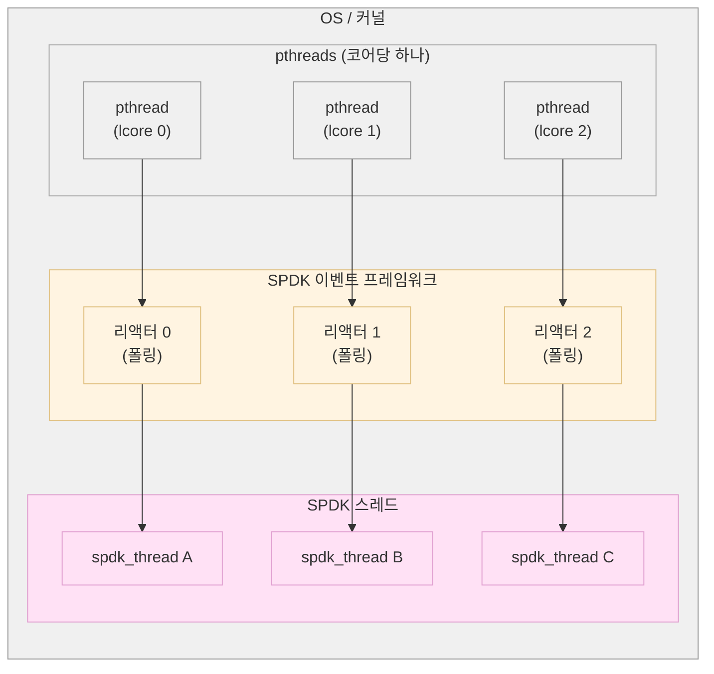
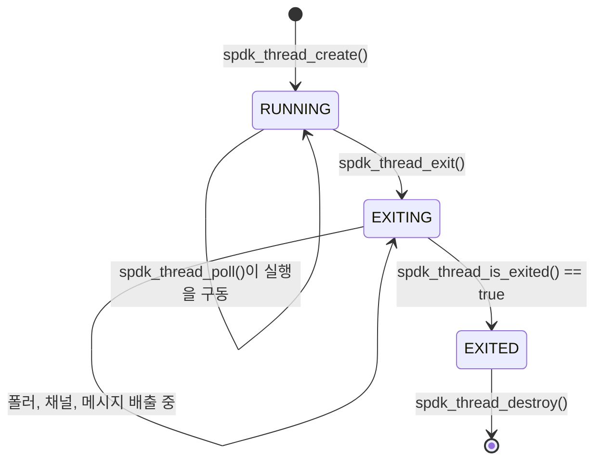
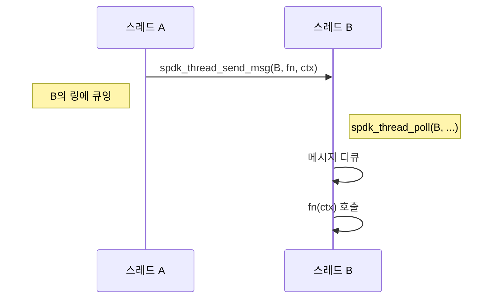
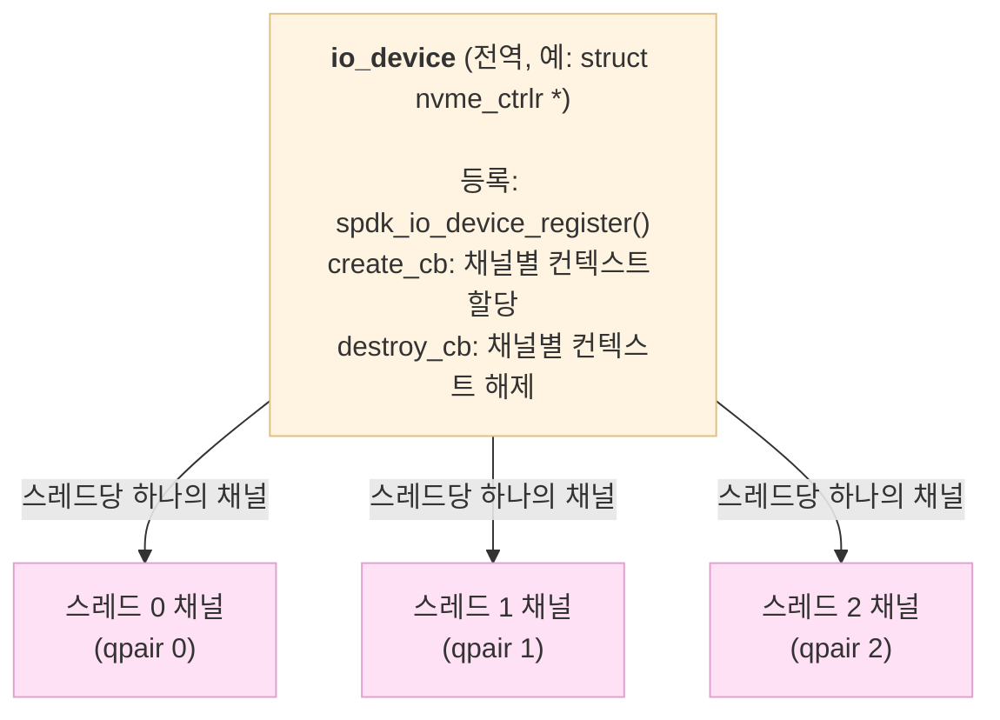

# 모듈 18: 스레드 관리(Thread Management)

**단계**: 2 (구현)
**난이도**: 중급
**예상 소요 시간**: 4시간
**선수 과목**: 모듈 01-17

---

## 학습 목표

- SPDK 스레딩 모델과 설계 목표 이해하기
- 올바른 수명 주기 관리로 SPDK 스레드 생성 및 파괴하기
- 리액터-스레드 관계와 스케줄링 동작 방식 이해하기
- `spdk_thread_send_msg`를 사용한 스레드 간 메시징 사용하기
- 폴러(Poller) 등록 및 관리 (연속 및 시간 기반)
- I/O 채널 구현 및 스레드 바인딩 이해하기
- cpumask를 사용하여 특정 CPU 코어에 스레드 할당하기
- 스레드 로컬 저장소 패턴 올바르게 적용하기
- 통계 API로 스레드 상태 모니터링하기

---

## 핵심 개념

### 개념 1: SPDK 스레딩 모델

SPDK 스레드는 OS 스레드가 **아닙니다**. DPDK lcore(논리 CPU 코어) 위에서 실행되는 경량의 스택리스 협력적 스케줄링 유닛입니다. 이 구분을 이해하는 것이 올바른 SPDK 코드를 작성하는 데 기본이 됩니다.



**주요 특성**:
- 각 SPDK 스레드는 한 번에 하나의 리액터에서만 독점적으로 실행됩니다
- 선점(Preemption)이 없습니다: 함수는 양보(yield)하기 전에 완료될 때까지 실행됩니다
- 스레드 내부 상태에는 뮤텍스가 필요 없습니다
- 모든 크로스 스레드 통신은 메시지 전달 API를 통합니다
- 리액터는 여러 SPDK 스레드를 호스팅할 수 있습니다 (라운드 로빈 스케줄링)

**왜 락이 없을까?** 리액터당 한 번에 하나의 SPDK 스레드만 실행되고, SPDK 스레드는 한 번에 하나의 리액터에서만 실행되므로, 스레드별 데이터에는 락이 필요 없습니다. 이것이 SPDK의 락 프리 성능의 기초입니다.

---

### 개념 2: 스레드 수명 주기 상태 머신



`lib/thread/thread.c`의 내부 상태 열거형:
```c
enum spdk_thread_state {
    /* The thread is processing pollers and messages. */
    SPDK_THREAD_STATE_RUNNING,

    /* The thread is in the process of termination.
     * It reaps unregistering pollers and releases I/O channels. */
    SPDK_THREAD_STATE_EXITING,

    /* The thread is exited. Ready to call spdk_thread_destroy(). */
    SPDK_THREAD_STATE_EXITED,
};
```

---

### 개념 3: 내부 스레드 구조체

`struct spdk_thread` (`lib/thread/thread.c`에서)는 SPDK 스레드가 관리하는 것을 보여줍니다:

```c
struct spdk_thread {
    uint64_t                tsc_last;
    struct spdk_thread_stats stats;          /* busy_tsc / idle_tsc */

    /* 활성 폴러: 라운드 로빈 실행, 타이머 없음 */
    TAILQ_HEAD(active_pollers_head, spdk_poller) active_pollers;

    /* 시간 기반 폴러: 다음 실행 틱으로 정렬된 레드-블랙 트리 */
    RB_HEAD(timed_pollers_tree, spdk_poller)     timed_pollers;

    /* 일시 정지된 폴러: 재개 또는 등록 해제 대기 중 */
    TAILQ_HEAD(paused_pollers_head, spdk_poller) paused_pollers;

    struct spdk_ring         *messages;      /* 수신 메시지를 위한 락 프리 링 */
    spdk_msg_fn              critical_msg;   /* 크리티컬 메시지용 단일 슬롯 */

    /* I/O 채널: io_device 포인터를 키로 하는 레드-블랙 트리 */
    RB_HEAD(io_channel_tree, spdk_io_channel) io_channels;

    char                     name[SPDK_MAX_THREAD_NAME_LEN + 1];
    struct spdk_cpuset        cpumask;
    enum spdk_thread_state    state;
    bool                     is_bound;       /* 현재 코어에 고정 */
    bool                     in_interrupt;   /* 인터럽트 vs. 폴 모드 */

    /* 끝에 할당되는 사용자 컨텍스트 (유연한 배열) */
    uint8_t                  ctx[0];
};
```

사용자 컨텍스트(`ctx[0]`)는 유연한 배열 멤버입니다 - `spdk_thread_lib_init()`이 `ctx_sz > 0`으로 호출되면, 각 스레드 할당에 해당 바이트만큼의 추가 바이트가 포함됩니다. 이것이 스케줄러의 스레드별 상태입니다.

---

## 스레드 라이브러리 초기화

스레드를 생성하기 전에 스레딩 라이브러리를 초기화해야 합니다. 이는 보통 SPDK 이벤트 프레임워크에 의해 수행되지만, 독립 애플리케이션은 명시적으로 해야 합니다.

```c
#include "spdk/thread.h"

/*
 * 간단한 초기화 — 커스텀 스케줄러가 필요 없을 때 사용.
 * new_thread_fn: 새 스레드가 생성될 때마다 호출; 제공된 스레드에서
 *                spdk_thread_poll()을 자주 호출해야 함.
 * ctx_sz:        스케줄러 사용을 위한 스레드당 추가 바이트.
 */
int
my_app_init_threads(void)
{
    int rc;

    rc = spdk_thread_lib_init(my_new_thread_cb, 0);
    if (rc != 0) {
        SPDK_ERRLOG("Failed to initialize thread library: %d\n", rc);
        return rc;
    }
    return 0;
}

/*
 * 확장 초기화 — 스레드 재스케줄링 작업 지원.
 * 런타임에 cpumask 업데이트를 사용할 때 필수.
 */
int
my_app_init_threads_ext(void)
{
    return spdk_thread_lib_init_ext(
        my_thread_op_fn,           /* NEW 및 RESCHED 작업 처리 */
        my_thread_op_supported_fn, /* op가 지원되면 true 반환 */
        sizeof(struct my_scheduler_ctx),
        SPDK_DEFAULT_MSG_MEMPOOL_SIZE
    );
}
```

---

## 스레드 생성

### 기본 스레드 생성

```c
#include "spdk/thread.h"
#include "spdk/env.h"
#include "spdk/cpuset.h"

/*
 * 특정 CPU 코어에 고정된 워커 스레드를 생성합니다.
 *
 * lib/event/reactor.c 및 lib/ftl/ftl_init.c의 실제 예제 패턴:
 *   cpumask는 *선호* 코어를 지정 — 스케줄러에 대한 힌트이지
 *   독점 사용 보장은 아님.
 */
static struct spdk_thread *
create_worker_thread(const char *name, uint32_t cpu_core)
{
    struct spdk_thread *thread;
    struct spdk_cpuset cpumask;

    /* 단일 코어가 설정된 cpumask 빌드 */
    spdk_cpuset_zero(&cpumask);
    spdk_cpuset_set_cpu(&cpumask, cpu_core, true);

    thread = spdk_thread_create(name, &cpumask);
    if (thread == NULL) {
        SPDK_ERRLOG("Failed to create thread '%s' on core %u\n", name, cpu_core);
        return NULL;
    }

    SPDK_NOTICELOG("Created thread '%s' (id=%" PRIu64 ") on core %u\n",
                   spdk_thread_get_name(thread),
                   spdk_thread_get_id(thread),
                   cpu_core);
    return thread;
}

/*
 * CPU 친화도 선호 없이 스레드를 생성합니다 (스케줄러가 결정).
 * test/app/fuzz 및 유사 도구에서 사용.
 */
static struct spdk_thread *
create_any_thread(const char *name)
{
    return spdk_thread_create(name, NULL);
}
```

### 모든 활성 코어에 걸쳐 스레드 생성

일반적인 SPDK 패턴: 활성 lcore당 하나의 워커 스레드.

```c
/*
 * lib/iscsi/iscsi_subsystem.c 및 module/event/subsystems/nvmf/nvmf_tgt.c의 패턴
 */
static int
create_per_core_threads(void)
{
    uint32_t i;
    char thread_name[64];
    struct spdk_cpuset cpumask;

    SPDK_ENV_FOREACH_CORE(i) {
        snprintf(thread_name, sizeof(thread_name), "worker_%u", i);

        spdk_cpuset_zero(&cpumask);
        spdk_cpuset_set_cpu(&cpumask, i, true);

        g_workers[i].thread = spdk_thread_create(thread_name, &cpumask);
        if (g_workers[i].thread == NULL) {
            SPDK_ERRLOG("Failed to create worker thread for core %u\n", i);
            return -ENOMEM;
        }
        g_workers[i].core = i;
    }
    return 0;
}
```

`SPDK_ENV_FOREACH_CORE(i)` 매크로는 다음으로 확장됩니다:
```c
for (i = spdk_env_get_first_core();
     i != UINT32_MAX;
     i = spdk_env_get_next_core(i))
```

---

## 스레드 스케줄링: 리액터-스레드 관계

### 리액터가 스레드를 구동하는 방법

리액터(Reactor)는 SPDK 스레드를 구동하는 엔진입니다. 각 리액터는 무한 폴링 루프를 실행합니다:

```c
/*
 * 간소화된 리액터 루프 (lib/event/reactor.c 내부에서).
 * 실제 루프는 인터럽트 모드, 스케줄링, 다중 스레드를 처리하지만
 * 핵심 개념은:
 */
static void
reactor_run(void *arg)
{
    struct spdk_reactor *reactor = arg;
    struct spdk_thread  *thread;

    while (!g_reactor_exit) {
        /* 이 리액터에 할당된 각 스레드를 폴링 */
        TAILQ_FOREACH(thread, &reactor->threads, tailq) {
            /*
             * spdk_thread_poll()은 다음을 실행:
             *   1. 모든 활성 (연속) 폴러를 한 번 실행
             *   2. 만료된 모든 시간 기반 폴러 실행
             *   3. 메시지 링에서 최대 max_msgs개 메시지 처리
             *
             * 작업이 수행되면 1, 유휴이면 0을 반환.
             */
            spdk_thread_poll(thread, 0, 0);
        }
    }
}
```

### 스레드 바인딩(Thread Binding)

고정되면 스레드는 언바인드될 때까지 다른 코어로 재스케줄링될 수 없습니다:

```c
/* 현재 실행 중인 코어에 스레드를 고정 */
spdk_thread_bind(thread, true);

/* 스레드가 고정되어 있는지 확인 */
if (spdk_thread_is_bound(thread)) {
    SPDK_NOTICELOG("Thread '%s' is bound to its current core\n",
                   spdk_thread_get_name(thread));
}

/* 언핀 — 스케줄러가 스레드를 마이그레이션할 수 있도록 허용 */
spdk_thread_bind(thread, false);
```

### 동적 CPU 친화도 업데이트

스레드는 런타임에 다른 코어로의 마이그레이션을 요청할 수 있습니다:

```c
/*
 * lib/event/app_rpc.c의 패턴 — 스레드 친화도를 변경하는 RPC 핸들러.
 * spdk_thread_set_cpumask()는 SPDK_THREAD_OP_RESCHED 지원이 필요.
 */
static void
_rpc_thread_set_cpumask(void *arg)
{
    struct rpc_set_cpumask_ctx *ctx = arg;
    struct spdk_cpuset new_mask;
    int rc;

    /* cpumask 문자열을 spdk_cpuset으로 파싱 */
    rc = spdk_cpuset_parse(&new_mask, ctx->cpumask_str);
    if (rc != 0) {
        ctx->status = rc;
        spdk_thread_send_msg(ctx->orig_thread, rpc_thread_set_cpumask_done, ctx);
        return;
    }

    /* 재스케줄링 요청 — 스케줄러가 다음 폴링에서 마이그레이션 */
    rc = spdk_thread_set_cpumask(&new_mask);
    ctx->status = rc;

    /* 결과를 원래 스레드에 알림 */
    spdk_thread_send_msg(ctx->orig_thread, rpc_thread_set_cpumask_done, ctx);
}
```

---

## 스레드 간 메시징

### 메시지 시스템

메시지는 SPDK 스레드 간에 조율하는 유일하게 안전한 방법입니다. 기본 메커니즘은 풀 압력을 피하기 위한 스레드별 캐시가 있는 락 프리 링 버퍼(`spdk_ring`)입니다.



### 기본 메시지 전송

```c
/*
 * spdk_thread_send_msg()는 항상 비동기적 — fn()은 즉시가 아니라
 * `thread`의 다음 폴링에서 실행됩니다.
 *
 * 이 호출은 파이어 앤드 포겟: 에러는 치명적이며 내부적으로 처리됩니다.
 */

struct my_work {
    int value;
    struct spdk_thread *reply_thread;
};

static void
do_work_on_target(void *arg)
{
    struct my_work *work = arg;

    /* 대상 스레드에서 실행됨 */
    SPDK_NOTICELOG("Processing value %d on thread '%s'\n",
                   work->value,
                   spdk_thread_get_name(spdk_get_thread()));

    /* 완료 시 원래 스레드로 완료 메시지 전송 */
    spdk_thread_send_msg(work->reply_thread, work_complete_cb, work);
}

void
dispatch_work(struct spdk_thread *target, int value)
{
    struct my_work *work = calloc(1, sizeof(*work));
    if (work == NULL) {
        return;
    }

    work->value = value;
    work->reply_thread = spdk_get_thread(); /* 현재 스레드 캡처 */

    spdk_thread_send_msg(target, do_work_on_target, work);
    /* 즉시 반환 — 작업은 나중에 'target'에서 실행 */
}
```

### spdk_thread_exec_msg: 인라인 최적화

호출 시점에 이미 대상 스레드에 있는지 알 수 없는 경우:

```c
/*
 * spdk_thread_exec_msg()는 인라인이며 thread == 현재 스레드인지 확인.
 * 그렇다면: fn(ctx)를 즉시 (동기적으로) 호출.
 * 아니면:  spdk_thread_send_msg()를 호출 (비동기적으로).
 *
 * 호출자가 이미 올바른 스레드에 있을 수 있을 때 불필요한
 * 메시지 지연을 피하기 위해 사용.
 */
static inline int
spdk_thread_exec_msg(const struct spdk_thread *thread, spdk_msg_fn fn, void *ctx)
{
    if (spdk_unlikely(spdk_get_thread() != thread)) {
        return spdk_thread_send_msg(thread, fn, ctx);
    }
    fn(ctx);
    return 0;
}
```

### 크리티컬 메시지(Critical Messages)

시그널 핸들러 및 기타 인터럽트 컨텍스트의 경우, 한 번에 하나의 크리티컬 메시지만 대기할 수 있습니다:

```c
/*
 * spdk_thread_send_critical_msg()는 링 대신 단일 원자적 슬롯을 사용.
 * 스레드당 하나의 크리티컬 메시지만 큐에 넣을 수 있음.
 * SIGINT 핸들러 또는 기타 인터럽트 기반 종료 트리거에 사용.
 */
static void
handle_shutdown(void *arg)
{
    /* 앱 스레드에서 실행 — 정상 종료 시작 */
    spdk_app_stop(0);
}

static void
signal_handler(int signum)
{
    struct spdk_thread *app_thread = spdk_thread_get_app_thread();

    /* 시그널 핸들러 컨텍스트에서 호출해도 안전 */
    spdk_thread_send_critical_msg(app_thread, handle_shutdown);
}
```

### 요청-응답 패턴

조건 변수(Condition Variable) 없이 스레드 간 응답을 조율하기:

```c
struct rpc_ctx {
    struct spdk_thread  *orig_thread;   /* 요청을 시작한 스레드 */
    int                  result;
    bool                 completed;
    spdk_msg_fn          completion_cb;
    void                *completion_arg;
};

/* 단계 2: 워커 스레드에서 실행 */
static void
_do_rpc_work(void *arg)
{
    struct rpc_ctx *ctx = arg;

    ctx->result = do_actual_work();

    /* 단계 3: 원래 스레드에 응답 */
    spdk_thread_send_msg(ctx->orig_thread, ctx->completion_cb, ctx);
}

/* 단계 1: 아무 스레드에서 호출 */
void
dispatch_rpc_request(struct spdk_thread *worker,
                     spdk_msg_fn completion_cb,
                     void *completion_arg)
{
    struct rpc_ctx *ctx = calloc(1, sizeof(*ctx));

    ctx->orig_thread    = spdk_get_thread();
    ctx->completion_cb  = completion_cb;
    ctx->completion_arg = completion_arg;

    spdk_thread_send_msg(worker, _do_rpc_work, ctx);
}
```

---

## 폴러(Poller): SPDK 스레드의 심장 박동

폴러는 SPDK 스레드에서 반복적으로 실행되도록 등록된 함수입니다. I/O 완료 처리, 하드웨어 큐 확인, 백그라운드 작업 수행을 위한 기본 메커니즘입니다.

### 폴러 상태

`lib/thread/thread.c`에서:

```c
enum spdk_poller_state {
    SPDK_POLLER_STATE_WAITING,      /* 등록됨, 현재 실행 중이 아님 */
    SPDK_POLLER_STATE_RUNNING,      /* 현재 폴러의 fn() 내부 */
    SPDK_POLLER_STATE_UNREGISTERED, /* fn() 실행 중 등록 해제됨 */
    SPDK_POLLER_STATE_PAUSING,      /* 일시 정지 요청됨, 다음 실행에서 적용 */
    SPDK_POLLER_STATE_PAUSED,       /* 일시 정지됨, paused_pollers 리스트에 있음 */
};
```

### 연속 폴러(Continuous Pollers / Active Pollers)

연속 폴러는 `spdk_thread_poll()` 호출마다 실행됩니다. NVMe 큐 완료 처리와 같은 핫 패스(Hot path)에 사용합니다.

```c
struct my_device_ctx {
    struct spdk_poller  *poll_poller;
    struct nvme_queue   *queue;
    uint64_t             completions_processed;
};

/*
 * 폴러 콜백은 작업을 수행했으면 SPDK_POLLER_BUSY를,
 * 사용 가능한 작업이 없으면 SPDK_POLLER_IDLE을 반환해야 함.
 * 이 반환 값은 인터럽트 모드에서 CPU 절전 결정을 구동.
 */
static int
device_poll(void *arg)
{
    struct my_device_ctx *ctx = arg;
    int completions;

    completions = process_nvme_completions(ctx->queue, 32);
    if (completions > 0) {
        ctx->completions_processed += completions;
        return SPDK_POLLER_BUSY;
    }

    return SPDK_POLLER_IDLE;
}

/* 연속 폴러 등록 (period_microseconds = 0) */
static void
start_device_polling(void *arg)
{
    struct my_device_ctx *ctx = arg;

    ctx->poll_poller = SPDK_POLLER_REGISTER(device_poll, ctx, 0);
    if (ctx->poll_poller == NULL) {
        SPDK_ERRLOG("Failed to register device poller\n");
    }
}
```

`SPDK_POLLER_REGISTER`는 진단을 위해 함수 이름을 폴러 이름으로도 캡처하는 편의 매크로입니다:

```c
#define SPDK_POLLER_REGISTER(fn, arg, period_microseconds) \
    spdk_poller_register_named(fn, arg, period_microseconds, #fn)
```

### 시간 기반 폴러(Timed Pollers)

시간 기반 폴러는 대략 N 마이크로초마다 실행됩니다. `next_run_tick`으로 정렬된 레드-블랙 트리에 저장됩니다.

```c
struct stats_ctx {
    struct spdk_poller  *stats_poller;
    uint64_t             last_busy_tsc;
    uint64_t             last_idle_tsc;
};

static int
print_thread_stats(void *arg)
{
    struct stats_ctx        *ctx = arg;
    struct spdk_thread_stats stats;

    spdk_thread_get_stats(&stats);

    SPDK_NOTICELOG("Thread '%s': busy_tsc_delta=%" PRIu64 " idle_tsc_delta=%" PRIu64 "\n",
                   spdk_thread_get_name(spdk_get_thread()),
                   stats.busy_tsc - ctx->last_busy_tsc,
                   stats.idle_tsc - ctx->last_idle_tsc);

    ctx->last_busy_tsc = stats.busy_tsc;
    ctx->last_idle_tsc = stats.idle_tsc;

    return SPDK_POLLER_BUSY;
}

/* 1초(1,000,000 us)마다 실행되는 시간 기반 폴러 등록 */
static void
start_stats_poller(struct stats_ctx *ctx)
{
    ctx->stats_poller = SPDK_POLLER_REGISTER(print_thread_stats, ctx, 1000000);
}
```

### 폴러 일시 정지 및 재개

```c
/* 등록 해제 없이 폴러를 일시적으로 중지 */
spdk_poller_pause(ctx->poll_poller);

/* 폴러 다시 활성화 */
spdk_poller_resume(ctx->poll_poller);
```

### 폴러 등록 해제

`spdk_thread_exit()`를 호출하기 전에 항상 폴러를 등록 해제하세요:

```c
static void
stop_device_polling(struct my_device_ctx *ctx)
{
    if (ctx->poll_poller != NULL) {
        spdk_poller_unregister(&ctx->poll_poller);
        /* poll_poller는 이제 NULL */
    }
}
```

---

## I/O 채널: 스레드 바인딩된 디바이스 컨텍스트

I/O 채널은 공유 디바이스와 상호작용하기 위한 스레드 고유의 비공개 컨텍스트를 각 스레드에 제공하는 메커니즘입니다. 락 없이 스레드별 리소스(큐 페어, DMA 버퍼, 통계) 문제를 해결합니다.

### io_device / io_channel 모델



### I/O 디바이스 등록

```c
struct my_device {
    struct nvme_ctrlr   *ctrlr;
    int                  num_ns;
};

struct my_channel {
    struct nvme_qpair   *qpair;
    uint32_t             io_count;
};

/*
 * create_cb: spdk_get_io_channel()을 호출하는 스레드에서 호출.
 * io_device: spdk_io_device_register()에 전달된 포인터.
 * ctx_buf:   등록 시 ctx_size 크기로 사전 할당된 버퍼.
 */
static int
my_device_channel_create(void *io_device, void *ctx_buf)
{
    struct my_device  *dev = io_device;
    struct my_channel *ch  = ctx_buf;

    ch->qpair = nvme_ctrlr_alloc_io_qpair(dev->ctrlr);
    if (ch->qpair == NULL) {
        return -ENOMEM;
    }
    ch->io_count = 0;

    SPDK_DEBUGLOG(my_module, "Channel created for thread '%s'\n",
                  spdk_thread_get_name(spdk_get_thread()));
    return 0;
}

/*
 * destroy_cb: 채널을 소유한 스레드에서 호출.
 */
static void
my_device_channel_destroy(void *io_device, void *ctx_buf)
{
    struct my_channel *ch = ctx_buf;

    nvme_ctrlr_free_io_qpair(ch->qpair);
    ch->qpair = NULL;
}

/*
 * unregister_cb: 모든 채널이 파괴된 후 호출.
 * 이 시점에서 io_device를 해제해도 안전.
 */
static void
my_device_unregister_cb(void *io_device)
{
    struct my_device *dev = io_device;
    free(dev);
}

/* 디바이스 등록 — 초기화 시 한 번 호출 */
void
my_device_init(struct my_device *dev)
{
    spdk_io_device_register(
        dev,                           /* io_device 포인터 (고유 키) */
        my_device_channel_create,      /* 스레드별 생성 콜백 */
        my_device_channel_destroy,     /* 스레드별 파괴 콜백 */
        sizeof(struct my_channel),     /* 콜백에 전달되는 ctx_buf 크기 */
        "my_device"                    /* 진단용 이름 */
    );
}

/* 등록 해제 — 채널이 열린 각 스레드에서 destroy_cb를 트리거 */
void
my_device_fini(struct my_device *dev)
{
    spdk_io_device_unregister(dev, my_device_unregister_cb);
}
```

### 채널 획득 및 해제

```c
/*
 * spdk_get_io_channel()은 채널을 사용할 스레드에서 호출해야 함.
 * 현재 스레드에 채널이 있으면 기존 것을 반환하고,
 * 없으면 create_cb를 호출하여 새로 생성.
 */
static void
my_thread_start(void *arg)
{
    struct my_device        *dev = arg;
    struct spdk_io_channel  *ch;
    struct my_channel       *my_ch;

    /* 현재 스레드의 채널 가져오기 또는 생성 */
    ch = spdk_get_io_channel(dev);
    if (ch == NULL) {
        SPDK_ERRLOG("Failed to get I/O channel\n");
        return;
    }

    /* 타입이 지정된 컨텍스트 버퍼 가져오기 */
    my_ch = spdk_io_channel_get_ctx(ch);

    /* 이 스레드에서 I/O에 my_ch->qpair 사용 */
    submit_io(my_ch->qpair);

    /* 완료 시 채널 해제 — refcount가 0이 되면 destroy_cb 트리거 */
    spdk_put_io_channel(ch);
}
```

### 모든 스레드에 걸쳐 채널 반복

구성 업데이트나 통계 수집을 위한 일반적인 패턴:

```c
/*
 * spdk_for_each_channel()은 소유 스레드에서 각 열린 채널을 방문.
 * msg 콜백은 각 채널에 대해 올바른 스레드에서 실행.
 */

struct update_ctx {
    int new_queue_depth;
};

static void
update_one_channel(struct spdk_io_channel_iter *i)
{
    struct spdk_io_channel  *ch  = spdk_io_channel_iter_get_channel(i);
    struct my_channel       *my_ch = spdk_io_channel_get_ctx(ch);
    struct update_ctx       *ctx = spdk_io_channel_iter_get_ctx(i);

    /* 'ch'를 소유한 스레드에서 실행 */
    my_ch->queue_depth = ctx->new_queue_depth;

    /* 이 채널 완료 시그널 — 다음으로 이동 */
    spdk_for_each_channel_continue(i, 0);
}

static void
update_all_done(struct spdk_io_channel_iter *i, int status)
{
    struct update_ctx *ctx = spdk_io_channel_iter_get_ctx(i);
    SPDK_NOTICELOG("Updated all channels, status=%d\n", status);
    free(ctx);
}

void
update_all_channels(struct my_device *dev, int new_queue_depth)
{
    struct update_ctx *ctx = calloc(1, sizeof(*ctx));
    ctx->new_queue_depth = new_queue_depth;

    spdk_for_each_channel(
        dev,               /* 반복할 io_device */
        update_one_channel, /* 각 채널의 스레드에서 호출 */
        ctx,               /* 전달되는 컨텍스트 */
        update_all_done    /* 모든 채널 방문 후 호출 */
    );
}
```

---

## 스레드 로컬 저장소와 스레드별 리소스

### spdk_thread_get_ctx() 사용

`spdk_thread_lib_init()`이 `ctx_sz > 0`으로 호출되면, 각 스레드에 `spdk_thread_get_ctx()`로 접근 가능한 비공개 저장소가 있습니다. 이것은 스케줄러의 메커니즘이지만, 패턴을 보여줍니다.

애플리케이션 코드에서 일반적인 접근 방식은 메시지와 폴러 API를 통해 컨텍스트를 전달하는 것입니다:

```c
/*
 * 패턴: 컨텍스트 구조체에 spdk_thread 포인터를 내장.
 * 컨텍스트가 전달되는 곳이면 어디서든 스레드에 접근 가능.
 */
struct worker_ctx {
    struct spdk_thread  *thread;
    struct spdk_poller  *poller;
    uint64_t             processed;
    /* ... 상태 ... */
};

static int
worker_poller_fn(void *arg)
{
    struct worker_ctx *ctx = arg;

    /* ctx->thread는 항상 이 스레드 — spdk_get_thread() 호출 불필요 */
    assert(ctx->thread == spdk_get_thread());

    ctx->processed++;
    return SPDK_POLLER_BUSY;
}

static void
init_worker(void *arg)
{
    struct worker_ctx *ctx = arg;

    ctx->thread = spdk_get_thread(); /* 첫 진입 시 캡처 */
    ctx->poller = SPDK_POLLER_REGISTER(worker_poller_fn, ctx, 0);
}
```

### 스레드 식별 API

```c
/* 현재 실행 중인 스레드 가져오기 */
struct spdk_thread *current = spdk_get_thread();

/* 스레드 메타데이터 가져오기 */
const char *name  = spdk_thread_get_name(current);
uint64_t    id    = spdk_thread_get_id(current);

/* ID로 스레드 조회 (RPC를 통해 직렬화한 후 유용) */
struct spdk_thread *found = spdk_thread_get_by_id(id);

/* 애플리케이션 메인 스레드 가져오기 (처음 생성된 스레드) */
struct spdk_thread *app = spdk_thread_get_app_thread();
bool is_app             = spdk_thread_is_app_thread(NULL); /* 현재를 확인 */
```

---

## 스레드 수명 주기 관리

### 올바른 스레드 종료 순서

순서가 중요합니다: `spdk_thread_exit()`를 호출하기 전에 폴러를 등록 해제하고 채널을 해제해야 합니다.

```c
struct my_app_thread {
    struct spdk_thread      *thread;
    struct spdk_poller      *work_poller;
    struct spdk_poller      *stats_poller;
    struct spdk_io_channel  *dev_channel;
    bool                     exiting;
};

/* 단계 2: 종료되는 스레드에서 실행 */
static void
thread_exit_fn(void *arg)
{
    struct my_app_thread *t = arg;

    /* 먼저 모든 폴러 등록 해제 */
    if (t->work_poller) {
        spdk_poller_unregister(&t->work_poller);
    }
    if (t->stats_poller) {
        spdk_poller_unregister(&t->stats_poller);
    }

    /* 모든 I/O 채널 해제 */
    if (t->dev_channel) {
        spdk_put_io_channel(t->dev_channel);
        t->dev_channel = NULL;
    }

    /* 스레드를 종료 중으로 표시 — 남은 작업을 배출 */
    spdk_thread_exit(t->thread);
}

/* 단계 1: 아무 스레드에서 종료를 시작하기 위해 호출 */
void
shutdown_worker(struct my_app_thread *t)
{
    spdk_thread_send_msg(t->thread, thread_exit_fn, t);
}

/*
 * 단계 3: 스레드가 완전히 종료될 때까지 외부에서 폴링한 후
 * 파괴. 이것은 관리/모니터링 루프에서 실행.
 */
void
wait_and_destroy_thread(struct my_app_thread *t)
{
    while (!spdk_thread_is_exited(t->thread)) {
        spdk_thread_poll(t->thread, 0, 0);
    }

    spdk_thread_destroy(t->thread);
    t->thread = NULL;
}
```

### 스레드 상태 모니터링

```c
/*
 * busy_tsc / idle_tsc 통계를 사용하여 스레드 활용률 모니터링.
 * 값은 누적 TSC (타임스탬프 카운터) 틱.
 */
static void
log_thread_utilization(struct spdk_thread *thread)
{
    struct spdk_thread_stats stats;
    double utilization;

    if (spdk_thread_get_stats(&stats) != 0) {
        return;
    }

    uint64_t total = stats.busy_tsc + stats.idle_tsc;
    if (total > 0) {
        utilization = (double)stats.busy_tsc / (double)total * 100.0;
        SPDK_NOTICELOG("Thread '%s': %.1f%% busy\n",
                       spdk_thread_get_name(thread), utilization);
    }
}

/* 스레드에 대기 중인 작업이 있는지 확인 */
static void
check_thread_idle(struct spdk_thread *thread)
{
    if (spdk_thread_is_idle(thread)) {
        SPDK_DEBUGLOG(my_mod, "Thread '%s' is idle\n",
                      spdk_thread_get_name(thread));
    }

    if (spdk_thread_has_active_pollers(thread)) {
        SPDK_DEBUGLOG(my_mod, "Thread '%s' has active pollers\n",
                      spdk_thread_get_name(thread));
    }
}
```

---

## CPU 코어 할당 및 친화도

### cpumask 이해하기

```c
#include "spdk/cpuset.h"

/*
 * spdk_cpuset은 CPU 코어의 비트마스크.
 * 스레드 스케줄러가 힌트로 사용 — 하드 바인딩이 아님.
 * 하드 바인딩을 위해서는 생성 후 spdk_thread_bind()를 사용.
 */

/* 코어 2와 3의 마스크 생성 */
struct spdk_cpuset mask;
spdk_cpuset_zero(&mask);
spdk_cpuset_set_cpu(&mask, 2, true);
spdk_cpuset_set_cpu(&mask, 3, true);

/* 16진수 문자열에서 cpumask 파싱 (예: "0xc" = 코어 2,3) */
struct spdk_cpuset parsed;
int rc = spdk_cpuset_parse(&parsed, "0xc");

/* 로깅을 위해 문자열로 변환 */
char buf[SPDK_CPUSET_SIZE];
SPDK_NOTICELOG("cpumask: %s\n", spdk_cpuset_fmt(&mask));

/* 현재 코어 조회 */
uint32_t current_core = spdk_env_get_current_core();
```

### 실제 패턴: NVMf 폴 그룹 스레드

`module/event/subsystems/nvmf/nvmf_tgt.c`에서:

```c
/*
 * NVMf는 사용 가능한 모든 CPU에 걸쳐 NVMe-oF 연결 처리를
 * 분산하기 위해 코어당 하나의 폴 그룹 스레드를 생성.
 */
static void
nvmf_tgt_create_poll_group_threads(void)
{
    uint32_t i;
    char thread_name[256];

    SPDK_ENV_FOREACH_CORE(i) {
        snprintf(thread_name, sizeof(thread_name),
                 "nvmf_tgt_poll_group_%u", i);

        /*
         * g_poll_groups_mask는 NVMf 처리를 위해 지정된 코어로
         * 스레드를 제한, 시작 시 --cpumask 인자를 통해 설정.
         */
        g_poll_groups[i].thread = spdk_thread_create(thread_name,
                                                       g_poll_groups_mask);
        if (g_poll_groups[i].thread == NULL) {
            SPDK_ERRLOG("Failed to create poll group thread for core %u\n", i);
        }
    }
}
```

### 앱 스레드 패턴

```c
/*
 * lib/event/app.c에서: 앱 스레드는 처음 생성되는 스레드.
 * RPC 처리, 서브시스템 초기화, 종료를 처리.
 */
static void
spdk_app_start(void *arg)
{
    struct spdk_cpuset tmp_cpumask;

    /* 마스터 lcore에 앱 스레드 생성 */
    spdk_cpuset_zero(&tmp_cpumask);
    spdk_cpuset_set_cpu(&tmp_cpumask, spdk_env_get_current_core(), true);
    spdk_thread_create("app_thread", &tmp_cpumask);

    /* 이후 모든 초기화는 이 스레드에 대한 메시지를 통해 진행 */
    spdk_thread_send_msg(spdk_thread_get_app_thread(), bootstrap_fn, NULL);
}
```

---

## 완전한 예제: 멀티 스레드 워커 풀

이 예제는 모든 개념을 함께 보여줍니다: 스레드 생성, 폴러, 스레드 간 메시징, I/O 채널, 수명 주기 관리.

```c
#include "spdk/thread.h"
#include "spdk/env.h"
#include "spdk/log.h"

#define MAX_WORKERS 16

struct work_request {
    uint64_t             request_id;
    struct spdk_thread  *reply_thread;
    void               (*complete_cb)(uint64_t id, int result, void *arg);
    void                *complete_arg;
};

struct worker_thread {
    struct spdk_thread  *thread;
    struct spdk_poller  *poller;
    uint32_t             core;
    uint64_t             requests_handled;
    bool                 stopping;
};

static struct worker_thread g_workers[MAX_WORKERS];
static int                  g_num_workers = 0;

/* ---- 폴러 함수: 각 워커 스레드에서 실행 ---- */

static int
worker_poller(void *arg)
{
    struct worker_thread *w = arg;

    if (w->stopping) {
        spdk_poller_unregister(&w->poller);
        spdk_thread_exit(w->thread);
        return SPDK_POLLER_BUSY;
    }

    /* 실제 앱에서는 여기서 하드웨어 완료를 처리 */
    return SPDK_POLLER_IDLE;
}

/* ---- 메시지 핸들러 ---- */

static void
handle_work_request(void *arg)
{
    struct work_request  *req    = arg;
    struct worker_thread *w;
    int result;

    /* 이 스레드의 워커 컨텍스트 찾기 */
    uint32_t core = spdk_env_get_current_core();
    w = &g_workers[core];
    w->requests_handled++;

    /* 실제 작업 수행 */
    result = 0; /* 플레이스홀더 */

    /* 요청 스레드에 응답 */
    spdk_thread_send_msg(req->reply_thread, (spdk_msg_fn)req->complete_cb, req);
    (void)result;
}

static void
worker_thread_init(void *arg)
{
    struct worker_thread *w = arg;

    w->poller = SPDK_POLLER_REGISTER(worker_poller, w, 0);
    if (w->poller == NULL) {
        SPDK_ERRLOG("Failed to register poller on core %u\n", w->core);
    }

    SPDK_NOTICELOG("Worker thread started on core %u (thread='%s')\n",
                   w->core, spdk_thread_get_name(spdk_get_thread()));
}

static void
worker_thread_stop(void *arg)
{
    struct worker_thread *w = arg;
    w->stopping = true;
    /* 폴러가 자체 등록 해제하고 spdk_thread_exit() 호출 */
}

/* ---- 공개 API ---- */

int
worker_pool_init(void)
{
    uint32_t i;
    char name[64];
    struct spdk_cpuset cpumask;

    SPDK_ENV_FOREACH_CORE(i) {
        if (g_num_workers >= MAX_WORKERS) {
            break;
        }

        snprintf(name, sizeof(name), "worker_%u", i);
        spdk_cpuset_zero(&cpumask);
        spdk_cpuset_set_cpu(&cpumask, i, true);

        g_workers[g_num_workers].core    = i;
        g_workers[g_num_workers].thread  = spdk_thread_create(name, &cpumask);
        if (g_workers[g_num_workers].thread == NULL) {
            SPDK_ERRLOG("Failed to create worker thread for core %u\n", i);
            return -ENOMEM;
        }

        /* 메시지를 통해 스레드의 폴러 초기화 */
        spdk_thread_send_msg(g_workers[g_num_workers].thread,
                             worker_thread_init,
                             &g_workers[g_num_workers]);
        g_num_workers++;
    }

    SPDK_NOTICELOG("Worker pool initialized with %d threads\n", g_num_workers);
    return 0;
}

void
worker_pool_dispatch(struct work_request *req, uint32_t target_core)
{
    struct worker_thread *w;

    if (target_core >= (uint32_t)g_num_workers) {
        target_core = 0;
    }

    w = &g_workers[target_core];
    req->reply_thread = spdk_get_thread();
    spdk_thread_send_msg(w->thread, handle_work_request, req);
}

void
worker_pool_fini(void)
{
    int i;

    for (i = 0; i < g_num_workers; i++) {
        if (g_workers[i].thread != NULL) {
            spdk_thread_send_msg(g_workers[i].thread,
                                 worker_thread_stop,
                                 &g_workers[i]);
        }
    }

    /* 실제 앱에서는 이벤트 루프에서 스레드 종료를 대기 */
    for (i = 0; i < g_num_workers; i++) {
        if (g_workers[i].thread == NULL) {
            continue;
        }
        while (!spdk_thread_is_exited(g_workers[i].thread)) {
            spdk_thread_poll(g_workers[i].thread, 0, 0);
        }
        spdk_thread_destroy(g_workers[i].thread);
        g_workers[i].thread = NULL;
    }
}
```

---

## 일반적인 함정 및 진단

### 함정 1: 메시징 없이 공유 상태 접근

```c
/* 잘못됨: 스레드 A가 스레드 B가 소유한 상태를 직접 변경 */
void bad_cross_thread_write(struct spdk_thread *b, struct shared_state *s)
{
    s->counter++;   /* 레이스 컨디션 — 락 없음, 메시지 없음 */
}

/* 올바름: 소유 스레드에서 변경이 실행되도록 메시지 전송 */
static void increment_counter(void *arg)
{
    struct shared_state *s = arg;
    s->counter++;   /* 안전: s를 소유한 스레드에서 실행 */
}

void good_cross_thread_write(struct spdk_thread *b, struct shared_state *s)
{
    spdk_thread_send_msg(b, increment_counter, s);
}
```

### 함정 2: 폴러 또는 메시지 핸들러 내부에서 블로킹

SPDK 스레드는 협력적입니다. 블로킹하는 모든 호출(sleep, 뮤텍스 대기, 동기 I/O)은 전체 리액터와 그 위의 모든 스레드를 멈춥니다.

```c
/* 잘못됨: 1ms 동안 리액터를 블로킹 */
static int bad_poller(void *arg)
{
    usleep(1000);           /* 절대 하지 마세요 */
    return SPDK_POLLER_IDLE;
}

/* 잘못됨: 다른 스레드의 결과를 스피닝하며 대기 */
int bad_sync_call(struct spdk_thread *target)
{
    volatile bool done = false;
    spdk_thread_send_msg(target, set_done, (void *)&done);
    while (!done) {}        /* 대상이 같은 리액터에 있으면 데드락 */
    return 0;
}
```

### 함정 3: 정리 전에 spdk_thread_exit() 호출

```c
/* 잘못됨: 리소스 해제 없이 종료 */
static void bad_exit(void *arg)
{
    struct worker *w = arg;
    spdk_thread_exit(w->thread);  /* 폴러와 채널이 아직 활성 */
}

/* 올바름: 먼저 정리 */
static void good_exit(void *arg)
{
    struct worker *w = arg;

    spdk_poller_unregister(&w->poller);     /* 모든 폴러 등록 해제 */
    spdk_put_io_channel(w->channel);        /* 모든 채널 해제 */
    spdk_thread_exit(w->thread);            /* 이제 종료해도 안전 */
}
```

### 함정 4: 잘못된 스레드에서 I/O 채널 가져오기

```c
/* 잘못됨: 스레드 A에서 채널을 가져와 스레드 B에서 사용 */
struct spdk_io_channel *ch = spdk_get_io_channel(dev);   /* 스레드 A에서 */
spdk_thread_send_msg(thread_b, use_channel, ch);          /* B에서 사용 */

/* 올바름: 사용할 스레드에서 채널을 가져오기 */
static void get_and_use_channel(void *arg)
{
    struct my_device *dev = arg;
    struct spdk_io_channel *ch = spdk_get_io_channel(dev); /* 스레드 B에서 */
    /* 여기서 ch 사용, 그런 다음 여기서 해제 */
    spdk_put_io_channel(ch);
}
spdk_thread_send_msg(thread_b, get_and_use_channel, dev);
```

---

## 스레드 관리 체크리스트

SPDK 스레드를 사용하는 코드를 작성할 때 확인하세요:

| 작업 | API | 참고 |
|------|-----|-------|
| 라이브러리 초기화 | `spdk_thread_lib_init()` | 프로세스당 한 번, 모든 스레드 전에 |
| 스레드 생성 | `spdk_thread_create()` | 즉시 반환; 스레드는 폴링 시 실행 |
| 폴러 등록 | `SPDK_POLLER_REGISTER()` | 소유 스레드에서 호출해야 함 |
| 크로스 스레드 호출 | `spdk_thread_send_msg()` | 항상 비동기; 같은 스레드 가능 시 exec_msg 사용 |
| I/O 디바이스 등록 | `spdk_io_device_register()` | 디바이스당 한 번, 아무 스레드 |
| I/O 채널 가져오기 | `spdk_get_io_channel()` | 사용할 스레드에서 |
| I/O 채널 해제 | `spdk_put_io_channel()` | 가져온 것과 같은 스레드에서 |
| 스레드 종료 | `spdk_thread_exit()` | 폴러 등록 해제 및 채널 해제 후 |
| 스레드 파괴 | `spdk_thread_destroy()` | `spdk_thread_is_exited()`가 true 반환한 후에만 |
| I/O 디바이스 등록 해제 | `spdk_io_device_unregister()` | 모든 스레드가 채널을 해제한 후 |

---

## 연습 문제

### 연습 1: 시간 기반 통계 리포터

다음과 같은 모듈을 생성하세요:
1. 활성 lcore당 하나의 SPDK 스레드를 생성
2. 각 스레드에 500ms마다 실행되는 시간 기반 폴러를 등록
3. 폴러에서 스레드 이름, ID, 현재 `busy_tsc`/`idle_tsc` 비율을 로깅
4. 각 스레드에 중지 메시지를 보내고 모두 종료될 때까지 대기하는 종료 함수 제공

주요 API: `spdk_thread_create`, `SPDK_POLLER_REGISTER`, `spdk_thread_get_stats`, `spdk_thread_send_msg`, `spdk_thread_exit`, `spdk_thread_is_exited`, `spdk_thread_destroy`

### 연습 2: 크로스 스레드 쿼리가 있는 스레드별 카운터

구현하세요:
1. 스레드당 `uint64_t counter`가 있는 컨텍스트 구조체
2. 카운터를 증가시키는 연속 폴러
3. 대상 스레드에 메시지를 보내 카운터를 읽은 다음 다른 메시지를 통해 결과를 호출자의 스레드로 다시 보내는 `query_counter(thread, callback, arg)` 함수

이 연습은 공유 상태나 락 없이 요청-응답 메시지 패턴을 보여줍니다.

### 연습 3: 스레드별 큐가 있는 I/O 디바이스

구현하세요:
1. 스레드별 큐가 있는 `io_device` (고정 크기 배열을 큐로 사용)
2. 큐를 초기화하는 `create_cb`
3. 큐가 비어 있음을 assert하는 `destroy_cb`
4. 현재 스레드의 채널을 가져와 요청을 큐에 넣는 `submit_io(device, buffer, len, cb, cb_arg)` 함수
5. 큐를 배출하고 완료를 호출하는 폴러

---

## 핵심 요약

**스레딩 모델**:
- SPDK 스레드는 경량 협력적 유닛이지 OS 스레드가 아님
- 각 SPDK 스레드는 한 번에 정확히 하나의 리액터(OS 스레드)에서 실행
- 선점 없음: 함수는 완료될 때까지 실행되므로 절대 블로킹하지 마세요
- 하나의 리액터가 라운드 로빈으로 여러 SPDK 스레드를 실행 가능

**통신**:
- `spdk_thread_send_msg()`가 유일하게 안전한 크로스 스레드 메커니즘
- 메시지는 락 프리 링에 큐잉되고 `spdk_thread_poll()` 중에 배출
- `spdk_thread_exec_msg()`는 이미 대상 스레드에 있을 때 메시지 왕복을 회피
- 크리티컬 메시지는 시그널 안전 전달을 위한 원자적 단일 슬롯 사용

**I/O 채널**:
- 각 스레드는 각 io_device에 대해 자신만의 비공개 채널 컨텍스트를 가짐
- 채널은 같은 스레드에서 획득하고 해제해야 함
- `spdk_for_each_channel()`은 소유 스레드에서 채널을 안전하게 방문

**수명 주기**:
- `spdk_thread_exit()` 호출 전에 모든 폴러를 등록 해제하고 모든 I/O 채널을 해제
- `spdk_thread_exit()` 후 `spdk_thread_is_exited()`가 true를 반환할 때까지 스레드를 폴링
- 그런 다음에만 `spdk_thread_destroy()` 호출
- 모든 스레드가 채널을 해제한 후에만 io_device 등록 해제

**성능**:
- 연속 폴러(`period_microseconds = 0`)는 핫 패스에 이상적
- 작업이 없으면 `SPDK_POLLER_IDLE` 반환 (인터럽트 모드 절전 활성화)
- 크리티컬 I/O 경로에서 크로스 스레드 메시지 회피; I/O 채널을 통한 스레드별 상태 선호
- `spdk_thread_get_stats()`로 스레드별 busy vs. idle 시간 측정

---

## 참고 자료

- `include/spdk/thread.h` — 문서가 있는 전체 스레드 API
- `lib/thread/thread.c` — 스레드, 폴러, I/O 채널 구현
- `lib/event/reactor.c` — 리액터 루프 및 스레드 스케줄링
- `lib/event/app.c` — 앱 스레드 생성 및 부트스트랩 패턴
- `module/event/subsystems/nvmf/nvmf_tgt.c` — 코어별 스레드 생성 예제
- `lib/ftl/ftl_init.c` — 명시적 cpumask를 사용한 단일 스레드 생성
- `include/spdk/env.h` — CPU 코어 열거 API (`SPDK_ENV_FOREACH_CORE`)
- `include/spdk/cpuset.h` — CPU 친화도 마스크 API
