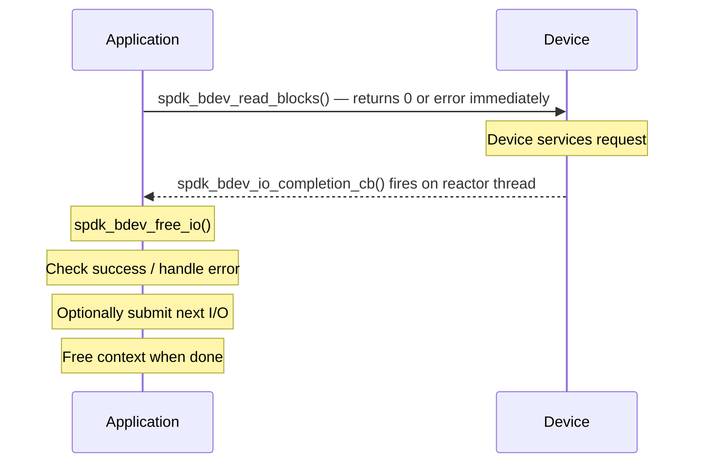

# 모듈 19: 비동기 I/O 패턴

**단계**: 2 (구현)
**난이도**: 중급
**예상 소요 시간**: 4시간
**선수 과목**: 모듈 01-18

---

## 학습 목표

이 모듈을 완료하면 다음을 할 수 있습니다:

- SPDK가 동기 호출 대신 비동기(async), 논블로킹(non-blocking) I/O 모델을 사용하는 이유를 설명할 수 있다
- `spdk_bdev_io_completion_cb` 콜백을 올바르게 구현할 수 있다
- 콜백을 무한히 중첩하지 않고 종속적인 비동기 작업을 체이닝할 수 있다
- 최대 처리량과 큐 깊이 활용을 위해 배치된 I/O를 제출할 수 있다
- 다단계 비동기 시퀀스를 통해 오류를 깔끔하게 전파할 수 있다
- 미처리 I/O가 진행 중일 때 모든 리소스를 안전하게 해제할 수 있다
- 큐 깊이(queue depth) 관리 및 흐름 제어(flow control) 패턴을 적용할 수 있다
- 가장 흔한 비동기 안티패턴을 인식하고 피할 수 있다

---

## 1. 왜 비동기인가? 기본 모델

### 1.1 블로킹의 비용

전통적인 스토리지 스택은 디바이스가 요청을 처리하는 동안 호출 스레드를 블로킹합니다:

```
Thread A:  submit → [blocked waiting] → resume → next work
Thread B:  submit → [blocked waiting] → resume → next work
```

100 µs 미만의 지연 시간과 1M+ IOPS를 처리할 수 있는 NVMe 디바이스에서, 단 하나의 I/O에 대해 스레드가 블로킹되면 수천 개의 CPU 사이클이 낭비됩니다. 더 나쁜 것은, OS 컨텍스트 전환이 전환당 1~5 µs의 추가 오버헤드를 발생시킨다는 것입니다. 대규모에서 이는 처리량을 붕괴시킵니다.

### 1.2 SPDK의 답: 폴링 + 콜백

SPDK는 I/O에서 스레드를 절대 블로킹하지 않습니다. 모든 I/O 제출은 즉시 반환됩니다. 리액터(reactor) 루프는 NVMe 큐 페어에서 완료를 폴링하고 완료 콜백을 인라인으로 호출하며, 모두 같은 스레드에서 잠금(locking) 없이 이루어집니다:

```
Reactor thread loop:
  while (running) {
      spdk_thread_poll();     /* drains completion queues   */
      /* user callbacks fire here, synchronously            */
      /* new I/Os submitted inside callbacks are safe       */
  }
```

이것은 다음을 의미합니다:
- I/O 중 컨텍스트 전환 제로
- 캐시가 핫한 데이터 경로 (같은 CPU 코어에서 전체 처리)
- 뮤텍스나 조건 변수 불필요
- 콜백은 절대 블로킹해서는 안 됨 (수면, 뮤텍스 대기, 블로킹 시스콜 금지)

### 1.3 완료 콜백 계약

bdev 비동기 I/O의 핵심 타입:

```c
/*
 * From include/spdk/bdev.h (line 169):
 *
 * typedef void (*spdk_bdev_io_completion_cb)(
 *     struct spdk_bdev_io *bdev_io,
 *     bool success,
 *     void *cb_arg);
 *
 * bdev_io  - the completed I/O object; caller MUST call spdk_bdev_free_io()
 * success  - true if the I/O completed without error
 * cb_arg   - the opaque pointer passed at submission time
 */
```

소스(`lib/bdev/bdev.c`, `_bdev_io_complete()`)에서 파생된 핵심 규칙:

1. 콜백은 I/O를 제출한 것과 같은 스레드에서 발생합니다.
2. `spdk_bdev_free_io(bdev_io)`는 콜백 내에서 정확히 한 번 호출되어야 합니다.
3. 제출 함수가 0이 아닌 값을 반환하면 콜백은 호출되지 않습니다. 콜백에 의존하지 않고 해당 오류 경로를 처리해야 합니다.
4. 콜백 내부에서 새 I/O를 제출하는 것은 안전하며 일반적입니다 -- bdev 계층은 새 제출이 무한 재귀를 유발할 경우 완료를 지연시킵니다.

---

## 2. API 레퍼런스: 주요 제출 함수

### 2.1 단일 버퍼 읽기 및 쓰기

```c
/*
 * Byte-offset variants (offset and nbytes must be block-size aligned).
 */
int spdk_bdev_read(struct spdk_bdev_desc *desc,
                   struct spdk_io_channel *ch,
                   void *buf,
                   uint64_t offset,   /* bytes */
                   uint64_t nbytes,
                   spdk_bdev_io_completion_cb cb,
                   void *cb_arg);

int spdk_bdev_write(struct spdk_bdev_desc *desc,
                    struct spdk_io_channel *ch,
                    void *buf,
                    uint64_t offset,  /* bytes */
                    uint64_t nbytes,
                    spdk_bdev_io_completion_cb cb,
                    void *cb_arg);

/*
 * Block-offset variants (preferred in new code).
 */
int spdk_bdev_read_blocks(struct spdk_bdev_desc *desc,
                          struct spdk_io_channel *ch,
                          void *buf,
                          uint64_t offset_blocks,
                          uint64_t num_blocks,
                          spdk_bdev_io_completion_cb cb,
                          void *cb_arg);

int spdk_bdev_write_blocks(struct spdk_bdev_desc *desc,
                           struct spdk_io_channel *ch,
                           void *buf,
                           uint64_t offset_blocks,
                           uint64_t num_blocks,
                           spdk_bdev_io_completion_cb cb,
                           void *cb_arg);
```

반환 값:
- `0` -- 제출됨; 콜백이 호출될 것임
- `-EINVAL` -- 잘못된 오프셋 또는 길이; 콜백이 호출되지 않음
- `-ENOMEM` -- 사용 가능한 `spdk_bdev_io` 슬롯 없음; 콜백이 호출되지 않음

### 2.2 스캐터-개더 (벡터화된) 읽기 및 쓰기

```c
int spdk_bdev_readv_blocks(struct spdk_bdev_desc *desc,
                           struct spdk_io_channel *ch,
                           struct iovec *iov,
                           int iovcnt,
                           uint64_t offset_blocks,
                           uint64_t num_blocks,
                           spdk_bdev_io_completion_cb cb,
                           void *cb_arg);

int spdk_bdev_writev_blocks(struct spdk_bdev_desc *desc,
                            struct spdk_io_channel *ch,
                            struct iovec *iov,
                            int iovcnt,
                            uint64_t offset_blocks,
                            uint64_t num_blocks,
                            spdk_bdev_io_completion_cb cb,
                            void *cb_arg);
```

데이터가 비연속적인 DMA 버퍼에 걸쳐 있을 때 벡터화된 변형을 사용하십시오 -- 예를 들어, 네트워크 패킷 헤더와 페이로드를 복사 없이 단일 NVMe 쓰기로 조립할 때.

---

## 3. 패턴 1: 단순 순차 체인

가장 일반적인 패턴: 블록을 읽고, 변환하고, 다시 씁니다.

### 3.1 컨텍스트 구조체

모든 비동기 시퀀스에는 콜백 호출 간에 상태를 전달하는 컨텍스트 구조체가 필요합니다. 스택 변수를 절대 사용하지 마십시오 -- 콜백이 발생할 때쯤이면 해당 변수를 할당한 호출 스택은 이미 오래전에 해제되었습니다.

```c
/*
 * Context for a read-modify-write sequence.
 * Allocated before the first submission, freed in the final callback.
 */
struct rmw_ctx {
    struct spdk_bdev_desc   *desc;
    struct spdk_io_channel  *ch;
    void                    *buf;           /* DMA-safe buffer          */
    uint64_t                 offset_blocks;
    uint64_t                 num_blocks;
    void                   (*done_cb)(void *arg, int status);
    void                    *done_arg;
};
```

### 3.2 전체 읽기-수정-쓰기 구현

```c
/* Forward declarations */
static void rmw_write_done(struct spdk_bdev_io *bdev_io,
                           bool success, void *arg);
static void rmw_read_done(struct spdk_bdev_io *bdev_io,
                          bool success, void *arg);

/*
 * Entry point: initiates the async read-modify-write sequence.
 * Returns 0 if the sequence was started; the caller's done_cb will
 * be invoked on completion or error.
 * Returns negative errno if startup failed (done_cb will NOT fire).
 */
int
start_rmw(struct spdk_bdev_desc *desc,
          struct spdk_io_channel *ch,
          uint64_t offset_blocks,
          uint64_t num_blocks,
          void (*done_cb)(void *arg, int status),
          void *done_arg)
{
    struct rmw_ctx *ctx;
    uint32_t block_size;
    int rc;

    ctx = calloc(1, sizeof(*ctx));
    if (!ctx) {
        return -ENOMEM;
    }

    block_size = spdk_bdev_get_block_size(spdk_bdev_desc_get_bdev(desc));

    ctx->buf = spdk_dma_malloc(num_blocks * block_size,
                               block_size,   /* alignment */
                               NULL);
    if (!ctx->buf) {
        free(ctx);
        return -ENOMEM;
    }

    ctx->desc          = desc;
    ctx->ch            = ch;
    ctx->offset_blocks = offset_blocks;
    ctx->num_blocks    = num_blocks;
    ctx->done_cb       = done_cb;
    ctx->done_arg      = done_arg;

    rc = spdk_bdev_read_blocks(desc, ch, ctx->buf,
                               offset_blocks, num_blocks,
                               rmw_read_done, ctx);
    if (rc != 0) {
        SPDK_ERRLOG("Read submission failed: %d\n", rc);
        spdk_dma_free(ctx->buf);
        free(ctx);
        return rc;
    }

    return 0;
}

/*
 * Step 1 completion: read is done.
 * Transform the data, then submit the write.
 */
static void
rmw_read_done(struct spdk_bdev_io *bdev_io, bool success, void *arg)
{
    struct rmw_ctx *ctx = arg;
    int rc;

    spdk_bdev_free_io(bdev_io);   /* always free before returning */

    if (!success) {
        SPDK_ERRLOG("Read failed at block %" PRIu64 "\n",
                    ctx->offset_blocks);
        ctx->done_cb(ctx->done_arg, -EIO);
        spdk_dma_free(ctx->buf);
        free(ctx);
        return;
    }

    /*
     * Data is in ctx->buf. Modify it in-place.
     * This is synchronous work — keep it short; the reactor is stalled
     * while this callback executes.
     */
    transform_block(ctx->buf, ctx->num_blocks);

    rc = spdk_bdev_write_blocks(ctx->desc, ctx->ch, ctx->buf,
                                ctx->offset_blocks, ctx->num_blocks,
                                rmw_write_done, ctx);
    if (rc != 0) {
        SPDK_ERRLOG("Write submission failed: %d\n", rc);
        ctx->done_cb(ctx->done_arg, rc);
        spdk_dma_free(ctx->buf);
        free(ctx);
    }
    /* On success: returns to the reactor; rmw_write_done fires later */
}

/*
 * Step 2 completion: write is done. Clean up and notify caller.
 */
static void
rmw_write_done(struct spdk_bdev_io *bdev_io, bool success, void *arg)
{
    struct rmw_ctx *ctx = arg;
    int status = success ? 0 : -EIO;

    spdk_bdev_free_io(bdev_io);

    if (!success) {
        SPDK_ERRLOG("Write failed at block %" PRIu64 "\n",
                    ctx->offset_blocks);
    }

    ctx->done_cb(ctx->done_arg, status);
    spdk_dma_free(ctx->buf);
    free(ctx);
}
```

핵심 관찰:
- `spdk_bdev_free_io()`가 모든 콜백에서 첫 번째로 실질적으로 호출됩니다.
- `rmw_read_done`에서의 제출 실패 시, 일반 오류와 같은 방식으로 정리합니다 -- 실패한 쓰기에 대한 콜백은 절대 발생하지 않습니다.
- `ctx`는 오류 경로를 포함한 모든 종료 경로에서 항상 해제됩니다.

---

## 4. 패턴 2: 팬아웃/팬인을 사용한 병렬 I/O

여러 독립적인 블록을 읽거나 써야 할 때, 모두 한 번에 제출하고 참조 카운트를 사용하여 모든 작업이 완료된 시점을 감지합니다.

### 4.1 팬아웃 컨텍스트

```c
struct parallel_ctx {
    uint32_t  total;           /* total I/Os submitted        */
    uint32_t  completed;       /* completed so far            */
    int       status;          /* first error seen, or 0      */
    void    (*done_cb)(void *arg, int status);
    void     *done_arg;
    /* Per-IO buffers are owned separately (see below) */
};

struct single_io_ctx {
    struct parallel_ctx *parent;
    void                *buf;
    uint64_t             offset_blocks;
};
```

### 4.2 구현

```c
static void
parallel_read_done(struct spdk_bdev_io *bdev_io, bool success, void *arg)
{
    struct single_io_ctx *io_ctx = arg;
    struct parallel_ctx  *pctx   = io_ctx->parent;

    spdk_bdev_free_io(bdev_io);

    if (!success && pctx->status == 0) {
        pctx->status = -EIO;   /* record first error; don't overwrite */
    }

    /* Process the buffer if no error has been seen yet */
    if (success) {
        process_block(io_ctx->buf, io_ctx->offset_blocks);
    }

    spdk_dma_free(io_ctx->buf);
    free(io_ctx);

    pctx->completed++;
    if (pctx->completed == pctx->total) {
        /* All done — fire the parent callback */
        pctx->done_cb(pctx->done_arg, pctx->status);
        free(pctx);
    }
}

int
submit_parallel_reads(struct spdk_bdev_desc *desc,
                      struct spdk_io_channel *ch,
                      uint64_t start_block,
                      uint32_t num_ios,
                      uint32_t blocks_per_io,
                      void (*done_cb)(void *arg, int status),
                      void *done_arg)
{
    struct parallel_ctx *pctx;
    uint32_t block_size;
    uint32_t i;
    int rc;

    pctx = calloc(1, sizeof(*pctx));
    if (!pctx) {
        return -ENOMEM;
    }

    pctx->total   = num_ios;
    pctx->done_cb = done_cb;
    pctx->done_arg = done_arg;

    block_size = spdk_bdev_get_block_size(spdk_bdev_desc_get_bdev(desc));

    for (i = 0; i < num_ios; i++) {
        struct single_io_ctx *io_ctx;

        io_ctx = calloc(1, sizeof(*io_ctx));
        if (!io_ctx) {
            /*
             * Partial submission: we already have (i) I/Os in flight.
             * We cannot cancel them; adjust total so the fan-in still
             * fires when those complete, then return error to caller.
             */
            if (i == 0) {
                free(pctx);
                return -ENOMEM;
            }
            pctx->status = -ENOMEM;
            pctx->total  = i;   /* only i I/Os were actually submitted */
            return -ENOMEM;
        }

        io_ctx->buf = spdk_dma_malloc(blocks_per_io * block_size,
                                      block_size, NULL);
        if (!io_ctx->buf) {
            free(io_ctx);
            if (i == 0) {
                free(pctx);
                return -ENOMEM;
            }
            pctx->status = -ENOMEM;
            pctx->total  = i;
            return -ENOMEM;
        }

        io_ctx->parent        = pctx;
        io_ctx->offset_blocks = start_block + (i * blocks_per_io);

        rc = spdk_bdev_read_blocks(desc, ch, io_ctx->buf,
                                   io_ctx->offset_blocks, blocks_per_io,
                                   parallel_read_done, io_ctx);
        if (rc != 0) {
            spdk_dma_free(io_ctx->buf);
            free(io_ctx);
            if (i == 0) {
                free(pctx);
                return rc;
            }
            pctx->status = rc;
            pctx->total  = i;
            return rc;
        }
    }

    return 0;
}
```

팬인 검사(`completed == total`)는 모든 콜백이 같은 리액터 스레드에서 발생하므로 안전합니다 -- 원자적 연산이나 잠금이 필요하지 않습니다.

---

## 5. 패턴 3: 스캐터-개더 I/O

스캐터-개더는 데이터가 메모리에서 연속적이지 않을 때 필수적입니다. 일반적인 경우:
- 네트워크 수신 버퍼를 스토리지 쓰기로 조립
- 여러 독립적인 애플리케이션 버퍼로 읽기

```c
struct sg_write_ctx {
    struct spdk_bdev_desc  *desc;
    struct spdk_io_channel *ch;
    struct iovec            iov[4];   /* up to 4 segments */
    int                     iovcnt;
    uint64_t                offset_blocks;
    uint64_t                num_blocks;
    void                  (*done_cb)(void *arg, int status);
    void                   *done_arg;
};

static void
sg_write_done(struct spdk_bdev_io *bdev_io, bool success, void *arg)
{
    struct sg_write_ctx *ctx = arg;
    int i;

    spdk_bdev_free_io(bdev_io);

    /* Free each DMA segment */
    for (i = 0; i < ctx->iovcnt; i++) {
        spdk_dma_free(ctx->iov[i].iov_base);
    }

    ctx->done_cb(ctx->done_arg, success ? 0 : -EIO);
    free(ctx);
}

int
submit_sg_write(struct spdk_bdev_desc *desc,
                struct spdk_io_channel *ch,
                void **bufs,
                size_t *lens,
                int iovcnt,
                uint64_t offset_blocks,
                uint64_t num_blocks,
                void (*done_cb)(void *arg, int status),
                void *done_arg)
{
    struct sg_write_ctx *ctx;
    int i, rc;

    if (iovcnt > 4) {
        return -EINVAL;
    }

    ctx = calloc(1, sizeof(*ctx));
    if (!ctx) {
        return -ENOMEM;
    }

    ctx->desc          = desc;
    ctx->ch            = ch;
    ctx->offset_blocks = offset_blocks;
    ctx->num_blocks    = num_blocks;
    ctx->done_cb       = done_cb;
    ctx->done_arg      = done_arg;
    ctx->iovcnt        = iovcnt;

    for (i = 0; i < iovcnt; i++) {
        ctx->iov[i].iov_base = bufs[i];
        ctx->iov[i].iov_len  = lens[i];
    }

    rc = spdk_bdev_writev_blocks(desc, ch, ctx->iov, iovcnt,
                                 offset_blocks, num_blocks,
                                 sg_write_done, ctx);
    if (rc != 0) {
        free(ctx);  /* buffers freed by caller on submission failure */
        return rc;
    }

    return 0;
}
```

---

## 6. 패턴 4: 재시도를 통한 오류 복구

일시적인 디바이스 오류(예: NVMe 상태 `ABORTED`)는 종종 재시도할 수 있습니다. 컨텍스트 구조체에 재시도 카운터를 사용합니다.

```c
#define MAX_IO_RETRIES  3

struct retrying_io_ctx {
    struct spdk_bdev_desc   *desc;
    struct spdk_io_channel  *ch;
    void                    *buf;
    uint64_t                 offset_blocks;
    uint64_t                 num_blocks;
    uint32_t                 retries;
    void                   (*done_cb)(void *arg, int status);
    void                    *done_arg;
};

/* Forward declaration */
static int submit_retrying_read(struct retrying_io_ctx *ctx);

static void
retrying_read_done(struct spdk_bdev_io *bdev_io, bool success, void *arg)
{
    struct retrying_io_ctx *ctx = arg;
    int rc;

    spdk_bdev_free_io(bdev_io);

    if (success) {
        ctx->done_cb(ctx->done_arg, 0);
        spdk_dma_free(ctx->buf);
        free(ctx);
        return;
    }

    ctx->retries++;
    if (ctx->retries >= MAX_IO_RETRIES) {
        SPDK_ERRLOG("I/O at block %" PRIu64 " failed after %u retries\n",
                    ctx->offset_blocks, MAX_IO_RETRIES);
        ctx->done_cb(ctx->done_arg, -EIO);
        spdk_dma_free(ctx->buf);
        free(ctx);
        return;
    }

    SPDK_WARNLOG("I/O at block %" PRIu64 " failed, retry %u/%u\n",
                 ctx->offset_blocks, ctx->retries, MAX_IO_RETRIES);

    rc = submit_retrying_read(ctx);
    if (rc != 0) {
        SPDK_ERRLOG("Retry submission failed: %d\n", rc);
        ctx->done_cb(ctx->done_arg, rc);
        spdk_dma_free(ctx->buf);
        free(ctx);
    }
}

static int
submit_retrying_read(struct retrying_io_ctx *ctx)
{
    return spdk_bdev_read_blocks(ctx->desc, ctx->ch, ctx->buf,
                                 ctx->offset_blocks, ctx->num_blocks,
                                 retrying_read_done, ctx);
}
```

참고: 모든 오류에 대해 재시도하지 마십시오. `spdk_bdev_io_get_nvme_status()`를 참조하여 재시도 가능한 상태 코드와 영구 장애(예: 불량 블록)를 구별하십시오.

---

## 7. 큐 깊이 관리 및 흐름 제어

### 7.1 큐 깊이가 중요한 이유

NVMe 디바이스는 많은 동시 명령이 공급될 때 최고 성능을 발휘합니다(일반적인 최적 큐 깊이: 큐당 32-128개 명령). 한 번에 하나의 I/O만 제출하면 디바이스 병렬성이 유휴 상태로 남습니다. 너무 많이 제출하면 bdev 계층의 `spdk_bdev_io` 풀이 소진되어 `-ENOMEM`이 반환됩니다.

### 7.2 흐름 제어된 제출

```c
#define TARGET_QUEUE_DEPTH  32

struct flow_ctx {
    struct spdk_bdev_desc   *desc;
    struct spdk_io_channel  *ch;
    uint64_t                 next_block;      /* next block to submit    */
    uint64_t                 total_blocks;    /* total to process        */
    uint32_t                 outstanding;     /* currently in-flight     */
    uint32_t                 block_size;
    int                      error;
    void                   (*done_cb)(void *arg, int status);
    void                    *done_arg;
};

/* Forward declaration */
static void fill_queue(struct flow_ctx *ctx);

static void
flow_read_done(struct spdk_bdev_io *bdev_io, bool success, void *arg)
{
    struct flow_ctx *ctx = arg;

    spdk_bdev_free_io(bdev_io);

    if (!success && ctx->error == 0) {
        ctx->error = -EIO;
    }

    ctx->outstanding--;

    if (ctx->outstanding == 0 && ctx->next_block >= ctx->total_blocks) {
        /* All submitted I/Os have completed */
        ctx->done_cb(ctx->done_arg, ctx->error);
        free(ctx);
        return;
    }

    /* A slot freed up; submit more work */
    fill_queue(ctx);
}

static void
fill_queue(struct flow_ctx *ctx)
{
    int rc;

    while (ctx->outstanding < TARGET_QUEUE_DEPTH &&
           ctx->next_block < ctx->total_blocks) {

        void *buf = spdk_dma_malloc(ctx->block_size, ctx->block_size, NULL);
        if (!buf) {
            /* Pool temporarily exhausted — back off until a completion
             * frees a slot and calls fill_queue() again.             */
            break;
        }

        rc = spdk_bdev_read_blocks(ctx->desc, ctx->ch, buf,
                                   ctx->next_block, 1,
                                   flow_read_done, ctx);
        if (rc == -ENOMEM) {
            /* bdev_io pool exhausted */
            spdk_dma_free(buf);
            break;
        }
        if (rc != 0) {
            spdk_dma_free(buf);
            if (ctx->error == 0) {
                ctx->error = rc;
            }
            break;
        }

        ctx->next_block++;
        ctx->outstanding++;
    }
}

int
start_flow_reads(struct spdk_bdev_desc *desc,
                 struct spdk_io_channel *ch,
                 uint64_t total_blocks,
                 void (*done_cb)(void *arg, int status),
                 void *done_arg)
{
    struct flow_ctx *ctx;

    ctx = calloc(1, sizeof(*ctx));
    if (!ctx) {
        return -ENOMEM;
    }

    ctx->desc         = desc;
    ctx->ch           = ch;
    ctx->total_blocks = total_blocks;
    ctx->next_block   = 0;
    ctx->outstanding  = 0;
    ctx->block_size   = spdk_bdev_get_block_size(
                            spdk_bdev_desc_get_bdev(desc));
    ctx->done_cb      = done_cb;
    ctx->done_arg     = done_arg;

    fill_queue(ctx);

    if (ctx->outstanding == 0) {
        /* Nothing started */
        int err = ctx->error ? ctx->error : -ENOMEM;
        free(ctx);
        return err;
    }

    return 0;
}
```

`fill_queue()`는 시작 시와 각 완료 콜백 내부에서 모두 호출됩니다. 이는 풀을 오버플로우하지 않으면서 디바이스를 `TARGET_QUEUE_DEPTH`로 유지합니다.

---

## 8. 미처리 I/O가 있는 상태에서의 리소스 정리

### 8.1 문제

I/O가 진행 중인 동안에는 디스크립터나 I/O 채널을 해제할 수 없습니다. 이를 시도하면 SPDK 내부 상태가 손상되어 보통 크래시나 조용한 데이터 손상이 발생합니다.

### 8.2 드레인 패턴

"드레이닝" 플래그와 I/O 카운터를 사용하여 리소스 해제를 지연시킵니다:

```c
struct bdev_session {
    struct spdk_bdev_desc   *desc;
    struct spdk_io_channel  *ch;
    uint32_t                 io_count;    /* I/Os currently in flight */
    bool                     draining;    /* true: no new I/Os        */
    void                   (*close_cb)(void *arg);
    void                    *close_arg;
};

static void
session_io_done(struct spdk_bdev_io *bdev_io, bool success, void *arg)
{
    struct bdev_session *sess = arg;

    spdk_bdev_free_io(bdev_io);

    sess->io_count--;

    if (sess->draining && sess->io_count == 0) {
        /* All I/O drained. Safe to release resources now. */
        spdk_put_io_channel(sess->ch);
        spdk_bdev_close(sess->desc);
        sess->close_cb(sess->close_arg);
        free(sess);
    }
}

/*
 * Call this when you want to close the session.
 * If I/O is in flight, release is deferred until all I/O completes.
 */
void
bdev_session_close(struct bdev_session *sess,
                   void (*close_cb)(void *arg),
                   void *close_arg)
{
    sess->draining   = true;
    sess->close_cb   = close_cb;
    sess->close_arg  = close_arg;

    if (sess->io_count == 0) {
        spdk_put_io_channel(sess->ch);
        spdk_bdev_close(sess->desc);
        close_cb(close_arg);
        free(sess);
    }
    /* Otherwise: last in-flight I/O's callback will close */
}

/*
 * Internal: submit a session I/O (increments io_count before submitting).
 */
static int
session_submit_read(struct bdev_session *sess, void *buf,
                    uint64_t offset_blocks, uint64_t num_blocks)
{
    int rc;

    if (sess->draining) {
        return -ESHUTDOWN;
    }

    sess->io_count++;
    rc = spdk_bdev_read_blocks(sess->desc, sess->ch, buf,
                               offset_blocks, num_blocks,
                               session_io_done, sess);
    if (rc != 0) {
        sess->io_count--;
    }

    return rc;
}
```

---

## 9. 비동기 컨텍스트에서의 오류 전파

### 9.1 두 가지 오류 카테고리

| 카테고리 | 발생 시점 | 콜백 발생 여부 |
|---|---|---|
| 제출 오류 | `spdk_bdev_*()` 가 0이 아닌 값을 반환할 때 | 아니오 |
| 완료 오류 | 콜백에서 `success == false`일 때 | 예 (`success=false`로) |

### 9.2 확장된 오류 정보

`success`가 false일 때 NVMe 수준 상태 코드를 조회할 수 있습니다:

```c
static void
error_aware_cb(struct spdk_bdev_io *bdev_io, bool success, void *arg)
{
    if (!success) {
        uint32_t cdw0;
        int sct, sc;

        spdk_bdev_io_get_nvme_status(bdev_io, &cdw0, &sct, &sc);
        SPDK_ERRLOG("NVMe error: sct=%d sc=0x%02x\n", sct, sc);

        /*
         * sct == SPDK_NVME_SCT_GENERIC && sc == SPDK_NVME_SC_ABORTED_BY_REQUEST
         * → retryable
         *
         * sct == SPDK_NVME_SCT_MEDIA_ERROR
         * → permanent; do not retry
         */
    }

    spdk_bdev_free_io(bdev_io);
}
```

### 9.3 체인을 통한 오류 전파

다단계 체인에서 초기 실패는 나머지 단계를 단축(short-circuit)시켜야 합니다:

```c
static void
step2_cb(struct spdk_bdev_io *bdev_io, bool success, void *arg)
{
    struct chain_ctx *ctx = arg;

    spdk_bdev_free_io(bdev_io);

    /* Always call done with the right status; let caller decide policy */
    ctx->done_cb(ctx->done_arg, success ? 0 : -EIO);
    cleanup_chain_ctx(ctx);
}

static void
step1_cb(struct spdk_bdev_io *bdev_io, bool success, void *arg)
{
    struct chain_ctx *ctx = arg;
    int rc;

    spdk_bdev_free_io(bdev_io);

    if (!success) {
        /* Short-circuit: skip step 2, propagate error immediately */
        ctx->done_cb(ctx->done_arg, -EIO);
        cleanup_chain_ctx(ctx);
        return;
    }

    rc = spdk_bdev_write_blocks(ctx->desc, ctx->ch, ctx->buf,
                                ctx->offset, ctx->num_blocks,
                                step2_cb, ctx);
    if (rc != 0) {
        ctx->done_cb(ctx->done_arg, rc);
        cleanup_chain_ctx(ctx);
    }
}
```

---

## 10. 피해야 할 안티패턴

### 10.1 콜백 내부에서 블로킹

```c
/* WRONG: never block in a callback */
static void
bad_callback(struct spdk_bdev_io *bdev_io, bool success, void *arg)
{
    spdk_bdev_free_io(bdev_io);
    sleep(1);                       /* blocks the reactor */
    pthread_mutex_lock(&g_lock);    /* may block if another thread holds it */
    write(fd, buf, len);            /* syscall; can block */
}

/* RIGHT: schedule deferred work via spdk_thread_send_msg() if needed,
 * or restructure to avoid blocking entirely.                          */
```

### 10.2 bdev_io 해제를 잊음

```c
/* WRONG: leaks a bdev_io slot; pool exhaustion will occur over time */
static void
leaking_callback(struct spdk_bdev_io *bdev_io, bool success, void *arg)
{
    if (!success) {
        return;   /* bdev_io not freed! */
    }
    spdk_bdev_free_io(bdev_io);
}

/* RIGHT: free on every path */
static void
correct_callback(struct spdk_bdev_io *bdev_io, bool success, void *arg)
{
    spdk_bdev_free_io(bdev_io);   /* first line, always */

    if (!success) {
        handle_error(arg);
        return;
    }
    handle_success(arg);
}
```

### 10.3 DMA에 스택 버퍼 사용

```c
/* WRONG: stack memory is not DMA-safe */
static void
bad_submit(struct spdk_bdev_desc *desc, struct spdk_io_channel *ch)
{
    char buf[4096];   /* stack allocation */
    spdk_bdev_read_blocks(desc, ch, buf, 0, 1, my_cb, NULL);
}

/* RIGHT: always use spdk_dma_malloc() */
static void
correct_submit(struct spdk_bdev_desc *desc, struct spdk_io_channel *ch)
{
    void *buf = spdk_dma_malloc(4096, 4096, NULL);
    if (!buf) { return; }
    spdk_bdev_read_blocks(desc, ch, buf, 0, 1, my_cb, buf);
}
```

### 10.4 제출 반환 값 무시

```c
/* WRONG: if rc != 0, the callback will never fire */
static void
bad_submit_call(struct spdk_bdev_desc *desc, struct spdk_io_channel *ch,
                void *buf)
{
    spdk_bdev_read_blocks(desc, ch, buf, 0, 1, my_cb, NULL);
    /* no check on return value */
}

/* RIGHT: always check */
static int
correct_submit_call(struct spdk_bdev_desc *desc, struct spdk_io_channel *ch,
                    void *buf)
{
    int rc = spdk_bdev_read_blocks(desc, ch, buf, 0, 1, my_cb, NULL);
    if (rc != 0) {
        SPDK_ERRLOG("Submission failed: %d\n", rc);
        spdk_dma_free(buf);
    }
    return rc;
}
```

### 10.5 해제 후 컨텍스트 접근

```c
/* WRONG: ctx used after free */
static void
use_after_free_cb(struct spdk_bdev_io *bdev_io, bool success, void *arg)
{
    struct my_ctx *ctx = arg;
    spdk_bdev_free_io(bdev_io);
    ctx->done_cb(ctx->done_arg, 0);
    free(ctx);
    SPDK_NOTICELOG("Done: offset=%" PRIu64 "\n", ctx->offset);  /* UAF! */
}

/* RIGHT: read what you need before freeing */
static void
correct_free_cb(struct spdk_bdev_io *bdev_io, bool success, void *arg)
{
    struct my_ctx *ctx = arg;
    void (*done_cb)(void *, int) = ctx->done_cb;
    void *done_arg               = ctx->done_arg;

    spdk_bdev_free_io(bdev_io);
    free(ctx);
    done_cb(done_arg, 0);
}
```

---

## 11. 요약

### 핵심 규칙

| 규칙 | 이유 |
|---|---|
| 모든 콜백에서 첫 번째 작업으로 `spdk_bdev_free_io()`를 호출할 것 | 슬롯은 유한함; 누수는 -ENOMEM을 유발 |
| 모든 제출 호출의 반환 값을 확인할 것 | 0이 아닌 값은 콜백이 발생하지 않음을 의미 |
| 콜백에서 절대 블로킹하지 말 것 | 반환할 때까지 리액터 스레드가 정지됨 |
| 모든 I/O 버퍼에 `spdk_dma_malloc()`을 사용할 것 | 스택 및 힙 메모리는 DMA 안전하지 않을 수 있음 |
| 모든 상태를 힙 할당된 컨텍스트 구조체에 보관할 것 | 콜백이 발생할 때쯤 제출 시의 스택 프레임은 사라짐 |
| 제출 전에 `io_count`를 증가시키고 콜백에서 감소시킬 것 | 종료 시 올바른 드레인 로직을 가능하게 함 |
| `outstanding <= queue_depth`를 유지하고 -ENOMEM을 우아하게 처리할 것 | 디바이스 큐와 풀은 제한됨 |

### 비동기 I/O 생명주기



---

## 12. 실습 과제

### 과제 1: 3단계 순차 체인

다음을 수행하는 `copy_and_verify()` 함수를 구현하십시오:
1. 소스 오프셋 A에서 N 블록을 읽기
2. 같은 데이터를 목적지 오프셋 B에 쓰기
3. B에서 다시 읽어 원본 버퍼와 비교

세 단계 모두 비동기적으로 체이닝되어야 합니다. 호출자는 성공 시 `status == 0` 또는 실패 시 음수 errno로 단일 `done_cb`를 수신합니다.

힌트: 컨텍스트 구조체에 원본 버퍼(비교용)와 다시 읽기를 위한 두 번째 버퍼가 모두 필요합니다.

### 과제 2: 쓰로틀된 병렬 쓰기

1024개 블록을 순차적으로 쓰되 동시에 최대 16개의 쓰기만 진행 중이도록 하는 `throttled_write_all()`을 구현하십시오. 256 블록이 완료될 때마다 로그 메시지를 출력하십시오.

힌트: 섹션 7의 흐름 제어 패턴에서 `TARGET_QUEUE_DEPTH = 16`을 사용하십시오.

### 과제 3: 시그널에 의한 정상 드레인

지속적으로 읽기 I/O를 제출하는 실행 중인 세션이 주어졌을 때, `draining` 플래그를 설정하고 모든 진행 중인 I/O가 완료되고 모든 DMA 버퍼가 해제된 후 정확히 한 번 `shutdown_complete_cb()`가 호출되도록 하는 `signal_shutdown()`을 구현하십시오.

### 과제 4: 오류 분류

섹션 6의 재시도 패턴을 확장하여 NVMe 상태 코드가 중단된 명령(`SPDK_NVME_SCT_GENERIC` + `SPDK_NVME_SC_ABORTED_BY_REQUEST`)을 나타낼 때만 재시도하고, 미디어 오류(`SPDK_NVME_SCT_MEDIA_ERROR`)에 대해서는 즉시 실패하도록 하십시오.

---

## 참조

- `include/spdk/bdev.h` -- 전체 API: `spdk_bdev_io_completion_cb`, `spdk_bdev_read_blocks`,
  `spdk_bdev_write_blocks`, `spdk_bdev_readv_blocks`, `spdk_bdev_writev_blocks`,
  `spdk_bdev_free_io`, `spdk_bdev_io_get_nvme_status`
- `lib/bdev/bdev.c` -- 내부 완료 흐름: `bdev_io_complete()`, `_bdev_io_complete()`,
  `bdev_io_complete_unsubmitted()`
- `test/unit/lib/bdev/` -- 모의(mock) 콜백 와이어링을 보여주는 유닛 테스트 패턴
- 모듈 13 (Bdev 계층) -- 디스크립터 및 채널 생명주기
- 모듈 05 (메모리 관리) -- `spdk_dma_malloc` 및 DMA 안전 요구사항
- 모듈 04 (스레딩 모델) -- 리액터 루프 및 블로킹이 금지된 이유
