# 모듈 20: NVMe-oF 타겟 아키텍처

**단계**: 3 - 마스터리
**선수 과목**: 모듈 1-19 (SPDK 기초, bdev 계층, 스레딩 모델)
**예상 소요 시간**: 4-5시간

---

## 목차

1. [NVMe-oF 프로토콜 개요](#1-nvme-of-프로토콜-개요)
2. [SPDK NVMe-oF 타겟 아키텍처](#2-spdk-nvme-of-타겟-아키텍처)
3. [트랜스포트 추상화 계층](#3-트랜스포트-추상화-계층)
4. [RDMA 트랜스포트 내부 구조](#4-rdma-트랜스포트-내부-구조)
5. [TCP 트랜스포트 내부 구조](#5-tcp-트랜스포트-내부-구조)
6. [FC 트랜스포트 개요](#6-fc-트랜스포트-개요)
7. [연결 생명주기 및 관리](#7-연결-생명주기-및-관리)
8. [네임스페이스 공유 및 멀티패스](#8-네임스페이스-공유-및-멀티패스)
9. [디스커버리 서비스 구현](#9-디스커버리-서비스-구현)
10. [JSON-RPC를 통한 구성](#10-json-rpc를-통한-구성)
11. [성능 튜닝](#11-성능-튜닝)
12. [핵심 정리](#12-핵심-정리)
13. [실습](#13-실습)
14. [참고 자료](#14-참고-자료)

---

## 1. NVMe-oF 프로토콜 개요

### 1.1 패브릭을 통한 NVMe(NVMe over Fabrics)란?

패브릭을 통한 NVMe(NVMe over Fabrics, NVMe-oF)는 NVMe 프로토콜을 PCIe 너머로 확장하여 NVMe 명령을 네트워크 패브릭(RDMA(RoCE, iWARP, InfiniBand), TCP, 파이버 채널)을 통해 전송할 수 있게 합니다. NVMe-oF 사양(NVM Express, Inc.에서 발행)은 NVMe 명령과 데이터가 이러한 패브릭을 통해 어떻게 캡슐화되고 전송되는지를 정의합니다.

핵심적인 개념은 NVMe 명령 세트가 종단 간(end-to-end) 보존된다는 것입니다. 이니시에이터(Initiator)는 로컬 PCIe를 통해 전송하는 것과 동일한 NVMe Read/Write/Admin 명령을 패브릭을 통해 전송합니다. 타겟은 이러한 명령을 언패킹하고 실제 스토리지에 대해 실행한 후, NVMe 완료 응답을 반환합니다.

**NVMe-oF가 SPDK에서 중요한 이유**:
- SPDK는 폴 모드(poll-mode), 제로 카피(zero-copy), 고처리량 I/O를 위해 설계됨
- NVMe-oF를 통해 SPDK가 분리형 스토리지(disaggregated storage)를 위한 고성능 스토리지 타겟 역할 수행
- 단일 SPDK 타겟이 100마이크로초 미만의 지연 시간으로 수백 개의 이니시에이터에 서비스 가능

### 1.2 프로토콜 계층 구조

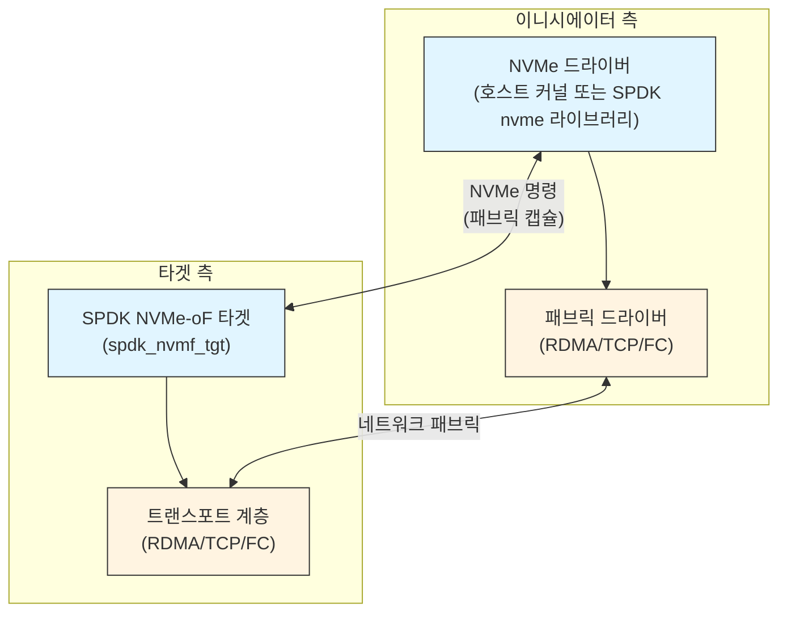

### 1.3 NVMe-oF 패브릭 명령

NVMe-oF 사양은 새로운 명령 유형인 **패브릭 명령(Fabric Commands)**(opcode 0x7F)을 추가합니다. 이 명령은 연결 관리에 사용되며 일반 NVMe 명령과 구별됩니다:

| 패브릭 명령 | 목적 |
|------------|------|
| `Connect` | 관리 또는 I/O 큐 페어 설정 |
| `Property Get` | 타겟 컨트롤러 속성 읽기 |
| `Property Set` | 타겟 컨트롤러 속성 쓰기 |
| `Auth Send` | DH-HMAC-CHAP 인증 데이터 전송 |
| `Auth Recv` | DH-HMAC-CHAP 인증 데이터 수신 |
| `Disconnect` | 큐 페어 해제 |

### 1.4 큐 페어와 컨트롤러

NVMe-oF는 NVMe 큐 모델을 유지합니다:
- 타겟에 대한 각 연결은 **큐 페어(Queue Pair, QP)**를 설정합니다: 하나의 제출 큐(submission queue)와 하나의 완료 큐(completion queue).
- 첫 번째 QP는 항상 **관리 큐(Admin Queue)**(QID=0)입니다. 컨트롤러 수준의 명령(Identify, Get Log Page, Set Features 등)을 처리합니다.
- 이후의 QP는 **I/O 큐**입니다. 각각 데이터 읽기/쓰기 명령을 전달합니다.
- 같은 호스트에서 같은 서브시스템으로 연결하는 모든 QP는 하나의 **컨트롤러**(가상 NVMe 컨트롤러)로 그룹화됩니다.

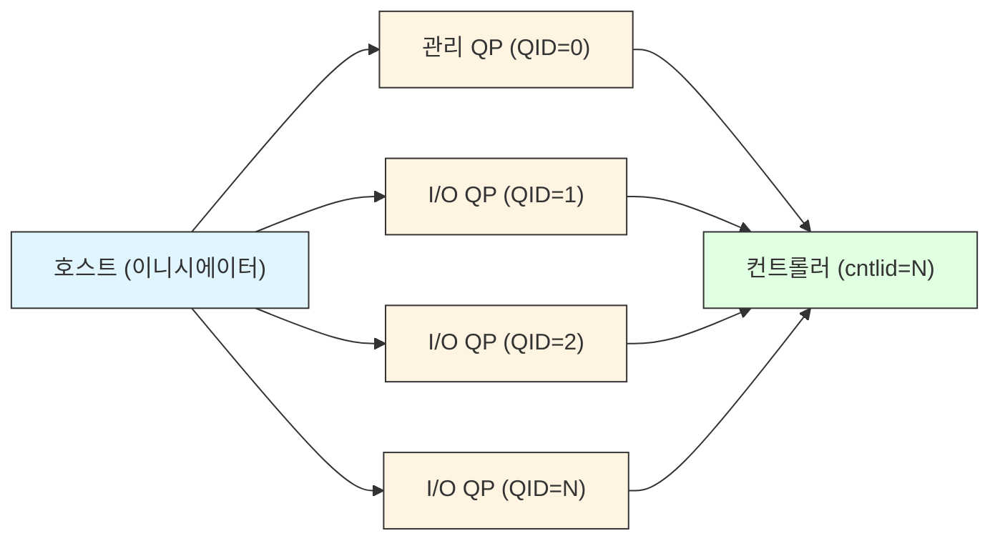

### 1.5 NQN - NVMe 정규화 이름

모든 서브시스템과 호스트는 **NQN(NVMe Qualified Name)**으로 식별됩니다:

```
nqn.2014-08.org.nvmexpress:uuid:<UUID>          # 표준 호스트 NQN
nqn.2016-06.io.spdk:<name>                      # SPDK 서브시스템 NQN
nqn.2014-08.org.nvmexpress.discovery            # 잘 알려진 디스커버리 NQN
```

NQN은 Connect 명령 중에 어떤 서브시스템과 어떤 호스트가 연결하는지 식별하는 데 사용됩니다. 접근 제어는 호스트 NQN 매칭을 통해 적용됩니다.

---

## 2. SPDK NVMe-oF 타겟 아키텍처

### 2.1 최상위 구조

```
spdk_nvmf_tgt
  ├── name (예: "nvmf_tgt")
  ├── max_subsystems
  ├── discovery_genctr (디스커버리 로그 세대 카운터)
  ├── subsystems (레드-블랙 트리, 서브시스템 ID로 인덱싱)
  ├── transports (TAILQ: RDMA, TCP, FC 인스턴스)
  ├── poll_groups (리액터 스레드당 하나)
  └── referrals (분산 디스커버리용)
```

타겟 구조체(`lib/nvmf/nvmf_internal.h`의 `struct spdk_nvmf_tgt`)는 루트 객체입니다. 모든 서브시스템, 트랜스포트, 폴 그룹이 타겟에 연결됩니다.

### 2.2 서브시스템

**서브시스템**(`struct spdk_nvmf_subsystem`)은 논리적 NVMe 스토리지 타겟을 나타냅니다. 구성 요소:
- 고유하게 식별하는 NQN
- **네임스페이스** 세트 (bdev 매핑)
- **리스너** 세트 (트랜스포트 + 주소 조합)
- **허용 호스트** 목록 (접근 제어)

```c
// include/spdk/nvmf.h - 서브시스템 생성
struct spdk_nvmf_subsystem *spdk_nvmf_subsystem_create(
    struct spdk_nvmf_tgt *tgt,
    const char *nqn,
    enum spdk_nvmf_subtype type,    // NVME 또는 DISCOVERY
    uint32_t num_ns);               // 초기 네임스페이스 수
```

서브시스템 상태 (`lib/nvmf/nvmf_internal.h`):

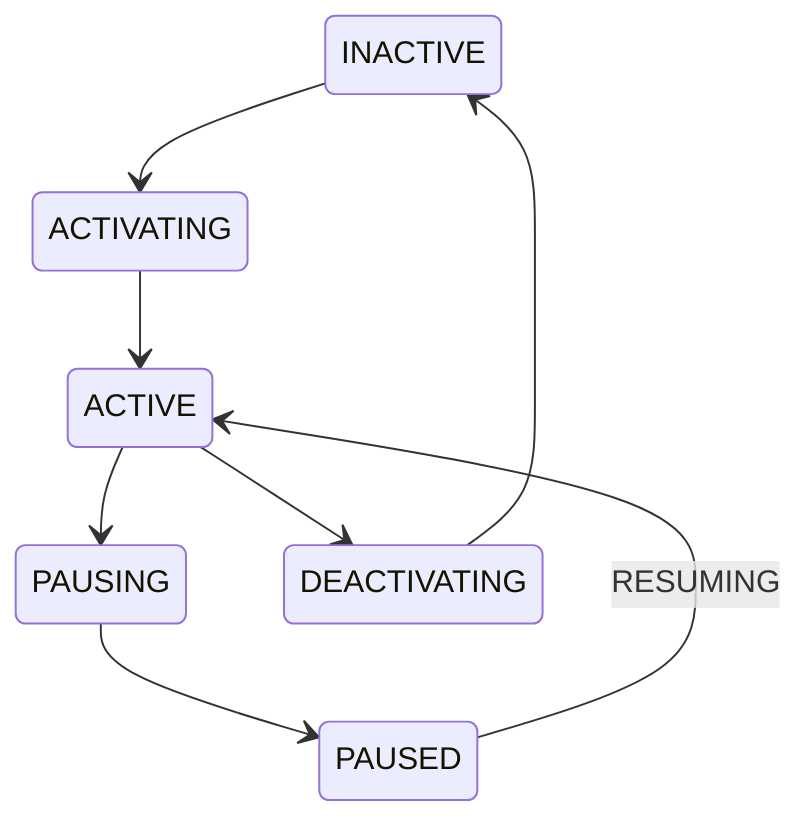

상태 전환은 명시적이고 비동기적입니다. 네임스페이스나 리스너 목록을 수정하기 전에 서브시스템을 일시 정지해야 합니다. 이를 통해 진행 중인 I/O와의 경쟁 상태를 방지합니다.

### 2.3 네임스페이스

**네임스페이스**는 NSID(1부터 시작하는 정수)를 bdev에 매핑합니다:

```c
struct spdk_nvmf_ns_opts {
    uint32_t nsid;          // 0 = 자동 할당
    struct spdk_uuid uuid;
    uint32_t nguid[2];      // 네임스페이스 GUID
    uint32_t eui64[2];      // IEEE EUI-64
    uint32_t anagrpid;      // ANA 그룹 ID
    bool     no_auto_visible; // 명시적으로 허용되지 않은 호스트에게 숨김
};

// 네임스페이스 추가
int spdk_nvmf_subsystem_add_ns_ext(
    struct spdk_nvmf_subsystem *subsystem,
    const char *bdev_name,
    const struct spdk_nvmf_ns_opts *opts,
    size_t opts_size,
    const char *ptpl_file);  // 전원 손실 시 영구 예약 파일
```

네임스페이스 계층은 NVMe LBA 연산을 bdev I/O로 변환합니다. 다음을 처리합니다:
- LBA에서 bdev 오프셋으로의 변환
- NVMe 메타데이터 (DIF/DIX 보호 정보)
- 예약 처리 (NVMe를 통한 SCSI 스타일 영구 예약)
- ANA(비대칭 네임스페이스 접근, Asymmetric Namespace Access) 상태 보고

### 2.4 리스너

**리스너**는 서브시스템이 연결을 수락하는 (트랜스포트 유형, IP 주소, 포트) 튜플입니다:

```c
// 서브시스템에 리스너 추가
int spdk_nvmf_subsystem_add_listener(
    struct spdk_nvmf_subsystem *subsystem,
    struct spdk_nvme_transport_id *trid,
    spdk_nvmf_tgt_subsystem_listen_done_fn cb_fn,
    void *cb_arg);
```

하나의 서브시스템에 여러 트랜스포트와 주소에 걸쳐 여러 리스너를 둘 수 있습니다. 하나의 리스너(트랜스포트 엔드포인트)가 여러 서브시스템을 서비스할 수 있습니다.

### 2.5 아키텍처 다이어그램

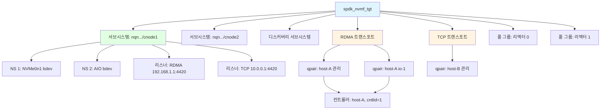

### 2.6 폴 그룹

각 리액터 스레드는 **폴 그룹**(`struct spdk_nvmf_poll_group`)을 가집니다. 새 큐 페어가 연결되면 폴 그룹에 할당됩니다. 그 폴 그룹의 리액터가 이후 모든 폴링에서 해당 qpair를 소유합니다.

폴 그룹별 추적 통계 (`include/spdk/nvmf.h`):

```c
struct spdk_nvmf_poll_group_stat {
    uint32_t admin_qpairs;          // 누적 관리 qpair 수
    uint32_t io_qpairs;             // 누적 I/O qpair 수
    uint32_t current_admin_qpairs;  // 현재 활성 관리 qpair 수
    uint32_t current_io_qpairs;     // 현재 활성 I/O qpair 수
    uint64_t pending_bdev_io;       // bdev 대기 중인 I/O
    uint64_t completed_nvme_io;     // 완료된 I/O 명령
};
```

---

## 3. 트랜스포트 추상화 계층

### 3.1 설계 철학

SPDK의 트랜스포트 추상화(`lib/nvmf/transport.c`, `include/spdk/nvmf_transport.h`)를 통해 핵심 NVMe-oF 타겟 코드를 수정하지 않고 새로운 패브릭 트랜스포트를 플러그인으로 추가할 수 있습니다. 각 트랜스포트는 일련의 연산 콜백을 등록합니다.

### 3.2 트랜스포트 연산 구조체

핵심 인터페이스는 `include/spdk/nvmf_transport.h`에 정의된 `struct spdk_nvmf_transport_ops`입니다. 각 트랜스포트는 다음 콜백을 구현해야 합니다:

```c
struct spdk_nvmf_transport_ops {
    const char *name;                   // "RDMA", "TCP", "FC"
    enum spdk_nvme_transport_type type; // SPDK_NVME_TRANSPORT_RDMA 등

    // 트랜스포트 생명주기
    struct spdk_nvmf_transport *(*create)(struct spdk_nvmf_transport_opts *opts);
    int (*destroy)(struct spdk_nvmf_transport *transport, ...);

    // 리스너 관리
    int (*listen)(struct spdk_nvmf_transport *transport,
                  const struct spdk_nvme_transport_id *trid,
                  struct spdk_nvmf_listen_opts *opts);
    void (*stop_listen)(struct spdk_nvmf_transport *transport,
                        const struct spdk_nvme_transport_id *trid);
    void (*accept)(struct spdk_nvmf_transport *transport, ...);

    // 폴 그룹 관리 (리액터별)
    struct spdk_nvmf_transport_poll_group *(*poll_group_create)(
        struct spdk_nvmf_transport *transport,
        struct spdk_nvmf_poll_group *group);
    int (*poll_group_destroy)(struct spdk_nvmf_transport_poll_group *group);
    int (*poll_group_add)(struct spdk_nvmf_transport_poll_group *group,
                          struct spdk_nvmf_qpair *qpair);
    int (*poll_group_remove)(struct spdk_nvmf_transport_poll_group *group,
                             struct spdk_nvmf_qpair *qpair);
    int (*poll_group_poll)(struct spdk_nvmf_transport_poll_group *group);

    // 큐 페어 연산
    void (*qpair_fini)(struct spdk_nvmf_qpair *qpair, ...);
    int (*qpair_get_peer_trid)(struct spdk_nvmf_qpair *qpair,
                               struct spdk_nvme_transport_id *trid);
    int (*qpair_get_local_trid)(struct spdk_nvmf_qpair *qpair,
                                struct spdk_nvme_transport_id *trid);

    // 요청 완료
    int (*req_complete)(struct spdk_nvmf_request *req);
    void (*req_free)(struct spdk_nvmf_request *req);
};
```

### 3.3 트랜스포트 등록

트랜스포트는 시작 시 다음을 사용하여 스스로를 등록합니다:

```c
void spdk_nvmf_transport_register(const struct spdk_nvmf_transport_ops *ops);
```

`lib/nvmf/transport.c`에서 레지스트리는 단순한 연결 리스트입니다:

```c
TAILQ_HEAD(nvmf_transport_ops_list, nvmf_transport_ops_list_element)
g_spdk_nvmf_transport_ops = TAILQ_HEAD_INITIALIZER(g_spdk_nvmf_transport_ops);
```

`rdma.c`와 `tcp.c` 하단에서 각 트랜스포트가 ops 구조체를 내보냅니다:

```c
// rdma.c에서
const struct spdk_nvmf_transport_ops spdk_nvmf_transport_rdma;

// tcp.c에서
const struct spdk_nvmf_transport_ops spdk_nvmf_transport_tcp;
```

### 3.4 트랜스포트 계층의 요청 생명주기

들어오는 모든 NVMe-oF 명령은 `struct spdk_nvmf_request`가 됩니다:

```c
struct spdk_nvmf_request {
    struct spdk_nvmf_qpair  *qpair;     // 어떤 큐 페어인지
    uint32_t                 length;    // 데이터 길이
    uint8_t                  xfer;      // H2C, C2H, 또는 BIDIRECTIONAL
    union nvmf_h2c_msg      *cmd;       // 명령 캡슐 (64바이트)
    union nvmf_c2h_msg      *rsp;       // 응답 (16바이트)
    struct iovec             iov[...];  // 데이터 스캐터-개더 리스트
    struct spdk_memory_domain *memory_domain; // 제로 카피/DMA용
    struct spdk_accel_sequence *accel_sequence; // 암호화/CRC 오프로드용
    enum spdk_nvmf_zcopy_phase zcopy_phase;     // 제로 카피 상태
    // ...
};
```

명령과 응답 유니온은 원시 NVMe-oF 와이어 형식을 담고 있습니다:

```c
union nvmf_h2c_msg {
    struct spdk_nvmf_capsule_cmd     nvmf_cmd;     // 일반 NVMe-oF
    struct spdk_nvme_cmd             nvme_cmd;     // 표준 NVMe
    struct spdk_nvmf_fabric_connect_cmd connect_cmd; // Connect 패브릭 명령
    struct spdk_nvmf_fabric_prop_set_cmd prop_set_cmd;
    struct spdk_nvmf_fabric_prop_get_cmd prop_get_cmd;
    // ...
};
```

### 3.5 버퍼 관리

SPDK NVMe-oF는 데이터 버퍼에 **iobuf** 하위 시스템을 사용합니다. 요청별 버퍼를 할당하는 대신 공유 풀에서 버퍼를 가져옵니다:

```c
// 풀을 제어하는 트랜스포트 옵션 필드
struct spdk_nvmf_transport_opts {
    uint32_t num_shared_buffers;    // 공유 풀 크기
    uint32_t buf_cache_size;        // 스레드별 캐시 크기
    uint32_t in_capsule_data_size;  // 명령 캡슐 자체에 포함 가능한 최대 데이터
    uint32_t io_unit_size;          // 각 버퍼 유닛의 크기
    uint32_t max_io_size;           // 최대 총 I/O 크기 (MDTS 설정)
    bool     zcopy;                 // bdev가 지원할 경우 제로 카피 사용
    // ...
};
```

`in_capsule_data_size`가 전체 쓰기 페이로드를 담을 수 있을 만큼 충분히 크면 별도의 버퍼 할당이 필요 없습니다: 데이터가 캡슐 안에 인라인으로 도착합니다.

---

## 4. RDMA 트랜스포트 내부 구조

### 4.1 NVMe-oF 관련 RDMA 개념

RDMA(원격 직접 메모리 접근, Remote Direct Memory Access)는 타겟 CPU의 개입 없이 원격 호스트가 타겟 메모리에서 읽거나 타겟 메모리에 쓸 수 있게 합니다:

- **RDMA READ**: 이니시에이터가 타겟 메모리에서 직접 데이터 읽기
- **RDMA WRITE**: 이니시에이터가 타겟 메모리에 직접 데이터 쓰기
- **Send/Receive**: 명령 및 응답 캡슐에 사용
- **메모리 등록(Memory Registration, MR)**: RDMA 연산에 사용할 수 있는 고정된 메모리 영역
- **큐 페어(Queue Pair, QP)**: 기본 RDMA 통신 엔드포인트
- **완료 큐(Completion Queue, CQ)**: RDMA 연산 완료가 보고되는 곳
- **작업 요청(Work Request, WR)**: RDMA 연산을 트리거하기 위해 QP에 제출하는 디스크립터
- **스캐터-개더 엔트리(Scatter-Gather Entry, SGE)**: WR 내의 (addr, length, lkey) 튜플

### 4.2 RDMA 트랜스포트 기본값

`lib/nvmf/rdma.c`에서:

```c
#define NVMF_DEFAULT_TX_SGE      SPDK_NVMF_MAX_SGL_ENTRIES  // 16
#define NVMF_DEFAULT_RSP_SGE     1
#define NVMF_DEFAULT_RX_SGE      2
#define NVMF_DEFAULT_MSDBD       16   // I/O당 최대 SGL 디스크립터
#define DEFAULT_NVMF_RDMA_CQ_SIZE   4096
// QP당 작업 요청 = queue_depth * 3 + 2
#define MAX_WR_PER_QP(queue_depth)  (queue_depth * 3 + 2)
```

`3x` 배수는 각 I/O 요청에 다음이 필요할 수 있기 때문입니다:
1. 하나의 Receive WR (캡슐/명령용)
2. 하나의 RDMA READ 또는 WRITE WR (데이터용)
3. 하나의 Send WR (완료 응답용)

### 4.3 RDMA 요청 상태 머신

RDMA 트랜스포트는 각 요청에 대해 명시적 상태 머신을 사용합니다:

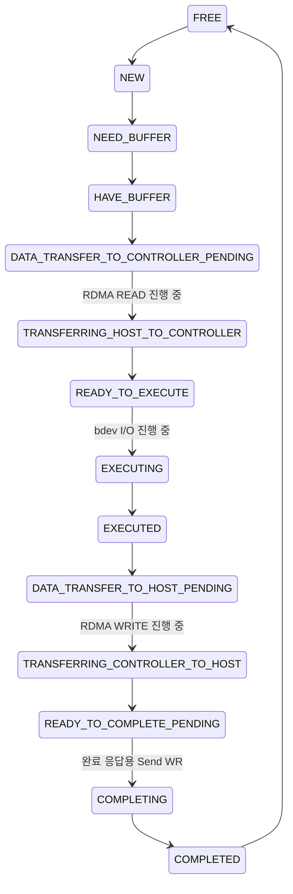

### 4.4 메모리 등록 전략

RDMA가 작동하려면 모든 데이터 버퍼가 **메모리 등록**(고정 및 lkey/rkey 쌍 부여)되어야 합니다. SPDK는 이를 I/O마다가 아닌 버퍼 풀 생성 시에 수행합니다:

```
시작 시:
  spdk_dma_malloc() → 연속 휴즈 페이지 메모리
  ibv_reg_mr()      → RDMA 디바이스에 등록
  lkey/rkey 저장    → I/O 시 WR SGE에 사용

I/O별 (할당 없음, 등록 없음):
  풀에서 버퍼 선택
  저장된 lkey로 WR 구성
  QP에 WR 게시
```

이는 I/O마다 메모리를 등록할 수 있는 커널 RDMA 스택에 비해 핵심적인 성능 이점입니다.

### 4.5 RDMA 트랜스포트 데이터 흐름 (읽기 I/O)

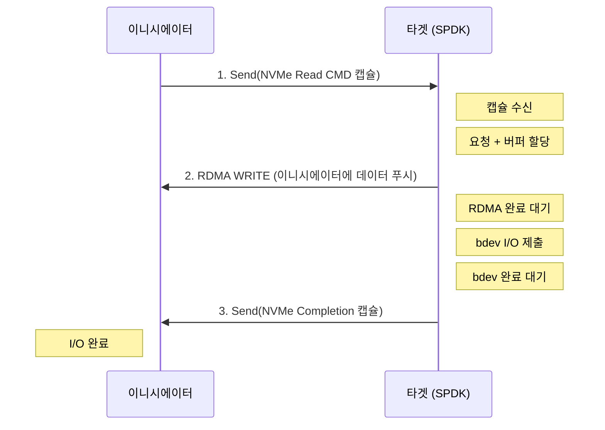

### 4.6 InfiniBand, RoCE, iWARP

SPDK의 RDMA 트랜스포트는 `spdk_internal/rdma_provider.h` 추상화를 통해 여러 RDMA 프로바이더를 지원합니다:

- **InfiniBand**: 네이티브 RDMA, 무손실 패브릭, IB 스위치 필요
- **RoCE v1**: 컨버지드 이더넷 기반 RDMA (계층 2), 무손실 이더넷 필요
- **RoCE v2**: UDP/IP 기반 RDMA (계층 3), 무손실 동작을 위해 ECN/PFC 필요
- **iWARP**: TCP 기반 RDMA, 모든 IP 네트워크에서 동작, RoCE보다 낮은 성능

프로바이더는 컴파일 시 또는 `rdma_provider` 매개변수를 통해 선택됩니다. 성능 순위: InfiniBand ~ RoCE v2 > iWARP.

---

## 5. TCP 트랜스포트 내부 구조

### 5.1 NVMe/TCP 프로토콜

NVMe/TCP(NVMe-oF TP 8000에서 정의)는 PDU(프로토콜 데이터 유닛, Protocol Data Unit) 형식을 사용하여 TCP에서 NVMe-oF 캡슐을 캡슐화합니다. 각 PDU 구성:

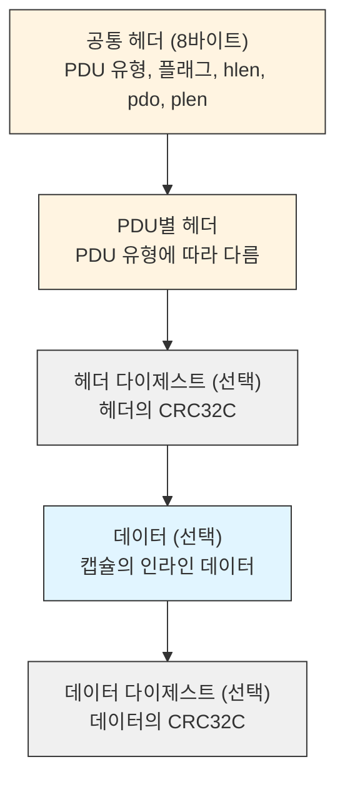

PDU 유형:
| PDU 유형 | 방향 | 목적 |
|---------|------|------|
| ICReq | H→T | 연결 초기화 요청 |
| ICResp | T→H | 연결 초기화 응답 |
| CapsuleCmd | H→T | NVMe 명령 캡슐 |
| CapsuleResp | T→H | NVMe 완료 캡슐 |
| H2CData | H→T | 호스트→컨트롤러 데이터 (쓰기용) |
| C2HData | T→H | 컨트롤러→호스트 데이터 (읽기용) |
| R2T | T→H | 전송 준비(Ready-to-transfer, 쓰기 흐름 제어) |
| TermReq | H↔T | 연결 종료 |

### 5.2 TCP 트랜스포트 기본값

`lib/nvmf/tcp.c`에서:

```c
#define SPDK_NVMF_TCP_DEFAULT_MAX_IO_QUEUE_DEPTH       128
#define SPDK_NVMF_TCP_DEFAULT_MAX_ADMIN_QUEUE_DEPTH    128
#define SPDK_NVMF_TCP_DEFAULT_MAX_QPAIRS_PER_CTRLR    128
#define SPDK_NVMF_TCP_DEFAULT_IN_CAPSULE_DATA_SIZE     4096   // 바이트
#define SPDK_NVMF_TCP_DEFAULT_MAX_IO_SIZE              131072 // 128 KiB
#define SPDK_NVMF_TCP_DEFAULT_IO_UNIT_SIZE             131072 // 128 KiB
#define SPDK_NVMF_TCP_DEFAULT_NUM_SHARED_BUFFERS       511
#define NVMF_TCP_MAX_ACCEPT_SOCK_ONE_TIME              16
```

`in_capsule_data_size`가 4096바이트이므로 4KiB 이하의 쓰기 I/O는 명령 캡슐과 함께 인라인으로 전송될 수 있어 R2T 왕복을 제거합니다.

### 5.3 TCP 요청 상태 머신

TCP 트랜스포트는 각 요청에 대한 상세한 상태 머신을 가지고 있습니다:

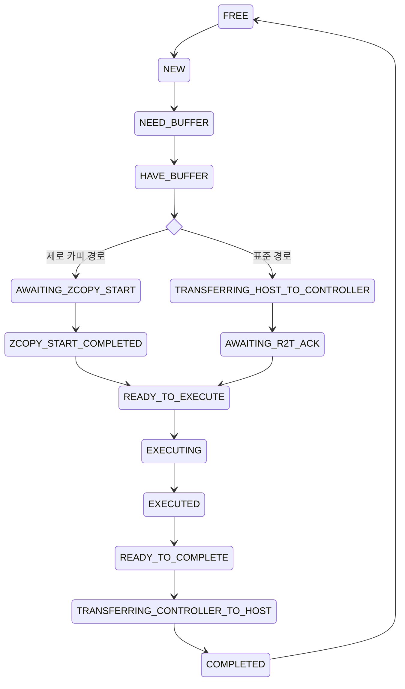

제로 카피(ZCOPY) 상태는 하위 bdev가 zcopy를 지원하고 트랜스포트 옵션에 `zcopy = true`가 설정된 경우 적용됩니다. 이 경우 bdev가 자체 버퍼를 직접 제공하여 bdev와 네트워크 계층 간의 복사를 피합니다.

### 5.4 TCP 연결 설정

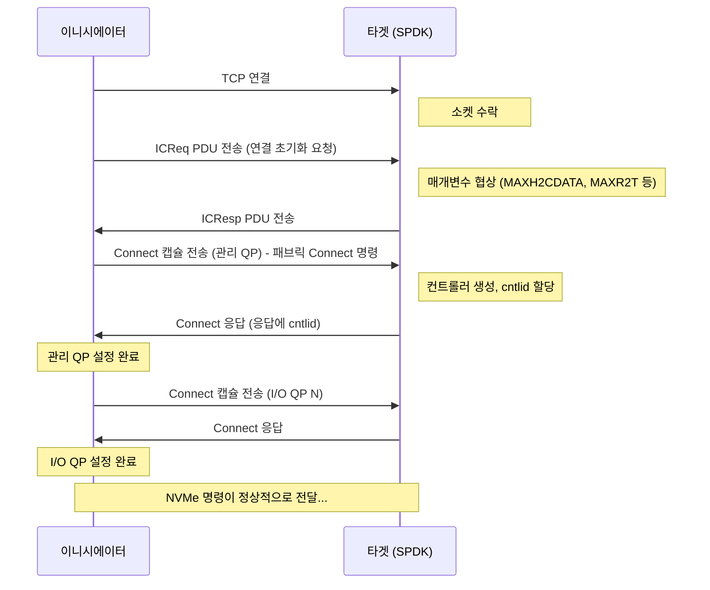

### 5.5 TCP 소켓 계층

SPDK의 TCP 트랜스포트는 POSIX `read()`/`write()`를 직접 호출하지 않고 SPDK sock 추상화(`spdk/sock.h`)를 사용합니다. 이를 통해:
- **TLS 지원**: sock 구현이 소켓을 TLS로 래핑 가능 (OpenSSL/ktls 사용)
- **커널 TLS (kTLS)**: TLS 레코드 처리를 커널로 오프로드
- **벡터 I/O**: 효율적인 스캐터-개더를 위한 `readv()`/`writev()`

수락기(acceptor)는 구성 가능한 속도로 새 연결을 폴링합니다:

```c
#define SPDK_NVMF_DEFAULT_ACCEPT_POLL_RATE_US  10000  // 기본 10ms
```

### 5.6 TLS 보안

SPDK는 NVMe/TCP에 대해 TLS 1.3을 지원합니다. 리스너 옵션을 통한 구성:

```c
struct spdk_nvmf_listen_opts {
    bool secure_channel; // 모든 새 연결에 TLS 요구
    // ...
};
```

TLS용 사전 공유 키(PSK, Pre-Shared Keys)는 SPDK 키링 하위 시스템을 통해 관리되며 리스너 구성에서 이름으로 참조됩니다.

---

## 6. FC 트랜스포트 개요

### 6.1 NVMe/FC 아키텍처

파이버 채널을 통한 NVMe(NVMe/FC)는 FC 패브릭을 트랜스포트로 사용합니다. FC-NVMe-2 표준(T11 작업 그룹)에서 정의됩니다.

RDMA 및 TCP와의 주요 차이점:
- FC는 전용 하드웨어 FC HBA(호스트 버스 어댑터)를 사용
- 주소 지정에 N_Port ID(24비트 FC 주소)와 WWPN(64비트 이름) 사용
- FC는 기본적으로 무손실, 순서 보장 전달 제공
- SPDK FC 트랜스포트(`lib/nvmf/fc.c`)는 FC 타겟 로직 계층 역할을 수행. 실제 FC 하드웨어 드라이버는 별도의 하위 수준 컴포넌트

### 6.2 FC 트랜스포트 구조

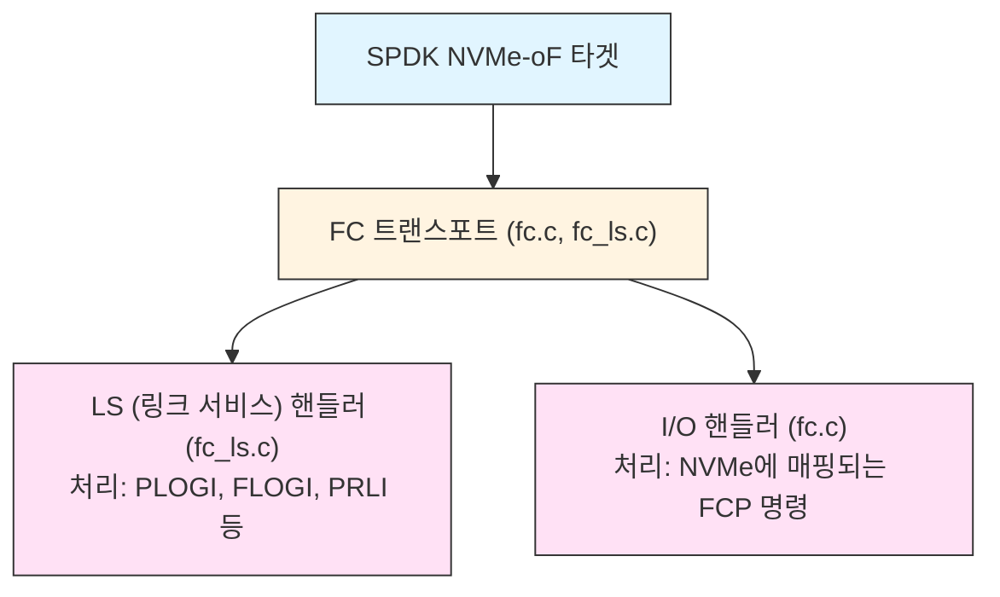

SPDK의 FC 트랜스포트는 관리 인터페이스를 노출하는 SoC 기반 FC 어댑터와 함께 사용됩니다. SPDK FC 트랜스포트는 직접적인 ibv_ / socket 호출 대신 콜백을 통해 해당 인터페이스를 구동합니다.

### 6.3 FC vs RDMA vs TCP 요약

| 특성 | RDMA (RoCE/IB) | TCP | FC |
|------|---------------|-----|-----|
| 지연 시간 | 최저 (~5 us) | 낮음 (~20-50 us) | 낮음 (~15-30 us) |
| 네트워크 인프라 | RDMA 패브릭 | 표준 이더넷 | FC SAN 패브릭 |
| CPU 오버헤드 | 최소 (오프로드) | 보통 | 최소 (오프로드) |
| 거리 | 짧음 (데이터센터) | 모든 IP 네트워크 | 짧음-중간 (데이터센터) |
| 보안 | IPsec (패브릭) | TLS 1.3 | FC-SP-2 |
| 일반적 사용 | HPC, 저지연 | 클라우드, 범용 | 엔터프라이즈 SAN |

---

## 7. 연결 생명주기 및 관리

### 7.1 큐 페어 상태

`include/spdk/nvmf_transport.h`에서:

```c
enum spdk_nvmf_qpair_state {
    SPDK_NVMF_QPAIR_UNINITIALIZED = 0,
    SPDK_NVMF_QPAIR_CONNECTING,       // Connect 패브릭 명령 수신
    SPDK_NVMF_QPAIR_AUTHENTICATING,   // DH-HMAC-CHAP 진행 중
    SPDK_NVMF_QPAIR_ENABLED,          // NVMe 명령 준비 완료
    SPDK_NVMF_QPAIR_DEACTIVATING,     // 연결 해제 시작
    SPDK_NVMF_QPAIR_ERROR,            // 치명적 오류, 정리 대기
};
```

### 7.2 연결 설정 흐름

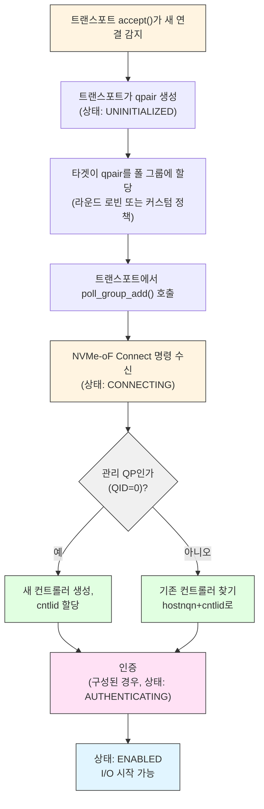

### 7.3 킵얼라이브 및 연결 타임아웃

NVMe-oF는 죽은 연결을 감지하기 위해 킵얼라이브(keep-alive)가 필요합니다:

```c
// nvmf_internal.h에서
#define NVMF_DISC_KATO_IN_MS       120000   // 디스커버리 킵얼라이브 120초
#define NVMF_KAS_TIME_UNIT_IN_MS   100      // 킵얼라이브 세분도: 100ms
#define NVMF_DEFAULT_KAS           100      // 기본 KAS: 10초
#define NVMF_DEFAULT_MIN_KATO      10000    // 최소 킵얼라이브 타임아웃: 10초
```

KAS(Keep-Alive Support) 값은 컨트롤러 Identify 데이터에서 광고됩니다. 호스트는 Set Features를 통해 KATO(Keep-Alive Timeout)를 설정합니다. 타겟이 KATO 기간 내에 호스트로부터 어떤 명령도 받지 못하면 연결이 종료됩니다.

연결 타임아웃은 호스트가 전체 연결 시퀀스(ICReq/ICResp + Connect)를 완료하는 시간도 포함합니다:

```c
// 트랜스포트 옵션에서
uint32_t association_timeout;  // ms, 기본값 120000
```

### 7.4 연결 해제 및 정리

```c
// 단일 qpair 연결 해제
void nvmf_qpair_disconnect(struct spdk_nvmf_qpair *qpair, ...);

// 순차적 qpair 연결 해제를 위한 내부 컨텍스트
struct nvmf_qpair_disconnect_many_ctx {
    struct spdk_nvmf_subsystem   *subsystem;
    struct spdk_nvmf_poll_group  *group;
    spdk_nvmf_poll_group_mod_done cpl_fn;
    void                         *cpl_ctx;
};
```

연결 해제는 비동기적입니다. qpair가 DEACTIVATING 상태로 전환되고, 진행 중인 모든 요청이 완료되거나 중단된 후, 트랜스포트 계층이 qpair 리소스를 해제합니다.

### 7.5 인증 (DH-HMAC-CHAP)

SPDK는 NVMe-oF DH-HMAC-CHAP 인증을 지원합니다 (NVMe-oF 사양 섹션 8):

```c
// nvmf_internal.h에서
enum nvmf_auth_key_type {
    NVMF_AUTH_KEY_HOST,    // 호스트 인증에 사용되는 키
    NVMF_AUTH_KEY_CTRLR,   // 양방향 인증에 사용되는 키
};
```

인증은 Auth Send/Auth Recv 패브릭 명령을 사용하며 `lib/nvmf/auth.c` 모듈에서 관리됩니다. 키는 SPDK 키링에 저장됩니다.

---

## 8. 네임스페이스 공유 및 멀티패스

### 8.1 여러 호스트에 걸친 네임스페이스 공유

단일 네임스페이스(bdev)를 여러 호스트에 동시에 노출할 수 있습니다. SPDK는 bdev 계층에서 동시 접근을 처리합니다:

```json
{
    "method": "nvmf_subsystem_add_ns",
    "params": {
        "nqn": "nqn.2016-06.io.spdk:cnode1",
        "namespace": {
            "nsid": 1,
            "bdev_name": "NVMe0n1"
        }
    }
}
```

`host-A`와 `host-B` 모두 이 서브시스템에 연결하여 NS 1에 접근할 수 있습니다. bdev 계층이 동일 LBA에 대한 동시 접근에 필요한 잠금을 제공합니다.

### 8.2 NVMe 예약

독점 접근 제어를 위해 SPDK는 NVMe 영구 예약(Persistent Reservations, PR)을 구현합니다. 이는 NVMe에 적용된 SCSI 스타일의 예약입니다:

```
예약 유형:
  Write Exclusive (WE)           - 한 등록자만 쓰기 가능
  Exclusive Access (EA)          - 한 등록자가 전체 접근
  Write Exclusive - Registrants Only (WERO)
  Exclusive Access - Registrants Only (EARO)
  Write Exclusive - All Registrants (WEAR)
  Exclusive Access - All Registrants (EAAR)
```

전원 손실 시 영구(Persistent through power loss, PTPL) 예약은 네임스페이스 생성 시 `ptpl_file` 매개변수로 지정된 파일에 저장됩니다.

### 8.3 ANA - 비대칭 네임스페이스 접근

ANA(NVMe TP 4004에서 정의)는 네임스페이스가 컨트롤러(경로)별로 다른 접근 상태를 보고할 수 있게 합니다:

| ANA 상태 | 의미 |
|---------|------|
| Optimized | 최적 경로: 최대 성능, 우선 사용 |
| Non-Optimized | 사용 가능하지만 선호되지 않음 (예: 더 긴 경로) |
| Inaccessible | 경로가 다운됨, 사용 불가 |
| Persistent Loss | 관리자 개입 없이는 복구 불가 |
| Change | 상태 전환 중, 곧 재시도 |

SPDK는 서브시스템에 리스너를 추가할 때 리스너별로 ANA 상태를 설정합니다:

```c
struct spdk_nvmf_listen_opts {
    enum spdk_nvme_ana_state ana_state; // 기본값 SPDK_NVME_ANA_OPTIMIZED_STATE
    // ...
};
```

이를 통해 액티브-액티브(active-active) 및 액티브-패시브(active-passive) 멀티패스 구성이 가능합니다:

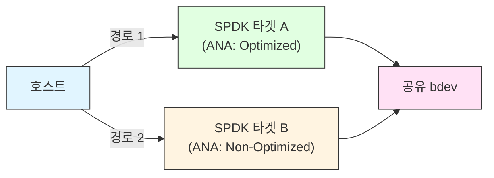

### 8.4 멀티패스 구성 예제

두 개의 SPDK 타겟이 동일한 NVMe 드라이브를 공유(예: vfio-user 또는 공유 bdev를 통해):

```bash
# 타겟 A (주)
rpc.py nvmf_subsystem_add_listener nqn.2016-06.io.spdk:cnode1 \
    -t tcp -a 192.168.1.1 -s 4420 --ana-state optimized

# 타겟 B (보조)
rpc.py nvmf_subsystem_add_listener nqn.2016-06.io.spdk:cnode1 \
    -t tcp -a 192.168.1.2 -s 4420 --ana-state non_optimized
```

호스트 NVMe 멀티패스 드라이버(dm-multipath 또는 네이티브 NVMe 멀티패스)가 타겟 A를 우선 사용하고, 필요 시 타겟 B로 페일오버합니다.

---

## 9. 디스커버리 서비스 구현

### 9.1 디스커버리 서비스란?

서브시스템에 연결하기 전에 호스트는 먼저 어떤 서브시스템이 사용 가능하고 어디에 연결해야 하는지 알아야 합니다. 이를 **디스커버리 서비스(Discovery Service)**를 통해 수행합니다:

1. 호스트가 잘 알려진 디스커버리 NQN에 연결: `nqn.2014-08.org.nvmexpress.discovery`
2. 호스트가 Admin 명령 전송: `Get Log Page (LID=70h)`로 디스커버리 로그 페이지(DLP) 검색
3. DLP가 모든 서브시스템 NQN과 해당 트랜스포트/주소 정보를 나열
4. 호스트가 디스커버리에서 연결 해제하고 원하는 서브시스템에 직접 연결

### 9.2 SPDK의 디스커버리 서브시스템

SPDK는 자동으로 디스커버리 서브시스템을 생성합니다. 일반 서브시스템에 리스너를 추가하면 해당 리스너가 자동으로 디스커버리 로그에 광고됩니다.

```c
// nvmf.c에서 - 리퍼럴이 디스커버리 로그에 추가됨
spdk_nvmf_send_discovery_log_notice(tgt, NULL);
```

`spdk_nvmf_tgt`의 `discovery_genctr`(세대 카운터)는 디스커버리 로그가 변경될 때마다 증가합니다. 호스트는 폴링 없이 비동기 이벤트 요청(AER)을 사용하여 디스커버리 로그 변경 알림을 받습니다.

### 9.3 디스커버리 로그 필터링

`include/spdk/nvmf.h`에서 SPDK는 디스커버리 로그에 표시되는 내용의 세밀한 필터링을 지원합니다:

```c
enum spdk_nvmf_tgt_discovery_filter {
    // 모든 호스트에 모든 리스너 표시
    SPDK_NVMF_TGT_DISCOVERY_MATCH_ANY = 0,
    // 호스트가 디스커버리에 사용한 것과 같은 트랜스포트 유형의 리스너만 표시
    SPDK_NVMF_TGT_DISCOVERY_MATCH_TRANSPORT_TYPE = 1u << 0u,
    // 호스트가 디스커버리에 사용한 것과 같은 주소의 리스너만 표시
    SPDK_NVMF_TGT_DISCOVERY_MATCH_TRANSPORT_ADDRESS = 1u << 1u,
    // 같은 서비스 ID의 리스너만 표시
    SPDK_NVMF_TGT_DISCOVERY_MATCH_TRANSPORT_SVCID = 1u << 2u,
    // 커스텀 필터 함수 적용
    SPDK_NVMF_TGT_DISCOVERY_MATCH_CUSTOM = 1u << 3u,
};
```

커스텀 필터 함수 시그니처:

```c
typedef bool (*spdk_nvmf_custom_discovery_filter)(
    const struct spdk_nvme_transport_id *listener_trid,
    const struct spdk_nvme_transport_id *discovery_cmd_source_trid);
```

### 9.4 디스커버리 리퍼럴

대규모 배포에서 단일 SPDK 타겟이 모든 서브시스템을 알지 못할 수 있습니다. SPDK는 **디스커버리 리퍼럴(discovery referrals)**을 지원합니다: 디스커버리 로그가 호스트를 다른 디스커버리 서비스로 안내할 수 있습니다:

```c
// nvmf.c에서
int spdk_nvmf_tgt_add_referral(
    struct spdk_nvmf_tgt *tgt,
    const struct spdk_nvmf_referral_opts *opts);
```

```bash
# 다른 디스커버리 서비스에 대한 리퍼럴 추가
rpc.py nvmf_discovery_add_referral \
    -t tcp -a 10.0.0.5 -s 4420 --subnqn nqn.2014-08.org.nvmexpress.discovery
```

### 9.5 중앙 디스커버리 컨트롤러(CDC)

대규모 NVMe-oF 배포를 위해 SPDK는 **중앙 디스커버리 컨트롤러(Central Discovery Controller)**로 작동할 수 있습니다:

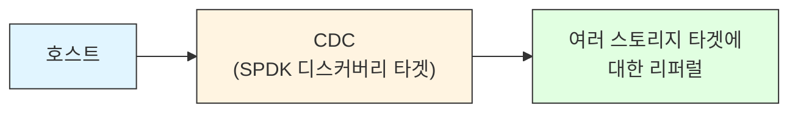

CDC는 여러 스토리지 타겟에서 디스커버리 정보를 집계하여 호스트에 통합된 뷰를 제공합니다.

---

## 10. JSON-RPC를 통한 구성

### 10.1 트랜스포트 생성

```bash
# RDMA 트랜스포트
rpc.py nvmf_create_transport \
    --trtype RDMA \
    --max-queue-depth 128 \
    --max-qpairs-per-ctrlr 64 \
    --max-io-size 131072 \
    --io-unit-size 131072 \
    --num-shared-buffers 4095 \
    --in-capsule-data-size 4096

# TCP 트랜스포트
rpc.py nvmf_create_transport \
    --trtype TCP \
    --max-queue-depth 128 \
    --in-capsule-data-size 4096 \
    --max-io-size 131072 \
    --io-unit-size 131072 \
    --num-shared-buffers 511 \
    --zcopy true
```

### 10.2 서브시스템 생성 및 구성

```bash
# 1. 서브시스템 생성
rpc.py nvmf_create_subsystem \
    nqn.2016-06.io.spdk:storage1 \
    --allow-any-host \
    --serial-number SPDKSTOR0001 \
    --model-number "SPDK NVMe-oF Target"

# 2. 네임스페이스 추가
rpc.py nvmf_subsystem_add_ns \
    nqn.2016-06.io.spdk:storage1 \
    NVMe0n1 \
    --nsid 1

# 3. 리스너 추가
rpc.py nvmf_subsystem_add_listener \
    nqn.2016-06.io.spdk:storage1 \
    --trtype RDMA \
    --traddr 192.168.100.1 \
    --trsvcid 4420 \
    --adrfam IPv4

rpc.py nvmf_subsystem_add_listener \
    nqn.2016-06.io.spdk:storage1 \
    --trtype TCP \
    --traddr 192.168.100.1 \
    --trsvcid 4420

# 4. 특정 호스트 추가 (allow-any-host를 사용하지 않는 경우)
rpc.py nvmf_subsystem_add_host \
    nqn.2016-06.io.spdk:storage1 \
    nqn.2014-08.org.nvmexpress:uuid:11111111-...
```

### 10.3 전체 JSON 구성 파일

```json
{
  "subsystems": [
    {
      "subsystem": "nvmf",
      "config": [
        {
          "method": "nvmf_create_transport",
          "params": {
            "trtype": "TCP",
            "max_queue_depth": 128,
            "in_capsule_data_size": 4096,
            "max_io_size": 131072,
            "io_unit_size": 131072,
            "num_shared_buffers": 511,
            "zcopy": true
          }
        },
        {
          "method": "nvmf_create_subsystem",
          "params": {
            "nqn": "nqn.2016-06.io.spdk:cnode1",
            "allow_any_host": true,
            "serial_number": "SPDK00001",
            "model_number": "SPDK Target"
          }
        },
        {
          "method": "nvmf_subsystem_add_ns",
          "params": {
            "nqn": "nqn.2016-06.io.spdk:cnode1",
            "namespace": {
              "nsid": 1,
              "bdev_name": "NVMe0n1"
            }
          }
        },
        {
          "method": "nvmf_subsystem_add_listener",
          "params": {
            "nqn": "nqn.2016-06.io.spdk:cnode1",
            "listen_address": {
              "trtype": "TCP",
              "traddr": "192.168.1.100",
              "trsvcid": "4420",
              "adrfam": "IPv4"
            }
          }
        }
      ]
    }
  ]
}
```

### 10.4 유용한 모니터링 RPC

```bash
# 모든 서브시스템 나열
rpc.py nvmf_get_subsystems

# 트랜스포트 통계 가져오기
rpc.py nvmf_get_stats

# 서브시스템별 활성 연결(qpair) 나열
rpc.py nvmf_subsystem_get_controllers nqn.2016-06.io.spdk:cnode1

# 폴 그룹 통계 가져오기
rpc.py nvmf_get_stats

# 모든 리스너 가져오기
rpc.py nvmf_subsystem_get_listeners nqn.2016-06.io.spdk:cnode1
```

---

## 11. 성능 튜닝

### 11.1 큐 깊이

큐 깊이는 각 큐 페어가 가질 수 있는 미처리 I/O 수를 제어합니다:

```bash
# 높은 큐 깊이로 트랜스포트 생성
rpc.py nvmf_create_transport --trtype TCP \
    --max-queue-depth 256 \        # QP당 256개의 미처리 I/O
    --max-qpairs-per-ctrlr 32      # 컨트롤러당 32개의 I/O 큐
```

큰 큐 깊이의 효과:
- 더 많은 I/O 파이프라이닝 허용, bdev 병렬성의 더 나은 활용
- 더 많은 사전 할당된 요청 및 버퍼 리소스 필요
- `num-shared-buffers`를 비례하여 증가

경험 법칙: `num_shared_buffers >= max_queue_depth * num_expected_connections * 2`

### 11.2 인캡슐 데이터 크기

```bash
rpc.py nvmf_create_transport --trtype TCP \
    --in-capsule-data-size 8192    # 8 KiB 인라인 데이터
```

`in_capsule_data_size` 증가 효과:
- 이 크기 이하의 쓰기에 대해 R2T 왕복 제거
- 작은 쓰기의 지연 시간을 크게 줄임
- 명령 캡슐당 메모리 증가 (사전 할당됨)
- 최적 설정은 쓰기 I/O 크기 분포에 따라 다름

### 11.3 CPU 친화도 및 폴 그룹

각 폴 그룹은 하나의 리액터 스레드에서 실행됩니다. 리액터를 특정 코어에 할당:

```bash
# SPDK 앱 시작 시 코어 마스크 (16진수 비트마스크)
nvmf_tgt -m 0xF0    # 코어 4,5,6,7

# 또는 구성을 통해
{
  "subsystems": [
    {
      "subsystem": "bdev",
      "config": [{ "method": "bdev_set_options", "params": { "bdev_io_pool_size": 65535 } }]
    }
  ]
}
```

CPU 할당 모범 사례:
- NVMe-oF 타겟에 전용 코어를 할당하고 애플리케이션 워크로드와 공유 피하기
- NUMA 로컬 코어를 NUMA 로컬 NIC/HBA에 고정
- 수락기(연결 설정)와 I/O 폴링에 별도 코어 사용
- OS 스케줄러 간섭을 방지하기 위해 Linux 커널에서 isolcpus 고려

### 11.4 NUMA 인지

```bash
# NUMA 토폴로지 확인
numactl --hardware

# SPDK 휴즈 페이지 할당은 --mem-channel 사용 시 NUMA를 준수
nvmf_tgt --mem-size 4096 --master-core 0 --socket-mem 2048,2048
```

메모리 버퍼와 큐 페어는 다음과 같은 NUMA 노드에 있어야 합니다:
- 트래픽을 처리하는 NIC/HBA
- I/O를 서비스하는 NVMe 디바이스

### 11.5 버퍼 풀 크기 조정

공유 버퍼 풀은 타겟의 모든 큐 페어에 공급합니다:

```
필요 버퍼 = num_active_qpairs * max_queue_depth * iodepth_per_req
```

10개 호스트, 각 4 QP, 큐 깊이 128인 타겟의 경우:

```
10 호스트 x 4 QP x 128 깊이 = 5120 동시 미처리 요청
각 요청은 최대 (max_io_size / io_unit_size) 버퍼 필요
128 KiB I/O에 128 KiB io_unit_size: 요청당 1 버퍼
최소: 5120 버퍼
권장: 5120 x 1.5 = 7680 (버퍼 캐시 여유분)
```

```bash
rpc.py nvmf_create_transport --trtype TCP \
    --num-shared-buffers 8192 \
    --buf-cache-size 64         # 경합 감소를 위한 스레드별 캐시
```

### 11.6 제로 카피 (ZCOPY)

bdev가 지원하는 경우(NVMe 패스스루, 일부 vbdev 모듈), bdev 계층과 네트워크 계층 간의 버퍼 복사를 제거하기 위해 zcopy를 활성화합니다:

```bash
rpc.py nvmf_create_transport --trtype TCP --zcopy true
```

TCP 트랜스포트 요청 상태 `AWAITING_ZCOPY_START`와 `ZCOPY_START_COMPLETED`(`tcp.c`에서 확인 가능)는 zcopy 버퍼 핸드오프 경로를 보여줍니다.

zcopy 요구 사항:
- bdev가 `spdk_bdev_zcopy_start()` / `spdk_bdev_zcopy_end()`를 지원해야 함
- DMA를 위한 충분한 bdev 측 버퍼 정렬
- 경로에 DIF/T10 PI 처리 없어야 함 (DIF는 복사 필요)

### 11.7 수락기 폴 레이트

수락기는 새로운 들어오는 연결을 폴링합니다:

```c
#define SPDK_NVMF_DEFAULT_ACCEPT_POLL_RATE_US  10000  // 10ms
```

빈번한 새 연결이 예상되는 프로덕션 타겟의 경우 이를 줄입니다:

```bash
rpc.py nvmf_create_transport --trtype TCP \
    --acceptor-poll-rate 1000   # 1ms, 더 빠른 연결 설정
```

### 11.8 성능 측정

모니터링할 핵심 메트릭:

```bash
# 폴 그룹별 IOPS 및 대역폭
rpc.py nvmf_get_stats

# 서브시스템별 컨트롤러 통계
rpc.py nvmf_subsystem_get_controllers nqn.2016-06.io.spdk:cnode1

# bdev I/O 통계 (대기 중인 I/O, 완료 표시)
rpc.py bdev_get_iostat -b NVMe0n1
```

일반적인 SPDK NVMe-oF 성능 목표:
- RDMA RoCE: < 10 us 지연, 4 KiB 랜덤 읽기로 500만+ IOPS
- TCP (25 GbE): < 50 us 지연, 4 KiB 랜덤 읽기로 100만+ IOPS
- TCP (100 GbE): 300만+ IOPS, RDMA 성능에 근접

### 11.9 트랜스포트 옵션 요약

| 매개변수 | TCP 기본값 | RDMA 기본값 | 효과 |
|---------|-----------|------------|------|
| `max_queue_depth` | 128 | 128 | QP당 미처리 I/O 수 |
| `max_qpairs_per_ctrlr` | 128 | 128 | 호스트당 I/O 큐 수 |
| `in_capsule_data_size` | 4096 B | 4096 B | 인라인 쓰기 데이터, RTT 감소 |
| `max_io_size` | 128 KiB | 128 KiB | Identify Controller에서 MDTS 설정 |
| `io_unit_size` | 128 KiB | 128 KiB | 개별 버퍼 크기 |
| `num_shared_buffers` | 511 | (가변) | 총 버퍼 풀 크기 |
| `buf_cache_size` | UINT32_MAX | (가변) | 스레드별 버퍼 캐시 |
| `zcopy` | false | N/A | bdev와의 제로 카피 |
| `acceptor_poll_rate` | 10 ms | 10 ms | 새 연결 폴 간격 |
| `association_timeout` | 120 s | 120 s | 연결 시퀀스 최대 시간 |

---

## 12. 핵심 정리

1. **NVMe-oF는 NVMe 명령 세트를 종단 간 보존합니다.** 이니시에이터는 로컬 NVMe와 동일한 명령을 사용하므로, SPDK는 프로토콜 변환 없이 NVMe 네이티브 타겟이 됩니다.

2. **트랜스포트 추상화 계층(`struct spdk_nvmf_transport_ops`)은 NVMe-oF 코어를 트랜스포트 구체 사항에서 분리합니다.** 새 트랜스포트가 콜백을 등록하며, 코어는 RDMA, TCP, FC 중 어떤 것을 통해 통신하는지 알 필요가 없습니다.

3. **RDMA의 시작 시 제로 카피 메모리 등록(I/O별이 아닌)이 낮은 CPU 오버헤드의 핵심입니다.** SPDK는 휴즈 페이지 메모리를 사전 등록하고 작업 요청에서 lkey를 재사용하여 I/O별 등록 오버헤드를 피합니다.

4. **TCP 트랜스포트는 15개 이상의 상태를 가진 명시적 요청별 상태 머신을 사용합니다.** 이 상태 머신의 이해는 느리거나 멈춘 요청 디버깅에 필수적입니다.

5. **서브시스템 상태 전환(INACTIVE → ACTIVE → PAUSED)은 비동기적입니다.** 진행 중인 I/O와의 경쟁을 피하기 위해 네임스페이스나 리스너 목록을 수정하기 전에 서브시스템을 일시 정지해야 합니다.

6. **ANA는 경로별 품질 힌트를 가진 액티브-액티브 멀티패스를 가능하게 합니다.** 타겟이 리스너별로 `ana_state`를 설정하고, 호스트 멀티패스 드라이버가 이를 경로 선택에 사용합니다.

7. **디스커버리 리퍼럴은 대규모 배포에서 연합 디스커버리를 허용합니다.** 단일 지식 포인트 없이 운영 가능합니다.

8. **공유 버퍼 풀은 타겟의 모든 큐 페어에 걸친 공유 리소스입니다.** 크기가 부족하면 I/O가 버퍼 대기 상태로 큐에 쌓여 지연 시간이 늘어납니다.

9. **NUMA 토폴로지가 중요합니다.** 버퍼, CPU 코어, NIC, NVMe 디바이스가 모두 같은 NUMA 노드에 있어야 최대 성능을 달성합니다.

10. **`in_capsule_data_size`는 핵심적인 작은 쓰기 최적화입니다.** 이를 예상 쓰기 I/O 크기에 맞게 설정하면 모든 쓰기에 대해 전체 네트워크 왕복(R2T 흐름 제어 메시지)을 제거합니다.

---

## 13. 실습

### 실습 1: 기본 NVMe/TCP 타겟 설정

**목표**: 동작하는 NVMe/TCP 타겟을 만들고 Linux 호스트에서 연결합니다.

**단계**:
1. TCP 지원으로 SPDK 빌드 (`./configure --with-nvmf-tcp`가 기본값)
2. 백킹 디바이스로 null bdev 생성:
   ```bash
   rpc.py bdev_null_create Null0 1024 4096  # 4096바이트의 1024 블록
   ```
3. TCP 트랜스포트 생성:
   ```bash
   rpc.py nvmf_create_transport --trtype TCP --in-capsule-data-size 4096
   ```
4. 서브시스템을 생성하고 네임스페이스와 리스너 추가
5. 이니시에이터(Linux)에서:
   ```bash
   nvme discover -t tcp -a <target_ip> -s 4420
   nvme connect -t tcp -a <target_ip> -s 4420 -n nqn.2016-06.io.spdk:cnode1
   nvme list
   fio --filename=/dev/nvmeXn1 --rw=randread --bs=4k --iodepth=32 --numjobs=1 \
       --runtime=30 --time_based --name=test
   ```

**검증**: `fio` 실행 결과에서 IOPS와 지연 시간이 표시되어야 합니다. 하위 bdev의 직접 NVMe IOPS와 비교합니다.

### 실습 2: TCP 요청 상태 전환 분석

**목표**: 쓰기 I/O가 TCP 트랜스포트를 통해 어떻게 흐르는지 이해합니다.

**단계**:
1. nvmf 컴포넌트에 대해 SPDK 추적 활성화:
   ```bash
   rpc.py trace_enable_tpoint_group nvmf_tcp
   ```
2. 쓰기 워크로드 실행:
   ```bash
   fio --filename=/dev/nvmeXn1 --rw=write --bs=8k --iodepth=1 --numjobs=1 \
       --runtime=5 --time_based --name=write_test
   ```
3. 추적 덤프:
   ```bash
   spdk_trace_analyzer -f /dev/shm/spdk_trace
   ```
4. 추적에서 단일 쓰기 요청의 상태 전환 식별:
   - `TCP_REQUEST_STATE_NEW`
   - `TCP_REQUEST_STATE_NEED_BUFFER` → `HAVE_BUFFER`
   - `TCP_REQUEST_STATE_TRANSFERRING_HOST_TO_CONTROLLER`
   - `TCP_REQUEST_STATE_EXECUTING`
   - `TCP_REQUEST_STATE_TRANSFERRING_CONTROLLER_TO_HOST`

**검증**: 각 상태 전환에 타임스탬프가 표시되어야 합니다. 각 상태에서 소요된 시간을 계산합니다.

### 실습 3: ANA 멀티패스 구성

**목표**: 두 개의 SPDK 타겟으로 액티브-액티브 멀티패스를 설정하고 이니시에이터에서 경로 페일오버를 검증합니다.

**단계**:
1. 두 개의 별도 머신(또는 같은 머신의 두 IP)에서 SPDK 타겟 시작
2. 두 타겟이 같은 bdev 노출 (null bdev 또는 vfio-user를 통한 공유 NVMe 사용)
3. 타겟 A는 `--ana-state optimized`로 구성
4. 타겟 B는 `--ana-state non_optimized`로 구성
5. 이니시에이터에서:
   ```bash
   nvme connect -t tcp -a <target_a_ip> -s 4420 -n nqn.2016-06.io.spdk:cnode1
   nvme connect -t tcp -a <target_b_ip> -s 4420 -n nqn.2016-06.io.spdk:cnode1
   nvme list  # 하나의 네임스페이스, 두 개의 경로가 보여야 함
   cat /sys/class/nvme-fabrics/ctl/nvme*/ana_state
   ```
6. 타겟 A를 중지하여 페일오버를 시뮬레이션합니다. 타겟 B에서 I/O가 계속되는지 확인합니다.

**검증**: `nvme list`에서 두 개의 컨트롤러를 가진 단일 디바이스가 표시됩니다. 타겟 A 종료 후 I/O가 계속됩니다 (기본 NVMe 멀티패스 설정으로 페일오버 시간 < 30초).

### 실습 4: 버퍼 풀 용량 계획

**목표**: 프로덕션 시나리오에 맞는 올바른 버퍼 풀 크기를 계산하고 검증합니다.

**시나리오**:
- 50개 이니시에이터
- 각 이니시에이터에 1 관리 QP + 4 I/O QP
- I/O QP당 큐 깊이: 64
- 워크로드: 64 KiB 랜덤 읽기
- `io_unit_size`: 64 KiB

**단계**:
1. 최소 버퍼 수 계산: `50 x 4 x 64 x 1 = 12,800`
2. 50% 여유분 추가: `12,800 x 1.5 = 19,200`
3. `--num-shared-buffers 20000`으로 트랜스포트 생성
4. 워크로드 실행 후 버퍼 고갈 모니터링:
   ```bash
   watch -n1 'rpc.py nvmf_get_stats | python3 -m json.tool | grep pending'
   ```
5. `pending_bdev_io`가 0 근처를 유지하면 풀이 적절합니다.
   지속적으로 0이 아니면 풀이 병목입니다.

---

## 14. 참고 자료

### 소스 파일
- `/Users/heesungyang/workspace/spdk/lib/nvmf/nvmf.c` - 타겟 및 서브시스템 코어
- `/Users/heesungyang/workspace/spdk/lib/nvmf/tcp.c` - TCP 트랜스포트 구현
- `/Users/heesungyang/workspace/spdk/lib/nvmf/rdma.c` - RDMA 트랜스포트 구현
- `/Users/heesungyang/workspace/spdk/lib/nvmf/fc.c` - FC 트랜스포트 구현
- `/Users/heesungyang/workspace/spdk/lib/nvmf/transport.c` - 트랜스포트 추상화 계층
- `/Users/heesungyang/workspace/spdk/lib/nvmf/subsystem.c` - 서브시스템 관리
- `/Users/heesungyang/workspace/spdk/lib/nvmf/ctrlr.c` - 가상 컨트롤러 로직
- `/Users/heesungyang/workspace/spdk/lib/nvmf/ctrlr_bdev.c` - 컨트롤러-bdev 브릿지
- `/Users/heesungyang/workspace/spdk/lib/nvmf/auth.c` - DH-HMAC-CHAP 인증
- `/Users/heesungyang/workspace/spdk/lib/nvmf/nvmf_rpc.c` - JSON-RPC 핸들러
- `/Users/heesungyang/workspace/spdk/app/nvmf_tgt/nvmf_main.c` - 타겟 애플리케이션 진입점

### 헤더 파일
- `/Users/heesungyang/workspace/spdk/include/spdk/nvmf.h` - 공개 NVMe-oF 타겟 API
- `/Users/heesungyang/workspace/spdk/include/spdk/nvmf_transport.h` - 트랜스포트 플러그인 API
- `/Users/heesungyang/workspace/spdk/lib/nvmf/nvmf_internal.h` - 내부 구조체
- `/Users/heesungyang/workspace/spdk/lib/nvmf/transport.h` - 트랜스포트 내부 API

### RPC 메서드 (`scripts/rpc.py` 사용)
- `nvmf_create_transport` - 트랜스포트 인스턴스 생성
- `nvmf_create_subsystem` - 서브시스템 생성
- `nvmf_delete_subsystem` - 서브시스템 삭제
- `nvmf_subsystem_add_ns` - 서브시스템에 네임스페이스 추가
- `nvmf_subsystem_remove_ns` - 서브시스템에서 네임스페이스 제거
- `nvmf_subsystem_add_listener` - 서브시스템에 리스너 추가
- `nvmf_subsystem_add_host` - 서브시스템에 허용 호스트 추가
- `nvmf_get_subsystems` - 모든 서브시스템 나열
- `nvmf_get_stats` - 타겟 통계 가져오기
- `nvmf_discovery_add_referral` - 디스커버리 리퍼럴 추가

### 외부 사양
- **NVMe-oF 사양 1.1**: https://nvmexpress.org/developers/nvme-of-specification/
- **NVMe 기본 사양 2.0**: https://nvmexpress.org/developers/nvme-specification/
- **FC-NVMe-2**: https://www.t11.org/
- **RDMA Verbs**: `libibverbs` man 페이지, RDMA-Core 프로젝트

### 관련 SPDK 문서
- SPDK NVMe-oF 타겟 가이드: `doc/nvmf.md` (SPDK 저장소 내)
- SPDK 성능 보고서: https://ci.spdk.io/
- SPDK 메일링 리스트: spdk@lists.01.org
