# 모듈 21: Vhost 타겟

**단계**: 3 (마스터리)
**난이도**: 고급
**예상 소요 시간**: 5시간
**선수 과목**: 모듈 01 (소개), 모듈 04 (스레딩 모델), 모듈 05 (Bdev 계층), 모듈 11 (NVMe 드라이버), 모듈 14 (iSCSI 타겟)

**버전 이력**:
- v1.0 (2026-03-30): 초기 버전

---

## 학습 목표

이 모듈을 완료하면 다음을 할 수 있습니다:
- vhost-user 프로토콜과 SPDK가 백엔드 서버로 어떻게 참여하는지 설명
- virtqueue 링 구조와 디스크립터 체이닝 방식 설명
- QEMU 게스트에서 SPDK vhost를 거쳐 bdev 계층에 이르는 I/O 요청 추적
- vhost-blk과 vhost-scsi 타겟의 설계 차이 구분
- 동작하는 스토리지 설정을 위한 QEMU 및 SPDK vhost 구성
- 성능을 위한 인터럽트 결합(interrupt coalescing) 및 멀티큐 튜닝 적용
- virtio 1.1에서 도입된 패킹 링(packed ring) 최적화 이해

---

## 개요

SPDK의 vhost 타겟은 특정 문제를 해결합니다: QEMU의 I/O 에뮬레이션 경로의 오버헤드 없이 가상 머신(VM)에 고성능 스토리지 접근을 어떻게 제공할 것인가?

해답은 vhost-user입니다. VM의 virtio 드라이버가 공유 메모리를 통해 사용자 공간 백엔드(이 경우 SPDK)에 직접 통신하게 하는 프로토콜입니다. QEMU는 설정 단계에서만 얇은 중개자 역할을 합니다. 그 이후에 SPDK는 virtqueue를 폴링하고 QEMU의 에뮬레이션 계층을 거치지 않고 최대 NVMe 속도로 I/O를 처리합니다.

### 이것이 중요한 이유

전통적인 QEMU 스토리지 에뮬레이션은 여러 계층을 거칩니다:

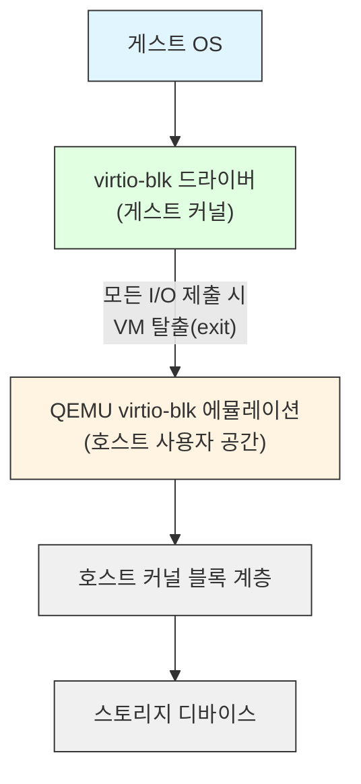

SPDK vhost-user 사용 시:

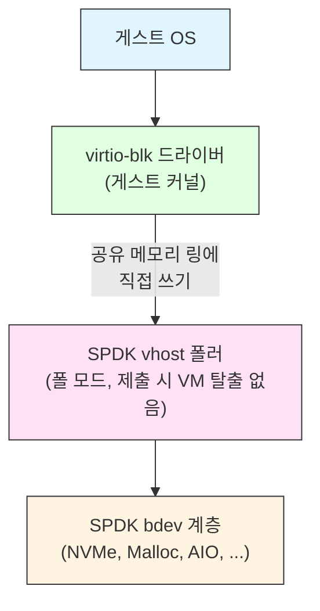

I/O 제출 시 VM 탈출을 제거하는 것이 핵심 성능 향상입니다. SPDK의 폴링 모델은 virtio 킥 알림의 오버헤드도 피합니다.

---

## 핵심 개념

### 개념 1: Virtio / Vhost 계층 구조

세 가지 별개의 계층을 이해하면 이 모듈 전체에서 혼동을 방지합니다.

**Virtio**는 I/O 가상화 표준입니다. 정의하는 것:
- 디바이스 유형 (블록, 네트워크, SCSI 등)
- Virtqueue 링 구조와 디스크립터 형식
- 드라이버와 디바이스 간 기능 협상

**Vhost** (커널)는 주로 네트워킹(`vhost_net`)을 위한 Linux 커널 내 vhost 백엔드 구현입니다.

**Vhost-user**는 디바이스 백엔드를 사용자 공간에서 실행하는 vhost 프로토콜의 확장입니다. 제어 메시지에는 Unix 도메인 소켓을 사용하고, 데이터 링에는 공유 메모리(`mmap` 사용)를 사용합니다.

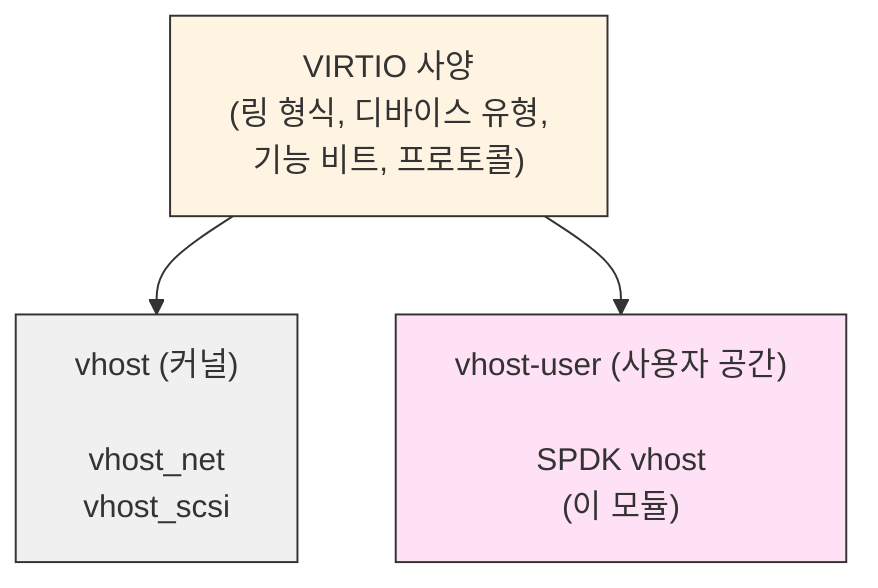

SPDK는 **vhost-user 백엔드 서버**를 구현합니다. Unix 도메인 소켓에서 수신 대기하며 프런트엔드 클라이언트(가장 일반적으로 QEMU)의 연결을 기다립니다.

---

### 개념 2: Virtqueue 링 구조

virtqueue는 드라이버(게스트)와 디바이스(SPDK) 간에 I/O를 전달하기 위한 핵심 데이터 구조입니다. 스플릿 링(split ring) 형식(virtio 1.0)은 공유 메모리에서 세 영역으로 구성됩니다:

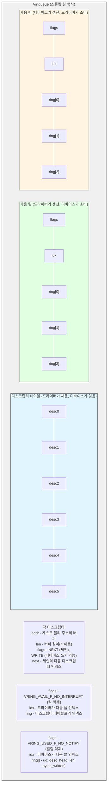

읽기 I/O 요청은 세 개의 디스크립터 체인을 사용합니다:

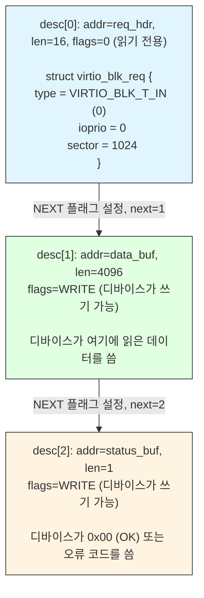

SPDK 소스(`vhost_processing.md`)의 virtio 디스크립터 구조체:

```c
struct virtq_desc {
    /* 주소 (게스트 물리 주소). */
    le64 addr;
    /* 길이. */
    le32 len;

    /* VIRTQ_DESC_F_NEXT:  'next' 필드를 통해 버퍼 계속 */
    /* VIRTQ_DESC_F_WRITE: 디바이스 쓰기 전용 (아니면 읽기 전용) */
    le16 flags;
    /* flags & NEXT인 경우 다음 필드 */
    le16 next;
};
```

---

### 개념 3: Vhost-User 프로토콜 - 설정 단계

I/O가 흐르기 전에 QEMU와 SPDK는 Unix 도메인 소켓을 통해 vhost-user 메시지를 교환합니다. 이것이 제어 플레인(control plane)입니다.

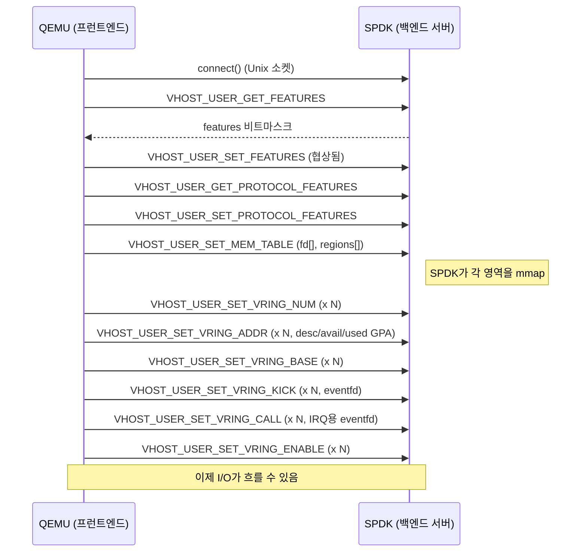

SPDK가 협상하는 주요 기능 (`vhost_internal.h`):

```c
#define SPDK_VHOST_FEATURES \
    (1ULL << VHOST_F_LOG_ALL)           | \  /* 라이브 마이그레이션 지원 */
    (1ULL << VHOST_USER_F_PROTOCOL_FEATURES) | \
    (1ULL << VIRTIO_F_VERSION_1)        | \  /* virtio 1.0 */
    (1ULL << VIRTIO_F_NOTIFY_ON_EMPTY)  | \
    (1ULL << VIRTIO_RING_F_EVENT_IDX)   | \  /* 세밀한 인터럽트 억제 */
    (1ULL << VIRTIO_RING_F_INDIRECT_DESC) | \/* 간접 디스크립터 테이블 */
    (1ULL << VIRTIO_F_ANY_LAYOUT)
```

추가 blk 전용 기능:

```c
#define SPDK_VHOST_BLK_FEATURES_BASE (SPDK_VHOST_FEATURES | \
    (1ULL << VIRTIO_BLK_F_SIZE_MAX) |   /* 최대 세그먼트 크기 */
    (1ULL << VIRTIO_BLK_F_SEG_MAX)  |   /* 최대 세그먼트 수 */
    (1ULL << VIRTIO_BLK_F_BLK_SIZE) |   /* config의 블록 크기 필드 */
    (1ULL << VIRTIO_BLK_F_TOPOLOGY) |   /* I/O 정렬 토폴로지 */
    (1ULL << VIRTIO_BLK_F_MQ))          /* 멀티큐 지원 */
```

---

### 개념 4: GPA에서 VVA로의 변환

게스트는 디스크립터에 버퍼 주소를 게스트 물리 주소(GPA, Guest Physical Address)로 배치합니다. SPDK는 이를 접근 가능한 주소인 vhost 가상 주소(VVA)로 변환해야 합니다.

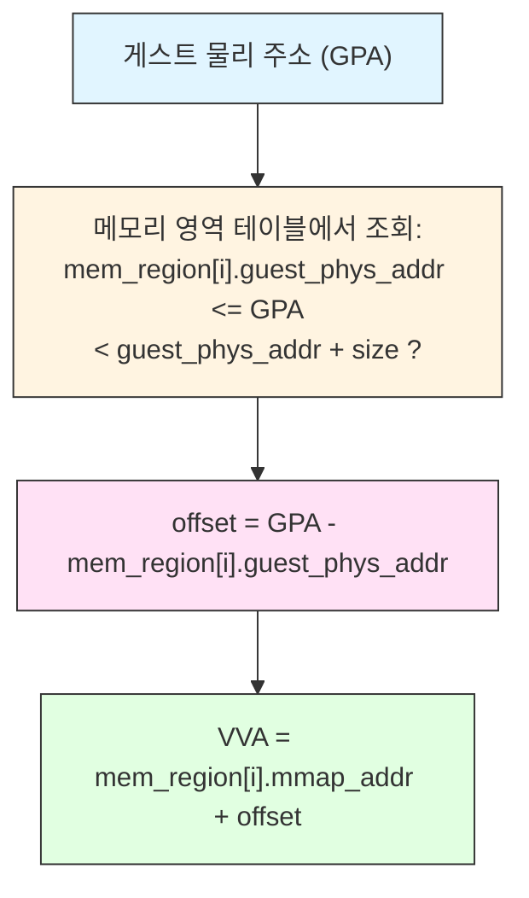

SPDK의 변환 함수 (`vhost_internal.h`):

```c
void *vhost_gpa_to_vva(struct spdk_vhost_session *vsession,
                       uint64_t addr, uint64_t len);
```

이 함수는 모든 디스크립터의 모든 버퍼에 대해 호출됩니다. 구현은 `vsession->mem->regions[]`(`SET_MEM_TABLE` 처리 중에 채워짐)를 순회하며 매핑된 포인터를 반환합니다.

**중요한 제약**: SPDK는 요청 헤더와 응답 상태 바이트가 각각 단일 메모리 영역 내에 들어가야 합니다. I/O 데이터 버퍼는 영역을 걸칠 수 있으며 자동으로 iovec으로 분할됩니다.

---

### 개념 5: SPDK 내부 데이터 구조

vhost 하위 시스템은 명확한 3단계 계층 구조를 가집니다:

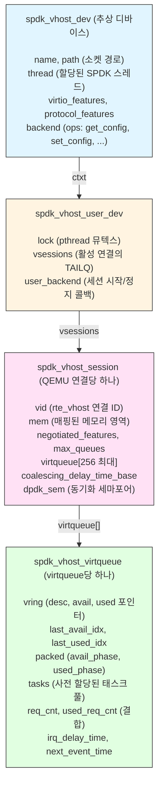

핵심 상수 제한:

| 상수 | 값 | 의미 |
|------|-----|------|
| `SPDK_VHOST_MAX_VQUEUES` | 256 | 디바이스당 최대 virtqueue 수 |
| `SPDK_VHOST_MAX_VQ_SIZE` | 1024 | virtqueue당 최대 디스크립터 수 |
| `SPDK_VHOST_SCSI_CTRLR_MAX_DEVS` | 8 | 컨트롤러당 최대 SCSI 타겟 수 |
| `SPDK_VHOST_IOVS_MAX` | 129 | 요청당 최대 iovec 수 |
| `SPDK_VHOST_VQ_MAX_SUBMISSIONS` | 32 | 폴 반복당 최대 요청 수 |

---

### 개념 6: Vhost-BLK 타겟 - I/O 경로

vhost-blk 타겟은 단일 bdev를 게스트에 virtio-blk 디바이스로 노출합니다. 두 타겟 유형 중 더 간단합니다.

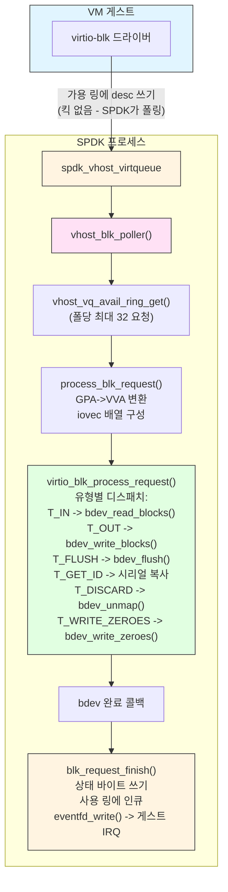

**vhost-blk용 데이터 구조** (`vhost_blk.c`):

```c
/* blk 디바이스 - 추상 vhost_dev를 래핑 */
struct spdk_vhost_blk_dev {
    struct spdk_vhost_dev vdev;   /* 반드시 첫 번째 */
    struct spdk_bdev *bdev;
    struct spdk_bdev_desc *bdev_desc;
    const struct spdk_virtio_blk_transport_ops *ops;
    bool readonly;
};

/* 세션별 상태 */
struct spdk_vhost_blk_session {
    struct spdk_vhost_session vsession;  /* 반드시 첫 번째 */
    struct spdk_vhost_blk_dev *bvdev;
    struct spdk_poller *requestq_poller;
    struct spdk_io_channel *io_channel;
    struct spdk_poller *stop_poller;
};

/* 요청별 태스크 (virtqueue 슬롯당 한 번 할당) */
struct spdk_vhost_user_blk_task {
    struct spdk_vhost_blk_task blk_task;  /* iovec 배열 포함 */
    struct spdk_vhost_blk_session *bvsession;
    struct spdk_vhost_virtqueue *vq;
    uint16_t req_idx;
    uint16_t num_descs;
    uint16_t buffer_id;
    uint16_t inflight_head;
    bool used;
};
```

처리 진입점은 `vhost_blk.c`의 `virtio_blk_process_request()`이며, 모든 요청 유형을 처리하고 적절한 bdev API에 매핑합니다:

```c
int
virtio_blk_process_request(struct spdk_vhost_dev *vdev,
                            struct spdk_io_channel *ch,
                            struct spdk_vhost_blk_task *task,
                            virtio_blk_request_cb cb,
                            void *cb_arg)
{
    /* task->iovs[]는 이미 GPA->VVA 변환으로 채워져 있음 */
    switch (req->type) {
    case VIRTIO_BLK_T_IN:
        /* 읽기 */
        spdk_bdev_readv_blocks(bdev_desc, ch, task->iovs, task->iovcnt,
                               sector_num, num_blocks, blk_request_complete_cb, task);
        break;
    case VIRTIO_BLK_T_OUT:
        /* 쓰기 */
        spdk_bdev_writev_blocks(bdev_desc, ch, task->iovs, task->iovcnt,
                                sector_num, num_blocks, blk_request_complete_cb, task);
        break;
    case VIRTIO_BLK_T_FLUSH:
        spdk_bdev_flush_blocks(bdev_desc, ch, 0, num_blocks,
                               blk_request_complete_cb, task);
        break;
    case VIRTIO_BLK_T_GET_ID:
        /* 디바이스 시리얼 넘버 문자열을 버퍼에 복사 */
        memcpy(task->iovs[1].iov_base, bdev->name, len);
        blk_request_finish(VIRTIO_BLK_S_OK, task);
        break;
    case VIRTIO_BLK_T_DISCARD:
        spdk_bdev_unmap_blocks(bdev_desc, ch, offset, num_blocks,
                               blk_request_complete_cb, task);
        break;
    case VIRTIO_BLK_T_WRITE_ZEROES:
        spdk_bdev_write_zeroes_blocks(bdev_desc, ch, offset, num_blocks,
                                      blk_request_complete_cb, task);
        break;
    default:
        blk_request_finish(VIRTIO_BLK_S_UNSUPP, task);
    }
}
```

---

### 개념 7: Vhost-SCSI 타겟 - I/O 경로

vhost-scsi 타겟은 게스트에 최대 8개의 타겟을 가진 SCSI 컨트롤러를 노출합니다. 각 타겟은 SCSI 계층을 통해 SPDK bdev에 매핑됩니다. VM이 실행 중일 때 스토리지 타겟의 핫 부착(hot-attach)과 핫 분리(hot-detach)가 가능합니다.

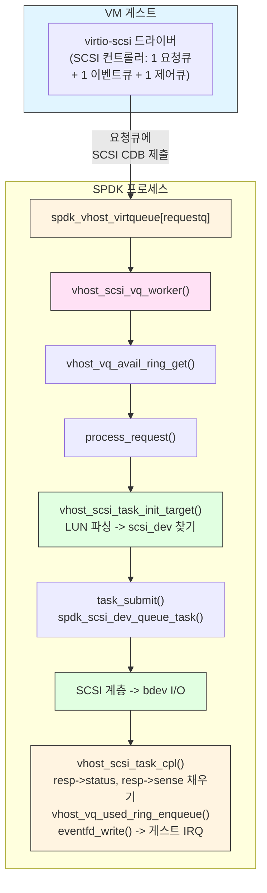

---

### 개념 8: 패킹 링 (Virtio 1.1)

virtio 1.1에서 도입된 패킹 링(packed ring) 형식은 3영역 스플릿 링을 단일 디스크립터 링으로 대체합니다. 캐시 지역성을 개선하고 메모리 대역폭을 줄입니다.

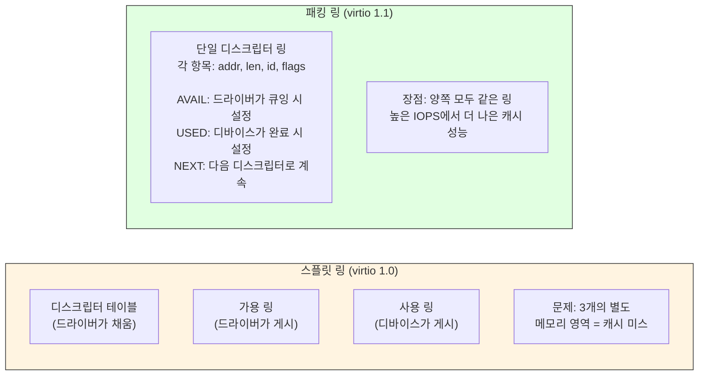

SPDK는 `spdk_vhost_virtqueue`에서 패킹 링 상태를 추적합니다:

```c
struct spdk_vhost_virtqueue {
    struct rte_vhost_vring vring;
    uint16_t last_avail_idx;
    uint16_t last_used_idx;

    struct {
        uint8_t avail_phase : 1;  /* avail용 랩 카운터 (사양) */
        uint8_t used_phase  : 1;  /* used용 랩 카운터 (사양) */
        uint8_t padding     : 5;
        bool    packed_ring : 1;  /* 패킹 링이 협상된 경우 true */
    } packed;
    /* ... */
};
```

---

### 개념 9: 인터럽트 결합(Interrupt Coalescing)

매우 높은 IOPS에서 완료된 모든 요청마다 IRQ(`eventfd_write`를 통해)를 보내면 게스트에서 상당한 CPU 오버헤드가 발생합니다. SPDK vhost는 IRQ를 배치하기 위한 인터럽트 결합을 지원합니다.

**결합 공식** (`spdk/vhost.h`):

```
if (delay_base == 0 || IOPS < iops_threshold):
    delay = 0   (결합 없음)
else:
    delay = delay_base * (iops - iops_threshold) / iops_threshold
```

**기본값** (`vhost_internal.h`):

```c
/* 기본적으로 결합 비활성화 */
#define SPDK_VHOST_COALESCING_DELAY_BASE_US       0

/* 결합이 활성화되는 임계값 */
#define SPDK_VHOST_VQ_IOPS_COALESCING_THRESHOLD   60000

/* 결합 결정을 위한 IOPS 확인 주기 */
#define SPDK_VHOST_STATS_CHECK_INTERVAL_MS        10
```

RPC 또는 API를 통한 결합 구성:

```c
int spdk_vhost_set_coalescing(struct spdk_vhost_dev *vdev,
                               uint32_t delay_base_us,
                               uint32_t iops_threshold);
```

예: 100K IOPS 이상에서 50us 기본 지연으로 결합 활성화:

```sh
scripts/rpc.py vhost_controller_set_coalescing vhost.0 50 100000
```

---

### 개념 10: 스레드 모델 및 CPU 고정

SPDK vhost는 SPDK의 리액터/스레드 모델과 깔끔하게 통합됩니다.

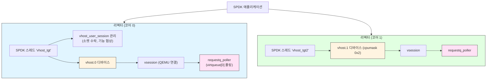

`cpumask` 매개변수는 vhost 디바이스를 서비스할 수 있는 리액터 코어를 제어합니다:

```sh
# vhost.0을 코어 0에 고정
scripts/rpc.py vhost_create_scsi_controller --cpumask 0x1 vhost.0

# vhost.1을 코어 1에 고정
scripts/rpc.py vhost_create_blk_controller --cpumask 0x2 vhost.1 Malloc0
```

**CPU 친화도 규칙**: NUMA 시스템에서는 항상 vhost 디바이스를 VM vCPU와 같은 소켓의 코어에 고정합니다. 소켓 간 메모리 접근은 상당한 지연을 추가합니다.

---

## 아키텍처 다이어그램

VM 게스트에서 NVMe 디바이스까지의 전체 시스템 뷰:

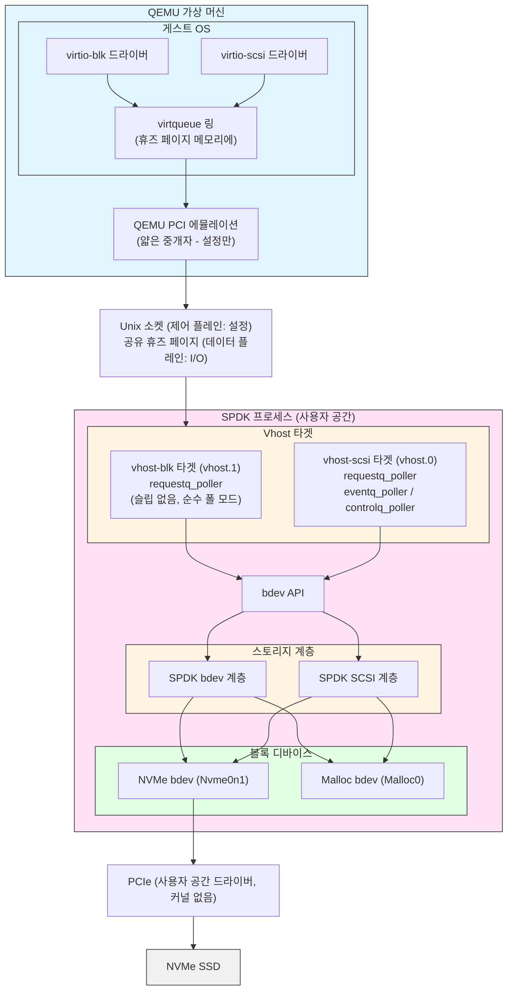

---

## 구성 워크스루

### 단계 1: 시스템 준비

```sh
# SPDK + VM용 휴즈 페이지 할당
HUGEMEM=4096 scripts/setup.sh

# 4096 MB: SPDK용 1024 + VM용 3072
# 휴즈 페이지 메모리는 SPDK와 QEMU 간에 공유됨
```

### 단계 2: SPDK vhost 애플리케이션 시작

```sh
# 코어 0, 1에서 시작, 소켓 디렉토리 /var/tmp
build/bin/vhost -S /var/tmp -m 0x3

# -S: vhost 소켓 파일 디렉토리
# -m: CPU 마스크 (0x3 = 코어 0 + 코어 1)
```

### 단계 3: 스토리지 백엔드 생성

```sh
# NVMe bdev (실제 하드웨어)
scripts/rpc.py bdev_nvme_attach_controller -b Nvme0 -t pcie -a 0000:01:00.0

# Malloc bdev (램디스크, 테스트용)
scripts/rpc.py bdev_malloc_create 128 4096 -b Malloc0
# 128 MB, 4096바이트 블록 크기

# AIO bdev (Linux 파일/디바이스)
scripts/rpc.py bdev_aio_create /dev/sdb AioDisk 512
```

### 단계 4: Vhost-SCSI 컨트롤러 생성

```sh
# /var/tmp/vhost.0에 소켓을 가진 컨트롤러 생성
# 코어 0에 고정 (cpumask 0x1)
scripts/rpc.py vhost_create_scsi_controller --cpumask 0x1 vhost.0

# NVMe bdev를 SCSI 타겟 0으로 부착
scripts/rpc.py vhost_scsi_controller_add_target vhost.0 0 Nvme0n1

# Malloc bdev를 SCSI 타겟 1로 부착
scripts/rpc.py vhost_scsi_controller_add_target vhost.0 1 Malloc0
```

### 단계 5: Vhost-BLK 컨트롤러 생성

```sh
# /var/tmp/vhost.1에 소켓을 가진 blk 컨트롤러 생성
# 코어 1에 고정 (cpumask 0x2)
scripts/rpc.py vhost_create_blk_controller --cpumask 0x2 vhost.1 Malloc0

# 읽기 전용 변형:
scripts/rpc.py vhost_create_blk_controller --cpumask 0x2 -r vhost.1 Malloc0
```

### 단계 6: QEMU VM 실행

```sh
taskset -c 2,3 qemu-system-x86_64 \
  --enable-kvm \
  -cpu host -smp 2 \
  -m 1G \
  \
  # 공유 휴즈 페이지 메모리 (vhost-user에 필요)
  -object memory-backend-file,id=mem0,size=1G,\
mem-path=/dev/hugepages,share=on \
  -numa node,memdev=mem0 \
  \
  # 부팅 디스크 (vhost 아님)
  -drive file=guest_os_image.qcow2,if=none,id=disk \
  -device ide-hd,drive=disk,bootindex=0 \
  \
  # vhost-SCSI 디바이스 (2 vCPU용 2 큐)
  -chardev socket,id=spdk_vhost_scsi0,path=/var/tmp/vhost.0 \
  -device vhost-user-scsi-pci,id=scsi0,chardev=spdk_vhost_scsi0,\
num_queues=2 \
  \
  # vhost-BLK 디바이스 (2 큐)
  -chardev socket,id=spdk_vhost_blk0,path=/var/tmp/vhost.1 \
  -device vhost-user-blk-pci,chardev=spdk_vhost_blk0,num-queues=2
```

**중요한 QEMU 매개변수**:

| 매개변수 | 목적 |
|---------|------|
| `memory-backend-file,share=on` | QEMU와 SPDK 간 공유 휴즈 페이지 메모리 활성화 |
| `mem-path=/dev/hugepages` | 저지연 매핑에 휴즈 페이지 사용 |
| `-numa node,memdev=mem0` | 모든 VM 메모리를 휴즈 페이지 백엔드에 할당 |
| `num_queues=N` | virtqueue 수 (최고 성능을 위해 vCPU 수에 맞춤) |

### 단계 7: 게스트 VM에서 확인

```sh
# 게스트 VM 내부에서
lsblk --output "NAME,KNAME,MODEL,HCTL,SIZE,VENDOR,SUBSYSTEMS"

# 예상 출력:
# sdb    - vhost-scsi를 통한 NVMe bdev (block:scsi:virtio:pci)
# sdc    - vhost-scsi를 통한 Malloc bdev
# vda    - vhost-blk을 통한 Malloc bdev (block:virtio:pci)
```

---

## 핫 부착 및 핫 분리 (vhost-SCSI 전용)

Vhost-SCSI는 VM이 실행 중일 때 SCSI 타겟의 추가 및 제거를 지원합니다. VM의 virtio-scsi 드라이버가 `VIRTIO_SCSI_F_HOTPLUG`를 협상해야 합니다.

**핫 부착** (VM이 이미 실행 중):

```sh
# 슬롯 2에 새 타겟 추가
scripts/rpc.py vhost_scsi_controller_add_target vhost.0 2 Malloc1

# SPDK가 게스트에 VIRTIO_SCSI_T_TRANSPORT_RESET 이벤트 전송
# 게스트가 virtio 이벤트 큐를 통해 새 디바이스 감지
```

**핫 분리**:

```sh
# 슬롯 0에서 타겟 제거
scripts/rpc.py vhost_scsi_controller_remove_target vhost.0 0

# 또는: bdev를 삭제하면 자동으로 핫 분리 트리거
scripts/rpc.py bdev_malloc_delete Malloc0
```

**참고**: Vhost-BLK은 핫 부착/분리를 지원하지 않습니다. 백킹 bdev가 사라지면(예: NVMe 물리적 제거) 해당 vhost-blk 디바이스의 모든 I/O는 `VIRTIO_BLK_S_IOERR`를 반환하고 게스트에서 I/O 오류가 발생합니다.

---

## RPC 참조

| RPC | 목적 |
|-----|------|
| `vhost_create_scsi_controller [--cpumask M] name` | vhost-SCSI 컨트롤러 생성 |
| `vhost_create_scsi_controller_no_start [--cpumask M] name` | 생성하되 시작하지 않음 |
| `vhost_scsi_controller_add_target name tgt_num bdev_name` | bdev를 SCSI 타겟으로 부착 |
| `vhost_scsi_controller_remove_target name tgt_num` | SCSI 타겟 분리 |
| `vhost_create_blk_controller [--cpumask M] [-r] name bdev_name` | vhost-BLK 컨트롤러 생성 |
| `vhost_delete_controller name` | vhost 컨트롤러 제거 |
| `vhost_get_controllers [name]` | 컨트롤러 정보 나열 (JSON) |
| `vhost_controller_set_coalescing name delay_base_us iops_threshold` | 결합 구성 |

---

## 성능 고려 사항 및 튜닝

### 멀티큐 구성

최대 처리량을 위해 virtqueue 수를 VM vCPU 수에 맞춥니다:

```
num_queues = num_vcpus
```

각 virtqueue에는 자체 폴 루프가 있습니다. 더 많은 큐는 더 많은 병렬 I/O를 허용하지만 디바이스당 더 많은 SPDK 폴러 사이클이 필요합니다.

```sh
# 4 vCPU VM: 4 큐 사용
-device vhost-user-scsi-pci,...,num_queues=4
```

게스트 내부에서 Linux 멀티큐 블록 계층 활성화:

```sh
# 게스트 내부 /etc/default/grub에서:
GRUB_CMDLINE_LINUX="scsi_mod.use_blk_mq=1"
update-grub
# 재부팅
```

### CPU 격리 및 폴링

SPDK vhost는 설계상 100% CPU 폴링을 사용합니다. 전용 코어를 할당합니다:

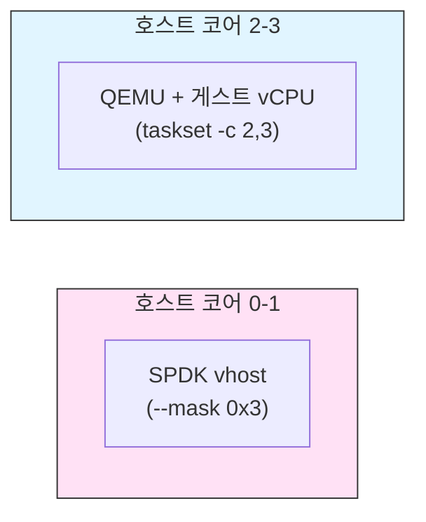

이를 통해 SPDK 폴러가 QEMU 스케줄링과 경쟁하는 것을 방지합니다.

### NUMA 토폴로지

NUMA 서버의 경우 항상 SPDK, QEMU, NVMe 디바이스를 같은 소켓에 유지합니다:

```
소켓 0:              소켓 1:
  코어 0-11            코어 12-23
  NVMe PCIe x16       (다른 워크로드)
  SPDK (--mask 0x3)
  QEMU (taskset -c 2,3)
  휴즈 페이지 (노드 0)
```

소켓 간 메모리 접근(QPI/UPI)은 연산당 50-100ns의 지연을 추가합니다.

### 인터럽트 결합 vs. 지연 시간

| 모드 | 구성 | 사용 사례 |
|------|------|----------|
| 결합 없음 | `delay_base_us=0` | 지연 시간 민감 (데이터베이스) |
| 가벼운 결합 | `delay=50, iops=60000` | 균형 |
| 강한 결합 | `delay=500, iops=30000` | 고처리량 순차 I/O |

### 패킹 링

QEMU에서 패킹 링 활성화 (게스트에서 virtio 1.1 지원 필요):

```sh
-device vhost-user-blk-pci,...,packed=on
```

패킹 링은 높은 큐 깊이에서 캐시 압력을 줄입니다. `fio`로 적용 전후를 측정하여 워크로드에 대한 이점을 확인합니다.

### 큐 깊이 튜닝

virtqueue 링 크기는 최대 `SPDK_VHOST_MAX_VQ_SIZE`(1024) 디스크립터로 고정됩니다. SPDK는 다른 폴러의 기아를 방지하기 위해 폴 반복당 최대 `SPDK_VHOST_VQ_MAX_SUBMISSIONS`(32) 요청을 처리합니다.

최대 IOPS를 목표로 하는 스토리지 워크로드의 경우 큰 fio 큐 깊이를 사용합니다:

```sh
# 게스트 내부에서
fio --name=randread --ioengine=libaio --iodepth=128 \
    --rw=randread --bs=4k --direct=1 \
    --filename=/dev/sdb --size=10G --time_based --runtime=30
```

---

## 비교: Vhost-BLK vs Vhost-SCSI

| 측면 | Vhost-BLK | Vhost-SCSI |
|------|-----------|------------|
| 프로토콜 | virtio-blk | virtio-scsi |
| 컨트롤러당 타겟 | 1 bdev | 최대 8 SCSI 타겟 |
| 타겟당 LUN | 해당 없음 | 1 (현재 SPDK 제한) |
| 핫 부착/분리 | 미지원 | 지원 |
| 요청 큐 | 구성 가능 (num-queues) | 1 requestq + 1 eventq + 1 controlq |
| 게스트 드라이버 | virtio_blk | virtio_scsi |
| 게스트 블록 디바이스 | `/dev/vda` (virtio-blk) | `/dev/sdb` (SCSI) |
| SCSI 명령 세트 | VIRTIO_BLK_F_SCSI를 통한 서브셋 (SPDK에서 비활성화) | 전체 SCSI |
| TMF (태스크 관리) | 미지원 | 지원 |
| 사용 사례 | 단일 디스크, 간단한 설정 | 멀티 디스크, 동적 부착 |

---

## 비교: Vhost vs 다른 SPDK 스토리지 타겟

| 기능 | Vhost | NVMe-oF TCP | NVMe-oF RDMA | iSCSI |
|------|-------|-------------|--------------|-------|
| 사용 사례 | 로컬 VM 스토리지 | 네트워크 스토리지 | 네트워크 스토리지 | 네트워크 스토리지 |
| 트랜스포트 | Unix 소켓 + 공유 메모리 | TCP/IP | InfiniBand/RoCE | TCP/IP |
| 제출 시 VM 탈출 | 없음 (폴 모드) | 해당 없음 | 해당 없음 | 해당 없음 |
| 제로 카피 | 예 (공유 메모리) | 아니오 | 예 (RDMA) | 아니오 |
| 게스트 드라이버 | virtio-blk/scsi | nvme | nvme | iscsi |
| 지연 시간 | ~5-10us | ~20-50us | ~5-15us | ~50-100us |

---

## 핵심 정리

1. **Vhost-user는 제어 + 데이터 플레인 분리입니다**: QEMU가 Unix 소켓을 통해 설정을 협상하지만, 모든 I/O는 QEMU 개입 없이 공유 휴즈 페이지 메모리를 통해 흐릅니다.

2. **SPDK의 폴 모드는 제출 시 VM 탈출을 제거합니다**: 게스트가 가용 링에 쓰고, SPDK가 지속적으로 폴링합니다. 킥 알림도, VMEXIT도 없습니다.

3. **virtqueue는 세 가지 역할이 있습니다**: 디스크립터 테이블은 버퍼를 설명하고, 가용 링은 프로듀서 큐(드라이버)이며, 사용 링은 완료 큐(디바이스)입니다.

4. **GPA에서 VVA로의 변환은 크리티컬 패스에 있습니다**: 모든 디스크립터의 모든 버퍼는 메모리 영역 테이블에서 조회가 필요합니다. SPDK는 성능을 위해 헤더/응답을 단일 영역으로 제한합니다.

5. **Vhost-blk이 더 단순하고, vhost-scsi가 더 유연합니다**: 단일 bdev 직접 접근과 최대 단순성을 위해서는 vhost-blk을 선택합니다. 다중 타겟이나 핫 부착/분리 기능이 필요하면 vhost-scsi를 선택합니다.

6. **CPU 친화도가 매우 중요합니다**: SPDK 폴러와 QEMU vCPU는 백킹 스토리지와 같은 NUMA 노드에 있어야 합니다. 소켓 간 접근은 성능을 크게 저하시킵니다.

7. **인터럽트 결합은 지연 시간과 처리량을 교환합니다**: 높은 IOPS에서 결합을 활성화하면 게스트 CPU 오버헤드가 줄어듭니다. 낮은 IOPS나 지연 시간 민감 워크로드에서는 비활성화합니다.

8. **패킹 링은 캐시 효율을 개선합니다**: 높은 큐 깊이에서 virtio 1.1 패킹 링 형식은 가용 및 사용 정보를 단일 링에 배치하여 캐시 미스를 줄입니다.

9. **태스크 풀은 사전 할당됩니다**: SPDK는 세션 시작 시 디스크립터 슬롯당 하나의 태스크를 할당합니다. I/O 경로에서 동적 할당을 피합니다.

10. **bdev 추상화가 vhost를 스토리지에 독립적으로 만듭니다**: vhost 계층은 NVMe나 AIO에 직접 통신하지 않습니다. bdev API만 호출하므로, 모든 bdev 백엔드(NVMe, Malloc, AIO, Ceph RBD 등)가 투명하게 작동합니다.

---

## 실습

### 실습 1: 기본 Vhost 설정

동작하는 vhost-blk과 vhost-scsi 쌍을 설정합니다:

1. 코어 0-1에서 `/var/tmp` 소켓 디렉토리로 SPDK vhost 시작
2. 4096바이트 블록의 512MB malloc bdev `Malloc0` 생성
3. 코어 0에 고정된 vhost-scsi 컨트롤러 `vhost.0` 생성, `Malloc0`을 타겟 0으로 부착
4. 코어 1에 고정된 `Malloc0` 백킹의 vhost-blk 컨트롤러 `vhost.1` 생성
5. 두 디바이스를 VM에 연결하는 QEMU 명령 줄 구성
6. 게스트 내에서 `sdb` (scsi)와 `vda` (blk)가 나타나는지 확인

예상: 두 디바이스 모두 `lsblk`에서 보이고, `dd`로 읽기 가능.

### 실습 2: 핫 부착/분리

실행 중인 VM에서 동적 타겟 관리를 탐색합니다:

1. 하나의 타겟(슬롯 0의 Malloc0)을 가진 vhost.0으로 시작
2. VM을 부팅하고 디바이스가 나타나는지 확인
3. VM이 실행 중일 때 두 번째 bdev `Malloc1`을 생성하고 슬롯 1에 핫 부착
4. 재부팅 없이 게스트가 새 디바이스를 감지하는지 확인
5. 슬롯 0을 핫 분리하고 디바이스가 사라지는지 확인
6. 제거된 타겟의 대기 중인 I/O가 깔끔하게 완료되거나 오류 처리되는지 확인

예상: VM 재부팅 불필요; 게스트가 부착/분리 이벤트를 감지.

### 실습 3: 성능 벤치마킹

vhost 성능 모드를 측정하고 비교합니다:

1. 게스트 내에서 vhost-blk에 `iodepth=128, rw=randread, bs=4k`로 `fio` 실행
2. 기준 IOPS와 지연 시간 기록
3. 인터럽트 결합 활성화: `delay_base_us=100, iops_threshold=50000`
4. `fio` 재실행 후 비교: IOPS가 증가하는가? 지연 시간이 증가하는가?
5. 결합을 비활성화하고 재측정
6. `num-queues=1` vs `num-queues=4` (4 vCPU 환경) 비교 후 IOPS 비교

예상: 결합은 지연 시간 대가로 처리량 증가; 더 많은 큐는 다중 vCPU에서 IOPS 향상.

### 실습 4: 소스를 통한 I/O 추적

소스 코드를 읽고 다음 질문에 답합니다:

1. `vhost_blk.c`에서: 새 가용 링 항목이 감지되면 가장 먼저 호출되는 함수는?
2. 요청 헤더에 대해 `vhost_gpa_to_vva()`가 호출되는 위치는, 그리고 왜 단일 메모리 영역에 맞아야 하는가?
3. `vhost_scsi.c`에서: `process_request()`와 `process_ctrl_request()`의 차이는?
4. `vsession->task_cnt`가 virtqueue 크기 제한에 도달하면 어떻게 되는가?
5. SPDK가 게스트에 I/O 완료를 어디서 어떻게 알리는가?

답변에는 SPDK 소스의 파일 이름과 대략적인 줄 번호를 포함해야 합니다.

### 실습 5: 멀티 디바이스 NUMA 구성

다음 사양의 서버를 위한 vhost 구성을 설계합니다:
- 2 NUMA 소켓 (각 24코어)
- 2 NVMe 드라이브: PCIe 소켓 0에 하나, PCIe 소켓 1에 하나
- 4 VM: 소켓 0에 2개, 소켓 1에 2개

답변:
1. vhost 디바이스와 cpumask를 어떻게 할당하겠는가?
2. 두 소켓을 모두 서비스하려면 SPDK를 어떻게 실행하겠는가?
3. 필요한 휴즈 페이지 구성은?
4. NUMA 친화도가 올바른지 어떻게 확인하겠는가?

---

## 추가 리소스

- SPDK 소스: `/lib/vhost/` (vhost.c, vhost_blk.c, vhost_scsi.c, vhost_internal.h)
- SPDK 소스: `/include/spdk/vhost.h`
- SPDK 문서: `doc/vhost.md` - 구성 및 QEMU 명령 참조
- SPDK 문서: `doc/vhost_processing.md` - 프로토콜 심층 분석
- Virtio 사양: [OASIS virtio v1.2](https://docs.oasis-open.org/virtio/virtio/v1.2/)
- Vhost-user 사양: [QEMU vhost-user 문서](https://qemu-project.gitlab.io/qemu/interop/vhost-user.html)
- DPDK rte_vhost 라이브러리: SPDK가 저수준 virtqueue 처리에 사용
- 커널 문서: `Documentation/driver-api/virtio/` - virtio 드라이버 내부 구조
