# 모듈 22: iSCSI 타겟

**단계**: 3 (마스터리)
**난이도**: 고급
**예상 소요 시간**: 5시간
**사전 요구사항**: 모듈 04 (스레딩 모델), 모듈 07 (bdev 계층), 모듈 15 (NVMe-oF 타겟 아키텍처)

**버전 이력**:
- v1.0 (2026-03-30): 최초 버전

---

## 학습 목표

이 모듈을 완료하면 다음을 수행할 수 있습니다:
- iSCSI 프로토콜 스택(protocol stack)과 SPDK 아키텍처에 대한 매핑을 설명
- 포털 그룹(portal group), 이니시에이터 그룹(initiator group), 타겟 노드(target node) 간의 관계를 설명
- TCP 소켓에서 PDU 파싱을 거쳐 bdev I/O에 이르는 SCSI 명령 추적
- CHAP 인증이 포함된 RPC를 통한 SPDK iSCSI 타겟 구성
- SPDK의 폴링 모델(polling model)이 iSCSI 연결 처리에 적용되는 방식 설명
- iSCSI 로그인 단계에서의 파라미터 협상(parameter negotiation) 이해
- iSCSI 워크로드에 특화된 성능 튜닝 옵션 적용

---

## 개요

iSCSI(Internet Small Computer Systems Interface)는 SCSI 명령을 TCP/IP 패킷 내에 캡슐화하여 표준 이더넷 네트워크를 통해 블록 스토리지에 접근할 수 있게 합니다. SPDK는 사용자 공간(user space)에서 실행되는 고성능 iSCSI 타겟 구현을 제공하며, 폴 모드 드라이버(poll-mode driver) 철학을 사용하여 I/O 경로에서 커널 컨텍스트 스위치를 제거합니다.

### 이것이 중요한 이유

iSCSI는 파이버 채널(Fibre Channel) 인프라 비용을 감당할 수 없는 기업에서 지배적인 SAN 프로토콜입니다. NVMe-oF가 지연 시간에 민감한 워크로드에서 주목받고 있지만, iSCSI는 여전히 가장 널리 배포된 블록 스토리지 프로토콜이며 특별한 드라이버 없이 모든 운영체제에서 지원됩니다. SPDK의 iSCSI 타겟을 이해하면 기존 iSCSI 이니시에이터에 NVMe급 처리량을 제공할 수 있습니다.

### iSCSI가 SPDK에서 차지하는 위치

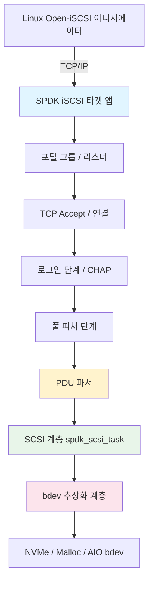

---

## 핵심 개념

### 개념 1: iSCSI 프로토콜 기초

iSCSI는 RFC 3720에 정의되어 있습니다. SPDK 구현을 살펴보기 전에 핵심 프로토콜 엔티티를 이해해야 합니다.

**iSCSI 네이밍**

모든 iSCSI 엔티티는 IQN(iSCSI Qualified Name)을 가집니다:

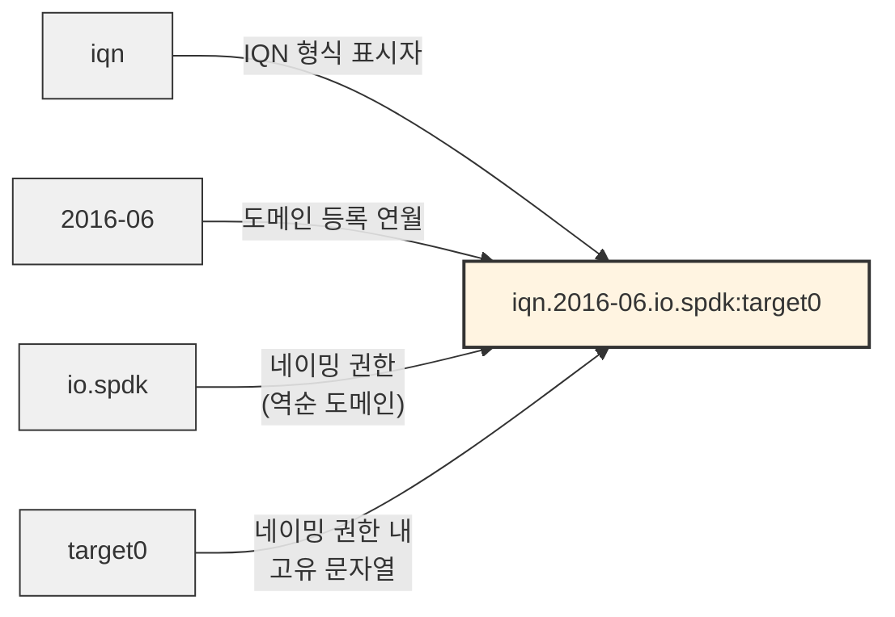

SPDK의 기본 노드 베이스는 `iqn.2016-06.io.spdk`입니다 (`iscsi.h`에 정의):

```c
#define SPDK_ISCSI_DEFAULT_NODEBASE "iqn.2016-06.io.spdk"
```

**iSCSI 세션과 연결**

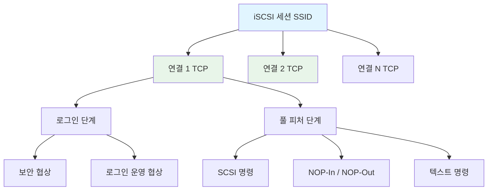

**세션(session)**은 이니시에이터와 타겟 간의 논리적 관계입니다(SSID + ISID로 식별). 세션은 여러 **연결(connection)**(별도의 TCP 스트림)을 가질 수 있습니다. 각 연결은 iSCSI PDU를 전달합니다.

**SPDK의 주요 상수**

```c
/* From lib/iscsi/iscsi.h */
#define DEFAULT_PORT                        3260
#define DEFAULT_MAX_SESSIONS                128
#define DEFAULT_MAX_CONNECTIONS_PER_SESSION 2
#define MAX_ISCSI_CONNECTIONS               1024
#define DEFAULT_MAX_QUEUE_DEPTH             64
#define DEFAULT_MAXR2T                      4
```

**PDU 구조**

모든 iSCSI PDU는 정확히 48바이트의 기본 헤더 세그먼트(BHS, Basic Header Segment)를 가집니다:

```c
/* From include/spdk/iscsi_spec.h */
struct iscsi_bhs {
    uint8_t opcode      : 6;    /* 작업 코드 */
    uint8_t immediate   : 1;    /* 즉시 전달 */
    uint8_t reserved    : 1;
    uint8_t flags;
    uint8_t rsv[2];
    uint8_t total_ahs_len;
    uint8_t data_segment_len[3]; /* 데이터 페이로드 길이 */
    uint64_t lun;               /* 논리 유닛 번호 */
    uint32_t itt;               /* 이니시에이터 태스크 태그 */
    uint32_t ttt;               /* 타겟 전송 태그 */
    uint32_t stat_sn;           /* 상태 시퀀스 번호 */
    uint32_t exp_stat_sn;
    uint32_t max_stat_sn;
    uint8_t res3[12];
};
/* 컴파일 시 크기 검증: 정확히 48바이트여야 함 */
SPDK_STATIC_ASSERT(sizeof(struct iscsi_bhs) == ISCSI_BHS_LEN, ...);
```

**iSCSI 연산 코드(Opcodes)**

```c
/* 이니시에이터 → 타겟 opcodes */
ISCSI_OP_NOPOUT       = 0x00,  /* NOP-Out (킵얼라이브) */
ISCSI_OP_SCSI         = 0x01,  /* SCSI 명령 */
ISCSI_OP_TASK         = 0x02,  /* 태스크 관리 */
ISCSI_OP_LOGIN        = 0x03,  /* 로그인 요청 */
ISCSI_OP_TEXT         = 0x04,  /* 텍스트 협상 */
ISCSI_OP_SCSI_DATAOUT = 0x05,  /* Data-Out (쓰기 데이터) */
ISCSI_OP_LOGOUT       = 0x06,  /* 로그아웃 요청 */

/* 타겟 → 이니시에이터 opcodes */
ISCSI_OP_NOPIN        = 0x20,  /* NOP-In (킵얼라이브 응답) */
ISCSI_OP_SCSI_RSP     = 0x21,  /* SCSI 응답 */
ISCSI_OP_TASK_RSP     = 0x22,  /* 태스크 관리 응답 */
ISCSI_OP_LOGIN_RSP    = 0x23,  /* 로그인 응답 */
ISCSI_OP_SCSI_DATAIN  = 0x25,  /* Data-In (읽기 데이터) */
ISCSI_OP_R2T          = 0x31,  /* Ready-To-Transfer */
ISCSI_OP_REJECT       = 0x3f,  /* 거부 */
```

---

### 개념 2: SPDK iSCSI 타겟 아키텍처

SPDK의 iSCSI 타겟은 접근 제어 매트릭스를 형성하는 세 가지 구성 객체 위에 구축됩니다.

**세 가지 구성 요소**

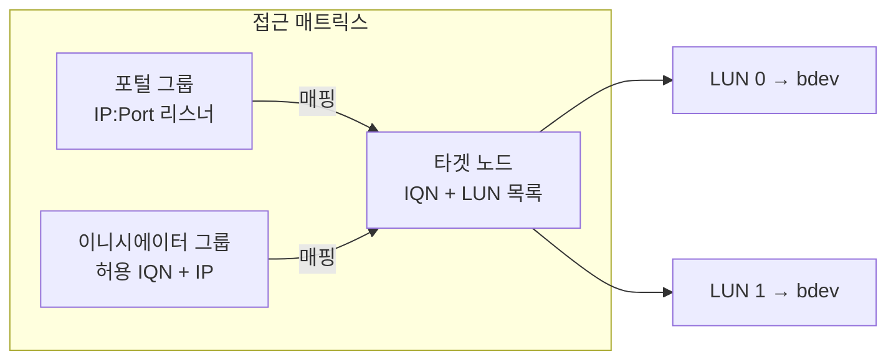

| 객체 | 설명 | 주요 필드 |
|--------|-------------|------------|
| **포털 그룹(Portal Group)** | 하나 이상의 IP:port 리스너 | 포털 주소, 태그 ID |
| **이니시에이터 그룹(Initiator Group)** | 이니시에이터 IQN 및 IP 넷마스크 화이트리스트 | 이니시에이터 이름, 넷마스크 |
| **타겟 노드(Target Node)** | LUN 매핑이 있는 iSCSI 타겟 | IQN, PG-IG 맵, LUN |

**아키텍처 계층**

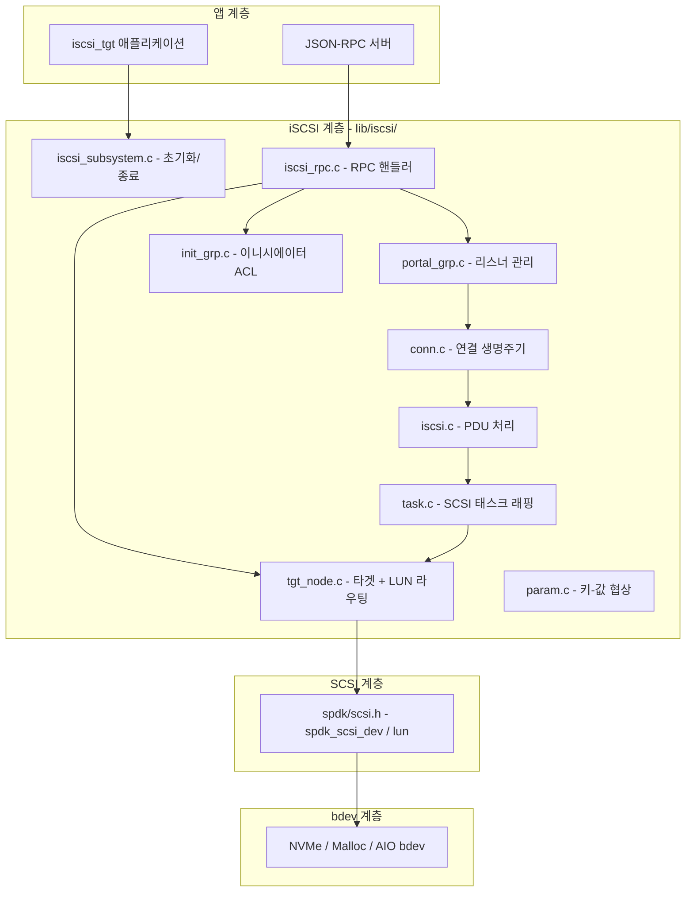

**스레드 핀닝(Thread Pinning)**

SPDK는 수락된 각 TCP 연결을 SPDK 리액터(폴링 스레드)에 할당합니다. 해당 연결의 모든 I/O는 할당된 리액터에서 잠금 없이(lock-free) 실행됩니다. 연결 풀은 할당/해제 시에만 단일 뮤텍스로 보호되며, 데이터 경로에서는 사용되지 않습니다:

```c
/* From lib/iscsi/conn.c */
static struct spdk_iscsi_conn *g_conns_array = NULL;
static TAILQ_HEAD(, spdk_iscsi_conn) g_free_conns = ...;
static TAILQ_HEAD(, spdk_iscsi_conn) g_active_conns = ...;
static pthread_mutex_t g_conns_mutex = PTHREAD_MUTEX_INITIALIZER;

/* 뮤텍스는 할당 중에만 유지, I/O 중에는 사용하지 않음 */
static struct spdk_iscsi_conn *
allocate_conn(void)
{
    pthread_mutex_lock(&g_conns_mutex);
    conn = TAILQ_FIRST(&g_free_conns);
    if (conn != NULL) {
        TAILQ_REMOVE(&g_free_conns, conn, conn_link);
        conn->is_valid = 1;
        TAILQ_INSERT_TAIL(&g_active_conns, conn, conn_link);
    }
    pthread_mutex_unlock(&g_conns_mutex);
    return conn;
}
```

---

### 개념 3: 포털 그룹과 연결 수락

포털 그룹은 iSCSI 타겟이 들어오는 연결을 수신하는 IP 주소 + 포트 조합의 집합입니다.

**포털 그룹 내부**

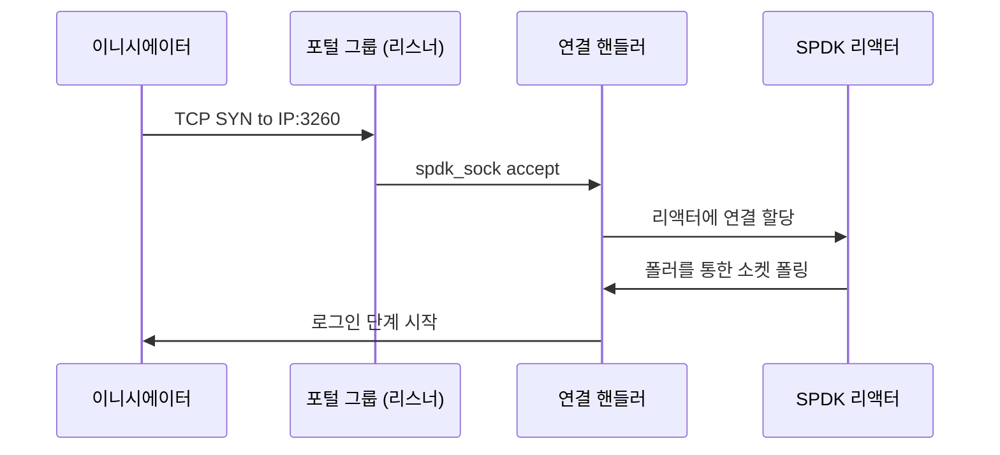

**RPC 구성**

```bash
# 포털 그룹 tag=1 생성, 10.0.0.1:3260에서 수신
scripts/rpc.py iscsi_create_portal_group 1 10.0.0.1:3260

# 여러 포털로 포털 그룹 생성
scripts/rpc.py iscsi_create_portal_group 1 "10.0.0.1:3260 10.0.0.2:3260"

# 포털 그룹 조회
scripts/rpc.py iscsi_get_portal_groups
```

**포털 그룹 제한**

```c
#define MAX_PORTAL      1024    /* 최대 포털 (IP:port 쌍) 수 */
#define MAX_PORTAL_ADDR 256     /* 최대 IP 주소 문자열 길이 */
#define MAX_PORTAL_PORT 32      /* 최대 포트 문자열 길이 */
```

---

### 개념 4: 로그인 단계와 파라미터 협상

로그인 단계는 이니시에이터와 타겟이 서로를 인증하고 운영 파라미터를 협상하는 단계입니다. 두 개의 하위 단계에 걸쳐 여러 PDU 교환으로 구성됩니다.

**로그인 상태 머신**

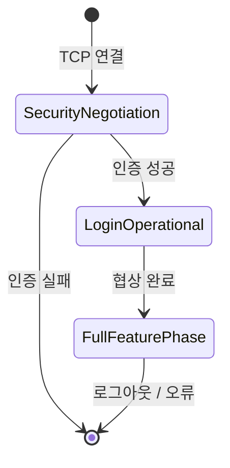

**로그인 PDU 헤더**

```c
struct iscsi_bhs_login_req {
    uint8_t opcode      : 6;   /* 0x03 */
    uint8_t immediate   : 1;
    uint8_t reserved    : 1;
    uint8_t flags;             /* T/C/CSG/NSG 비트 */
    uint8_t version_max;       /* 지원하는 최대 iSCSI 버전 */
    uint8_t version_min;       /* 지원하는 최소 iSCSI 버전 */
    uint8_t total_ahs_len;
    uint8_t data_segment_len[3];
    uint8_t isid[6];           /* 이니시에이터 세션 ID */
    uint16_t tsih;             /* 타겟 세션 ID 핸들 */
    uint32_t itt;
    /* ... */
};
```

**협상 파라미터**

로그인 PDU의 데이터 세그먼트에는 키=값 텍스트 쌍이 포함됩니다. SPDK는 다음을 협상합니다:

| 파라미터 | 기본값 | 설명 |
|-----------|---------|-------------|
| `MaxRecvDataSegmentLength` | 65536 | 최대 PDU 데이터 페이로드 (연결 당) |
| `MaxBurstLength` | 1048576 | 명령 당 최대 비요청 + Data-Out |
| `FirstBurstLength` | 8192 | 명령 당 최대 비요청 데이터 |
| `InitialR2T` | Yes | Data-Out 전에 R2T가 필요한지 여부 |
| `ImmediateData` | Yes | 명령 PDU와 함께 비요청 데이터 허용 |
| `DataPDUInOrder` | Yes | PDU가 순서대로 도착해야 함 |
| `DataSequenceInOrder` | Yes | 시퀀스가 순서대로여야 함 |
| `ErrorRecoveryLevel` | 0 | 0=세션, 1=다이제스트, 2=연결 |
| `HeaderDigest` | None | PDU 헤더의 CRC32C 다이제스트 |
| `DataDigest` | None | PDU 데이터의 CRC32C 다이제스트 |
| `MaxOutstandingR2T` | 1 | 명령 당 최대 동시 R2T |
| `DefaultTime2Wait` | 2 | 재연결 전 대기 시간(초) |
| `DefaultTime2Retain` | 20 | 실패 후 세션 유지 시간(초) |

**`lib/iscsi/iscsi.h`의 SPDK 기본값**:

```c
#define SPDK_ISCSI_MAX_RECV_DATA_SEGMENT_LENGTH  65536
#define SPDK_ISCSI_MAX_BURST_LENGTH   \
        (SPDK_ISCSI_MAX_RECV_DATA_SEGMENT_LENGTH * MAX_DATA_OUT_PER_CONNECTION)
/* = 65536 * 16 = 1,048,576 바이트 */
#define SPDK_ISCSI_FIRST_BURST_LENGTH  8192

#define DEFAULT_MAXR2T                 4
#define DEFAULT_MAXOUTSTANDINGR2T      1
#define DEFAULT_INITIALR2T             true
#define DEFAULT_IMMEDIATEDATA          true
#define DEFAULT_DATAPDUINORDER         true
#define DEFAULT_DATASEQUENCEINORDER    true
#define DEFAULT_ERRORRECOVERYLEVEL     0
#define DEFAULT_DEFAULTTIME2WAIT       2
#define DEFAULT_DEFAULTTIME2RETAIN     20
```

---

### 개념 5: CHAP 인증

CHAP(Challenge Handshake Authentication Protocol)은 iSCSI의 표준 인증 메커니즘입니다. SPDK는 단방향 및 양방향 CHAP을 모두 지원합니다.

**CHAP 교환**

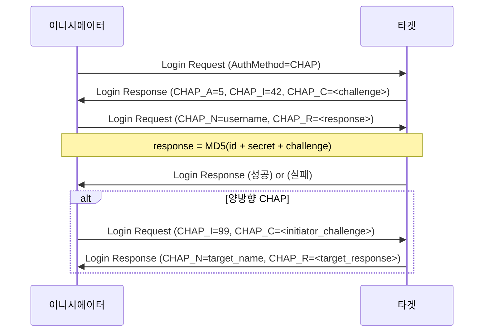

**RPC를 통한 CHAP 구성**

```bash
# 전역 CHAP 인증 모드 설정
# 0 = 비활성, 1 = CHAP (단방향), 2 = 양방향 CHAP
scripts/rpc.py iscsi_set_options \
    --chap-group 0 \
    --require-chap \
    --mutual-chap

# 인증 그룹에 CHAP 자격 증명 추가
scripts/rpc.py iscsi_create_auth_group 1
scripts/rpc.py iscsi_auth_group_add_secrets 1 \
    --user myuser \
    --secret mysecret \
    --muser mytargetname \
    --msecret mytargetsecret

# 타겟 노드에 인증 그룹 바인딩
scripts/rpc.py iscsi_create_target_node \
    Target0 Target0_alias \
    MyBdev:0 \
    1:2 \
    64 \
    --chap-group 1 \
    --require-chap
```

**단방향 vs 양방향 CHAP**

| 모드 | 이니시에이터가 타겟에 인증 | 타겟이 이니시에이터에 인증 |
|------|----------------------------------|----------------------------------|
| None | 아니오 | 아니오 |
| 단방향 CHAP | 예 | 아니오 |
| 양방향 CHAP | 예 | 예 |

양방향 CHAP은 악의적인 타겟이 실제 스토리지 타겟을 사칭하는 중간자 공격(man-in-the-middle attack)을 방지합니다.

---

### 개념 6: 타겟 노드와 LUN 구성

타겟 노드는 iSCSI 타겟 정체성입니다. 하나의 IQN을 하나 이상의 LUN에 매핑하며, 각 LUN은 SPDK bdev로 뒷받침됩니다.

**타겟 노드 구조**

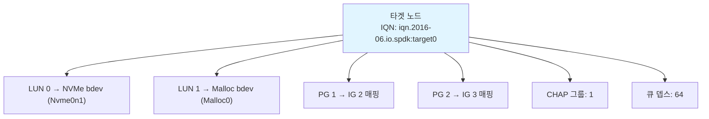

**전체 타겟 생성**

```bash
# 단계 1: 스토리지를 뒷받침할 bdev 생성
scripts/rpc.py bdev_malloc_create -b Malloc0 64 512

# 단계 2: 포털 그룹 생성 (수신할 IP:port)
scripts/rpc.py iscsi_create_portal_group 1 10.0.0.1:3260

# 단계 3: 이니시에이터 그룹 생성 (누가 연결할 수 있는지)
# ANY = 모든 IQN 수락; 넷마스크로 IP 제한
scripts/rpc.py iscsi_create_initiator_group 2 ANY 10.0.0.0/24

# 단계 4: 타겟 노드 생성
# 구문: iscsi_create_target_node <name> <alias> <bdev:lun_id> \
#         <portal_grp_tag:initiator_grp_tag> <queue_depth> [options]
scripts/rpc.py iscsi_create_target_node \
    Target0 \
    "Target0 Alias" \
    "Malloc0:0" \
    "1:2" \
    64

# 단계 5: 확인
scripts/rpc.py iscsi_get_target_nodes
```

**여러 LUN**

```bash
# 여러 LUN으로 타겟 생성
scripts/rpc.py iscsi_create_target_node \
    Target0 \
    "Multi-LUN Target" \
    "NVMe0n1:0 Malloc0:1 Malloc1:2" \
    "1:2" \
    64
```

**기존 타겟에 LUN 추가**

```bash
scripts/rpc.py iscsi_target_node_add_lun \
    iqn.2016-06.io.spdk:Target0 \
    Malloc2 \
    3   # LUN ID
```

**타겟 노드 제한**

```c
/* From lib/iscsi/iscsi.h */
#define MAX_INITIATOR    256    /* 타겟 당 최대 이니시에이터 수 */
#define MAX_NETMASK      256    /* 최대 넷마스크 항목 수 */
#define MAX_TARGET_NAME  223    /* 최대 IQN 길이 (RFC 3720) */
#define MAX_INITIATOR_NAME 223
```

---

### 개념 7: 디스커버리 서비스

이니시에이터가 타겟에 연결하기 전에, 사용 가능한 타겟을 발견해야 합니다. iSCSI는 이 목적을 위해 디스커버리 세션(discovery session)을 사용합니다.

**디스커버리 흐름**

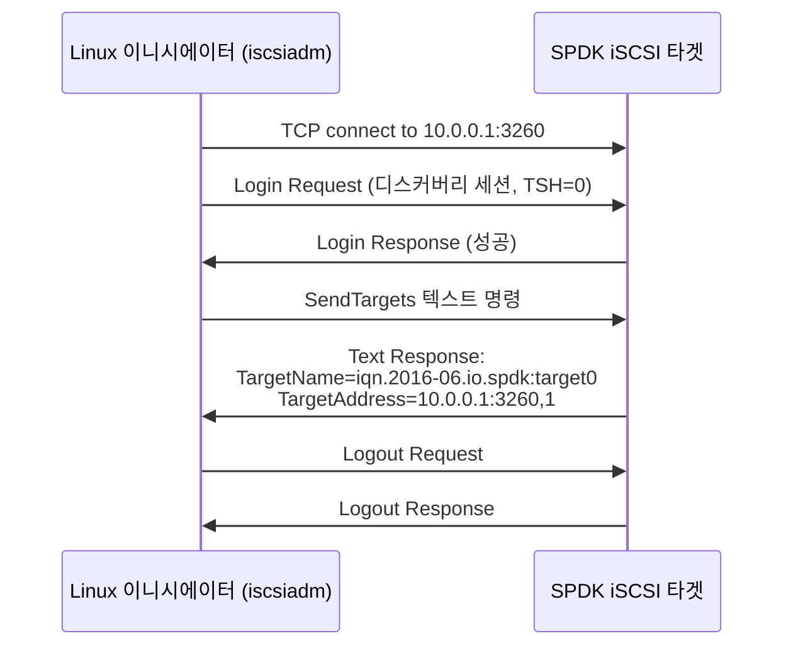

**디스커버리 명령**

```bash
# 포털에서 모든 타겟 발견
iscsiadm -m discovery -t sendtargets -p 10.0.0.1

# 예상 출력:
# 10.0.0.1:3260,1 iqn.2016-06.io.spdk:Target0

# 발견된 모든 타겟에 로그인
iscsiadm -m node --login

# 특정 타겟에 로그인
iscsiadm -m node \
    --targetname iqn.2016-06.io.spdk:Target0 \
    --portal 10.0.0.1:3260 \
    --login
```

**디스커버리 vs 일반 세션**

| 항목 | 디스커버리 세션 | 일반 세션 |
|--------|-------------------|----------------|
| TSIH | 0 | 0이 아닌 값 |
| 허용 명령 | SendTargets 텍스트만 | 전체 SCSI |
| LUN 접근 | 없음 | 전체 |
| 인증 | 선택사항 (구성 가능) | 타겟 구성에 따라 |

SPDK는 동일한 연결 경로를 통해 디스커버리 세션을 처리합니다 — 타겟은 이니시에이터의 IP가 볼 수 있는 모든 타겟 노드(이니시에이터 그룹 멤버십 기반)를 열거하여 `SendTargets` 텍스트 명령에 응답합니다.

---

### 개념 8: PDU 처리 파이프라인

이것은 핵심 I/O 경로입니다. 성능 분석을 위해 이해가 필수적입니다.

**쓰기 경로 (이니시에이터 → 타겟)**

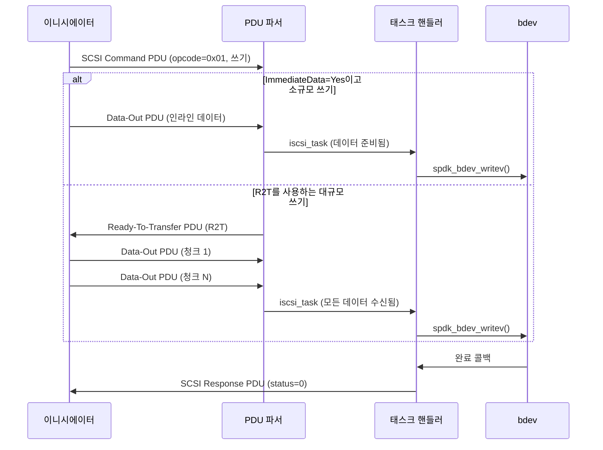

**읽기 경로 (타겟 → 이니시에이터)**

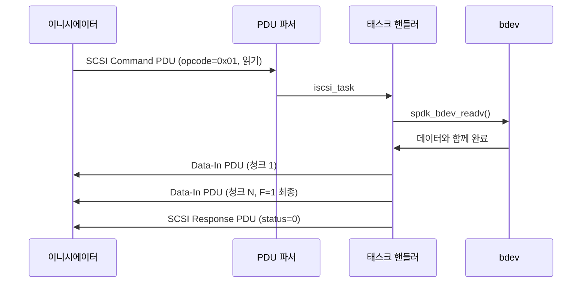

**SPDK 계층을 통한 태스크 흐름**

```c
/*
 * SCSI 읽기 명령의 간략화된 호출 체인:
 *
 * iscsi_conn_sock_cb()          <- 소켓 폴러 발동
 *   -> iscsi_conn_read_pdu()    <- TCP에서 바이트 읽기
 *     -> iscsi_pdu_payload_op_scsi()   <- SCSI opcode 디코딩
 *       -> spdk_iscsi_task_alloc()     <- 태스크 할당
 *         -> iscsi_tgt_node_execute()  <- LUN으로 라우팅
 *           -> spdk_scsi_dev_queue_task()  <- SCSI 계층
 *             -> spdk_bdev_readv()         <- bdev I/O
 *
 * 완료:
 * spdk_bdev_readv 완료
 *   -> spdk_scsi_task_process_status()
 *     -> iscsi_task_cpl()              <- 태스크 완료
 *       -> iscsi_conn_write_pdu()      <- Data-In + 응답 전송
 */
```

**소켓 폴링**

iSCSI 연결 I/O는 epoll/select가 아닌 SPDK의 소켓 폴러에 의해 구동됩니다:

```c
/* From lib/iscsi/conn.c */
static void
iscsi_conn_sock_cb(void *arg, struct spdk_sock_group *group,
                   struct spdk_sock *sock)
{
    struct spdk_iscsi_conn *conn = arg;
    /* 사용 가능한 데이터의 비차단 읽기 */
    /* 완료된 PDU 처리 */
    /* 응답 큐잉 */
}
```

이 콜백은 소켓에 데이터가 있을 때 매 리액터 폴 반복마다 발동됩니다 — 커널 블로킹 없음, 스레드 웨이크업 없음.

---

### 개념 9: 데이터 다이제스트와 오류 처리

iSCSI는 PDU 헤더와 데이터 세그먼트에 대한 선택적 CRC32C 다이제스트를 지원합니다. SPDK는 둘 다 지원합니다.

**다이제스트 구성**

```bash
# 전역적으로 헤더 및 데이터 다이제스트 활성화
scripts/rpc.py iscsi_set_options \
    --header-digest \
    --data-digest

# 또는 타겟 노드 생성 시 개별 설정
scripts/rpc.py iscsi_create_target_node \
    Target0 "Target0" "NVMe0n1:0" "1:2" 64 \
    --header-digest \
    --data-digest
```

**다이제스트 오버헤드**

| 다이제스트 모드 | 오버헤드 | 사용 사례 |
|-------------|----------|----------|
| None | 0 바이트 | 신뢰할 수 있는 사설 네트워크 |
| HeaderDigest만 | PDU 당 4 바이트 | 헤더 손상 감지 |
| DataDigest만 | 데이터 PDU 당 4 바이트 | 데이터 손상 감지 |
| 둘 다 | 데이터 PDU 당 4+4 바이트 | 최대 무결성 |

CRC32C 연산은 사용 가능한 경우 하드웨어 명령(x86의 SSE4.2 `PCRC32`)으로 가속됩니다.

**태스크 관리 기능**

SPDK는 전체 iSCSI 태스크 관리 기능 세트를 처리합니다:

```c
/* From include/spdk/iscsi_spec.h */
enum iscsi_task_func {
    ISCSI_TASK_FUNC_ABORT_TASK           = 1,
    ISCSI_TASK_FUNC_ABORT_TASK_SET       = 2,
    ISCSI_TASK_FUNC_CLEAR_ACA            = 3,
    ISCSI_TASK_FUNC_CLEAR_TASK_SET       = 4,
    ISCSI_TASK_FUNC_LOGICAL_UNIT_RESET   = 5,
    ISCSI_TASK_FUNC_TARGET_WARM_RESET    = 6,
    ISCSI_TASK_FUNC_TARGET_COLD_RESET    = 7,
    ISCSI_TASK_FUNC_TASK_REASSIGN        = 8,
};
```

이들은 SPDK SCSI 계층에 매핑됩니다:

```c
/* From include/spdk/scsi.h */
enum spdk_scsi_task_func {
    SPDK_SCSI_TASK_FUNC_ABORT_TASK     = 0,
    SPDK_SCSI_TASK_FUNC_ABORT_TASK_SET,
    SPDK_SCSI_TASK_FUNC_CLEAR_TASK_SET,
    SPDK_SCSI_TASK_FUNC_LUN_RESET,
    SPDK_SCSI_TASK_FUNC_TARGET_RESET,
};
```

---

### 개념 10: SCSI 계층 통합

SPDK iSCSI 타겟은 bdev와 직접 통신하지 않습니다. SCSI 에뮬레이션 계층(`lib/scsi`)을 거치며, 이 계층이 iSCSI 프로토콜 계층에 적절한 SCSI 장치 모델을 제공합니다.

**SCSI 태스크 구조**

```c
/* From include/spdk/scsi.h */
struct spdk_scsi_task {
    uint8_t status;                /* SAM-5 상태 (GOOD, CHECK CONDITION 등) */
    uint8_t function;              /* 태스크 관리 기능 */
    uint8_t response;             /* 태스크 관리 응답 */

    struct spdk_scsi_lun    *lun;           /* 타겟 LUN */
    struct spdk_scsi_port   *target_port;
    struct spdk_scsi_port   *initiator_port;

    spdk_scsi_task_cpl  cpl_fn;    /* 완료 콜백 */
    spdk_scsi_task_free free_fn;   /* 해제 콜백 */

    uint32_t transfer_len;         /* 요청된 바이트 */
    uint32_t data_transferred;     /* 실제 이동된 바이트 */
    uint64_t offset;               /* 바이트 오프셋 */
    uint8_t *cdb;                  /* SCSI Command Descriptor Block */
    /* ... */
};
```

**SCSI → bdev 변환**

SCSI 계층은 SCSI CDB(READ(10), WRITE(10), INQUIRY 등)를 bdev 연산으로 변환합니다:

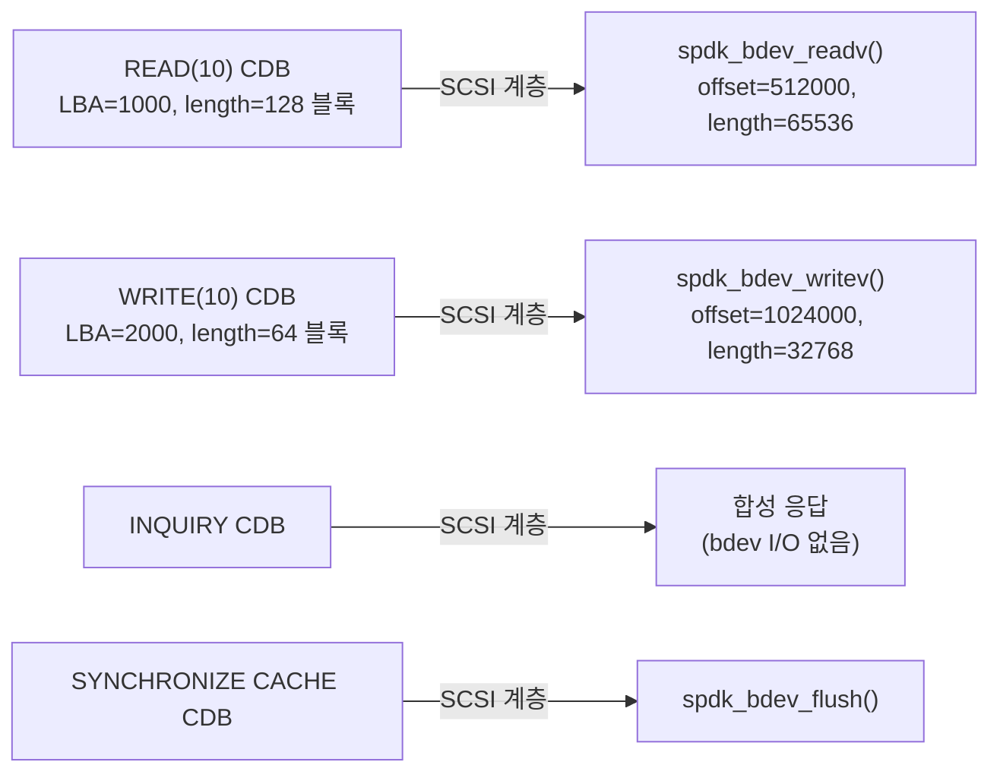

**LUN 번호**

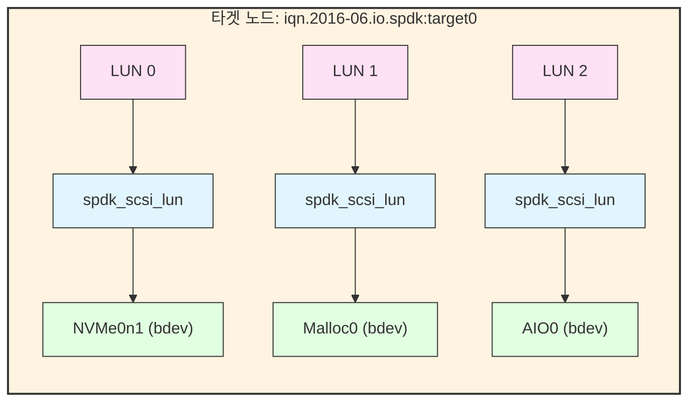

---

## 전체 구성 예시

### 전체 iSCSI 타겟 설정

이 예시는 NVMe 기반 스토리지, CHAP, 이중 포털 HA 구성을 갖춘 프로덕션급 구성을 설정합니다.

```bash
#!/bin/bash
# 완전한 SPDK iSCSI 타겟 구성

SPDK_DIR="/path/to/spdk"
RPC="$SPDK_DIR/scripts/rpc.py"

# 1. 애플리케이션 시작 (iSCSI 폴링을 위한 2개 코어)
$SPDK_DIR/build/bin/iscsi_tgt -m 0x3 &
sleep 2

# 2. 전역 iSCSI 옵션 설정
$RPC iscsi_set_options \
    --node-base "iqn.2016-06.io.spdk" \
    --max-sessions 128 \
    --max-connections-per-session 2 \
    --max-queue-depth 64 \
    --no-discovery-auth

# 3. NVMe bdev 생성
$RPC bdev_nvme_attach_controller \
    -b NVMe0 \
    -t pcie \
    -a 0000:00:01.0

# 4. 포털 그룹 생성
#    PG 1: 기본 포털
$RPC iscsi_create_portal_group 1 10.0.0.1:3260

#    PG 2: HA를 위한 보조 포털
$RPC iscsi_create_portal_group 2 10.0.0.2:3260

# 5. 이니시에이터 그룹 생성
#    IG 1: IQN별 신뢰 서버
$RPC iscsi_create_initiator_group 1 \
    iqn.1993-08.org.debian:server01 \
    192.168.1.0/24

#    IG 2: 개방 접근 (개발/테스트 전용)
$RPC iscsi_create_initiator_group 2 ANY 0.0.0.0/0

# 6. 프로덕션용 CHAP 인증 그룹 생성
$RPC iscsi_create_auth_group 1
$RPC iscsi_auth_group_add_secrets 1 \
    --user spdk_client \
    --secret "s3cr3t_p@ssword" \
    --muser spdk_target \
    --msecret "t@rget_s3cr3t"

# 7. 프로덕션 타겟 노드 생성 (NVMe, CHAP, 양쪽 포털)
$RPC iscsi_create_target_node \
    NVMeTarget \
    "NVMe Production Target" \
    "NVMe0n1:0" \
    "1:1 2:1" \
    64 \
    --chap-group 1 \
    --require-chap \
    --mutual-chap

# 8. 개발 타겟 생성 (인증 없음, malloc bdev)
$RPC bdev_malloc_create -b Malloc0 256 512
$RPC iscsi_create_target_node \
    DevTarget \
    "Dev Target - No Auth" \
    "Malloc0:0" \
    "1:2" \
    64 \
    --no-auth-chap

# 9. 구성 확인
echo "=== 포털 그룹 ==="
$RPC iscsi_get_portal_groups

echo "=== 이니시에이터 그룹 ==="
$RPC iscsi_get_initiator_groups

echo "=== 타겟 노드 ==="
$RPC iscsi_get_target_nodes
```

### Linux 이니시에이터 연결

```bash
# open-iscsi 설치
apt-get install -y open-iscsi   # Ubuntu/Debian
yum install -y iscsi-initiator-utils  # RHEL/CentOS/Fedora

# /etc/iscsi/iscsid.conf 성능 튜닝
cat >> /etc/iscsi/iscsid.conf << 'EOF'
node.session.cmds_max = 4096
node.session.queue_depth = 128
EOF

# 커널 네트워크 튜닝 적용
sysctl -w net.ipv4.tcp_timestamps=1
sysctl -w net.ipv4.tcp_sack=0
sysctl -w net.ipv4.tcp_rmem="10000000 10000000 10000000"
sysctl -w net.ipv4.tcp_wmem="10000000 10000000 10000000"
sysctl -w net.core.rmem_max=524287
sysctl -w net.core.wmem_max=524287
sysctl -w net.core.netdev_max_backlog=300000

# iscsid 재시작
systemctl restart iscsid

# 타겟 발견
iscsiadm -m discovery -t sendtargets -p 10.0.0.1

# 연결 (먼저 CHAP 자격 증명 설정)
iscsiadm -m node \
    --targetname iqn.2016-06.io.spdk:NVMeTarget \
    --op update \
    --name node.session.auth.authmethod \
    --value CHAP

iscsiadm -m node \
    --targetname iqn.2016-06.io.spdk:NVMeTarget \
    --op update \
    --name node.session.auth.username \
    --value spdk_client

iscsiadm -m node \
    --targetname iqn.2016-06.io.spdk:NVMeTarget \
    --op update \
    --name node.session.auth.password \
    --value "s3cr3t_p@ssword"

# 로그인
iscsiadm -m node \
    --targetname iqn.2016-06.io.spdk:NVMeTarget \
    --login

# 확인 - 장치가 /dev/sdX로 나타나야 함
lsblk
dmesg | tail -20

# 빠른 성능 테스트 실행
fio --name=test \
    --filename=/dev/sdb \
    --rw=randread \
    --bs=4k \
    --iodepth=128 \
    --numjobs=1 \
    --runtime=60 \
    --time_based \
    --ioengine=libaio \
    --direct=1
```

---

## 성능 튜닝

### CPU 코어 할당

iSCSI는 모든 데이터 바이트가 사용자 공간 TCP 처리를 거치기 때문에 CPU 집약적입니다. 같은 NUMA 노드에서 NIC와 NVMe 장치 모두에 물리적으로 가까운 코어에 iSCSI 폴링 스레드를 고정하세요.

```bash
# NUMA 토폴로지 확인
numactl --hardware
lspci -v | grep -A5 "Ethernet\|NVMe"

# NUMA 노드 0 코어 0-7에서 iscsi_tgt 실행
build/bin/iscsi_tgt \
    -m 0xFF \              # 코어 0-7
    --huge-unlink \
    -L iscsi               # iSCSI 디버그 로그 활성화

# 또는 명시적 NUMA 할당으로
numactl --cpunodebind=0 --membind=0 \
    build/bin/iscsi_tgt -m 0xFF
```

### 주요 튜닝 파라미터

**큐 뎁스(Queue Depth)**

```bash
# 타겟 당 큐 뎁스 (기본 64, 범위 1-128)
# 높을수록 = 더 많은 동시 명령 = 더 나은 처리량
# 낮을수록 = 적은 메모리, 경부하에서 낮은 지연 시간
scripts/rpc.py iscsi_create_target_node \
    Target0 "Target0" "NVMe0n1:0" "1:2" \
    128   # <-- 큐 뎁스
```

**MaxR2T와 Data Out**

```bash
# MaxR2T: 명령 당 최대 동시 Ready-To-Transfer
# 더 많은 R2T = 대규모 쓰기에 대한 더 많은 병렬성
scripts/rpc.py iscsi_set_options --max-r2t 8

# First Burst Length: R2T 없이 인라인 데이터
# 클수록 = 소규모 쓰기에 대한 더 적은 라운드 트립
# MaxBurstLength 이하여야 함
scripts/rpc.py iscsi_set_options --first-burst-length 65536
```

**대규모 블록 워크로드에서 ImmediateData 비활성화**

```bash
# 대규모 순차 쓰기의 경우 ImmediateData를 비활성화하면
# 타겟이 R2T를 통해 데이터 흐름을 완전히 제어할 수 있어
# 버퍼 압력이 감소합니다
scripts/rpc.py iscsi_set_options --no-immediate-data
```

**신뢰할 수 있는 네트워크에서 다이제스트 비활성화**

```bash
# 다이제스트는 PDU 당 ~200ns의 CRC32C 연산을 추가합니다
# 신뢰할 수 있는 사설 네트워크에서는 건너뛰세요
scripts/rpc.py iscsi_create_target_node \
    Target0 "Target0" "NVMe0n1:0" "1:2" 64
    # --header-digest와 --data-digest 생략
```

### 튜닝 비교 표

| 설정 | 지연 시간 | 처리량 | CPU | 메모리 | 권장사항 |
|---------|---------|------------|-----|--------|----------------|
| Queue Depth 64 | 기준선 | 기준선 | 기준선 | 낮음 | 기본값 |
| Queue Depth 128 | +2% | +15% | +5% | 2배 | 높은 처리량 |
| HeaderDigest ON | +5% | -3% | +10% | 최소 | 신뢰할 수 없는 네트워크 |
| DataDigest ON | +8% | -5% | +15% | 최소 | 신뢰할 수 없는 네트워크 |
| FirstBurst 64KB | -10% | +8% | 중립 | +버퍼 | 대규모 쓰기 워크로드 |
| MaxR2T 8 | 중립 | +12% | +5% | +버퍼 | 대규모 쓰기 병렬성 |

### 모니터링

```bash
# 활성 연결 및 세션 감시
scripts/rpc.py iscsi_get_connections

# 예상 출력 형식:
# {
#   "id": 0,
#   "cid": 0,
#   "tsih": 1,
#   "lcore_id": 2,
#   "initiator_addr": "192.168.1.100",
#   "target_addr": "10.0.0.1",
#   "target_node_name": "iqn.2016-06.io.spdk:Target0"
# }

# iSCSI에 대한 SPDK 트레이싱 활성화
scripts/rpc.py trace_enable_tpoint_group iscsi

# LUN 당 bdev I/O 통계 확인
scripts/rpc.py bdev_get_iostat

# SPDK 성능 리포트 (실시간)
scripts/spdk_top.py
```

---

## 일반적인 함정과 문제 해결

### 함정 1: NUMA 불일치

**증상**: 낮은 처리량, 높은 CPU 사용률, 불규칙한 지연 시간 스파이크.

**원인**: iSCSI 폴링 스레드가 NIC 또는 NVMe 장치와 다른 NUMA 노드에 있음.

**해결**:
```bash
# NIC NUMA 노드 찾기
cat /sys/class/net/eth0/device/numa_node

# NVMe NUMA 노드 찾기
cat /sys/bus/pci/devices/0000:00:01.0/numa_node

# 일치하는 NUMA 노드에 iscsi_tgt 코어 할당
build/bin/iscsi_tgt -m 0xFF  # 올바른 노드의 코어 사용
```

### 함정 2: 이니시에이터 그룹 불일치

**증상**: "initiator not found"로 로그인 실패 또는 디스커버리에서 타겟이 반환되지 않음.

**원인**: 이니시에이터 IQN 또는 IP가 타겟에 매핑된 어떤 이니시에이터 그룹에도 포함되지 않음.

**해결**:
```bash
# 이니시에이터가 연결하는 IP 확인
scripts/rpc.py iscsi_get_connections

# 이니시에이터 그룹에 해당 IP가 포함되는지 확인
scripts/rpc.py iscsi_get_initiator_groups

# 누락된 경우 이니시에이터 추가
scripts/rpc.py iscsi_initiator_group_add_initiators 2 \
    --initiators "iqn.1993-08.org.debian:server02" \
    --netmasks "192.168.2.0/24"
```

### 함정 3: MaxConnections 고갈

**증상**: "too many connections"으로 새 연결이 거부됨.

**원인**: `MAX_ISCSI_CONNECTIONS` (1024) 또는 세션 당 제한에 도달.

**해결**:
```bash
# 활성 연결 확인
scripts/rpc.py iscsi_get_connections | python3 -c \
    "import json,sys; d=json.load(sys.stdin); print(f'Active: {len(d)}')"

# 세션 당 연결 수 증가
scripts/rpc.py iscsi_set_options \
    --max-connections-per-session 4
```

### 함정 4: TCP 버퍼 고갈

**증상**: 처리량 감소, `netstat -s`에서 TCP 재전송이 보임.

**원인**: 고처리량 iSCSI에 비해 커널 TCP 버퍼가 너무 작음.

**해결**:
```bash
# 이니시에이터 측에 적용
sysctl -w net.ipv4.tcp_rmem="10000000 10000000 10000000"
sysctl -w net.ipv4.tcp_wmem="10000000 10000000 10000000"
sysctl -w net.core.rmem_max=524287
sysctl -w net.core.wmem_max=524287
```

### 함정 5: 이니시에이터의 오래된 타겟 캐시

**증상**: 타겟 재구성 후 이니시에이터가 이전 포털에 연결.

**해결**:
```bash
# 캐시된 노드 정보 삭제
iscsiadm -m node -o delete

# 재발견
iscsiadm -m discovery -t sendtargets -p 10.0.0.1
iscsiadm -m node --login
```

---

## 아키텍처 심층 분석: 연결 생명주기

iSCSI 연결의 전체 생명주기를 이해하면 성능이 어디에서 득실되는지 알 수 있습니다.

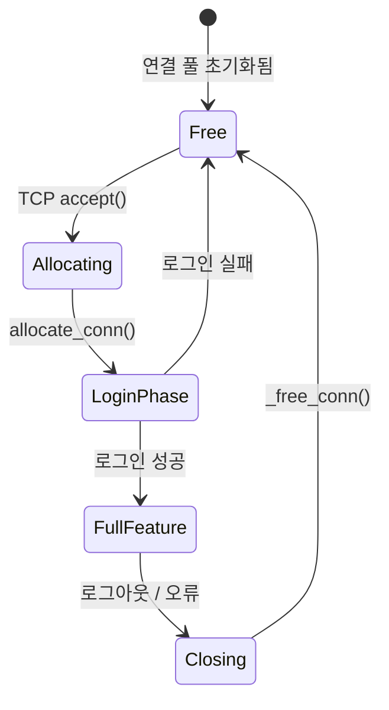

**연결 풀**

SPDK는 핫 경로에서 malloc을 피하기 위해 시작 시 모든 연결 구조체를 사전 할당합니다:

```c
/* From lib/iscsi/conn.c */
int
initialize_iscsi_conns(void)
{
    /* 모든 MAX_ISCSI_CONNECTIONS (1024) 연결 구조체 사전 할당 */
    g_conns_array = calloc(MAX_ISCSI_CONNECTIONS,
                           sizeof(struct spdk_iscsi_conn));

    for (i = 0; i < MAX_ISCSI_CONNECTIONS; i++) {
        TAILQ_INSERT_TAIL(&g_free_conns, &g_conns_array[i], conn_link);
    }
}
```

**리액터에 대한 연결 할당**

새 TCP 연결이 수락되면 라운드 로빈(round-robin) 또는 최소 부하 정책을 사용하여 리액터(SPDK 스레드)에 할당됩니다. 할당 후에는 해당 연결의 모든 I/O가 크로스 스레드 동기화 없이 해당 리액터에서 실행됩니다.
