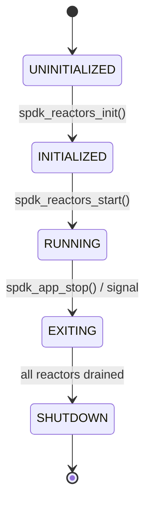
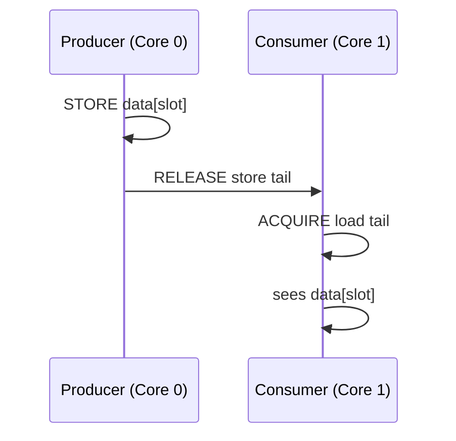
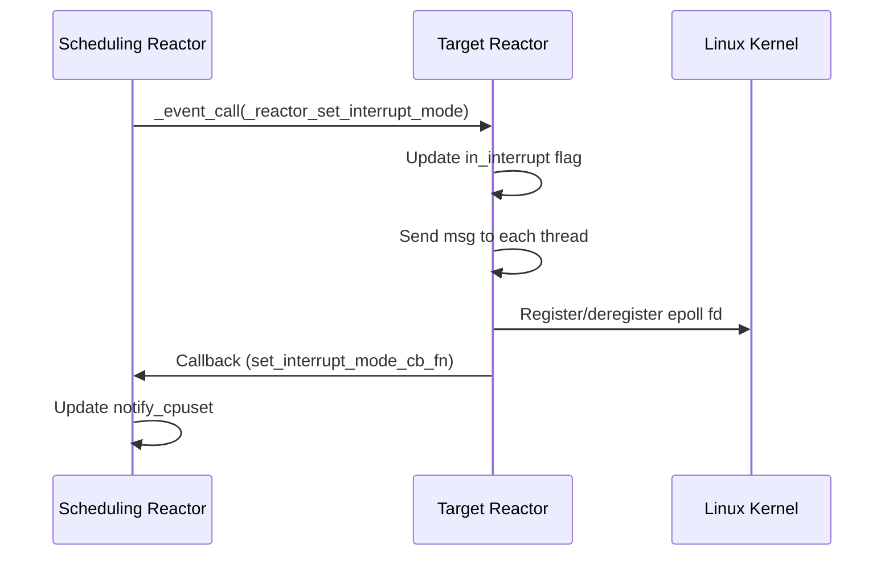
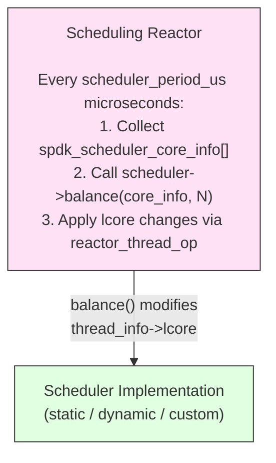
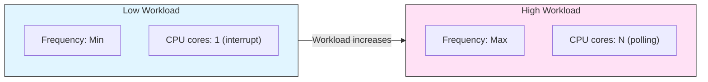

# 모듈 24: 고급 스레딩 패턴 (Advanced Threading Patterns)

**단계**: 3 (마스터리)
**난이도**: 고급
**예상 소요 시간**: 6시간
**Prerequisites**: Module 04 (Threading Model), Module 05 (I/O Channels), Module 08 (Event Framework), Module 20 (Performance Tuning)

**버전 이력**:
- v1.0 (2026-03-30): 최초 버전

---

## 학습 목표

By the end of this module, you will be able to:
- Explain the multi-reactor architecture in depth, including initialization and lifecycle
- Implement cross-reactor coordination using events and for-each patterns
- Apply lock-free algorithms (SPDK rings, CAS) in your own code
- Understand memory ordering requirements and when barriers are needed
- Configure and switch between polling mode, interrupt mode, and hybrid mode
- Implement thread migration strategies using the scheduler framework
- Write a custom scheduler with a `balance()` function
- Use the governor framework to control per-core CPU frequency
- Diagnose threading problems using context-switch monitors and TSC-based stats

---

## 개요

Module 04 gave you the vocabulary of SPDK threading: reactors, pollers, messages, channels. This module goes deeper. You will read actual reactor initialization code, trace how events cross reactor boundaries, and understand the load-balancing engine that decides which thread lives on which core.

### 마스터리 수준에서 이것이 중요한 이유

Most SPDK bugs in production fall into three categories:

1. **Cross-thread data access** — code that accidentally touches data owned by another thread
2. **Scheduler misconfiguration** — threads pinned to wrong cores, CPU frequency not matching workload
3. **Polling vs. interrupt mode confusion** — hybrid setups where some pollers are never triggered

All three require deep knowledge of the patterns in this module.

---

## Section 1: Multi-Reactor Architecture — Deep Dive

### 1.1 Reactor Initialization

The reactor array is the backbone of SPDK's multi-core execution. At startup, `spdk_reactors_init()` allocates one `spdk_reactor` per logical core and aligns the array to a 64-byte cache-line boundary:

```c
/* lib/event/reactor.c */
static struct spdk_reactor *g_reactors;
static uint32_t g_reactor_count;
static enum spdk_reactor_state g_reactor_state = SPDK_REACTOR_STATE_UNINITIALIZED;

int
spdk_reactors_init(size_t msg_mempool_size)
{
    /* struct spdk_reactor must be aligned on 64 byte boundary */
    g_reactor_count = spdk_env_get_last_core() + 1;
    rc = posix_memalign((void **)&g_reactors, 64,
                        g_reactor_count * sizeof(struct spdk_reactor));

    /* Initialize thread library with our op callbacks */
    rc = spdk_thread_lib_init_ext(reactor_thread_op,
                                  reactor_thread_op_supported,
                                  sizeof(struct spdk_lw_thread),
                                  msg_mempool_size);

    SPDK_ENV_FOREACH_CORE(i) {
        reactor_construct(&g_reactors[i], i);
    }

    /* The first reactor to run becomes the scheduling reactor by default */
    current_core = spdk_env_get_current_core();
    reactor = spdk_reactor_get(current_core);
    g_scheduling_reactor = reactor;

    g_reactor_state = SPDK_REACTOR_STATE_INITIALIZED;
    return 0;
}
```

**Key observations**:

- `posix_memalign(..., 64, ...)` — cache-line alignment prevents false sharing between adjacent reactor structs
- `spdk_thread_lib_init_ext` registers `reactor_thread_op` as the callback that handles thread migration requests from the scheduler
- `g_scheduling_reactor` designates one reactor as the one responsible for running the scheduler's `balance()` function
- Every reactor gets its own `events` ring created in `reactor_construct()`

### 1.2 Per-Reactor Event Ring

Each reactor has a lock-free multi-producer, single-consumer (MP-SC) ring:

```c
static void
reactor_construct(struct spdk_reactor *reactor, uint32_t lcore)
{
    reactor->lcore = lcore;
    reactor->flags.is_valid = true;

    TAILQ_INIT(&reactor->threads);
    reactor->thread_count = 0;
    spdk_cpuset_zero(&reactor->notify_cpuset);

    /* 65536-entry MP-SC ring for cross-reactor events */
    reactor->events = spdk_ring_create(SPDK_RING_TYPE_MP_SC,
                                       65536,
                                       SPDK_ENV_NUMA_ID_ANY);
    assert(reactor->events != NULL);

    /* Always initialize interrupt fd, even in polling mode */
    if (reactor_interrupt_init(reactor) != 0) {
        if (spdk_interrupt_mode_is_enabled()) {
            SPDK_ERRLOG("Failed to prepare intr facilities\n");
            assert(false);
        }
    }
}
```

**Why MP-SC?** Many threads (and external callers) can post events to any reactor, but only one OS thread (the reactor loop) consumes them. MP-SC rings are faster than general MP-MC rings because the consumer needs no CAS on dequeue.

### 1.3 Reactor State Machine



The global `g_reactor_state` is checked at the top of every reactor loop iteration. Once set to `SPDK_REACTOR_STATE_EXITING`, reactors finish their current work and exit.

### 1.4 The Reactor Loop

Each reactor runs a tight busy-poll loop (in polling mode):

```c
static int
reactor_run(void *arg)
{
    struct spdk_reactor *reactor = arg;
    struct spdk_lw_thread *lw_thread;
    struct spdk_thread *thread;
    uint64_t now;

    TAILQ_FOREACH(lw_thread, &reactor->threads, link) {
        thread = spdk_thread_get_from_ctx(lw_thread);
        spdk_set_thread(thread);
        spdk_thread_poll(thread, 0, 0);
        spdk_set_thread(NULL);
    }

    /* Process cross-reactor events */
    event_queue_run_batch(reactor);

    /* Run scheduler if period elapsed */
    _reactor_run_scheduler(reactor);
}
```

**`spdk_thread_poll(thread, 0, 0)`** — polling all pollers with no time limit means the thread runs until it voluntarily yields. The `0, 0` parameters say "run all pollers, don't limit by time".

---

## Section 2: Cross-Reactor Coordination

### 2.1 Event Posting: `spdk_event_call()`

The primary mechanism for sending work to another reactor is posting a `spdk_event`:

```c
/* lib/event/reactor.c */
void
spdk_event_call(struct spdk_event *event)
{
    int rc;
    struct spdk_reactor *reactor;
    struct spdk_reactor *local_reactor = NULL;
    uint32_t current_core = spdk_env_get_current_core();

    reactor = spdk_reactor_get(event->lcore);

    /* Enqueue into target reactor's MP-SC ring */
    rc = spdk_ring_enqueue(reactor->events, (void **)&event, 1, NULL);
    assert(rc == 1);

    if (current_core != SPDK_ENV_LCORE_ID_ANY) {
        local_reactor = spdk_reactor_get(current_core);
    }

    /* In interrupt mode, write to eventfd to wake the sleeping reactor */
    if (spdk_unlikely(local_reactor == NULL) ||
        spdk_unlikely(spdk_cpuset_get_cpu(&local_reactor->notify_cpuset,
                                          event->lcore))) {
        uint64_t notify = 1;
        rc = write(reactor->events_fd, &notify, sizeof(notify));
    }
}
```

**Critical detail**: In polling mode, no `write()` is needed because the destination reactor is already spinning and will see the ring entry on its next iteration. The `notify_cpuset` tracks which reactors are in interrupt mode; only those need a kernel wakeup via `eventfd`.

### 2.2 Allocating Events from the Mempool

Events are not heap-allocated per call. They come from a pre-allocated mempool:

```c
#define EVENT_MSG_MEMPOOL_SHIFT  14   /* 2^14 = 16384 */
#define EVENT_MSG_MEMPOOL_SIZE   ((1 << EVENT_MSG_MEMPOOL_SHIFT) - 1)  /* 16383 */

struct spdk_event *
spdk_event_allocate(uint32_t lcore, spdk_event_fn fn, void *arg1, void *arg2)
{
    struct spdk_event *event = spdk_mempool_get(g_spdk_event_mempool);
    assert(event != NULL);

    event->lcore = lcore;
    event->fn    = fn;
    event->arg1  = arg1;
    event->arg2  = arg2;

    return event;
}
```

**Why 16383 and not 16384?** Power-of-2 minus 1 is optimal for the DPDK ring implementation's internal size accounting. The ring requires a power-of-2 slot count; 16383 rounds up to 16384 internally while minimizing wasted metadata space.

### 2.3 `for_each_thread` Pattern

When you need to run a function on every SPDK thread (e.g., to drain a counter or update a configuration value), use `spdk_for_each_thread()`:

```c
/* Signature from include/spdk/thread.h */
void spdk_for_each_thread(spdk_msg_fn fn, void *ctx, spdk_msg_fn cpl);
```

**How it works internally**:

1. Posts a message to thread 0, which runs `fn(ctx)` and then posts to thread 1
2. Thread 1 runs `fn(ctx)` and posts to thread 2
3. ... and so on until all threads are visited
4. After the last thread, `cpl(ctx)` is called on the thread that initiated the iteration

**Usage pattern**:

```c
struct my_ctx {
    uint64_t total_ios;
    spdk_msg_fn completion_fn;
    void *completion_arg;
};

static void
count_ios_on_thread(void *arg)
{
    struct my_ctx *ctx = arg;
    /* Safe: we are executing ON this thread, no lock needed */
    ctx->total_ios += get_local_io_count();
}

static void
count_ios_complete(void *arg)
{
    struct my_ctx *ctx = arg;
    SPDK_NOTICELOG("Total IOs across all threads: %" PRIu64 "\n",
                   ctx->total_ios);
    free(ctx);
}

void
start_io_count(void)
{
    struct my_ctx *ctx = calloc(1, sizeof(*ctx));
    spdk_for_each_thread(count_ios_on_thread, ctx, count_ios_complete);
    /* Returns immediately; count_ios_complete called asynchronously */
}
```

**Rules**:
- `fn` is called sequentially, not in parallel — one thread at a time
- `fn` must not block
- `cpl` is always called, even if `fn` does nothing
- The caller thread must not be destroyed before `cpl` fires

### 2.4 `for_each_channel` Pattern

For device-level coordination, use `spdk_for_each_channel()`. This visits every I/O channel associated with a specific `io_device`:

```c
void spdk_for_each_channel(void *io_device,
                            spdk_channel_msg fn,
                            void *ctx,
                            spdk_channel_msg cpl);
```

The callback receives an `spdk_io_channel_iter` from which you extract the channel:

```c
static void
reset_channel_stats(struct spdk_io_channel_iter *i)
{
    struct spdk_io_channel *ch = spdk_io_channel_iter_get_channel(i);
    struct my_channel *my_ch = spdk_io_channel_get_ctx(ch);

    /* Zero per-channel stats; safe because we're on the channel's thread */
    memset(&my_ch->stats, 0, sizeof(my_ch->stats));

    /* MUST call this to advance to next channel */
    spdk_for_each_channel_continue(i, 0);
}

static void
reset_done(struct spdk_io_channel_iter *i, int status)
{
    struct my_ctx *ctx = spdk_io_channel_iter_get_ctx(i);
    ctx->cb(ctx->cb_arg, status);
    free(ctx);
}

void
my_device_reset_stats(struct my_device *dev, my_cb cb, void *cb_arg)
{
    struct my_ctx *ctx = malloc(sizeof(*ctx));
    ctx->cb = cb;
    ctx->cb_arg = cb_arg;
    spdk_for_each_channel(dev, reset_channel_stats, ctx, reset_done);
}
```

**Difference from `for_each_thread`**:
- `for_each_channel` only visits threads that have an open channel to `io_device`
- You must call `spdk_for_each_channel_continue(i, status)` in every `fn` invocation, or iteration stalls
- `status != 0` in `spdk_for_each_channel_continue()` aborts iteration and jumps to `cpl`

---

## Section 3: Lock-Free Algorithms in SPDK

### 3.1 SPDK Rings

SPDK uses DPDK's `rte_ring` under the hood. The ring is the fundamental lock-free data structure used everywhere: event queues, message passing, buffer pools.

**Ring types**:

| 타입 | 생산자 | 소비자 | 사용 사례 |
|------|-----------|-----------|----------|
| `SPDK_RING_TYPE_MP_MC` | Multiple | Multiple | General purpose |
| `SPDK_RING_TYPE_MP_SC` | Multiple | Single | Per-reactor event queues |
| `SPDK_RING_TYPE_SP_SC` | Single | Single | Single-producer pipelines |

**MP-SC enqueue (simplified algorithm)**:

```c
/* Producer side — atomic CAS to claim a slot */
do {
    old_head = ring->prod.head;
    new_head = old_head + n;
    /* CAS: if prod.head is still old_head, update to new_head */
} while (!__atomic_compare_exchange_n(&ring->prod.head,
                                       &old_head, new_head,
                                       false,
                                       __ATOMIC_ACQUIRE,
                                       __ATOMIC_RELAXED));

/* Write data into claimed slots */
for (i = 0; i < n; i++) {
    ring->ring[(old_head + i) & mask] = objs[i];
}

/* Update tail — wait for earlier producers to finish first */
while (ring->prod.tail != old_head) { /* spin */ }
__atomic_store_n(&ring->prod.tail, new_head, __ATOMIC_RELEASE);
```

**SC dequeue (no CAS needed)**:

```c
/* Consumer side — only one consumer, no CAS needed */
old_tail = ring->cons.tail;
n = ring->prod.tail - old_tail;  /* Available entries */

for (i = 0; i < n; i++) {
    objs[i] = ring->ring[(old_tail + i) & mask];
}

__atomic_store_n(&ring->cons.tail, old_tail + n, __ATOMIC_RELEASE);
```

The `SPDK_EVENT_BATCH_SIZE` (8) is how many events are dequeued per call in `event_queue_run_batch()`. Batching amortizes the atomic overhead.

### 3.2 Compare-and-Swap Patterns

SPDK code uses GCC built-ins for atomics directly:

```c
/* Atomic load */
uint64_t val = __atomic_load_n(&shared_var, __ATOMIC_ACQUIRE);

/* Atomic store */
__atomic_store_n(&shared_var, new_val, __ATOMIC_RELEASE);

/* CAS — returns true if swap occurred */
bool swapped = __atomic_compare_exchange_n(
    &shared_var,    /* pointer */
    &expected,      /* in/out: current expected value */
    desired,        /* new value if CAS succeeds */
    false,          /* strong CAS (retry on spurious failure) */
    __ATOMIC_ACQ_REL,  /* success order */
    __ATOMIC_RELAXED   /* failure order */
);

/* Fetch-and-add */
uint64_t prev = __atomic_fetch_add(&counter, 1, __ATOMIC_RELAXED);
```

**When SPDK needs CAS vs. simple store**:
- Simple `ATOMIC_STORE` is sufficient when only one writer exists (single-producer pattern)
- CAS is needed when multiple cores compete for the same slot (multi-producer ring head)
- Counters with a single owner thread use `RELAXED` ordering for maximum performance

### 3.3 Memory Barriers and Ordering

Memory ordering prevents the CPU (and compiler) from reordering loads and stores in ways that break concurrent code.

**SPDK uses three orderings most commonly**:

| C11 Memory Order | Meaning | SPDK Use Case |
|-----------------|---------|---------------|
| `RELAXED` | No ordering guarantee | Counters with single owner, statistics |
| `ACQUIRE` | Load sees all prior RELEASE stores | Reading ring head after CAS |
| `RELEASE` | Store visible to all subsequent ACQUIRE loads | Publishing ring tail after filling slots |
| `ACQ_REL` | Both acquire and release semantics | CAS in ring producers |
| `SEQ_CST` | Full sequential consistency | Rarely used; highest overhead |

**Practical example — ring produce/consume pair**:



The RELEASE on the producer's tail store and ACQUIRE on the consumer's tail load create a happens-before edge. The consumer is guaranteed to see `data[slot]` after seeing the updated tail.

**What happens without barriers** (incorrect code):

```c
/* WRONG: compiler/CPU may reorder these */
ring->data[slot] = my_data;
ring->tail = slot + 1;         /* CPU might reorder before data write */
```

**Correct pattern**:

```c
ring->data[slot] = my_data;
__atomic_store_n(&ring->tail, slot + 1, __ATOMIC_RELEASE);
/* Consumer uses ACQUIRE load to pair with this RELEASE */
```

---

## Section 4: Polling Mode vs. Interrupt Mode

### 4.1 Pure Polling Mode

In the default (polling) mode, each reactor spins continuously on its core — 100% CPU usage even when idle. This provides the lowest possible latency because:

- No kernel wake-up latency (no `epoll_wait` or `eventfd` read)
- No context switch overhead
- Cache lines stay hot on the core

**When to use**: Ultra-low-latency NVMe or RDMA workloads where microsecond variance is unacceptable.

**Cost**: Every core in the core mask burns 100% CPU regardless of load. A 16-core SPDK app uses 16 full cores even at 1% actual I/O load.

### 4.2 Interrupt Mode

When SPDK is started with `interrupt_mode = true` in app options:

```c
/* lib/event/app.c */
if (opts->interrupt_mode) {
    spdk_interrupt_mode_enable();
}
```

All reactors initialize with `in_interrupt = true` and sleep in `epoll_wait()` when idle. An `eventfd` write wakes the reactor when work arrives:

```c
/* lib/event/reactor.c — event_queue_run_batch() in interrupt mode */
if (spdk_unlikely(reactor->in_interrupt)) {
    count = spdk_ring_dequeue(reactor->events, events, SPDK_EVENT_BATCH_SIZE);

    /* If more events remain, re-arm the eventfd immediately */
    if (spdk_ring_count(reactor->events) != 0) {
        uint64_t notify = 1;
        write(reactor->events_fd, &notify, sizeof(notify));
    }
}
```

**When to use**: Storage gateway applications, RPC servers, or any workload where CPU efficiency matters more than tail latency.

**Cost**: Adds 5–20 µs wake-up latency per idle→busy transition (kernel `epoll` round-trip).

### 4.3 Hybrid Mode — Per-Reactor Interrupt Switching

The real power comes from switching individual reactors between modes at runtime. The scheduler can flip a reactor from polling to interrupt when it detects low utilization:

```c
/* lib/event/reactor.c */
int
spdk_reactor_set_interrupt_mode(uint32_t lcore,
                                 bool new_in_interrupt,
                                 spdk_reactor_set_interrupt_mode_cb cb_fn,
                                 void *cb_arg)
{
    struct spdk_reactor *target = spdk_reactor_get(lcore);

    if (target->in_interrupt == new_in_interrupt) {
        return 0;  /* Already in the requested mode */
    }

    if (target->set_interrupt_mode_in_progress) {
        return -EBUSY;  /* Mode change already pending */
    }

    target->set_interrupt_mode_in_progress = true;
    target->new_in_interrupt = new_in_interrupt;
    target->set_interrupt_mode_cb_fn = cb_fn;
    target->set_interrupt_mode_cb_arg = cb_arg;

    /* Send event to target reactor to perform mode switch on itself */
    _event_call(lcore, _reactor_set_interrupt_mode, target, NULL);
    return 0;
}
```

**Mode transition flow**:



**The `notify_cpuset` mechanism**: Each reactor maintains a bitmask of which *other* reactors are in interrupt mode. When posting an event, senders only write to `events_fd` for reactors that are sleeping (i.e., in interrupt mode). This avoids unnecessary kernel syscalls for polling reactors.

### 4.4 Poller Interrupt Registration

Individual pollers can also register interrupt callbacks. This lets NVMe completions wake a reactor without a periodic timer:

```c
/* lib/thread/thread.c */
struct spdk_interrupt {
    int            efd;       /* eventfd or NVMe queue fd */
    struct spdk_thread *thread;
    spdk_interrupt_fn  fn;
    void           *arg;
    char           name[SPDK_MAX_POLLER_NAME_LEN + 1];
};

/* Register an interrupt source for a poller */
struct spdk_interrupt *
spdk_interrupt_register(int efd,
                         spdk_interrupt_fn fn,
                         void *arg,
                         const char *name);
```

Period pollers (registered with `spdk_poller_register()` with a non-zero period_microseconds) automatically switch between a `timerfd` in interrupt mode and normal polling:

```c
/* lib/thread/thread.c — period_poller_set_interrupt_mode */
static void
period_poller_set_interrupt_mode(struct spdk_poller *poller,
                                   void *cb_arg,
                                   bool interrupt_mode)
{
    if (interrupt_mode) {
        /* Arm timerfd so kernel fires at next period */
        arm_timerfd(poller->timerfd, poller->period_ticks);
        poller->intr = spdk_interrupt_register(poller->timerfd,
                                                interrupt_timerfd_process,
                                                poller, poller->name);
    } else {
        /* Disarm timerfd, go back to polling */
        spdk_interrupt_unregister(&poller->intr);
        disarm_timerfd(poller->timerfd);
    }
}
```

---

## Section 5: Dynamic Thread Creation and Migration

### 5.1 Lightweight Thread Wrapper

The reactor layer wraps each `spdk_thread` in a `spdk_lw_thread` (lightweight thread) that carries scheduling metadata:

```c
/* spdk_internal/event.h */
struct spdk_lw_thread {
    TAILQ_ENTRY(spdk_lw_thread) link;
    uint32_t lcore;                /* Target core after next reschedule */
    bool     resched;              /* Pending move to new core */
    struct spdk_thread_stats total_stats;
    struct spdk_thread_stats current_stats;
};
```

The `lw_thread` is embedded as context inside `spdk_thread` — `spdk_thread_get_ctx()` retrieves it. This is why `spdk_reactors_init()` passes `sizeof(struct spdk_lw_thread)` as the context size to `spdk_thread_lib_init_ext()`.

### 5.2 The `reactor_thread_op` Callback

When the scheduler modifies `lw_thread->lcore`, the thread library calls `reactor_thread_op()` with `SPDK_THREAD_OP_RESCHED`:

```c
static int
reactor_thread_op(struct spdk_thread *thread, enum spdk_thread_op op)
{
    struct spdk_lw_thread *lw_thread;

    switch (op) {
    case SPDK_THREAD_OP_NEW:
        lw_thread = spdk_thread_get_ctx(thread);
        lw_thread->lcore = spdk_env_get_current_core();
        _reactor_schedule_thread(thread);
        return 0;

    case SPDK_THREAD_OP_RESCHED:
        lw_thread = spdk_thread_get_ctx(thread);
        lw_thread->resched = true;
        /* Reactor loop will pick this up and move the thread */
        return 0;

    default:
        return -ENOTSUP;
    }
}
```

**Migration is asynchronous**: setting `resched = true` does not immediately move the thread. On the next reactor loop iteration, the reactor checks for pending reschedules and sends the thread to its new home reactor via `_event_call()`.

### 5.3 Thread Lifecycle Example

```c
/* Creating a thread — it lands on the current reactor */
struct spdk_thread *thread = spdk_thread_create("my_worker", NULL);

/* Requesting migration — thread moves to lcore 3 on next scheduler tick */
struct spdk_lw_thread *lw = spdk_thread_get_ctx(thread);
lw->lcore = 3;
spdk_thread_request_op(thread, SPDK_THREAD_OP_RESCHED);

/* Thread destruction — must be done from the thread itself */
spdk_thread_exit(thread);
/* Poll until spdk_thread_is_exited() returns true, then: */
spdk_thread_destroy(thread);
```

**Rules for safe thread destruction**:
1. Call `spdk_thread_exit()` only from the thread's own context or via `spdk_thread_send_msg()`
2. Continue polling the thread until `spdk_thread_is_exited()` returns true (all pollers and messages drained)
3. Only then call `spdk_thread_destroy()`

---

## Section 6: Scheduler Framework

### 6.1 Architecture Overview

The scheduler framework separates *policy* (which thread should live on which core) from *mechanism* (how threads are moved). The scheduler implements policy; the reactor implements mechanism.



### 6.2 Scheduler Registration

```c
/* From include/spdk/scheduler.h */
struct spdk_scheduler {
    const char *name;

    int  (*init)(void);
    void (*deinit)(void);

    /* Main policy function: modify thread_info->lcore to request moves */
    void (*balance)(struct spdk_scheduler_core_info *core_info,
                    uint32_t count);

    int  (*set_opts)(const struct spdk_json_val *opts);
    void (*get_opts)(struct spdk_json_write_ctx *ctx);

    TAILQ_ENTRY(spdk_scheduler) link;
};

/* Self-registration macro — runs at library load time */
#define SPDK_SCHEDULER_REGISTER(scheduler) \
    static void __attribute__((constructor)) \
    _spdk_scheduler_register_ ## scheduler (void) \
    { \
        spdk_scheduler_register(&scheduler); \
    }
```

### 6.3 The `spdk_scheduler_core_info` Structure

The scheduler receives an array of these, one per core:

```c
struct spdk_scheduler_core_info {
    /* Lifetime stats (since app start) */
    uint64_t total_idle_tsc;
    uint64_t total_busy_tsc;

    /* Stats during the last scheduling period only */
    uint64_t current_idle_tsc;
    uint64_t current_busy_tsc;

    uint32_t lcore;
    uint32_t threads_count;
    bool     interrupt_mode;   /* Is this core currently in interrupt mode? */
    bool     isolated;         /* Excluded from rebalancing */

    /* Array of per-thread stats on this core */
    struct spdk_scheduler_thread_info *thread_infos;
};

struct spdk_scheduler_thread_info {
    uint32_t lcore;       /* Current core */
    uint64_t thread_id;
    struct spdk_thread_stats total_stats;
    struct spdk_thread_stats current_stats;
};
```

**The scheduler's only job**: look at `core_info[]`, decide if any `thread_info->lcore` should be changed, and modify it. The reactor framework handles the actual movement.

### 6.4 The Dynamic Scheduler

SPDK ships with a `dynamic` scheduler that implements three-threshold load balancing:

```c
/* module/scheduler/dynamic/scheduler_dynamic.c */
uint8_t g_scheduler_load_limit = 20;   /* % below which a thread is "idle" */
uint8_t g_scheduler_core_limit = 80;   /* % above which a core is "full" */
uint8_t g_scheduler_core_busy  = 95;   /* % above which a core is "very busy" */
```

**Balance algorithm** (simplified):

```
For each thread (sorted by load, highest first):
  If thread load < load_limit (20%):
    → Try to pack onto an existing busy core
    → If destination core > core_limit, skip it
  If current core > core_busy (95%):
    → Try to move thread to a less-loaded core
  If a core becomes empty:
    → Switch it to interrupt mode (saves CPU)
  If a core wakes up:
    → Switch it to polling mode (maximize throughput)
```

**Thread move simulation**:

```c
/* module/scheduler/dynamic/scheduler_dynamic.c */
static void
_move_thread(struct spdk_scheduler_thread_info *thread_info,
              uint32_t dst_core)
{
    struct core_stats *dst = &g_cores[dst_core];
    struct core_stats *src = &g_cores[thread_info->lcore];
    uint64_t busy_tsc = thread_info->current_stats.busy_tsc;

    /* Update simulated stats — don't touch real reactor data */
    dst->busy += spdk_min(UINT64_MAX - dst->busy, busy_tsc);
    dst->idle -= spdk_min(dst->idle, busy_tsc);
    dst->thread_count++;

    src->busy -= spdk_min(src->busy, busy_tsc);
    src->idle += spdk_min(UINT64_MAX - src->idle, busy_tsc);
    src->thread_count--;

    thread_info->lcore = dst_core;  /* This is what the reactor acts on */
}
```

**Why simulate?** Multiple threads are potentially moved in a single `balance()` call. Without tracking simulated load, the scheduler could overfill a core by moving too many threads to it before any actual migration happens.

### 6.5 Writing a Custom Scheduler

Here is a minimal custom scheduler that pins high-load threads to low-numbered cores (a priority-core policy):

```c
#include "spdk/scheduler.h"
#include "spdk/env.h"
#include "spdk/log.h"

/* Threshold: threads using more than this go to priority cores */
#define PRIORITY_LOAD_THRESHOLD 60

static uint32_t g_priority_cores[4];  /* First 4 cores are "priority" */
static uint32_t g_priority_core_count;

static int
priority_scheduler_init(void)
{
    uint32_t i = 0, core;

    SPDK_ENV_FOREACH_CORE(core) {
        if (i >= 4) break;
        g_priority_cores[i++] = core;
    }
    g_priority_core_count = i;

    SPDK_NOTICELOG("Priority scheduler initialized with %u priority cores\n",
                   g_priority_core_count);
    return 0;
}

static void
priority_scheduler_deinit(void)
{
    /* Nothing to clean up */
}

static uint8_t
thread_load_pct(struct spdk_scheduler_thread_info *info)
{
    uint64_t busy = info->current_stats.busy_tsc;
    uint64_t idle = info->current_stats.idle_tsc;
    if (busy + idle == 0) return 0;
    return (uint8_t)(busy * 100 / (busy + idle));
}

static void
priority_scheduler_balance(struct spdk_scheduler_core_info *core_info,
                             uint32_t count)
{
    uint32_t i, j, next_priority = 0, next_normal = g_priority_core_count;

    for (i = 0; i < count; i++) {
        struct spdk_scheduler_core_info *core = &core_info[i];

        if (core->isolated) continue;

        for (j = 0; j < core->threads_count; j++) {
            struct spdk_scheduler_thread_info *thread = &core->thread_infos[j];
            uint8_t load = thread_load_pct(thread);

            if (load >= PRIORITY_LOAD_THRESHOLD) {
                /* High-load thread → assign to a priority core */
                if (next_priority < g_priority_core_count) {
                    thread->lcore = g_priority_cores[next_priority++];
                }
            } else {
                /* Low-load thread → keep on a normal core */
                if (next_normal < count) {
                    thread->lcore = next_normal++;
                }
            }
        }
    }
}

static struct spdk_scheduler g_priority_scheduler = {
    .name    = "priority",
    .init    = priority_scheduler_init,
    .deinit  = priority_scheduler_deinit,
    .balance = priority_scheduler_balance,
};

SPDK_SCHEDULER_REGISTER(g_priority_scheduler);
```

**Activating the scheduler via RPC**:

```bash
rpc.py framework_set_scheduler --name priority --period 1000000
```

---

## Section 7: Governor Framework

### 7.1 Purpose

The governor controls CPU frequency per-core. It is a lower-level companion to the scheduler: while the scheduler decides *where* threads run, the governor decides *how fast* each core runs.

```c
/* include/spdk/scheduler.h */
struct spdk_governor {
    const char *name;

    /* Frequency discovery */
    uint32_t (*get_core_avail_freqs)(uint32_t lcore_id,
                                      uint32_t *freqs, uint32_t num);
    uint32_t (*get_core_curr_freq)(uint32_t lcore_id);

    /* Frequency control */
    int (*core_freq_up)(uint32_t lcore_id);
    int (*core_freq_down)(uint32_t lcore_id);
    int (*set_core_freq_max)(uint32_t lcore_id);
    int (*set_core_freq_min)(uint32_t lcore_id);

    /* Capabilities */
    int (*get_core_capabilities)(uint32_t lcore_id,
                                  struct spdk_governor_capabilities *caps);

    int  (*init)(void);
    void (*deinit)(void);

    TAILQ_ENTRY(spdk_governor) link;
};

#define SPDK_GOVERNOR_REGISTER(governor) \
    static void __attribute__((constructor)) \
    _spdk_governor_register_ ## governor(void) \
    { \
        spdk_governor_register(&governor); \
    }
```

### 7.2 DPDK Governor

The built-in `dpdk_governor` (in `module/scheduler/dpdk_governor/`) uses DPDK's power management library (`rte_power`) to set P-states via the Linux `cpufreq` subsystem. It requires:

- Root privileges or `CAP_SYS_NICE`
- Intel P-state driver or `acpi-cpufreq` in `userspace` mode
- The core must be in the SPDK core mask

### 7.3 Dynamic Scheduler + Governor Integration

The dynamic scheduler calls governor functions when moving threads:

```c
/* module/scheduler/dynamic/scheduler_dynamic.c */
static void
prepare_to_sleep(uint32_t core)
{
    struct spdk_governor *governor = spdk_governor_get();
    if (governor == NULL) return;

    /* Core going idle → drop to minimum frequency (power saving) */
    governor->set_core_freq_min(core);
}

static void
prepare_to_wake(uint32_t core)
{
    struct spdk_governor *governor = spdk_governor_get();
    if (governor == NULL) return;

    /* Core receiving work → boost to maximum frequency (performance) */
    governor->set_core_freq_max(core);
}
```

This creates an automatic power-performance curve:



### 7.4 Governor Registration and Selection

```bash
# List available governors
rpc.py framework_get_governor

# Set DPDK governor
rpc.py framework_set_governor --name dpdk_governor

# Check current frequency on core 2
cat /sys/devices/system/cpu/cpu2/cpufreq/scaling_cur_freq
```

---

## Section 8: Scheduler Monitoring and Diagnostics

### 8.1 Context-Switch Monitor

SPDK monitors for involuntary context switches, which indicate the OS is preempting reactor threads — a sign that the CPU pinning or priority setup is wrong:

```c
/* lib/event/reactor.c */
static int
get_rusage(struct spdk_reactor *reactor)
{
    struct rusage rusage;
    getrusage(RUSAGE_THREAD, &rusage);

    if (rusage.ru_nvcsw  != reactor->rusage.ru_nvcsw ||
        rusage.ru_nivcsw != reactor->rusage.ru_nivcsw) {
        SPDK_INFOLOG(reactor,
            "Reactor %d: %ld voluntary context switches and "
            "%ld involuntary context switches in the last second.\n",
            reactor->lcore,
            rusage.ru_nvcsw  - reactor->rusage.ru_nvcsw,
            rusage.ru_nivcsw - reactor->rusage.ru_nivcsw);
    }
    reactor->rusage = rusage;
    return -1;
}
```

**Enable/disable via API**:

```c
spdk_framework_enable_context_switch_monitor(true);
bool enabled = spdk_framework_context_switch_monitor_enabled();
```

**High involuntary context switches indicate**:
- Another process is starving your reactor threads of CPU time
- Reactor threads are not running at `SCHED_FIFO` or `SCHED_RR`
- CPU frequency scaling is kicking in at the wrong time

### 8.2 TSC-Based Thread Statistics

The scheduler collects TSC (timestamp counter) statistics per thread:

```c
static void
_init_thread_stats(struct spdk_reactor *reactor,
                    struct spdk_lw_thread *lw_thread)
{
    struct spdk_thread *thread = spdk_thread_get_from_ctx(lw_thread);
    struct spdk_thread_stats prev_total_stats;

    /* Save previous total to compute delta */
    prev_total_stats = lw_thread->total_stats;

    spdk_set_thread(thread);
    spdk_thread_get_stats(&lw_thread->total_stats);
    spdk_set_thread(NULL);

    /* current_stats = delta over last scheduling period */
    lw_thread->current_stats.busy_tsc =
        lw_thread->total_stats.busy_tsc - prev_total_stats.busy_tsc;
    lw_thread->current_stats.idle_tsc =
        lw_thread->total_stats.idle_tsc - prev_total_stats.idle_tsc;
}
```

**Querying stats via RPC**:

```bash
# Get per-thread scheduler stats
rpc.py framework_get_scheduler

# Get thread stats (busy_tsc, idle_tsc per thread)
rpc.py thread_get_stats
```

### 8.3 Scheduler Period Tuning

```bash
# Check current scheduler period (microseconds)
rpc.py framework_get_scheduler

# Set to 500ms (default is usually 1000ms)
rpc.py framework_set_scheduler --name dynamic --period 500000

# Disable scheduling (threads stay pinned at creation)
rpc.py framework_set_scheduler --period 0
```

**Trade-offs**:

| Period | Advantage | Disadvantage |
|--------|-----------|--------------|
| Short (100ms) | Reacts quickly to load changes | Overhead of frequent balance() calls |
| Long (5000ms) | Low scheduling overhead | Slow adaptation to workload changes |
| 0 (disabled) | Zero overhead | No load balancing, static placement |

---

## Section 9: Advanced Patterns and Pitfalls

### 9.1 The Isolated Core Pattern

Some cores should never receive migrated threads — for example, a dedicated NVMe poller or a high-priority control-plane thread. Mark them isolated:

```c
/* Via RPC */
rpc.py framework_set_scheduler --name dynamic \
    --isolated-core-mask 0x1  /* Core 0 is isolated */
```

In `balance()`, isolated cores appear with `core_info[i].isolated = true` and the dynamic scheduler skips them:

```c
SPDK_ENV_FOREACH_CORE(i) {
    core = &cores_info[i];
    if (core->isolated) {
        continue;  /* Never touch threads on this core */
    }
    /* ... normal balancing ... */
}
```

### 9.2 Scheduling Reactor Placement

The scheduling reactor runs `balance()` every period. This competes with I/O work on the same core. For high-I/O deployments, pin the scheduling reactor to a dedicated core:

```bash
rpc.py framework_set_scheduler_core --lcore 0
```

Or programmatically:

```c
spdk_scheduler_set_scheduling_lcore(0);
```

### 9.3 The Double-Free Risk in Thread Stats

Because `_init_thread_stats()` subtracts from the previous period's total, it must be called exactly once per scheduling period. Calling it twice produces negative deltas, which can cause incorrect scheduling decisions (a thread with negative busy_tsc looks idle).

**Pattern to avoid**:

```c
/* WRONG: called twice before balance() */
_init_thread_stats(reactor, lw_thread);
/* ... some other code ... */
_init_thread_stats(reactor, lw_thread);  /* Corrupts current_stats */
```

### 9.4 Event Ring Overflow

The event ring has 65,536 slots. If a sender posts events faster than the receiver processes them, `spdk_ring_enqueue()` returns 0 (failure to enqueue) and SPDK `assert(rc == 1)` fires in debug builds:

```c
rc = spdk_ring_enqueue(reactor->events, (void **)&event, 1, NULL);
if (rc != 1) {
    assert(false);  /* Ring full — fatal in debug builds */
}
```

**Prevention**:
- Use backpressure at the submission layer (limit outstanding requests)
- Ensure the target reactor is not overloaded (scheduler should have migrated work away)
- Consider increasing ring size if profiling shows sustained high queue depth

### 9.5 Safe Cross-Thread Data Access

Never access data owned by another thread directly, even for a read. Use `spdk_thread_send_msg()` instead:

```c
/* WRONG — race condition */
struct other_thread_data *data = other_thread->private_data;
uint64_t val = data->counter;  /* Might tear on 32-bit read of 64-bit int */

/* CORRECT — serialize via message */
struct query_ctx {
    uint64_t *result;
    sem_t *done;
};

static void
read_counter_on_thread(void *arg)
{
    struct query_ctx *ctx = arg;
    /* Now we're executing ON the owning thread */
    *ctx->result = get_local_counter();
    sem_post(ctx->done);
}

/* Caller: */
uint64_t result;
sem_t done;
sem_init(&done, 0, 0);
struct query_ctx ctx = { .result = &result, .done = &done };
spdk_thread_send_msg(target_thread, read_counter_on_thread, &ctx);
sem_wait(&done);  /* Only valid outside reactor loop; for non-reactor callers */
```

**In production code**, avoid `sem_wait()` inside a reactor loop — it blocks the entire reactor. Instead, use a callback chain.

---

## Section 10: Putting It All Together — A Worked Example

### Scenario: Adaptive NVMe Controller

You are building an NVMe-oF target with variable load. Requirements:
- At low load: minimal CPU usage, use interrupt mode
- At high load: maximum throughput, polling mode, max CPU frequency
- Dedicated core for control-plane (RPC handling)

**Configuration**:

```bash
# Start SPDK with 8 cores (0-7), core 0 dedicated to control plane
spdk_tgt -m 0xFF --main-core 0

# Pin scheduling to core 0 (same as control plane — low overhead scheduler)
rpc.py framework_set_scheduler_core --lcore 0

# Isolate core 0 from thread migration
rpc.py framework_set_scheduler --name dynamic --isolated-core-mask 0x1

# Enable DPDK governor for automatic frequency scaling
rpc.py framework_set_governor --name dpdk_governor

# Set scheduler period to 500ms for responsive adaptation
rpc.py framework_set_scheduler --name dynamic --period 500000

# Tune dynamic scheduler thresholds
rpc.py framework_set_scheduler --name dynamic \
    --load-limit 15 --core-limit 75 --core-busy 90
```

**What happens at runtime**:

1. At 5% load: dynamic scheduler consolidates all threads onto 2 cores; the other 6 enter interrupt mode and drop to minimum CPU frequency
2. As load increases to 60%: scheduler spreads threads back out, cores wake up and boost to max frequency
3. At 95% load: all 7 I/O cores (0 is isolated) spin at max frequency in polling mode

---

## 핵심 요점

1. **Reactors are cache-line aligned arrays** — one per logical core, each with its own MP-SC event ring. Never access a reactor's data from another reactor without going through the event ring.

2. **`spdk_event_call()` is the only safe cross-reactor primitive** — it enqueues into the target's ring and optionally writes to an `eventfd` if the target is sleeping in interrupt mode.

3. **`for_each_thread` is sequential, not parallel** — each thread visits one at a time in a chain. For parallel cross-thread work, post individual messages to each thread concurrently.

4. **`for_each_channel` requires `spdk_for_each_channel_continue()`** — forgetting this call silently stalls channel iteration forever.

5. **MP-SC rings use RELEASE/ACQUIRE barriers** — producers RELEASE the tail after writing data; consumers ACQUIRE the tail before reading data. Getting this wrong causes memory corruption that only manifests under NUMA or weak-memory architectures.

6. **Interrupt mode adds kernel-round-trip latency** — use it only on cores with low or bursty workloads. The dynamic scheduler handles the polling↔interrupt transition automatically based on busy_tsc thresholds.

7. **The scheduler only modifies `thread_info->lcore`** — it never directly touches `spdk_thread` or reactor internals. This separation of concerns makes custom schedulers safe to write.

8. **Governors control frequency, schedulers control placement** — combine them: the governor ensures a waking core is at full speed before the first I/O arrives.

9. **`isolated` cores are scheduler no-touch zones** — use them for latency-sensitive or control-plane threads that must not be migrated.

10. **Context-switch monitoring is your first diagnostic tool** — involuntary context switches on reactor threads are always a configuration problem, never a code problem.

---

## Exercises

### Exercise 1: Interrupt Mode Measurement

Set up an SPDK target with the `dynamic` scheduler and a single NVMe device. Use `perf stat` to measure CPU cycles consumed at 0%, 50%, and 100% load with:
- Pure polling mode (`--interrupt-mode` disabled)
- Pure interrupt mode (`--interrupt-mode` enabled)
- Dynamic scheduler (default)

Record the CPU% and tail latency (P99) at each load level. Explain the trade-off curve you observe.

### Exercise 2: Custom Scheduler Implementation

Implement a scheduler named `round_robin` that distributes threads evenly across all non-isolated cores, ignoring load statistics. Requirements:
- Register with `SPDK_SCHEDULER_REGISTER`
- Handle the `isolated` flag correctly
- Do not use governor functions (keep it simple)
- Verify by watching `rpc.py thread_get_stats` show threads moving between cores at each scheduling period

### Exercise 3: Cross-Thread Aggregation with `for_each_thread`

Write a bdev module function `my_bdev_get_total_ios()` that:
1. Calls `spdk_for_each_thread()` to visit all threads
2. Accumulates per-thread I/O counters into a shared `uint64_t total`
3. Calls a user callback with the final total from the completion function
4. Is safe to call from any SPDK thread

Use a heap-allocated context struct to carry state through the async chain.

### Exercise 4: Governor Frequency Profile

With the `dpdk_governor` loaded, write a small C program that:
1. Lists available frequencies for each core using `spdk_governor_get()->get_core_avail_freqs()`
2. Measures NVMe read throughput at min, mid, and max frequencies
3. Plots the throughput-vs-frequency curve

Identify the frequency at which throughput saturates — this is the optimal setting for a power-aware deployment.

### Exercise 5: Ring Overflow Stress Test

Configure a test where one thread posts events to another at 2x the processing rate. Observe:
- When does the ring fill up?
- What is the behavior with `assert()` enabled vs. disabled?
- Implement a backpressure mechanism using `spdk_ring_count()` before posting

---

## Additional Resources

- `lib/event/reactor.c` — complete reactor implementation including interrupt mode and scheduling loop
- `module/scheduler/dynamic/scheduler_dynamic.c` — reference implementation of a production scheduler
- `include/spdk/scheduler.h` — full scheduler and governor API reference
- `include/spdk/thread.h` — `spdk_for_each_thread`, `spdk_for_each_channel`, send_msg APIs
- `lib/thread/thread.c` — poller interrupt registration and thread poll implementation
- SPDK documentation: `doc/scheduler.md` — scheduler configuration guide
- DPDK documentation: `rte_ring` design notes — mathematical proof of MP-SC ring correctness
- "A Better Locking Story" — Intel white paper on TSC-based statistics for thread scheduling
- SPDK mailing list archives: search "scheduler" and "interrupt mode" for real-world deployment discussions
