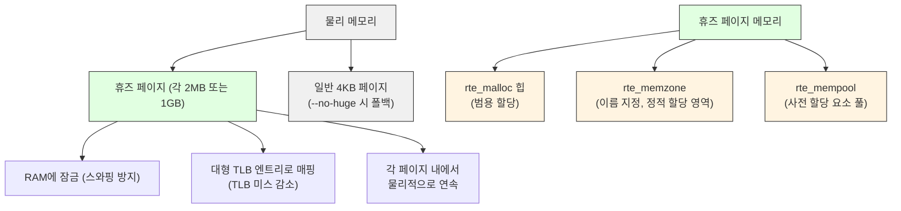
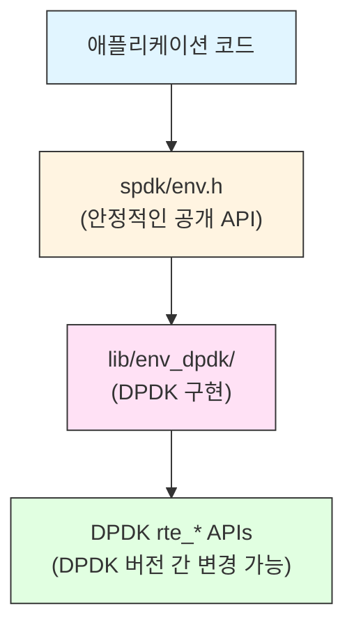
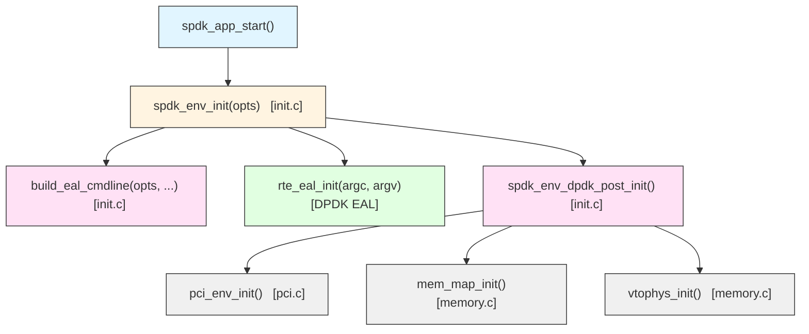
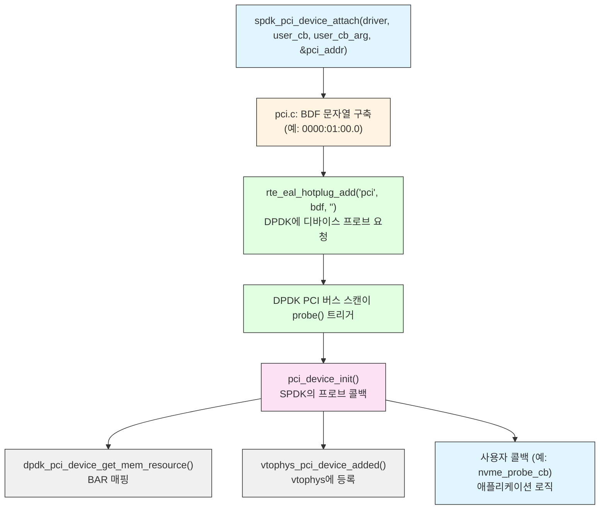
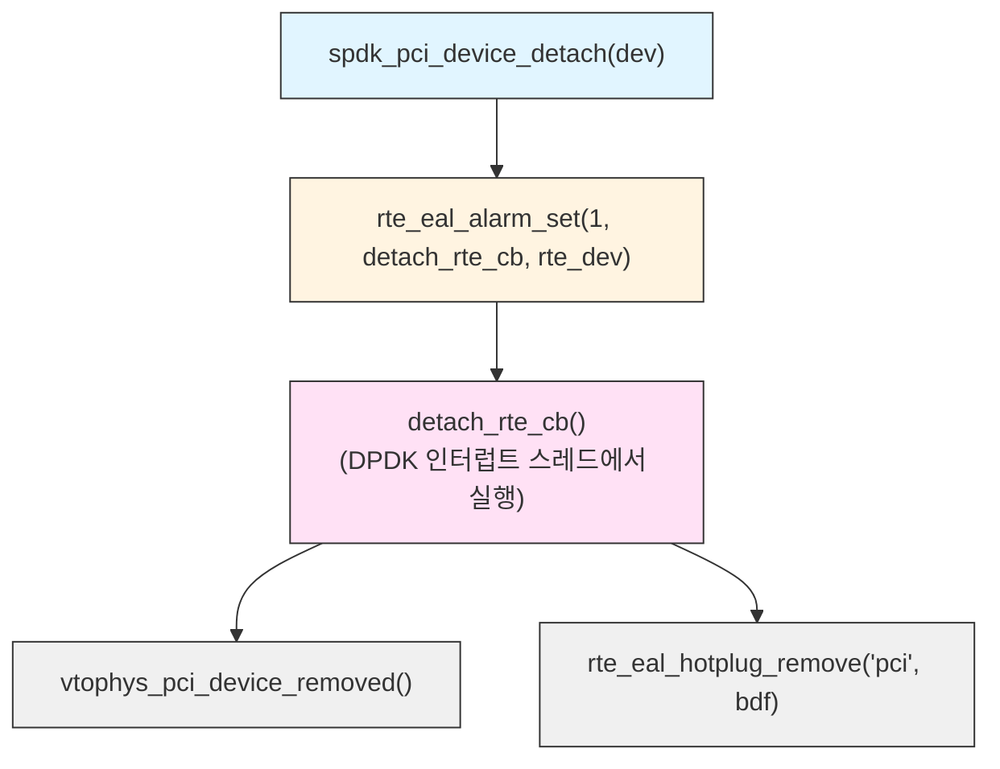
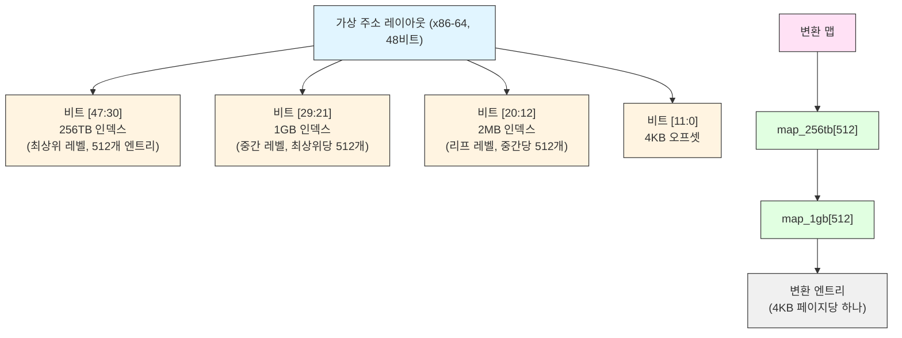
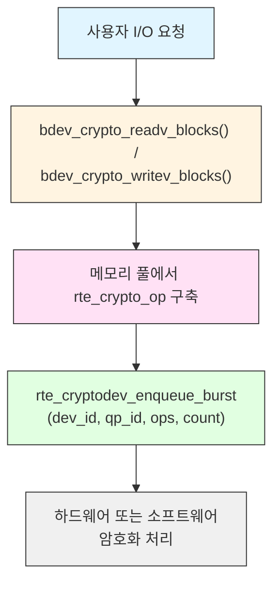

# 모듈 26: DPDK 통합 심층 분석(DPDK Integration Deep Dive)

**스테이지**: 3 - 마스터리
**선수 과목**: 모듈 1-25, SPDK 스레딩 및 메모리 모델에 대한 이해
**예상 소요 시간**: 4-5시간
**난이도**: 고급

---

## 개요

SPDK는 DPDK(Data Plane Development Kit) 위에 구축되어 있으며, DPDK 없이는 현재의 형태로 존재할 수 없었습니다. DPDK는 SPDK가 의존하는 기본 프리미티브를 제공합니다: 휴즈 페이지(Huge Pages)를 이용한 사용자 공간 메모리 관리, 락프리 링 버퍼(Lock-free Ring Buffer), 메모리 풀(Memory Pool), VFIO/UIO를 통한 PCI 디바이스 접근, CPU 친화도(Affinity) 관리 등입니다.

이 모듈에서는 SPDK가 DPDK를 어떻게 감싸는지, 각 설계 결정이 왜 내려졌는지, 그리고 자체 사용 사례를 위해 통합을 어떻게 확장하거나 커스터마이즈할 수 있는지를 분석합니다. `lib/env_dpdk/`의 실제 코드를 읽고 각 계층이 머신 수준에서 무엇을 하는지 이해하게 됩니다.

---

## 목차

1. [DPDK 아키텍처 개요](#1-dpdk-아키텍처-개요)
2. [SPDK env_dpdk 추상화 계층](#2-spdk-env_dpdk-추상화-계층)
3. [SPDK 컨텍스트에서의 EAL 초기화](#3-spdk-컨텍스트에서의-eal-초기화)
4. [SPDK에서의 DPDK 메모리 관리](#4-spdk에서의-dpdk-메모리-관리)
5. [메모리 풀 통합](#5-메모리-풀-통합)
6. [링 버퍼 통합](#6-링-버퍼-통합)
7. [PCI 디바이스 바인딩 및 VFIO/UIO 관리](#7-pci-디바이스-바인딩-및-vfiouio-관리)
8. [가상-물리 주소 변환](#8-가상-물리-주소-변환)
9. [스레드 및 CPU 코어 관리](#9-스레드-및-cpu-코어-관리)
10. [DPDK 암호화 디바이스 통합](#10-dpdk-암호화-디바이스-통합)
11. [NVMe-oF TCP를 위한 DPDK NIC 드라이버 사용](#11-nvme-of-tcp를-위한-dpdk-nic-드라이버-사용)
12. [커스텀 DPDK 통합 패턴](#12-커스텀-dpdk-통합-패턴)
13. [환경 추상화 계층 설계 원칙](#13-환경-추상화-계층-설계-원칙)
14. [핵심 요약](#14-핵심-요약)
15. [실습 연습](#15-실습-연습)
16. [추가 참고 자료](#16-추가-참고-자료)

---

## 1. DPDK 아키텍처 개요

DPDK는 사용자 공간에서의 빠른 패킷 처리를 위한 라이브러리 및 드라이버 세트입니다. SPDK에게 가장 중요한 DPDK 컴포넌트는 패킷 처리가 아니라 DPDK가 제공하는 인프라입니다:

### 1.1 환경 추상화 계층(Environment Abstraction Layer, EAL)

EAL은 DPDK의 핵심입니다. 다음을 통해 런타임 환경을 초기화합니다:

- DMA 가능 메모리를 위한 휴즈 페이지 할당 및 잠금
- CPU 친화도를 통해 논리 코어(lcore)를 물리 CPU 코어에 바인딩
- 멀티 프로세스 토폴로지(primary/secondary)를 위한 IPC 메커니즘 설정
- 디바이스 버스 스캔(PCI, 가상) 초기화
- IOVA(I/O Virtual Address) 모드 설정: 물리 주소(PA) 또는 가상 주소(VA)

DPDK의 모든 것은 `rte_eal_init()`에서 시작됩니다. EAL 초기화가 실패하면 다른 것은 작동하지 않습니다.

### 1.2 DPDK 메모리 아키텍처

DPDK는 성능에 민감한 할당에 힙(malloc)을 사용하지 않습니다. 대신:



휴즈 페이지가 중요한 두 가지 이유:
1. **TLB 압력**: 단일 2MB TLB 엔트리는 4KB 페이지에서 512개의 엔트리가 필요한 것을 하나로 커버합니다. 고처리량 I/O는 TLB를 크게 사용합니다.
2. **DMA 일관성**: 하드웨어 DMA 엔진은 물리적으로 연속된 메모리가 필요합니다. 단일 2MB 휴즈 페이지 내에서 모든 메모리는 물리적으로 연속임이 보장됩니다.

### 1.3 락프리 데이터 구조

DPDK는 캐시 라인 정렬과 비교 후 교환(CAS, Compare-And-Swap) 연산을 중심으로 설계된 락프리 링 버퍼(`rte_ring`)와 메모리 풀(`rte_mempool`)을 제공합니다. 이것들은 SPDK의 I/O 경로에서 핵심적입니다.

### 1.4 DPDK 버스 및 드라이버 모델

DPDK에는 PCI 및 가상 버스를 스캔하는 버스 추상화가 있습니다. 드라이버는 디바이스 ID에 대해 등록합니다. 디바이스가 발견되면 드라이버의 `probe` 함수가 호출됩니다. SPDK는 이 모델을 `lib/env_dpdk/pci.c`에서 감쌉니다.

### 1.5 DPDK 버전 요구 사항

SPDK는 컴파일 시점에 최소 DPDK 버전을 강제합니다:

```c
/* lib/env_dpdk/env_internal.h */
#if RTE_VERSION < RTE_VERSION_NUM(21, 11, 0, 0)
#error RTE_VERSION is too old! Minimum 21.11 is required.
#endif
```

SPDK 소스 트리는 `dpdk/22.07/` 및 `dpdk/22.11/` 하위 디렉토리에 자체 DPDK 사본을 포함하며, `lib/env_dpdk/22.07/` 및 `lib/env_dpdk/22.11/`에 각 버전에 대한 호환성 심(shim)을 제공합니다.

---

## 2. SPDK env_dpdk 추상화 계층

SPDK는 핵심 라이브러리에서 DPDK 함수를 직접 호출하지 않습니다. 모든 DPDK 호출은 `spdk/env.h` API를 구현하는 `lib/env_dpdk/`에 캡슐화되어 있습니다. 이것은 의도적인 설계 결정입니다.

### 2.1 추상화가 존재하는 이유



추상화는 세 가지 목적을 제공합니다:

1. **DPDK 버전 격리**: DPDK가 API를 변경할 때(LTS 릴리스 간에 자주 발생), 모든 호출자가 아니라 `lib/env_dpdk/`만 변경하면 됩니다.
2. **이식성**: DPDK가 아닌 환경 구현이 이론적으로 모든 SPDK 라이브러리를 변경하지 않고 `lib/env_dpdk/`를 대체할 수 있습니다. (SPDK의 `lib/env_ocf/`가 OCF 캐시 통합을 위해 이를 수행합니다.)
3. **테스트 가능성**: 단위 테스트가 실행 중인 DPDK 환경 없이도 `spdk/env.h` 함수를 스텁(stub)할 수 있습니다.

### 2.2 디렉토리 구조

```
lib/env_dpdk/
  env.c              - 메모리, 메모리 풀, 링, 타이머 래퍼
  env_internal.h     - 내부 타입 및 함수 선언
  env.mk             - 빌드 규칙, DPDK 라이브러리 목록
  init.c             - EAL 초기화, spdk_env_init()
  memory.c           - vtophys 맵, DMA 메모리 추적, VFIO IOMMU
  pci.c              - PCI 디바이스 열거 및 핫플러그
  pci_dpdk.c         - DPDK 버전 독립적 PCI 헬퍼 디스패치
  pci_dpdk.h         - PCI 헬퍼 함수 선언
  pci_dpdk_2207.c    - DPDK 22.07 전용 PCI 구현
  pci_dpdk_2211.c    - DPDK 22.11 전용 PCI 구현
  pci_ae4dma.c       - Intel AE4DMA 디바이스 지원
  pci_idxd.c         - Intel DSA/IAA (IDXD) 디바이스 지원
  pci_ioat.c         - Intel IOAT DMA 디바이스 지원
  pci_virtio.c       - Virtio 디바이스 지원
  pci_vmd.c          - Intel VMD 컨트롤러 지원
  pci_event.c        - PCI 핫플러그 이벤트 처리
  sigbus_handler.c   - 메모리 오류에 대한 SIGBUS 처리
  threads.c          - Lcore 관리, CPU 친화도
  spdk_env_dpdk.map  - ABI 심볼 내보내기
  22.07/             - DPDK 22.07 호환성 헤더
  22.11/             - DPDK 22.11 호환성 헤더
```

### 2.3 주요 불투명 타입 매핑

SPDK의 공개 API는 실제로는 DPDK 타입인 불투명(Opaque) 타입을 사용합니다:

| SPDK 타입 | 실제 DPDK 타입 | 캐스팅 위치 |
|-----------|-----------------|---------------|
| `struct spdk_mempool *` | `struct rte_mempool *` | `env.c` |
| `struct spdk_ring *` | `struct rte_ring *` | `env.c` |
| `struct spdk_pci_device *` | `struct rte_pci_device *` 래핑 | `pci.c` |

캐스팅은 항상 명시적이고 중앙 집중화되어 있습니다:

```c
/* lib/env_dpdk/env.c에서 */
struct spdk_mempool *
spdk_mempool_lookup(const char *name)
{
    return (struct spdk_mempool *)rte_mempool_lookup(name);
}
```

---

## 3. SPDK 컨텍스트에서의 EAL 초기화

### 3.1 초기화 시퀀스

SPDK 애플리케이션이 시작될 때 초기화 흐름은:



### 3.2 spdk_env_opts 구조체

`spdk_env_opts`는 EAL 초기화를 위한 사용자 대면 설정 구조체입니다. 크기는 컴파일 시점에 고정되며 검증됩니다:

```c
/* include/spdk/env.h */
struct spdk_env_opts {
    const char  *name;              /* DPDK에 표시되는 프로세스 이름 */
    const char  *core_mask;         /* 16진 비트마스크: "0xf" = 코어 0-3 */
    const char  *lcore_map;         /* core_mask의 대안 */
    int          shm_id;            /* 멀티 프로세스를 위한 공유 메모리 ID */
    int          mem_channel;       /* 메모리 채널 (-1 = 자동) */
    int          main_core;         /* 메인 lcore ID (-1 = 자동) */
    int          mem_size;          /* MB 단위 휴즈 페이지 메모리 (-1 = 자동) */
    bool         no_pci;            /* PCI 디바이스 스캔 건너뛰기 */
    bool         hugepage_single_segments;
    bool         unlink_hugepage;   /* 종료 시 휴즈 페이지 파일 제거 */
    bool         no_huge;           /* 4KB 페이지 사용 (개발 전용) */
    uint32_t     reserved;
    size_t       num_pci_addr;
    const char  *hugedir;           /* 커스텀 휴즈 페이지 마운트 포인트 */
    struct spdk_pci_addr *pci_blocked;  /* 거부 목록 */
    struct spdk_pci_addr *pci_allowed;  /* 허용 목록 */
    const char  *iova_mode;         /* "pa" 또는 "va" */
    uint64_t     base_virtaddr;     /* DPDK 매핑의 기본 VA */
    void        *env_context;       /* 원시 EAL 인수 패스스루 */
    const char  *vf_token;          /* VFIO VF 토큰 */
    size_t       opts_size;         /* 반드시 설정: sizeof(opts) */
    bool         enforce_numa;
    /* ... */
};
SPDK_STATIC_ASSERT(sizeof(struct spdk_env_opts) == 128, "Incorrect size");
```

`opts_size` 필드는 필수입니다. 이 필드는 전방 및 후방 호환성을 가능하게 합니다: SPDK는 이 필드를 사용하여 호출자가 실제로 어떤 필드를 초기화했는지 결정합니다.

### 3.3 EAL 커맨드 라인 구축

DPDK의 `rte_eal_init()`은 표준 `argc/argv` 배열을 받습니다. SPDK의 `build_eal_cmdline()`은 `spdk_env_opts`로부터 이 배열을 구성합니다. 변환 관계:

```
spdk_env_opts 필드            ->  EAL 인수
─────────────────────────────────────────────────
opts->name                   ->  argv[0] (프로세스 이름)
opts->core_mask              ->  -c 0x<mask>
opts->lcore_map              ->  --lcores <map>
opts->main_core              ->  --main-lcore <id>
opts->mem_size               ->  -m <MB>
opts->mem_channel            ->  -n <channels>
opts->shm_id >= 0            ->  --file-prefix=spdk<id> --proc-type=auto
opts->shm_id < 0             ->  --file-prefix=spdk_pid<pid>
opts->hugedir                ->  --huge-dir <path>
opts->no_huge                ->  --no-huge
opts->no_pci                 ->  --no-pci
opts->hugepage_single_segs   ->  --single-file-segments
opts->unlink_hugepage        ->  --huge-unlink
opts->iova_mode              ->  --iova-mode=<pa|va>
opts->base_virtaddr          ->  --base-virtaddr=0x<addr>
opts->vf_token               ->  --vfio-vf-token=<token>
PCI 허용 목록 항목             ->  --allow <BDF>
PCI 차단 목록 항목             ->  --block <BDF>
opts->env_context            ->  (토큰화되어 그대로 추가)
```

코드의 중요한 세부 사항:

```c
/* lib/env_dpdk/init.c */
/* --match-allocation은 DPDK가 시스템 메모리 할당을 병합하거나
 * 분할하는 것을 방지합니다. 이는 rte_mempool 기반 버퍼 풀을
 * 사용하려고 할 때 RDMA에 중요합니다. DPDK가 물리적으로 또는
 * IOVA가 연속적인 두 메모리 영역을 병합하면, 버퍼 풀을 할당할 때
 * 버퍼가 두 할당에 걸쳐 분할되어 메모리 영역이 나뉠 수 있습니다. */
if (!no_huge &&
    (!opts->env_context || strstr(opts->env_context, "--legacy-mem") == NULL)) {
    args = push_arg(args, &argcount, _sprintf_alloc("%s", "--match-allocations"));
}
```

`--match-allocations` 플래그는 RDMA 정확성에 필수적이며 자동으로 추가됩니다.

### 3.4 IOVA 모드 선택

SPDK는 EAL 초기화 전에 IOMMU 능력 감지를 수행합니다. `init.c`의 로직은 IOMMU VA 너비를 확인합니다:

```c
/* lib/env_dpdk/init.c (간략화) */
#if defined(__linux__) && defined(__x86_64__)
#define SPDK_IOMMU_VA_REQUIRED_WIDTH 48

static int check_iommu_capability(void) {
    /* VFIO 가용성을 위해 /sys/kernel/iommu_groups 확인 */
    /* Intel의 VA 너비를 위해 VTd cap 레지스터 읽기 */
    /* AMD의 VA 너비를 위해 IOMMU cap 읽기 */
    /* IOVA_VA 모드가 사용 가능하면 0, 아니면 -1 반환 */
}
```

VA 모드가 지원되면(IOMMU VA 너비 >= 48비트) SPDK는 `--iova-mode=va`를 선호합니다. 이는 메모리 등록을 단순화하기 때문입니다. 그렇지 않으면 `--iova-mode=pa`로 폴백합니다.

ARM/PowerPC에서는 PA 모드가 강제됩니다:
```c
#elif defined(__PPC64__)
args = push_arg(args, &argcount, _sprintf_alloc("--iova-mode=pa"));
```

### 3.5 멀티 프로세스 지원

SPDK는 DPDK에서 직접 상속받은 프라이머리/세컨더리 프로세스 모델을 지원합니다:

```c
/* lib/env_dpdk/env.c */
bool spdk_process_is_primary(void)
{
    return (rte_eal_process_type() == RTE_PROC_PRIMARY);
}
```

프라이머리 프로세스는 휴즈 페이지와 메모리 맵을 초기화합니다. 세컨더리 프로세스는 동일한 `--file-prefix`를 사용하여 프라이머리의 공유 메모리에 연결합니다. `spdk_env_opts`의 `shm_id` 필드가 이를 제어합니다:
- `shm_id < 0`: 단일 프로세스, PID 기반 고유 파일 접두사
- `shm_id >= 0`: 멀티 프로세스, 공유 파일 접두사 `spdk<id>`

### 3.6 외부 EAL 초기화

일부 애플리케이션(예: SPDK가 더 큰 DPDK 애플리케이션에 내장된 경우)은 SPDK를 호출하기 전에 EAL을 자체적으로 초기화합니다. SPDK는 `g_external_init` 플래그를 통해 이를 감지합니다:

```c
/* lib/env_dpdk/init.c */
static bool g_external_init = true;

int spdk_env_dpdk_post_init(bool legacy_mem)
{
    /* EAL이 외부에서 초기화된 경우 호출됨.
     * PCI, 메모리 맵, vtophys만 설정 -- rte_eal_init()은 건너뜀. */
    rc = pci_env_init();
    rc = mem_map_init(legacy_mem);
    rc = vtophys_init();
    return 0;
}
```

이것이 `spdk_env_dpdk_post_init()` vs `spdk_env_init()` 경로입니다.

---

## 4. SPDK에서의 DPDK 메모리 관리

### 4.1 spdk_malloc 계열

SPDK의 메모리 할당 함수는 DPDK의 `rte_malloc` 계열에 대한 얇은 래퍼입니다:

```c
/* lib/env_dpdk/env.c */
void *spdk_malloc(size_t size, size_t align, uint64_t *unused,
                  int numa_id, uint32_t flags)
{
    void *buf;

    if (flags == 0 || unused != NULL) {
        return NULL;
    }

    /* 거짓 공유(false sharing)를 방지하기 위해 최소 하나의 캐시 라인으로 정렬 */
    align = spdk_max(align, RTE_CACHE_LINE_SIZE);
    buf = rte_malloc_socket(NULL, size, align, numa_id);
```

```c
    /* NUMA 폴백: NUMA 특정 할당이 실패하고 enforce_numa가
     * 설정되지 않은 경우, SOCKET_ID_ANY로 재시도 */
    if (buf == NULL && !g_enforce_numa && numa_id != SOCKET_ID_ANY) {
        buf = rte_malloc_socket(NULL, size, align, SOCKET_ID_ANY);
    }
    return buf;
}
```

`unused` 매개변수(이전의 `phys_addr`)는 NULL이어야 합니다. NULL이 아닌 값을 전달하면 NULL을 반환합니다 - 이는 호출자가 할당 시점에 물리 주소 검색에 의존하는 것을 방지하기 위한 의도적인 API 변경입니다(대신 `spdk_vtophys()`를 사용하세요).

`flags` 매개변수:
- `SPDK_MALLOC_DMA`: 메모리가 DMA에 안전함(휴즈 페이지에서 할당)
- `SPDK_MALLOC_SHARE`: 메모리가 프로세스 간 공유 가능
- 최소 하나의 플래그가 설정되어야 함; 0을 전달하면 NULL 반환

### 4.2 멤존(Memzone)

멤존은 이름이 지정되고 영구적으로 할당된 메모리 영역입니다. 프로세스 수명 동안 유지되며 동일한 EAL 파일 접두사를 공유하는 모든 프로세스에서 볼 수 있습니다:

```c
/* lib/env_dpdk/env.c */
void *spdk_memzone_reserve_aligned(const char *name, size_t len,
                                    int numa_id, unsigned flags,
                                    unsigned align)
{
    const struct rte_memzone *mz;
    unsigned dpdk_flags = 0;

    if ((flags & SPDK_MEMZONE_NO_IOVA_CONTIG) == 0) {
        dpdk_flags |= RTE_MEMZONE_IOVA_CONTIG;
    }

    mz = rte_memzone_reserve_aligned(name, len, numa_id, dpdk_flags, align);
    if (mz == NULL && !g_enforce_numa && numa_id != SOCKET_ID_ANY) {
        mz = rte_memzone_reserve_aligned(name, len, SOCKET_ID_ANY,
                                          dpdk_flags, align);
    }

    if (mz != NULL) {
        memset(mz->addr, 0, len);  /* 항상 제로 초기화 */
        return mz->addr;
    }
    return NULL;
}
```

`RTE_MEMZONE_IOVA_CONTIG` 플래그에 주목하세요: 기본적으로 SPDK는 IOVA 연속 멤존을 요청합니다. 이는 전체 할당에 걸쳐 DMA를 수행하는 하드웨어에 필요합니다.

### 4.3 NUMA 폴백 패턴

`lib/env_dpdk/` 전체에서 일관된 NUMA 폴백 패턴을 볼 수 있습니다:

```c
result = rte_func_socket(args, numa_id);
if (result == NULL && !g_enforce_numa && numa_id != SOCKET_ID_ANY) {
    result = rte_func_socket(args, SOCKET_ID_ANY);
}
```

`enforce_numa` 옵션(`spdk_env_opts.enforce_numa`에서)은 이 폴백을 비활성화합니다. `enforce_numa`가 false(기본값)이면 SPDK는 할당 실패보다는 모든 NUMA 노드의 메모리를 수용합니다. 이는 특정 NUMA 노드가 고갈될 수 있는 시스템을 위한 실용적인 선택입니다.

### 4.4 메모리 덤프 및 진단

```c
/* lib/env_dpdk/env.c */
void spdk_env_dpdk_dump_memory_stats(FILE *file)
{
    fprintf(file, "DPDK memory size %" PRIu64 "\n",
            rte_eal_get_physmem_size());
}

void spdk_mempool_dump(FILE *file)
{
    rte_mempool_list_dump(file);
}
```

이것들은 `spdk_app_json_config_load`와 RPC 서브시스템이 메모리 진단을 노출하는 데 사용됩니다.

---

## 5. 메모리 풀 통합

### 5.1 메모리 풀이란?

DPDK 메모리 풀(`rte_mempool`)은 휴즈 페이지에서 할당된 고정 크기 객체 풀입니다. 모든 객체는 동일한 크기입니다. 풀은 내부적으로 락프리 링을 사용합니다. 각 lcore에는 공유 링에 대한 경합을 피하기 위한 코어별 캐시가 있습니다.

SPDK는 다음을 위해 메모리 풀을 사용합니다:
- NVMe 명령 구조체(`struct spdk_nvme_cmd`)
- NVMe-oF 전송 계층용 버퍼 풀
- I/O 채널 요청 객체

### 5.2 SPDK 메모리 풀 생성

```c
/* lib/env_dpdk/env.c */
struct spdk_mempool *
spdk_mempool_create_ctor(const char *name, size_t count,
                          size_t ele_size, size_t cache_size,
                          int numa_id,
                          spdk_mempool_obj_cb_t *obj_init,
                          void *obj_init_arg)
{
    struct rte_mempool *mp;
    size_t tmp;

    if (numa_id == SPDK_ENV_NUMA_ID_ANY) {
        numa_id = SOCKET_ID_ANY;
    }

    /* 캐시 크기는 lcore 수로 나눈 총 요소의 절반 이하여야 함.
     * 이는 코어별 캐시가 풀의 절반 이상을 보유하는 것을 방지합니다. */
    tmp = (count / 2) / rte_lcore_count();
    if (cache_size > tmp) {
        cache_size = tmp;
    }

    if (cache_size > RTE_MEMPOOL_CACHE_MAX_SIZE) {
        cache_size = RTE_MEMPOOL_CACHE_MAX_SIZE;
    }

    mp = rte_mempool_create(name, count, ele_size, cache_size,
                             0, NULL, NULL,
                             (rte_mempool_obj_cb_t *)obj_init, obj_init_arg,
                             numa_id, 0);

    /* NUMA 폴백 */
    if (mp == NULL && !g_enforce_numa && numa_id != SOCKET_ID_ANY) {
        mp = rte_mempool_create(name, count, ele_size, cache_size,
                                 0, NULL, NULL,
                                 (rte_mempool_obj_cb_t *)obj_init, obj_init_arg,
                                 SOCKET_ID_ANY, 0);
    }

    return (struct spdk_mempool *)mp;
}
```

`obj_init` 콜백은 풀 생성 시 요소당 한 번 실행됩니다. SPDK는 이를 사용하여 요청 구조체를 사전 초기화하여, 핫 패스에서의 반복적인 초기화를 피합니다.

### 5.3 메모리 풀 연산

전체 연산 세트는 DPDK에 직접 매핑됩니다:

```c
/* 하나의 요소 할당 (비차단, 풀이 비어있으면 NULL 반환) */
void *spdk_mempool_get(struct spdk_mempool *mp)
{
    void *ele = NULL;
    rte_mempool_get((struct rte_mempool *)mp, &ele);
    return ele;  /* 비어있으면 NULL */
}

/* count개 요소를 원자적으로 할당 */
int spdk_mempool_get_bulk(struct spdk_mempool *mp, void **ele_arr,
                           size_t count)
{
    return rte_mempool_get_bulk((struct rte_mempool *)mp, ele_arr, count);
}

/* 하나의 요소를 풀에 반환 */
void spdk_mempool_put(struct spdk_mempool *mp, void *ele)
{
    rte_mempool_put((struct rte_mempool *)mp, ele);
}

/* count개 요소를 원자적으로 반환 */
void spdk_mempool_put_bulk(struct spdk_mempool *mp, void **ele_arr,
                            size_t count)
{
    rte_mempool_put_bulk((struct rte_mempool *)mp, ele_arr, count);
}
```

### 5.4 코어별 캐시 효과

DPDK 메모리 풀에는 lcore별 캐시가 있습니다. lcore가 `rte_mempool_get()`을 호출할 때:

1. 먼저 lcore의 개인 캐시를 확인합니다.
2. 캐시가 비어 있으면 공유 링에서 `cache_size`개 요소를 벌크로 가져옵니다.
3. 캐시에서 하나의 요소를 반환합니다.

이는 링 접근 비용을 분산합니다. 캐시 히트는 본질적으로 포인터 감소입니다 - 원자 연산이 관여하지 않습니다.

`spdk_mempool_put()`의 경우:
1. 요소를 lcore의 캐시에 넣습니다.
2. 캐시가 가득 차면(`cache_size` 초과) 캐시의 절반을 공유 링으로 플러시합니다.

### 5.5 메모리 반복자(Iterator)

SPDK는 메모리 풀을 지원하는 원시 메모리를 반복하는 기능을 노출합니다. 이는 RDMA 전송에서 메모리 풀 메모리를 RDMA NIC에 등록하는 데 사용됩니다:

```c
/* lib/env_dpdk/env.c */
static void
mempool_mem_iter_remap(struct rte_mempool *mp, void *opaque,
                        struct rte_mempool_memhdr *memhdr,
                        unsigned mem_idx)
{
    struct env_mempool_mem_iter_ctx *ctx = opaque;

    /* 각 메모리 세그먼트의 가상 주소, IOVA 및 길이 노출 */
    ctx->user_cb((struct spdk_mempool *)mp, ctx->user_arg,
                 memhdr->addr, memhdr->iova, memhdr->len, mem_idx);
}

uint32_t
spdk_mempool_mem_iter(struct spdk_mempool *mp, spdk_mempool_mem_cb_t mem_cb,
                       void *mem_cb_arg)
{
    struct env_mempool_mem_iter_ctx ctx = {
        .user_cb = mem_cb,
        .user_arg = mem_cb_arg
    };
    return rte_mempool_mem_iter((struct rte_mempool *)mp,
                                 mempool_mem_iter_remap, &ctx);
}
```

NVMe-oF RDMA 전송은 이를 사용하여 초기화 중에 모든 메모리 풀 메모리를 HCA(Host Channel Adapter)에 사전 등록합니다. I/O당 메모리 등록은 비용이 매우 높기 때문입니다.

---

## 6. 링 버퍼 통합

### 6.1 SPDK 링 API

SPDK의 링 추상화는 `rte_ring`을 감쌉니다. DPDK 링은 휴즈 페이지로 지원되는 락프리 SPSC(Single Producer Single Consumer) 또는 MPMC(Multi Producer Multi Consumer) 순환 큐입니다.

```c
/* lib/env_dpdk/env.c */
struct spdk_ring *
spdk_ring_create(enum spdk_ring_type type, size_t count, int numa_id)
{
    char ring_name[64];
    struct rte_ring *ring;
    static uint32_t ring_index = 0;
    unsigned flags = 0;

    switch (type) {
    case SPDK_RING_TYPE_SP_SC:
        flags = RING_F_SP_ENQ | RING_F_SC_DEQ;
        break;
    case SPDK_RING_TYPE_MP_SC:
        flags = RING_F_SC_DEQ;
        break;
    case SPDK_RING_TYPE_MP_MC:
        flags = 0;
        break;
    default:
        return NULL;
    }

    snprintf(ring_name, sizeof(ring_name), "spdk_ring_%u",
             __atomic_fetch_add(&ring_index, 1, __ATOMIC_RELAXED));

    ring = rte_ring_create(ring_name, count, numa_id, flags);
    if (ring == NULL && !g_enforce_numa && numa_id != SOCKET_ID_ANY) {
        ring = rte_ring_create(ring_name, count, SOCKET_ID_ANY, flags);
    }

    return (struct spdk_ring *)ring;
}
```

### 6.2 링 연산

```c
void spdk_ring_free(struct spdk_ring *ring)
{
    rte_ring_free((struct rte_ring *)ring);
}

size_t spdk_ring_count(struct spdk_ring *ring)
{
    return rte_ring_count((struct rte_ring *)ring);
}

/* 인큐: 인큐된 객체 수 반환 (링이 가득 차면 0) */
size_t
spdk_ring_enqueue(struct spdk_ring *ring, void **objs, size_t count,
                   size_t *free_space)
{
    return rte_ring_enqueue_bulk((struct rte_ring *)ring, objs, count,
                                  (unsigned int *)free_space);
}

/* 디큐: 디큐된 객체 수 반환 (최대 count까지) */
size_t
spdk_ring_dequeue(struct spdk_ring *ring, void **objs, size_t count)
{
    return rte_ring_dequeue_burst((struct rte_ring *)ring, objs, count, NULL);
}
```

비대칭에 주목하세요:
- `spdk_ring_enqueue`는 `rte_ring_enqueue_bulk` 사용 (전부 아니면 전무)
- `spdk_ring_dequeue`는 `rte_ring_dequeue_burst` 사용 (최대 N개 요소)

이는 일반적인 사용을 반영합니다: 생산자는 완전한 배치를 푸시하고, 소비자는 사용 가능한 것을 모두 배출합니다.

### 6.3 링 타입 선택 가이드

| 타입 | DPDK 플래그 | 사용 시점 |
|------|-----------|----------|
| `SPDK_RING_TYPE_SP_SC` | `RING_F_SP_ENQ \| RING_F_SC_DEQ` | 단일 생산자, 단일 소비자 -- 가장 빠름, CAS 오버헤드 없음 |
| `SPDK_RING_TYPE_MP_SC` | `RING_F_SC_DEQ` | 다중 생산자, 단일 소비자 -- SPDK 폴러의 일반적인 패턴 |
| `SPDK_RING_TYPE_MP_MC` | 없음 | 다중 생산자 및 소비자 -- 가장 유연, 가장 높은 오버헤드 |

SPDK 이벤트 프레임워크(리액터)는 `MP_SC` 링을 사용합니다: 여러 스레드가 메시지를 제출할 수 있지만, 각 리액터는 자체 링을 독점적으로 폴링합니다.

### 6.4 링 용량 크기 조정

DPDK 링 크기는 2의 거듭제곱이어야 합니다. 1000개 요소를 요청하면 DPDK는 1024로 올립니다. 헤드/테일 포인터 설계로 인해 실제 사용 가능한 용량은 `size - 1`입니다.

---

## 7. PCI 디바이스 바인딩 및 VFIO/UIO 관리

### 7.1 사용자 공간 PCI 접근이 필요한 이유

표준 Linux 블록 드라이버는 커널에서 실행됩니다. 최소 지연 시간으로 제로 카피 I/O를 달성하기 위해 SPDK는 커널 드라이버를 우회하고 사용자 공간에서 NVMe 디바이스에 직접 접근합니다. 이를 위해서는:

1. 커널 드라이버(예: `nvme`)에서 디바이스 언바인드
2. 사용자 공간 패스스루 드라이버에 바인드: VFIO 또는 UIO
3. 디바이스의 BAR(Base Address Register)을 프로세스 가상 주소 공간에 매핑
4. 매핑된 레지스터에 쓰기를 통해 명령 제출

### 7.2 VFIO vs UIO

| | VFIO | UIO |
|---|---|---|
| IOMMU 지원 | 예 (필수) | 아니오 |
| DMA 보호 | 컨테이너별 격리 | 없음 (전체 시스템 DMA) |
| 인터럽트 지원 | 전체 | 제한적 |
| 보안 | 프로덕션급 | 개발 전용 |
| 커널 모듈 | `vfio-pci` | `uio_pci_generic` 또는 `igb_uio` |
| IOVA 모드 | VA 또는 PA | PA만 |

SPDK는 VFIO를 강력히 선호합니다. VFIO 경로는 DPDK의 VFIO 통합을 통해 처리됩니다.

### 7.3 SPDK에서의 PCI 디바이스 수명 주기



디바이스 제거:


분리는 `rte_eal_alarm_set`을 통해 비동기적으로 실행됩니다. DPDK 인터럽트 스레드에서 직접 `rte_eal_hotplug_remove`를 호출하면 데드락이 발생하기 때문입니다.

### 7.4 BAR 매핑

PCI 디바이스가 프로브될 때 BAR이 매핑됩니다:

```c
/* lib/env_dpdk/pci.c */
static int
map_bar_rte(struct spdk_pci_device *device, uint32_t bar,
            void **mapped_addr, uint64_t *phys_addr, uint64_t *size)
{
    struct rte_mem_resource *res;

    res = dpdk_pci_device_get_mem_resource(device->dev_handle, bar);
    *mapped_addr = res->addr;    /* 가상 주소 */
    *phys_addr = (uint64_t)res->phys_addr;
    *size = (uint64_t)res->len;

    return 0;
}
```

NVMe 드라이버는 NVMe 컨트롤러 레지스터에 BAR0을 사용합니다. 이 BAR을 메모리 매핑하고 NVMe 도어벨 레지스터에 직접 쓰기를 하여 I/O 명령을 제출합니다.

### 7.5 핫플러그 지원

SPDK는 PCI 핫플러그(런타임 중 NVMe 디바이스 삽입/제거)를 지원합니다:

```c
/* lib/env_dpdk/pci.c */
#define DPDK_HOTPLUG_RETRY_COUNT 4

/* 여러 SPDK 프로세스가 동시에 시작되면 DPDK의 내부 IPC가
 * 오작동할 수 있음 -- 최대 4회 재시도 */
for (i = 0; i < DPDK_HOTPLUG_RETRY_COUNT; i++) {
    rc = rte_eal_hotplug_add("pci", bdf, "");
    if (rc == 0) break;
    usleep(10000); /* 10ms */
}
```

### 7.6 PCI 이벤트 처리

`lib/env_dpdk/pci_event.c`는 디바이스 추가/제거 이벤트를 위해 inotify(Linux) 또는 kqueue(BSD)를 통해 `/sys/bus/pci/`를 모니터링합니다. 이는 SPDK의 NVMe 핫플러그 알림을 애플리케이션에 전달합니다.

### 7.7 VFIO 컨테이너 및 DMA 매핑

`lib/env_dpdk/memory.c`는 `vfio_cfg` 구조체를 유지합니다:

```c
/* lib/env_dpdk/memory.c */
struct vfio_cfg {
    int fd;                          /* VFIO 컨테이너 fd */
    bool enabled;
    bool noiommu_enabled;            /* IOMMU 없는 VFIO (격리 없음) */
    unsigned device_ref;             /* VFIO 바인드된 디바이스 수 */
    TAILQ_HEAD(, spdk_vfio_dma_map) maps;  /* 활성 DMA 매핑 */
    pthread_mutex_t mutex;
};
```

새 휴즈 페이지 세그먼트가 등록되면 SPDK는 디바이스가 해당 메모리로 DMA할 수 있도록 IOMMU를 프로그래밍하기 위해 `vfio_iommu_type1_dma_map`을 호출합니다.

---

## 8. 가상-물리 주소 변환(Virtual-to-Physical Address Translation)

### 8.1 vtophys가 필요한 이유

하드웨어 DMA 엔진은 물리 주소(또는 VA 모드의 IOVA)로 작동합니다. SPDK가 쓰기 명령을 위해 NVMe 컨트롤러에 버퍼를 전달할 때, 가상 주소가 아닌 데이터 버퍼의 물리 주소를 전달해야 합니다.

`spdk_vtophys(vaddr, size)`는 가상 주소를 물리/IOVA 주소로 변환합니다.

### 8.2 3단계 맵

`memory.c`는 CPU 자체의 페이지 테이블 구조를 미러링하는 3단계 페이지 테이블을 구현합니다:



```c
/* lib/env_dpdk/memory.c */
#define MAP_256TB_IDX(vfn_2mb)  ((vfn_2mb) >> (SHIFT_1GB - SHIFT_2MB))
#define MAP_1GB_IDX(vfn_2mb)    ((vfn_2mb) & ((1ULL << (SHIFT_1GB - SHIFT_2MB)) - 1))

struct map_2mb4kb {
    uint64_t translation_4kb[MAP_2MB_SIZE];
};
```

이것은 SPDK가 사용하는 소프트웨어로 유지되는 TLB입니다.

### 8.3 IOVA 모드 영향

PA 모드(`--iova-mode=pa`)에서:
- `spdk_vtophys()`는 버퍼를 포함하는 휴즈 페이지의 물리 주소를 조회합니다
- NVMe 명령이 이 물리 주소를 전달합니다

VA 모드(`--iova-mode=va`)에서:
- SPDK는 모든 휴즈 페이지 메모리를 IOMMU에 등록합니다
- IOMMU는 1:1 매핑을 제공합니다: IOVA == VA
- `spdk_vtophys()`는 가상 주소를 IOVA로 반환합니다
- NVMe 명령이 이 IOVA를 전달합니다

VA 모드가 선호되는 이유는 핫 패스에서 vtophys 조회 오버헤드를 피하기 때문입니다 - IOVA == VA일 때 `spdk_vtophys(va)`가 `va`를 직접 반환합니다.

```c
/* lib/env_dpdk/memory.c */
if (spdk_iommu_is_enabled() && rte_eal_iova_mode() == RTE_IOVA_VA) {
    /* IOMMU가 있는 VA 모드에서, 등록된 메모리에 대해 IOVA == VA */
    /* vtophys 조회를 단축할 수 있음 */
}
```

---

## 9. 스레드 및 CPU 코어 관리

### 9.1 Lcore 관리

SPDK의 lcore API는 DPDK에 직접 매핑됩니다:

```c
/* lib/env_dpdk/threads.c */
uint32_t spdk_env_get_core_count(void)  { return rte_lcore_count(); }
uint32_t spdk_env_get_current_core(void) { return rte_lcore_id(); }
uint32_t spdk_env_get_main_core(void)   { return rte_get_main_lcore(); }
uint32_t spdk_env_get_first_core(void)  { return rte_get_next_lcore(-1, 0, 0); }
uint32_t spdk_env_get_next_core(uint32_t prev) {
    unsigned lcore = rte_get_next_lcore(prev, 0, 0);
    return (lcore == RTE_MAX_LCORE) ? UINT32_MAX : lcore;
}
int32_t spdk_env_get_numa_id(uint32_t core) {
    return rte_lcore_to_socket_id(core);
}
```

반복자 매크로:
```c
#define SPDK_ENV_FOREACH_CORE(i)                      \
    for (i = spdk_env_get_first_core();               \
         i < UINT32_MAX;                              \
         i = spdk_env_get_next_core(i))
```

### 9.2 원격 Lcore 실행

SPDK는 특정 lcore에서 함수를 실행할 수 있습니다:

```c
/* lib/env_dpdk/threads.c */
int spdk_env_thread_launch_pinned(uint32_t core, thread_start_fn fn, void *arg)
{
    int rc = rte_eal_remote_launch(fn, arg, core);
    return rc;
}

void spdk_env_thread_wait_all(void)
{
    rte_eal_mp_wait_lcore();
}
```

`rte_eal_remote_launch()`는 lcore 간 링을 통해 함수 포인터 + 인수를 대기 중인 lcore에 보냅니다. 대상 lcore는 폴링 루프에서 이를 가져와 실행합니다. 이것이 SPDK가 전용 코어에서 리액터를 시작하는 데 사용하는 메커니즘입니다.

### 9.3 코어 마스크 설정

코어 마스크는 SPDK가 사용하는 물리 CPU를 제어합니다. 예시:

```bash
# 코어 0-3 사용 (4개 코어)
spdk_tgt --cpumask 0xf

# 코어 4-7 사용 (4개 코어, OS로부터 격리)
spdk_tgt --cpumask 0xf0

# 비연속적인 특정 코어 사용
spdk_tgt --cpumask 0x15  # 코어 0, 2, 4

# lcore 맵 사용 (DPDK 22.07+)
spdk_tgt --lcores "0,1,2,3"
```

프로덕션에서는 OS 스케줄러가 SPDK 코어에 다른 프로세스를 배치하지 않도록 커널 커맨드 라인에 `isolcpus=`를 사용하세요:
```
# /etc/default/grub
GRUB_CMDLINE_LINUX="isolcpus=1-7 nohz_full=1-7 rcu_nocbs=1-7"
```

---

## 10. DPDK 암호화 디바이스 통합

### 10.1 아키텍처

DPDK는 다음 드라이버가 포함된 `cryptodev` 추상화 계층(`lib/cryptodev`)을 제공합니다:
- Intel QAT (QuickAssist Technology): 하드웨어 암호화 가속기
- AES-NI 소프트웨어: CPU 명령어 기반 암호화
- AESNI-MB (멀티 버퍼): Intel IPsec-MB 라이브러리
- OpenSSL: 소프트웨어 폴백
- 스케줄러: 여러 디바이스에 작업 분산

SPDK는 다음을 위해 DPDK cryptodev를 사용합니다:
- NVMe 저장 시 암호화(encryption-at-rest, `bdev_crypto` 경유)
- NVMe-oF TLS 전송 암호화
- 가속 기반 난수 생성

### 10.2 Cryptodev 초기화

```c
/* 예시: AES-NI-MB cryptodev 세션 생성 */

/* 1. 사용 가능한 암호화 디바이스 찾기 */
uint8_t nb_devs = rte_cryptodev_count();

/* 2. 디바이스 설정 */
struct rte_cryptodev_config dev_conf = {
    .nb_queue_pairs = 1,
    .socket_id = SOCKET_ID_ANY,
};
rte_cryptodev_configure(dev_id, &dev_conf);

/* 3. 큐 페어 설정 */
struct rte_cryptodev_qp_conf qp_conf = {
    .nb_descriptors = 2048,
    .mp_session = session_pool,
};
rte_cryptodev_queue_pair_setup(dev_id, 0, &qp_conf, SOCKET_ID_ANY);

/* 4. 디바이스 시작 */
rte_cryptodev_start(dev_id);
```

### 10.3 bdev_crypto가 DPDK Cryptodev를 사용하는 방법

`lib/bdev/bdev_crypto.c`(및 관련 파일)은 암호화 연산을 위해 `rte_mempool`을 사용하고, 제출 전에 암호화 요청을 배치하기 위해 `rte_ring`을 소프트웨어 큐로 사용합니다:



`bdev_crypto` 폴링은 SPDK의 폴러 인프라를 사용합니다: `spdk_poller_register()`가 매 리액터 반복마다 `rte_cryptodev_dequeue_burst()`를 호출하는 함수를 등록합니다.

---

## 11. NVMe-oF TCP를 위한 DPDK NIC 드라이버 사용

### 11.1 NVMe-oF TCP에 DPDK를 사용하는 이유

NVMe-oF TCP는 다음 중 하나를 사용할 수 있습니다:
1. 커널 TCP 스택(posix 백엔드를 이용한 `sock` 추상화 경유)
2. DPDK PDCP/RDMA(RoCE용)
3. DPDK MEMIF 또는 VHOST(VM 워크로드용)

순수 TCP의 경우 SPDK는 DPDK NIC 드라이버를 직접 사용하지 **않습니다**. 대신 POSIX 소켓 또는 `uring` 백엔드를 통해 커널 TCP 스택을 사용합니다. DPDK NIC 드라이버는 DPDK 가속 네트워킹 프레임워크와 함께 SPDK를 배포할 때 사용됩니다.

### 11.2 성능 테스트를 위한 DPDK NIC 바인딩

네트워크 가속과 함께 NVMe-oF를 벤치마킹할 때:

```bash
# 1단계: NIC를 DPDK에 바인드
./dpdk/usertools/dpdk-devbind.py --bind=vfio-pci 0000:01:00.0

# 2단계: NIC가 허용된 상태로 SPDK 시작
spdk_tgt --allow 0000:01:00.0

# 또는 차단 목록으로 불필요한 NIC 건너뛰기
spdk_tgt --block 0000:01:00.0
```

### 11.3 멀티 프로세스 토폴로지에서의 DPDK NIC

멀티 프로세스 설정(예: DPDK 프라이머리 프로세스가 NIC 소유, SPDK 세컨더리 프로세스가 NVMe 디바이스 소유)에서 `spdk_env_opts`의 `shm_id`가 NIC의 디스크립터 링에 대한 공유 메모리 접근을 조정합니다.

### 11.4 sock_posix vs uring 백엔드

프로덕션에서의 NVMe-oF TCP:

```c
/* NVMe-oF 타겟은 spdk_sock 추상화를 사용 */
struct spdk_sock_impl_opts {
    uint32_t recv_buf_size;
    uint32_t send_buf_size;
    bool enable_recv_pipe;
    bool enable_quickack;
    /* ... */
};

/* 구현 선택 */
spdk_sock_impl_get_opts("posix", &opts, &len);  /* 커널 TCP */
spdk_sock_impl_get_opts("uring", &opts, &len);  /* io_uring 가속 */
```

---

## 12. 커스텀 DPDK 통합 패턴

### 12.1 추가 EAL 인수 전달

`spdk_env_opts`의 `env_context` 필드는 구조화된 필드에서 다루지 않는 원시 EAL 인수를 위한 탈출구입니다:

```c
struct spdk_env_opts opts;
opts.opts_size = sizeof(opts);
spdk_env_opts_init(&opts);

/* SPDK가 직접 노출하지 않는 원시 EAL 인수 전달 */
opts.env_context = "--legacy-mem --no-telemetry --vdev=net_tap0";

spdk_env_init(&opts);
```

SPDK는 이 문자열을 공백으로 토큰화하고 각 토큰을 `rte_eal_init()`에 별도의 argv 항목으로 추가합니다.

### 12.2 외부 EAL 초기화

기존 DPDK 애플리케이션에 SPDK를 내장할 때:

```c
/* 기존 DPDK 애플리케이션 */
char *eal_argv[] = {"myapp", "-c", "0xff", "-n", "4"};
rte_eal_init(5, eal_argv);

/* 그런 다음 EAL을 다시 실행하지 않고 SPDK 서브시스템 초기화 */
spdk_env_dpdk_post_init(false /* not legacy_mem */);

/* 이제 SPDK 준비 완료; 정상적으로 사용 */
struct spdk_nvme_transport_id trid = {};
trid.trtype = SPDK_NVME_TRANSPORT_PCIE;
spdk_nvme_probe(&trid, NULL, probe_cb, attach_cb, NULL);
```

이 패턴을 사용할 때 SPDK는 종료 시 `rte_eal_cleanup()`을 호출하지 **않습니다**. `rte_eal_init()`을 호출한 애플리케이션만 정리를 호출해야 합니다.

### 12.3 커스텀 DPDK 디바이스 통합

커스텀 DPDK 가상 디바이스를 추가하려면:

```c
/* EAL 초기화 후 가상 디바이스 추가 */
rte_eal_hotplug_add("vdev", "net_pcap0",
                     "rx_pcap=input.pcap,tx_pcap=output.pcap");

/* 또는 초기화 전에 env_context를 통해 설정 */
opts.env_context = "--vdev=net_pcap0,rx_pcap=input.pcap";
```

### 12.4 프로세스 간 공유 메모리

프라이머리와 세컨더리 SPDK 프로세스 간에 DPDK 리소스(메모리 풀, 링)를 공유하려면:

```c
/* 프라이머리 프로세스 */
struct spdk_env_opts opts_primary = {};
opts_primary.opts_size = sizeof(opts_primary);
spdk_env_opts_init(&opts_primary);
opts_primary.shm_id = 42;   /* 공유 ID */
spdk_env_init(&opts_primary);

/* 공유 메모리 풀 생성 */
struct spdk_mempool *shared_pool =
    spdk_mempool_create("shared_pool", 4096, 256, 0,
                         SPDK_ENV_NUMA_ID_ANY);
```

```c
/* 세컨더리 프로세스 */
struct spdk_env_opts opts_secondary = {};
opts_secondary.opts_size = sizeof(opts_secondary);
spdk_env_opts_init(&opts_secondary);
opts_secondary.shm_id = 42;   /* 동일한 공유 ID */
spdk_env_init(&opts_secondary);

/* 프라이머리가 생성한 풀 조회 */
struct spdk_mempool *shared_pool = spdk_mempool_lookup("shared_pool");
```

### 12.5 프로덕션을 위한 휴즈 페이지 설정

```bash
# 부팅 시 1GB 휴즈 페이지 할당 (2MB보다 효율적)
# /etc/default/grub:
# GRUB_CMDLINE_LINUX="default_hugepagesz=1G hugepagesz=1G hugepages=16"

# 또는 런타임에서 (2MB 페이지만, 1GB는 부트 설정 필요):
echo 4096 > /sys/kernel/mm/hugepages/hugepages-2048kB/nr_hugepages

# hugetlbfs가 마운트되지 않은 경우 마운트:
mount -t hugetlbfs nodev /dev/hugepages

# 할당 확인:
cat /proc/meminfo | grep Huge
```

16개의 1GB 휴즈 페이지를 가진 SPDK의 경우:
```c
opts.mem_size = 16384;   /* 16GB = 16 * 1024 MB */
opts.hugepage_single_segments = true;  /* 휴즈 페이지당 하나의 파일 */
```

### 12.6 DPDK 텔레메트리 통합

DPDK 20.11+에는 텔레메트리 서버가 포함되어 있습니다. SPDK는 이를 차단하지 않습니다:

```bash
# 실행 중인 SPDK 프로세스에서 DPDK 텔레메트리 쿼리:
dpdk-telemetry.py
# 또는 직접:
echo /  | socat - UNIX-CONNECT:/var/run/dpdk/spdk_pid12345/dpdk_telemetry.v2
```

유용한 텔레메트리 엔드포인트:
```
/eal/params           - 사용된 EAL 커맨드 라인
/eal/memzone_list     - 모든 멤존
/mempool/info         - 메모리 풀 통계
/ring/list            - 모든 링
```

---

## 13. 환경 추상화 계층 설계 원칙

### 13.1 추상화가 가치 있는 이유

`spdk/env.h` 추상화는 여러 중요한 진화를 가능하게 했습니다:

1. **DPDK 주요 버전 업그레이드**: DPDK는 ABI와 API를 여러 번 변경했습니다(18.11 -> 20.11 -> 21.11 -> 22.11). 매번 `lib/env_dpdk/`만 업데이트하면 되었습니다.

2. **DPDK 없는 빌드**: `lib/env_ocf/`는 DPDK가 전혀 필요 없는 최소 env 구현을 제공하며, OCF 캐시 단위 테스트에 사용됩니다.

3. **단위 테스트에서의 모킹**: SPDK 단위 테스트(`test/unit/`)는 실제 하드웨어나 휴즈 페이지 없이 bdev 및 nvme 로직을 테스트하기 위해 env 함수를 스텁합니다.

### 13.2 opts_size 패턴

`spdk_env_opts`의 `opts_size` 필드는 버전 관리 메커니즘입니다:

```c
/* 애플리케이션 코드 */
struct spdk_env_opts opts;
opts.opts_size = sizeof(opts);   /* 필수 */
spdk_env_opts_init(&opts);

/* SPDK 내부적으로 */
void env_copy_opts(struct spdk_env_opts *dst,
                   const struct spdk_env_opts *src,
                   size_t user_opts_size)
{
    /* 사용자의 구조체 크기에 맞는 필드만 복사 */
    /* 새 SPDK 버전에서 추가된 필드는 안전하게 무시됨 */
    memcpy(dst, src, offsetof(struct spdk_env_opts, opts_size));

#define SET_FIELD(field) \
    if (offsetof(struct spdk_env_opts, field) + \
        sizeof(dst->field) <= user_opts_size) {  \
        dst->field = src->field;                 \
    }
    SET_FIELD(enforce_numa);
    /* ... 향후 필드 여기에 */
}
```

이를 통해 최신 SPDK 라이브러리가 더 작은 `spdk_env_opts`를 가진 이전 애플리케이션 바이너리와 작동할 수 있습니다. 새 필드는 `spdk_env_opts_init()`에서 기본값을 가져옵니다.

### 13.3 불투명 타입 캐스팅

SPDK의 불투명 타입(`spdk_mempool`, `spdk_ring`)은 명시적 C 캐스트를 사용하여 DPDK 타입에서 변환됩니다. 이것이 안전한 이유:

1. 타입은 항상 env 함수를 통해 접근됩니다 - 직접 역참조되지 않습니다.
2. `SPDK_STATIC_ASSERT` 매크로가 크기 호환성을 검증합니다.
3. 추상화가 호출자가 DPDK 내부에 의존하는 것을 방지합니다.

```c
/* 이 패턴은 의도적이고 올바릅니다 */
return (struct spdk_mempool *)rte_mempool_lookup(name);
```

### 13.4 스레드 안전성 모델

env 계층 자체는 SPDK 스레딩 모델을 위해 설계되었습니다:
- 메모리 할당 함수(`spdk_malloc`)는 스레드 안전합니다(DPDK `rte_malloc`이 스레드 안전)
- 메모리 풀 get/put은 스레드 안전합니다(락프리 CAS 연산)
- 링 인큐/디큐 스레드 안전성은 생성 시 선택한 링 타입에 따라 다릅니다
- PCI 연산은 직렬화를 위해 `g_pci_mutex`를 획득합니다

### 13.5 추상화가 하지 않는 것

추상화의 한계를 이해하는 것도 똑같이 중요합니다:

- DPDK의 휴즈 페이지 요구 사항을 숨기지 않습니다 - 애플리케이션이 휴즈 페이지를 설정해야 합니다
- PCI 서브시스템의 DPDK 버전 차이를 추상화하지 않습니다(따라서 `pci_dpdk_2207.c` / `pci_dpdk_2211.c`)
- 소켓/네트워크 추상화를 제공하지 않습니다(그것은 `spdk/sock.h`)
- DMA 엔진 차이를 추상화하지 않습니다(IOAT, IDXD 각각 자체 `pci_*.c`가 있음)

---

## 14. 핵심 요약

1. **DPDK는 SPDK의 기반입니다**: 모든 SPDK 할당, 링, 타이머, PCI 접근이 DPDK를 통해 이루어집니다. DPDK의 휴즈 페이지, EAL, 락프리 데이터 구조 모델을 이해하는 것은 SPDK 성능 문제 디버깅의 전제 조건입니다.

2. **env_dpdk 계층은 의도적으로 얇습니다**: 각 `spdk_*` 함수는 정확히 하나 또는 두 개의 `rte_*` 호출에 매핑됩니다. 추상화는 로직이 아닌 이름 지정과 NUMA 폴백을 추가합니다.

3. **EAL 초기화는 일회성 연산입니다**: `rte_eal_init()`은 프로세스당 정확히 한 번 호출되어야 합니다. SPDK는 두 경우(SPDK 주도 vs 외부 주도 EAL)를 모두 처리하기 위해 `g_external_init`을 추적합니다.

4. **`--match-allocations`는 RDMA에 필수입니다**: 이것이 없으면 DPDK가 RDMA scatter-gather 리스트를 깨뜨리는 방식으로 메모리 영역을 병합할 수 있습니다. SPDK는 `env_context`에 `--legacy-mem`이 없는 한 자동으로 추가합니다.

5. **IOVA 모드 선택은 자동이지만 재정의 가능합니다**: SPDK는 IOMMU 능력을 감지하고 VA 또는 PA 모드를 선택합니다. I/O 핫 패스에서 vtophys 조회를 제거하기 때문에 VA 모드가 선호됩니다.

6. **메모리 풀 캐시 크기 조정은 자동입니다**: SPDK의 `spdk_mempool_create_ctor`는 자동으로 캐시 크기를 `(count/2)/lcore_count`와 `RTE_MEMPOOL_CACHE_MAX_SIZE`로 제한합니다. 직접 계산할 필요가 없습니다.

7. **링 디큐는 버스트 모드, 인큐는 전부 아니면 전무**: `spdk_ring_dequeue`는 최대 N개 항목을 반환합니다; `spdk_ring_enqueue`는 N개 모두를 인큐하거나 아무것도 하지 않습니다.

8. **PCI 분리는 항상 비동기적입니다**: DPDK 인터럽트/알람 스레드에서 직접 `rte_eal_hotplug_remove`를 호출하지 마세요. SPDK는 `rte_eal_alarm_set`을 통해 이를 지연시킵니다.

9. **`opts_size`는 반드시 설정해야 합니다**: `opts->opts_size = sizeof(*opts)`를 깜빡하면 `spdk_env_init`이 `-EINVAL`을 반환합니다. 이것이 가장 흔한 초보자 실수입니다.

10. **휴즈 페이지는 사전 할당되어야 합니다**: SPDK는 휴즈 페이지를 할당하지 않습니다 - OS가 이미 예약한 것을 사용합니다. SPDK를 시작하기 전에 `/etc/default/grub` 또는 `sysfs`를 통해 휴즈 페이지를 예약하세요.

---

## 15. 실습 연습

### 연습 1: EAL 인수 추적

**목표**: SPDK가 구성하는 정확한 EAL 커맨드 라인 이해하기.

**단계**:
1. `SPDK_LOG_LEVEL=DEBUG`가 설정된 상태로 SPDK 애플리케이션 실행
2. EAL 인수를 보여주는 로그 줄 찾기
3. 섹션 3.3의 표를 사용하여 각 인수를 `spdk_env_opts` 필드에 매핑
4. 실험: `opts.no_pci = true`를 설정하고 인수 목록이 어떻게 변하는지 관찰
5. `env_context = "--telemetry-max-files=10"`을 사용하고 인수 목록에 나타나는지 확인

**예상 학습**: `spdk_env_opts`에서 `rte_eal_init()` 인수까지의 전체 변환.

### 연습 2: 메모리 풀 크기 조정 분석

**목표**: 캐시 크기 계산과 성능 영향 이해하기.

**단계**:
1. `count=1024, cache_size=256, lcore_count=4`로 메모리 풀 생성
2. `spdk_mempool_create_ctor`를 통해 추적:
   - `tmp = (1024 / 2) / 4 = 128`
   - `256 > 128`이므로 캐시가 `128`로 제한됨
3. 메모리 풀을 생성하고 요소를 가져오고 넣은 후 `rte_mempool_avail_count()`를 확인하는 작은 테스트 작성
4. 벤치마크: cache_size=0 vs cache_size=128로 `spdk_mempool_get()` 지연 시간 비교

**예상 학습**: 코어별 캐싱이 링 경합을 줄이는 방법.

### 연습 3: vtophys 순회

**목표**: 가상-물리 주소 변환 맵 이해하기.

**단계**:
1. `spdk_zmalloc(4096, 4096, NULL, SPDK_ENV_NUMA_ID_ANY, SPDK_MALLOC_DMA)`로 버퍼 할당
2. 결과에 대해 `spdk_vtophys(buf, NULL)` 호출
3. `memory.c`를 참조하여 수동으로 3단계 맵 순회:
   - 가상 주소에서 `MAP_256TB_IDX`, `MAP_1GB_IDX`, `MAP_2MB_IDX` 추출
   - 변환 엔트리에 물리 주소가 포함되어 있는지 확인
4. IOVA 모드가 PA인지 VA인지 확인(`rte_eal_iova_mode()`)

**예상 학습**: 내부 맵 구조와 IOVA 모드가 변환 비용에 영향을 미치는 이유.

### 연습 4: 링 타입 벤치마킹

**목표**: 링 타입 간 성능 차이 측정하기.

**단계**:
1. 각 4096개 요소로 세 개의 링 생성: SP_SC, MP_SC, MP_MC
2. 각각에 대해 1000만 번 인큐/디큐 연산을 수행하는 타이트 루프 작성
3. `spdk_get_ticks()`를 사용하여 연산당 사이클 측정
4. 결과를 비교하고 각 CAS 연산의 오버헤드 문서화

**예상 학습**: 락프리 동기화의 구체적 비용과 각 링 타입을 선택할 시점.

### 연습 5: 외부 EAL 통합

**목표**: 기존 DPDK 애플리케이션에 SPDK 내장하기.

**단계**:
1. `rte_eal_init()`을 직접 호출하는 최소 DPDK 애플리케이션 작성
2. EAL 초기화 후 `spdk_env_dpdk_post_init(false)` 호출
3. `spdk_nvme_probe()`를 사용하여 NVMe 디바이스 스캔
4. `spdk_process_is_primary()`가 true를 반환하는지 확인
5. 종료 시퀀스 적절히 정렬: `rte_eal_cleanup()` 전에 SPDK 정리

**예상 학습**: `g_external_init` 경로와 SPDK를 더 큰 DPDK 배포에 통합하는 방법.

### 연습 6: PCI 디바이스 바인드/언바인드 사이클

**목표**: `scripts/setup.sh`가 자동으로 수행하는 작업을 수동으로 수행하기.

**단계**:
1. NVMe 디바이스 식별: `lspci | grep NVMe`
2. 현재 드라이버 확인: `cat /sys/bus/pci/devices/0000:XX:XX.X/driver`
3. 커널에서 언바인드: `echo "0000:XX:XX.X" > /sys/bus/pci/drivers/nvme/unbind`
4. VFIO에 바인드: `echo "0000:XX:XX.X" > /sys/bus/pci/drivers/vfio-pci/bind`
5. SPDK 애플리케이션을 시작하고 디바이스가 접근 가능한지 확인
6. SPDK 중지 후 커널에 재바인드: `echo "0000:XX:XX.X" > /sys/bus/pci/drivers/nvme/bind`

**예상 학습**: `lib/env_dpdk/pci.c`가 자동화하는 전체 PCI 바인딩 수명 주기.

---

## 16. 추가 참고 자료

### DPDK 문서
- **DPDK 프로그래머 가이드**: https://doc.dpdk.org/guides/prog_guide/
  - 챕터: 환경 추상화 계층
  - 챕터: 메모리 풀 라이브러리
  - 챕터: 링 라이브러리
  - 챕터: VFIO
- **DPDK API 참조**: https://doc.dpdk.org/api/

### SPDK 소스 파일 (이 모듈에서 참조됨)
- `/lib/env_dpdk/init.c` - EAL 초기화, `spdk_env_init()`
- `/lib/env_dpdk/env.c` - 메모리, 메모리 풀, 링 래퍼
- `/lib/env_dpdk/memory.c` - vtophys 맵, VFIO DMA 관리
- `/lib/env_dpdk/pci.c` - PCI 디바이스 관리
- `/lib/env_dpdk/threads.c` - CPU/lcore 관리
- `/lib/env_dpdk/env_internal.h` - 내부 선언
- `/include/spdk/env.h` - 공개 환경 API
- `/include/spdk/env_dpdk.h` - DPDK 전용 공개 API

### 설정 스크립트
- `scripts/setup.sh` - 디바이스를 DPDK에 바인드, 휴즈 페이지 설정
- `scripts/common.sh` - 공유 설정 유틸리티
- `dpdk/usertools/dpdk-devbind.py` - DPDK 디바이스 바인딩 유틸리티

### 관련 SPDK RFC 및 설계 문서
- SPDK VFIO 설계(인트리 문서): `doc/memory.md`
- 멀티 프로세스 지원: `doc/multi_process.md`
- NVMe-oF 전송 아키텍처: `doc/nvmf.md`

### 컨퍼런스 발표
- "SPDK: Open Source Storage Performance Development Kit" - Intel OCP Summit
- "Lock-free Programming with DPDK" - DPDK Summit
- "VFIO: Secure User-Level IO" - Linux Plumbers Conference

---

*SPDK 마스터리 과정의 모듈 26. 이 모듈은 스테이지 3: 마스터리의 일부입니다.*
*다음: 모듈 27 - 커스텀 Bdev 개발*
*이전: 모듈 25 - SPDK 성능 튜닝*
