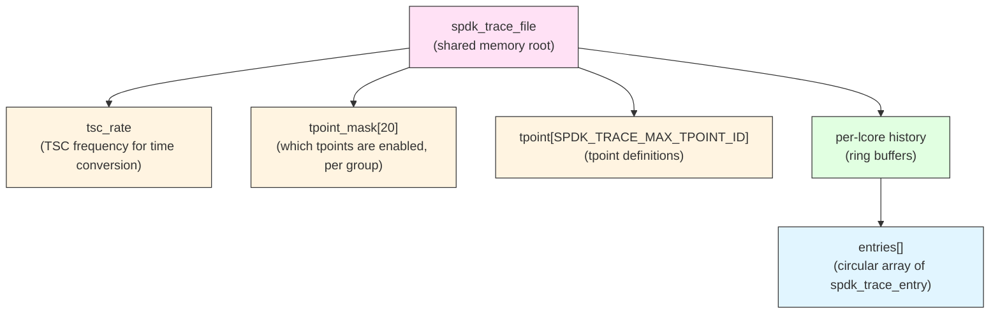

# 모듈 27: 디버깅 기법 (Debugging Techniques)

**단계**: 3 - 마스터리 (Mastery)
**Prerequisites**: Modules 1-26 (Stages 1 and 2 complete)
**예상 소요 시간**: 4-6시간

---

## 개요

Debugging SPDK applications is fundamentally different from debugging conventional multi-threaded programs. SPDK's reactor model, lock-free design, and tight coupling with DPDK mean that standard debugging techniques either do not apply or require significant adaptation. This module covers the full debugging toolkit available to SPDK developers, from low-level GDB usage through high-level trace analysis and memory safety tools.

Key challenges unique to SPDK debugging:

- Reactors poll in tight loops; attaching a debugger stalls all I/O
- Most SPDK code runs on dedicated CPU cores pinned with `rte_cpuset`; OS scheduling assumptions break
- Shared memory segments (trace, hugepages) survive process crashes and must be cleaned manually
- DPDK's memory allocator bypasses `malloc`, so standard leak detectors need special configuration
- Many bugs are timing-sensitive and disappear under instrumentation

---

## Section 1: Building for Debugging

Before attaching any debugger or sanitizer, the binary must be built correctly.

### Debug Build

```bash
# Full debug build: debug symbols, no optimization, assertions enabled
./configure --enable-debug
make -j$(nproc)
```

`--enable-debug` sets `-O0 -g3` and defines `DEBUG`, which activates
`SPDK_DEBUGLOG` and `SPDK_LOGDUMP` macros (they compile to no-ops in
release builds).

### Selective Debug Build

If only one subsystem needs debugging, rebuild just that library:

```bash
# Rebuild nvme library with debug flags while keeping the rest optimized
make -C lib/nvme CFLAGS="-O0 -g3 -DDEBUG"
```

### Address Sanitizer Build

```bash
./configure --enable-asan --enable-ubsan
make -j$(nproc)
```

ASan and UBSan are incompatible with Valgrind. Choose one path.

### Sanitizer + Debug Combined

```bash
./configure --enable-debug --enable-asan
make -j$(nproc)
```

---

## Section 2: GDB with SPDK

### 2.1 Running Under GDB

```bash
# Basic invocation
sudo gdb --args ./build/bin/nvmf_tgt -m 0x3 -c nvmf.json

# Inside GDB
(gdb) set pagination off
(gdb) set logging on          # saves output to gdb.txt
(gdb) break spdk_app_start
(gdb) run
```

**Hugepage note**: SPDK applications require hugepages and often need `sudo`.
Run GDB with the same privileges as the application.

### 2.2 Attaching to a Running Application

```bash
# Find the pid
pidof nvmf_tgt

# Attach - this suspends all reactors immediately
sudo gdb -p <pid>

# In GDB
(gdb) info threads        # list all threads
(gdb) thread apply all bt # backtrace for every thread
(gdb) continue            # resume - I/O resumes
(gdb) detach              # detach without killing
```

**Warning**: Attaching GDB suspends the entire process. On a busy NVMe-oF
target this means the initiator will see timeouts. Always attach on a test
system, never production.

### 2.3 Multi-Thread Debugging

SPDK creates one reactor thread per core plus optional user threads. The
reactor threads are named `reactor_N` where N is the lcore number.

```bash
# Switch to a specific reactor thread
(gdb) info threads
  Id   Target Id         Frame
* 1    Thread 0x... (reactor_0)  ...
  2    Thread 0x... (reactor_1)  ...
  3    Thread 0x... (reactor_2)  ...

(gdb) thread 2
(gdb) bt

# Print per-thread local variables
(gdb) frame 3
(gdb) info locals

# Apply command to all reactor threads
(gdb) thread apply all frame 2
```

### 2.4 Useful GDB Commands for SPDK Data Structures

```bash
# Inspect a TAILQ
(gdb) p *my_qpair.outstanding_reqs.tqh_first

# Follow a linked list manually
(gdb) set $req = my_qpair.outstanding_reqs.tqh_first
(gdb) while $req != 0
>   p *$req
>   set $req = $req->tailq.tqe_next
>end

# Inspect hugepage-backed memory
(gdb) x/32xb 0x2000000000   # hex dump at address

# Find which lcore a poller runs on
(gdb) p spdk_env_get_current_core()
```

### 2.5 Breakpoints in Poll Loops

Reactor poll loops run millions of times per second. Unconditional
breakpoints will make the system appear hung. Use conditional breakpoints:

```bash
# Break only when a specific qpair is involved
(gdb) break nvme_qpair_submit_request if qpair == 0x7f0012345678

# Break after N hits
(gdb) break nvme_pcie_qpair_process_completions
(gdb) ignore 1 999          # skip first 999 hits

# Watchpoint: break when a field changes
(gdb) watch -l req->state   # hardware watchpoint (limited count)
```

### 2.6 GDB Scripts for SPDK

Save repetitive commands to a script:

```gdb
# ~/.gdbinit or spdk.gdb
define dump_reactor_stats
  thread apply all bt 3
  thread apply all p spdk_get_ticks()
end

define dump_qpair
  set $qp = (struct spdk_nvme_qpair *)$arg0
  p $qp->id
  p $qp->num_outstanding_reqs
  p $qp->state
end
```

```bash
gdb --command=spdk.gdb --args ./nvmf_tgt -m 0x3 -c nvmf.json
```

---

## Section 3: Core Dump Analysis

### 3.1 Enabling Core Dumps

```bash
# Enable unlimited core dump size for the shell session
ulimit -c unlimited

# Verify
ulimit -c

# Set core dump pattern (requires root)
echo '/tmp/core.%e.%p' | sudo tee /proc/sys/kernel/core_pattern

# For systemd-coredump systems
# Cores go to /var/lib/systemd/coredump/ and are queried with:
coredumpctl list
coredumpctl gdb <pid>
```

### 3.2 SPDK-Specific Core Dump Considerations

SPDK applications map hugepages as anonymous memory. The core dump includes
these mappings by default, which can produce core files many gigabytes in size.

```bash
# Restrict core dump to just the main executable segments
# (loses hugepage content but produces a manageable file)
# Add to your startup wrapper:
cat /proc/self/maps | grep huge | awk '{print $1}' | \
  while IFS=- read start end; do
    echo "$((16#$start))-$((16#$end)) 0"
  done > /proc/self/coredump_filter
```

Alternatively, exclude anonymous huge pages from the dump:

```bash
# 0x23 = exclude anon huge pages and tmpfs
echo 0x23 > /proc/self/coredump_filter
```

### 3.3 Analyzing the Core

```bash
# Load the core
gdb ./build/bin/nvmf_tgt /tmp/core.nvmf_tgt.12345

# Full backtrace of the crashing thread
(gdb) bt full

# See all threads at the moment of crash
(gdb) info threads
(gdb) thread apply all bt

# Inspect the crash frame
(gdb) frame 0
(gdb) info locals
(gdb) info args

# Find which reactor core crashed
(gdb) p spdk_env_get_current_core()
```

### 3.4 Common Crash Patterns

**NULL pointer dereference in a callback**:

```bash
(gdb) bt
#0  0x00000000 in ?? ()
#1  nvme_qpair_submit_request (qpair=0x0, req=...) at nvme_qpair.c:42
```

Look one frame up from the null pointer. The object (here `qpair`) was
freed before the callback fired. This is a lifetime management bug.

**Stack overflow in recursive poller**:

```bash
(gdb) bt
# Very long backtrace, often repeating the same frame
# Check: ulimit -s and whether SPDK_ENV_LCORE_STACK_SIZE was increased
```

**Assert failure**:

SPDK uses `assert()` extensively. The crash address will be inside `abort()`.
Look at the frame before `abort` to find the failing assertion and the
values that triggered it.

---

## Section 4: SPDK Logging System

### 4.1 Log Level Hierarchy

SPDK defines five active log levels in `include/spdk/log.h`:

```c
enum spdk_log_level {
    SPDK_LOG_DISABLED = -1,  /* suppress all messages */
    SPDK_LOG_ERROR,          /* SPDK_ERRLOG()    */
    SPDK_LOG_WARN,           /* SPDK_WARNLOG()   */
    SPDK_LOG_NOTICE,         /* SPDK_NOTICELOG() */
    SPDK_LOG_INFO,           /* SPDK_INFOLOG()   */
    SPDK_LOG_DEBUG,          /* SPDK_DEBUGLOG()  */
};
```

Two independent thresholds control what is recorded:

- **log level** (`spdk_log_set_level`): messages above this are discarded
  before any output backend sees them
- **print level** (`spdk_log_set_print_level`): messages at or below this
  are also printed to stderr in real time

### 4.2 Log Macros

```c
/* Always available regardless of DEBUG build flag */
SPDK_ERRLOG("I/O error on qpair %u: rc=%d\n", qpair->id, rc);
SPDK_WARNLOG("Queue depth exceeded threshold: %u\n", depth);
SPDK_NOTICELOG("Subsystem %s started\n", subsys->subnqn);

/* Rate-limited version: logs at most once per second, counts suppressed */
SPDK_ERRLOG_RATELIMIT("CRC mismatch on PDU %p\n", pdu);

/* Component-gated: only emits when the flag is enabled at runtime */
SPDK_INFOLOG(nvme, "Submitting request cid=%u\n", req->cid);

/* Only compiled in when DEBUG is defined (--enable-debug build) */
SPDK_DEBUGLOG(nvme, "qpair %u: sq_head=%u cq_head=%u\n",
              qpair->id, sq_head, cq_head);

/* Binary dump, DEBUG builds only */
SPDK_LOGDUMP(nvme_tcp, "PDU header", buf, 16);
```

### 4.3 Per-Component Log Flags

Each SPDK component registers a named flag. Flags are off by default and
can be enabled at runtime without recompilation.

**Registering a flag in your module**:

```c
/* my_module.c */
#include "spdk/log.h"

SPDK_LOG_REGISTER_COMPONENT(my_module)

/* Use it in the same file or other files that extern-declare it */
void my_function(void) {
    SPDK_DEBUGLOG(my_module, "entered my_function\n");
    SPDK_INFOLOG(my_module, "processing item %d\n", item_id);
}
```

**Enabling flags at startup**:

```bash
# Enable a single flag
nvmf_tgt -m 0x3 -c nvmf.json --logflag nvme

# Enable multiple flags
nvmf_tgt -m 0x3 -c nvmf.json --logflag nvme --logflag nvme_tcp

# Enable all flags matching a glob pattern
nvmf_tgt -m 0x3 -c nvmf.json --logflag 'nvme*'

# Show all available flags
nvmf_tgt --help 2>&1 | grep -A2 logflag
```

**Enabling flags at runtime via RPC**:

```bash
# List all available log flags
./scripts/rpc.py log_get_flags

# Enable a flag at runtime
./scripts/rpc.py log_set_flag nvme_tcp

# Disable a flag
./scripts/rpc.py log_clear_flag nvme_tcp

# Set the log level
./scripts/rpc.py log_set_level DEBUG

# Set the print level
./scripts/rpc.py log_set_print_level NOTICE
```

### 4.4 Custom Log Backend

For production systems that need structured logging (JSON, syslog, etc.):

```c
#include "spdk/log.h"

static void
my_log_cb(int level, const char *file, const int line,
          const char *func, const char *format, va_list args)
{
    /* Write to syslog, a socket, a ring buffer, etc. */
    char buf[4096];
    vsnprintf(buf, sizeof(buf), format, args);
    syslog(spdk_log_to_syslog_level(level), "%s:%d %s: %s",
           file, line, func, buf);
}

/* Install before spdk_app_start */
spdk_log_open(my_log_cb);
```

### 4.5 Timestamp Control

```c
/* Enable ISO 8601 timestamps on each log line */
spdk_log_enable_timestamps(true);
```

Log lines then look like:

```
[2024-01-15 10:23:45.123456] nvme.c: 668:nvme_pcie_qpair_submit_request: *NOTICE*: ...
```

### 4.6 Deprecation Warnings

SPDK uses a dedicated deprecation logging system. If you see messages like:

```
DEPRECATED: tag=my_old_api ...
```

Track them with:

```c
SPDK_LOG_DEPRECATION_REGISTER(my_old_api,
    "Use my_new_api() instead",
    "24.01",
    SPDK_LOG_DEPRECATION_EVERY_24H);

/* In the deprecated code path: */
SPDK_LOG_DEPRECATED(my_old_api);
```

---

## Section 5: SPDK Trace Point System

### 5.1 Architecture

The SPDK trace system is a lock-free, per-lcore ring buffer stored in a
POSIX shared memory segment. Each reactor writes `spdk_trace_entry` records
without locking. The `spdk_trace` tool reads the shared memory (or a
snapshot file) offline and reconstructs a timeline.

Key structures from `include/spdk/trace.h`:



Each `spdk_trace_entry` is 32 bytes and records:

- TSC timestamp (8 bytes)
- tpoint_id (2 bytes)
- owner_id (2 bytes, e.g. queue pair ID)
- size (4 bytes, e.g. I/O size)
- object_id (8 bytes, e.g. request pointer)
- args[8] (8 bytes of inline arguments)

### 5.2 Built-in Trace Points

SPDK ships trace points for NVMe PCIe, NVMe/TCP, NVMe-oF, and bdev layers.
Examples from `lib/nvme/nvme_pcie_common.c`:

```c
/* Submit a command */
spdk_trace_record(TRACE_NVME_PCIE_SUBMIT,
                  qpair->id,           /* owner_id */
                  0,                   /* size */
                  (uintptr_t)req,      /* object_id */
                  req->cb_arg,
                  req->cmd.opc,
                  qpair->sq_tail);

/* Complete a command */
spdk_trace_record(TRACE_NVME_PCIE_COMPLETE,
                  qpair->id,
                  0,
                  (uintptr_t)req,
                  req->cb_arg,
                  cpl->status.sc,
                  cpl->cdw0);
```

### 5.3 Recording Traces

```bash
# Capture a live trace snapshot (N seconds)
sudo scripts/trace_record.sh -p $(pidof nvmf_tgt) -s /tmp/nvmf_trace

# Or use the C tool directly:
sudo ./build/bin/spdk_trace_record -p $(pidof nvmf_tgt) \
    -s /tmp/nvmf_trace -t 5

# The trace file contains the shared memory snapshot
ls -lh /tmp/nvmf_trace
```

**Enabling trace groups before starting the application**:

```bash
# NVMe PCIe tpoints - group 2, all tpoints
nvmf_tgt -m 0x3 -c nvmf.json --num-trace-entries 65536
# Then via RPC:
./scripts/rpc.py trace_enable_tpoint_group nvme_pcie
./scripts/rpc.py trace_enable_tpoint_group nvme_tcp
```

**Via RPC at runtime**:

```bash
# List available tpoint groups
./scripts/rpc.py trace_get_tpoint_group_mask

# Enable a group
./scripts/rpc.py trace_set_tpoint_group_mask nvme_pcie

# Disable
./scripts/rpc.py trace_clear_tpoint_group_mask nvme_pcie
```

### 5.4 Analyzing Traces

```bash
# Human-readable timeline
./build/bin/spdk_trace -f /tmp/nvmf_trace

# JSON output for programmatic analysis
./build/bin/spdk_trace -f /tmp/nvmf_trace -j > trace.json

# Filter to a specific object (e.g. one request pointer)
./build/bin/spdk_trace -f /tmp/nvmf_trace | grep 0x7f001234

# Show TSC timestamps instead of microseconds
./build/bin/spdk_trace -f /tmp/nvmf_trace --tsc
```

Sample output:

```
reactor_0    0.000 us  NVME_PCIE_SUBMIT    p:0x7f00aabb  q:3  opc:1  sq:15
reactor_0    1.234 us  NVME_PCIE_COMPLETE  p:0x7f00aabb  q:3  sc:0   cdw0:0
reactor_1    0.000 us  NVME_TCP_SUBMIT     p:0x7f00ccdd  q:7  opc:2
reactor_1    8.456 us  NVME_TCP_COMPLETE   p:0x7f00ccdd  q:7  sc:0
```

The left column is the lcore (reactor). The second column is time in
microseconds relative to the first event on that lcore.

### 5.5 Adding Custom Trace Points

**Step 1**: Define trace point IDs in your header:

```c
/* my_module_trace.h */
#include "spdk/trace.h"

#define TRACE_GROUP_MY_MODULE  15   /* pick an unused group 0-19 */

#define TRACE_MY_MODULE_REQ_START \
    SPDK_TPOINT_ID(TRACE_GROUP_MY_MODULE, 0)
#define TRACE_MY_MODULE_REQ_DONE \
    SPDK_TPOINT_ID(TRACE_GROUP_MY_MODULE, 1)
```

**Step 2**: Register the trace points at startup:

```c
/* my_module.c */
#include "spdk/trace.h"
#include "my_module_trace.h"

static void
my_module_trace_init(void)
{
    struct spdk_trace_tpoint_opts opts[] = {
        {
            "MY_MODULE_REQ_START", TRACE_MY_MODULE_REQ_START,
            OWNER_TYPE_NONE, OBJECT_NONE, 1,  /* new_object=1 */
            {
                { "size", SPDK_TRACE_ARG_TYPE_INT, 4 },
                { "lba",  SPDK_TRACE_ARG_TYPE_INT, 8 },
            }
        },
        {
            "MY_MODULE_REQ_DONE", TRACE_MY_MODULE_REQ_DONE,
            OWNER_TYPE_NONE, OBJECT_NONE, 0,
            {
                { "latency_us", SPDK_TRACE_ARG_TYPE_INT, 4 },
            }
        },
    };

    spdk_trace_register_description_ext(opts, SPDK_COUNTOF(opts));
}
```

**Step 3**: Record trace points in hot paths:

```c
void
my_module_submit_request(struct my_request *req)
{
    spdk_trace_record(TRACE_MY_MODULE_REQ_START,
                      0,                     /* owner_id */
                      req->length,           /* size */
                      (uintptr_t)req,        /* object_id */
                      req->lba);             /* extra arg */
    /* ... do work ... */
}

void
my_module_complete_request(struct my_request *req, uint32_t latency_us)
{
    spdk_trace_record(TRACE_MY_MODULE_REQ_DONE,
                      0,
                      0,
                      (uintptr_t)req,
                      latency_us);
}
```

**TSC-stamped variant** (avoids calling `spdk_get_ticks()` twice):

```c
uint64_t tsc = spdk_get_ticks();
/* ... process ... */
spdk_trace_record_tsc(tsc, TRACE_MY_MODULE_REQ_START,
                      owner_id, size, object_id);
```

### 5.6 Cleaning Up Shared Memory

After a crash, the trace shared memory segment remains:

```bash
ls /dev/shm/_trace.*
# _trace.nvmf_tgt_12345

# Remove manually
rm /dev/shm/_trace.nvmf_tgt_*

# Or use the cleanup script
./scripts/setup.sh reset
```

---

## Section 6: Memory Leak Detection

### 6.1 AddressSanitizer (Recommended)

ASan is the most practical leak detector for SPDK. It integrates cleanly
and catches use-after-free, heap buffer overflow, and stack corruption in
addition to leaks.

```bash
# Build with ASan
./configure --enable-asan
make -j$(nproc)

# Run with leak detection enabled
ASAN_OPTIONS=detect_leaks=1:abort_on_error=1 \
    ./build/bin/nvmf_tgt -m 0x3 -c nvmf.json

# Suppress known DPDK leaks
cat > asan_suppressions.txt <<'EOF'
leak:rte_eal_init
leak:rte_mempool_create
leak:spdk_mem_map_alloc
EOF

ASAN_OPTIONS=detect_leaks=1:suppressions=asan_suppressions.txt \
    ./build/bin/nvmf_tgt -m 0x3 -c nvmf.json
```

ASan output on a leak:

```
==12345==ERROR: LeakSanitizer: detected memory leaks

Direct leak of 64 byte(s) in 1 object(s) allocated from:
    #0 0x... in malloc
    #1 0x... in my_module_create_ctx  my_module.c:45
    #2 0x... in spdk_app_start        app.c:312
```

### 6.2 UndefinedBehaviorSanitizer

```bash
./configure --enable-ubsan
make -j$(nproc)

UBSAN_OPTIONS=print_stacktrace=1:halt_on_error=1 \
    ./build/bin/nvmf_tgt -m 0x3 -c nvmf.json
```

Catches: signed integer overflow, null pointer dereference, misaligned
access, out-of-bounds array indexing. Particularly useful for finding
UB that optimizers exploit silently.

### 6.3 Valgrind (Limited Use)

Valgrind works with SPDK but has significant limitations:

- DPDK's EAL memory allocator bypasses `malloc`; Valgrind does not track it
- Hugepage-backed memory is largely invisible to Valgrind
- Performance overhead (~20x) makes testing slow

Use Valgrind only for testing code paths that do not touch DPDK memory:

```bash
# Build without DPDK hugepage features
./configure --without-dpdk  # if a test binary exists

# Or use with suppression file
valgrind --leak-check=full \
         --suppressions=./test/unit/valgrind.supp \
         --gen-suppressions=all \
         ./test/unit/lib/nvme/nvme.c/nvme_ut
```

### 6.4 SPDK Internal Memory Tracking

SPDK's allocator wrappers (`spdk_malloc`, `spdk_zmalloc`, `spdk_dma_malloc`)
all route through DPDK's `rte_malloc`. Use the DPDK memory debug API to
audit allocations:

```bash
# Dump DPDK heap stats via DPDK telemetry
./dpdk/usertools/dpdk-telemetry.py \
    /var/run/dpdk/rte/dpdk_telemetry.v2

# Inside the telemetry REPL:
> /eal/heap_list
> /eal/heap_info,0
```

---

## Section 7: Race Condition Debugging

### 7.1 ThreadSanitizer

TSan detects data races at runtime. Build with:

```bash
./configure --enable-tsan
make -j$(nproc)
```

Run the application with `TSAN_OPTIONS=second_deadlock_stack=1`. TSan
output identifies the two threads, their accesses, and the allocation site.

**Limitation**: TSan and DPDK's lock-free structures produce false positives.
Use suppression files:

```bash
cat > tsan_suppressions.txt <<'EOF'
race:rte_ring_enqueue
race:rte_ring_dequeue
race:rte_mbuf_refcnt_update
EOF

TSAN_OPTIONS=suppressions=tsan_suppressions.txt \
    ./build/bin/unit_test
```

### 7.2 Identifying Races Without TSan

SPDK is designed to be lock-free; most races indicate a violation of the
programming model. Common patterns:

**Cross-thread object access**: An object created on reactor 0 is accessed
from reactor 1 without a message-passing handoff.

```c
/* Wrong: accessing from the wrong thread */
void wrong_thread_callback(void *arg)
{
    struct my_obj *obj = arg;
    obj->counter++;  /* race if obj was created on another reactor */
}

/* Correct: send a message to the owning thread */
spdk_thread_send_msg(obj->owner_thread, safe_callback, obj);
```

**Poller accessing freed memory**: A poller fires after `spdk_poller_unregister`
returns but before the poller callback has run its final time. The fix is
to set a flag inside the poller and unregister from within the callback.

### 7.3 Stress Testing for Races

```bash
# Run the unit tests repeatedly to expose timing-sensitive bugs
for i in $(seq 1 100); do
    ./test/unit/lib/nvme/nvme_qpair.c/nvme_qpair_ut || break
done

# Use kernel's lock validator (CONFIG_LOCKDEP) for kernel-facing paths
# Use the SPDK test script for integration stress
./test/nvmf/target/fabrics.sh --time 300
```

---

## Section 8: Performance Regression Analysis

### 8.1 Using perf with SPDK

```bash
# Record CPU profile while running a benchmark
sudo perf record -g -p $(pidof nvmf_tgt) -- sleep 10

# Annotate the binary
sudo perf report --stdio

# Flame graph
sudo perf script | stackcollapse-perf.pl | flamegraph.pl > flame.svg
```

**Key hotspots to watch**:

- `nvme_pcie_qpair_process_completions`: PCIe completion polling
- `spdk_nvmf_request_exec`: NVMe-oF command dispatch
- `bdev_io_do_submit`: Block device I/O submission
- `spdk_reactor_run`: Reactor poll loop overhead

### 8.2 Trace-Based Latency Analysis

Use the trace system (Section 5) to measure per-request latency without
perf overhead:

```bash
# Capture 5 seconds of trace data
sudo ./build/bin/spdk_trace_record -p $(pidof nvmf_tgt) \
    -s /tmp/perf_trace -t 5

# Convert to JSON and compute latency distribution
./build/bin/spdk_trace -f /tmp/perf_trace -j | \
    python3 scripts/trace_to_histogram.py
```

### 8.3 CPU Cycle Counting

For micro-benchmarks, use SPDK's TSC utilities:

```c
#include "spdk/env.h"

uint64_t tsc_start = spdk_get_ticks();
/* ... code under test ... */
uint64_t tsc_end = spdk_get_ticks();

uint64_t ticks = tsc_end - tsc_start;
double us = (double)ticks / spdk_get_ticks_hz() * 1e6;
SPDK_NOTICELOG("Operation took %.2f us (%lu ticks)\n", us, ticks);
```

### 8.4 Lock Contention Analysis

Although SPDK aims to be lock-free, some paths use spinlocks. Find them:

```bash
# Find all pthread_spin_lock / rte_spinlock usage
grep -r "rte_spinlock_lock\|pthread_spin_lock" lib/ include/ \
    | grep -v "\.h:"
```

Use `perf lock` to measure contention:

```bash
sudo perf lock record -p $(pidof nvmf_tgt) -- sleep 5
sudo perf lock report
```

### 8.5 Memory Bandwidth and Cache Analysis

```bash
# Cache miss rates
sudo perf stat -e cache-references,cache-misses,LLC-loads,LLC-load-misses \
    -p $(pidof nvmf_tgt) -- sleep 10

# Memory bandwidth (Intel)
sudo pcm-memory.x 1 -pid $(pidof nvmf_tgt)
```

High LLC miss rates in the reactor poll loop suggest data structure layout
issues. SPDK aligns critical structures to cache lines (64 bytes) using
`__attribute__((aligned(SPDK_CACHE_LINE_SIZE)))`.

---

## Section 9: Common Debugging Scenarios

### Scenario 1: Application Hangs on Startup

**Symptoms**: Process starts but never logs "SPDK initialized" or accepts connections.

**Diagnosis**:

```bash
# Attach GDB and check what is blocking
sudo gdb -p $(pidof nvmf_tgt)
(gdb) thread apply all bt

# Common cause: reactor waiting for hugepages
# Check hugepage availability
grep HugePages /proc/meminfo
cat /proc/sys/vm/nr_hugepages

# Re-allocate hugepages
echo 1024 | sudo tee /proc/sys/vm/nr_hugepages
./scripts/setup.sh
```

### Scenario 2: Sporadic I/O Timeouts

**Symptoms**: Initiator reports occasional command timeouts, target appears healthy.

**Diagnosis**:

```bash
# Enable NVMe queue pair trace to see submission/completion gaps
./scripts/rpc.py trace_enable_tpoint_group nvme_pcie
sleep 30  # wait for a timeout to occur
sudo ./build/bin/spdk_trace_record -p $(pidof nvmf_tgt) \
    -s /tmp/timeout_trace -t 5

# Look for requests that took > expected timeout
./build/bin/spdk_trace -f /tmp/timeout_trace -j | \
    python3 -c "
import json, sys
data = json.load(sys.stdin)
for entry in data:
    if entry.get('name') == 'NVME_PCIE_COMPLETE':
        lat = entry.get('duration_us', 0)
        if lat > 10000:  # > 10ms
            print(f'Long I/O: {lat:.0f} us, obj={entry.get(\"object_id\")}')
"
```

### Scenario 3: Memory Corruption

**Symptoms**: Random crashes at different addresses, corrupted data structures.

**Diagnosis**:

```bash
# Build with ASan
./configure --enable-asan && make -j$(nproc)

# Run with full ASan options
ASAN_OPTIONS=detect_leaks=1:check_initialization_order=1:\
poison_in_dtor=1:strict_init_order=1 \
    ./build/bin/nvmf_tgt -m 0x3 -c nvmf.json

# For use-after-free: ASan will catch it automatically.
# For buffer overflows: ASan places red zones around allocations.
```

If ASan is not practical (production system), use GDB watchpoints on the
corrupted memory region:

```bash
(gdb) watch -l *(uint64_t *)0x7f00deadbeef
# Will break on next write to that address
```

### Scenario 4: High CPU Usage Without High I/O

**Symptoms**: Reactor cores at 100% but IOPS is low.

**Diagnosis**:

```bash
# Check poller counts via RPC
./scripts/rpc.py framework_get_reactors | python3 -m json.tool

# Profile to find the hot poller
sudo perf record -g -p $(pidof nvmf_tgt) -- sleep 5
sudo perf report --stdio | head -50

# Common causes:
# 1. A timer poller firing too frequently - check poller period
# 2. A non-I/O poller doing expensive work
# 3. Busy-wait on a condition that never becomes true (infinite poller)
```

### Scenario 5: NVMe-oF Connection Failures

**Symptoms**: Initiator fails to connect; target shows no incoming connection.

**Diagnosis**:

```bash
# Enable NVMf and TCP debug logging
nvmf_tgt -m 0x3 -c nvmf.json \
    --logflag nvmf --logflag nvme_tcp \
    -L DEBUG 2>&1 | tee /tmp/nvmf_debug.log

# On the initiator side
nvme discover -t tcp -a 192.168.1.1 -s 4420 --verbose

# Check for listen socket
ss -tlnp | grep 4420

# Check RPC subsystem config
./scripts/rpc.py nvmf_get_subsystems
./scripts/rpc.py nvmf_get_transports
```

### Scenario 6: bdev I/O Errors

**Symptoms**: `SPDK_ERRLOG` messages about I/O failures, applications see EIO.

**Diagnosis**:

```bash
# Enable bdev debug logging
./scripts/rpc.py log_set_flag bdev
./scripts/rpc.py log_set_level DEBUG
./scripts/rpc.py log_set_print_level DEBUG

# Check bdev stats
./scripts/rpc.py bdev_get_iostat -b Nvme0n1

# Examine the error in the log: the stack trace embedded in the log
# message points to the failing layer
grep "ERRLOG" /tmp/spdk.log | tail -20
```

---

## Section 10: Debugging Workflows

### Workflow A: Investigating a Crash

```
1. Ensure core dump is enabled (ulimit -c unlimited)
2. Reproduce the crash
3. gdb ./binary /path/to/core
4. (gdb) bt full                    -- find the crash frame
5. (gdb) info threads               -- check all thread states
6. (gdb) thread apply all bt        -- full picture
7. Identify: NULL dereference? bad pointer? assert?
8. Look one frame up from crash to find root cause
9. Add targeted SPDK_DEBUGLOG() around the suspect code
10. Rebuild with --enable-debug and reproduce
```

### Workflow B: Investigating a Performance Regression

```
1. Establish baseline with spdk_nvme perf tool
   ./build/examples/perf -q 128 -o 4096 -w randread -t 30
2. Enable trace points for the relevant subsystem
3. Capture trace before and after the regression commit
4. Diff the JSON trace outputs for latency distribution changes
5. Use perf record to identify new hot functions
6. Check if any new locks or allocations were introduced
   git diff --stat <before>..<after> -- lib/
7. Narrow down with git bisect
   git bisect start && git bisect bad && git bisect good <sha>
```

### Workflow C: Investigating a Memory Leak

```
1. Build with --enable-asan
2. Run the application through a full cycle (init, workload, shutdown)
3. On exit, ASan prints leak report automatically
4. For leaks in DPDK memory (not caught by ASan):
   - Add SPDK_NOTICELOG() at alloc/free sites
   - Use DPDK telemetry to query heap after shutdown
5. Write a unit test that allocates and frees the suspect object
   and verify ASan reports clean
```

### Workflow D: Debugging in Production (No Recompile)

When you cannot rebuild:

```bash
# 1. Enable debug logging via RPC (no restart required)
./scripts/rpc.py log_set_flag nvme_tcp
./scripts/rpc.py log_set_level DEBUG

# 2. Capture traces
./scripts/rpc.py trace_set_tpoint_group_mask nvme_pcie
sudo ./build/bin/spdk_trace_record -p $(pidof nvmf_tgt) -s /tmp/trace -t 10

# 3. Attach GDB read-only (do not set breakpoints in production)
sudo gdb -p $(pidof nvmf_tgt) -batch -ex "thread apply all bt" \
    -ex detach > /tmp/thread_dump.txt 2>&1

# 4. Examine /proc
cat /proc/$(pidof nvmf_tgt)/maps     # memory layout
cat /proc/$(pidof nvmf_tgt)/status   # VmRSS, VmPeak
ls /proc/$(pidof nvmf_tgt)/fd        # open file descriptors
```

---

## Section 11: SPDK Test Infrastructure

### Unit Tests

```bash
# Run all unit tests
./test/unit/unittest.sh

# Run a specific module's unit tests
./test/unit/lib/nvme/nvme_qpair.c/nvme_qpair_ut

# With ASan
./configure --enable-asan && make -j$(nproc)
./test/unit/lib/bdev/bdev.c/bdev_ut
```

### Integration Tests

```bash
# NVMe-oF TCP loopback test
sudo ./test/nvmf/target/fabrics.sh

# Bdev conformance test
sudo ./test/bdev/bdevio.sh

# Run with verbose output
SPDK_TEST_VERBOSE=1 sudo ./test/nvmf/target/fabrics.sh
```

### Fault Injection

SPDK's test suite injects faults at specific points. Use the pattern for
your own testing:

```c
#ifdef SPDK_CONFIG_FAULT_INJECTION
if (spdk_fault_inject_enabled("nvme_submit_fail")) {
    return -EIO;
}
#endif
```

---

## Section 12: Debugging Tools Reference

| Tool | Purpose | Location |
|------|---------|----------|
| `spdk_trace` | Analyze trace files | `build/bin/spdk_trace` |
| `spdk_trace_record` | Capture live trace | `build/bin/spdk_trace_record` |
| `rpc.py` | Runtime config and log control | `scripts/rpc.py` |
| `setup.sh` | Hugepage setup and cleanup | `scripts/setup.sh` |
| `gdb` | Attach, core analysis | system |
| `perf` | CPU profiling, cache stats | system |
| `valgrind` | User-space malloc leaks | system |
| ASan/TSan/UBSan | Sanitizer suite | `--enable-asan/tsan/ubsan` |
| DPDK telemetry | EAL heap and PMD stats | `dpdk/usertools/` |

---

## 핵심 요점

1. **Build with `--enable-debug` for all non-production debugging**. The
   `SPDK_DEBUGLOG` and `SPDK_LOGDUMP` macros compile to no-ops in release
   builds, so you get zero overhead unless you rebuild.

2. **Use per-component log flags instead of global DEBUG level**. Enabling
   `--logflag nvme_tcp` produces targeted output without flooding the log
   with unrelated messages from every component.

3. **The trace system is the right tool for latency problems**. It records
   with sub-microsecond TSC precision and near-zero overhead (one
   `rdtsc` + a ring buffer write per event). Use it before reaching for
   `perf`.

4. **ASan is the most effective memory debugger for SPDK**. Valgrind misses
   most DPDK-allocated memory; ASan catches use-after-free, buffer overflows,
   and leaks in both SPDK and standard heap allocations.

5. **Respect the threading model**. The majority of hard-to-reproduce bugs
   in SPDK are cross-thread object access violations. If you see random
   corruption, look for objects accessed from the wrong reactor before
   assuming hardware issues.

6. **GDB attaching suspends I/O**. In a test environment this is acceptable;
   in production use `gdb -batch` with `-ex "thread apply all bt"` to get a
   thread dump and immediately detach.

7. **Trace shared memory outlives crashes**. Always clean `/dev/shm/_trace.*`
   after a crash before restarting, or the new process will fail to create
   its trace segment.

---

## Exercises

### Exercise 1: Reproduce and Analyze a NULL Dereference

Write a minimal SPDK application that intentionally passes a NULL pointer
to `spdk_nvme_ctrlr_get_ns()`. Enable core dumps, run the program, then
use GDB to:

- Load the core dump
- Print the full backtrace
- Identify the exact file and line of the crash
- Explain what the calling convention implies about the ownership of the
  returned pointer

### Exercise 2: Instrument a Code Path with Trace Points

In a clone of an SPDK example application (e.g. `examples/nvme/hello_world`):

1. Define a new trace group with two tpoints: `HELLO_REQ_START` and
   `HELLO_REQ_DONE`.
2. Register the tpoints in the application's init callback.
3. Record `HELLO_REQ_START` before submitting each I/O and `HELLO_REQ_DONE`
   in the completion callback.
4. Run the application, capture the trace, and use `spdk_trace` to view the
   per-request latency.

### Exercise 3: Enable and Interpret Debug Logs

Start `nvmf_tgt` in a test environment. Without restarting:

1. Use `rpc.py` to enable the `nvme_tcp` log flag.
2. Set the log level to DEBUG and print level to DEBUG.
3. Connect an NVMe/TCP initiator and observe the log output.
4. Identify three distinct log messages and explain what each one tells you
   about the TCP PDU exchange sequence.
5. Disable the flag and confirm the verbose output stops.

### Exercise 4: Memory Leak Hunt

Build the `nvme_ut` unit test with `--enable-asan`. Introduce a deliberate
leak: in one of the test setup functions, allocate a buffer with `malloc()`
and do not free it. Run the test and verify ASan reports the leak with the
correct stack trace. Then fix the leak and confirm ASan reports clean.

### Exercise 5: Performance Baseline and Regression

Using `spdk_nvme perf` and a virtual NVMe device (or QEMU-emulated NVMe):

1. Capture a `perf record` profile and generate a flame graph.
2. Enable NVMe PCIe trace points and capture a 10-second trace.
3. Write a Python script that reads the JSON trace output and computes
   the median and 99th-percentile I/O latency from the `NVME_PCIE_SUBMIT`
   to `NVME_PCIE_COMPLETE` pairs.
4. Intentionally add a `usleep(100)` in a completion path and measure how
   the latency distribution changes.

---

## Additional Resources

- `include/spdk/log.h` - Full logging API with all macros documented
- `include/spdk/trace.h` - Trace point structures, registration API, and
  `spdk_trace_record` macro family
- `lib/trace/trace.c` - Trace ring buffer implementation
- `lib/log/log.c` - Log flag registration and dispatch
- `app/trace/trace.cpp` - `spdk_trace` post-processing tool
- `scripts/rpc.py` - Runtime control of log flags and trace groups
- GDB manual: https://sourceware.org/gdb/documentation/
- DPDK debugging guide: https://doc.dpdk.org/guides/prog_guide/debugging.html
- Linux `perf` tutorial: https://perf.wiki.kernel.org/index.php/Tutorial
