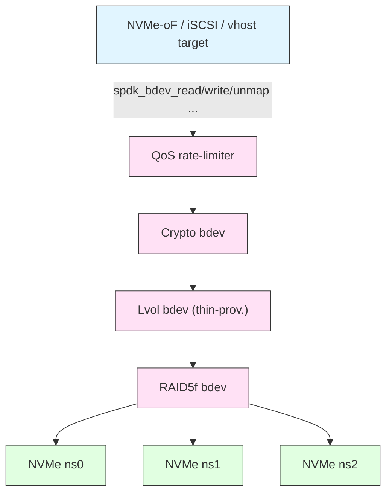
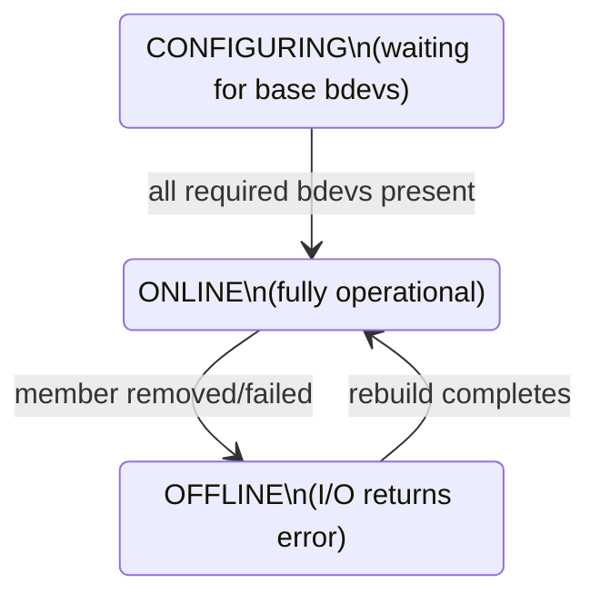
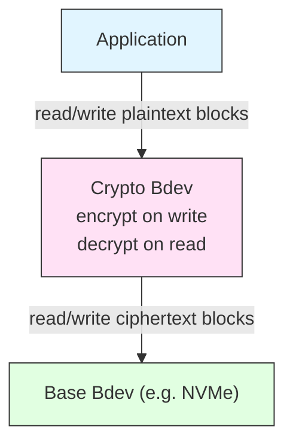
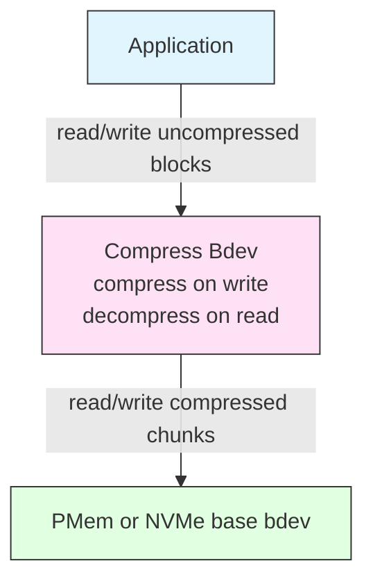
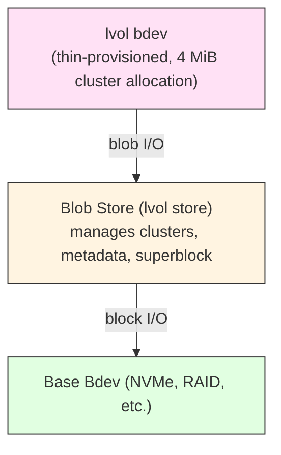
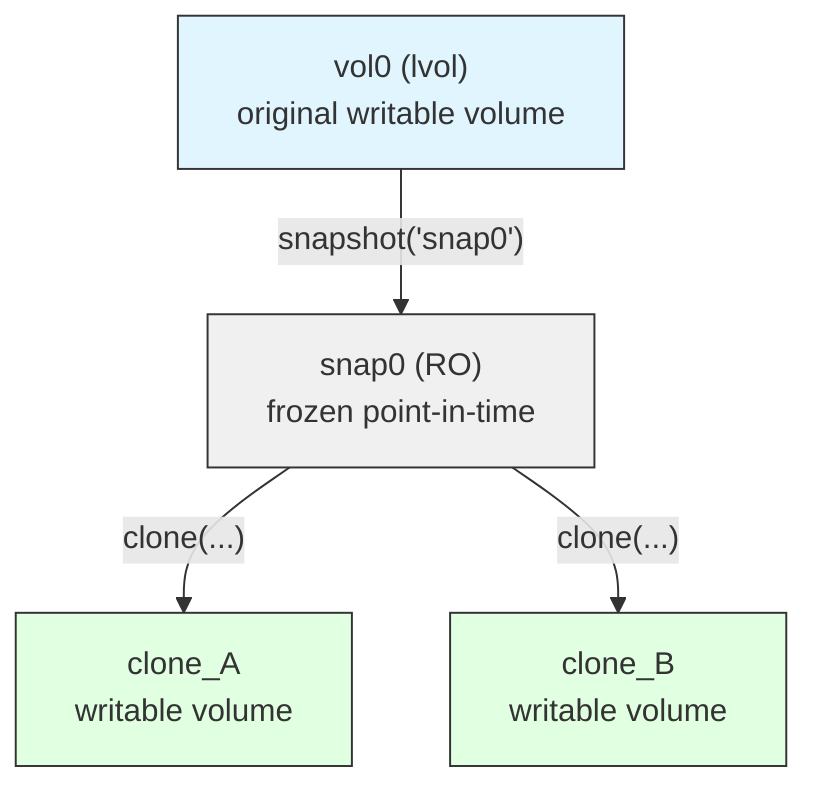
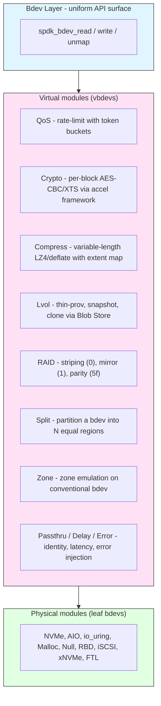

# 모듈 29: 고급 Bdev 주제 (Advanced Bdev Topics)

**3단계 – 마스터리 | 예상 읽기 시간: ~60분**

---

## 선수 과목

Before working through this module you should be comfortable with:

- Module 10 (Bdev Architecture Fundamentals) – the `spdk_bdev` / `spdk_bdev_desc` / `spdk_bdev_io` lifecycle
- Module 11 (Writing a Bdev Module) – the `spdk_bdev_module` registration pattern
- Module 15 (Blob Store) – blob-store concepts that underpin lvol
- Module 20 (I/O Path Deep-Dive) – how I/O travels from initiator to device

---

## 학습 목표

By the end of this module you will be able to:

1. Explain how SPDK stacks bdev modules to form complex I/O pipelines
2. Use the claim and release APIs correctly when writing a virtual bdev
3. Describe the internals of the RAID module (RAID0, RAID1, RAID5f)
4. Understand how the crypto bdev layers encryption transparently below any bdev
5. Manage Logical Volume Stores and lvol bdevs programmatically
6. Configure and reason about Quality-of-Service rate limits
7. Understand I/O splitting, zone support, and zone-block emulation

---

## 1. Bdev Layering Architecture

### 1.1 Physical vs. Virtual Bdevs

SPDK divides bdev modules into two broad categories:

| 분류 | 예시 | 특성 |
|----------|----------|----------------|
| **Physical (leaf) bdevs** | `nvme`, `aio`, `uring`, `malloc`, `null` | Wrap a real storage medium or kernel interface |
| **Virtual (vbdev) modules** | `raid`, `lvol`, `crypto`, `split`, `passthru`, `delay`, `error` | Sit above one or more existing bdevs and transform or aggregate I/O |

A virtual bdev **opens** one or more base bdevs, **claims** exclusive or shared ownership, exposes a new `spdk_bdev` upward, and forwards (possibly transformed) I/O downward.

### 1.2 The Layering Stack



Every layer in the stack is a fully independent `spdk_bdev`. The next layer above uses exactly the same public API (`spdk_bdev_read_blocks`, `spdk_bdev_write_blocks`, etc.) regardless of what lies beneath. This uniformity is the central design win: any vbdev can stack on top of any other bdev without special-casing.

### 1.3 The `spdk_bdev_module` Registration Pattern

Every bdev module – physical or virtual – registers itself by populating an `spdk_bdev_module` structure and passing it to `spdk_bdev_module_list_add()` via the `SPDK_BDEV_MODULE_REGISTER` macro.

```c
/* include/spdk/bdev_module.h (simplified) */
struct spdk_bdev_module {
    const char *name;

    /* Called once when SPDK starts */
    int  (*module_init)(void);
    void (*module_fini)(void);
    void (*module_fini_start)(void);

    /* Called for every existing bdev when this module loads,
     * and again whenever a new bdev appears. Virtual modules
     * inspect base bdevs and build their own bdevs here. */
    void (*examine_config)(struct spdk_bdev *bdev);
    void (*examine_disk)(struct spdk_bdev *bdev);

    int  (*config_json)(struct spdk_json_write_ctx *w);

    /* Points to the fn_table implemented by this module */
    const struct spdk_bdev_fn_table *fn_table; /* per-bdev ops */
    ...
};
```

The `fn_table` is what makes each bdev unique:

```c
struct spdk_bdev_fn_table {
    void (*destruct)(void *ctx);
    void (*submit_request)(struct spdk_io_channel *ch,
                           struct spdk_bdev_io *bdev_io);
    bool (*io_type_supported)(void *ctx,
                              enum spdk_bdev_io_type io_type);
    struct spdk_io_channel *(*get_io_channel)(void *ctx);
    int  (*dump_info_json)(void *ctx, struct spdk_json_write_ctx *w);
    void (*write_config_json)(struct spdk_bdev *bdev,
                              struct spdk_json_write_ctx *w);
    int  (*get_memory_domains)(void *ctx,
                               struct spdk_memory_domain **domains,
                               int array_size);
    int  (*accel_sequence_supported)(void *ctx,
                                     enum spdk_bdev_io_type type);
};
```

`submit_request` is the hot path: the bdev layer calls it once per I/O. For a vbdev this is where transformation, fan-out, or redirection happens.

---

## 2. Claims and Dependencies

### 2.1 Why Claims Exist

When a virtual bdev module opens a base bdev, it typically must prevent another consumer from deleting or administratively reconfiguring that base bdev while the virtual bdev is alive. The **claim mechanism** is how this mutual exclusion is expressed.

Without claims, a race between `bdev_delete` and an in-flight I/O on a stacked bdev could corrupt state or dereference freed memory.

### 2.2 Claim API (v2 – post SPDK 22.09)

The preferred API works on descriptors rather than raw `spdk_bdev` pointers:

```c
/* include/spdk/bdev_module.h */

/**
 * Acquire an exclusive write claim on a bdev via its descriptor.
 *
 * @param desc   Open descriptor (obtained from spdk_bdev_open_ext)
 * @param mode   SPDK_BDEV_CLAIM_EXCL_WRITE or SPDK_BDEV_CLAIM_READ_MANY_WRITE_ONE
 * @param opts   Optional options (may be NULL)
 * @param module The module acquiring the claim
 * @return 0 on success, -EPERM if already claimed incompatibly
 */
int spdk_bdev_module_claim_bdev_desc(struct spdk_bdev_desc *desc,
                                     enum spdk_bdev_claim_type mode,
                                     struct spdk_bdev_claim_opts *opts,
                                     struct spdk_bdev_module *module);
```

The older v1 API (`spdk_bdev_module_claim_bdev`) still works for backward compatibility but is limited to a single exclusive claim per bdev:

```c
/* Deprecated v1 – single exclusive claim */
int spdk_bdev_module_claim_bdev(struct spdk_bdev *bdev,
                                struct spdk_bdev_desc *desc,
                                struct spdk_bdev_module *module);

/* Release claim acquired with either v1 or v2 */
void spdk_bdev_module_release_bdev(struct spdk_bdev *bdev);
```

### 2.3 Lifecycle Pattern for a Virtual Bdev

```c
static int
myvbdev_create(const char *base_name, const char *vbdev_name)
{
    struct spdk_bdev_desc *desc;
    struct my_vbdev *vb;
    int rc;

    /* 1. Open the base bdev */
    rc = spdk_bdev_open_ext(base_name, true /* write */, myvbdev_event_cb,
                            NULL, &desc);
    if (rc != 0) {
        return rc;
    }

    /* 2. Claim it so nothing else can delete it while we use it */
    rc = spdk_bdev_module_claim_bdev_desc(desc,
                                          SPDK_BDEV_CLAIM_EXCL_WRITE,
                                          NULL, &g_my_module);
    if (rc != 0) {
        spdk_bdev_close(desc);
        return rc;
    }

    /* 3. Allocate and populate the virtual bdev structure */
    vb = calloc(1, sizeof(*vb));
    vb->base_desc = desc;
    vb->bdev.name = strdup(vbdev_name);
    vb->bdev.blocklen = spdk_bdev_get_block_size(spdk_bdev_desc_get_bdev(desc));
    vb->bdev.blockcnt = spdk_bdev_get_num_blocks(spdk_bdev_desc_get_bdev(desc));
    vb->bdev.module    = &g_my_module;
    vb->bdev.fn_table  = &g_my_fn_table;

    /* 4. Register the virtual bdev */
    rc = spdk_bdev_register(&vb->bdev);
    if (rc != 0) {
        spdk_bdev_module_release_bdev(spdk_bdev_desc_get_bdev(desc));
        spdk_bdev_close(desc);
        free(vb);
        return rc;
    }

    return 0;
}

static void
myvbdev_destruct(void *ctx)
{
    struct my_vbdev *vb = ctx;

    /* Release claim before closing the descriptor */
    spdk_bdev_module_release_bdev(spdk_bdev_desc_get_bdev(vb->base_desc));
    spdk_bdev_close(vb->base_desc);
    free(vb->bdev.name);
    free(vb);

    spdk_bdev_destruct_done(&vb->bdev, 0);
}
```

### 2.4 Claim Types

| Claim Type | Semantics |
|-----------|-----------|
| `SPDK_BDEV_CLAIM_EXCL_WRITE` | Exactly one writer; no other claims permitted |
| `SPDK_BDEV_CLAIM_READ_MANY_WRITE_ONE` | Multiple read-only claimants; one writer |
| `SPDK_BDEV_CLAIM_READ_MANY_WRITE_NONE` | Read-only access; multiple permitted, no writers |
| `SPDK_BDEV_CLAIM_READ_MANY_WRITE_SHARED` | Multiple readers and writers (application must coordinate externally) |

The RAID module uses `SPDK_BDEV_CLAIM_EXCL_WRITE` on each base bdev so that no other subsystem can simultaneously write raw data underneath the array.

### 2.5 Examine Callbacks

Virtual modules discover base bdevs through two examine callbacks:

```
examine_config(bdev)  →  called synchronously; no I/O allowed
examine_disk(bdev)    →  called asynchronously; I/O allowed (e.g., read superblock)
```

Both **must** call `spdk_bdev_module_examine_done(&g_my_module)` before returning (or before completing the async path). Failing to do so will stall SPDK's initialization sequence indefinitely.

---

## 3. RAID Module Internals

### 3.1 Source Layout

```
module/bdev/raid/
├── bdev_raid.c       – core: registration, I/O dispatch, superblock
├── bdev_raid.h       – internal structures
├── bdev_raid_rpc.c   – JSON-RPC handlers
├── bdev_raid_sb.c    – superblock read/write
├── raid0.c           – RAID 0 level driver
├── raid1.c           – RAID 1 level driver
├── raid5f.c          – RAID 5f (full-stripe write) level driver
└── concat.c          – concatenation level driver
```

### 3.2 Core Data Structures

```c
/* module/bdev/raid/bdev_raid.h (simplified) */

enum raid_level {
    INVALID_RAID_LEVEL = -1,
    RAID0              = 0,
    RAID1              = 1,
    RAID5F             = 95, /* 0x5f */
    CONCAT             = 99,
};

enum raid_bdev_state {
    RAID_BDEV_STATE_ONLINE,       /* fully operational */
    RAID_BDEV_STATE_CONFIGURING,  /* not all base bdevs present yet */
    RAID_BDEV_STATE_OFFLINE,      /* completes I/O with error */
    RAID_BDEV_STATE_MAX
};

struct raid_bdev {
    struct spdk_bdev       bdev;           /* exposed upward */
    uint8_t                num_base_bdevs;
    uint8_t                num_base_bdevs_discovered;
    uint8_t                num_base_bdevs_operational;
    uint32_t               strip_size;        /* in blocks */
    uint32_t               strip_size_kb;
    uint32_t               strip_size_shift;  /* log2(strip_size) */
    enum raid_level        level;
    enum raid_bdev_state   state;
    struct raid_base_bdev_info *base_bdev_info; /* array, one per member */
    const struct raid_bdev_module *module;      /* level-specific ops */
    bool                   superblock_enabled;
    ...
};
```

### 3.3 RAID 0 – Striping (No Redundancy)

RAID 0 spreads data across all member drives in stripe units called **strips** (the SPDK source uses the term "strip", not "chunk"). For an I/O that spans multiple strips:

```
Disk 0   Disk 1   Disk 2   Disk 3
[ S0 ]   [ S1 ]   [ S2 ]   [ S3 ]   ← stripe 0
[ S4 ]   [ S5 ]   [ S6 ]   [ S7 ]   ← stripe 1
```

**I/O path:**

1. `raid0_submit_rw_request()` computes, for each block offset:
   - `stripe_index = block / (strip_size * num_base_bdevs)`
   - `strip_in_stripe = (block / strip_size) % num_base_bdevs`
   - `offset_in_strip = block % strip_size`
2. Splits the parent `spdk_bdev_io` into child I/Os, one per affected disk.
3. Tracks completions; when all children complete, calls the parent completion callback.

**RPC to create:**

```bash
rpc.py bdev_raid_create \
    --name MyRAID0 \
    --raid-level 0 \
    --strip-size-kb 64 \
    --base-bdevs "Nvme0n1 Nvme1n1 Nvme2n1 Nvme3n1"
```

### 3.4 RAID 1 – Mirroring

RAID 1 replicates every write to all member drives. Reads are distributed round-robin (or to the least-loaded member).

```
Disk 0   Disk 1
[ A  ]   [ A  ]   ← identical copies
[ B  ]   [ B  ]
```

Key behaviors in `module/bdev/raid/raid1.c`:

- **Writes** fan out to all operational members; the parent I/O completes when the minimum required number of members acknowledge (configurable, defaults to all).
- **Reads** are load-balanced across operational members using a per-channel counter.
- **Degraded reads** automatically fall back to whichever member is still online.

**RPC:**

```bash
rpc.py bdev_raid_create \
    --name MyRAID1 \
    --raid-level 1 \
    --base-bdevs "Nvme0n1 Nvme1n1"
```

### 3.5 RAID 5f – Full-Stripe Writes

RAID 5f is SPDK's RAID-5 variant that **only accepts full-stripe writes**. This sidesteps the read-modify-write penalty of classic RAID 5. The "f" denotes "full-stripe."

```
Disk 0   Disk 1   Disk 2   Disk 3 (parity P)
[ D0 ]   [ D1 ]   [ D2 ]   [ P0 ]   ← stripe 0, P0 = D0 XOR D1 XOR D2
[ D3 ]   [ D4 ]   [ D5 ]   [ P1 ]   ← stripe 1
```

Parity rotates across disks (left-symmetric rotation).

**Write path:**

1. Accumulate data blocks until a full stripe is ready.
2. Compute parity in-place: XOR all data strips.
3. Submit all N data writes plus one parity write concurrently.
4. Complete parent I/O once all N+1 child writes succeed.

**Read path** (no reconstruction needed for healthy array):

1. Compute which disk holds each requested block (same math as RAID 0 with a parity column offset).
2. Issue read(s) directly; bypass parity disk.

**Reconstruction read** (one disk failed):

1. Read all remaining N-1 data strips plus the parity strip.
2. XOR all of them to reconstruct the missing strip.

**RPC:**

```bash
rpc.py bdev_raid_create \
    --name MyRAID5f \
    --raid-level 5f \
    --strip-size-kb 128 \
    --base-bdevs "Nvme0n1 Nvme1n1 Nvme2n1 Nvme3n1"
```

### 3.6 Superblock

When `--superblock` is passed to `bdev_raid_create`, RAID stores metadata at the start of each member bdev (first 1 MiB reserved by `RAID_BDEV_MIN_DATA_OFFSET_SIZE`). On subsequent SPDK restarts, `examine_disk` reads each superblock, reconstructs the array membership, and re-instantiates the RAID bdev – no explicit configuration required.

```bash
rpc.py bdev_raid_create \
    --name PersistentRAID \
    --raid-level 0 \
    --strip-size-kb 64 \
    --superblock \
    --base-bdevs "Nvme0n1 Nvme1n1"
```

### 3.7 RAID State Transitions



---

## 4. Crypto Bdev (Encryption Layer)

### 4.1 Architecture

The crypto vbdev (`module/bdev/crypto/vbdev_crypto.c`) wraps an existing bdev and provides transparent AES-CBC or AES-XTS block encryption. It depends on DPDK's `rte_cryptodev` framework or SPDK's accelerator abstraction.



### 4.2 Key Concepts

**Logical block granularity.** Encryption is applied per logical block. The crypto bdev block size equals the base bdev block size (512 B, 4096 B, etc.).

**IV derivation.** The initialization vector for each block is derived from the logical block address (LBA). This ensures that writing the same plaintext to different LBAs produces different ciphertext (sector tweak in XTS mode).

**Accel framework.** Starting with SPDK 23.x, the crypto bdev can delegate encryption/decryption to the generic `spdk_accel` framework, which dispatches to hardware accelerators (QAT, MLX5 crypto offload) or a software fallback (ISA-L).

### 4.3 Creating a Crypto Bdev

```bash
# Create an AES_CBC key
rpc.py accel_crypto_key_create \
    --cipher AES_CBC \
    --key  0123456789abcdef0123456789abcdef \
    --key2 fedcba9876543210fedcba9876543210 \
    --name my_key

# Wrap an existing bdev with encryption
rpc.py bdev_crypto_create \
    --base-bdev-name Nvme0n1 \
    --name EncryptedDisk \
    --key-name my_key
```

### 4.4 Write Path (Simplified)

```c
static void
vbdev_crypto_submit_request(struct spdk_io_channel *ch,
                            struct spdk_bdev_io *bdev_io)
{
    switch (bdev_io->type) {
    case SPDK_BDEV_IO_TYPE_WRITE:
        /* 1. Allocate crypto operation */
        /* 2. Set up source SGL from bdev_io->u.bdev.iovs */
        /* 3. Set IV from bdev_io->u.bdev.offset_blocks */
        /* 4. Submit encrypt op to accel channel */
        /* 5. In completion: submit encrypted data to base bdev */
        crypto_write_start(ch, bdev_io);
        break;
    case SPDK_BDEV_IO_TYPE_READ:
        /* 1. Forward read to base bdev */
        /* 2. In completion: submit decrypt op */
        /* 3. In decrypt completion: complete bdev_io upward */
        crypto_read_start(ch, bdev_io);
        break;
    default:
        /* Pass unmap, flush, etc. directly to base bdev */
        spdk_bdev_io_resubmit(bdev_io, crypto_ch->base_ch);
        break;
    }
}
```

### 4.5 Performance Considerations

- **Copy avoidance.** When the accelerator supports in-place transforms, encryption/decryption can happen without a data copy.
- **Batching.** The accel framework batches multiple crypto ops into a single submission burst.
- **Key rotation.** Changing encryption keys requires re-encrypting data offline; the crypto bdev does not support live key rotation.
- **Unmap passthrough.** UNMAP/TRIM is passed directly to the base bdev; no decryption needed.

---

## 5. Compress Bdev (Compression Layer)

> Note: The compress bdev (`module/bdev/compress/`) was present in earlier SPDK releases and has been deprecated/removed in some distributions in favor of the accel-based compression path. The concepts below describe the design; check your specific SPDK version for availability.

### 5.1 Architecture



### 5.2 Compression Granularity and Metadata

Because compressed data is variable-length, the compress bdev cannot store compressed blocks at fixed LBA offsets. It maintains a metadata region that maps logical blocks to physical extents on the backing store.

- Each **logical block cluster** (typically 4 KiB) is compressed independently.
- A **compression table** records the physical offset and size of each compressed cluster.
- On a cache miss, the bdev reads and decompresses an entire cluster.

### 5.3 Write Amplification Trade-off

Compression reduces the amount of data written to flash, extending its lifespan. However:

- Writes become read-modify-write operations at the cluster granularity.
- Compressible data (zeros, repeated patterns) achieves high ratios; incompressible data (already compressed, encrypted) may expand slightly.

### 5.4 Algorithm Selection

The compress bdev used DPDK's `rte_compressdev` with LZ4 or deflate back-ends, mirroring the crypto bdev's approach of delegating algorithm-specific work to an acceleration layer.

---

## 6. Logical Volumes (lvol)

### 6.1 Overview

The lvol subsystem (`lib/lvol/`, `module/bdev/lvol/`) provides thin-provisioned, snapshotable, cloneable block devices built on top of SPDK's Blob Store.



### 6.2 Key Terminology

| Term | Meaning |
|------|---------|
| **Lvol store (lvs)** | A Blob Store instance on a base bdev; the container for all lvols |
| **Lvol bdev** | An individual thin-provisioned volume within an lvs |
| **Cluster** | Allocation unit; default 4 MiB; configured at lvs creation |
| **Snapshot** | Read-only point-in-time copy; created from an existing lvol |
| **Clone** | Writable copy-on-write child derived from a snapshot |

### 6.3 Data Structures

```c
/* include/spdk/lvol.h (simplified) */

struct spdk_lvs_opts {
    uint32_t  cluster_sz;        /* in bytes; must be multiple of 4 KiB */
    enum lvs_clear_method clear_method;
    char      name[SPDK_LVS_NAME_MAX]; /* 64 chars max */
    uint32_t  num_md_pages_per_cluster_ratio; /* 100 = 1 page/cluster */
    uint32_t  opts_size;
    spdk_bs_esnap_dev_create esnap_bs_dev_create; /* for external snapshots */
    uint32_t  md_page_size;
} __attribute__((packed));

enum lvol_clear_method {
    LVOL_CLEAR_WITH_DEFAULT    = BLOB_CLEAR_WITH_DEFAULT,
    LVOL_CLEAR_WITH_NONE       = BLOB_CLEAR_WITH_NONE,
    LVOL_CLEAR_WITH_UNMAP      = BLOB_CLEAR_WITH_UNMAP,
    LVOL_CLEAR_WITH_WRITE_ZEROES = BLOB_CLEAR_WITH_WRITE_ZEROES,
};
```

### 6.4 Lvol Store Lifecycle

**Initialize (format) a new lvs on a base bdev:**

```c
/* include/spdk/lvol.h */
int spdk_lvs_init(struct spdk_bs_dev *bs_dev,
                  struct spdk_lvs_opts *o,
                  spdk_lvs_op_with_handle_complete cb_fn,
                  void *cb_arg);
```

```c
static void
lvs_init_cb(void *cb_arg, struct spdk_lvol_store *lvs, int lvserrno)
{
    if (lvserrno != 0) {
        SPDK_ERRLOG("lvs_init failed: %s\n", spdk_strerror(-lvserrno));
        return;
    }
    g_lvs = lvs;
    /* Now create lvols on g_lvs */
}

void
create_lvol_store(struct spdk_bdev *base_bdev)
{
    struct spdk_bs_dev *bs_dev;
    struct spdk_lvs_opts opts;

    spdk_lvs_opts_init(&opts);
    opts.cluster_sz = 4 * 1024 * 1024; /* 4 MiB */
    snprintf(opts.name, sizeof(opts.name), "MyLvs");

    bs_dev = spdk_bdev_create_bs_dev_ext(base_bdev->name, bdev_event_cb,
                                          NULL, NULL);
    spdk_lvs_init(bs_dev, &opts, lvs_init_cb, NULL);
}
```

**Load an existing lvs (after restart):**

```c
void spdk_lvs_load(struct spdk_bs_dev *bs_dev,
                   spdk_lvs_op_with_handle_complete cb_fn,
                   void *cb_arg);

void spdk_lvs_load_ext(struct spdk_bs_dev *bs_dev,
                       const struct spdk_lvs_opts *lvs_opts,
                       spdk_lvs_op_with_handle_complete cb_fn,
                       void *cb_arg);
```

**Destroy an lvs (erases all data):**

```c
int spdk_lvs_destroy(struct spdk_lvol_store *lvs,
                     spdk_lvs_op_complete cb_fn, void *cb_arg);
```

### 6.5 Lvol Lifecycle

**Create:**

```c
int spdk_lvol_create(struct spdk_lvol_store *lvs,
                     const char *name,
                     uint64_t sz,          /* size in bytes */
                     bool thin_provision,
                     enum lvol_clear_method clear_method,
                     spdk_lvol_op_with_handle_complete cb_fn,
                     void *cb_arg);
```

```c
static void
lvol_create_cb(void *cb_arg, struct spdk_lvol *lvol, int lvolerrno)
{
    if (lvolerrno != 0) {
        SPDK_ERRLOG("lvol create failed\n");
        return;
    }
    /* lvol is now an spdk_bdev named "MyLvs/vol0" */
    SPDK_NOTICELOG("Created lvol: %s\n", spdk_lvol_get_name(lvol));
}

spdk_lvol_create(g_lvs, "vol0",
                 10ULL * 1024 * 1024 * 1024, /* 10 GiB */
                 true,                         /* thin provisioned */
                 LVOL_CLEAR_WITH_UNMAP,
                 lvol_create_cb, NULL);
```

**Snapshot:**

```c
void spdk_lvol_create_snapshot(struct spdk_lvol *lvol,
                               const char *snapshot_name,
                               spdk_lvol_op_with_handle_complete cb_fn,
                               void *cb_arg);
```

After snapshot creation, the original lvol becomes a thin clone of the snapshot. Writes to either copy trigger copy-on-write at cluster granularity.

**Clone:**

```c
void spdk_lvol_create_clone(struct spdk_lvol *lvol,
                            const char *clone_name,
                            spdk_lvol_op_with_handle_complete cb_fn,
                            void *cb_arg);
```

`lvol` passed here must be a **snapshot** (read-only). The resulting clone is writable. Multiple clones can share the same snapshot.

**Open (after restart):**

```c
void spdk_lvol_open(struct spdk_lvol *lvol,
                    spdk_lvol_op_with_handle_complete cb_fn,
                    void *cb_arg);
```

### 6.6 Snapshot / Clone Tree



Clusters that have not been written since the snapshot are shared; a write to clone_A triggers allocation of a new cluster only for the dirty extent.

### 6.7 RPC Examples

```bash
# Create lvol store on NVMe namespace
rpc.py bdev_lvol_create_lvstore Nvme0n1 my_lvs

# Create a 10 GiB thin-provisioned lvol
rpc.py bdev_lvol_create --lvs-name my_lvs vol0 10240

# Snapshot
rpc.py bdev_lvol_snapshot my_lvs/vol0 snap0

# Clone from snapshot
rpc.py bdev_lvol_clone my_lvs/snap0 clone_a

# Resize lvol
rpc.py bdev_lvol_resize my_lvs/vol0 20480

# Delete snapshot (must have no clones depending on it)
rpc.py bdev_lvol_delete my_lvs/snap0

# Destroy the lvol store
rpc.py bdev_lvol_delete_lvstore --lvs-name my_lvs
```

### 6.8 Space Accounting

```
Physical device: 100 GiB
Lvol store:      97 GiB usable (3 GiB metadata)
  Cluster size:  4 MiB  →  ~24,832 data clusters

vol0 (thin, 50 GiB logical):
  Written so far: 8 GiB  →  2,048 clusters allocated
  Apparent size:  50 GiB
  Physical usage: 8 GiB + small cluster map overhead

snap0 (snapshot of vol0 at 8 GiB written):
  Shares vol0's 2,048 clusters (reference counted, no copy)

clone_a (clone of snap0):
  New writes go to freshly allocated clusters
  Unmodified extents still reference snap0's clusters
```

---

## 7. Quality of Service (QoS)

### 7.1 Overview

SPDK's bdev layer provides per-bdev I/O rate limiting through a QoS subsystem. Rate limits are enforced at the bdev layer before I/O reaches the storage device, giving fine-grained control over throughput and latency without modifying applications.

QoS in SPDK is implemented using a token-bucket algorithm: each bdev has buckets for each rate-limit type, refilled at a fixed rate. I/O proceeds only when sufficient tokens are available; otherwise the I/O is queued.

### 7.2 Rate Limit Types

```c
/* include/spdk/bdev.h */
enum spdk_bdev_qos_rate_limit_type {
    /** IOPS rate limit (reads + writes combined) */
    SPDK_BDEV_QOS_RW_IOPS_RATE_LIMIT  = 0,

    /** Read + write bandwidth limit (bytes/sec) */
    SPDK_BDEV_QOS_RW_BPS_RATE_LIMIT,

    /** Read-only bandwidth limit */
    SPDK_BDEV_QOS_R_BPS_RATE_LIMIT,

    /** Write-only bandwidth limit */
    SPDK_BDEV_QOS_W_BPS_RATE_LIMIT,

    SPDK_BDEV_QOS_NUM_RATE_LIMIT_TYPES
};
```

Multiple limits can be active simultaneously; the I/O is held until **all** active buckets have sufficient tokens.

### 7.3 QoS API

```c
/* Get current rate limits (array of SPDK_BDEV_QOS_NUM_RATE_LIMIT_TYPES values) */
void spdk_bdev_get_qos_rate_limits(struct spdk_bdev *bdev, uint64_t *limits);

/* Set rate limits; 0 = unlimited for that type */
void spdk_bdev_set_qos_rate_limits(struct spdk_bdev *bdev,
                                   uint64_t *limits,
                                   spdk_bdev_set_qos_rate_limits_cb cb_fn,
                                   void *cb_arg);

/* Get the RPC name string for a limit type */
const char *spdk_bdev_get_qos_rpc_type(enum spdk_bdev_qos_rate_limit_type type);
```

### 7.4 Setting QoS Programmatically

```c
static void
qos_set_cb(void *cb_arg, int status)
{
    if (status != 0) {
        SPDK_ERRLOG("QoS set failed: %s\n", spdk_strerror(-status));
    }
}

void
apply_qos(struct spdk_bdev *bdev)
{
    uint64_t limits[SPDK_BDEV_QOS_NUM_RATE_LIMIT_TYPES];

    /* Start from current limits */
    spdk_bdev_get_qos_rate_limits(bdev, limits);

    /* Cap at 50,000 IOPS (read+write combined) */
    limits[SPDK_BDEV_QOS_RW_IOPS_RATE_LIMIT] = 50000;

    /* Cap at 500 MiB/s read bandwidth */
    limits[SPDK_BDEV_QOS_R_BPS_RATE_LIMIT] = 500ULL * 1024 * 1024;

    /* No write bandwidth limit */
    limits[SPDK_BDEV_QOS_W_BPS_RATE_LIMIT] = 0;

    /* Combined bandwidth limit: 0 = not set separately */
    limits[SPDK_BDEV_QOS_RW_BPS_RATE_LIMIT] = 0;

    spdk_bdev_set_qos_rate_limits(bdev, limits, qos_set_cb, NULL);
}
```

### 7.5 RPC Interface

```bash
# Apply QoS to an existing bdev
rpc.py bdev_set_qos_limit \
    --rw-ios-per-sec 50000 \
    --r-mbytes-per-sec 500 \
    Nvme0n1

# Remove a specific limit (set to 0)
rpc.py bdev_set_qos_limit --rw-ios-per-sec 0 Nvme0n1

# Remove all limits
rpc.py bdev_set_qos_limit \
    --rw-ios-per-sec 0 \
    --rw-mbytes-per-sec 0 \
    --r-mbytes-per-sec 0 \
    --w-mbytes-per-sec 0 \
    Nvme0n1

# Inspect current limits
rpc.py bdev_get_bdevs Nvme0n1 | python3 -m json.tool | grep -A10 qos
```

### 7.6 How Token Buckets Work

```
Token bucket parameters:
  rate       = 50,000 IOPS
  bucket_max = 50,000 tokens   (burst capacity = 1 second worth)
  refill_interval = 1 ms

Every millisecond:
  tokens += rate / 1000  →  +50 tokens
  tokens  = min(tokens, bucket_max)

On I/O arrival:
  if tokens >= 1:
      tokens -= 1
      submit I/O immediately
  else:
      queue I/O; dequeue when next refill provides a token
```

Queued I/Os are held in a per-bdev QoS queue and dispatched on the bdev's poller reactor. This means QoS enforcement happens on the thread that owns the bdev's management context, not the I/O submission thread.

### 7.7 QoS Impact on Latency

QoS rate limiting **trades throughput for fairness**. When the rate limit is active:

- I/Os exceeding the cap are dequeued no faster than the token refill rate.
- Average latency increases; tail latency can be significantly higher.
- Monitor `bdev_get_iostat` for queue depth growth as a signal that limits are too tight.

---

## 8. I/O Splitting

### 8.1 Why Splitting Exists

Physical devices have maximum transfer size constraints (`optimal_io_boundary`, `max_segment_size`, `max_num_segments`). If an application submits a large I/O that crosses such a boundary, the bdev layer must split it into sub-requests.

SPDK provides a generic splitting vbdev (`module/bdev/split/`) and also has internal splitting logic in `lib/bdev/bdev.c` for boundary-crossing I/O.

### 8.2 Split Bdev Module

The split module divides a single base bdev into multiple fixed-size partition-like bdevs:

```bash
# Create 4 equal splits on a 400 GiB NVMe namespace
rpc.py bdev_split_create Nvme0n1 4

# Results in: Nvme0n1p0, Nvme0n1p1, Nvme0n1p2, Nvme0n1p3
# Each 100 GiB

# Custom split sizes (in MiB)
rpc.py bdev_split_create Nvme0n1 3 --split-size-mb 65536
# Creates 3 × 64 GiB splits; remaining space unused
```

### 8.3 Internal I/O Splitting

The bdev layer automatically splits I/Os that:

1. **Cross an `optimal_io_boundary`.** Reported by the bdev; for NVMe, this is often the namespace's Preferred Write Granularity (PWG).
2. **Exceed `max_transfer_size`.** The bdev reports the maximum byte count per I/O.
3. **Have too many scatter-gather segments.** `max_num_segments` is a per-bdev limit.

```c
/* A bdev can signal its constraints: */
bdev->optimal_io_boundary = 128;  /* split at 128-block boundaries */
bdev->max_segment_size    = 128 * 1024; /* 128 KiB per SGL segment */
bdev->max_num_segments    = 512;
bdev->max_transfer_size   = 128 * 1024 * 1024; /* 128 MiB total */
```

When a split is needed, `bdev_io_split()` in `lib/bdev/bdev.c` creates child `spdk_bdev_io` structures that share the parent's memory. When all children complete, the parent is completed upward.

### 8.4 Passthrough Bdev

The passthrough module (`module/bdev/passthru/`) is a reference implementation of a minimal virtual bdev that forwards all I/O unchanged. It is useful as:

- A template for writing new virtual bdevs
- A debugging interposition point (add logging in `submit_request`)
- A testing shim to inject errors or delays (`module/bdev/error/`, `module/bdev/delay/`)

```bash
rpc.py bdev_passthru_create --base-bdev-name Nvme0n1 --name pt0
```

---

## 9. Zone Support and Zone Block Emulation

### 9.1 Zoned Storage Background

Zoned Namespace (ZNS) NVMe devices present a block address space divided into **zones**. Each zone has a write pointer; writes must be sequential within a zone, and a zone must be explicitly reset before it can be rewritten. ZNS eliminates the internal garbage collection overhead that SSDs with a large FTL suffer.

### 9.2 SPDK Zone API

The bdev layer has first-class support for zoned bdevs:

```c
/* Bdev zone properties */
uint64_t spdk_bdev_get_zone_size(const struct spdk_bdev *bdev);
uint32_t spdk_bdev_get_max_open_zones(const struct spdk_bdev *bdev);
uint32_t spdk_bdev_get_max_active_zones(const struct spdk_bdev *bdev);
uint32_t spdk_bdev_get_num_zones(const struct spdk_bdev *bdev);
uint64_t spdk_bdev_get_zone_id(const struct spdk_bdev *bdev, uint64_t offset_blocks);

/* Zone I/O operations */
int spdk_bdev_zone_management(struct spdk_bdev_desc *desc,
                              struct spdk_io_channel *ch,
                              uint64_t zone_id,
                              enum spdk_bdev_zone_action action,
                              spdk_bdev_io_completion_cb cb, void *cb_arg);

int spdk_bdev_zone_append(struct spdk_bdev_desc *desc,
                          struct spdk_io_channel *ch,
                          void *buf, uint64_t zone_id,
                          uint64_t num_blocks,
                          spdk_bdev_io_completion_cb cb, void *cb_arg);
```

Zone actions: `SPDK_BDEV_ZONE_RESET`, `SPDK_BDEV_ZONE_OPEN`, `SPDK_BDEV_ZONE_CLOSE`, `SPDK_BDEV_ZONE_FINISH`.

### 9.3 Zone Block Emulation (`zone_block`)

`module/bdev/zone_block/` emulates zoned-device semantics on top of a conventional (non-zoned) block device. This is valuable for:

- Testing ZNS-aware applications (e.g., RocksDB ZenFS) without real ZNS hardware
- Deploying ZNS-aware software on existing NVMe SSDs

```bash
rpc.py bdev_zone_block_create \
    --name ZonedMalloc \
    --base-bdev Malloc0 \
    --zone-capacity 131072 \
    --optimal-open-zones 4
```

The zone_block vbdev enforces write-pointer semantics in software: it tracks each zone's write pointer, rejects out-of-order writes, and handles zone reset by clearing the pointer.

---

## 10. Putting It Together: A Multi-Layer Pipeline Example

The following illustrates constructing a full bdev stack via RPC, demonstrating real-world composition:

```bash
# 1. Create four NVMe bdevs (assumed to be already discovered)
#    Nvme0n1, Nvme1n1, Nvme2n1, Nvme3n1

# 2. Build a RAID5f array across all four
rpc.py bdev_raid_create \
    --name raid5 \
    --raid-level 5f \
    --strip-size-kb 128 \
    --superblock \
    --base-bdevs "Nvme0n1 Nvme1n1 Nvme2n1 Nvme3n1"

# raid5 is now 3× NVMe capacity with parity

# 3. Create an lvol store on the RAID array
rpc.py bdev_lvol_create_lvstore raid5 nvme_lvs

# 4. Create two thin-provisioned lvols
rpc.py bdev_lvol_create --lvs-name nvme_lvs vm_disk_a 200000  # 200 GiB
rpc.py bdev_lvol_create --lvs-name nvme_lvs vm_disk_b 200000

# 5. Snapshot vm_disk_a (e.g., before a risky operation)
rpc.py bdev_lvol_snapshot nvme_lvs/vm_disk_a snap_before_upgrade

# 6. Wrap vm_disk_a with encryption
rpc.py accel_crypto_key_create \
    --cipher AES_XTS \
    --key  $(openssl rand -hex 32) \
    --key2 $(openssl rand -hex 32) \
    --name vm_a_key

rpc.py bdev_crypto_create \
    --base-bdev-name nvme_lvs/vm_disk_a \
    --name vm_disk_a_enc \
    --key-name vm_a_key

# 7. Apply QoS to limit the encrypted volume
rpc.py bdev_set_qos_limit \
    --rw-ios-per-sec 20000 \
    --rw-mbytes-per-sec 1000 \
    vm_disk_a_enc

# 8. Expose via NVMe-oF
rpc.py nvmf_subsystem_add_ns \
    nqn.2024-01.io.spdk:target \
    vm_disk_a_enc

# Final stack (top to bottom):
#   NVMe-oF target
#     vm_disk_a_enc  (crypto, AES-XTS)
#       nvme_lvs/vm_disk_a  (lvol, thin-prov, COW from snap)
#         raid5  (RAID5f, 3× NVMe)
#           Nvme0n1  Nvme1n1  Nvme2n1  Nvme3n1
```

This five-layer stack is fully operational with zero kernel involvement.

---

## 11. Debugging and Observability

### 11.1 bdev_get_bdevs

```bash
rpc.py bdev_get_bdevs [bdev-name]
```

Returns JSON for every registered bdev including: block size, block count, claimed-by module, product name, supported I/O types, assigned aliases.

### 11.2 bdev_get_iostat

```bash
rpc.py bdev_get_iostat [--bdev-name NAME]
```

Per-bdev counters: bytes read/written, I/Os read/written, errors, queue depth histogram. Poll repeatedly to compute throughput:

```bash
watch -n1 'rpc.py bdev_get_iostat --bdev-name MyRAID5f'
```

### 11.3 RAID-Specific Diagnostics

```bash
# List all RAID bdevs and their member state
rpc.py bdev_raid_get_bdevs all

# Output includes per-member bdev name, UUID, state (online/missing)
```

### 11.4 Lvol Diagnostics

```bash
# List all lvol stores
rpc.py bdev_lvol_get_lvstores

# List all lvols in a store
rpc.py bdev_lvol_get_lvols --lvs-name my_lvs
```

### 11.5 Trace Points

Enable SPDK trace to capture bdev I/O events:

```bash
# Build with tracing enabled (default in debug builds)
./spdk_trace -s spdk_bdev -t all
```

Key trace point groups: `bdev_io_start`, `bdev_io_done`, `bdev_abort`, `lvol_cow`, `raid_io_split`.

---

## 12. Architecture Summary: Mental Model



Key architectural properties:

1. **Composability.** Any vbdev can stack on any bdev; the stack depth is limited only by memory and sanity.
2. **Claim exclusivity.** Claims prevent concurrent destructive operations on shared base bdevs.
3. **Thread-safe by design.** Each bdev descriptor is used from one reactor thread; inter-thread I/O uses message passing, not locks.
4. **Zero-copy I/O paths.** SGLs flow through the stack without data copies wherever the hardware supports it.
5. **Async everything.** All operations that touch storage use callbacks; the reactor thread is never blocked.

---

## 핵심 요점

- A **virtual bdev** registers the same `spdk_bdev_module` + `spdk_bdev_fn_table` interface as a physical bdev; the caller cannot tell the difference.
- **Claims** (`spdk_bdev_module_claim_bdev_desc`) are mandatory for any vbdev that opens a base bdev for writing; they prevent concurrent destruction.
- **RAID0** stripes with no redundancy; **RAID1** mirrors; **RAID5f** parity-protects but requires full-stripe writes.
- The **crypto bdev** performs per-LBA AES encryption/decryption by delegating to the `spdk_accel` framework; it adds minimal CPU overhead when hardware offload is available.
- **Lvol** provides thin provisioning, snapshots, and clones by building on the Blob Store; cluster size (default 4 MiB) determines allocation granularity.
- **QoS** uses token-bucket rate limiters per bdev; setting a limit to 0 disables it; multiple limit types can coexist.
- **I/O splitting** is handled automatically by the bdev layer when an I/O crosses `optimal_io_boundary` or exceeds `max_transfer_size`.
- **Zone support** is a first-class bdev type; the `zone_block` module emulates ZNS semantics on conventional SSDs.

---

## Exercises

### Exercise 1: Build a Two-Layer Stack

Using a `malloc` bdev as the physical layer, construct the following stack and verify it with `bdev_get_bdevs`:

```
Malloc0 (512 MiB)
  └── split into 4 equal partitions
        └── wrap Malloc0p0 with passthru
              └── apply QoS limit of 5,000 IOPS to the passthru bdev
```

Observe what happens to latency (via `bdev_get_iostat`) when you drive the bdev above 5,000 IOPS using the `bdevperf` tool.

### Exercise 2: RAID with Superblock

1. Create three `malloc` bdevs (256 MiB each).
2. Create a RAID5f array with `--superblock` enabled.
3. Stop SPDK.
4. Restart SPDK with no `--config` flag (no explicit RAID config).
5. Verify that the RAID bdev auto-assembles from the superblock.
6. Explain what `examine_disk` does during the restart sequence.

### Exercise 3: Lvol Snapshot and Clone

1. Create a 512 MiB `null` bdev and an lvol store on it.
2. Create a 100 MiB thin-provisioned lvol named `vol0`.
3. Write a recognizable pattern to the first 4 MiB using `bdevperf` or `dd` via the SPDK NBD target.
4. Take a snapshot `snap0`.
5. Create a clone `clone_a` from `snap0`.
6. Write a different pattern to `clone_a`'s first 4 MiB.
7. Read back both `vol0` and `clone_a`; verify they are independent.
8. Explain the cluster sharing behavior before and after step 6.

### Exercise 4: QoS Token Bucket Observation

1. Create a `null` bdev with 1 GiB capacity.
2. Set a QoS limit of 10,000 IOPS (RW combined).
3. Run `bdevperf` targeting this bdev with queue depth 128 and 4 KiB I/O.
4. Observe that throughput is capped near 10,000 IOPS regardless of queue depth.
5. Remove the IOPS limit and set a 100 MiB/s bandwidth limit instead.
6. Re-run `bdevperf` with 512 KiB I/O and observe the effective IOPS cap.
7. Calculate: at 100 MiB/s with 512 KiB I/Os, what is the theoretical IOPS cap?

### Exercise 5: Write a Minimal Counting Vbdev

Using `module/bdev/passthru/vbdev_passthru.c` as a starting point:

1. Copy and rename the module to `vbdev_counter`.
2. Add a per-channel counter for reads and writes.
3. Add an RPC `bdev_counter_get_stats` that returns the counts.
4. Register the module and verify that counters increment correctly.
5. (Stretch) Implement a sliding-window rate measurement (ops/sec over last 5 seconds).

---

## Additional Resources

- `include/spdk/bdev.h` – Full public bdev API with Doxygen comments
- `include/spdk/bdev_module.h` – Module registration API; claim types; quiesce API
- `include/spdk/lvol.h` – Full lvol API with all lifecycle functions
- `module/bdev/raid/bdev_raid.h` – RAID internal structures
- `module/bdev/passthru/vbdev_passthru.c` – Minimal vbdev template (300 lines)
- `doc/bdev.md` – SPDK official bdev user guide with all RPC examples
- `test/bdev/bdevperf/bdevperf.c` – Reference performance test tool
- `test/lvol/lvol_test.sh` – Integration test suite for lvol operations
- SPDK mailing list: `spdk@lists.01.org`
- Conference talks: *"SPDK Storage Stack" at Open Source Summit* (archived at spdk.io)
