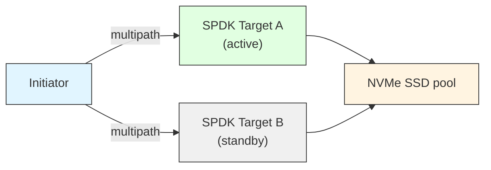
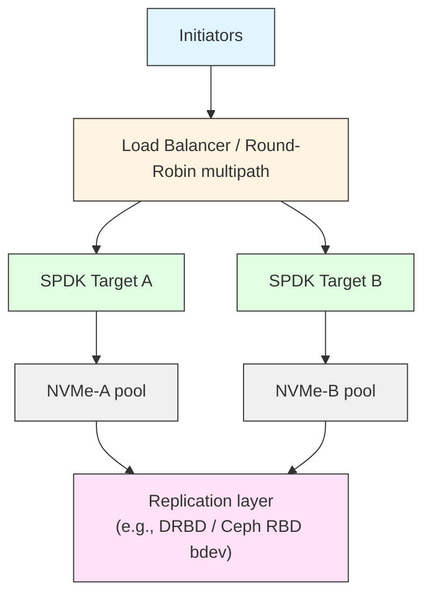
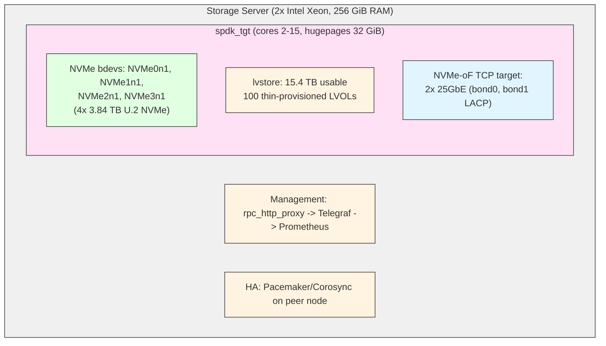
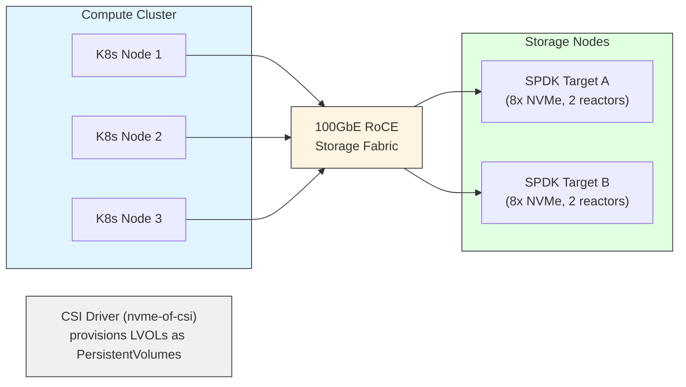

# 모듈 31: 프로덕션 배포 (Production Deployment)

**단계**: 3 - 마스터리 (Mastery)
**Prerequisites**: Modules 1-30, strong Linux systems administration background
**예상 소요 시간**: 6-8시간
**난이도**: 고급

---

## 개요

Deploying SPDK in production is a discipline that bridges deep kernel and userspace knowledge
with operational reliability requirements. A misconfigured SPDK deployment can silently
under-perform or cause data loss; a well-designed one delivers consistent sub-100-microsecond
latency at millions of IOPS under sustained load.

This module covers the full lifecycle: from hardware selection and OS preparation through
container orchestration, monitoring, security hardening, upgrade procedures, and disaster
recovery. Every section is grounded in the actual SPDK source tree you have on disk.

---

## 1. System Requirements for Production SPDK

### 1.1 Hardware Prerequisites

SPDK's poll-mode design means hardware quality is directly visible in tail latency. Cheap
commodity hardware will work for testing but will not sustain production SLAs.

**CPU**

- x86_64 with SSE4.2 and POPCNT (required for CRC32C offload)
- NUMA-aware multi-socket topology awareness is critical: keep reactor threads on the same
  NUMA node as the NVMe devices they drive
- Hyper-Threading: disable or dedicate full physical cores to reactor threads; sharing a
  physical core between a reactor and an OS thread produces latency spikes
- Recommended: Intel Xeon Scalable (Ice Lake / Sapphire Rapids) or AMD EPYC (Milan/Genoa)

**Memory**

- ECC RAM is mandatory for production storage targets
- NUMA interleaving should be disabled; SPDK allocates hugepages from a specific NUMA node
- Minimum 16 GiB for a small deployment; 64+ GiB typical for high-density NVMe targets
- Memory bandwidth matters as much as capacity for high-IOPS workloads

**NVMe Devices**

- Enterprise-grade NVMe (not consumer): power-loss protection, deterministic latency, high
  endurance
- PCIe Gen 4 or Gen 5 for bandwidth-sensitive workloads
- Check firmware revision against vendor errata before deployment
- IOMMU support required when using VFIO for device isolation (see Section 5)

**Network (NVMe-oF targets)**

- 25 GbE minimum; 100 GbE for high-throughput targets
- RDMA NICs (RoCE v2 or InfiniBand) for lowest latency
- TCP transport viable but adds ~20-40 µs versus RDMA
- Dedicated storage network VLAN, no shared LAN traffic

### 1.2 Operating System Requirements

```
Linux kernel: 4.4 minimum, 5.15 LTS or 6.1 LTS strongly recommended
IOMMU:        enabled in BIOS + kernel (intel_iommu=on or amd_iommu=on)
Hugepages:    2 MiB pages pre-allocated (1 GiB pages optional for large buffers)
CPU governor: performance (never powersave or ondemand)
IRQ affinity: isolate reactor CPUs from IRQ handling
```

**Kernel boot parameters** (`/etc/default/grub` GRUB_CMDLINE_LINUX):

```
intel_iommu=on iommu=pt isolcpus=2-15 nohz_full=2-15 rcu_nocbs=2-15
default_hugepagesz=2M hugepagesz=2M hugepages=4096
```

For AMD:
```
amd_iommu=on iommu=pt isolcpus=2-15 nohz_full=2-15 rcu_nocbs=2-15
default_hugepagesz=2M hugepagesz=2M hugepages=4096
```

After editing, regenerate grub and reboot:
```bash
grub2-mkconfig -o /boot/grub2/grub.cfg   # RHEL/Fedora
update-grub                               # Debian/Ubuntu
reboot
```

### 1.3 Pre-Deployment Checklist

Run these verifications before starting SPDK for the first time on a new host:

```bash
# Verify IOMMU is active
dmesg | grep -e DMAR -e IOMMU | head -20

# Verify hugepages allocation
grep HugePages /proc/meminfo

# Verify CPU governor
cat /sys/devices/system/cpu/cpu*/cpufreq/scaling_governor | sort -u
# Expected output: performance

# Verify NVMe devices visible
ls /dev/nvme*
nvme list

# Check PCIe link speed
lspci -vvv | grep -A3 "Non-Volatile"

# Run SPDK setup script (bind devices to VFIO/UIO)
sudo /usr/libexec/spdk/scripts/setup.sh

# Verify binding
/usr/libexec/spdk/scripts/setup.sh status
```

---

## 2. Capacity Planning

Proper capacity planning prevents the two most common production failures: CPU starvation
under burst load and OOM kills from inadequate hugepage allocation.

### 2.1 CPU Core Budgeting

SPDK uses a reactor-per-core model. Each reactor is a tight poll loop that never sleeps.
The number of reactors directly determines the I/O throughput ceiling.

**Rule of thumb from Intel validation:**

| Workload               | Cores per 100K IOPS |
|------------------------|---------------------|
| NVMe passthrough       | 0.5-1               |
| NVMe-oF TCP target     | 1-2                 |
| NVMe-oF RDMA target    | 0.3-0.7             |
| Blobstore/lvol stack   | 1-2                 |
| Compression (ISA-L)    | 2-3                 |

Always reserve at least 2 cores for the OS and management plane. Never assign CPU 0 to
a reactor; the kernel uses it for many system functions.

**Example cpumask calculation:**

```bash
# 16-core system, cores 0-1 for OS, cores 2-15 for SPDK
# Hex mask for cores 2-15: bits 2-15 set
python3 -c "print(hex(sum(1<<i for i in range(2,16))))"
# 0xfffc

# In spdk_tgt invocation:
spdk_tgt -m 0xfffc -c /etc/spdk/spdk.json
```

### 2.2 Memory and Hugepage Sizing

SPDK's memory allocator (spdk_malloc) draws exclusively from hugepages. The allocation
fails silently if hugepages are exhausted, causing connection drops and bdev errors.

**Memory components:**

| Component                          | Sizing Formula                         |
|------------------------------------|----------------------------------------|
| DMA descriptor ring per NVMe queue | ~4 KiB per queue depth entry           |
| NVMe queue pairs                   | 128 queues × 128 depth × 4K = 64 MiB  |
| Network buffer pools (TCP/RDMA)    | 2 GiB per 10 Gbps line rate            |
| SPDK internal metadata             | ~512 MiB base                          |
| bdev/lvol metadata                 | ~128 MiB per 100 logical volumes       |
| Safety headroom                    | 20% of total                           |

**Practical formula:**

```
hugepages_2M = ceil((base_mb + nvme_mb + net_mb + lvol_mb) * 1.2 / 2)
```

Example: 4 NVMe devices, 2 × 25 GbE TCP, 500 LVOLs:

```
= ceil((512 + 256 + 10240 + 640) * 1.2 / 2)
= ceil(11648 * 1.2 / 2)
= ceil(6988)
= 3494 × 2 MiB pages  →  set hugepages=3600 (rounded up)
```

**Runtime hugepage configuration (persistent):**

```bash
# Immediate allocation (survives until reboot)
echo 3600 > /sys/kernel/mm/hugepages/hugepages-2048kB/nr_hugepages

# Persistent via sysctl
echo "vm.nr_hugepages = 3600" >> /etc/sysctl.d/99-spdk-hugepages.conf
sysctl -p /etc/sysctl.d/99-spdk-hugepages.conf

# Mount hugetlbfs (required for containers)
mkdir -p /dev/hugepages
mount -t hugetlbfs nodev /dev/hugepages -o pagesize=2M
# Add to /etc/fstab:
echo "nodev /dev/hugepages hugetlbfs pagesize=2M 0 0" >> /etc/fstab
```

### 2.3 Storage Capacity Planning

```
Raw NVMe capacity  ×  0.85   = usable (7% overprovisioning + metadata)
Usable capacity    ×  write_amplification_factor  = effective endurance headroom
```

For LVOLs with thin provisioning, monitor the lvstore utilization ratio via RPC:

```bash
./scripts/rpc.py bdev_lvol_get_lvstores
```

Alert when `free_clusters / total_clusters < 0.15` (less than 15% free).

---

## 3. High Availability Setup Patterns

SPDK itself is a single-process, single-failure-domain application. HA must be
architected at the system level around SPDK instances.

### 3.1 Active-Passive Failover (NVMe-oF)



- NVMe-oF ANA (Asymmetric Namespace Access) groups: controller A owns Optimized path,
  controller B owns Non-Optimized path
- On failure of A, initiator's multipath driver (dm-multipath or NVMe native multipath)
  promotes B to optimized path in ~1 second

**Configure ANA groups in SPDK:**

```bash
# On Target A: make subsystem ANA group 1 = optimized
./scripts/rpc.py nvmf_subsystem_add_ns nqn.2024-01.io.spdk:cnode1 \
    Malloc0 --anagrpid 1

# On Target B: same namespace, ANA group 2 = non-optimized
./scripts/rpc.py nvmf_subsystem_add_ns nqn.2024-01.io.spdk:cnode1 \
    Malloc0 --anagrpid 2
```

### 3.2 Active-Active with Shared-Nothing Architecture



Each target owns a dedicated slice of NVMe devices. Replication can be handled by SPDK's
`bdev_raid` (RAID-1 across targets via NVMe-oF) or by an external replication service
using the `rbd` or `uring` bdev module.

### 3.3 Health Monitoring for Failover

SPDK does not include a built-in health daemon. Implement an external health probe:

```bash
#!/usr/bin/env bash
# /usr/local/bin/spdk-health-check.sh
# Returns 0 if SPDK target is healthy, non-zero otherwise

SPDK_RPC_SOCK="/var/tmp/spdk.sock"
TIMEOUT=3

if ! timeout $TIMEOUT /usr/libexec/spdk/scripts/rpc.py \
        -s "$SPDK_RPC_SOCK" spdk_get_version >/dev/null 2>&1; then
    echo "CRITICAL: SPDK RPC not responding"
    exit 2
fi

# Check that at least one subsystem is in active state
SUBSYS_COUNT=$(timeout $TIMEOUT /usr/libexec/spdk/scripts/rpc.py \
    -s "$SPDK_RPC_SOCK" nvmf_get_subsystems 2>/dev/null | \
    python3 -c "import sys,json; data=json.load(sys.stdin); \
    print(len([s for s in data if s.get('subtype')=='NVMe']))" 2>/dev/null)

if [[ -z "$SUBSYS_COUNT" || "$SUBSYS_COUNT" -eq 0 ]]; then
    echo "WARNING: No NVMe subsystems active"
    exit 1
fi

echo "OK: SPDK healthy, $SUBSYS_COUNT subsystems active"
exit 0
```

Register this with your load balancer (HAProxy, keepalived, or Pacemaker) as the health
check endpoint.

### 3.4 Data Replication via bdev_raid

For software RAID-1 across two NVMe-oF targets:

```json
{
  "subsystems": [
    {
      "subsystem": "bdev",
      "config": [
        {
          "method": "bdev_nvme_attach_controller",
          "params": {
            "name": "remote0",
            "trtype": "tcp",
            "traddr": "192.168.100.10",
            "trsvcid": "4420",
            "nqn": "nqn.2024-01.io.spdk:remote-target"
          }
        },
        {
          "method": "bdev_raid_create",
          "params": {
            "name": "raid1",
            "raid_level": "1",
            "strip_size_kb": 128,
            "base_bdevs": ["NVMe0n1", "remote0n1"]
          }
        }
      ]
    }
  ]
}
```

---

## 4. Monitoring and Alerting

### 4.1 SPDK Built-in Statistics

SPDK exposes I/O statistics per bdev via the `bdev_get_iostat` RPC method. Poll this
at 1-second intervals for real-time monitoring.

```bash
# Human-readable iostat snapshot
./scripts/rpc.py bdev_get_iostat

# JSON output for parsing
./scripts/rpc.py -f json bdev_get_iostat | python3 -m json.tool

# Continuous polling with delta computation
watch -n 1 './scripts/rpc.py bdev_get_iostat'
```

Key metrics to track:

| Metric              | Field in bdev_get_iostat        | Alert Threshold            |
|---------------------|---------------------------------|----------------------------|
| Read IOPS           | `num_read_ops` (delta/sec)      | >90% of device rated IOPS  |
| Write IOPS          | `num_write_ops` (delta/sec)     | >90% of device rated IOPS  |
| Read throughput     | `bytes_read` (delta/sec)        | >90% of device bandwidth   |
| Write throughput    | `bytes_written` (delta/sec)     | >90% of device bandwidth   |
| Read latency avg    | `read_latency_ticks` / ops      | >500 µs for NVMe           |
| Queue depth         | `io_pending` (instantaneous)    | >80% of configured depth   |

### 4.2 spdk_top Interactive Monitor

SPDK ships `spdk_top`, an ncurses-based real-time monitor analogous to `top` for
storage:

```bash
# Connect to running SPDK process
spdk_top -r /var/tmp/spdk.sock

# Key bindings inside spdk_top:
#   q       quit
#   1/2/3   switch views (reactors / pollers / threads)
#   s       sort by column
#   h       help
```

`spdk_top` shows per-thread CPU utilization, poller run counts, and scheduler
efficiency. A reactor showing 100% busy with low I/O throughput indicates a bottleneck
in the poller chain, not raw device saturation.

### 4.3 Prometheus + Telegraf Integration

The SPDK Docker suite ships a production-ready monitoring stack. The `rpc_http_proxy.py`
script exposes SPDK RPCs over HTTP so Telegraf can scrape them without socket access.

**rpc_http_proxy launch (part of spdk-app init script):**

```bash
# Start HTTP proxy on all interfaces, port 9009, with basic auth
rpc_http_proxy.py 0.0.0.0 9009 spdkuser spdkpass &
```

**Telegraf configuration** (`/etc/telegraf/telegraf.conf`):

```toml
[[inputs.http]]
  urls = ["http://localhost:9009"]
  headers = {"Content-Type" = "application/json"}
  method = "POST"
  username = "spdkuser"
  password = "spdkpass"
  body = '{"id":1, "method": "bdev_get_iostat"}'
  data_format = "json"
  name_override = "spdk"
  json_strict = true
  tag_keys = ["name"]
  json_query = "result.bdevs"

[[outputs.prometheus_client]]
  listen = ":9126"
  metric_version = 2
  path = "/metrics"
  string_as_label = true
  export_timestamp = true
```

**Prometheus scrape config** (`prometheus.yaml`):

```yaml
scrape_configs:
  - job_name: 'spdk'
    static_configs:
      - targets: ['telegraf:9126']
    scrape_interval: 5s
```

Query examples after deployment:

```bash
# Read throughput across all bdevs
curl -s 'http://localhost:9090/api/v1/query?query=rate(spdk_bytes_read[1m])'

# Write IOPS for specific bdev
curl -s 'http://localhost:9090/api/v1/query?query=rate(spdk_num_write_ops{name="NVMe0n1"}[1m])'
```

### 4.4 System-Level Monitoring

SPDK performance depends on system-level health. Monitor these in parallel:

```bash
# CPU utilization per core (look for reactor cores at ~100%)
mpstat -P ALL 1 5

# NUMA memory allocation balance
numastat -p $(pgrep spdk_tgt)

# PCIe error counters (non-zero = hardware problem)
for dev in /sys/bus/pci/devices/*/; do
    errors=$(cat "${dev}aer_dev_correctable" 2>/dev/null | grep -v " 0$")
    [[ -n "$errors" ]] && echo "$dev: $errors"
done

# NVMe SMART health (requires nvme-cli)
for dev in /dev/nvme*; do
    nvme smart-log "$dev" 2>/dev/null | grep -E "critical|available_spare|temperature"
done

# Memory pressure
cat /proc/meminfo | grep -E "HugePages|MemAvailable"
```

### 4.5 Alerting Rules (Prometheus Alertmanager)

```yaml
groups:
  - name: spdk_alerts
    rules:
      - alert: SPDKTargetDown
        expr: up{job="spdk"} == 0
        for: 30s
        labels:
          severity: critical
        annotations:
          summary: "SPDK target unreachable"

      - alert: SPDKHighReadLatency
        expr: rate(spdk_read_latency_ticks[1m]) / rate(spdk_num_read_ops[1m]) > 500000
        for: 2m
        labels:
          severity: warning
        annotations:
          summary: "SPDK read latency exceeds 500µs on {{ $labels.name }}"

      - alert: SPDKHugepagesLow
        expr: node_memory_HugePages_Free / node_memory_HugePages_Total < 0.10
        for: 5m
        labels:
          severity: warning
        annotations:
          summary: "Hugepage utilization above 90%"
```

---

## 5. Security Considerations

### 5.1 Least-Privilege Process Execution

Running `spdk_tgt` as root is the simplest approach but violates the principle of least
privilege. Use Linux capabilities to grant only what is required:

```bash
# Required capabilities for SPDK
#   CAP_IPC_LOCK  - mlock hugepages
#   CAP_SYS_RAWIO - direct device access via UIO (not needed with VFIO)
#   CAP_SYS_ADMIN - VFIO container/group operations

# Create a dedicated system user
useradd -r -s /sbin/nologin -d /var/lib/spdk spdk

# Grant capabilities to the binary
setcap 'cap_ipc_lock,cap_sys_admin+ep' /usr/local/bin/spdk_tgt

# Set hugepage directory ownership
chown spdk:spdk /dev/hugepages

# Run as spdk user
sudo -u spdk spdk_tgt -m 0xfffc -c /etc/spdk/spdk.json
```

### 5.2 VFIO for Device Isolation

VFIO (Virtual Function I/O) is the preferred device binding mechanism in production.
It provides IOMMU-backed DMA isolation: a compromised SPDK process cannot DMA outside
its assigned device memory windows.

```bash
# Load VFIO modules
modprobe vfio
modprobe vfio-pci

# Persist module loading
echo -e "vfio\nvfio-pci" >> /etc/modules-load.d/spdk-vfio.conf

# Bind NVMe device to VFIO (replaces nvme kernel driver)
PCI_ADDR="0000:01:00.0"
echo "$PCI_ADDR" > /sys/bus/pci/devices/$PCI_ADDR/driver/unbind
echo "vfio-pci" > /sys/bus/pci/devices/$PCI_ADDR/driver_override
echo "$PCI_ADDR" > /sys/bus/pci/drivers/vfio-pci/bind

# Or use SPDK's setup script
DRIVER_OVERRIDE=vfio-pci /usr/libexec/spdk/scripts/setup.sh
```

### 5.3 RPC Socket Security

The SPDK RPC socket (`/var/tmp/spdk.sock` by default) grants full administrative
control over the running instance. Protect it:

```bash
# Use a non-default socket path under a restricted directory
mkdir -p /run/spdk
chown spdk:spdk /run/spdk
chmod 750 /run/spdk

# Launch with custom socket path
spdk_tgt -r /run/spdk/spdk.sock ...

# Verify socket permissions after launch
ls -la /run/spdk/spdk.sock
# Should show: srwxr-x--- 1 spdk spdk

# Connect from authorized user only
sudo -u spdk ./scripts/rpc.py -s /run/spdk/spdk.sock bdev_get_bdevs
```

Never expose the RPC socket to a network interface without authentication. The
`rpc_http_proxy.py` script adds HTTP Basic Auth as a minimum; for production, add
TLS termination in front of it.

### 5.4 NVMe-oF Transport Security

**TCP transport with TLS (SPDK 23.01+):**

```json
{
  "method": "nvmf_create_transport",
  "params": {
    "trtype": "TCP",
    "tls_log_file": "/var/log/spdk-tls.log"
  }
}
```

```bash
# Generate server certificate
openssl req -x509 -newkey rsa:4096 -keyout /etc/spdk/tls.key \
    -out /etc/spdk/tls.crt -days 365 -nodes \
    -subj "/CN=spdk-nvmeof-target"

# Configure listener with TLS
./scripts/rpc.py nvmf_subsystem_add_listener \
    nqn.2024-01.io.spdk:cnode1 \
    -t tcp -a 0.0.0.0 -s 4420 \
    --secure-channel
```

**RDMA transport:** Uses InfiniBand/RoCE fabric-level security; deploy fabric ACLs and
subnet management to restrict which initiator HCAs can connect.

### 5.5 NVMe Namespace Access Control

```bash
# Restrict namespace access to specific host NQN
./scripts/rpc.py nvmf_subsystem_add_host \
    nqn.2024-01.io.spdk:cnode1 \
    nqn.2021-06.io.initiator:host1

# Remove "allow any host" policy (set during development)
./scripts/rpc.py nvmf_subsystem_allow_any_host \
    nqn.2024-01.io.spdk:cnode1 -f
```

### 5.6 Security Updates

Monitor the SPDK CVE process at `https://spdk.io/cve_threat/`. Subscribe to the
SPDK mailing list for security advisories. Key packages to keep updated:

- SPDK itself
- DPDK (bundled, used for memory/PCI management)
- OpenSSL (used for TLS in NVMe-oF TCP)
- Linux kernel (VFIO, NVMe driver for initiator paths)

---

## 6. Container Deployment

### 6.1 Container Requirements

Containers running SPDK require elevated privileges because SPDK needs:
- Access to hugepages (`/dev/hugepages`)
- Direct PCI device access (VFIO character devices)
- `CAP_IPC_LOCK` for hugepage mlock

The SPDK Docker suite at `docker/` demonstrates the reference architecture.

**Key constraints from the upstream Docker README:**
- Docker 20.10+ for cgroups v2 support
- Hugepages must be allocated on the host before containers start
- `/dev/hugepages` and `/dev/shm` must be available on the host

### 6.2 Dockerfile Pattern

The `docker/spdk-app/Dockerfile` follows this pattern:

```dockerfile
FROM spdk AS builder
# SPDK binaries installed into /usr/local/

FROM fedora:35
COPY --from=builder /usr/local /usr/local

# Install runtime dependencies (matching rpmbuild/spdk.spec requirements)
RUN dnf install -y libaio libgcc libstdc++ libuuid ncurses-libs numactl-libs \
    openssl-libs zlib && dnf clean all

# Entry point handles config mounting and optional HTTP proxy
COPY init /init
RUN chmod +x /init
ENTRYPOINT ["/init"]
```

The `init` script (from `docker/spdk-app/init`) handles:
- Selecting the SPDK application via `$SPDK_APP` environment variable
- Appending extra arguments via `$SPDK_ARGS`
- Optionally starting `rpc_http_proxy.py` when `$SPDK_HTTP_PROXY` is set
- Mounting `/config` as the JSON configuration file

### 6.3 Docker Compose Deployment

**Minimal production target:**

```yaml
version: "3.8"
services:
  spdk-target:
    image: spdk-app:latest
    container_name: spdk-target
    restart: unless-stopped
    networks:
      storage:
        ipv4_address: 10.100.0.10
    volumes:
      - /dev/hugepages:/dev/hugepages
      - /dev/shm:/dev/shm
      - ./config/spdk-target.json:/config:ro
      - /run/spdk:/run/spdk
    devices:
      - /dev/vfio/vfio:/dev/vfio/vfio
      - /dev/vfio/1:/dev/vfio/1    # adjust group number per lspci
    environment:
      - SPDK_ARGS=-m 0xfffc
      - SPDK_HTTP_PROXY=0.0.0.0 9009 spdkuser spdkpass
      - SPDK_NO_LIMIT=1
    cap_add:
      - IPC_LOCK
      - SYS_ADMIN
    security_opt:
      - no-new-privileges:true
    ulimits:
      memlock: -1
    cpuset: "2-15"                  # pin container to reactor cores
    mem_limit: 48g
    shm_size: 4g

networks:
  storage:
    ipam:
      config:
        - subnet: 10.100.0.0/24
```

**Do not use `privileged: true` in production.** The example in `docker/docker-compose.yaml`
uses it for simplicity; the `devices` + `cap_add` pattern above provides equivalent
functionality with a smaller attack surface.

### 6.4 Kubernetes Deployment

SPDK on Kubernetes requires the `device-plugin` pattern to expose VFIO devices and
hugepages as schedulable resources.

**Namespace and RBAC:**

```yaml
apiVersion: v1
kind: Namespace
metadata:
  name: spdk-storage
---
apiVersion: v1
kind: ServiceAccount
metadata:
  name: spdk-target
  namespace: spdk-storage
```

**DaemonSet for per-node NVMe-oF target:**

```yaml
apiVersion: apps/v1
kind: DaemonSet
metadata:
  name: spdk-nvmeof-target
  namespace: spdk-storage
spec:
  selector:
    matchLabels:
      app: spdk-nvmeof-target
  template:
    metadata:
      labels:
        app: spdk-nvmeof-target
    spec:
      serviceAccountName: spdk-target
      nodeSelector:
        node-role.kubernetes.io/storage: "true"
      hostNetwork: true            # required for NVMe-oF fabric access
      hostPID: false
      containers:
        - name: spdk-target
          image: spdk-app:23.09
          imagePullPolicy: IfNotPresent
          securityContext:
            capabilities:
              add:
                - IPC_LOCK
                - SYS_ADMIN
            runAsUser: 0
          env:
            - name: SPDK_ARGS
              value: "-m 0xfffc"
            - name: SPDK_HTTP_PROXY
              value: "0.0.0.0 9009 spdkuser spdkpass"
            - name: SPDK_NO_LIMIT
              value: "1"
          resources:
            requests:
              hugepages-2Mi: 8Gi
              memory: 4Gi
              cpu: "8"
            limits:
              hugepages-2Mi: 8Gi
              memory: 48Gi
          volumeMounts:
            - name: hugepages
              mountPath: /dev/hugepages
            - name: config
              mountPath: /config
              subPath: spdk-target.json
            - name: vfio
              mountPath: /dev/vfio
            - name: spdk-sock
              mountPath: /run/spdk
      volumes:
        - name: hugepages
          emptyDir:
            medium: HugePages-2Mi
        - name: config
          configMap:
            name: spdk-target-config
        - name: vfio
          hostPath:
            path: /dev/vfio
        - name: spdk-sock
          hostPath:
            path: /run/spdk
            type: DirectoryOrCreate
```

**Node preparation for Kubernetes:**

Before the DaemonSet runs, the node must have hugepages allocated and devices bound.
Use a privileged init DaemonSet or a MachineConfig (OpenShift) to run `setup.sh`.

---

## 7. RPM/DEB Packaging

### 7.1 Building RPM Packages

SPDK ships an RPM spec at `rpmbuild/spdk.spec`. The `rpmbuild/rpm.sh` wrapper handles
configuration.

```bash
# Install build dependencies
./scripts/pkgdep.sh --docs --rdma --uring

# Build default RPM (static linking)
./rpmbuild/rpm.sh

# Build with RDMA and shared libraries
./rpmbuild/rpm.sh --with-rdma --with-dpdk --shared

# Build with specific configure options
SPDK_CONFIGURE_OPTIONS="--with-rdma --with-fio-plugin" ./rpmbuild/rpm.sh

# Output location
ls ~/rpmbuild/RPMS/x86_64/
# spdk-<version>-<release>.x86_64.rpm
# spdk-devel-<version>-<release>.x86_64.rpm
# spdk-scripts-<version>-<release>.x86_64.rpm
```

The spec produces three sub-packages:
- `spdk`: runtime binaries (`/usr/local/bin/`)
- `spdk-devel`: headers and libraries (`/usr/local/include/`, `/usr/local/lib/`)
- `spdk-scripts`: utilities under `/usr/libexec/spdk/scripts/` with shell completion

**Runtime requirements** (from `rpmbuild/spdk.spec`):
```
glibc, libaio, libgcc, libstdc++, libuuid, ncurses-libs, numactl-libs,
openssl-libs, zlib
```

### 7.2 Installing and Managing via RPM

```bash
# Install
sudo dnf install spdk-*.rpm

# Verify installation
rpm -ql spdk | head -20
spdk_tgt --version

# Scripts are accessible via PATH after installing spdk-scripts
source /etc/profile.d/spdk_path.sh
which rpc.py setup.sh
```

### 7.3 Building DEB Packages (Debian/Ubuntu)

SPDK does not ship a `.deb` spec, but the standard approach is to wrap the RPM build
with `alien` or use a custom `debian/` directory:

```bash
# Method 1: alien conversion (quick but not ideal)
sudo apt-get install alien
sudo alien --to-deb spdk-*.rpm

# Method 2: checkinstall after manual build
./configure --prefix=/usr/local
make -j$(nproc)
sudo checkinstall --pkgname=spdk --pkgversion=$(git describe) \
    --requires="libaio1,libgcc-s1,libstdc++6,libuuid1,libncurses6,libnuma1,libssl3,zlib1g" \
    make install
```

---

## 8. Systemd Integration

Systemd is the recommended service manager for bare-metal and VM SPDK deployments.
A properly written unit file handles startup ordering, hugepage dependency, and
clean shutdown.

### 8.1 Unit File

Create `/etc/systemd/system/spdk-target.service`:

```ini
[Unit]
Description=SPDK NVMe-oF Storage Target
Documentation=https://spdk.io/doc/
After=network.target local-fs.target
Requires=dev-hugepages.mount
After=dev-hugepages.mount

[Service]
Type=simple
User=spdk
Group=spdk

# Environment
EnvironmentFile=-/etc/spdk/spdk-target.env
Environment=MALLOC_ARENA_MAX=4

# Pre-start: bind NVMe devices to VFIO
ExecStartPre=/usr/libexec/spdk/scripts/setup.sh

# Main process
ExecStart=/usr/local/bin/spdk_tgt \
    -m ${SPDK_CPUMASK} \
    -c /etc/spdk/spdk-target.json \
    -r /run/spdk/spdk.sock \
    --no-pci-addr ${SPDK_EXCLUDE_PCI}

# Graceful stop: drain I/O, then SIGTERM
ExecStop=/usr/local/bin/spdk_tgt -r /run/spdk/spdk.sock --stop
TimeoutStopSec=30

# Post-stop: unbind devices (restore kernel driver)
ExecStopPost=/usr/libexec/spdk/scripts/setup.sh reset

# Restart policy
Restart=on-failure
RestartSec=5
StartLimitIntervalSec=60
StartLimitBurst=3

# Resource limits
LimitMEMLOCK=infinity
LimitNOFILE=1048576
LimitNPROC=infinity

# Runtime directory for RPC socket
RuntimeDirectory=spdk
RuntimeDirectoryMode=0750

# Security hardening
NoNewPrivileges=yes
ProtectSystem=strict
ProtectHome=yes
ReadWritePaths=/run/spdk /var/lib/spdk /dev/hugepages

# Required capabilities only
AmbientCapabilities=CAP_IPC_LOCK CAP_SYS_ADMIN
CapabilityBoundingSet=CAP_IPC_LOCK CAP_SYS_ADMIN

[Install]
WantedBy=multi-user.target
```

**Environment file** `/etc/spdk/spdk-target.env`:

```bash
SPDK_CPUMASK=0xfffc
SPDK_EXCLUDE_PCI=
```

### 8.2 Hugepage Mount Unit

```ini
# /etc/systemd/system/dev-hugepages.mount
[Unit]
Description=Huge Pages File System
Documentation=https://www.kernel.org/doc/Documentation/vm/hugetlbpage.txt
DefaultDependencies=no
Before=sysinit.target
ConditionPathExists=/sys/kernel/mm/hugepages

[Mount]
What=hugetlbfs
Where=/dev/hugepages
Type=hugetlbfs
Options=pagesize=2M

[Install]
WantedBy=sysinit.target
```

### 8.3 Systemd Management Commands

```bash
# Enable and start
systemctl daemon-reload
systemctl enable --now spdk-target.service

# Status and logs
systemctl status spdk-target.service
journalctl -u spdk-target.service -f
journalctl -u spdk-target.service --since "1 hour ago"

# Graceful stop (drains in-flight I/O)
systemctl stop spdk-target.service

# Reload configuration without restart (if supported by your config)
systemctl reload spdk-target.service

# Check resource usage
systemctl show spdk-target.service -p MemoryCurrent,CPUUsageNSec
```

---

## 9. Update and Upgrade Procedures

Upgrading SPDK in production requires I/O draining to avoid data loss. The window
for the upgrade itself is typically 5-30 seconds, but planning the drain can take
minutes depending on workload.

### 9.1 Rolling Upgrade Procedure (HA deployments)

```bash
#!/usr/bin/env bash
# rolling-upgrade.sh - upgrade one node at a time in an HA cluster
# Run on the TARGET node you are upgrading

set -euo pipefail

SPDK_SOCK="/run/spdk/spdk.sock"
RPC="/usr/libexec/spdk/scripts/rpc.py -s $SPDK_SOCK"
NEW_BINARY="/tmp/spdk_tgt_new"
BACKUP_BINARY="/usr/local/bin/spdk_tgt.bak"

echo "[1/7] Verify new binary"
"$NEW_BINARY" --version

echo "[2/7] Redirect multipath to peer (ANA non-optimized on this node)"
# Your cluster management tool sets peer as optimized here
# e.g.: cluster-mgmt set-active peer-node

echo "[3/7] Wait for in-flight I/O to drain (max 60s)"
timeout 60 bash -c '
until [[ $('"$RPC"' bdev_get_iostat 2>/dev/null |
    python3 -c "import sys,json; d=json.load(sys.stdin);
    print(sum(b.get(\"io_pending\",0) for b in d[\"bdevs\"]))" 2>/dev/null) -eq 0 ]]; do
    sleep 1
done'

echo "[4/7] Stop SPDK target"
systemctl stop spdk-target.service

echo "[5/7] Backup and replace binary"
cp /usr/local/bin/spdk_tgt "$BACKUP_BINARY"
cp "$NEW_BINARY" /usr/local/bin/spdk_tgt
chmod 755 /usr/local/bin/spdk_tgt

echo "[6/7] Start new SPDK target"
systemctl start spdk-target.service
sleep 5

echo "[7/7] Verify new instance healthy"
$RPC spdk_get_version
$RPC nvmf_get_subsystems | python3 -c "
import sys, json
data = json.load(sys.stdin)
nvme = [s for s in data if s.get('subtype') == 'NVMe']
print(f'OK: {len(nvme)} NVMe subsystems active')
"

echo "Upgrade complete. Restore multipath to optimized on this node."
```

### 9.2 Configuration Migration

SPDK JSON configuration schema evolves between releases. Validate config compatibility
before upgrading:

```bash
# Dump running config (for backup and migration testing)
./scripts/rpc.py save_subsystem_config > /etc/spdk/backup-$(date +%Y%m%d).json

# Test new binary with existing config (dry-run not yet supported in all versions;
# use a test environment instead)
NEW_SPDK_TGT=/tmp/spdk_tgt_new
"$NEW_SPDK_TGT" -c /etc/spdk/spdk-target.json &
NEW_PID=$!
sleep 5
./scripts/rpc.py -s /var/tmp/spdk_new.sock spdk_get_version
kill $NEW_PID
```

### 9.3 Rollback Procedure

```bash
# If upgrade fails, rollback in under 60 seconds:
systemctl stop spdk-target.service
cp /usr/local/bin/spdk_tgt.bak /usr/local/bin/spdk_tgt
systemctl start spdk-target.service
```

---

## 10. Troubleshooting Guide for Production Issues

### 10.1 Diagnostic Matrix

| Symptom                          | First Check                              | Likely Cause                            |
|----------------------------------|------------------------------------------|-----------------------------------------|
| SPDK fails to start              | `journalctl -u spdk-target` last 50 lines| Hugepage exhaustion, config syntax error|
| High latency (>1ms for NVMe)     | `spdk_top` reactor CPU%, queue depth     | CPU contention, NVMe queue saturation   |
| Throughput lower than expected   | `mpstat`, NUMA balance, PCIe bandwidth   | NUMA mismatch, incorrect cpumask        |
| RPC connection refused           | `ls -la /run/spdk/spdk.sock`             | Wrong socket path, permission error     |
| NVMe-oF initiator cannot connect | `nvmf_get_subsystems`, firewall rules    | Listener not added, NQN mismatch        |
| Memory allocation failure        | `grep HugePages /proc/meminfo`           | Hugepages exhausted                     |
| Reactor utilization 100%, no I/O | `spdk_top` poller view                   | Tight poll loop with no work            |
| Core dump                        | `coredumpctl list`                       | Null pointer, use-after-free in bdev    |

### 10.2 Log Analysis

SPDK logs to stderr by default. With systemd, capture via journald:

```bash
# Recent errors only
journalctl -u spdk-target -p err --since "1 hour ago"

# Search for specific error patterns
journalctl -u spdk-target | grep -E "ERROR|ASSERT|Segfault"

# Enable verbose SPDK logging (adds 5-10% overhead; use temporarily)
# Append to ExecStart: --log-level=bdev:DEBUG --log-level=nvmf:DEBUG
```

Increase log level at runtime without restart:

```bash
./scripts/rpc.py log_set_level DEBUG
./scripts/rpc.py log_set_print_level NOTICE
# Restore after debugging:
./scripts/rpc.py log_set_level NOTICE
```

### 10.3 Hugepage Debugging

```bash
# Current hugepage state
grep -E "HugePages_(Total|Free|Reserved|Surplus)" /proc/meminfo

# Per-NUMA node allocation
cat /sys/devices/system/node/node*/hugepages/hugepages-2048kB/nr_hugepages

# If SPDK reports "DPDK memory allocation failed":
# 1. Check free hugepages above
# 2. Increase /proc/sys/vm/nr_hugepages
# 3. Check if another process is consuming hugepages:
lsof | grep hugepage
fuser /dev/hugepages/*
```

### 10.4 Device Binding Verification

```bash
# Check which driver NVMe devices are bound to
for dev in /sys/bus/pci/devices/*/; do
    driver=$(readlink "${dev}driver" 2>/dev/null | xargs basename 2>/dev/null)
    class=$(cat "${dev}class" 2>/dev/null)
    # NVMe class = 0x010802
    if [[ "$class" == "0x010802" ]]; then
        echo "$(basename $dev): driver=$driver"
    fi
done

# Expected for SPDK: vfio-pci (production) or uio_pci_generic (development)
# If still showing nvme: run setup.sh
DRIVER_OVERRIDE=vfio-pci /usr/libexec/spdk/scripts/setup.sh
```

### 10.5 NVMe-oF Connection Debugging

```bash
# On target: verify subsystem and listener are configured
./scripts/rpc.py nvmf_get_subsystems | python3 -m json.tool | \
    grep -E "nqn|listen|host|ana"

# Test TCP connectivity from initiator
nc -zv <target_ip> 4420

# On initiator: discover subsystems
nvme discover -t tcp -a <target_ip> -s 4420

# On initiator: check multipath paths
nvme list-subsys
dmsetup ls --tree
```

### 10.6 Performance Regression Investigation

```bash
# Capture iostat baseline for 60 seconds before/after change
iostat -x -d 1 60 /dev/nvme* > iostat-baseline.txt

# SPDK internal counters (per bdev, per second delta)
for i in $(seq 1 10); do
    ./scripts/rpc.py -f json bdev_get_iostat
    sleep 1
done | python3 -c "
import sys, json
lines = sys.stdin.read().strip().split('\n')
# parse and compute delta...
"

# Check for NUMA misalignment
numastat -p $(pgrep spdk_tgt) | grep -E "^Numa|huge"
```

---

## 11. Backup and Disaster Recovery

### 11.1 Configuration Backup

The SPDK configuration is state, not data. Back it up before every change:

```bash
#!/usr/bin/env bash
# /etc/cron.d/spdk-config-backup
BACKUP_DIR="/var/backups/spdk"
DATE=$(date +%Y%m%d-%H%M%S)
SOCK="/run/spdk/spdk.sock"

mkdir -p "$BACKUP_DIR"

# Live configuration dump (includes runtime changes)
if /usr/libexec/spdk/scripts/rpc.py -s "$SOCK" \
        save_subsystem_config > "$BACKUP_DIR/spdk-live-$DATE.json" 2>/dev/null; then
    echo "Live config backed up"
else
    # Fallback: copy static config file
    cp /etc/spdk/spdk-target.json "$BACKUP_DIR/spdk-static-$DATE.json"
fi

# Retain last 30 backups
ls -t "$BACKUP_DIR"/spdk-*.json | tail -n +31 | xargs rm -f
```

### 11.2 Logical Volume Backup (Blobstore/lvol)

SPDK lvols are thin-provisioned on top of NVMe devices. There is no built-in
snapshot-for-backup; use one of these approaches:

**Option 1: SPDK snapshot + external copy**

```bash
# Create a read-only snapshot
./scripts/rpc.py bdev_lvol_snapshot vol0 snap-$(date +%Y%m%d)

# The snapshot is a bdev; clone it to another device or back up via dd
./scripts/rpc.py bdev_lvol_clone snap-20240115 clone-for-backup

# Export via NVMe-oF to a backup host and dd to file
# On backup host:
nvme connect -t tcp -a <target_ip> -s 4420 -n <nqn>
dd if=/dev/nvme1n1 of=/backup/vol0-20240115.img bs=4M status=progress
nvme disconnect -n <nqn>
```

**Option 2: Filesystem-level backup**

If the lvol contains a filesystem, mount it on the initiator and use rsync/tar:

```bash
mount /dev/nvme1n1 /mnt/backup-vol
rsync -avz /mnt/backup-vol/ /backup/vol0-$(date +%Y%m%d)/
umount /mnt/backup-vol
```

### 11.3 Disaster Recovery Plan

**RTO/RPO targets (example):**

| Scenario                   | RTO Target | RPO Target | Recovery Method                     |
|----------------------------|------------|------------|-------------------------------------|
| SPDK process crash         | < 30s      | 0          | Systemd restart, in-progress I/O lost|
| Host OS crash              | < 5 min    | < 30s      | Reboot + systemd auto-start         |
| NVMe device failure        | < 2 min    | 0          | RAID-1 rebuild, remove failed bdev  |
| Complete host failure      | < 15 min   | < 5 min    | HA failover to peer target          |
| Configuration corruption   | < 10 min   | 0          | Restore from backup, restart SPDK   |
| Data center failure        | Hours      | RPO=repl lag| Off-site replica promotion          |

**SPDK process crash recovery checklist:**

```bash
# 1. Systemd auto-restarts (Restart=on-failure in unit file)
# 2. Verify restart succeeded
systemctl is-active spdk-target.service

# 3. Reconnect initiators (NVMe-oF reconnects automatically with:
#    nvme connect ... --reconnect-delay=5 --ctrl-loss-tmo=300)

# 4. Check for data integrity (if using checksums/CRC)
./scripts/rpc.py bdev_get_bdevs | python3 -m json.tool | grep -i error

# 5. Review crash logs
journalctl -u spdk-target -b -1  # previous boot
coredumpctl info -1               # most recent core dump
```

---

## 12. Real-World Deployment Architectures

### 12.1 Small-Scale: Single-Node All-Flash Array



Configuration pattern:

```json
{
  "subsystems": [
    {
      "subsystem": "bdev",
      "config": [
        {"method": "bdev_nvme_attach_controller",
         "params": {"name": "NVMe0", "trtype": "PCIe", "traddr": "0000:01:00.0"}},
        {"method": "bdev_lvol_create_lvstore",
         "params": {"bdev_name": "NVMe0n1", "lvs_name": "lvs0", "cluster_sz": 4194304}}
      ]
    },
    {
      "subsystem": "nvmf",
      "config": [
        {"method": "nvmf_create_transport",
         "params": {"trtype": "TCP", "io_unit_size": 131072}},
        {"method": "nvmf_create_subsystem",
         "params": {"nqn": "nqn.2024-01.io.mycompany:storage-node1",
                    "allow_any_host": false, "ana_reporting": true}},
        {"method": "nvmf_subsystem_add_listener",
         "params": {"nqn": "nqn.2024-01.io.mycompany:storage-node1",
                    "listen_address": {"trtype": "TCP", "adrfam": "IPv4",
                                       "traddr": "10.100.0.10", "trsvcid": "4420"}}}
      ]
    }
  ]
}
```

### 12.2 Medium-Scale: Disaggregated Storage with Multiple Targets



### 12.3 Large-Scale: Hyperscale NVMe-oF Fabric

At hyperscale, SPDK targets are managed by a control plane that:
1. Tracks device health via SMART data polled from NVMe devices
2. Balances namespace placement across targets using the ANA group API
3. Migrates LVOLs between targets using snapshot-and-clone pipelines
4. Handles target failures by promoting standby replicas

Key SPDK RPCs used in automated control planes:

```bash
# Namespace migration step 1: snapshot source
rpc.py bdev_lvol_snapshot source_vol migration_snap

# Step 2: clone on destination
rpc.py bdev_lvol_clone migration_snap dest_vol

# Step 3: redirect traffic (update ANA group)
rpc.py nvmf_ns_add_ana_group nqn 1 2  # promote new target group

# Step 4: cleanup source
rpc.py bdev_lvol_delete source_vol
```

---

## 13. Key Takeaways

1. **Hardware quality is visible in tail latency.** Invest in enterprise NVMe, ECC RAM,
   RDMA NICs, and PCIe Gen 4+ before tuning SPDK parameters.

2. **Hugepages are the first thing to get right.** Insufficient hugepages cause silent
   allocation failures. Calculate requirements, allocate at boot, and monitor free pages.

3. **Reactor core isolation is mandatory.** `isolcpus`, `nohz_full`, and `rcu_nocbs`
   must be set to prevent OS jitter on reactor cores. A single ksoftirqd interrupt can
   add 50-200 µs to tail latency.

4. **VFIO is the production device binding.** UIO (uio_pci_generic) provides no DMA
   isolation and is suitable only for development. Use VFIO + IOMMU in all production
   deployments.

5. **Never expose the RPC socket to untrusted users.** The RPC API is a full administrative
   interface. Restrict socket permissions, use the HTTP proxy only with authentication,
   and consider TLS termination for remote management.

6. **HA is external to SPDK.** SPDK does not self-manage failover. Design ANA groups,
   multipath policies, and health probes as external components around SPDK.

7. **The Docker suite is a reference, not a recipe.** The `docker/` examples use
   `privileged: true` for simplicity. Production containers should use `cap_add` +
   `devices` mounts with `no-new-privileges`.

8. **Monitoring must be proactive.** By the time a user reports latency degradation,
   the NVMe queue depth has been saturated for minutes. Set alerts at 80% IOPS and 500 µs
   average read latency.

9. **Plan every upgrade as a rolling operation.** SPDK upgrades require I/O drain.
   In HA configurations this is transparent to clients; on single-node deployments it
   requires a maintenance window.

10. **The configuration file is your source of truth.** Back it up before every change,
    use `save_subsystem_config` for live state, and version-control your static configs.

---

## 14. Production Deployment Checklist

### Pre-Deployment

- [ ] Linux kernel 5.15 LTS or newer installed
- [ ] IOMMU enabled in BIOS and kernel (`intel_iommu=on iommu=pt`)
- [ ] CPU governor set to `performance` on all cores
- [ ] Reactor cores isolated (`isolcpus`, `nohz_full`, `rcu_nocbs`)
- [ ] Hugepages allocated at boot (calculated per Section 2.2)
- [ ] `/dev/hugepages` mounted via `hugetlbfs`
- [ ] VFIO modules loaded and persistent (`vfio`, `vfio-pci`)
- [ ] NVMe devices bound to `vfio-pci` via `setup.sh`
- [ ] Dedicated system user `spdk` created with required capabilities
- [ ] RPC socket under `/run/spdk/` with mode 0750
- [ ] JSON configuration validated in test environment

### Monitoring

- [ ] `rpc_http_proxy.py` running with authentication
- [ ] Telegraf scraping `bdev_get_iostat` every 5 seconds
- [ ] Prometheus collecting metrics
- [ ] Alertmanager rules for: target down, high latency, hugepages low, NVMe SMART warning
- [ ] `spdk_top` accessible for on-demand diagnosis

### High Availability

- [ ] ANA groups configured (optimized/non-optimized paths)
- [ ] Multipath configured on all initiators
- [ ] Health check script registered with load balancer
- [ ] Failover tested in staging (measure actual RTO)
- [ ] Peer target holds valid replica or is pre-configured to serve

### Security

- [ ] SPDK not running as root (using capabilities)
- [ ] VFIO in use (not `uio_pci_generic`)
- [ ] RPC socket not world-accessible
- [ ] NVMe-oF host NQN allowlist configured (no `allow_any_host: true`)
- [ ] TLS configured on TCP transport (if exposed externally)
- [ ] Security update process documented

### Operations

- [ ] Systemd unit file installed and enabled
- [ ] Configuration backup job scheduled (cron or systemd timer)
- [ ] Rollback binary (`spdk_tgt.bak`) in place before upgrade
- [ ] Runbook for common failure scenarios accessible to on-call team
- [ ] Upgrade procedure rehearsed in staging

---

## 참고 자료

- SPDK Official Documentation: https://spdk.io/doc/
- SPDK Docker Suite: `docker/README.md` in the SPDK repository
- SPDK RPM Build: `rpmbuild/spdk.spec`, `rpmbuild/rpm.sh`
- SPDK CVE Process: https://spdk.io/cve_threat/
- DPDK Hugepage Configuration: https://doc.dpdk.org/guides/linux_gsg/sys_reqs.html
- NVMe-oF ANA Specification: NVM Express over Fabrics 1.1, Section 8.18
- Linux VFIO Documentation: https://www.kernel.org/doc/html/latest/driver-api/vfio.html
- Prometheus Alertmanager: https://prometheus.io/docs/alerting/latest/configuration/

---

## Exercises

### Exercise 1: Capacity Planning Worksheet

Given a target of 1,000,000 IOPS with NVMe-oF TCP:

1. Calculate the required CPU cores using the table in Section 2.1
2. Calculate the hugepage requirement for 8 NVMe devices, 2× 25 GbE TCP, and 200 LVOLs
3. Write the kernel boot parameters for a 32-core system reserving cores 0-1 for the OS
4. Verify your hugepage calculation matches what `grep HugePages /proc/meminfo` would show
   after applying the configuration

### Exercise 2: Systemd Unit File

Write a complete systemd unit file for a Vhost-user target (using `vhost_blk` transport
instead of NVMe-oF TCP). The unit should:
- Run as a non-root user with only `CAP_IPC_LOCK` and `CAP_NET_ADMIN`
- Use an environment file for the cpumask
- Auto-restart on failure with a 3-restart-in-60-seconds limit
- Create the RPC socket under `/run/spdk-vhost/`

### Exercise 3: Monitoring Pipeline

Deploy the monitoring stack from `docker/docker-compose.monitoring.yaml`:

1. Build and start the containers
2. Generate I/O using the traffic generator
3. Query Prometheus for bytes read and write IOPS via curl
4. Add a custom Telegraf input to also collect `nvmf_get_stats` data
5. Write a Prometheus alerting rule for NVMe-oF queue pair saturation

### Exercise 4: Rolling Upgrade

In a two-node HA setup:
1. Document the exact sequence of RPC calls needed to drain I/O from node A
2. Write a health check that verifies both the process is alive AND at least one
   NVMe-oF subsystem has active listeners
3. Simulate a failed upgrade by introducing a deliberate config syntax error in
   the new version's config, then execute the rollback procedure and measure RTO
