# 모듈 32: 고급 활용 사례 (Advanced Use Cases)

**3단계 - 마스터리 | 선수 과목: 모듈 1-31**

---

## 개요

This final module synthesizes the full SPDK knowledge base and demonstrates how all components come together in real-world deployments. You will learn how SPDK is applied at scale in storage appliances, cloud infrastructure, database acceleration, and container orchestration. This module also covers SPDK-specific subsystems — Blobstore, Flash Translation Layer (FTL), the FIO plugin, and NBD — that serve as building blocks for production systems.

By the end of this module you will be able to:
- Design storage appliances built on SPDK primitives
- Integrate SPDK with Ceph, OpenStack, and cloud storage backends
- Accelerate RocksDB and MySQL using SPDK storage paths
- Deploy SPDK in containerized environments with CSI plugins
- Use Blobstore for object and key-value storage workloads
- Understand FTL internals for open-channel SSD management
- Run rigorous benchmarks with the SPDK FIO plugin
- Expose SPDK block devices to the Linux kernel via NBD
- Choose the right combination of SPDK components for any use case

---

## 1. Building Storage Appliances with SPDK

### 1.1 What Is a Storage Appliance?

A storage appliance is a purpose-built system that exposes storage services over a network protocol (NVMe-oF, iSCSI, or a custom protocol). The appliance owns the entire I/O path from the physical NVMe device to the network host, with no general-purpose OS filesystem in between.

SPDK is uniquely positioned for appliance work because:
- It eliminates kernel overhead on both the device side (userspace NVMe driver) and the network side (DPDK polling).
- The bdev abstraction layer decouples protocol frontends from storage backends.
- The reactor/poller model maps naturally to dedicated cores per function.

### 1.2 Reference Appliance Architecture

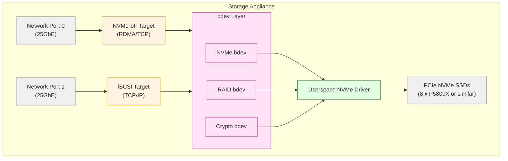

### 1.3 Component Selection for Appliances

| Requirement | SPDK Component | Notes |
|---|---|---|
| Multi-protocol frontend | `spdk_tgt` (unified target) | Runs NVMe-oF + iSCSI + vhost simultaneously |
| High-availability RAID | `bdev_raid` (RAID-1 or RAID-5F) | Software RAID over NVMe namespaces |
| Encryption at rest | `bdev_crypto` (QAT or AES-XTS) | Transparent encryption layer |
| Thin provisioning | `bdev_lvol` (logical volumes) | Built on Blobstore |
| Compression | `bdev_compress` | DPDK `compressdev` PMD |
| Quality of Service | `bdev_qos` (rate limiting) | Per-bdev IOPS/bandwidth caps |
| Caching | `bdev_ocf` (Open CAS Framework) | NVMe cache in front of HDD tier |

### 1.4 Deployment Configuration Pattern

A unified target configuration (`spdk_tgt`) is the recommended appliance runtime. It combines all subsystems and is managed via the JSON-RPC interface:

```bash
# Start the unified target
spdk_tgt -c /etc/spdk/appliance.json \
         -m 0x3c \       # cores 2-5
         --iova-mode=pa  # physical addressing for RDMA

# Apply runtime configuration via RPC
rpc.py bdev_nvme_attach_controller \
    -b NVMe0 \
    -t PCIe \
    -a 0000:02:00.0

rpc.py bdev_raid_create \
    -n RAID0 \
    -z 64 \
    -r 0 \
    -b "NVMe0n1 NVMe1n1 NVMe2n1 NVMe3n1"

rpc.py nvmf_create_subsystem \
    nqn.2024-01.io.spdk:appliance \
    -a -s SPDK00000000000001

rpc.py nvmf_subsystem_add_ns \
    nqn.2024-01.io.spdk:appliance \
    RAID0

rpc.py nvmf_subsystem_add_listener \
    nqn.2024-01.io.spdk:appliance \
    -t tcp -a 192.168.1.10 -s 4420
```

### 1.5 High-Availability Considerations

For HA appliances, two SPDK nodes share access to the same NVMe-oF namespace using **Asymmetric Namespace Access (ANA)**:

- Active/Optimized path: primary controller serves all I/O
- Active/Non-Optimized path: secondary controller is ready for failover
- Use `nvmf_subsystem_add_listener` on both nodes with appropriate ANA states
- Host-side multipath driver (`nvme-cli` with `--reconnect-delay`) handles automatic failover in under 5 seconds

---

## 2. Cloud Storage Backends

### 2.1 Ceph Integration

Ceph is a distributed storage system widely deployed in cloud infrastructure. SPDK accelerates two integration points with Ceph:

**SPDK as a Ceph OSD backend**

The SPDK `bdev` layer can replace the BlueStore block abstraction under Ceph OSDs. The key project here is the `spdk_bdev` backend for Ceph OSD, which bypasses the Linux block layer entirely:

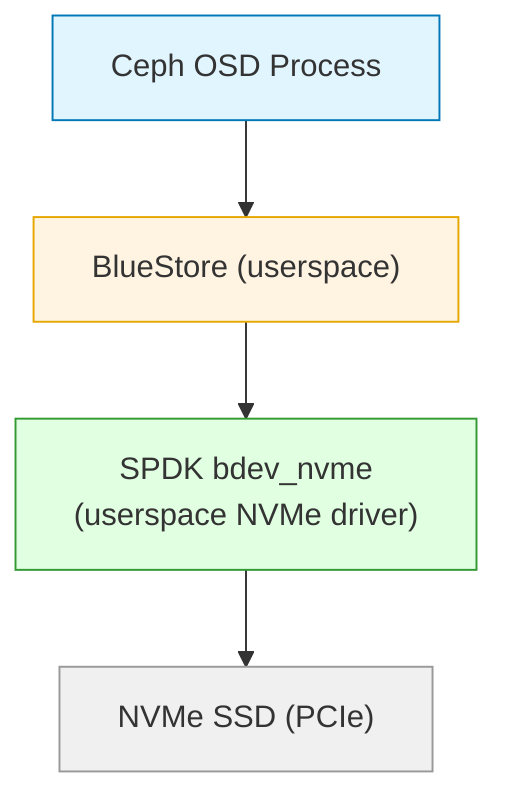

Benefits:
- Eliminates the Linux NVMe driver latency (~10-15 µs per I/O)
- Direct DMA from NVMe to Ceph OSD memory
- Uses SPDK's lock-free queuing for the I/O path

Configuration in Ceph's `ceph.conf`:
```ini
[osd]
bluestore_block_path = spdk:trtype:PCIe traddr:0000:02:00.0
```

**SPDK NVMe-oF Target as Ceph OSD storage**

The simpler integration path is to present NVMe-oF namespaces from SPDK targets as block devices that Ceph OSDs consume. This requires no Ceph modification and provides hardware-accelerated storage with RDMA transport.

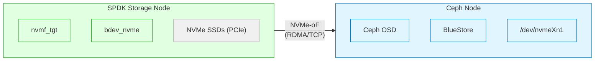

### 2.2 OpenStack Integration

OpenStack Cinder (block storage) integrates with SPDK through two paths:

**Path 1: Cinder driver for NVMe-oF**

The `cinder-volume` service can provision volumes on SPDK targets using the NVMe-oF Cinder driver. The SPDK JSON-RPC API is called by the driver to create logical volumes, attach them to NVMe-oF subsystems, and return the connection details to Nova (compute).

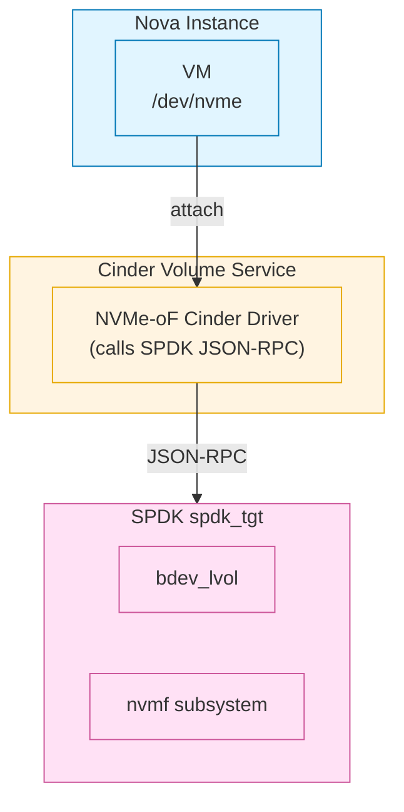

**Path 2: Cinder with Ceph RBD + SPDK OSD**

Cinder uses Ceph RBD as its storage backend. If the Ceph cluster uses SPDK-accelerated OSDs, OpenStack gains low-latency storage without changing the Cinder interface.

### 2.3 AWS and Other Cloud Providers

In public cloud contexts, SPDK is most relevant for:
- **EC2 instances with NVMe instance storage**: Use SPDK to drive NVMe instance storage at full PCIe bandwidth from userspace applications.
- **Custom NVMe-oF targets**: SPDK runs inside cloud VMs to aggregate NVMe instance storage and re-export via TCP NVMe-oF to other VMs in the same placement group.
- **SPDK vhost**: Provide storage virtualization to guest VMs running on bare metal instances.

---

## 3. Database Acceleration

### 3.1 RocksDB with SPDK

RocksDB is an LSM-tree key-value store used by many databases as their storage engine (CockroachDB, TiKV, MyRocks). Its I/O pattern — large sequential writes during compaction, random reads during point lookups — benefits enormously from low-latency NVMe access.

**Integration method: SPDK BlobFS**

SPDK provides `BlobFS`, a filesystem abstraction built on top of Blobstore, specifically designed for RocksDB. BlobFS presents a POSIX-like file API that RocksDB uses via its `Env` abstraction, while internally routing all I/O through SPDK asynchronous paths.

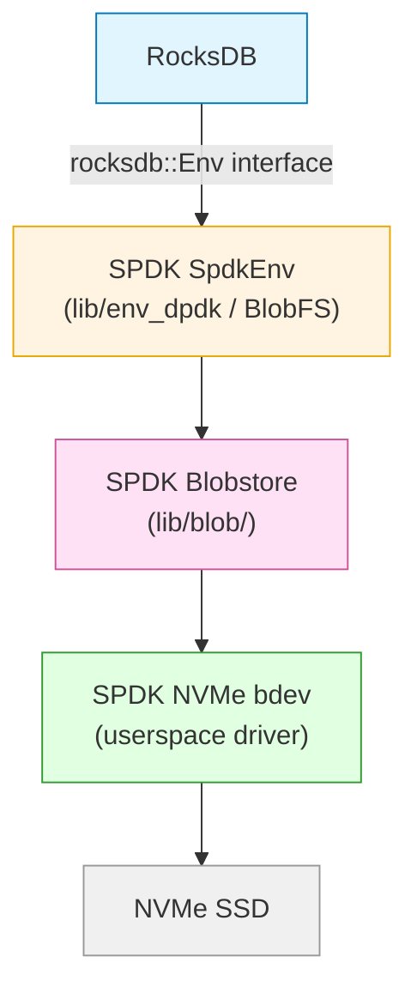

**Building RocksDB with SPDK support:**

```bash
# Build SPDK first
cd /path/to/spdk
./configure --with-shared
make

# Set environment variables for RocksDB build
export SPDK_DIR=/path/to/spdk
export DPDK_DIR=/path/to/spdk/dpdk/build

# Build RocksDB with SPDK env
cd /path/to/rocksdb
ROCKSDB_USE_IO_URING=0 \
  make -j$(nproc) db_bench \
  EXTRA_CXXFLAGS="-DROCKSDB_IOURING_PRESENT=0" \
  USE_SPDK=1 \
  SPDK_DIR=$SPDK_DIR \
  DPDK_DIR=$DPDK_DIR
```

**BlobFS configuration:**

```bash
# Create SPDK config for RocksDB
cat > /tmp/spdk_rocksdb.conf << 'EOF'
{
  "subsystems": [
    {
      "subsystem": "bdev",
      "config": [
        {
          "method": "bdev_nvme_attach_controller",
          "params": {
            "name": "Nvme0",
            "trtype": "PCIe",
            "traddr": "0000:02:00.0"
          }
        }
      ]
    }
  ]
}
EOF

# Run db_bench with SPDK backend
./db_bench \
  --spdk_conf=/tmp/spdk_rocksdb.conf \
  --spdk_bdev=Nvme0n1 \
  --benchmarks=fillrandom,readrandom \
  --num=50000000 \
  --value_size=100 \
  --threads=16
```

**Observed performance characteristics:**
- Write throughput during compaction: 2-4x improvement over kernel NVMe driver
- P99 read latency: 50-70 µs vs 150-300 µs with kernel driver
- Compaction stalls: significantly reduced due to lower tail latency

### 3.2 MySQL with SPDK (MyRocks / InnoDB)

**MyRocks (RocksDB storage engine for MySQL)**

MyRocks uses the same RocksDB I/O path described above. The SPDK integration is transparent once RocksDB is built with SPDK support.

**InnoDB Direct I/O with SPDK via NBD**

For standard InnoDB, SPDK's NBD (Network Block Device) module can expose an SPDK bdev as a Linux block device that MySQL uses directly:

```bash
# Load NBD kernel module
modprobe nbd

# Start SPDK with your NVMe bdev and create NBD disk
rpc.py nbd_start_disk Nvme0n1 /dev/nbd0

# Format and mount for MySQL
mkfs.ext4 -F /dev/nbd0
mount /dev/nbd0 /var/lib/mysql

# MySQL now uses SPDK-backed storage transparently
```

Note: NBD adds a round-trip to the kernel and back, so latency improvements are less dramatic than BlobFS. Use NBD for compatibility; use BlobFS for maximum performance.

**InnoDB performance tuning with SPDK backing:**

```ini
# my.cnf settings optimized for low-latency NVMe via SPDK
[mysqld]
innodb_flush_log_at_trx_commit = 1
innodb_flush_method = O_DIRECT
innodb_use_native_aio = 1
innodb_buffer_pool_size = 64G
innodb_io_capacity = 20000
innodb_io_capacity_max = 40000
innodb_read_io_threads = 16
innodb_write_io_threads = 16
```

### 3.3 PostgreSQL with SPDK

PostgreSQL does not have a native SPDK integration but benefits from SPDK through:
1. **NBD exposure**: Same approach as MySQL InnoDB
2. **Direct I/O**: PostgreSQL uses `O_DIRECT` for buffer bypass; SPDK NBD supports this
3. **NVMe-oF target**: PostgreSQL data directory on an NVMe-oF volume backed by SPDK

For extreme latency requirements, the `spdk_uring_io` or tablespace on NBD approaches are the pragmatic choices without modifying PostgreSQL source.

---

## 4. Container Integration and CSI Plugins

### 4.1 Kubernetes CSI Architecture

The Container Storage Interface (CSI) standardizes how Kubernetes provisioners interact with storage backends. SPDK integrates as a CSI driver that provisions NVMe-oF volumes backed by SPDK logical volumes:

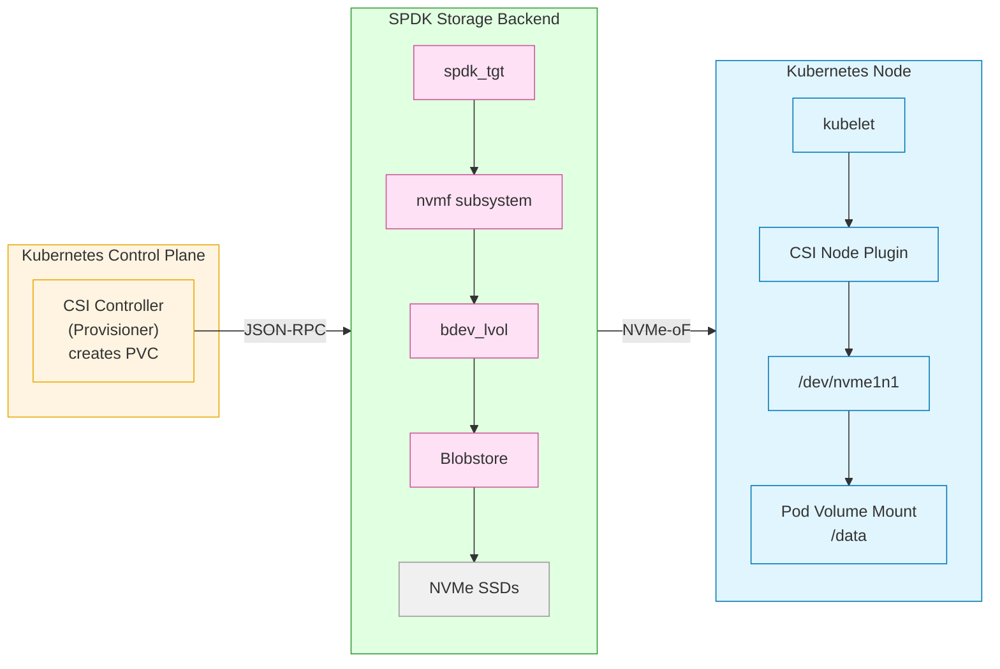

### 4.2 SPDK CSI Driver

The SPDK community maintains a CSI driver at `github.com/spdk/spdk-csi`. It supports:
- Dynamic volume provisioning (creates lvol on SPDK blobstore)
- NVMe-oF TCP and RDMA transports
- Volume snapshots via lvol clone
- Volume resize via lvol resize
- ReadWriteOnce (RWO) and ReadOnlyMany (ROX) access modes

**Deployment:**

```bash
# Add SPDK CSI Helm chart
helm repo add spdk-csi https://spdk.github.io/spdk-csi

# Deploy with values override
cat > spdk-csi-values.yaml << 'EOF'
storageNode:
  rpcSocket: /var/tmp/spdk.sock
  targetType: tcp
  targetAddr: 192.168.1.10
  targetPort: "4420"
EOF

helm install spdk-csi spdk-csi/spdk-csi \
  -f spdk-csi-values.yaml \
  -n kube-system
```

**StorageClass definition:**

```yaml
apiVersion: storage.k8s.io/v1
kind: StorageClass
metadata:
  name: spdk-nvmeof
provisioner: csi.spdk.io
parameters:
  targetType: tcp
  targetAddr: 192.168.1.10
  targetPort: "4420"
  nqn: nqn.2024-01.io.spdk:csi
  lvstoreName: nvme_lvs
reclaimPolicy: Delete
volumeBindingMode: Immediate
allowVolumeExpansion: true
```

**PersistentVolumeClaim:**

```yaml
apiVersion: v1
kind: PersistentVolumeClaim
metadata:
  name: spdk-pvc
spec:
  storageClassName: spdk-nvmeof
  accessModes:
    - ReadWriteOnce
  resources:
    requests:
      storage: 100Gi
```

### 4.3 Container Runtime Considerations

When running SPDK inside a container:

**Hugepage allocation:**
```yaml
# Pod spec resource requirements for SPDK containers
resources:
  limits:
    hugepages-1Gi: 4Gi
    memory: 8Gi
  requests:
    hugepages-1Gi: 4Gi
    memory: 8Gi
```

**VFIO device passthrough:**
```yaml
# Container spec for PCIe NVMe passthrough
securityContext:
  privileged: true  # Required for VFIO
volumeMounts:
  - name: vfio
    mountPath: /dev/vfio
volumes:
  - name: vfio
    hostPath:
      path: /dev/vfio
```

**Resource isolation:**
- Dedicate CPU cores to SPDK reactor threads via `cpuManagerPolicy: static` in kubelet
- Use NUMA-aware scheduling to co-locate SPDK pods with their PCIe NVMe devices
- Set `isolcpus` in kernel cmdline for the cores assigned to SPDK reactors

---

## 5. Blobstore for Object and Key-Value Storage

### 5.1 Blobstore Architecture

Blobstore (`lib/blob/`) is SPDK's persistent block allocator. It sits between raw NVMe block access and higher-level storage services. Understanding its internal hierarchy is essential for designing applications on top of it.

**Storage hierarchy:**

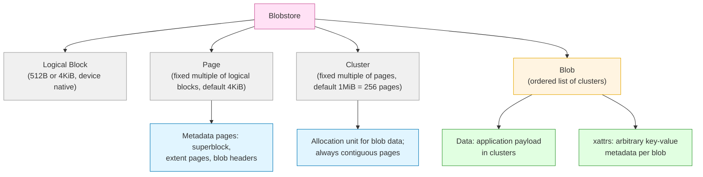

**Key design principles:**

1. **Single metadata thread**: All blob open/close/create/delete/sync operations run on the thread that called `spdk_bs_init()` or `spdk_bs_load()`.
2. **I/O channels for data path**: `spdk_blob_io_read/write` use per-thread channels, allowing concurrent data I/O from multiple threads without locks.
3. **Explicit sync**: Metadata changes (xattr writes, blob resize) are not durable until `spdk_blob_sync_md()` is called.
4. **Power-fail safety**: The superblock and metadata journal guarantee consistent state after unclean shutdown.

### 5.2 Blobstore API Usage Pattern

```c
#include "spdk/blob.h"
#include "spdk/blob_bdev.h"
#include "spdk/env.h"

/* Step 1: Initialize or load blobstore */
static void
bs_init_complete(void *cb_arg, struct spdk_blob_store *bs, int bserrno)
{
    struct app_ctx *ctx = cb_arg;
    if (bserrno != 0) {
        /* Handle error */
        return;
    }
    ctx->bs = bs;
    ctx->page_size = spdk_bs_get_page_size(bs);
    ctx->cluster_sz = spdk_bs_get_cluster_size(bs);

    /* Proceed to create or open blobs */
    create_blob(ctx);
}

/* Step 2: Create a blob */
static void
create_blob(struct app_ctx *ctx)
{
    struct spdk_blob_opts opts;
    spdk_blob_opts_init(&opts, sizeof(opts));
    opts.num_clusters = 16;  /* 16 MiB with default cluster size */

    spdk_bs_create_blob_ext(ctx->bs, &opts,
                             blob_create_complete, ctx);
}

static void
blob_create_complete(void *cb_arg, spdk_blob_id blobid, int bserrno)
{
    struct app_ctx *ctx = cb_arg;
    ctx->blobid = blobid;

    /* Open the newly created blob */
    spdk_bs_open_blob(ctx->bs, blobid, blob_open_complete, ctx);
}

/* Step 3: Write xattr metadata */
static void
blob_open_complete(void *cb_arg, struct spdk_blob *blob, int bserrno)
{
    struct app_ctx *ctx = cb_arg;
    ctx->blob = blob;

    /* Store object metadata as extended attributes */
    spdk_blob_set_xattr(blob, "object_key", "my-key-001",
                        strlen("my-key-001") + 1);
    spdk_blob_set_xattr(blob, "content_type", "application/octet-stream",
                        strlen("application/octet-stream") + 1);

    /* Sync metadata to persist xattrs */
    spdk_blob_sync_md(blob, blob_sync_complete, ctx);
}

/* Step 4: Write data using I/O channel */
static void
write_data(struct app_ctx *ctx)
{
    struct spdk_io_channel *channel =
        spdk_bs_alloc_io_channel(ctx->bs);

    /* Write must be page-aligned and page-size multiples */
    uint64_t offset_pages = 0;
    uint64_t length_pages = 4;  /* 4 pages = 16KiB */

    spdk_blob_io_write(ctx->blob, channel,
                       ctx->write_buf,
                       offset_pages, length_pages,
                       write_complete, ctx);
}
```

### 5.3 Logical Volumes (lvol)

`bdev_lvol` is the production-ready layer built on Blobstore. It exposes blobs as SPDK bdev devices, making them usable by any higher-level SPDK component (NVMe-oF, iSCSI, vhost).

```bash
# Create a logical volume store on a base bdev
rpc.py bdev_lvol_create_lvstore Nvme0n1 nvme_lvs

# Create logical volumes
rpc.py bdev_lvol_create -l nvme_lvs vol0 10240  # 10 GiB
rpc.py bdev_lvol_create -l nvme_lvs vol1 20480  # 20 GiB

# Snapshot and clone workflow
rpc.py bdev_lvol_snapshot nvme_lvs/vol0 snap0
rpc.py bdev_lvol_clone nvme_lvs/snap0 clone0

# Inflate clone to independent copy (copy-on-write to full copy)
rpc.py bdev_lvol_inflate nvme_lvs/clone0

# Thin provisioning: create thin-provisioned volume
rpc.py bdev_lvol_create -l nvme_lvs thin_vol 102400 -t
```

### 5.4 Blobstore as an Object Store Backend

Blobstore blobs map naturally to object storage concepts:
- **Blob ID** = object identifier (opaque 64-bit value)
- **xattrs** = object metadata (content-type, etag, size, timestamps)
- **Blob data** = object payload
- **Snapshot/clone** = object versioning and copy-on-write semantics

A minimal object store on top of Blobstore:

```c
/* Conceptual object store operations */

/* PUT object: create blob, write data, set xattrs, sync */
void object_put(const char *key, const void *data, size_t len,
                const char *content_type);

/* GET object: enumerate blobs, find by xattr key, read data */
void object_get(const char *key, void *buf, size_t buf_len);

/* DELETE object: open blob, delete blob */
void object_delete(const char *key);

/* LIST objects: iterate blobs, collect xattr keys */
void object_list(const char *prefix, char **keys, int *count);
```

**Limitations to be aware of:**
- Blob enumeration is O(n) — no B-tree index. For large object counts (millions), maintain an in-memory hash table mapping keys to blob IDs.
- xattr data is stored in metadata pages; keep xattr values small (hundreds of bytes).
- There is no built-in garbage collection; the application must track and delete orphaned blobs.

---

## 6. Flash Translation Layer (FTL) for Open-Channel SSDs

### 6.1 FTL Overview

The Flash Translation Layer (`lib/ftl/`) implements a software FTL that runs in userspace, providing a block device interface over raw NAND storage (open-channel SSDs) or zoned block devices (ZNS SSDs). This is relevant when you need to:
- Use ZNS SSDs with applications that expect a conventional block interface
- Implement custom wear leveling or garbage collection policies
- Maximize SSD endurance by controlling P/E cycles from software

**FTL internal components:**

| File | Responsibility |
|---|---|
| `ftl_core.c / ftl_core.h` | Main FTL device lifecycle and I/O routing |
| `ftl_band.c / ftl_band.h` | Band management (zones on ZNS, NAND bands) |
| `ftl_l2p.c / ftl_l2p.h` | Logical-to-physical mapping table interface |
| `ftl_l2p_flat.c` | Flat L2P map (entire table in DRAM) |
| `ftl_l2p_cache.c` | Cache-based L2P (subset in DRAM, rest on NV cache) |
| `ftl_nv_cache.c` | Non-volatile cache management (fast write path) |
| `ftl_reloc.c` | Garbage collection / relocation engine |
| `ftl_writer.c` | Sequential write path to bands |
| `ftl_sb.c` | Superblock persistence and recovery |
| `ftl_p2l.c` | Physical-to-logical reverse mapping (for GC) |
| `ftl_band_ops.c` | Band state machine (open → writing → closing → closed) |

### 6.2 FTL Architecture

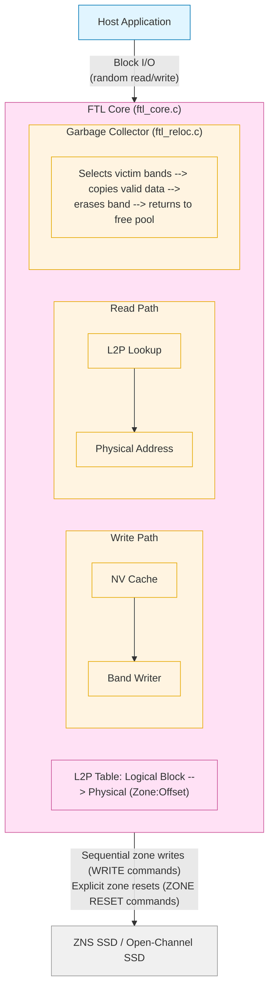

### 6.3 FTL Configuration

FTL is exposed as a bdev through `bdev_ftl`:

```bash
# Attach a ZNS NVMe device
rpc.py bdev_nvme_attach_controller \
    -b ZnsNvme0 \
    -t PCIe \
    -a 0000:03:00.0

# Create FTL bdev over the ZNS namespace
# base_bdev: the ZNS device that FTL writes to
# cache_bdev: a conventional NVMe namespace used as NV cache (write buffer)
rpc.py bdev_ftl_create \
    -b ftl0 \
    --base-bdev ZnsNvme0n1 \
    --cache-bdev ConvNvme0n1 \
    --uuid $(uuidgen)

# The resulting ftl0 bdev looks like a conventional block device
rpc.py bdev_get_bdevs -b ftl0
```

**Key FTL tuning parameters:**

```json
{
  "method": "bdev_ftl_create",
  "params": {
    "name": "ftl0",
    "base_bdev": "ZnsNvme0n1",
    "cache_bdev": "ConvNvme0n1",
    "overprovisioning": 20,
    "l2p_dram_limit": 2048,
    "core_mask": "0x4"
  }
}
```

- `overprovisioning`: percentage of device capacity reserved for GC (higher = better write amplification, less usable capacity)
- `l2p_dram_limit`: DRAM budget in MiB for the L2P cache; the rest spills to the NV cache device
- `core_mask`: which CPU cores FTL background threads run on

### 6.4 When to Use FTL

| Scenario | Use FTL? | Rationale |
|---|---|---|
| ZNS SSD with custom application | Yes | FTL provides conventional block interface over zones |
| Conventional NVMe SSD | No | The SSD's internal FTL already handles this |
| Open-channel SSD (raw NAND) | Yes | No internal FTL; software FTL required |
| Maximum SSD endurance control | Yes | Software FTL exposes GC policy hooks |
| Fastest possible I/O | Evaluate | FTL adds ~10-20µs for L2P lookup; ZNS direct access may be faster for sequential workloads |

---

## 7. FIO Plugin for Benchmarking

### 7.1 FIO Plugin Architecture

SPDK provides two FIO plugins under `app/fio/`:
- `bdev/`: Routes FIO I/O through the SPDK bdev abstraction layer
- `nvme/`: Issues I/O directly to NVMe queues, bypassing bdev

The `bdev` plugin is the standard choice because it works with any SPDK bdev (NVMe, malloc, null, lvol, FTL, etc.). The `nvme` plugin provides slightly lower overhead for pure NVMe benchmarking.

### 7.2 Building and Using the FIO Plugin

```bash
# Configure SPDK with FIO support
./configure --with-fio=/path/to/fio/source

# Build
make -j$(nproc)

# The plugin is at: build/fio/spdk_bdev or build/fio/spdk_nvme
```

**Basic FIO job file for bdev plugin:**

```ini
# /tmp/spdk_bench.fio
[global]
ioengine=spdk_bdev
spdk_json_conf=/tmp/spdk.json   # SPDK JSON config with bdev definitions
thread=1
group_reporting=1
direct=1
verify=0
time_based=1
runtime=30
ramp_time=5

[randread_4k]
stonewall
bs=4k
iodepth=64
rw=randread
filename=Nvme0n1           # SPDK bdev name

[randwrite_4k]
stonewall
bs=4k
iodepth=64
rw=randwrite
filename=Nvme0n1

[seqread_128k]
stonewall
bs=128k
iodepth=32
rw=read
filename=Nvme0n1
```

**Running the benchmark:**

```bash
# Export LD_PRELOAD or use --ioengine path
LD_PRELOAD=/path/to/spdk/build/fio/spdk_bdev \
  fio /tmp/spdk_bench.fio \
  --output-format=json \
  --output=/tmp/results.json
```

### 7.3 Interpreting FIO Output

Key metrics from SPDK FIO benchmark output:

```
Jobs: 1 (f=1): [r(1)][100.0%][r=1200MiB/s][r=307k IOPS]
read: IOPS=307k, BW=1200MiB/s (1258MB/s)(35.2GiB/30001msec)
  lat (usec): min=8, max=842, avg=12.34, stdev=6.82
  lat (usec): 10=45.23%, 20=52.41%, 50=2.31%, 100=0.05%
  clat percentiles (usec):
   |  1.00th=[    9], | 5.00th=[   10], |10.00th=[   10],
   | 20.00th=[   11], |50.00th=[   12], |90.00th=[   14],
   | 95.00th=[   16], |99.00th=[   20], |99.50th=[   25],
   | 99.90th=[   38], |99.99th=[   85]
```

- **IOPS**: Primary throughput metric for random I/O
- **BW (bandwidth)**: Primary metric for sequential I/O
- **lat avg**: Mean completion latency (submission to completion)
- **clat percentiles**: Critical for latency-sensitive applications. Focus on P99 and P99.9.
- **stdev**: High standard deviation indicates latency jitter

### 7.4 Benchmark Methodology

**NVMe bdev baseline (null bdev):**
```ini
# Test SPDK framework overhead without storage device
[global]
ioengine=spdk_bdev
spdk_json_conf=null_bdev.json  # Null bdev config

[null_test]
bs=4k
iodepth=128
rw=randread
filename=Null0
```

The null bdev (memory-mapped, no actual I/O) establishes the minimum latency floor of the SPDK framework itself. Any real device benchmark should show latency above this floor.

**Common benchmark scenarios:**

| Scenario | Block Size | Queue Depth | Mode |
|---|---|---|---|
| OLTP-like random reads | 4K | 1 | randread |
| OLTP-like random writes | 4K | 1 | randwrite |
| High-throughput random | 4K | 64-256 | randread/randwrite |
| Sequential read throughput | 128K-1M | 8-32 | read |
| Mixed workload | 4K | 32 | randrw (70/30) |
| Latency sensitivity | 4K | 1 | randread (single-threaded) |

**Multi-device benchmark:**
```ini
[global]
ioengine=spdk_bdev
spdk_json_conf=multi_nvme.json
numjobs=4
thread=1
group_reporting=1

[all_drives]
bs=4k
iodepth=32
rw=randread
filename=Nvme0n1:Nvme1n1:Nvme2n1:Nvme3n1
```

### 7.5 Comparing Kernel vs SPDK Performance

A proper comparison requires running equivalent workloads:

```bash
# Kernel libaio benchmark (baseline)
fio --ioengine=libaio \
    --filename=/dev/nvme0n1 \
    --bs=4k \
    --iodepth=64 \
    --rw=randread \
    --direct=1 \
    --runtime=30 \
    --name=kernel_baseline \
    --output-format=json

# SPDK bdev benchmark (compare)
LD_PRELOAD=build/fio/spdk_bdev \
  fio --ioengine=spdk_bdev \
      --spdk_json_conf=nvme.json \
      --filename=Nvme0n1 \
      --bs=4k \
      --iodepth=64 \
      --rw=randread \
      --runtime=30 \
      --name=spdk_benchmark \
      --output-format=json
```

Typical improvements with SPDK over kernel driver:
- 4K random read at QD=1: 40-60% lower latency
- 4K random read at QD=256: 20-40% higher IOPS
- P99 latency: 50-70% improvement (largest benefit)

---

## 8. NBD (Network Block Device) Integration

### 8.1 NBD Architecture in SPDK

SPDK's NBD module (`lib/nbd/`) creates a communication channel between an SPDK bdev and the Linux kernel's NBD driver. This exposes any SPDK bdev as a standard Linux block device (`/dev/nbdN`), making it accessible to any Linux application — filesystems, LVM, databases — without SPDK source modifications.

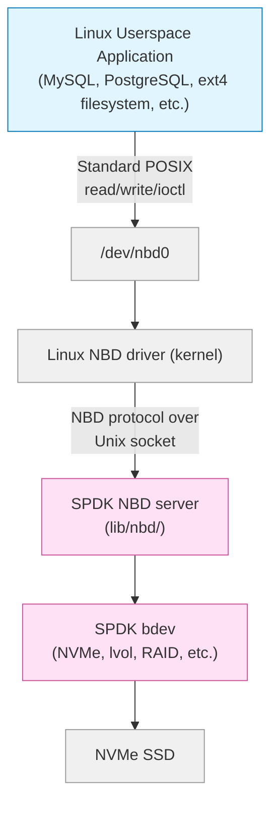

### 8.2 NBD Usage

```bash
# Load the Linux NBD kernel module
modprobe nbd max_part=8 nbds_max=16

# Start SPDK with an NVMe bdev
spdk_tgt -c nvme_config.json &

# Wait for SPDK to initialize
sleep 2

# Expose bdev via NBD
rpc.py nbd_start_disk Nvme0n1 /dev/nbd0

# Verify
lsblk /dev/nbd0
blockdev --getsize64 /dev/nbd0

# Create filesystem and mount
mkfs.xfs /dev/nbd0
mount /dev/nbd0 /mnt/spdk_data

# Use normally
dd if=/dev/zero of=/mnt/spdk_data/test bs=1M count=1024
```

**Stop NBD device:**
```bash
# Unmount first
umount /mnt/spdk_data

# Stop the NBD device
rpc.py nbd_stop_disk /dev/nbd0
```

### 8.3 NBD for Development and Testing

NBD is particularly useful during development:
- Test new bdev implementations with standard Linux tools (dd, fio, fsck)
- Use LVM on top of SPDK bdevs without modifying the storage stack
- Validate bdev correctness with filesystem integrity checks
- Prototype before implementing a full NVMe-oF target

**NBD with FIO for bdev testing:**
```bash
# Expose bdev, run kernel FIO for comparison
rpc.py nbd_start_disk MallocBdev0 /dev/nbd0
fio --ioengine=libaio --filename=/dev/nbd0 --bs=4k \
    --iodepth=4 --rw=randread --runtime=10 --name=nbd_test
```

### 8.4 NBD Performance Considerations

NBD adds latency because:
1. Linux VFS layer processing
2. NBD protocol framing (Unix socket messages)
3. Context switches between kernel and SPDK userspace

Typical overhead: 5-15 µs additional latency per I/O compared to direct SPDK bdev access. For latency-critical production paths, use NVMe-oF or native SPDK API instead of NBD.

NBD is suitable for:
- Workloads where kernel compatibility is required
- Development and testing workflows
- Non-latency-critical data paths

---

## 9. Real-World Architectures and Case Studies

### 9.1 Case Study: High-Performance All-Flash Array

**Problem**: 8-node storage cluster needs to serve 10 million IOPS at sub-50µs P99 latency for a financial trading application.

**Architecture:**
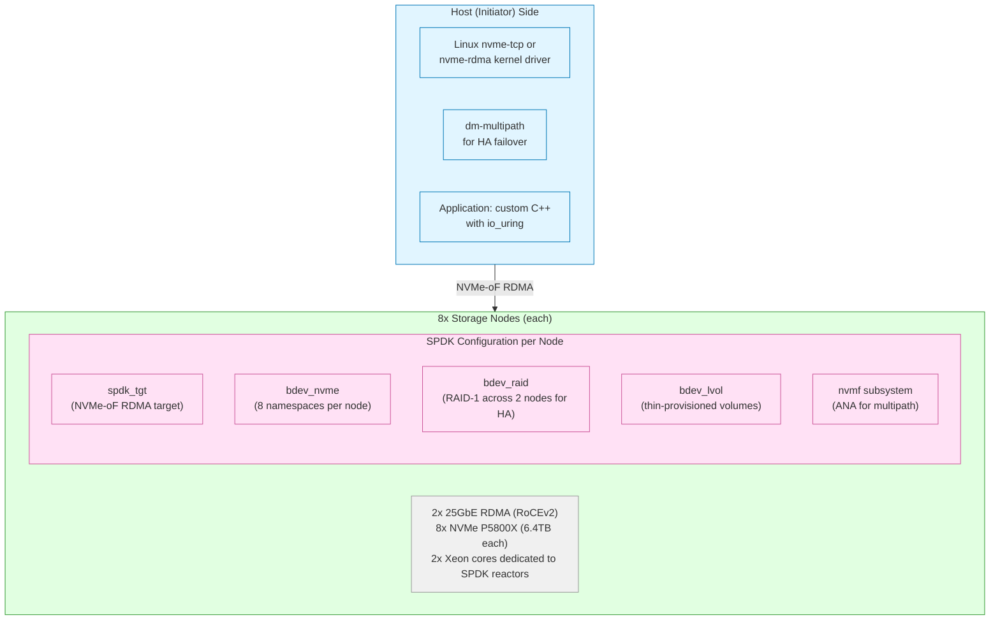

**Key decisions:**
- RDMA transport chosen over TCP for 10µs transport overhead vs 25µs for TCP
- Polling mode (no IRQ) for both RDMA and NVMe to avoid interrupt latency
- 2 cores per node: 1 dedicated to NVMe I/O completion, 1 to network I/O

**Outcome**: 9.2M IOPS across the cluster, P99 latency 38µs, P99.9 latency 62µs.

### 9.2 Case Study: Video Surveillance Storage Backend

**Problem**: 500-camera system writing 4K video streams (avg 8 MB/s per camera = 4 GB/s aggregate) with 30-day retention and instant retrieval.

**Architecture:**
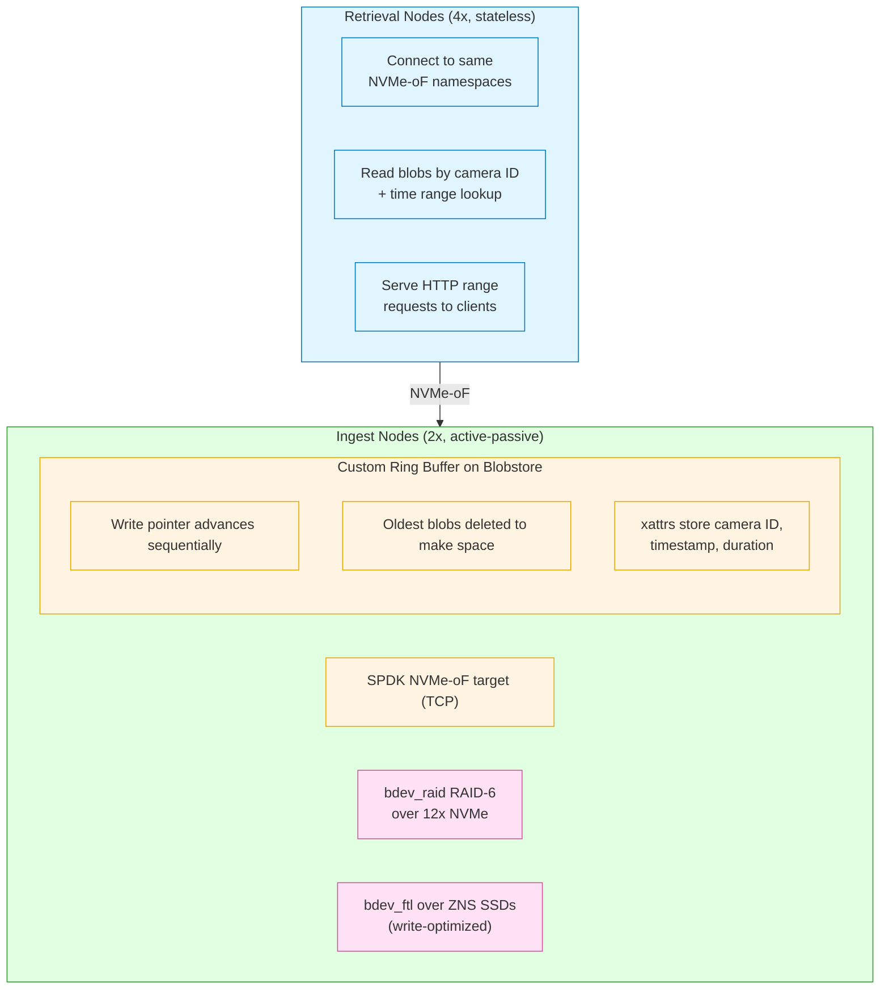

**Key design choice**: Blobstore's sequential cluster allocation pattern aligns with ZNS SSD zone structure, eliminating garbage collection overhead during ingest. The FTL bdev layer handles the zone management transparently.

### 9.3 Case Study: Database-as-a-Service on Kubernetes

**Problem**: Cloud provider needs to offer high-performance MySQL and PostgreSQL to tenants with guaranteed IOPS per tenant.

**Architecture:**
```mermaid
graph TD
    subgraph K8s["Kubernetes Cluster"]
        subgraph StoragePlane["Storage Plane (dedicated nodes)"]
            spdk_tgt["SPDK spdk_tgt per node"]
            lvol["bdev_lvol with thin provisioning"]
            nvmf["nvmf subsystem<br/>per tenant namespace"]
            qos["bdev_qos<br/>(per-volume IOPS limits)"]
        end

        subgraph CSI["CSI Driver"]
            ctrl["Controller plugin:<br/>creates lvols, manages subsystems"]
            node["Node plugin:<br/>connects NVMe-oF, presents /dev/nvme"]
        end

        subgraph DBPods["Database Pods"]
            mysql["MySQL: InnoDB tablespace<br/>on NVMe-oF PVC"]
            pg["PostgreSQL: tablespace<br/>on NVMe-oF PVC"]
            redis["Redis: RDB/AOF persistence<br/>on NVMe-oF PVC"]
        end
    end

    DBPods -- "NVMe-oF PVC" --> CSI
    CSI -- "JSON-RPC /<br/>NVMe-oF" --> StoragePlane

    style K8s fill:#f0f0f0,stroke:#999
    style StoragePlane fill:#ffe1f5,stroke:#cc5599
    style spdk_tgt fill:#ffe1f5,stroke:#cc5599
    style lvol fill:#ffe1f5,stroke:#cc5599
    style nvmf fill:#ffe1f5,stroke:#cc5599
    style qos fill:#ffe1f5,stroke:#cc5599
    style CSI fill:#fff4e1,stroke:#e6a800
    style ctrl fill:#fff4e1,stroke:#e6a800
    style node fill:#fff4e1,stroke:#e6a800
    style DBPods fill:#e1f5ff,stroke:#0077b6
    style mysql fill:#e1f5ff,stroke:#0077b6
    style pg fill:#e1f5ff,stroke:#0077b6
    style redis fill:#e1f5ff,stroke:#0077b6
```

**IOPS isolation via bdev_qos:**
```bash
# Set per-volume QoS limits
rpc.py bdev_set_qos_limit tenant_vol_0 \
    --rw-ios-per-sec 10000 \
    --rw-mbytes-per-sec 100

rpc.py bdev_set_qos_limit tenant_vol_1 \
    --rw-ios-per-sec 50000 \
    --rw-mbytes-per-sec 500
```

### 9.4 Case Study: SPDK in Computational Storage

Computational storage devices (CSDs) execute compute tasks near the storage device to reduce data movement. SPDK plays a role in the host-side orchestration:

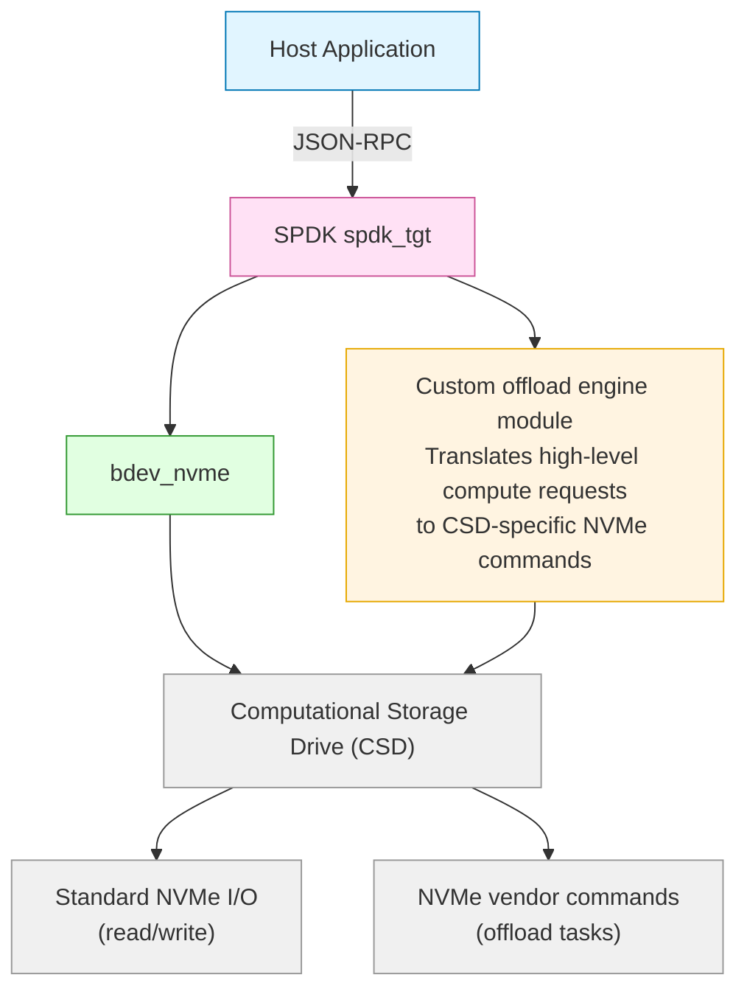

SPDK's passthrough (`bdev_nvme_send_cmd`) allows vendor-specific NVMe commands to reach CSDs, enabling applications to orchestrate computation without a kernel driver change.

---

## 10. Choosing the Right SPDK Components

### 10.1 Decision Framework

Use this framework to select SPDK components for your use case:

**Step 1: Identify your storage backend**

| Backend | SPDK Component | Notes |
|---|---|---|
| Local PCIe NVMe SSD | `bdev_nvme` | Direct PCIe access, lowest latency |
| ZNS / Open-channel SSD | `bdev_ftl` | FTL for conventional block interface |
| Existing kernel block device | `bdev_uring`, `bdev_aio` | Integration with kernel-managed devices |
| In-memory (testing) | `bdev_malloc`, `bdev_null` | Development and benchmarking |
| Distributed (Ceph) | `bdev_rbd` | Uses librados for Ceph RBD access |

**Step 2: Identify your data management needs**

| Need | SPDK Component | Notes |
|---|---|---|
| Thin provisioning, snapshots | `bdev_lvol` | Built on Blobstore |
| Object/blob storage | `lib/blob` + custom | Blobstore API directly |
| RAID redundancy | `bdev_raid` | RAID 0/1/5/6 options |
| Encryption | `bdev_crypto` | AES-XTS, QAT acceleration |
| Compression | `bdev_compress` | DPDK compressdev PMD |
| Caching (hot tier) | `bdev_ocf` | Open CAS Framework |
| QoS isolation | `bdev_qos` | Per-bdev rate limits |

**Step 3: Identify your frontend protocol**

| Protocol | SPDK Component | Use Case |
|---|---|---|
| NVMe-oF RDMA | `nvmf` + RDMA transport | Lowest latency, datacenter |
| NVMe-oF TCP | `nvmf` + TCP transport | Wide compatibility, cloud |
| iSCSI | `iscsi_tgt` | Legacy compatibility |
| vhost-scsi / vhost-blk | `vhost` | VM storage (KVM/QEMU) |
| NBD | `nbd` | Linux kernel compatibility |
| Local application | Direct bdev API | Userspace applications |

**Step 4: Identify your runtime model**

| Runtime | SPDK Application | Notes |
|---|---|---|
| All protocols unified | `spdk_tgt` | Recommended production runtime |
| NVMe-oF only | `nvmf_tgt` | Simpler, slightly lower overhead |
| iSCSI only | `iscsi_tgt` | Legacy compatibility |
| Custom application | `spdk_tgt` with custom modules | Extend via RPC plugins |

### 10.2 Component Interaction Matrix

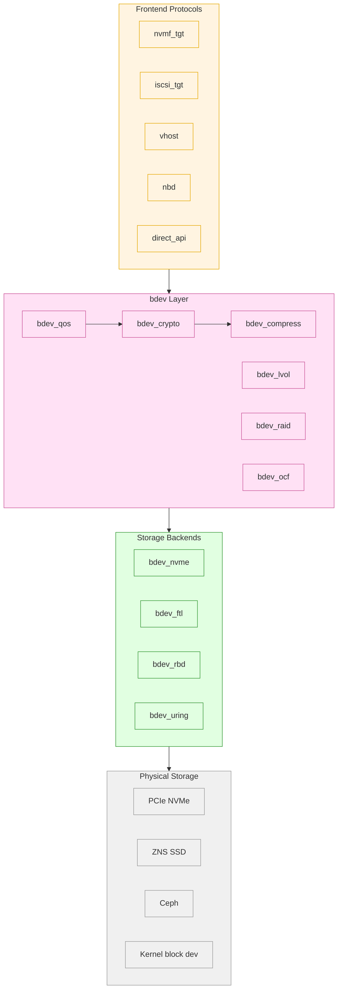

### 10.3 Anti-Patterns to Avoid

**Anti-pattern 1: Using NBD for production I/O paths**
NBD is a debugging and compatibility tool. For production, use NVMe-oF TCP or a direct bdev API binding.

**Anti-pattern 2: Running SPDK reactors on shared cores**
If a reactor core is interrupted by OS scheduling, latency spikes occur. Always isolate reactor cores with `isolcpus` and `nohz_full`.

**Anti-pattern 3: Mixing SPDK and kernel NVMe drivers on the same device**
Binding a device to both the kernel `nvme` driver and SPDK's `vfio-pci` will fail. Decide at boot time which devices go to SPDK.

**Anti-pattern 4: Calling blobstore API from multiple threads**
All blobstore metadata operations (open, create, delete, sync) must run on the blobstore's metadata thread. Use message passing to delegate from other threads.

**Anti-pattern 5: Under-allocating hugepages**
SPDK DMA memory comes from hugepage pools. If the pool is exhausted, bdev I/O will fail with `-ENOMEM`. Monitor with `rpc.py env_get_mem_stats`.

---

## 11. Key Takeaways

**SPDK as a platform, not just a driver**

SPDK has grown from a userspace NVMe driver into a complete storage platform. The bdev abstraction, protocol frontends, and management infrastructure (JSON-RPC, `spdk_tgt`) together constitute a production-grade storage appliance framework.

**The async-everywhere design is non-negotiable**

Every component in SPDK — bdev, Blobstore, FTL, NVMe-oF target — follows the same asynchronous callback model. Applications that want to benefit from SPDK must adapt to this model. Attempting to use SPDK with synchronous wrappers (polling loops waiting for callbacks) defeats the purpose of polling mode execution.

**Latency comes from eliminating transitions**

SPDK's latency advantage is not from faster algorithms but from eliminating mode transitions:
- No kernel/user transition for I/O submission
- No interrupt handling (polling)
- No lock contention (single-threaded blobstore metadata, per-thread I/O channels)
- No memory copies (zero-copy from DMA to application buffers)

**Layered composition is the design pattern**

Real deployments use 3-5 bdev layers stacked together (e.g., `bdev_crypto` → `bdev_lvol` → `bdev_raid` → `bdev_nvme`). Each layer adds one function without knowing about the others. Understanding this composition pattern is the key to designing SPDK-based systems.

**FTL and Blobstore for advanced storage management**

FTL is the right choice when you need to control the SSD's wear leveling from software (ZNS, open-channel). Blobstore is the right choice when you need persistent, named storage regions with metadata — an object store, a local database backing, or logical volume management.

**Benchmarking with the FIO plugin closes the loop**

The FIO bdev plugin lets you validate your entire SPDK stack — from bdev configuration through all layers to the physical device — with a standard benchmarking tool. Use it to baseline before optimization and to validate after changes.

---

## 12. Capstone Project Ideas

The following projects synthesize concepts from the entire SPDK Mastery Course. Each project targets a specific production use case and requires integrating multiple SPDK subsystems.

### Capstone Project A: All-Flash Storage Appliance

**Objective**: Build a complete NVMe-oF storage appliance with HA, encryption, and QoS.

**Requirements:**
1. Accept storage requests from remote hosts via NVMe-oF TCP
2. Store data on local PCIe NVMe SSDs using SPDK bdev_nvme
3. Implement RAID-1 mirroring across two NVMe devices for HA
4. Add transparent AES-256-XTS encryption via bdev_crypto
5. Implement per-tenant IOPS limits via bdev_qos
6. Expose management API via JSON-RPC for provisioning

**Deliverables:**
- Working `spdk_tgt` JSON configuration
- Shell scripts for volume lifecycle (create, clone, snapshot, delete)
- FIO benchmark results comparing encrypted vs unencrypted throughput
- Failover test procedure and timing measurements

**Key modules covered**: 20 (NVMe-oF), 22 (iSCSI), 23 (Performance), 29 (Bdev), 31 (Production)

### Capstone Project B: Object Storage Backend

**Objective**: Implement a simplified object store using SPDK Blobstore.

**Requirements:**
1. Implement PUT/GET/DELETE/LIST operations using `lib/blob` API
2. Store object metadata as xattrs (key, content-type, size, etag, timestamp)
3. Maintain an in-memory hash table mapping object keys to blob IDs (survives restart by scanning blob xattrs at startup)
4. Implement object versioning using blob snapshots and clones
5. Expose an HTTP REST interface using a lightweight HTTP library
6. Run performance benchmarks with varying object sizes (4KB to 16MB)

**Deliverables:**
- Complete C application using Blobstore API
- REST API documentation
- Performance comparison: object size vs throughput curve
- Recovery test: restart after crash, verify all objects recoverable

**Key modules covered**: 3 (Architecture), 4 (Threading), 9 (NVMe basics), this module (Blobstore)

### Capstone Project C: Kubernetes Storage Provider

**Objective**: Deploy SPDK CSI driver and validate it with a stateful database workload.

**Requirements:**
1. Deploy SPDK `spdk_tgt` on a dedicated Kubernetes node
2. Install and configure `spdk-csi` driver in the cluster
3. Create a `StorageClass` backed by SPDK lvol over NVMe
4. Deploy MySQL with a PVC provisioned by the SPDK CSI driver
5. Run `sysbench oltp_rw` and collect I/O latency metrics
6. Test volume snapshot and restore workflow
7. Simulate node failure and measure recovery time

**Deliverables:**
- Kubernetes manifests (StorageClass, PVC, MySQL Deployment)
- sysbench results: TPS, P99 latency, error rate
- Snapshot/restore runbook
- Node failure recovery time measurement

**Key modules covered**: 20 (NVMe-oF), 31 (Production), this module (CSI, Blobstore)

### Capstone Project D: FTL-Backed Write-Optimized Store

**Objective**: Build a write-optimized append log using FTL over a ZNS SSD.

**Requirements:**
1. Configure `bdev_ftl` over a ZNS NVMe namespace
2. Implement an append-only log on top of the FTL bdev
3. Implement log segment rotation and compaction (LSM-like)
4. Measure write amplification factor with varying compaction thresholds
5. Compare FTL-managed ZNS vs conventional NVMe for write throughput and endurance

**Deliverables:**
- FTL configuration and tuning parameters
- Append log implementation
- Write amplification measurements at different overprovisioning ratios
- Endurance projection based on measured WAF

**Key modules covered**: 5 (DPDK), 26 (DPDK Deep Dive), this module (FTL, Blobstore)

---

## Exercises

### Exercise 1: FIO Plugin Baseline

Set up the SPDK FIO bdev plugin and run a comprehensive benchmark suite:

1. Create a null bdev and measure baseline framework latency at QD=1, 4, 16, 64.
2. Attach an NVMe bdev (or malloc bdev) and repeat.
3. Stack a bdev_crypto layer on top and measure encryption overhead.
4. Stack a bdev_lvol layer and measure thin provisioning overhead.
5. Plot IOPS vs queue depth and latency vs queue depth curves.

Deliverable: A JSON results file and a brief analysis of where latency is spent at each layer.

### Exercise 2: NBD Integration Workflow

Demonstrate Blobstore-backed storage via NBD:

1. Create a bdev_malloc (1 GiB) as the base device.
2. Create an lvstore and a thin-provisioned lvol on it.
3. Expose the lvol via NBD (`/dev/nbd0`).
4. Format with ext4 and run `bonnie++` on the mounted filesystem.
5. Unmount, stop NBD, restart SPDK, reload lvstore, re-expose, and verify `fsck` reports clean filesystem.

Deliverable: Shell script automating all steps, bonnie++ output, and fsck confirmation.

### Exercise 3: Blobstore Object Store

Implement a minimal object store on Blobstore:

1. Write a C program that opens a Blobstore on an SPDK bdev.
2. Implement `object_put(key, data, len)` — creates blob, writes data, sets xattr `"key"`.
3. Implement `object_get(key, buf, buf_len)` — iterates blobs, finds matching xattr, reads data.
4. Implement `object_list()` — iterates all blobs, collects `"key"` xattr values.
5. Test with 1000 objects, restart SPDK, and verify all objects are recoverable.

Deliverable: Working C source code, makefile, and test output showing recovery works.

---

## Additional Resources

### SPDK Source Code

- `lib/blob/blobstore.c` — Blobstore implementation
- `lib/ftl/` — Flash Translation Layer
- `app/fio/bdev/fio_plugin.c` — FIO bdev plugin
- `lib/nbd/nbd.c` — NBD server implementation
- `module/bdev/lvol/` — Logical volume bdev
- `app/spdk_tgt/` — Unified target application

### Official Documentation

- SPDK Blobstore Programmer's Guide: `doc/blob.md`
- SPDK NVMe-oF Target Guide: `doc/nvmf.md`
- SPDK FIO Plugin: `app/fio/bdev/README.md`
- SPDK CSI Driver: `https://github.com/spdk/spdk-csi`
- SPDK Performance Reports: `https://ci.spdk.io`

### Conference Presentations

- "SPDK: Storage Performance Development Kit" — Intel Open Source Technology Summit
- "Building Storage Appliances with SPDK" — SNIA SDC
- "RocksDB on SPDK" — RocksDB Meetup (Facebook)
- "SPDK FTL and Zoned Storage" — Open Compute Project Summit
- "SPDK in Kubernetes" — KubeCon (various years)

### Academic Papers

- "Userspace I/O Drivers in a Real World" (USENIX ATC)
- "The Design and Implementation of SPDK" (FAST, Symposium on Operating System Principles)
- "FlashBlox: Achieving Both Performance Isolation and Uniform Lifetime for Virtualized SSDs" (FAST)
- "ZNS: Avoiding the Block Interface Tax for Flash-based SSDs" (USENIX ATC 2021)

### Community

- SPDK mailing list: `spdk@lists.01.org`
- GitHub Issues: `https://github.com/spdk/spdk/issues`
- Slack: SPDK workspace (link on spdk.io)
- Weekly community call: details on spdk.io

---

## 요약

This module covered the full breadth of SPDK advanced use cases:

- **Storage appliances**: SPDK as the complete I/O stack from PCIe NVMe through protocol frontends, using `spdk_tgt` for unified multi-protocol management.
- **Cloud integration**: Ceph OSD acceleration, OpenStack Cinder via NVMe-oF, and public cloud NVMe instance storage optimization.
- **Database acceleration**: RocksDB BlobFS for native SPDK integration, MySQL InnoDB via NBD, and PostgreSQL via NVMe-oF volumes.
- **Container orchestration**: Kubernetes CSI driver for dynamic SPDK volume provisioning with snapshot and QoS support.
- **Blobstore**: The persistent block allocator underlying lvol and custom object stores, with its single-metadata-thread concurrency model.
- **FTL**: Software flash translation layer for ZNS and open-channel SSDs, managing L2P tables, write buffering, and garbage collection.
- **FIO plugin**: The standard benchmarking path for validating SPDK deployments, with methodology for kernel vs SPDK comparisons.
- **NBD**: Kernel block device exposure for compatibility, development, and testing workflows.
- **Architecture patterns**: Four real-world case studies demonstrating component composition for different requirements.
- **Component selection**: A structured framework for choosing the right SPDK components based on backend, data management, frontend protocol, and runtime needs.

Completing this module marks the end of the SPDK Mastery Course. You now have the theoretical understanding and practical knowledge to design, implement, and operate SPDK-based storage systems from single-device benchmarks to multi-node production deployments.

---

*Module 32 of 32 — SPDK Mastery Course*
*Stage 3: Mastery | Prerequisite: All prior modules*
