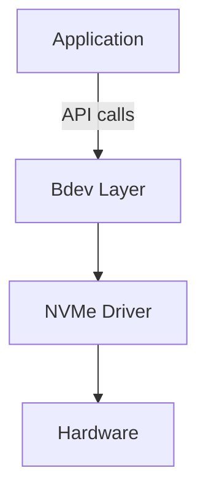
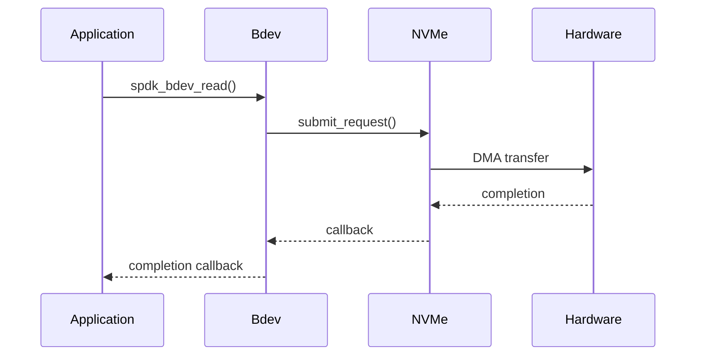
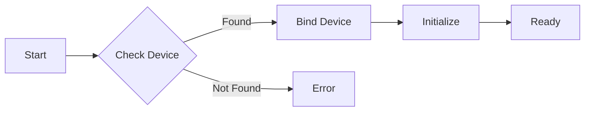

# SPDK Mastery Course - Master Guideline

**Version**: 1.0
**Last Updated**: 2026-01-30
**Purpose**: Comprehensive guideline for creating consistent, high-quality SPDK course materials

---

## Course Overview

### Target Audience
- **Primary**: New employees at storage service companies
- **Background**: Go and C++ programming experience
- **Goal**: Contribute to SPDK development and become SPDK experts
- **Prerequisites**:
  - Strong programming fundamentals
  - Linux/Unix command line proficiency
  - Basic understanding of storage concepts helpful but not required

### Learning Philosophy
**Top-Down Approach**: Architecture → Principles → Implementation → Code Details

1. **Why before How**: Understand motivations before mechanisms
2. **Big Picture First**: System architecture before component details
3. **Progressive Depth**: Foundation → Implementation → Mastery
4. **Hands-On Learning**: Theory reinforced with practical exercises
5. **Real-World Context**: Examples from actual SPDK codebase

---

## Three-Stage Learning Progression

### Stage 1: Foundation (Weeks 1-3)
**Goal**: Understand SPDK's architecture, principles, and design philosophy

**Focus Areas**:
- What SPDK is and why it exists
- Core principles: userspace I/O, polled mode, zero-copy
- System architecture and component overview
- Threading model and concurrency
- Memory management fundamentals

**Learning Outcomes**:
- Explain SPDK's advantages over kernel-based I/O
- Understand the userspace driver model
- Grasp the threading and event framework
- Navigate the SPDK codebase structure

**Depth**: Conceptual understanding with minimal code

### Stage 2: Implementation (Weeks 4-8)
**Goal**: Learn to build applications and modules using SPDK APIs

**Focus Areas**:
- Bdev abstraction layer programming
- NVMe driver API usage
- Event framework integration
- JSON-RPC interface
- Building custom modules
- Application development patterns

**Learning Outcomes**:
- Build simple SPDK applications
- Create custom bdev modules
- Use core SPDK libraries effectively
- Integrate JSON-RPC management
- Follow SPDK coding conventions

**Depth**: API-level understanding with code examples

### Stage 3: Mastery (Weeks 9-16)
**Goal**: Master advanced topics and contribute to SPDK development

**Focus Areas**:
- NVMe-oF target internals
- Performance optimization techniques
- Advanced threading patterns
- Debugging and profiling
- Contributing to SPDK project
- Production deployment strategies

**Learning Outcomes**:
- Understand complex subsystems (NVMe-oF, vhost, iSCSI)
- Optimize performance for production
- Debug issues effectively
- Contribute code to SPDK
- Deploy and manage SPDK in production

**Depth**: Deep internals with source code analysis

---

## Document Structure Standards

### File Naming Convention

```
[Module-Number]-[Stage-Level]-[Topic-Name].md

Examples:
01-S1-Why-SPDK-Exists.md
02-S1-Core-Principles.md
10-S2-Bdev-Programming.md
20-S3-NVMf-Internals.md
```

**Pattern Explanation**:
- `Module-Number`: Two-digit sequence (01, 02, 03...)
- `Stage-Level`: S1 (Stage 1), S2 (Stage 2), S3 (Stage 3)
- `Topic-Name`: Descriptive, hyphen-separated

### Directory Structure

```
claudedocs/spdk-mastery-course/
├── 00-MASTER-GUIDELINE.md (this file)
├── 01-COURSE-INDEX.md (master index with progress tracking)
│
├── stage-1-foundation/
│   ├── 01-S1-Why-SPDK-Exists.md
│   ├── 02-S1-Core-Principles.md
│   ├── 03-S1-Architecture-Overview.md
│   ├── 04-S1-Threading-Model.md
│   ├── 05-S1-Memory-Management.md
│   └── 06-S1-Build-System.md
│
├── stage-2-implementation/
│   ├── 10-S2-Environment-Setup.md
│   ├── 11-S2-Hello-World.md
│   ├── 12-S2-Event-Framework.md
│   ├── 13-S2-Bdev-Layer.md
│   ├── 14-S2-NVMe-Driver.md
│   ├── 15-S2-JSON-RPC.md
│   ├── 16-S2-Custom-Bdev-Module.md
│   └── 17-S2-Application-Development.md
│
├── stage-3-mastery/
│   ├── 20-S3-NVMf-Architecture.md
│   ├── 21-S3-Vhost-Internals.md
│   ├── 22-S3-Performance-Optimization.md
│   ├── 23-S3-Advanced-Threading.md
│   ├── 24-S3-Debugging-Techniques.md
│   ├── 25-S3-Memory-Pools.md
│   ├── 26-S3-DPDK-Integration.md
│   └── 27-S3-Contributing-Guide.md
│
├── exercises/
│   ├── EX01-Hello-Bdev.md
│   ├── EX02-Custom-Poller.md
│   ├── EX03-Simple-App.md
│   └── ...
│
├── reference/
│   ├── REF-API-Quick-Reference.md
│   ├── REF-Common-Patterns.md
│   ├── REF-Debugging-Cheatsheet.md
│   ├── REF-Performance-Tuning.md
│   └── REF-Glossary.md
│
└── assets/
    ├── diagrams/
    └── code-snippets/
```

---

## Module Template

### Standard Module Structure

Every module document MUST follow this structure:

```markdown
# [Module Number]: [Topic Name]

**Stage**: [1/2/3]
**Difficulty**: [Beginner/Intermediate/Advanced]
**Estimated Time**: [X hours]
**Prerequisites**: [List of required prior modules]

---

## Learning Objectives

By the end of this module, you will be able to:
- [Objective 1]
- [Objective 2]
- [Objective 3]

---

## Overview

[2-3 paragraph high-level introduction to the topic]

### Why This Matters

[Explain the practical importance and real-world context]

---

## Core Concepts

### Concept 1: [Name]

[Explanation with diagrams if needed]

**Key Points**:
- Point 1
- Point 2
- Point 3

### Concept 2: [Name]

[Continue pattern...]

---

## Architecture/Implementation Details

[Stage-appropriate depth - more conceptual for S1, more code for S2/S3]

### [Subsection]

[Content with code examples as appropriate]

```c
// Code example with clear comments
// Explain what it does and why
```

---

## Code Walkthrough

[For S2 and S3: Walk through actual SPDK source code]

**File**: `lib/[component]/[file.c]`
**Location**: Lines XXX-YYY

[Explanation of what the code does]

---

## Practical Examples

### Example 1: [Scenario]

[Real-world example or use case]

```c
// Complete, runnable code example
```

**Explanation**:
[What this does and how it works]

---

## Common Patterns

[Stage-appropriate patterns and idioms]

1. **Pattern Name**
   - When to use
   - How to implement
   - Example

---

## Gotchas and Best Practices

### Common Mistakes

1. **Mistake**: [What people often do wrong]
   **Why It's Wrong**: [Explanation]
   **Correct Approach**: [How to do it right]

### Best Practices

1. **Practice**: [Recommended approach]
   **Rationale**: [Why this is best]

---

## Hands-On Exercise

[Link to related exercise or mini-lab]

**Exercise**: [exercises/EXXX-Name.md]

**Objective**: [What they'll build/do]

---

## Knowledge Check

1. [Question testing understanding]
2. [Question requiring application]
3. [Question prompting critical thinking]

---

## Additional Resources

- **SPDK Source**: [`lib/[component]`]
- **Official Docs**: [Link to relevant SPDK documentation]
- **Related Modules**: [Links to prerequisite/follow-up modules]

---

## Summary

[2-3 paragraph summary of key takeaways]

**Next Module**: [XX-SX-Next-Topic.md]
```

---

## Code Example Standards

### Code Block Format

```c
/**
 * Brief description of what this code demonstrates
 *
 * Context: Where this appears in SPDK or when to use this pattern
 */

#include "spdk/stdinc.h"
#include "spdk/bdev.h"

// Clear, meaningful variable names
// Comments explain WHY, not just WHAT
static void
example_function(struct spdk_bdev *bdev)
{
    // Implementation with educational comments
    // Focus on teaching patterns, not just showing code
}
```

### Code Example Guidelines

1. **Always Include Context**
   - Where in SPDK this pattern appears
   - When you would use this approach
   - What problem it solves

2. **Complete and Compilable**
   - Include necessary headers
   - Show complete function signatures
   - Provide context for snippets

3. **Progressive Complexity**
   - Start with simplest working example
   - Build complexity gradually
   - Explain each addition

4. **Real SPDK Code**
   - Reference actual source files
   - Include file paths and line numbers
   - Show current codebase patterns

5. **Educational Comments**
   - Explain design decisions
   - Highlight SPDK-specific idioms
   - Point out common pitfalls

---

## Diagram Standards

### Diagram Types

1. **Architecture Diagrams**
   - System-level component relationships
   - Layer interactions
   - Data flow paths

2. **Sequence Diagrams**
   - Function call sequences
   - Event flows
   - Thread interactions

3. **Conceptual Diagrams**
   - Abstract concepts
   - Mental models
   - Design patterns

### Diagram Format

Use Mermaid for all diagrams. Mermaid renders professionally in modern markdown viewers and is easier to maintain.

**Architecture Diagram Example**:
````markdown

````

**Sequence Diagram Example**:
````markdown

````

**Flowchart Example**:
````markdown

````

---

## Consistency Rules

### Writing Style

1. **Voice**: Active, direct, tutorial-style
   - ✓ "You create a bdev by calling..."
   - ✗ "A bdev can be created by calling..."

2. **Tone**: Professional but approachable
   - Explain complex concepts simply
   - Use analogies where helpful
   - Don't oversimplify

3. **Clarity**: Technical precision with readability
   - Define terms before using them
   - Avoid unnecessary jargon
   - Explain acronyms on first use

### Terminology Standards

| Term | Usage | Notes |
|------|-------|-------|
| SPDK | Always uppercase | Storage Performance Development Kit |
| bdev | Lowercase unless starting sentence | Block device abstraction |
| NVMe | Capitalized as shown | Non-Volatile Memory Express |
| NVMe-oF | Use dash, capital letters | NVMe over Fabrics |
| polled mode | Lowercase | Not "polling mode" |
| thread | Lowercase, SPDK-specific | Not OS thread |
| reactor | Lowercase | SPDK's execution context |

### Cross-References

**Internal Links**: Always use relative paths
```markdown
See [Threading Model](./04-S1-Threading-Model.md) for details.
```

**Source Code References**: Use full path from repo root
```markdown
See `lib/event/reactor.c:245` for implementation.
```

**External Links**: Include version or date
```markdown
[SPDK Documentation](https://spdk.io/doc/) (current as of 2026-01-30)
```

---

## Progress Tracking

### Module Status

Each module has a status tracked in `01-COURSE-INDEX.md`:

- **Not Started**: 📝 Planning phase
- **In Progress**: 🔄 Actively writing
- **Draft Complete**: ✏️ Ready for review
- **Reviewed**: ✅ Content verified
- **Finalized**: 🎯 Complete and polished

### Quality Checklist

Before marking a module as **Finalized**, verify:

- [ ] Follows template structure
- [ ] Learning objectives are clear and measurable
- [ ] Code examples are tested and correct
- [ ] File paths and line numbers are accurate
- [ ] Cross-references are valid
- [ ] Terminology follows standards
- [ ] Exercise links work
- [ ] Knowledge check questions are relevant
- [ ] Summary captures key points
- [ ] No typos or grammatical errors

---

## Version Control

### Document Versioning

Track significant changes at the top of each module:

```markdown
**Version History**:
- v1.0 (2026-01-30): Initial version
- v1.1 (2026-02-15): Added performance optimization section
- v1.2 (2026-03-01): Updated code examples for SPDK v25.01
```

### Codebase Alignment

**Current SPDK Version**: Check with `git describe --tags`

When SPDK updates significantly:
1. Review affected modules
2. Update code examples
3. Verify file paths and line numbers
4. Update version notes

---

## Exercise Design Principles

### Exercise Structure

```markdown
# Exercise [Number]: [Name]

**Related Module**: [XX-SX-Module.md]
**Difficulty**: [Easy/Medium/Hard]
**Time**: [XX minutes]

## Objective
[What student will build/accomplish]

## Prerequisites
- [Required knowledge]
- [Required setup]

## Setup
[Environment preparation steps]

## Tasks

### Task 1: [Name]
[Clear instructions]

**Hint**: [Helpful pointer if they get stuck]

### Task 2: [Name]
[Continue...]

## Verification
[How to check if solution is correct]

## Solution
[Complete solution with explanation]

## Challenges
[Optional extensions for advanced learners]
```

---

## Maintenance and Updates

### Regular Review Schedule

- **Monthly**: Check for broken links and outdated references
- **Quarterly**: Verify code examples against latest SPDK
- **Major SPDK Release**: Review all affected modules

### Feedback Integration

Track learner feedback and common questions:
1. Note recurring confusion points
2. Add clarifications to modules
3. Create supplementary materials as needed

---

## Getting Started (For Course Developers)

### First Steps

1. Read this guideline completely
2. Review `01-COURSE-INDEX.md` for overview
3. Study 2-3 existing modules as examples
4. Choose a module to work on
5. Follow the template strictly
6. Submit for review before finalizing

### Development Workflow

1. **Plan**: Outline module content
2. **Research**: Study SPDK source code thoroughly
3. **Draft**: Write following template
4. **Test**: Verify all code examples
5. **Review**: Check against quality checklist
6. **Finalize**: Mark complete in index

---

## Contact and Collaboration

**Course Maintainer**: [Your organization's contact]
**Last Updated**: 2026-01-30
**Next Review**: 2026-02-28

---

## Appendix A: SPDK Architecture Quick Reference

### Key Directories

| Directory | Purpose |
|-----------|---------|
| `lib/` | Core SPDK libraries |
| `module/` | Pluggable modules (bdev, scheduler, etc.) |
| `app/` | Complete applications (nvmf_tgt, etc.) |
| `include/spdk/` | Public API headers |
| `examples/` | Reference implementations |
| `scripts/` | Utility scripts |
| `doc/` | Official documentation |

### Core Libraries

| Library | Purpose | Public Header |
|---------|---------|---------------|
| `lib/bdev` | Block device abstraction | `include/spdk/bdev.h` |
| `lib/nvme` | NVMe driver | `include/spdk/nvme.h` |
| `lib/nvmf` | NVMe-oF target | `include/spdk/nvmf.h` |
| `lib/event` | Event framework | `include/spdk/event.h` |
| `lib/thread` | Threading abstraction | `include/spdk/thread.h` |
| `lib/iscsi` | iSCSI target | `include/spdk/iscsi.h` |
| `lib/vhost` | Vhost target | `include/spdk/vhost.h` |

---

## Appendix B: Acronyms and Glossary

### Common Acronyms

- **SPDK**: Storage Performance Development Kit
- **NVMe**: Non-Volatile Memory Express
- **NVMe-oF**: NVMe over Fabrics
- **DMA**: Direct Memory Access
- **DPDK**: Data Plane Development Kit
- **RPC**: Remote Procedure Call
- **RDMA**: Remote Direct Memory Access
- **I/O**: Input/Output
- **CPU**: Central Processing Unit
- **PMD**: Poll Mode Driver

### Key Terms

See `reference/REF-Glossary.md` for complete glossary.

---

*End of Master Guideline*
