# Diagram Conversion Guide - ASCII to Mermaid

**Status**: In Progress
**Purpose**: Convert all ASCII art diagrams to Mermaid format

---

## Conversion Status

### Module 01: Why SPDK Exists ✅
- [x] Kernel I/O stack (graph TD)
- [x] Interrupt-driven vs polled I/O (sequenceDiagram)
- [x] Memory mapping diagram (graph TD)
- [x] Threading model (graph TD with subgraph)
- [x] SPDK ecosystem (graph TD)
- [x] Latency comparison (gantt charts)

### Module 02: Core Principles ✅
- [x] Kernel vs userspace architecture (graph TD with subgraph)
- [x] Interrupt vs polled timing (sequenceDiagram)
- [x] Zero-copy diagrams (graph TD)
- [ ] Physical memory contiguity
- [ ] Message passing flow
- [ ] Lock-free ring buffer

### Module 03: Architecture Overview ✅
- [x] Layered architecture (graph TD with colors)
- [ ] Bdev architecture
- [ ] NVMe driver flow
- [ ] Application flow
- [ ] Component interaction

### Module 04: Threading Model
- [ ] SPDK thread vs OS thread
- [ ] Reactor architecture
- [ ] Poller execution
- [ ] Message passing
- [ ] I/O channel concept

### Module 05: Memory Management
- [ ] Virtual to physical mapping
- [ ] DMA path
- [ ] Hugepage comparison
- [ ] DPDK memory model
- [ ] NUMA architecture
- [ ] IOMMU/VFIO model

### Module 06: Build System
- [ ] Build process flow
- [ ] Dependency graph

### Module 07: Codebase Navigation
- [ ] Directory structure tree
- [ ] I/O path flow
- [ ] Initialization sequence

### Module 10: Environment Setup
- [ ] Setup workflow

### Module 11: Hello World
- [ ] Application structure
- [ ] I/O flow

---

## Mermaid Diagram Templates

### Architecture Layers

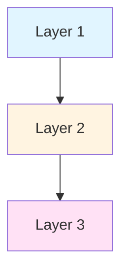

### Sequence Diagrams

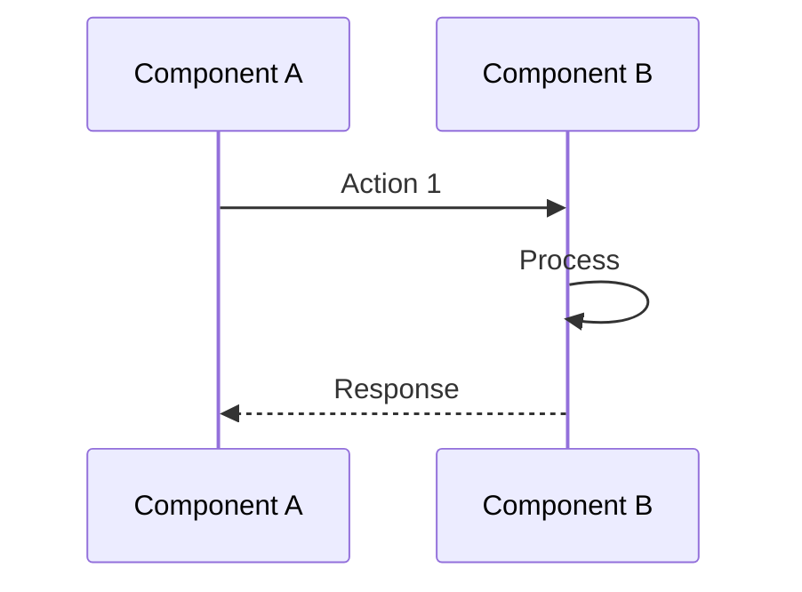

### Flow with Subgraphs

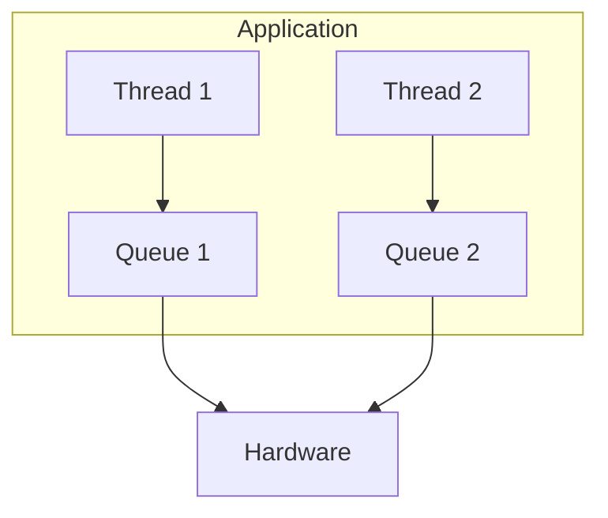

### State/Flow Diagram

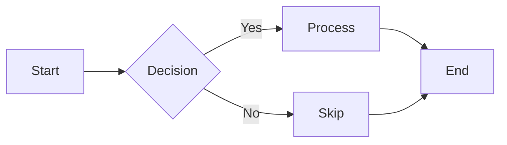

### Timing Diagram (using Gantt)

```mermaid
gantt
    title Operation Timeline
    dateFormat X
    axisFormat %L

    section Operations
    Task 1  :0, 5
    Task 2  :5, 10
    Task 3  :10, 15
```

---

## Remaining Conversions Needed

### High Priority (Complete Modules)

**Module 02 Remaining**:
```
Physical memory pages layout →
  Use: graph TD with boxes for pages

Message passing between threads →
  Use: sequenceDiagram with Thread A and Thread B

Lock-free ring buffer →
  Use: graph LR showing producer/consumer
```

**Module 03 Remaining**:
```
Bdev architecture with stacking →
  Use: graph TD with subgraphs

Read I/O flow through layers →
  Use: sequenceDiagram showing full path

Application initialization →
  Use: flowchart showing steps
```

**Module 04 All diagrams**:
```
SPDK thread vs OS thread comparison →
  Use: graph TD side-by-side

Reactor event loop →
  Use: flowchart with loop

Poller types and execution →
  Use: graph showing relationships

Message queue structure →
  Use: graph LR for ring buffer

I/O channel per-thread model →
  Use: graph with subgraphs
```

**Module 05 All diagrams**:
```
Virtual/physical address translation →
  Use: flowchart

DMA path →
  Use: sequenceDiagram

Standard vs hugepages →
  Use: graph showing page layouts

DPDK memory zones →
  Use: graph with subgraphs for sockets

NUMA architecture →
  Use: graph TD with cross-socket links

VFIO model →
  Use: sequenceDiagram or flowchart
```

### Medium Priority (Templates)

**Module 06-07**: Convert any remaining ASCII

**Module 10-11**: Convert application structure diagrams

---

## Conversion Guidelines

### When to Use Each Diagram Type

**graph TD** (Top-Down):
- Layered architectures
- Component hierarchies
- Data flow downward
- Dependency chains

**graph LR** (Left-Right):
- Process flows
- State machines
- Sequential operations
- Ring buffers

**sequenceDiagram**:
- Interaction between components
- Message passing
- API calls and callbacks
- Time-ordered operations

**flowchart**:
- Decision trees
- State machines
- Algorithms
- Conditional flows

**gantt**:
- Timing diagrams
- Performance comparisons
- Parallel operations
- Latency breakdowns

### Styling Tips

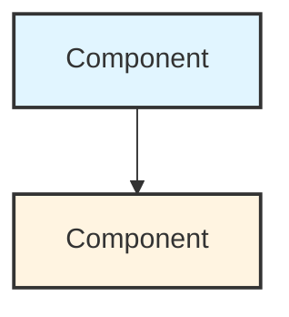

**Color Scheme**:
- Blue (#e1f5ff): Application layer
- Yellow (#fff4e1): Protocol/API layer
- Pink (#ffe1f5): Core layer
- Green (#e1ffe1): Driver layer
- Gray (#f0f0f0): System layer

---

## How to Complete Conversions

### Step-by-Step Process

1. **Identify ASCII Art**
   ```bash
   grep -n "┌\|│\|└\|├\|─\|↓\|→" module.md
   ```

2. **Determine Diagram Type**
   - Hierarchy? → graph TD
   - Interaction? → sequenceDiagram
   - Flow? → flowchart
   - Timing? → gantt

3. **Create Mermaid Equivalent**
   - Test in Mermaid Live Editor
   - Add styling if helpful
   - Verify rendering

4. **Replace in Module**
   - Use Edit tool
   - Replace entire code block
   - Keep surrounding text

5. **Verify**
   - Preview in markdown viewer
   - Check all arrows/connections
   - Ensure readability

---

## Quick Reference

### Common Patterns

**Simple Stack**:
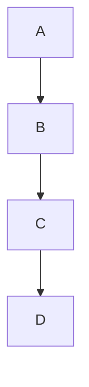

**With Labels**:
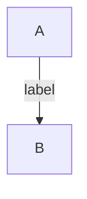

**With Subgraphs**:
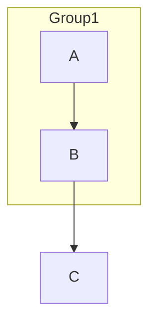

**Bidirectional**:
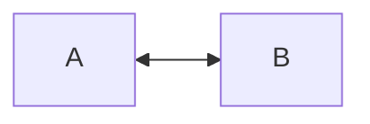

**Multiple Arrows**:
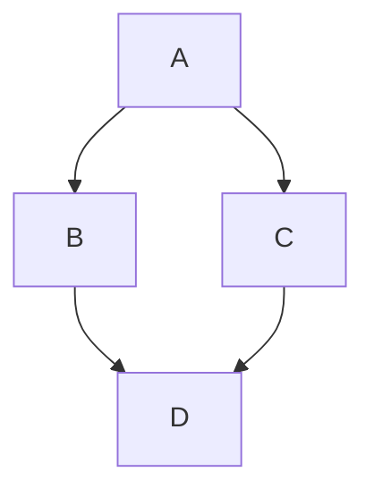

---

## Completion Checklist

For each module:
- [ ] List all ASCII diagrams
- [ ] Choose appropriate Mermaid type
- [ ] Create Mermaid version
- [ ] Test rendering
- [ ] Replace in file
- [ ] Verify in preview
- [ ] Update this guide
- [ ] Mark module complete

---

## Notes

- Mermaid renders in GitHub, GitLab, many IDEs
- More maintainable than ASCII art
- Professional appearance
- Easier to modify
- Can add styling/colors
- Better for complex diagrams

---

*Continue converting remaining modules systematically*
*Follow templates above for consistency*
