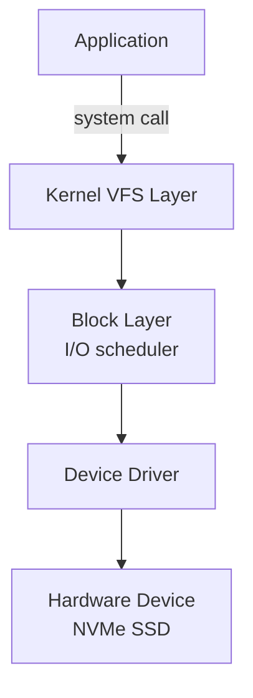
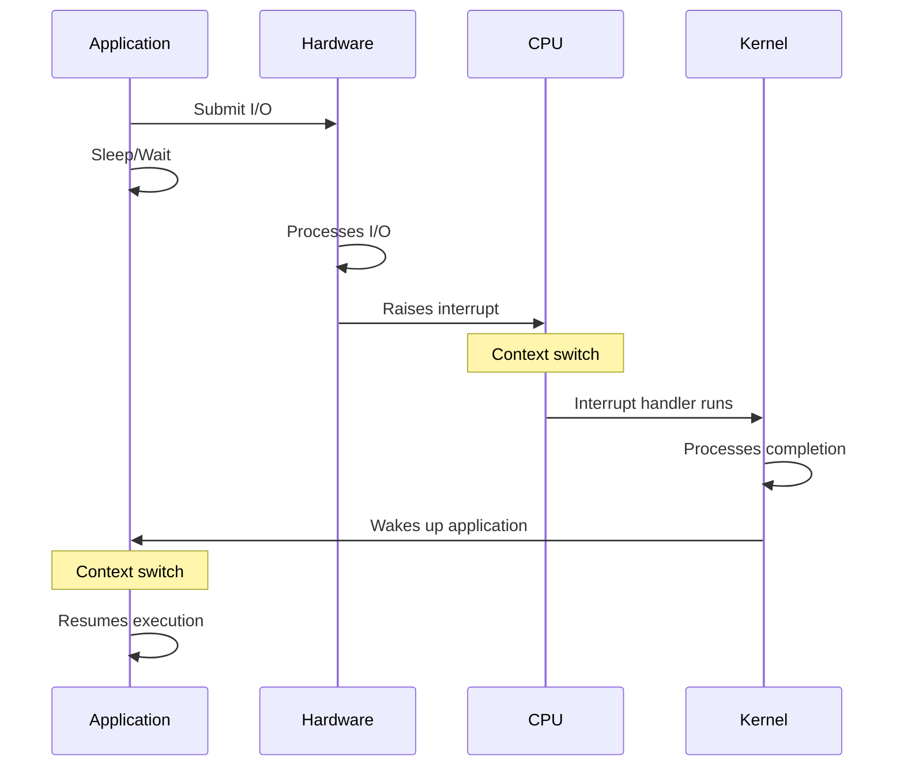
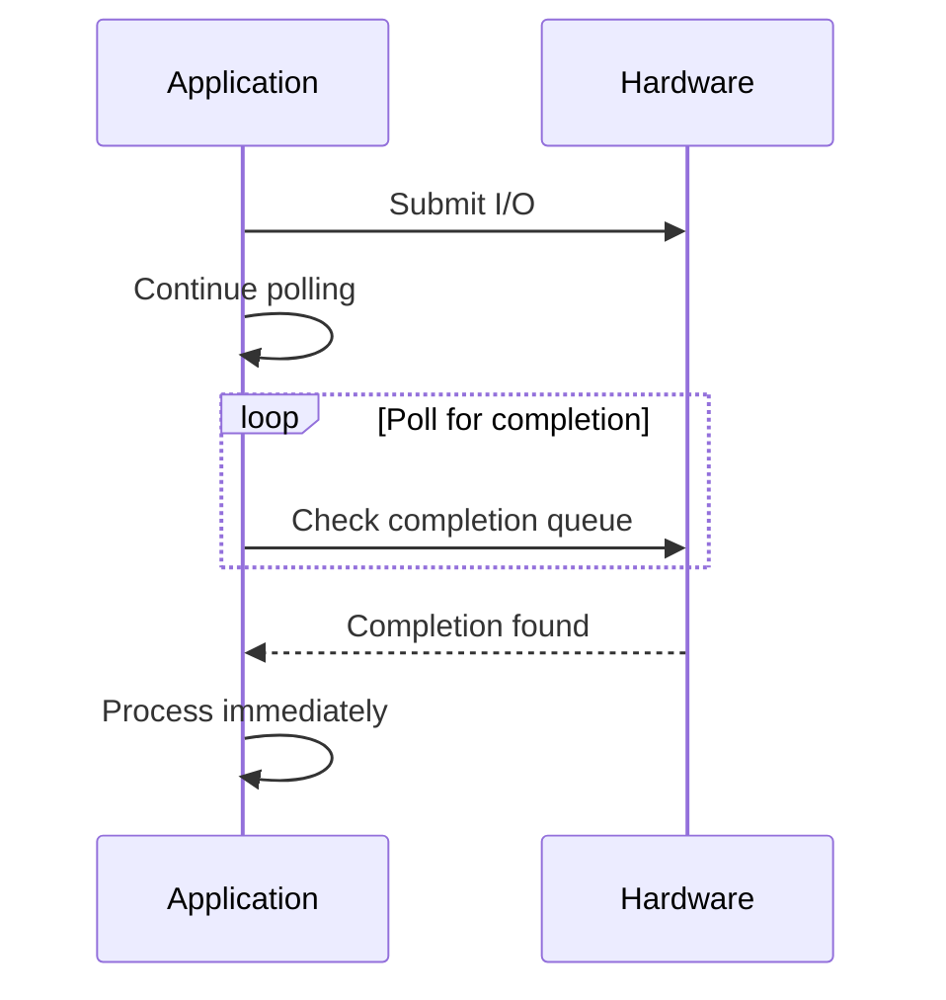
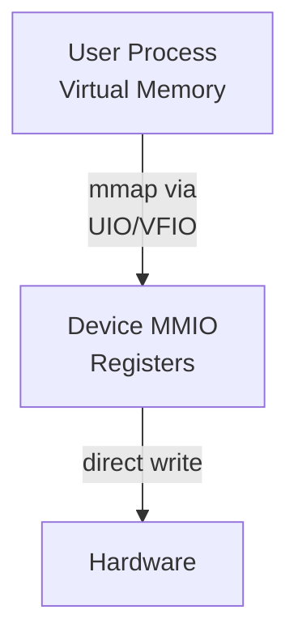
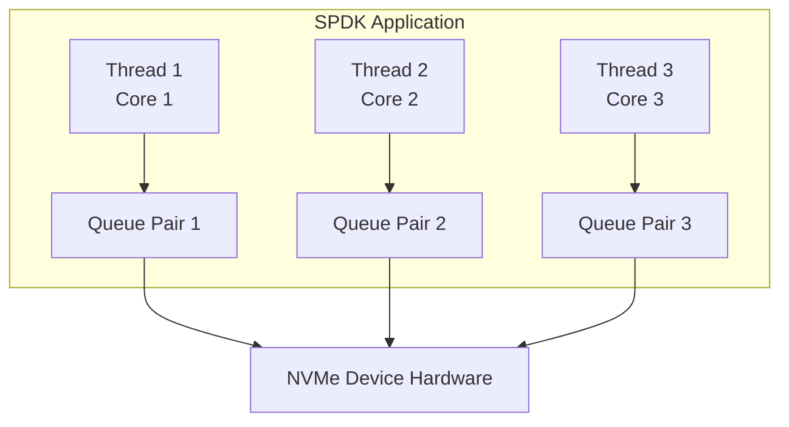
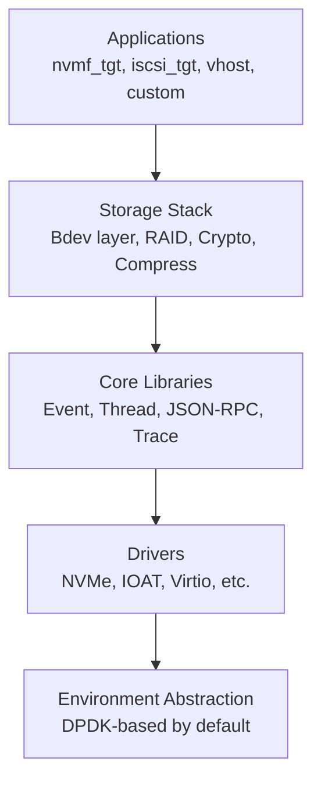

# Module 01: Why SPDK Exists

**Stage**: 1 (Foundation)
**Difficulty**: Beginner
**Estimated Time**: 2 hours
**Prerequisites**: None

**Version History**:
- v1.0 (2026-01-30): Initial version

---

## Learning Objectives

By the end of this module, you will be able to:
- Explain the fundamental problems with traditional kernel-based I/O
- Understand why userspace drivers offer performance advantages
- Describe SPDK's core value proposition
- Identify appropriate use cases for SPDK
- Recognize when SPDK is (and isn't) the right solution

---

## Overview

SPDK (Storage Performance Development Kit) represents a fundamental rethinking of how we build high-performance storage software. To understand why SPDK exists, we need to first understand the limitations of traditional approaches to storage I/O.

### Why This Matters

Modern storage devices, particularly NVMe SSDs, are incredibly fast. They can handle millions of I/O operations per second with microsecond-level latencies. However, the traditional operating system I/O stack was designed decades ago for much slower devices like hard disk drives. This creates a significant mismatch: the software stack itself becomes the bottleneck, preventing applications from fully utilizing the hardware's capabilities.

SPDK solves this problem by bypassing the kernel entirely and moving storage drivers into userspace where they operate in a polled mode. This seemingly simple change enables dramatic performance improvements and forms the foundation for modern, high-performance storage systems.

---

## Core Concepts

### Concept 1: The Kernel I/O Bottleneck

Traditional storage I/O on Linux (and other operating systems) follows this path:



**Key Points**:
- Every I/O requires **context switches** between user space and kernel space
- Context switches are expensive (typically 1-3 microseconds)
- Modern NVMe devices can complete I/O in **~10-20 microseconds**
- The software overhead becomes comparable to the hardware latency!

**The Problem**: When context switch overhead is 10-30% of total I/O time, you're wasting significant CPU cycles on software coordination rather than actual work.

### Concept 2: Interrupt-Driven vs Polled I/O

**Traditional Interrupt-Driven I/O**:


**Cost**: 2 context switches + interrupt handling overhead per I/O

**SPDK's Polled Mode**:


**Cost**: Memory read (typically from CPU cache)

**Key Points**:
- Polling eliminates interrupts and their overhead
- Checking completion queue is fast (just reading memory)
- Modern CPUs keep frequently accessed memory in cache (Intel DDIO)
- No context switches required
- Requires dedicating CPU cores to polling (trade-off)

### Concept 3: Userspace vs Kernel Drivers

**Kernel Driver Challenges**:

1. **Shared Resource Management**
   - Must handle I/O from multiple processes
   - Requires locks and synchronization
   - Can't make assumptions about caller context

2. **Generic Design**
   - Must support all possible use cases
   - Includes features most applications don't need
   - Optimization is limited by generality

3. **Development Friction**
   - Kernel development is complex
   - Debugging is difficult
   - Updates require kernel recompilation/reboot

**Userspace Driver Advantages**:

1. **Application-Specific Optimization**
   - Driver embedded in single application
   - Knows exact threading model
   - Can eliminate unnecessary abstractions

2. **Direct Hardware Access**
   - No system calls required
   - No kernel mediation
   - Direct memory-mapped I/O (MMIO)

3. **Development Agility**
   - Standard userspace debugging tools
   - Rapid iteration
   - No kernel recompilation needed

### Concept 4: The Hardware Evolution

**Historical Context**:

| Era | Device | Latency | IOPS | Bottleneck |
|-----|---------|---------|------|-----------|
| 1990s | HDD | ~10 ms | ~100 | Mechanical |
| 2000s | SATA SSD | ~100 μs | ~10K | Interface |
| 2010s | PCIe SSD | ~50 μs | ~100K | Software |
| 2020s | NVMe SSD | ~10 μs | ~1M+ | Software |

**The Shift**: Hardware got 1000x faster, but software stack remained largely the same.

**Key Insight**: When device latency drops from milliseconds to microseconds, every microsecond of software overhead matters tremendously.

---

## SPDK's Value Proposition

### What SPDK Provides

1. **Userspace NVMe Driver**
   - Direct hardware access without kernel mediation
   - Zero-copy data path
   - Fully asynchronous API

2. **Polled Mode Operation**
   - Eliminates interrupt overhead
   - Predictable latency
   - Maximum throughput

3. **Lock-Free Architecture**
   - Message passing instead of locking
   - Per-thread resources
   - Linear scalability

4. **Complete Storage Stack**
   - Block device abstraction (bdev layer)
   - Storage protocols (NVMe-oF, iSCSI, vhost)
   - Applications ready to deploy

### Performance Advantages

**Typical Improvements with SPDK**:

| Metric | Traditional | SPDK | Improvement |
|--------|-------------|------|-------------|
| Latency | 50-100 μs | 10-20 μs | 2-5x lower |
| IOPS (per core) | 200K | 1M+ | 5x higher |
| CPU Efficiency | 60-70% | 90-95% | 30% better |
| Jitter | High | Very low | More predictable |

**Real-World Impact**:
- Fewer CPU cores needed for same workload
- More consistent performance
- Better resource utilization
- Lower total cost of ownership

---

## When to Use SPDK

### Ideal Use Cases

✅ **High-Performance Storage Appliances**
- NVMe-oF targets
- All-flash arrays
- Distributed storage systems

✅ **Latency-Sensitive Applications**
- Databases (MySQL, PostgreSQL, RocksDB)
- Key-value stores (Redis, Memcached)
- Real-time analytics

✅ **High-Throughput Workloads**
- Data lakes
- Object storage
- Backup/restore systems

✅ **Custom Storage Solutions**
- Special-purpose storage engines
- Research projects
- Novel storage architectures

### When NOT to Use SPDK

❌ **General-Purpose Computing**
- Desktop/laptop systems
- Multi-tenant environments
- Shared hosting

❌ **Legacy Application Integration**
- Applications requiring POSIX I/O
- Existing applications without modification
- Need for standard filesystem access

❌ **Resource-Constrained Environments**
- Limited CPU cores
- Can't dedicate cores to polling
- Need CPU sharing with other workloads

❌ **Simple Storage Needs**
- Light I/O workloads
- Kernel performance is sufficient
- Development complexity outweighs benefits

---

## Architecture/Implementation Details

### How SPDK Achieves Its Goals

**1. Device Unbinding**

SPDK takes control of NVMe devices by:
```bash
# Unbind device from kernel driver
echo "0000:04:00.0" > /sys/bus/pci/drivers/nvme/unbind

# Bind to UIO or VFIO driver
echo "0000:04:00.0" > /sys/bus/pci/drivers/uio_pci_generic/bind
```

After unbinding:
- `/dev/nvme0n1` disappears
- Kernel can no longer access device
- SPDK has exclusive control

**2. Direct Hardware Access**

SPDK maps the device's PCI BAR (Base Address Register) into user process memory:



This allows:
- Direct register manipulation
- No system calls
- Immediate hardware control

**3. Threading Model**



**Key Characteristics**:
- One queue pair per thread
- No locks between threads
- Each thread polls its own queue
- Hardware queues are naturally parallel

---

## The SPDK Ecosystem

### Core Components



---

## Practical Examples

### Example 1: Latency Comparison

**Scenario**: Read 4KB of data from NVMe SSD

**Traditional Kernel Path**:

```mermaid
gantt
    title Kernel I/O Path (~15 μs total)
    dateFormat X
    axisFormat %L

    section Latency
    read() context switch  :0, 1
    Kernel processing     :1, 3
    Device I/O            :3, 13
    Interrupt handling    :13, 14
    Wake app context switch :14, 15
```


**SPDK Path**:

```mermaid
gantt
    title SPDK I/O Path (~10.2 μs total)
    dateFormat X
    axisFormat %L

    section Latency
    Submit I/O (function call) :0, 0.1
    Device I/O                  :0.1, 10.1
    Poll completion (memory)    :10.1, 10.2
```


**Savings**: ~33% latency reduction

---

## Common Patterns

### Pattern 1: Resource Dedication

**Concept**: SPDK requires dedicated CPU cores for polling

**Why**: Polling continuously checks for completions, keeping CPU busy

**Best Practice**:
```bash
# Isolate cores for SPDK (Linux)
# In kernel boot parameters:
isolcpus=2,3,4,5

# Bind SPDK threads to isolated cores
# Application specifies core masks
```

**Trade-off**: Better performance at cost of CPU exclusivity

---

### Pattern 2: Application Integration

**Traditional App**:
```c
// Synchronous I/O
int fd = open("/dev/nvme0n1", O_RDWR);
read(fd, buffer, size);  // Blocks until complete
process_data(buffer);
```

**SPDK App**:
```c
// Asynchronous I/O
struct spdk_bdev *bdev;
spdk_bdev_read(bdev, channel, buffer, offset, size,
               read_complete_callback, ctx);
// Continue processing, callback invoked when done
```

**Key Difference**: Asynchronous by design, requires different programming model

---

## Gotchas and Best Practices

### Common Mistakes

1. **Mistake**: Trying to use SPDK with kernel I/O simultaneously
   **Why It's Wrong**: Device can only be controlled by one driver
   **Correct Approach**: Choose kernel OR SPDK, not both

2. **Mistake**: Running SPDK without isolated cores
   **Why It's Wrong**: CPU scheduler interference causes jitter
   **Correct Approach**: Use `isolcpus` and pin SPDK threads

3. **Mistake**: Blocking in callbacks
   **Why It's Wrong**: Stalls the entire reactor/thread
   **Correct Approach**: All operations must be async and non-blocking

4. **Mistake**: Assuming POSIX compatibility
   **Why It's Wrong**: SPDK provides different APIs
   **Correct Approach**: Applications must use SPDK APIs explicitly

### Best Practices

1. **Practice**: Profile before and after
   **Rationale**: Verify SPDK actually improves your workload

2. **Practice**: Start with examples
   **Rationale**: Working code demonstrates patterns correctly

3. **Practice**: Plan your threading model upfront
   **Rationale**: Threading is fundamental to SPDK's architecture

4. **Practice**: Monitor CPU utilization
   **Rationale**: Ensure polling efficiency matches workload

---

## Hands-On Exercise

**Exercise**: [exercises/EX01-Environment-Exploration.md]

**Objective**: Explore SPDK's performance advantage with actual measurements

**Tasks**:
1. Identify NVMe devices on your system
2. Measure kernel I/O performance with `fio`
3. Understand device capabilities with `nvme-cli`
4. Review SPDK example applications

---

## Knowledge Check

1. **Why is context switching expensive for modern NVMe devices?**
   - Hint: Consider the relationship between context switch time and device latency

2. **What are the trade-offs of polled mode vs interrupt-driven I/O?**
   - Hint: Think about CPU utilization vs latency

3. **When would you NOT want to use SPDK?**
   - Hint: Consider resource requirements and application constraints

4. **How does SPDK achieve lock-free operation?**
   - Hint: Think about resource ownership and message passing

---

## Additional Resources

- **SPDK Source**: [Full repository](https://github.com/spdk/spdk)
- **Official Docs**:
  - [Userspace Drivers](../../doc/userspace.md)
  - [Overview](../../doc/overview.md)
- **Related Modules**:
  - Next: [02-S1-Core-Principles.md](./02-S1-Core-Principles.md)

---

## Summary

SPDK exists to solve a fundamental mismatch between modern hardware capabilities and traditional software architectures. By moving drivers to userspace and operating in polled mode, SPDK eliminates the overhead of context switches and interrupts that have become bottlenecks with ultra-fast NVMe storage.

**Key Takeaways**:

1. **The Problem**: Kernel I/O overhead becomes significant with fast devices
2. **The Solution**: Userspace drivers + polled mode + lock-free architecture
3. **The Result**: 2-5x lower latency, 5x higher IOPS per core
4. **The Cost**: Requires dedicated CPU cores and different programming model
5. **The Use Case**: High-performance, latency-sensitive storage applications

Understanding WHY SPDK exists—the problems it solves and trade-offs it makes—is essential before diving into HOW it works. This foundation will guide your learning as we explore SPDK's architecture and implementation in subsequent modules.

**Next Module**: [02-S1-Core-Principles.md](./02-S1-Core-Principles.md) - Deep dive into SPDK's architectural principles

---

*End of Module 01*
