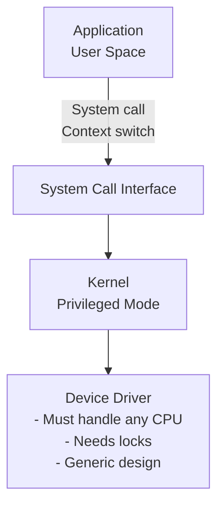
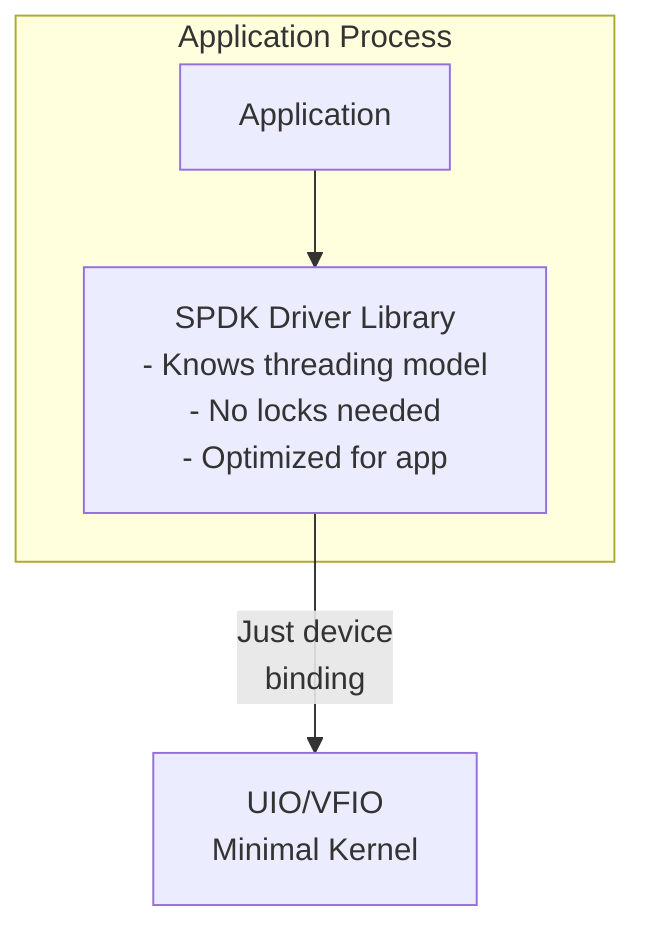
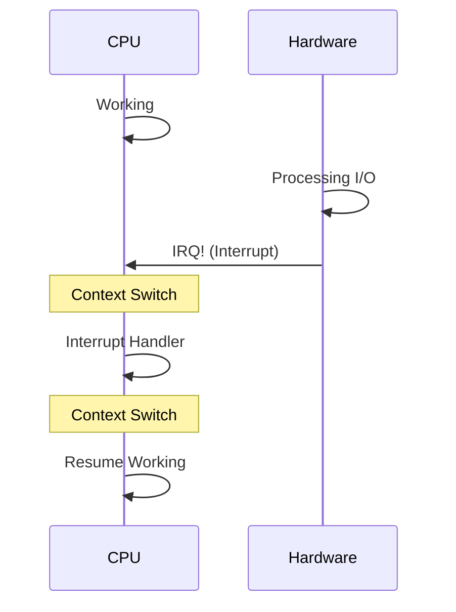
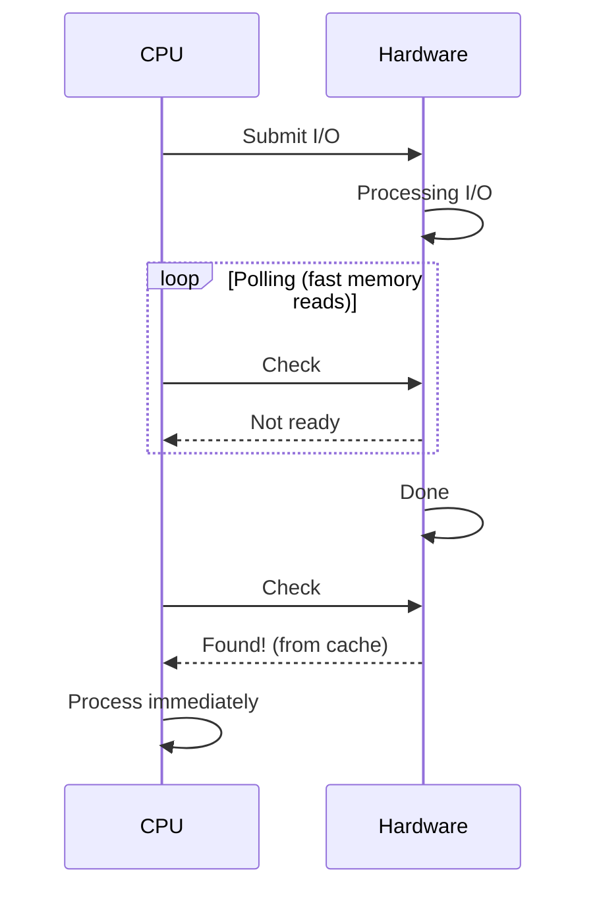
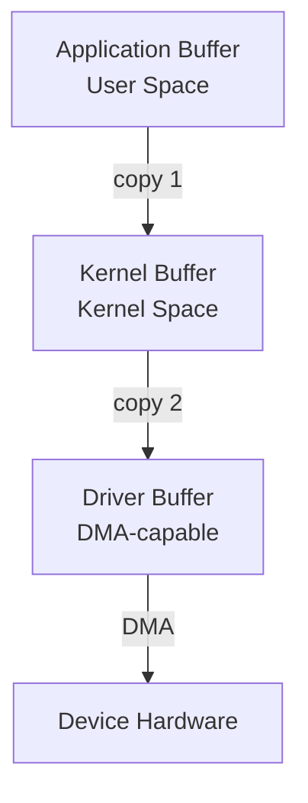
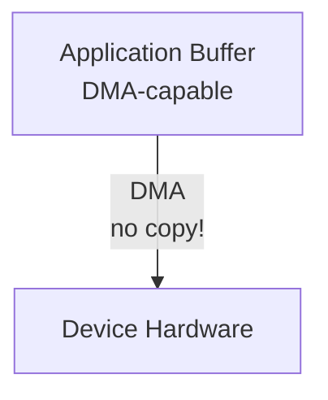
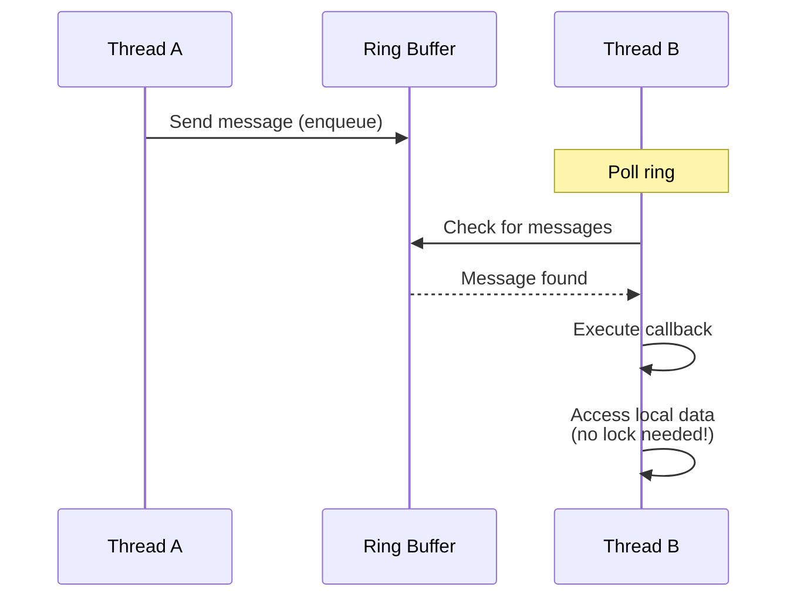

# Module 02: Core Principles

**Stage**: 1 (Foundation)
**Difficulty**: Beginner
**Estimated Time**: 2 hours
**Prerequisites**: Module 01

**Version History**:
- v1.0 (2026-01-30): Initial version

---

## Learning Objectives

By the end of this module, you will be able to:
- Explain SPDK's five core architectural principles
- Understand the userspace driver model in detail
- Describe polled mode operation and its implications
- Explain zero-copy data movement techniques
- Understand lock-free data structures and message passing
- Recognize how these principles work together

---

## Overview

SPDK is built on five fundamental architectural principles that work together to achieve maximum performance. These principles aren't just optimizations - they represent a fundamentally different approach to building storage software.

Understanding these principles deeply is crucial because they influence every decision you'll make when building SPDK applications. They explain why SPDK's APIs look the way they do, why certain patterns are recommended, and what trade-offs you're making.

### Why This Matters

These principles form the mental model you need to think like an SPDK developer. Without understanding them, SPDK code will seem arbitrary or confusing. With this foundation, design decisions become obvious and natural.

---

## Core Concepts

### Principle 1: Userspace Drivers

**Definition**: Move device drivers out of the kernel and into application address space.

#### Technical Deep Dive

**Kernel Driver Architecture**:


**SPDK Userspace Architecture**:


**Key Mechanisms**:

1. **Device Unbinding**
   ```bash
   # Remove kernel control
   echo "0000:04:00.0" > /sys/bus/pci/drivers/nvme/unbind

   # Give to userspace framework
   echo "0000:04:00.0" > /sys/bus/pci/drivers/vfio-pci/bind
   ```

2. **Memory-Mapped I/O (MMIO)**
   ```c
   // Map device registers into process memory
   void *bar = mmap(NULL, size, PROT_READ | PROT_WRITE,
                    MAP_SHARED, fd, offset);

   // Direct hardware access - no kernel!
   *(volatile uint32_t *)(bar + DOORBELL_REGISTER) = value;
   ```

3. **Direct Memory Access (DMA)**
   - Application allocates DMA-safe memory
   - Programs device with physical addresses
   - Device transfers data directly
   - No kernel buffer copying

**Advantages**:
- ✅ No system call overhead
- ✅ No context switches
- ✅ Application-specific optimization
- ✅ Fast iteration and debugging
- ✅ Reduced software layers

**Requirements**:
- ⚠️ Root privileges (or capability-based access)
- ⚠️ Exclusive device control
- ⚠️ Memory must be pinned and DMA-safe

---

### Principle 2: Polled Mode Operation

**Definition**: Continuously check for I/O completions instead of waiting for interrupts.

#### How Polling Works

**Traditional Interrupt-Driven Model**:


**SPDK Polled Model**:


**Implementation Pattern**:
```c
// Traditional interrupt-driven
int fd = open("/dev/nvme0n1", O_RDWR);
read(fd, buffer, size);  // Blocks, wakes on interrupt

// SPDK polled mode
void process_completions(void *ctx) {
    struct spdk_nvme_qpair *qpair = ctx;

    // Check for completions (polls hardware queue)
    spdk_nvme_qpair_process_completions(qpair, 0);

    // This function returns immediately
    // Completions trigger callbacks
}

// Called repeatedly in event loop
while (running) {
    process_completions(qpair);
    // Do other work
}
```

**Why Polling is Fast**:

1. **Cache Benefits**
   ```
   CPU Cache Hierarchy:
   L1 Cache (4 cycles) ← Completion queue likely here
   L2 Cache (12 cycles)
   L3 Cache (30-40 cycles)
   Main Memory (100+ cycles)
   ```
   - Intel DDIO keeps NIC/SSD updates in L3 cache
   - Polling reads from cache, not main memory
   - Much faster than interrupt path

2. **No Interrupt Overhead**
   ```
   Interrupt Cost:
   - Save CPU state: ~100 cycles
   - Jump to handler: ~50 cycles
   - Execute handler: ~500 cycles
   - Restore state: ~100 cycles
   - Resume context: ~200 cycles
   ────────────────────────────────
   Total: ~950 cycles (~0.3 μs)

   Polling Cost:
   - Read memory: 4-30 cycles (<0.01 μs)
   ```

3. **Predictable Latency**
   - No interrupt jitter
   - No scheduler interference
   - Consistent performance

**Trade-offs**:

✅ **Benefits**:
- Ultra-low latency
- No interrupt overhead
- Predictable performance
- Better cache locality

⚠️ **Costs**:
- 100% CPU utilization on polling cores
- Must dedicate CPU cores
- Poor efficiency at low load
- Increased power consumption

**When to Poll**:
- High throughput workloads (>100K IOPS)
- Low latency requirements (<50 μs)
- Predictable workloads
- Dedicated hardware available

---

### Principle 3: Zero-Copy Data Movement

**Definition**: Eliminate unnecessary data copies between buffers.

#### Traditional Multi-Copy Path

**Kernel I/O Stack**:


**Cost**: 2 memory copies × data size

**Example**:
```c
// Traditional read: 2 copies!
char app_buffer[4096];
read(fd, app_buffer, 4096);

// What actually happens:
// 1. Device DMAs to kernel buffer
// 2. Kernel copies to app_buffer
```

#### SPDK Zero-Copy Path



**Cost**: 0 memory copies

**Implementation**:
```c
// Allocate DMA-capable memory
void *buffer = spdk_dma_malloc(4096, 64, NULL);

// Direct DMA to/from this buffer
spdk_nvme_ns_cmd_read(ns, qpair, buffer, lba, 1,
                      read_complete, NULL, 0);

// Device DMAs directly to buffer
// No kernel, no copies!
```

**Technical Requirements**:

1. **Physical Memory Contiguity**
   ```mermaid
   graph TD
       subgraph "Virtual Address Space (may be scattered)"
           V1[Page 1]
           V2[Page 2]
           V3[Page 3]
       end
       subgraph "Physical Memory (must be contiguous for DMA)"
           P1[Page 1] --> P2[Page 2] --> P3[Page 3]
       end
       V1 -.->|maps to| P1
       V2 -.->|maps to| P2
       V3 -.->|maps to| P3
   ```

2. **Memory Alignment**
   ```c
   // Must be aligned for optimal DMA
   // Typically 64-byte alignment
   void *buffer = spdk_dma_malloc(
       size,      // Size
       64,        // Alignment
       NULL       // Socket ID
   );
   ```

3. **Memory Pinning**
   - Pages must not be swapped
   - Physical address must remain stable
   - Achieved via hugepages

**Benefits**:
- ✅ 2x reduction in memory bandwidth usage
- ✅ Better cache utilization
- ✅ Lower latency
- ✅ Reduced CPU usage

---

### Principle 4: Lock-Free Data Structures

**Definition**: Avoid locks by using message passing and per-thread resources.

#### The Lock Problem

**Traditional Multi-Threaded Approach**:
```c
// Shared resource with lock
pthread_mutex_t lock = PTHREAD_MUTEX_INITIALIZER;
struct queue *shared_queue;

void thread_work(void) {
    pthread_mutex_lock(&lock);     // Contention!
    process_queue(shared_queue);
    pthread_mutex_unlock(&lock);
}
```

**Problems**:
- Lock contention at scale
- Cache line bouncing
- Unpredictable latency
- Reduced parallelism

**Lock Contention Cost**:
```
1 thread:  100% efficiency
2 threads:  95% efficiency (5% lock overhead)
4 threads:  85% efficiency (15% lock overhead)
8 threads:  60% efficiency (40% lock overhead)
16 threads: 30% efficiency (70% lock overhead!)
```

#### SPDK's Lock-Free Approach

**Pattern 1: Per-Thread Resources**
```c
// Each thread gets its own queue pair
struct spdk_nvme_qpair *qpairs[NUM_THREADS];

void thread_init(int thread_id) {
    // Allocate dedicated queue pair
    qpairs[thread_id] = spdk_nvme_ctrlr_alloc_io_qpair(
        ctrlr, NULL, 0);
}

void thread_work(int thread_id) {
    // No lock needed - exclusive access!
    spdk_nvme_qpair_process_completions(
        qpairs[thread_id], 0);
}
```

**Pattern 2: Message Passing**
```c
// Thread wants to access another thread's data
// Instead of locking, send a message

void thread_a_wants_data(void) {
    // Send message to thread B
    spdk_thread_send_msg(thread_b,
                        do_work_on_thread_b,
                        context);
}

void do_work_on_thread_b(void *ctx) {
    // Executes on thread B
    // Can safely access thread B's data
    // No locks needed!
}
```

**Message Passing Implementation**:


**Lock-Free Ring Buffer**:
```c
// DPDK ring - multiple producer, multiple consumer
struct rte_ring *ring;

// Producer (thread A)
rte_ring_enqueue(ring, message);

// Consumer (thread B)
rte_ring_dequeue(ring, &message);

// Uses atomic operations, no locks!
```

**Benefits**:
- ✅ Linear scalability
- ✅ Predictable latency
- ✅ No lock contention
- ✅ Better cache locality

---

### Principle 5: Run-to-Completion

**Definition**: Operations run to completion without blocking or yielding.

#### Traditional Blocking Model

```c
// Traditional blocking I/O
void process_request(struct request *req) {
    // Blocks thread until complete
    data = read_from_disk(req->offset, req->size);

    // Blocks again
    result = process_data(data);

    // Blocks once more
    write_to_network(result);
}
// Thread is blocked most of the time!
```

#### SPDK Run-to-Completion Model

```c
// All operations are asynchronous
void process_request(struct request *req) {
    // Initiate read, returns immediately
    spdk_bdev_read(bdev, channel, buffer, offset, size,
                   read_complete_callback, req);
    // Thread continues processing other work
}

void read_complete_callback(void *arg, int status) {
    struct request *req = arg;

    // Process data
    result = process_data(req->buffer);

    // Initiate write, returns immediately
    write_to_network(result, write_complete_callback, req);
    // Callback completes, thread continues
}

void write_complete_callback(void *arg, int status) {
    // Request fully processed
    complete_request(arg);
}
```

**Characteristics**:

1. **Non-Blocking**
   - No sleep, wait, or block calls
   - All operations return immediately
   - Callbacks invoked on completion

2. **State Machines**
   ```
   Request Flow:
   [Submit] → [Read CB] → [Process CB] → [Write CB] → [Done]
      ↓          ↓            ↓             ↓
   (continue) (continue)  (continue)   (continue)

   Thread never blocks!
   ```

3. **Cooperative Multitasking**
   - Thread decides when to yield
   - No preemption
   - Deterministic scheduling

**Benefits**:
- ✅ Maximum CPU utilization
- ✅ No context switch overhead
- ✅ Predictable latency
- ✅ Simple thread model

**Implications**:
- ⚠️ Cannot use blocking system calls
- ⚠️ Cannot use standard I/O libraries
- ⚠️ Must use async patterns everywhere
- ⚠️ Callbacks can be complex

---

## How Principles Work Together

### The Complete Picture

```
┌─────────────────────────────────────────────┐
│         SPDK Application                    │
│                                             │
│  ┌───────────────────────────────────┐    │
│  │  Run-to-Completion Event Loop     │    │
│  │                                    │    │
│  │  while (running) {                │    │
│  │    // Principle 2: Polling        │    │
│  │    poll_completions();            │    │
│  │                                    │    │
│  │    // Principle 4: Message Pass   │    │
│  │    process_messages();            │    │
│  │                                    │    │
│  │    // Process async callbacks     │    │
│  │    execute_callbacks();           │    │
│  │  }                                │    │
│  └───────────────────────────────────┘    │
│                                             │
│  ┌───────────────────────────────────┐    │
│  │  Userspace NVMe Driver (Principle 1)│  │
│  │  - Direct MMIO access              │   │
│  │  - No system calls                 │   │
│  └───────────────────────────────────┘    │
│                                             │
│  ┌───────────────────────────────────┐    │
│  │  DMA Buffers (Principle 3)        │    │
│  │  - Zero-copy data path             │   │
│  │  - Pinned memory                   │   │
│  └───────────────────────────────────┘    │
└─────────────────────────────────────────────┘
         │
         │ Direct hardware access
         ↓
┌─────────────────────────────────────────────┐
│         NVMe Device                         │
└─────────────────────────────────────────────┘
```

### Synergy Example

**Scenario**: Read 4KB from NVMe SSD

```c
// 1. Allocate zero-copy buffer (Principle 3)
void *buffer = spdk_dma_malloc(4096, 64, NULL);

// 2. Submit to userspace driver (Principle 1)
// Non-blocking, returns immediately (Principle 5)
spdk_nvme_ns_cmd_read(ns, qpair, buffer, lba, 1,
                      read_complete, ctx, 0);

// 3. Thread continues in event loop (Principle 5)
while (!done) {
    // 4. Poll for completion (Principle 2)
    spdk_nvme_qpair_process_completions(qpair, 0);

    // 5. Process messages (Principle 4)
    spdk_thread_poll(thread);
}

// 6. Callback invoked when complete
void read_complete(void *ctx, const struct spdk_nvme_cpl *cpl) {
    // Data already in buffer (zero-copy)
    // No context switch, no locks
    process_data(ctx);
}
```

**Result**:
- 0 context switches
- 0 locks acquired
- 0 memory copies
- ~10 μs total latency

---

## Practical Examples

### Example 1: Message Passing Pattern

```c
struct my_context {
    struct spdk_thread *owner_thread;
    int data;
};

// Thread A wants to modify thread B's data
void thread_a_operation(struct my_context *ctx) {
    // Don't access ctx->data directly!
    // Send message to owner thread

    spdk_thread_send_msg(ctx->owner_thread,
                        modify_data_on_owner_thread,
                        ctx);
}

// Executes on thread B (owner)
void modify_data_on_owner_thread(void *arg) {
    struct my_context *ctx = arg;

    // Safe to access - we're on owner thread
    ctx->data += 10;

    // No locks needed!
}
```

---

## Common Patterns

### Pattern 1: Async Callback Chains

```c
// Bottom-up reading (recommended in SPDK)

void final_callback(void *ctx) {
    // All operations complete
    send_response_to_client(ctx);
}

void write_callback(void *ctx, int status) {
    if (status == 0) {
        // Write succeeded, now sync
        spdk_bdev_flush(bdev, channel,
                       final_callback, ctx);
    }
}

void read_callback(void *ctx, int status) {
    if (status == 0) {
        // Read succeeded, now write
        spdk_bdev_write(bdev, channel, buffer,
                       offset, size,
                       write_callback, ctx);
    }
}

// Initiator
void start_operation(void *ctx) {
    spdk_bdev_read(bdev, channel, buffer,
                   offset, size,
                   read_callback, ctx);
}
```

---

## Gotchas and Best Practices

### Common Mistakes

1. **Mistake**: Calling blocking functions in SPDK threads
   ```c
   // WRONG!
   void spdk_callback(void *ctx) {
       sleep(1);  // Blocks entire reactor!
       read(fd, buf, size);  // Blocks!
   }
   ```
   **Correct**: Use async operations only
   ```c
   void spdk_callback(void *ctx) {
       // Use SPDK's async file I/O or timer
       spdk_poller_register(delayed_work, ctx, 1000000);
   }
   ```

2. **Mistake**: Sharing data between threads without messages
   ```c
   // WRONG!
   shared_counter++;  // Race condition!
   ```
   **Correct**: Use message passing
   ```c
   spdk_thread_send_msg(owner_thread, increment_counter, ctx);
   ```

3. **Mistake**: Using regular malloc for I/O buffers
   ```c
   // WRONG!
   void *buffer = malloc(4096);
   spdk_bdev_read(bdev, channel, buffer, ...);  // DMA unsafe!
   ```
   **Correct**: Use spdk_dma_malloc
   ```c
   void *buffer = spdk_dma_malloc(4096, 64, NULL);
   ```

### Best Practices

1. **Principle**: One resource, one owner
   **Application**: Assign each queue pair to exactly one thread

2. **Principle**: Small messages, not large data
   **Application**: Pass pointers and contexts, not data

3. **Principle**: Poll efficiently
   **Application**: Batch operations, don't poll after every submit

---

## Knowledge Check

1. **Why does SPDK use polling instead of interrupts?**
   - Consider both performance and latency aspects

2. **What are the three requirements for zero-copy I/O?**
   - Think about memory properties needed for DMA

3. **How does message passing avoid locks?**
   - Consider data ownership and execution context

4. **What's the trade-off of run-to-completion?**
   - Think about programming complexity vs performance

5. **Why can't you use standard library I/O in SPDK?**
   - Consider the blocking nature of system calls

---

## Additional Resources

- **SPDK Source**:
  - `lib/thread/thread.c` - Threading implementation
  - `lib/nvme/nvme_qpair.c` - Polling implementation
- **Official Docs**:
  - [Concurrency Model](../../doc/concurrency.md)
  - [Memory Management](../../doc/memory.md)
- **Related Modules**:
  - Previous: [01-S1-Why-SPDK-Exists.md](./01-S1-Why-SPDK-Exists.md)
  - Next: [03-S1-Architecture-Overview.md](./03-S1-Architecture-Overview.md)

---

## Summary

SPDK's five core principles form an integrated architecture:

1. **Userspace Drivers**: Eliminate kernel overhead
2. **Polled Mode**: Remove interrupt latency
3. **Zero-Copy**: Eliminate data movement
4. **Lock-Free**: Enable linear scaling
5. **Run-to-Completion**: Maximize CPU efficiency

**Key Insight**: These principles aren't independent optimizations - they reinforce each other. Userspace enables polling, polling enables zero-copy, lock-free enables run-to-completion, and everything works together for maximum performance.

**The Trade-off**: Higher performance and efficiency at the cost of:
- Dedicated CPU cores
- Different programming model
- Exclusive device access
- More complex application logic

Understanding these principles is essential for everything that follows. Every SPDK API, every design pattern, and every best practice stems from these five foundations.

**Next Module**: [03-S1-Architecture-Overview.md](./03-S1-Architecture-Overview.md) - See how these principles shape SPDK's architecture

---

*End of Module 02*
