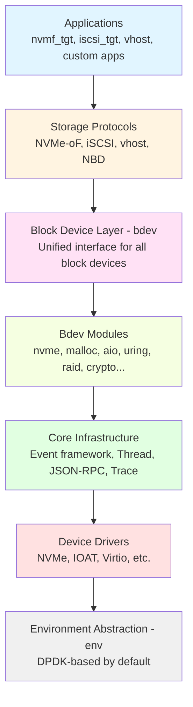
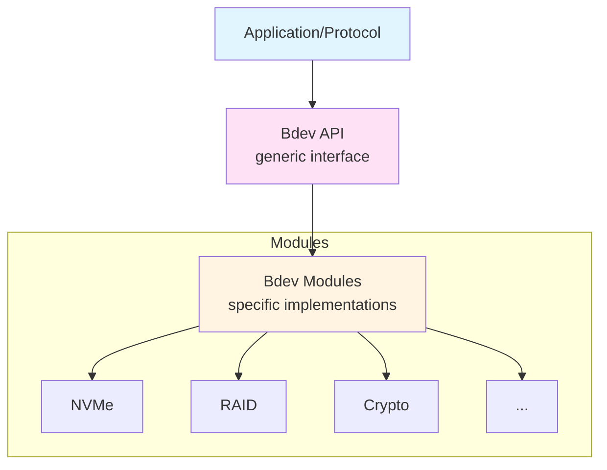
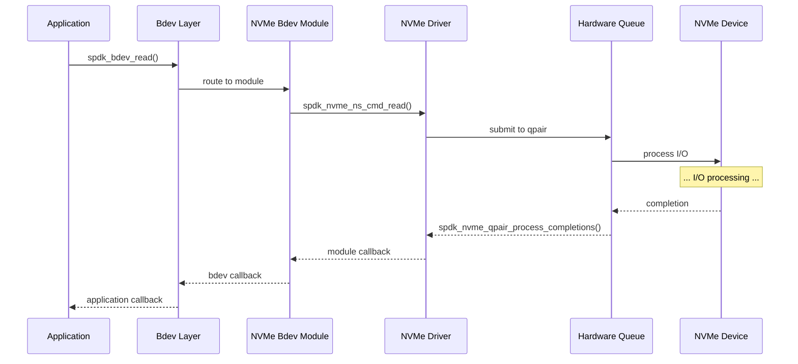

# Module 03: Architecture Overview

**Stage**: 1 (Foundation)
**Difficulty**: Beginner
**Estimated Time**: 3 hours
**Prerequisites**: Module 01, Module 02

**Version History**:
- v1.0 (2026-01-30): Initial version

---

## Learning Objectives

By the end of this module, you will be able to:
- Navigate the SPDK codebase structure
- Understand the layered architecture
- Identify the role of each major component
- Explain how components interact
- Map SPDK libraries to their functions
- Understand the module system

---

## Overview

SPDK's architecture is carefully layered, with clear separation of concerns and well-defined interfaces between components. Understanding this architecture is essential for navigating the codebase, building applications, and contributing effectively.

### Why This Matters

SPDK contains ~200,000 lines of C code across dozens of libraries and modules. Without understanding the architecture, you'll be lost in the codebase. With this mental map, you'll know exactly where to find what you need and how components fit together.

---

## Core Concepts

### Concept 1: Layered Architecture

SPDK follows a clean layered design:



**Key Characteristics**:
- Each layer depends only on layers below
- Clean interfaces between layers
- Can replace components at each layer
- Modular and extensible

---

### Concept 2: Directory Structure

**Top-Level Organization**:

```
spdk/
├── lib/              ← Core libraries
├── module/           ← Pluggable modules
├── app/              ← Complete applications
├── include/          ← Public API headers
├── examples/         ← Reference code
├── scripts/          ← Utilities
├── test/             ← Test suite
├── doc/              ← Documentation
└── dpdk/             ← DPDK submodule
```

**Key Principle**: `lib/` contains core functionality, `module/` contains pluggable extensions

---

### Concept 3: Library Organization

**Core Libraries** (`lib/` directory):

| Library | Purpose | Public Header |
|---------|---------|---------------|
| `nvme` | NVMe driver | `spdk/nvme.h` |
| `bdev` | Block device abstraction | `spdk/bdev.h` |
| `nvmf` | NVMe-oF target library | `spdk/nvmf.h` |
| `iscsi` | iSCSI target library | `spdk/iscsi.h` |
| `vhost` | Vhost target library | `spdk/vhost.h` |
| `event` | Application framework | `spdk/event.h` |
| `thread` | Threading abstraction | `spdk/thread.h` |
| `json` | JSON parser | `spdk/json.h` |
| `jsonrpc` | JSON-RPC server | `spdk/jsonrpc.h` |
| `util` | Utility functions | `spdk/util.h` |
| `log` | Logging subsystem | `spdk/log.h` |
| `trace` | Tracing framework | `spdk/trace.h` |

**Each library**:
- Self-contained functionality
- Clear public API in `include/spdk/`
- Internal headers in `lib/[name]/`
- Compiles to `libspdk_[name].a`

---

### Concept 4: Module System

**Pluggable Modules** (`module/` directory):

```
module/
├── bdev/              ← Block device modules
│   ├── nvme/         ← NVMe bdev
│   ├── malloc/       ← RAM disk
│   ├── aio/          ← Linux AIO
│   ├── uring/        ← io_uring
│   ├── raid/         ← Software RAID
│   ├── crypto/       ← Encryption
│   ├── compress/     ← Compression
│   └── ...
├── accel/             ← Acceleration modules
└── scheduler/         ← Thread schedulers
```

**Module Characteristics**:
- Pluggable at runtime
- Register with core frameworks
- Follow module interface contracts
- Can be built separately

---

## Architecture Deep Dive

### Layer 1: Environment Abstraction (env)

**Purpose**: Abstract OS and hardware specifics

**Location**: `lib/env_dpdk/`

**Responsibilities**:
- Memory allocation (hugepages)
- PCI device enumeration
- Thread creation and affinity
- Memory barriers and atomics
- DMA memory management

**Key APIs**:
```c
// Memory
void *spdk_dma_malloc(size_t size, size_t align, uint64_t *phys_addr);
void spdk_dma_free(void *buf);

// PCI
int spdk_pci_enumerate(struct spdk_pci_driver *driver,
                      spdk_pci_enum_cb enum_cb, void *ctx);

// Threads
uint32_t spdk_env_get_current_core(void);
```

**DPDK Integration**:
```
SPDK env layer
      ↓
  DPDK EAL (Environment Abstraction Layer)
      ↓
  Operating System
```

---

### Layer 2: Device Drivers

#### NVMe Driver (`lib/nvme/`)

**Purpose**: Userspace NVMe driver

**Key Components**:
```c
// Controller management
struct spdk_nvme_ctrlr;
struct spdk_nvme_ns;  // Namespace

// Queue pairs
struct spdk_nvme_qpair;

// Commands
int spdk_nvme_ns_cmd_read(struct spdk_nvme_ns *ns,
                         struct spdk_nvme_qpair *qpair,
                         void *buffer, uint64_t lba,
                         uint32_t lba_count,
                         spdk_nvme_cmd_cb cb, void *ctx,
                         uint32_t flags);
```

**Architecture**:
```
Application
    ↓
NVMe Driver API (spdk_nvme_*)
    ↓
Queue Pair Management
    ↓
NVMe Command Submission
    ↓
Hardware Completion Polling
```

#### Other Drivers

| Driver | Location | Purpose |
|--------|----------|---------|
| IOAT | `lib/ioat/` | DMA engine for copy |
| Virtio | `lib/virtio/` | Virtio devices |
| VMD | `lib/vmd/` | Intel Volume Management |

---

### Layer 3: Core Infrastructure

#### Thread Abstraction (`lib/thread/`)

**Purpose**: Lightweight threading model

**Key Abstractions**:
```c
// Threads
struct spdk_thread;
struct spdk_thread *spdk_thread_create(const char *name, ...);
void spdk_thread_poll(struct spdk_thread *thread);

// Pollers
struct spdk_poller;
struct spdk_poller *spdk_poller_register(spdk_poller_fn fn,
                                         void *arg,
                                         uint64_t period_us);

// Messages
void spdk_thread_send_msg(const struct spdk_thread *thread,
                         spdk_msg_fn fn, void *ctx);

// I/O Channels
struct spdk_io_channel;
struct spdk_io_channel *spdk_get_io_channel(void *io_device);
```

**Threading Model**:
```
SPDK Thread (lightweight, no stack)
    ↓
Runs on system thread (pthread)
    ↓
Pinned to CPU core
    ↓
Polls for work (pollers + messages)
```

#### Event Framework (`lib/event/`)

**Purpose**: Application lifecycle management

**Key Components**:
```c
// Application structure
struct spdk_app_opts {
    const char *name;
    const char *json_config_file;
    const char *rpc_addr;
    int shutdown_cb;
    // ...
};

// Application entry
int spdk_app_start(struct spdk_app_opts *opts,
                  spdk_app_start_cb start_cb,
                  void *ctx);

// Shutdown
void spdk_app_stop(int rc);
```

**Application Flow**:
```
main()
    ↓
spdk_app_start()
    ↓
Initialize subsystems
    ↓
Start RPC server
    ↓
Call start_cb (application code)
    ↓
Event loop (reactors poll)
    ↓
spdk_app_stop()
    ↓
Cleanup and exit
```

#### JSON-RPC (`lib/jsonrpc/`)

**Purpose**: Remote configuration and management

**Key Features**:
- JSON-based RPC protocol
- HTTP transport
- Method registration
- Async request handling

```c
// Register RPC method
SPDK_RPC_REGISTER("bdev_get_bdevs", rpc_bdev_get_bdevs,
                 SPDK_RPC_RUNTIME);

// RPC handler
static void rpc_bdev_get_bdevs(struct spdk_jsonrpc_request *request,
                               const struct spdk_json_val *params) {
    // Process request
    // Return JSON response
    spdk_jsonrpc_send_response(request, w);
}
```

---

### Layer 4: Block Device Layer (bdev)

**Purpose**: Unified block device interface

**Location**: `lib/bdev/`

**Key Abstraction**:
```c
// Block device
struct spdk_bdev;

// I/O channel (per-thread)
struct spdk_bdev_io_channel;

// Device descriptor
struct spdk_bdev_desc;

// I/O operations
int spdk_bdev_read(struct spdk_bdev_desc *desc,
                  struct spdk_io_channel *ch,
                  void *buf, uint64_t offset, uint64_t nbytes,
                  spdk_bdev_io_completion_cb cb, void *cb_arg);
```

**Bdev Architecture**:


**Benefits**:
- ✅ Uniform interface for all storage
- ✅ Modules can stack (RAID over crypto over NVMe)
- ✅ Easy to add new backend types
- ✅ Transparent to upper layers

---

### Layer 5: Bdev Modules

**Common Bdev Modules**:

| Module | Purpose | Location |
|--------|---------|----------|
| `nvme` | NVMe devices | `module/bdev/nvme/` |
| `malloc` | RAM disk | `module/bdev/malloc/` |
| `aio` | Linux AIO | `module/bdev/aio/` |
| `uring` | io_uring | `module/bdev/uring/` |
| `null` | Null device | `module/bdev/null/` |
| `raid` | Software RAID | `module/bdev/raid/` |
| `crypto` | Encryption | `module/bdev/crypto/` |
| `compress` | Compression | `module/bdev/compress/` |
| `lvol` | Logical volumes | `lib/lvol/` |
| `passthru` | Filter example | `module/bdev/passthru/` |

**Module Interface**:
```c
// Every bdev module implements:
struct spdk_bdev_module {
    const char *name;

    // Lifecycle
    int (*module_init)(void);
    void (*module_fini)(void);

    // Configuration
    int (*get_ctx_size)(void);

    // I/O path
    void (*submit_request)(struct spdk_io_channel *ch,
                          struct spdk_bdev_io *bdev_io);
};

// Register module
SPDK_BDEV_MODULE_REGISTER(name, &module_ops)
```

---

### Layer 6: Storage Protocols

#### NVMe-oF Target (`lib/nvmf/`)

**Purpose**: Export bdevs over NVMe-oF

**Architecture**:
```
┌─────────────────────────────────────┐
│         NVMe-oF Initiators          │
└──────────────┬──────────────────────┘
               ↓ (RDMA/TCP)
┌─────────────────────────────────────┐
│        NVMe-oF Target (tgt)         │
│  ┌─────────────────────────────┐   │
│  │   Subsystem Management      │   │
│  └─────────────────────────────┘   │
│  ┌─────────────────────────────┐   │
│  │   Transport (RDMA/TCP)      │   │
│  └─────────────────────────────┘   │
└──────────────┬──────────────────────┘
               ↓
┌─────────────────────────────────────┐
│          Bdev Layer                 │
└─────────────────────────────────────┘
```

**Key Concepts**:
- **Subsystem**: Collection of namespaces
- **Transport**: RDMA, TCP, or VFIO
- **Controller**: Per-initiator connection

#### iSCSI Target (`lib/iscsi/`)

**Purpose**: Export bdevs over iSCSI

**Components**:
- Portal groups (network listeners)
- Target nodes (storage targets)
- Logical units (LUNs)
- Connection management

#### Vhost Target (`lib/vhost/`)

**Purpose**: Export bdevs to VMs via vhost

**Types**:
- vhost-blk: Block device
- vhost-scsi: SCSI device
- vhost-user protocol

---

### Layer 7: Applications

**Pre-built Applications** (`app/` directory):

| Application | Purpose | Binary |
|-------------|---------|--------|
| nvmf_tgt | NVMe-oF target | `spdk_tgt` |
| iscsi_tgt | iSCSI target | `iscsi_tgt` |
| vhost | Vhost target | `vhost` |
| spdk_nvme_perf | NVMe benchmark | `spdk_nvme_perf` |
| spdk_nvme_identify | Device info | `spdk_nvme_identify` |

**Application Structure**:
```c
// Typical SPDK application
int main(int argc, char **argv) {
    struct spdk_app_opts opts = {};

    // Initialize options
    spdk_app_opts_init(&opts, sizeof(opts));
    opts.name = "my_app";
    opts.json_config_file = "config.json";

    // Start application
    rc = spdk_app_start(&opts, my_app_start, NULL);

    spdk_app_fini();
    return rc;
}

void my_app_start(void *ctx) {
    // Application initialization

    // Register shutdown callback
    spdk_subsystem_init(subsystem_init_complete, NULL);
}
```

---

## Component Interaction

### Example: Read I/O Flow



**Key Points**:
- Async at every layer
- No blocking calls
- Callbacks chain back up
- Zero-copy throughout

---

## Practical Examples

### Example 1: Finding Code

**Question**: Where is NVMe command submission implemented?

**Answer**:
1. NVMe driver is in `lib/nvme/`
2. Command submission is in `lib/nvme/nvme_qpair.c`
3. Function: `nvme_qpair_submit_request()`

**Question**: Where are bdev modules registered?

**Answer**:
1. Bdev modules in `module/bdev/`
2. Each module has `bdev_[name].c`
3. Registration macro: `SPDK_BDEV_MODULE_REGISTER()`

---

## Common Patterns

### Pattern 1: Module Registration

```c
// Every module follows this pattern

// Define module operations
static struct spdk_bdev_module my_module = {
    .name = "my_bdev",
    .module_init = my_module_init,
    .module_fini = my_module_fini,
    .submit_request = my_submit_request,
};

// Register at compile time
SPDK_BDEV_MODULE_REGISTER(my_bdev, &my_module)

// Functions called by framework
static int my_module_init(void) {
    // Initialize module
    return 0;
}

static void my_module_fini(void) {
    // Cleanup module
}

static void my_submit_request(struct spdk_io_channel *ch,
                              struct spdk_bdev_io *bdev_io) {
    // Handle I/O request
}
```

---

## Gotchas and Best Practices

### Common Mistakes

1. **Mistake**: Confusing `lib/` and `module/`
   **Why It's Wrong**: Different purposes and build systems
   **Correct Approach**: Core functionality → `lib/`, plugins → `module/`

2. **Mistake**: Calling driver APIs directly instead of bdev layer
   **Why It's Wrong**: Bypasses abstraction benefits
   **Correct Approach**: Use bdev APIs for portability

3. **Mistake**: Not understanding header organization
   **Why It's Wrong**: May use internal APIs incorrectly
   **Correct Approach**: Only use `include/spdk/*.h` public APIs

### Best Practices

1. **Practice**: Follow existing patterns
   **Rationale**: Consistency makes code maintainable

2. **Practice**: Use appropriate abstraction layer
   **Rationale**: Don't re-invent what exists

3. **Practice**: Check examples before writing from scratch
   **Rationale**: Learn from working code

---

## Knowledge Check

1. **What's the difference between `lib/` and `module/`?**

2. **Which layer provides OS abstraction?**

3. **How does a bdev module register itself?**

4. **What's the purpose of the event framework?**

5. **Where would you look for NVMe-oF transport code?**

---

## Additional Resources

- **SPDK Source**:
  - `doc/overview.md` - Official architecture doc
  - `lib/` - Core libraries
  - `module/` - Pluggable modules
- **Related Modules**:
  - Previous: [02-S1-Core-Principles.md](./02-S1-Core-Principles.md)
  - Next: [04-S1-Threading-Model.md](./04-S1-Threading-Model.md)

---

## Summary

SPDK's architecture is carefully layered for modularity and performance:

**Seven Layers**:
1. Environment (DPDK integration)
2. Drivers (NVMe, IOAT, etc.)
3. Infrastructure (Thread, Event, RPC)
4. Bdev Layer (Unified interface)
5. Bdev Modules (NVMe, RAID, Crypto, etc.)
6. Protocols (NVMe-oF, iSCSI, vhost)
7. Applications (Targets, tools)

**Key Directories**:
- `lib/` - Core libraries
- `module/` - Pluggable modules
- `app/` - Applications
- `include/spdk/` - Public APIs

**Architecture Benefits**:
- Clear separation of concerns
- Modular and extensible
- Clean interfaces
- Easy to navigate

Understanding this architecture is your roadmap to SPDK. You now know where to find things and how components relate.

**Next Module**: [04-S1-Threading-Model.md](./04-S1-Threading-Model.md) - Deep dive into SPDK's threading

---

*End of Module 03*
