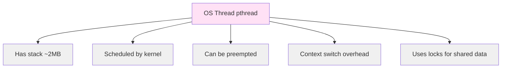
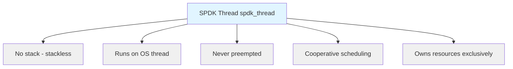
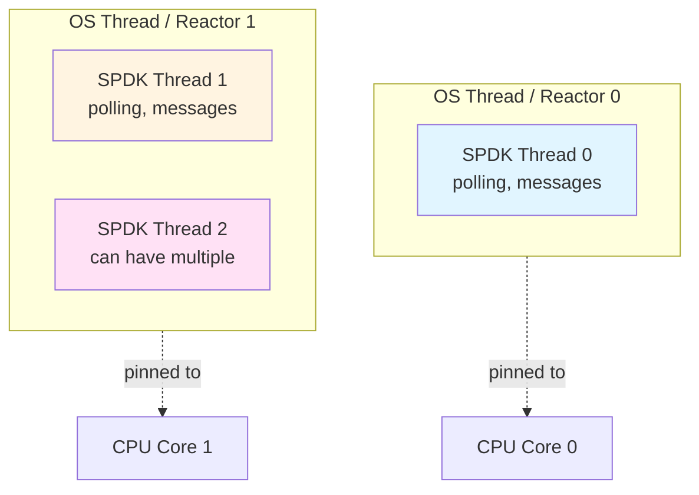
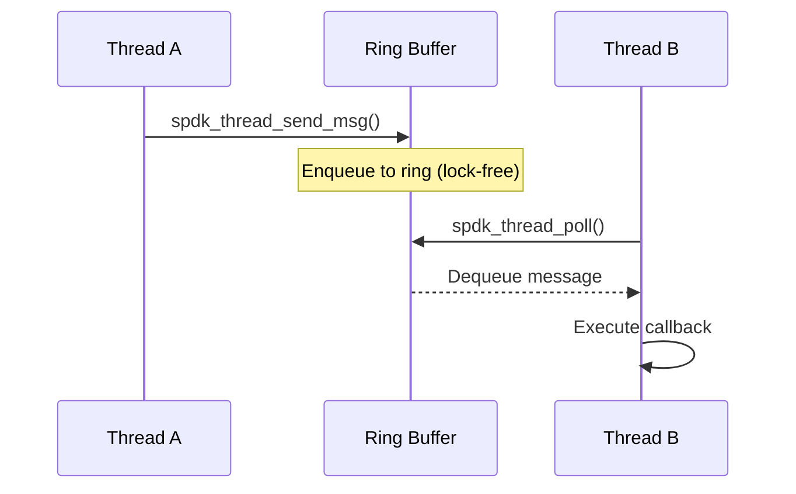
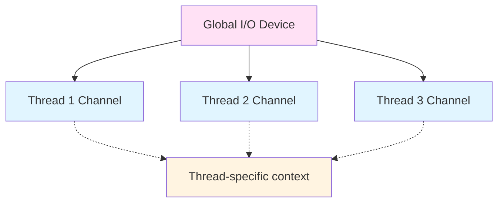

# Module 04: Threading Model

**Stage**: 1 (Foundation)
**Difficulty**: Beginner
**Estimated Time**: 3 hours
**Prerequisites**: Module 01, Module 02, Module 03

**Version History**:
- v1.0 (2026-01-30): Initial version

---

## Learning Objectives

By the end of this module, you will be able to:
- Distinguish between SPDK threads and OS threads
- Understand the reactor pattern
- Explain pollers and their use cases
- Describe message passing between threads
- Understand I/O channels and devices
- Recognize thread lifecycle management

---

## Overview

SPDK's threading model is fundamentally different from traditional multi-threaded programming. Instead of OS threads with locks, SPDK uses lightweight threads, message passing, and per-thread resources for lock-free operation.

### Why This Matters

The threading model is the foundation of SPDK's lock-free architecture. Misunderstanding it leads to bugs, performance issues, and incorrect API usage. Master this, and everything else falls into place.

---

## Core Concepts

### Concept 1: SPDK Thread vs OS Thread

**Traditional OS Thread**:


**SPDK Thread**:


**Key Differences**:

| Aspect | OS Thread | SPDK Thread |
|--------|-----------|-------------|
| Stack | Yes (~2MB) | No |
| Scheduling | Preemptive | Cooperative |
| Context Switch | Expensive | None |
| Locks | Required | Not needed |
| Movable | No | Yes (between OS threads) |
| Weight | Heavy | Lightweight |

**Architecture**:


---

### Concept 2: Reactors

**Definition**: A reactor is an OS thread that runs SPDK threads.

**Reactor Structure**:
```c
// Simplified reactor concept
struct spdk_reactor {
    uint32_t lcore;                    // CPU core
    struct spdk_thread *thread;        // Current thread
    struct spdk_ring *messages;        // Message queue
    bool in_interrupt;                 // Interrupt mode flag
};
```

**Reactor Event Loop**:
```c
// Pseudo-code of reactor loop
void reactor_run(struct spdk_reactor *reactor) {
    while (!g_shutdown) {
        // Poll all threads on this reactor
        for_each_thread(reactor, thread) {
            spdk_thread_poll(thread);
        }

        // Check for new messages
        process_reactor_messages(reactor);

        // Optional: check for signals, timers, etc.
    }
}
```

**Key Characteristics**:
- One reactor per CPU core
- Pinned to specific core (CPU affinity)
- Runs continuously (100% CPU)
- Polls threads in round-robin
- Processes inter-reactor messages

**Reactor Initialization**:
```c
// Application specifies core mask
struct spdk_app_opts opts = {};
opts.name = "myapp";
opts.reactor_mask = "0xF";  // Use cores 0,1,2,3

spdk_app_start(&opts, app_start, NULL);
```

---

### Concept 3: SPDK Threads

**Thread Abstraction**:
```c
struct spdk_thread {
    char name[256];
    struct spdk_cpuset cpumask;
    struct spdk_thread_stats stats;

    // Message queue
    struct spdk_ring *messages;

    // Pollers
    TAILQ_HEAD(, spdk_poller) active_pollers;
    TAILQ_HEAD(, spdk_poller) paused_pollers;

    // I/O channels
    TAILQ_HEAD(, spdk_io_channel) io_channels;
};
```

**Thread Creation**:
```c
struct spdk_thread *thread;

// Create lightweight thread
thread = spdk_thread_create("my_thread", NULL);

// Thread is created but not running yet
// Must be polled by a reactor
```

**Thread Execution**:
```c
// Reactor calls this repeatedly
int spdk_thread_poll(struct spdk_thread *thread) {
    // 1. Process messages
    process_messages(thread);

    // 2. Run active pollers
    run_pollers(thread);

    // 3. Process timed events
    process_timers(thread);

    return work_done;
}
```

**Thread Destruction**:
```c
// Mark for destruction
spdk_thread_exit(thread);

// Actual destruction happens after cleanup
// (callbacks, channel cleanup, etc.)
spdk_thread_destroy(thread);
```

---

### Concept 4: Pollers

**Definition**: Functions called repeatedly to check for work.

**Poller Types**:

1. **Periodic Pollers** - Called at intervals
2. **Busy Pollers** - Called every iteration (period = 0)
3. **Paused Pollers** - Temporarily disabled

**Poller Structure**:
```c
struct spdk_poller {
    spdk_poller_fn fn;      // Function to call
    void *arg;               // Context
    uint64_t period_ticks;   // 0 = busy poll
    uint64_t next_run_tick;  // Next execution time
};
```

**Creating Pollers**:
```c
// Busy poller (runs every iteration)
struct spdk_poller *poller;
poller = spdk_poller_register(
    my_poll_function,  // Function
    ctx,               // Context
    0                  // 0 = busy poll
);

// Periodic poller (runs every 1ms)
poller = spdk_poller_register(
    periodic_function,
    ctx,
    1000               // 1000 microseconds
);
```

**Poller Function**:
```c
// Poller callback signature
static int my_poll_function(void *ctx) {
    struct my_context *my_ctx = ctx;

    // Do work
    bool found_work = check_for_completions(my_ctx);

    // Return value indicates if work was done
    if (found_work) {
        return SPDK_POLLER_BUSY;  // Keep polling actively
    } else {
        return SPDK_POLLER_IDLE;  // No work found
    }
}
```

**Poller Management**:
```c
// Pause poller temporarily
spdk_poller_pause(poller);

// Resume poller
spdk_poller_resume(poller);

// Unregister (destroy) poller
spdk_poller_unregister(&poller);
```

**Typical Use Cases**:

| Use Case | Poller Type | Period |
|----------|-------------|--------|
| NVMe completion polling | Busy | 0 |
| Timeout checks | Periodic | 1000 μs |
| Periodic statistics | Periodic | 1000000 μs (1s) |
| Background tasks | Periodic | Variable |

---

### Concept 5: Message Passing

**Definition**: Send function calls between threads.

**Message Structure**:
```c
// Message is just a function pointer + context
struct spdk_msg {
    spdk_msg_fn fn;  // Function to call
    void *arg;        // Context pointer
};

typedef void (*spdk_msg_fn)(void *ctx);
```

**Sending Messages**:
```c
// From any thread, send to specific thread
void sender_thread_function(void) {
    spdk_thread_send_msg(
        target_thread,           // Destination thread
        work_on_target_thread,   // Function to run
        ctx                      // Context
    );
    // Returns immediately, doesn't block
}

// Executes on target thread
void work_on_target_thread(void *ctx) {
    // This runs on target thread
    // Safe to access target thread's data
    process_data(ctx);
}
```

**Broadcast Messages**:
```c
// Send to all threads
spdk_for_each_thread(
    execute_on_each_thread,  // Function
    ctx,                     // Context
    completion_cb            // Called when all complete
);

void execute_on_each_thread(void *ctx) {
    // Runs once on each thread
}

void completion_cb(void *ctx) {
    // Called after all threads complete
}
```

**Message Flow**:


**Lock-Free Message Queue**:
- Uses DPDK lockless ring buffer
- Multiple producer, single consumer
- No locks required
- Wait-free enqueue

---

### Concept 6: I/O Channels and Devices

**Purpose**: Per-thread context for I/O devices.

**Concept**:


**I/O Device Registration**:
```c
struct my_device {
    // Global device state
    char name[32];
    uint32_t num_channels;
};

struct my_channel {
    // Per-thread state
    struct my_device *device;
    struct spdk_nvme_qpair *qpair;  // Thread-exclusive
};

// Register device
spdk_io_device_register(
    device,                    // Device pointer (unique ID)
    my_channel_create,         // Channel create callback
    my_channel_destroy,        // Channel destroy callback
    sizeof(struct my_channel), // Channel context size
    "my_device"                // Name
);
```

**Channel Creation Callback**:
```c
static int my_channel_create(void *io_device, void *ctx_buf) {
    struct my_device *device = io_device;
    struct my_channel *ch = ctx_buf;

    // Initialize per-thread resources
    ch->device = device;
    ch->qpair = allocate_qpair_for_this_thread();

    return 0;
}
```

**Getting Channel on Thread**:
```c
// On worker thread
struct spdk_io_channel *ch;
ch = spdk_get_io_channel(device);  // Gets thread-local channel

// Cast to our channel type
struct my_channel *my_ch = spdk_io_channel_get_ctx(ch);

// Use thread-local resources (no locks!)
submit_io(my_ch->qpair, ...);
```

**Channel Cleanup**:
```c
// Release channel (reference counted)
spdk_put_io_channel(ch);

// Device unregistration
spdk_io_device_unregister(device, unregister_cb);
```

**Benefits**:
- Each thread has exclusive channel
- No locking required for I/O
- Automatic lifecycle management
- Clean abstraction

---

## Threading Patterns

### Pattern 1: Thread Creation

```c
void create_worker_threads(void) {
    for (int i = 0; i < num_workers; i++) {
        struct spdk_thread *thread;
        char name[32];

        snprintf(name, sizeof(name), "worker_%d", i);

        // Create thread on this reactor
        thread = spdk_thread_create(name, NULL);

        // Send initial message to thread
        spdk_thread_send_msg(thread,
                            worker_thread_start,
                            ctx);
    }
}

void worker_thread_start(void *ctx) {
    // Initialize thread-local resources
    setup_io_channels();

    // Register pollers
    spdk_poller_register(worker_poll_fn, ctx, 0);
}
```

---

### Pattern 2: Cross-Thread Communication

```c
// Thread A wants data from Thread B
void thread_a_request_data(void) {
    struct request *req = malloc(sizeof(*req));
    req->requesting_thread = spdk_get_thread();

    // Send to thread B
    spdk_thread_send_msg(thread_b,
                        get_data_on_thread_b,
                        req);
}

void get_data_on_thread_b(void *arg) {
    struct request *req = arg;

    // Access thread B's data (no locks!)
    req->data = thread_b_local_data;

    // Send response back to thread A
    spdk_thread_send_msg(req->requesting_thread,
                        receive_data_on_thread_a,
                        req);
}

void receive_data_on_thread_a(void *arg) {
    struct request *req = arg;

    // Process response
    process_data(req->data);

    free(req);
}
```

---

### Pattern 3: I/O Channel Usage

```c
// Setup
void bdev_open_complete(struct spdk_bdev *bdev, void *ctx) {
    struct my_app *app = ctx;

    app->bdev = bdev;

    // Get I/O channel for this thread
    app->ch = spdk_bdev_get_io_channel(bdev);

    // Start I/O
    start_io(app);
}

void start_io(struct my_app *app) {
    // Submit I/O using channel (no locks!)
    spdk_bdev_read(app->bdev_desc, app->ch,
                   buffer, offset, length,
                   read_complete, app);
}

// Cleanup
void cleanup(struct my_app *app) {
    // Release channel
    spdk_put_io_channel(app->ch);

    // Close bdev
    spdk_bdev_close(app->bdev_desc);
}
```

---

## Practical Examples

### Example 1: Complete Threading Setup

```c
#include "spdk/stdinc.h"
#include "spdk/thread.h"
#include "spdk/event.h"

struct worker_ctx {
    int worker_id;
    struct spdk_thread *thread;
    uint64_t io_count;
};

static int worker_poll(void *arg) {
    struct worker_ctx *ctx = arg;

    // Do work
    ctx->io_count++;

    // Check if we're done
    if (ctx->io_count >= 1000000) {
        spdk_poller_unregister(&ctx->poller);
        shutdown_worker(ctx);
    }

    return SPDK_POLLER_BUSY;
}

static void worker_start(void *arg) {
    struct worker_ctx *ctx = arg;

    printf("Worker %d starting on thread %p\n",
           ctx->worker_id, spdk_get_thread());

    // Register busy poller
    ctx->poller = spdk_poller_register(worker_poll, ctx, 0);
}

static void create_workers(int num_workers) {
    for (int i = 0; i < num_workers; i++) {
        struct worker_ctx *ctx = calloc(1, sizeof(*ctx));
        ctx->worker_id = i;

        // Create thread
        ctx->thread = spdk_thread_create("worker", NULL);

        // Start worker on its thread
        spdk_thread_send_msg(ctx->thread, worker_start, ctx);
    }
}
```

---

## Gotchas and Best Practices

### Common Mistakes

1. **Mistake**: Accessing shared data without messages
   ```c
   // WRONG! Race condition
   global_counter++;  // Multiple threads
   ```
   **Correct**: Use message passing
   ```c
   spdk_thread_send_msg(owner_thread, increment, ctx);
   ```

2. **Mistake**: Blocking in thread callbacks
   ```c
   // WRONG! Blocks reactor
   void callback(void *ctx) {
       sleep(1);  // Blocks!
   }
   ```
   **Correct**: Use async operations
   ```c
   void callback(void *ctx) {
       spdk_poller_register(delayed_work, ctx, 1000000);
   }
   ```

3. **Mistake**: Not releasing I/O channels
   ```c
   // WRONG! Memory leak
   ch = spdk_get_io_channel(device);
   // ... use channel ...
   // Forgot spdk_put_io_channel(ch)!
   ```

4. **Mistake**: Assuming thread stays on same reactor
   **Why**: SPDK can move threads between reactors
   **Correct**: Use thread affinity if needed

### Best Practices

1. **One resource, one owner**
   - Each queue pair owned by one thread
   - Use channels for per-thread context

2. **Message passing for cross-thread access**
   - Never share mutable data
   - Send messages instead

3. **Clean lifecycle management**
   - Create channels after thread start
   - Release channels before thread exit
   - Unregister pollers in shutdown

4. **Efficient polling**
   - Use busy pollers for hot path
   - Use periodic pollers for infrequent checks
   - Return SPDK_POLLER_IDLE when no work

---

## Knowledge Check

1. **What's the difference between an SPDK thread and an OS thread?**

2. **When would you use a busy poller vs periodic poller?**

3. **How does message passing avoid race conditions?**

4. **What's the purpose of I/O channels?**

5. **Why can't you use blocking system calls in SPDK callbacks?**

---

## Additional Resources

- **SPDK Source**:
  - `lib/thread/thread.c` - Threading implementation
  - `include/spdk/thread.h` - Public API
- **Official Docs**:
  - [Concurrency](../../doc/concurrency.md)
- **Related Modules**:
  - Previous: [03-S1-Architecture-Overview.md](./03-S1-Architecture-Overview.md)
  - Next: [05-S1-Memory-Management.md](./05-S1-Memory-Management.md)

---

## Summary

SPDK's threading model enables lock-free, high-performance operation:

**Key Concepts**:
- **SPDK Threads**: Lightweight, stackless, cooperative
- **Reactors**: OS threads that run SPDK threads
- **Pollers**: Functions called repeatedly for work
- **Messages**: Cross-thread function calls
- **I/O Channels**: Per-thread device context

**Threading Principles**:
1. One resource = one owner (no sharing)
2. Message passing for cross-thread access
3. Cooperative scheduling (no preemption)
4. Per-thread resources (no locks)
5. Async everything (no blocking)

**Benefits**:
- Lock-free operation
- Linear scalability
- Predictable latency
- Maximum CPU efficiency

Master this model and you unlock SPDK's full potential.

**Next Module**: [05-S1-Memory-Management.md](./05-S1-Memory-Management.md) - DMA and memory management

---

*End of Module 04*
