# Module 05: Memory Management

**Stage**: 1 (Foundation)
**Difficulty**: Beginner
**Estimated Time**: 3 hours
**Prerequisites**: Module 01, Module 02, Module 03, Module 04

**Version History**:
- v1.0 (2026-01-30): Initial version

---

## Learning Objectives

By the end of this module, you will be able to:
- Understand DMA requirements for userspace I/O
- Explain hugepages and why SPDK uses them
- Use SPDK memory allocation APIs correctly
- Understand memory registration for RDMA
- Recognize memory alignment requirements
- Avoid common memory-related bugs

---

## Overview

Memory management in SPDK is fundamentally different from standard applications because of DMA (Direct Memory Access) requirements. Device drivers must provide physical addresses to hardware, and memory must remain pinned in place.

### Why This Matters

Using the wrong memory allocation API is one of the most common beginner mistakes in SPDK. Wrong memory causes silent failures, crashes, or data corruption. Understanding SPDK's memory model prevents these issues.

---

## Core Concepts

### Concept 1: Virtual vs Physical Memory

**Standard Application View**:
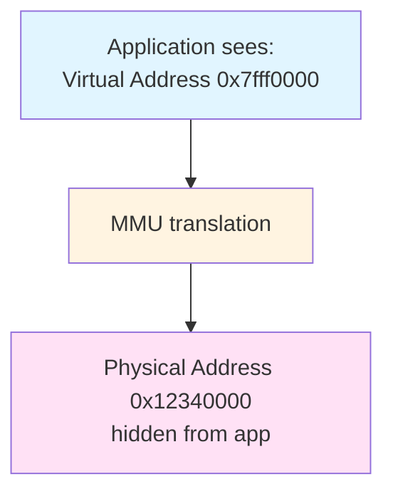

**Problem for Userspace Drivers**:
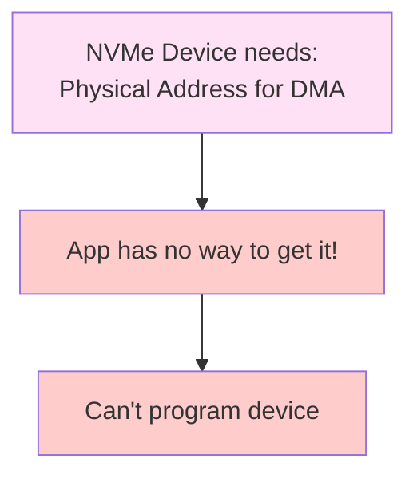

**The Challenge**:

| Requirement | Standard App | SPDK App |
|-------------|--------------|----------|
| Know physical address | No | **Yes** |
| Memory stays pinned | No | **Yes** |
| DMA-safe memory | No | **Yes** |
| Contiguous pages | No | **Preferred** |

---

### Concept 2: DMA Requirements

**Direct Memory Access (DMA)**:
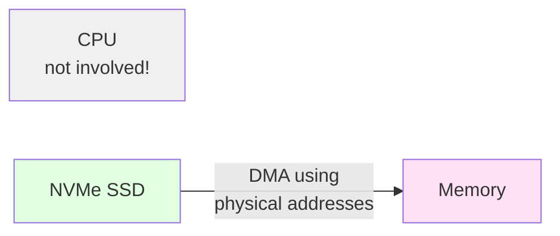

**DMA Requirements**:

1. **Physical Address Known**
   - Device programs its DMA engine with physical address
   - Application must know phys addr to program device

2. **Memory Must Be Pinned**
   - OS must not move or swap pages
   - Physical mapping must remain stable
   - No page faults during DMA

3. **Memory Must Be Mapped for DMA**
   - IOMMU must allow device access
   - Cache coherency requirements
   - Proper memory barriers

4. **Alignment**
   - Typically 64-byte aligned
   - Some devices require 4KB alignment
   - Affects cache line optimization

---

### Concept 3: Hugepages

**Standard Pages**:
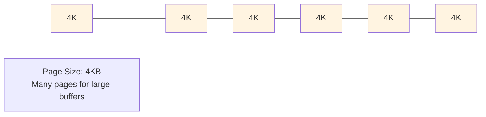

**Hugepages**:
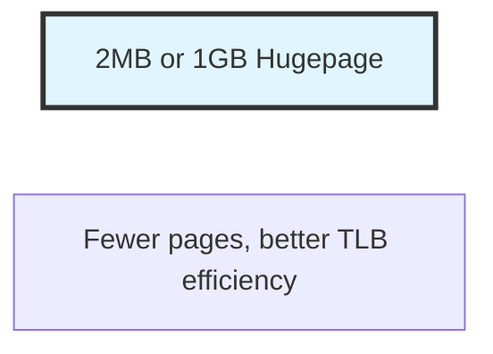

**Why SPDK Uses Hugepages**:

1. **Guaranteed Pinning**
   - Linux doesn't swap hugepages
   - Physical address remains stable
   - Safe for DMA

2. **TLB Efficiency**
   - Fewer TLB entries needed
   - Reduced TLB misses
   - Better performance

3. **Contiguous Physical Memory**
   - Easier to satisfy DMA constraints
   - Better for hardware scatter-gather

4. **Simplified Management**
   - Larger allocation units
   - Reduced page table overhead

**Hugepage Sizes**:

| Type | Size | Use Case |
|------|------|----------|
| Standard | 4KB | Normal pages |
| 2MB hugepage | 2MB | SPDK default |
| 1GB hugepage | 1GB | Very large systems |

---

### Concept 4: DPDK Memory Model

**SPDK's Memory Foundation**:
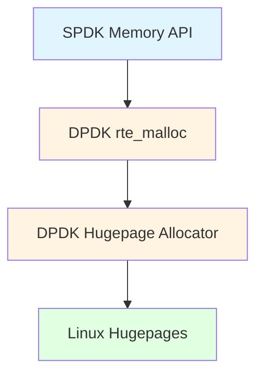

**DPDK Memory Initialization**:
```c
// DPDK allocates hugepages at startup
// From: /dev/hugepages or /mnt/huge

// Maps into process address space
// Knows physical addresses via:
// 1. /proc/self/pagemap (Linux 4.0+)
// 2. VFIO IOMMU mapping
```

**Memory Zones**:
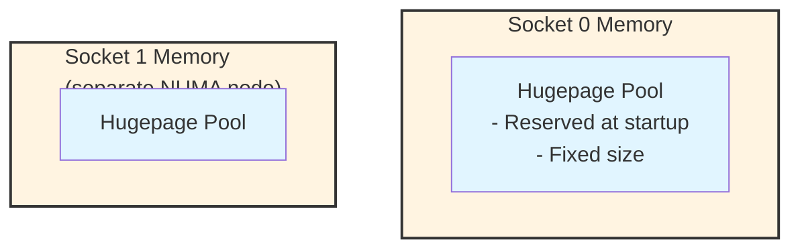

---

## SPDK Memory APIs

### Primary Allocation Function

```c
/**
 * Allocate DMA-capable memory
 *
 * \param size Size in bytes
 * \param align Alignment (typically 64)
 * \param phys_addr Optional: returns physical address
 *
 * \return Virtual address or NULL
 */
void *spdk_dma_malloc(size_t size, size_t align,
                      uint64_t *phys_addr);

// Example usage
void *buffer = spdk_dma_malloc(4096, 64, NULL);
if (buffer == NULL) {
    // Allocation failed
    return -ENOMEM;
}

// Use buffer for I/O
spdk_bdev_read(bdev, ch, buffer, ...);

// Free when done
spdk_dma_free(buffer);
```

### Memory Functions

```c
// Basic allocation
void *spdk_dma_malloc(size_t size, size_t align,
                      uint64_t *phys_addr);

// Allocate with explicit socket
void *spdk_dma_malloc_socket(size_t size, size_t align,
                             uint64_t *phys_addr,
                             int socket_id);

// Allocate and zero
void *spdk_dma_zmalloc(size_t size, size_t align,
                       uint64_t *phys_addr);

// Realloc (try to avoid - expensive!)
void *spdk_dma_realloc(void *buf, size_t size, size_t align,
                       uint64_t *phys_addr);

// Free
void spdk_dma_free(void *buf);

// Get physical address of existing buffer
uint64_t spdk_vtophys(void *buf, uint64_t *size);
```

### Memory Pools

For frequent small allocations, use memory pools:

```c
#include "spdk/mempool.h"

// Create pool
struct spdk_mempool *pool;
pool = spdk_mempool_create("my_pool",
                          1024,          // num elements
                          sizeof(struct my_object),
                          256,           // cache size
                          SPDK_ENV_SOCKET_ID_ANY);

// Allocate from pool
struct my_object *obj;
obj = spdk_mempool_get(pool);

// Return to pool
spdk_mempool_put(pool, obj);

// Destroy pool
spdk_mempool_free(pool);
```

---

## Physical Address Translation

### Getting Physical Addresses

```c
void *virt_addr = spdk_dma_malloc(4096, 64, NULL);

// Get physical address
uint64_t phys_addr = spdk_vtophys(virt_addr, NULL);

// Now can program device with phys_addr
```

### How It Works

**Linux < 4.0**:
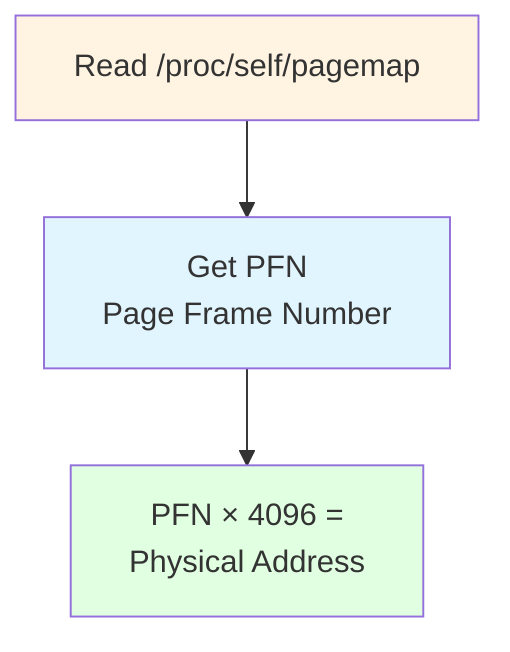

**Linux ≥ 4.0** (requires root or CAP_SYS_ADMIN):
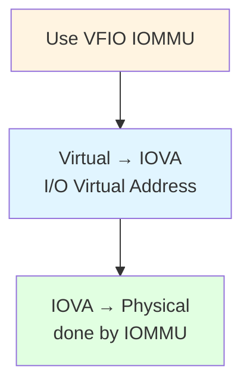

**With VFIO** (recommended):
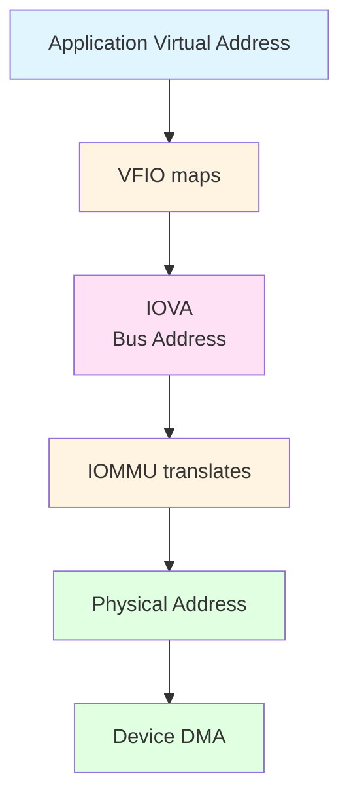

---

## IOMMU and VFIO

### Traditional UIO Model

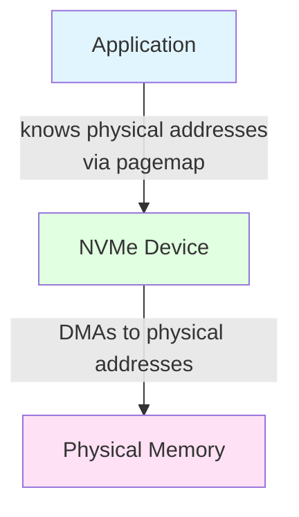

**Problems**:
- Requires root for pagemap access
- No protection if device misbehaves
- Physical addresses visible

### VFIO Model

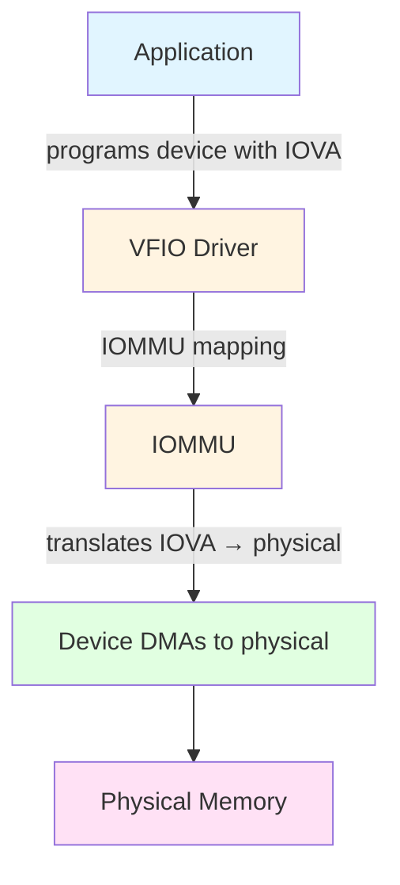

**Benefits**:
- No root required (with setup)
- Device isolated by IOMMU
- Memory protection
- Future-proof

**Setup**:
```bash
# Bind to vfio-pci instead of uio
echo "0000:04:00.0" > /sys/bus/pci/drivers/nvme/unbind
echo "0000:04:00.0" > /sys/bus/pci/drivers/vfio-pci/bind
```

---

## Memory Alignment

### Why Alignment Matters

**Cache Line Alignment** (64 bytes):
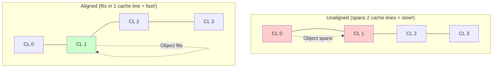

**DMA Alignment**:
- Most devices prefer 64-byte alignment
- Some require 4KB alignment
- Misalignment may cause device errors

**Typical Alignments**:

| Data Type | Alignment | Reason |
|-----------|-----------|--------|
| General buffers | 64 | Cache line |
| NVMe PRPs | 4 | 4-byte boundary |
| Metadata | 8 | 64-bit values |
| Large structures | 4096 | Page boundary |

---

## NUMA Awareness

### NUMA Architecture

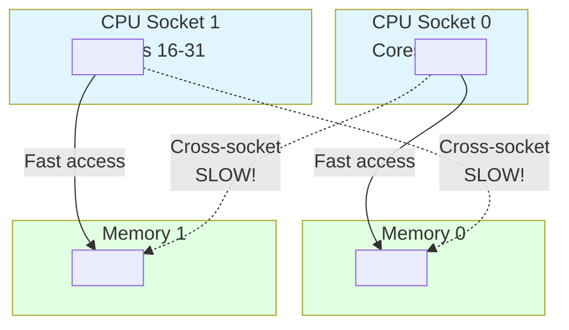

**Best Practice**: Allocate memory on same socket as CPU

```c
// Get current socket
int socket_id = spdk_env_get_socket_id(spdk_env_get_current_core());

// Allocate on this socket
void *buf = spdk_dma_malloc_socket(size, align, NULL, socket_id);
```

---

## Practical Examples

### Example 1: I/O Buffer Allocation

```c
// Correct I/O buffer allocation
void *buffer = spdk_dma_zmalloc(4096, 64, NULL);
if (!buffer) {
    fprintf(stderr, "Failed to allocate DMA buffer\n");
    return -ENOMEM;
}

// Use for I/O
int rc = spdk_bdev_read(bdev_desc, io_channel,
                        buffer, offset_blocks, num_blocks,
                        read_complete, ctx);

// Later: free
spdk_dma_free(buffer);
```

### Example 2: Memory Pool for Requests

```c
struct io_request {
    void *buffer;
    uint64_t lba;
    uint32_t num_blocks;
    void *cb_arg;
};

// Create pool at initialization
struct spdk_mempool *request_pool;

void init_request_pool(void) {
    request_pool = spdk_mempool_create(
        "io_requests",
        1024,                           // 1024 requests
        sizeof(struct io_request),
        0,                              // no cache
        SPDK_ENV_SOCKET_ID_ANY
    );
}

// Allocate request
struct io_request *req = spdk_mempool_get(request_pool);
if (req) {
    req->buffer = spdk_dma_malloc(4096, 64, NULL);
    // ... use request ...
}

// Free request
spdk_dma_free(req->buffer);
spdk_mempool_put(request_pool, req);
```

### Example 3: Scatter-Gather Lists

```c
struct iovec {
    void *iov_base;
    size_t iov_len;
};

// Allocate multiple buffers
#define NUM_IOVS 4
struct iovec iovs[NUM_IOVS];

for (int i = 0; i < NUM_IOVS; i++) {
    iovs[i].iov_base = spdk_dma_malloc(4096, 64, NULL);
    iovs[i].iov_len = 4096;
}

// Use with readv
spdk_bdev_readv(bdev_desc, ch, iovs, NUM_IOVS,
                offset, length, complete_cb, ctx);

// Cleanup
for (int i = 0; i < NUM_IOVS; i++) {
    spdk_dma_free(iovs[i].iov_base);
}
```

---

## Common Patterns

### Pattern 1: Buffer Management

```c
struct buffer_pool {
    struct spdk_mempool *pool;
    size_t buffer_size;
    size_t num_buffers;
};

int buffer_pool_create(struct buffer_pool **pool_out,
                       size_t buffer_size,
                       size_t num_buffers) {
    struct buffer_pool *pool;

    pool = calloc(1, sizeof(*pool));
    pool->buffer_size = buffer_size;
    pool->num_buffers = num_buffers;

    pool->pool = spdk_mempool_create(
        "buffers",
        num_buffers,
        buffer_size,
        256,  // cache size
        SPDK_ENV_SOCKET_ID_ANY
    );

    *pool_out = pool;
    return 0;
}

void *buffer_pool_get(struct buffer_pool *pool) {
    return spdk_mempool_get(pool->pool);
}

void buffer_pool_put(struct buffer_pool *pool, void *buf) {
    spdk_mempool_put(pool->pool, buf);
}
```

---

## Gotchas and Best Practices

### Common Mistakes

1. **Mistake**: Using malloc() for I/O buffers
   ```c
   // WRONG!
   void *buffer = malloc(4096);
   spdk_bdev_read(bdev, ch, buffer, ...);  // CRASH or corruption!
   ```
   **Correct**: Use spdk_dma_malloc()
   ```c
   void *buffer = spdk_dma_malloc(4096, 64, NULL);
   ```

2. **Mistake**: Forgetting to free memory
   ```c
   // Memory leak!
   void *buf = spdk_dma_malloc(4096, 64, NULL);
   // ... forgot spdk_dma_free(buf)
   ```

3. **Mistake**: Using stack buffers for I/O
   ```c
   // WRONG!
   void my_function(void) {
       char buffer[4096];  // Stack allocated
       spdk_bdev_read(..., buffer, ...);  // Dangerous!
   }
   ```

4. **Mistake**: Cross-NUMA allocation
   ```c
   // Inefficient: allocate on wrong socket
   void *buf = spdk_dma_malloc(size, 64, NULL);  // Random socket
   ```
   **Correct**: Allocate on local socket
   ```c
   int socket = spdk_env_get_socket_id(spdk_env_get_current_core());
   void *buf = spdk_dma_malloc_socket(size, 64, NULL, socket);
   ```

### Best Practices

1. **Always use spdk_dma_malloc for I/O buffers**

2. **Prefer memory pools for frequent allocations**

3. **Align to 64 bytes minimum**

4. **Free memory in the same thread that allocated it when possible**

5. **Be NUMA-aware in multi-socket systems**

6. **Use spdk_dma_zmalloc when you need zeroed memory**

---

## Knowledge Check

1. **Why can't regular malloc() be used for DMA buffers?**

2. **What are the advantages of hugepages?**

3. **When should you use memory pools vs direct allocation?**

4. **What's the minimum recommended alignment for I/O buffers?**

5. **How does VFIO improve upon UIO?**

---

## Additional Resources

- **SPDK Source**:
  - `include/spdk/env.h` - Memory API
  - `lib/env_dpdk/env.c` - Implementation
- **Official Docs**:
  - [Memory Management](../../doc/memory.md)
- **DPDK Docs**:
  - DPDK Programmer's Guide - Memory chapter
- **Related Modules**:
  - Previous: [04-S1-Threading-Model.md](./04-S1-Threading-Model.md)
  - Next: [06-S1-Build-System.md](./06-S1-Build-System.md)

---

## Summary

SPDK's memory management is designed for DMA:

**Key Requirements**:
- Physical addresses known
- Memory pinned (no swapping)
- Proper alignment
- NUMA awareness

**Primary APIs**:
- `spdk_dma_malloc()` - Allocate DMA-safe memory
- `spdk_dma_free()` - Free memory
- `spdk_mempool_*()` - Memory pools
- `spdk_vtophys()` - Get physical address

**Technologies**:
- Hugepages for pinning
- DPDK for management
- VFIO/IOMMU for safety
- NUMA for performance

**Golden Rules**:
1. Never use malloc() for I/O buffers
2. Always use spdk_dma_malloc()
3. Free what you allocate
4. Align to 64 bytes minimum
5. Be NUMA-aware

Understanding memory management is critical for SPDK development. Wrong memory = bugs. Right memory = performance.

**Next Module**: [06-S1-Build-System.md](./06-S1-Build-System.md) - Building SPDK applications

---

*End of Module 05*
