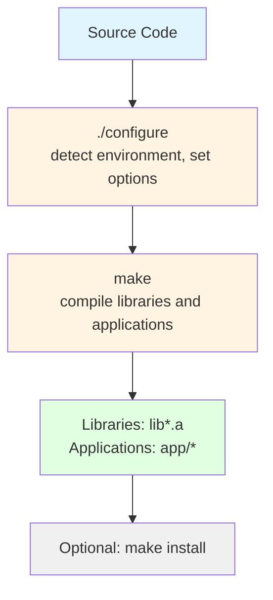
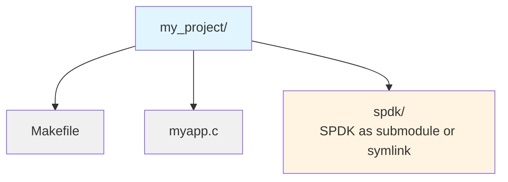

# Module 06: Build System and Configuration

**Stage**: 1 (Foundation)
**Difficulty**: Beginner
**Estimated Time**: 2 hours
**Prerequisites**: Module 01-05

**Version History**:
- v1.0 (2026-01-30): Initial version

---

## Learning Objectives

By the end of this module, you will be able to:
- Build SPDK from source
- Configure build options
- Link applications against SPDK
- Use pkg-config for SPDK
- Understand SPDK's dependency management
- Create custom build configurations

---

## Overview

SPDK uses autoconf for configuration and GNU make for building. Understanding the build system is essential for developing SPDK applications and contributing to the project.

---

## Core Concepts

### Concept 1: Build Process Overview



### Concept 2: Key Build Files

| File | Purpose |
|------|---------|
| `configure` | Configuration script |
| `mk/spdk.common.mk` | Common build rules |
| `mk/spdk.lib.mk` | Library build rules |
| `mk/spdk.app.mk` | Application build rules |
| `Makefile` | Top-level makefile |
| `lib/*/Makefile` | Per-library makefiles |

---

## Building SPDK

### Basic Build

```bash
# Clone repository
git clone https://github.com/spdk/spdk
cd spdk
git submodule update --init

# Install dependencies
sudo scripts/pkgdep.sh

# Configure (default options)
./configure

# Build
make -j$(nproc)

# Build takes ~5-10 minutes on modern hardware
```

### Configure Options

```bash
# See all options
./configure --help

# Common options
./configure \
    --prefix=/usr/local \           # Install prefix
    --with-dpdk=/path/to/dpdk \     # Custom DPDK
    --with-rdma \                    # Enable RDMA
    --with-crypto \                  # Enable crypto
    --without-vhost \                # Disable vhost
    --enable-debug \                 # Debug build
    --enable-asan \                  # Address sanitizer
    --enable-ubsan \                 # UB sanitizer
    --disable-tests                  # Skip test building
```

### Build Targets

```bash
# Build everything (default)
make

# Build specific component
make -C lib/nvme

# Build applications
make -C app

# Clean build
make clean

# Install (to --prefix location)
sudo make install

# Run unit tests
./test/unit/unittest.sh
```

---

## Configuration Options

### Debug vs Release

```bash
# Debug build (default)
./configure --enable-debug
# - Optimization: -O0
# - Debug symbols: Yes
# - Assertions: Enabled
# - Best for development

# Release build
./configure
# - Optimization: -O2
# - Debug symbols: Minimal
# - Assertions: Disabled (some)
# - Best for production
```

### Feature Flags

```bash
# Enable optional features
./configure \
    --with-rdma \        # RDMA transport
    --with-crypto \      # Crypto engines
    --with-vhost \       # Vhost target
    --with-virtio \      # Virtio support
    --with-pmdk \        # Persistent memory
    --with-rbd \         # Ceph RBD
    --with-iscsi-initiator \  # iSCSI initiator
    --with-vtune \       # Intel VTune profiling
    --with-fio           # fio plugin
```

---

## Linking Against SPDK

### Method 1: Direct Linking

```makefile
# Makefile for SPDK application

SPDK_ROOT_DIR := /path/to/spdk

# Include SPDK's build configuration
include $(SPDK_ROOT_DIR)/mk/spdk.common.mk
include $(SPDK_ROOT_DIR)/mk/spdk.modules.mk

APP = myapp

# Source files
C_SRCS := myapp.c

# SPDK libraries needed
SPDK_LIB_LIST = event event_bdev bdev nvme

# Link
$(APP): $(OBJS) $(SPDK_LIB_FILES) $(ENV_LIBS)
	$(LINK_C)

include $(SPDK_ROOT_DIR)/mk/spdk.deps.mk
include $(SPDK_ROOT_DIR)/mk/spdk.lib.mk
```

### Method 2: pkg-config

```bash
# SPDK provides pkg-config files after installation

# Compile
gcc -o myapp myapp.c \
    $(pkg-config --cflags spdk_event spdk_bdev spdk_nvme) \
    $(pkg-config --libs spdk_event spdk_bdev spdk_nvme)

# Or in Makefile
CFLAGS += $(shell pkg-config --cflags spdk_event spdk_bdev)
LDFLAGS += $(shell pkg-config --libs spdk_event spdk_bdev)
```

### Method 3: Using spdk.mk

```makefile
# Simplest method for out-of-tree apps

SPDK_ROOT_DIR := $(abspath /path/to/spdk)

APP = myapp
C_SRCS := myapp.c

# Specify which SPDK libraries you need
SPDK_LIB_LIST = event bdev nvme

# Include SPDK build system
include $(SPDK_ROOT_DIR)/mk/spdk.common.mk
include $(SPDK_ROOT_DIR)/mk/spdk.app.mk
```

---

## Dependencies

### DPDK (Required)

```bash
# SPDK includes DPDK as submodule
cd spdk
git submodule update --init

# DPDK is built automatically with SPDK
# Located at: spdk/dpdk/

# Or use system DPDK
./configure --with-dpdk=/usr/local

# Check DPDK version
cat dpdk/VERSION
```

### Optional Dependencies

```bash
# Install all optional dependencies
sudo scripts/pkgdep.sh --all

# Common optional packages:
# - libibverbs-dev (RDMA)
# - libiscsi-dev (iSCSI initiator)
# - libpmem-dev (PMDK)
# - librbd-dev (Ceph RBD)
# - libfuse3-dev (FUSE)
# - libaio-dev (Linux AIO)
# - liburing-dev (io_uring)
```

---

## Application Build Example

### Complete Makefile

```makefile
# app/Makefile

SPDK_ROOT_DIR := $(abspath $(CURDIR)/..)

APP = hello_bdev

# Include SPDK configuration
include $(SPDK_ROOT_DIR)/mk/spdk.common.mk

# Source files
C_SRCS := hello_bdev.c

# SPDK libraries needed
SPDK_LIB_LIST = event event_bdev bdev bdev_malloc

# Additional libraries
LIBS += -lpthread

# Target
all: $(APP)

# Include SPDK build rules
include $(SPDK_ROOT_DIR)/mk/spdk.app.mk

# Clean
clean:
	$(CLEAN_C) $(APP)

.PHONY: all clean
```

### Build and Run

```bash
# Build
cd spdk/app
make

# Run
sudo ./hello_bdev

# With configuration file
sudo ./hello_bdev -c config.json
```

---

## Cross-Compilation

### ARM64 Example

```bash
# Install cross-compiler
sudo apt-get install gcc-aarch64-linux-gnu

# Configure for ARM64
./configure \
    --target-arch=arm64 \
    --cross-prefix=aarch64-linux-gnu-

# Build
make -j$(nproc)
```

---

## Common Patterns

### Pattern 1: Out-of-Tree Application



```makefile
SPDK_ROOT_DIR := $(abspath spdk)

APP = myapp
C_SRCS := myapp.c
SPDK_LIB_LIST = event bdev nvme

include $(SPDK_ROOT_DIR)/mk/spdk.common.mk
include $(SPDK_ROOT_DIR)/mk/spdk.app.mk
```

### Pattern 2: Conditional Features

```makefile
# Enable features based on SPDK config

ifeq ($(CONFIG_RDMA),y)
    C_SRCS += rdma_support.c
    SPDK_LIB_LIST += rdma
endif

ifeq ($(CONFIG_CRYPTO),y)
    C_SRCS += crypto_support.c
    SPDK_LIB_LIST += accel_crypto
endif
```

---

## Gotchas and Best Practices

### Common Mistakes

1. **Mistake**: Not updating submodules
   ```bash
   # Missing git submodule update --init
   ```
   **Error**: DPDK not found

2. **Mistake**: Wrong library order
   ```makefile
   # WRONG - order matters!
   SPDK_LIB_LIST = nvme bdev  # nvme depends on bdev
   ```
   **Correct**: Dependencies first
   ```makefile
   SPDK_LIB_LIST = bdev nvme
   ```

3. **Mistake**: Missing dependencies
   **Error**: Undefined references during linking
   **Solution**: Check with `ldd` or add missing libs

### Best Practices

1. **Use provided build system**
   - Don't reinvent the wheel
   - SPDK's mk files handle complexity

2. **Specify only needed libraries**
   - Reduces binary size
   - Faster link times

3. **Use pkg-config after install**
   - Clean separation
   - Version management

---

## Knowledge Check

1. **What's the first step before running ./configure?**

2. **How do you enable RDMA support?**

3. **What's the difference between debug and release builds?**

4. **How do you link against SPDK libraries?**

5. **Where are SPDK libraries located after build?**

---

## Additional Resources

- **SPDK Source**:
  - `mk/` - Build system files
  - `doc/pkgconfig.md` - pkg-config guide
- **Related Modules**:
  - Previous: [05-S1-Memory-Management.md](./05-S1-Memory-Management.md)
  - Next: [07-S1-Codebase-Navigation.md](./07-S1-Codebase-Navigation.md)

---

## Summary

**Build Process**:
1. Install dependencies: `scripts/pkgdep.sh`
2. Configure: `./configure [options]`
3. Build: `make -j$(nproc)`
4. Install (optional): `sudo make install`

**Key Concepts**:
- Autoconf for configuration
- GNU make for building
- DPDK bundled as submodule
- Static libraries (lib*.a)
- pkg-config support

**Linking Methods**:
- Direct linking with spdk.app.mk
- pkg-config (after install)
- Manual library specification

**Next Module**: [07-S1-Codebase-Navigation.md](./07-S1-Codebase-Navigation.md) - Navigate SPDK source

---

*End of Module 06*
