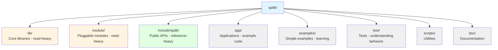
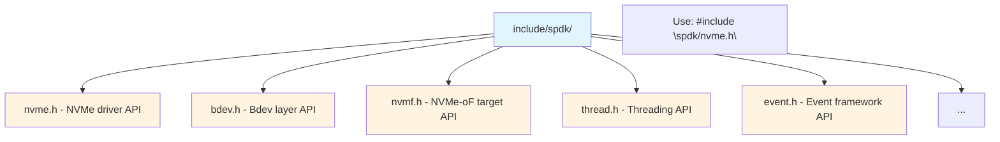
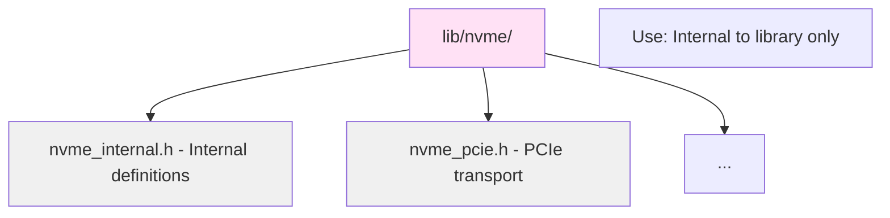
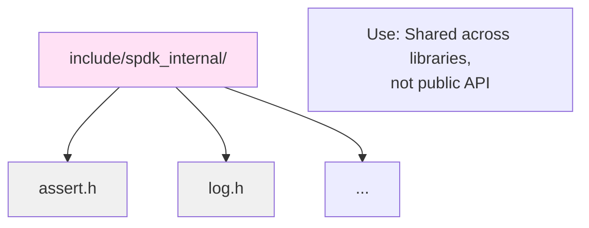
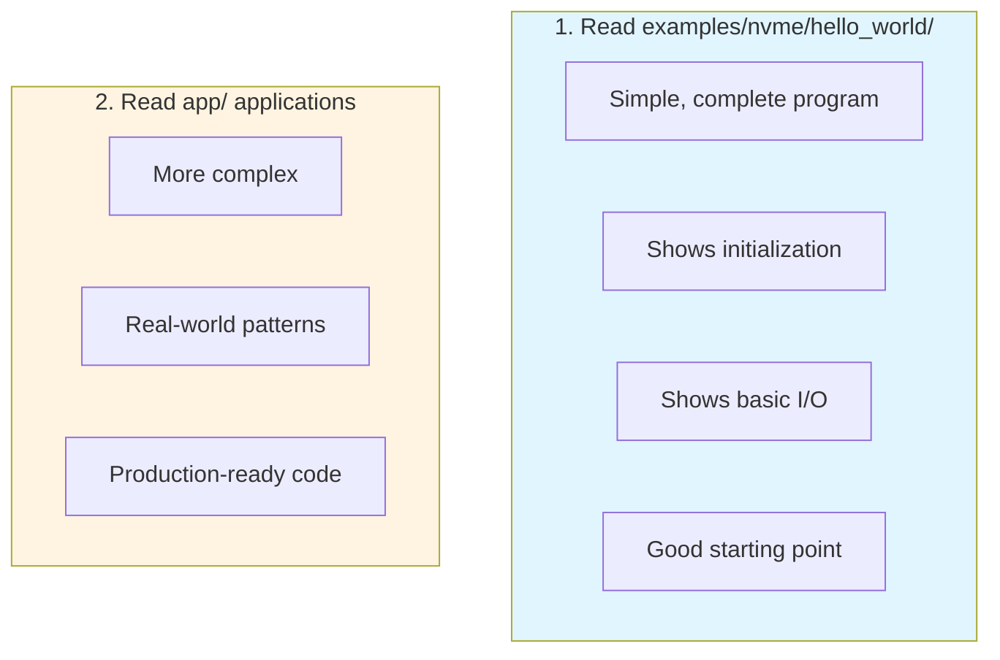
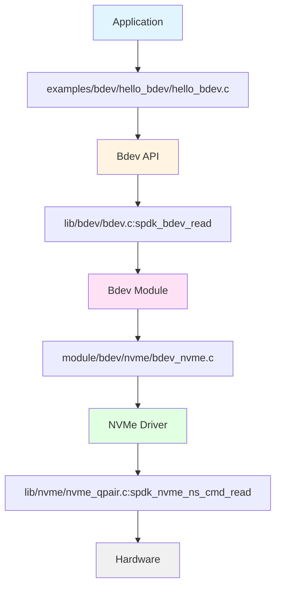
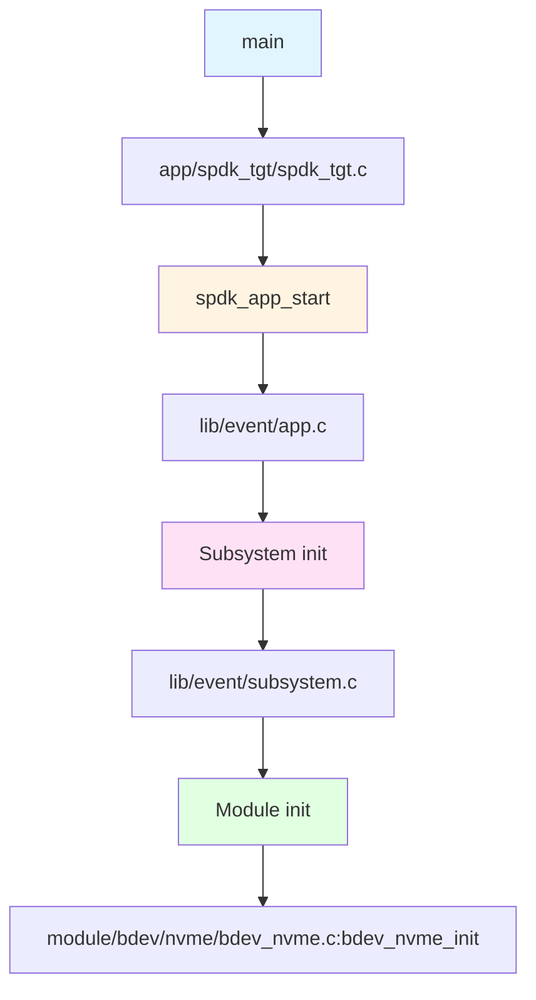
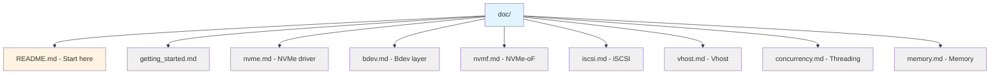
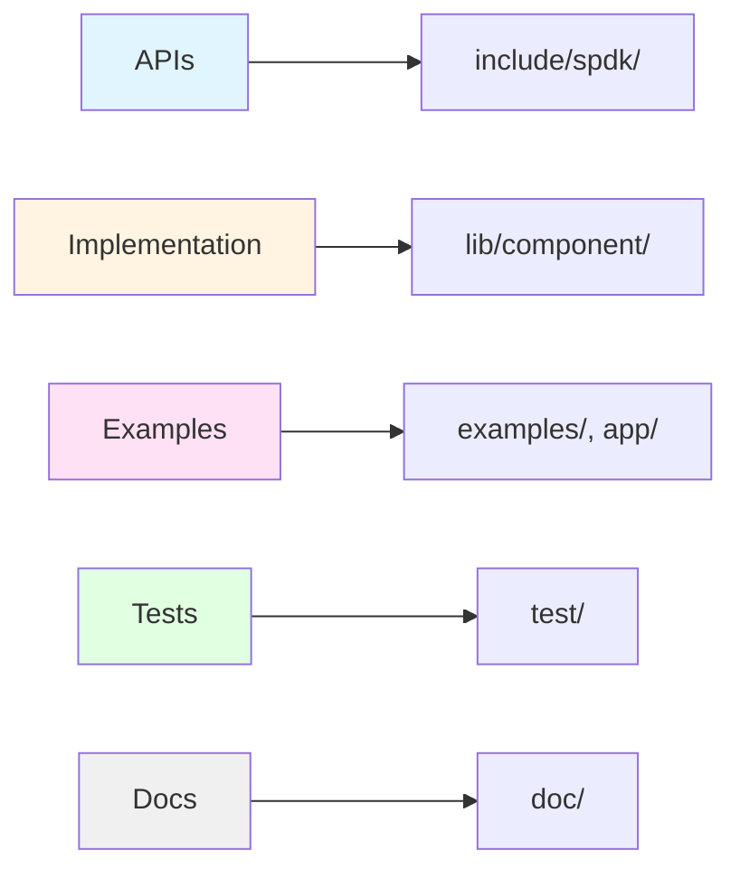

# Module 07: Codebase Navigation

**Stage**: 1 (Foundation)
**Difficulty**: Beginner
**Estimated Time**: 2 hours
**Prerequisites**: Module 01-06

**Version History**:
- v1.0 (2026-01-30): Initial version

---

## Learning Objectives

By the end of this module, you will be able to:
- Navigate SPDK source code efficiently
- Find function implementations quickly
- Understand header file organization
- Locate API documentation
- Use code patterns to understand implementations
- Contribute to SPDK effectively

---

## Overview

SPDK contains ~200,000 lines of code across hundreds of files. Knowing how to navigate this codebase efficiently is essential for development and debugging.

---

## Core Concepts

### Concept 1: Directory Quick Reference



**Navigation Strategy**:
1. Need API? → `include/spdk/`
2. Need implementation? → `lib/[component]/`
3. Need example? → `examples/` or `app/`
4. Need test? → `test/`

---

### Concept 2: Finding Code

**By Feature**:
```
Question: Where is NVMe command submission?
Answer: lib/nvme/nvme_qpair.c

Question: Where is bdev I/O routing?
Answer: lib/bdev/bdev.c

Question: Where is JSON-RPC handling?
Answer: lib/jsonrpc/jsonrpc_server.c
```

**By Function Name**:
```bash
# Find function definition
grep -r "function_name" lib/ module/

# Find function usage
grep -r "function_name(" lib/ app/

# Better: use ctags or LSP
```

**By Module**:
```
Need: NVMe driver
Look: lib/nvme/

Need: RAID implementation
Look: module/bdev/raid/

Need: NVMe-oF target
Look: lib/nvmf/
```

---

### Concept 3: Header Organization

**Public Headers** (`include/spdk/`):


**Internal Headers** (`lib/[component]/`):


**Common Headers** (`include/spdk_internal/`):


---

### Concept 4: Code Patterns

**Module Registration**:
```c
// Look for this pattern
SPDK_BDEV_MODULE_REGISTER(name, &module_if)
SPDK_LOG_REGISTER_COMPONENT(name)
SPDK_RPC_REGISTER(method, handler, flags)
```

**Init/Fini Pattern**:
```c
static int
module_init(void)
{
    // Initialization
    return 0;
}

static void
module_fini(void)
{
    // Cleanup
}
```

**Callback Pattern**:
```c
typedef void (*callback_fn)(void *ctx, int status);

void async_operation(callback_fn cb, void *ctx)
{
    // Start operation
    // ...
    // On completion:
    cb(ctx, 0);
}
```

---

## Navigation Techniques

### Technique 1: Follow the Headers

```c
// In your code
#include "spdk/bdev.h"

// Find bdev.h
$ find include/ -name "bdev.h"
include/spdk/bdev.h

// Read bdev.h for API documentation
$ less include/spdk/bdev.h

// Find implementation
$ ls lib/bdev/
bdev.c  bdev.h  ...
```

### Technique 2: Grep Effectively

```bash
# Find function definition
grep -rn "^spdk_bdev_read" lib/

# Find struct definition
grep -rn "^struct spdk_bdev {" lib/

# Find macro definition
grep -rn "^#define SPDK_" include/

# Find RPC method
grep -rn "SPDK_RPC_REGISTER.*bdev_get_bdevs" lib/

# Case-insensitive, show filename
grep -rin "nvme_qpair" lib/nvme/
```

### Technique 3: Using ctags

```bash
# Generate tags
cd spdk
ctags -R .

# In vim:
# Ctrl-] on function name to jump to definition
# Ctrl-T to jump back
```

### Technique 4: Using Git

```bash
# Find when function was added
git log -p --all -S "spdk_bdev_read"

# Find file history
git log --follow -- lib/bdev/bdev.c

# Find who changed this
git blame lib/bdev/bdev.c

# Search commit messages
git log --grep="bdev" --oneline
```

---

## Common Code Locations

### Core Infrastructure

| Component | Location | Key Files |
|-----------|----------|-----------|
| Threading | `lib/thread/` | `thread.c`, `thread.h` |
| Event framework | `lib/event/` | `app.c`, `reactor.c` |
| JSON-RPC | `lib/jsonrpc/` | `jsonrpc_server.c` |
| Logging | `lib/log/` | `log.c` |
| Tracing | `lib/trace/` | `trace.c` |
| Utilities | `lib/util/` | `string.c`, `cpuset.c` |

### Storage Stack

| Component | Location | Key Files |
|-----------|----------|-----------|
| Bdev layer | `lib/bdev/` | `bdev.c`, `bdev.h` |
| NVMe driver | `lib/nvme/` | `nvme.c`, `nvme_qpair.c` |
| NVMe bdev | `module/bdev/nvme/` | `bdev_nvme.c` |
| RAID | `module/bdev/raid/` | `raid.c` |
| Crypto | `module/bdev/crypto/` | `vbdev_crypto.c` |

### Protocols

| Component | Location | Key Files |
|-----------|----------|-----------|
| NVMe-oF target | `lib/nvmf/` | `nvmf.c`, `transport.c` |
| RDMA transport | `lib/nvmf/` | `rdma.c` |
| TCP transport | `lib/nvmf/` | `tcp.c` |
| iSCSI target | `lib/iscsi/` | `iscsi.c` |
| Vhost target | `lib/vhost/` | `vhost.c` |

---

## Reading Code Effectively

### Start with Examples



### Follow I/O Path



### Understand Initialization



---

## Documentation

### Doxygen Documentation

```bash
# Build documentation
cd doc
make

# Open in browser
firefox html/index.html

# Online: https://spdk.io/doc/
```

### Markdown Documentation



### Code Comments

```c
/**
 * Read data from a block device.
 *
 * \param desc Block device descriptor
 * \param ch I/O channel
 * \param buf Data buffer (must be DMA-capable)
 * \param offset_blocks Offset in blocks
 * \param num_blocks Number of blocks
 * \param cb Completion callback
 * \param cb_arg Callback argument
 *
 * \return 0 on success, negative errno on failure
 */
int spdk_bdev_read(struct spdk_bdev_desc *desc, ...);
```

---

## Practical Examples

### Example 1: Finding NVMe Read Implementation

```bash
# 1. Find public API
$ grep -rn "spdk_nvme_ns_cmd_read" include/spdk/
include/spdk/nvme.h:1234:int spdk_nvme_ns_cmd_read(...);

# 2. Find implementation
$ grep -rn "^spdk_nvme_ns_cmd_read" lib/nvme/
lib/nvme/nvme_ns_cmd.c:123:int spdk_nvme_ns_cmd_read(...)

# 3. Read implementation
$ vim lib/nvme/nvme_ns_cmd.c +123
```

### Example 2: Understanding Bdev Modules

```bash
# 1. List all bdev modules
$ ls module/bdev/
aio/  crypto/  delay/  ...

# 2. Pick one to study
$ cd module/bdev/nvme/

# 3. Find module registration
$ grep "SPDK_BDEV_MODULE_REGISTER" *.c
bdev_nvme.c:SPDK_BDEV_MODULE_REGISTER(nvme, &nvme_if)

# 4. Study module interface
$ vim bdev_nvme.c
# Look for: nvme_if structure
```

---

## Best Practices

1. **Start with public APIs**
   - Read `include/spdk/*.h` first
   - Understand contracts before implementations

2. **Follow examples**
   - Learn patterns from working code
   - Don't reinvent the wheel

3. **Use git history**
   - Understand why code exists
   - See evolution of features

4. **Read tests**
   - `test/unit/` for unit tests
   - Shows expected behavior
   - Good for edge cases

5. **Contribute early**
   - Fix documentation typos
   - Learn review process
   - Build confidence

---

## Knowledge Check

1. **Where do you find public API documentation?**

2. **How do you find where a function is implemented?**

3. **Where are bdev module implementations located?**

4. **What's the best place to start learning SPDK?**

5. **How do you search for RPC method implementations?**

---

## Additional Resources

- **SPDK Source**: Browse entire repository
- **GitHub**: https://github.com/spdk/spdk
- **Documentation**: https://spdk.io/doc/
- **Related Modules**:
  - This completes Stage 1!
  - Next: [Stage 2: Implementation](../stage-2-implementation/)

---

## Summary

**Navigation Strategy**:


**Tools**:
- grep for searching
- ctags for jumping
- git for history
- Doxygen for API docs

**Learning Path**:
1. Read examples first
2. Study public headers
3. Trace I/O paths
4. Read implementations
5. Study tests

**You now have the foundation!**

Stage 1 Complete! You understand:
- Why SPDK exists
- Core principles
- Architecture
- Threading model
- Memory management
- Build system
- Codebase navigation

**Next**: Move to Stage 2 for hands-on implementation!

---

*End of Module 07 - Stage 1 Complete!*
