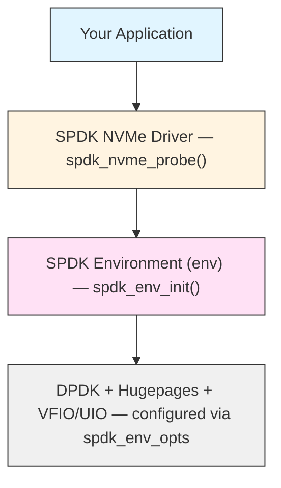
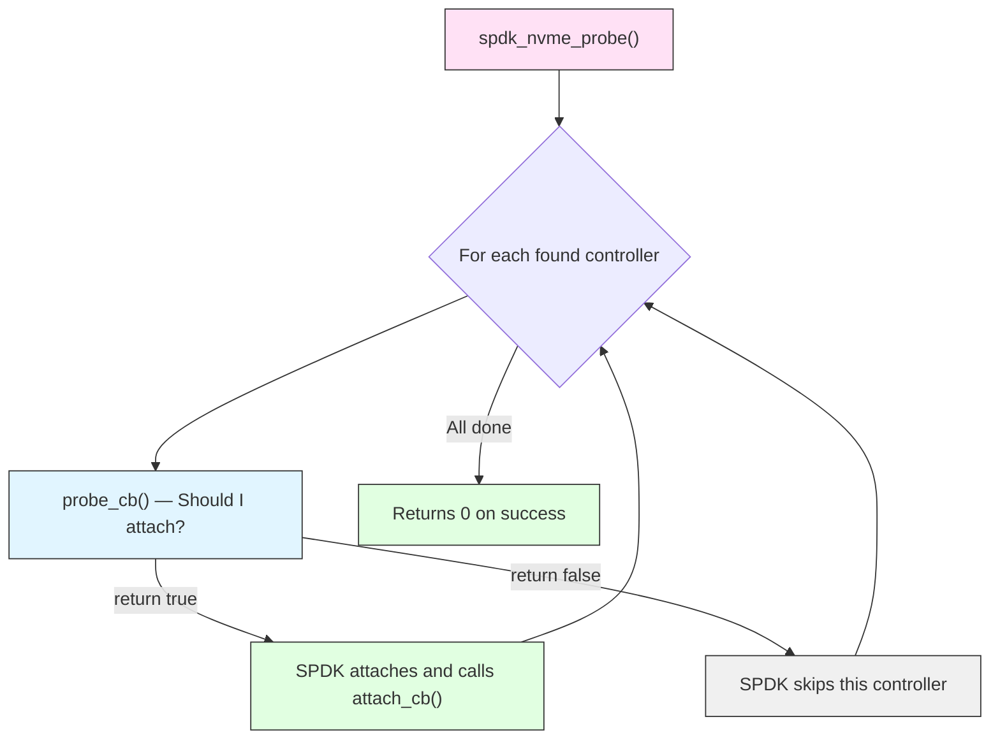
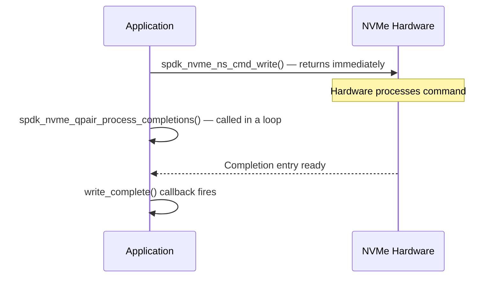

# Module 11: Hello World - First SPDK Application

**Stage**: 2 (Implementation)
**Difficulty**: Beginner
**Estimated Time**: 3 hours
**Prerequisites**: Modules 01-10

---

## Learning Objectives

- Write your first complete SPDK application from scratch
- Understand the SPDK environment initialization sequence
- Use `spdk_env_opts` to configure the DPDK/hugepage layer
- Implement the NVMe probe/attach callback pattern
- Enumerate controllers and namespaces, printing device information
- Perform a simple write-then-read I/O operation
- Build with the SPDK Makefile system and run as root
- Recognize and fix the most common beginner mistakes

---

## Core Concepts

### Concept 1: The Two Initialization Layers

Every SPDK application must initialize two distinct layers before touching any device.



**Layer 1 - Environment (`spdk/env.h`)**: Sets up DPDK, binds hugepage memory, and
configures PCI access via VFIO or UIO. This must run before any driver code.

**Layer 2 - NVMe Driver (`spdk/nvme.h`)**: Discovers devices via `spdk_nvme_probe()`,
attaches to chosen controllers, and exposes namespaces for I/O.

Skipping or reordering these layers causes crashes or silent failures.

---

### Concept 2: The Probe/Attach Callback Pattern

SPDK does not return a list of devices. Instead it calls your functions during enumeration:



This design lets you filter devices by transport address, model number, or any
application-specific criterion before committing resources.

---

### Concept 3: Async I/O with Polling (No Blocking, No Interrupts)

SPDK I/O is non-blocking. Submitting a command returns immediately; you must poll
a queue pair to drain completions and trigger your callback:



There is no blocking wait anywhere in this path. Latency is minimized because the
CPU stays on the same core and avoids context switches.

---

## Complete Working Example

The following application:
1. Initializes the SPDK environment
2. Probes for all PCIe NVMe controllers
3. Prints controller and namespace information
4. Writes "Hello world!" to LBA 0 of each active namespace
5. Reads the data back and verifies it
6. Cleans up properly

### File: `hello_world.c`

```c
/*
 * SPDK Hello World - first SPDK NVMe application.
 * Writes "Hello world!" to LBA 0 and reads it back.
 */

#include "spdk/stdinc.h"   /* wraps common system headers portably */
#include "spdk/nvme.h"     /* NVMe driver API */
#include "spdk/env.h"      /* environment init (hugepages, PCI) */
#include "spdk/log.h"      /* SPDK_NOTICELOG, SPDK_ERRLOG macros */
#include "spdk/string.h"   /* spdk_strtol */

/* The payload we will write and verify */
#define DATA_STRING "Hello world!"

/* ------------------------------------------------------------------ */
/* Data structures                                                      */
/* ------------------------------------------------------------------ */

/*
 * One entry per attached NVMe controller.
 * We keep a doubly-linked tail queue so cleanup is safe even if
 * attach_cb() is called many times.
 */
struct ctrlr_entry {
    struct spdk_nvme_ctrlr     *ctrlr;
    TAILQ_ENTRY(ctrlr_entry)    link;
    char                        name[1024];  /* "ModelNumber (SerialNumber)" */
};

/*
 * One entry per active namespace discovered.
 * A single controller can expose multiple namespaces (think partitions
 * but at the firmware level).
 */
struct ns_entry {
    struct spdk_nvme_ctrlr  *ctrlr;
    struct spdk_nvme_ns     *ns;
    TAILQ_ENTRY(ns_entry)    link;
    struct spdk_nvme_qpair  *qpair;  /* allocated per I/O session */
};

/*
 * Context passed through write_complete -> read_complete.
 * Tracks the DMA buffer and completion status.
 */
struct io_sequence {
    struct ns_entry *ns_entry;
    char            *buf;        /* DMA-mapped buffer */
    int              is_completed; /* 0 = pending, 1 = ok, 2 = error */
};

/* Global lists */
static TAILQ_HEAD(, ctrlr_entry) g_controllers =
    TAILQ_HEAD_INITIALIZER(g_controllers);
static TAILQ_HEAD(, ns_entry) g_namespaces =
    TAILQ_HEAD_INITIALIZER(g_namespaces);

/* Transport ID - describes which transport/address to probe.
 * NULL passed to spdk_nvme_probe() means "scan all local PCIe devices". */
static struct spdk_nvme_transport_id g_trid = {};

/* ------------------------------------------------------------------ */
/* Namespace registration (called from attach_cb)                       */
/* ------------------------------------------------------------------ */

static void
register_ns(struct spdk_nvme_ctrlr *ctrlr, struct spdk_nvme_ns *ns)
{
    struct ns_entry *entry;

    /*
     * Inactive namespaces exist in the IDENTIFY data but cannot
     * receive I/O. Always skip them.
     */
    if (!spdk_nvme_ns_is_active(ns)) {
        return;
    }

    entry = malloc(sizeof(*entry));
    if (entry == NULL) {
        perror("ns_entry malloc");
        exit(1);
    }

    entry->ctrlr  = ctrlr;
    entry->ns     = ns;
    entry->qpair  = NULL;   /* allocated later, before I/O */
    TAILQ_INSERT_TAIL(&g_namespaces, entry, link);

    printf("    Namespace ID: %d  size: %ju GB  sector size: %u bytes\n",
           spdk_nvme_ns_get_id(ns),
           spdk_nvme_ns_get_size(ns) / 1000000000ULL,
           spdk_nvme_ns_get_sector_size(ns));
}

/* ------------------------------------------------------------------ */
/* Probe and attach callbacks                                            */
/* ------------------------------------------------------------------ */

/*
 * probe_cb - called once per discovered controller BEFORE attachment.
 *
 * Return true  → SPDK will attach this controller and later call attach_cb.
 * Return false → SPDK skips this controller entirely.
 *
 * Here we accept every controller we find.  In a real application you
 * might filter by trid->traddr (PCI address) or cdata->mn (model name).
 */
static bool
probe_cb(void *cb_ctx,
         const struct spdk_nvme_transport_id *trid,
         struct spdk_nvme_ctrlr_opts *opts)
{
    printf("Probing controller at %s\n", trid->traddr);
    /*
     * opts lets you change controller-level settings before attach:
     *   opts->num_io_queues = 4;   -- request 4 I/O queues
     *   opts->io_queue_size = 128; -- depth per queue
     * Defaults are reasonable for a hello-world application.
     */
    return true;  /* attach to every discovered controller */
}

/*
 * attach_cb - called once per successfully attached controller.
 *
 * By the time this fires, SPDK has already sent the IDENTIFY command and
 * the controller is ready for I/O.  Read cdata to get model/serial info.
 */
static void
attach_cb(void *cb_ctx,
          const struct spdk_nvme_transport_id *trid,
          struct spdk_nvme_ctrlr *ctrlr,
          const struct spdk_nvme_ctrlr_opts *opts)
{
    struct ctrlr_entry              *entry;
    const struct spdk_nvme_ctrlr_data *cdata;
    int                              nsid;
    struct spdk_nvme_ns             *ns;

    entry = malloc(sizeof(*entry));
    if (entry == NULL) {
        perror("ctrlr_entry malloc");
        exit(1);
    }

    printf("Attached to controller at %s\n", trid->traddr);

    /*
     * spdk_nvme_ctrlr_get_data() returns a pointer to the cached
     * IDENTIFY Controller data (NVMe spec section 5.15).
     * Fields mn (model name) and sn (serial number) are padded ASCII.
     */
    cdata = spdk_nvme_ctrlr_get_data(ctrlr);
    snprintf(entry->name, sizeof(entry->name),
             "%-20.20s (%-20.20s)", cdata->mn, cdata->sn);

    entry->ctrlr = ctrlr;
    TAILQ_INSERT_TAIL(&g_controllers, entry, link);

    printf("  Model: %.20s  Serial: %.20s\n", cdata->mn, cdata->sn);
    printf("  Firmware: %.8s\n", cdata->fr);
    printf("  Max transfer size: %u bytes\n",
           spdk_nvme_ctrlr_get_max_xfer_size(ctrlr));

    /*
     * Iterate over active namespaces using the recommended iterator:
     *   spdk_nvme_ctrlr_get_first_active_ns() / _get_next_active_ns()
     * Namespace IDs start at 1, not 0.  The iterator returns 0 when done.
     */
    for (nsid = spdk_nvme_ctrlr_get_first_active_ns(ctrlr);
         nsid != 0;
         nsid = spdk_nvme_ctrlr_get_next_active_ns(ctrlr, nsid)) {

        ns = spdk_nvme_ctrlr_get_ns(ctrlr, nsid);
        if (ns == NULL) {
            continue;
        }
        register_ns(ctrlr, ns);
    }
}

/* ------------------------------------------------------------------ */
/* I/O callbacks                                                        */
/* ------------------------------------------------------------------ */

/*
 * read_complete - fires when the read command finishes.
 *
 * At this point the DMA buffer contains data read from the device.
 * We verify it matches what we wrote, then mark the sequence done.
 */
static void
read_complete(void *arg, const struct spdk_nvme_cpl *cpl)
{
    struct io_sequence *seq = arg;

    if (spdk_nvme_cpl_is_error(cpl)) {
        fprintf(stderr, "Read I/O error: %s\n",
                spdk_nvme_cpl_get_status_string(&cpl->status));
        seq->is_completed = 2;  /* signal error to polling loop */
        return;
    }

    /* Verify the data we wrote is present */
    if (strcmp(seq->buf, DATA_STRING) == 0) {
        printf("  Read back: \"%s\" (verified OK)\n", seq->buf);
    } else {
        fprintf(stderr, "  Data mismatch! Got: \"%s\"\n", seq->buf);
    }

    spdk_free(seq->buf);
    seq->buf = NULL;
    seq->is_completed = 1;  /* signal success to polling loop */
}

/*
 * write_complete - fires when the write command finishes.
 *
 * We free the write buffer, allocate a fresh zeroed read buffer, then
 * submit a read to verify the data landed on the device.
 */
static void
write_complete(void *arg, const struct spdk_nvme_cpl *cpl)
{
    struct io_sequence *seq     = arg;
    struct ns_entry    *ns_entry = seq->ns_entry;
    int                 rc;

    if (spdk_nvme_cpl_is_error(cpl)) {
        fprintf(stderr, "Write I/O error: %s\n",
                spdk_nvme_cpl_get_status_string(&cpl->status));
        spdk_free(seq->buf);
        seq->buf = NULL;
        seq->is_completed = 2;
        return;
    }

    printf("  Write completed OK.  Submitting read...\n");

    /*
     * Free write buffer and allocate a new zeroed read buffer.
     * spdk_zmalloc() allocates DMA-safe pinned memory from hugepages.
     * Arguments: (size, alignment, phys_addr_out, numa_id, flags)
     *   SPDK_ENV_NUMA_ID_ANY   → allocate on any NUMA node
     *   SPDK_MALLOC_DMA        → guarantee DMA-safe pinning
     */
    spdk_free(seq->buf);
    seq->buf = spdk_zmalloc(0x1000, 0x1000, NULL,
                            SPDK_ENV_NUMA_ID_ANY, SPDK_MALLOC_DMA);
    if (seq->buf == NULL) {
        fprintf(stderr, "Failed to allocate read buffer\n");
        seq->is_completed = 2;
        return;
    }

    /*
     * spdk_nvme_ns_cmd_read() - submit an NVMe READ command.
     *
     * Arguments:
     *   ns         → target namespace
     *   qpair      → I/O queue to use (one thread per qpair rule!)
     *   buf        → DMA buffer for the read data
     *   0          → starting LBA
     *   1          → number of logical blocks to read
     *   read_complete → completion callback
     *   seq        → callback argument (our context)
     *   0          → I/O flags (0 = defaults)
     *
     * Returns 0 on success; the command is enqueued but NOT yet sent.
     * Completions are checked later via process_completions().
     */
    rc = spdk_nvme_ns_cmd_read(ns_entry->ns, ns_entry->qpair,
                               seq->buf,
                               0, /* LBA start */
                               1, /* number of LBAs */
                               read_complete, seq, 0);
    if (rc != 0) {
        fprintf(stderr, "Failed to submit read: %d\n", rc);
        spdk_free(seq->buf);
        seq->buf = NULL;
        seq->is_completed = 2;
    }
}

/* ------------------------------------------------------------------ */
/* Main I/O loop                                                         */
/* ------------------------------------------------------------------ */

static void
run_hello_world(void)
{
    struct ns_entry    *ns_entry;
    struct io_sequence  seq;
    int                 rc;

    TAILQ_FOREACH(ns_entry, &g_namespaces, link) {

        printf("\nRunning hello_world on namespace %d\n",
               spdk_nvme_ns_get_id(ns_entry->ns));

        /*
         * Allocate an I/O queue pair.
         *
         * A queue pair (qpair) is a submission queue + completion queue
         * pair.  SPDK requires that each qpair is accessed from a single
         * thread only - no locking is done inside the driver.
         *
         * NULL opts → use default queue pair options
         * 0        → default flags
         */
        ns_entry->qpair = spdk_nvme_ctrlr_alloc_io_qpair(
                              ns_entry->ctrlr, NULL, 0);
        if (ns_entry->qpair == NULL) {
            fprintf(stderr, "Failed to allocate qpair\n");
            continue;
        }

        /*
         * Allocate a 4 KB DMA buffer for the write payload.
         * The NVMe spec requires that data buffers are physically
         * contiguous and aligned.  spdk_zmalloc() satisfies both.
         */
        seq.buf = spdk_zmalloc(0x1000, 0x1000, NULL,
                               SPDK_ENV_NUMA_ID_ANY, SPDK_MALLOC_DMA);
        if (seq.buf == NULL) {
            fprintf(stderr, "Failed to allocate write buffer\n");
            spdk_nvme_ctrlr_free_io_qpair(ns_entry->qpair);
            continue;
        }

        /* Fill the write buffer with our payload */
        snprintf(seq.buf, 0x1000, "%s", DATA_STRING);
        seq.ns_entry     = ns_entry;
        seq.is_completed = 0;

        printf("  Writing \"%s\" to LBA 0...\n", DATA_STRING);

        /*
         * spdk_nvme_ns_cmd_write() - submit an NVMe WRITE command.
         * Same signature as cmd_read.  Command is enqueued immediately;
         * write_complete() fires after we poll for completions below.
         */
        rc = spdk_nvme_ns_cmd_write(ns_entry->ns, ns_entry->qpair,
                                    seq.buf,
                                    0, /* LBA start */
                                    1, /* number of LBAs */
                                    write_complete, &seq, 0);
        if (rc != 0) {
            fprintf(stderr, "Failed to submit write: %d\n", rc);
            spdk_free(seq.buf);
            spdk_nvme_ctrlr_free_io_qpair(ns_entry->qpair);
            continue;
        }

        /*
         * Polling loop.
         *
         * spdk_nvme_qpair_process_completions(qpair, max_completions)
         *   - Checks the hardware completion queue for finished commands
         *   - Fires the appropriate callback for each completion found
         *   - Returns the number of completions processed
         *   - NEVER blocks - returns 0 immediately if nothing is ready
         *
         * We loop until our sequence sets is_completed != 0.
         * In a real application the event framework handles this loop.
         */
        while (seq.is_completed == 0) {
            spdk_nvme_qpair_process_completions(ns_entry->qpair, 0);
        }

        if (seq.is_completed == 2) {
            fprintf(stderr, "  I/O sequence failed on namespace %d\n",
                    spdk_nvme_ns_get_id(ns_entry->ns));
        }

        /* Always free the qpair when done with this session */
        spdk_nvme_ctrlr_free_io_qpair(ns_entry->qpair);
        ns_entry->qpair = NULL;
    }
}

/* ------------------------------------------------------------------ */
/* Cleanup                                                              */
/* ------------------------------------------------------------------ */

static void
cleanup(void)
{
    struct ns_entry   *ns_entry,  *tmp_ns;
    struct ctrlr_entry *ctrlr_entry, *tmp_ctrlr;
    struct spdk_nvme_detach_ctx *detach_ctx = NULL;

    /* Free namespace list entries (the ns handles belong to the ctrlr) */
    TAILQ_FOREACH_SAFE(ns_entry, &g_namespaces, link, tmp_ns) {
        TAILQ_REMOVE(&g_namespaces, ns_entry, link);
        free(ns_entry);
    }

    /*
     * Detach controllers asynchronously, then wait for all to finish.
     * spdk_nvme_detach_async() queues the detach;
     * spdk_nvme_detach_poll() blocks until all queued detaches complete.
     */
    TAILQ_FOREACH_SAFE(ctrlr_entry, &g_controllers, link, tmp_ctrlr) {
        TAILQ_REMOVE(&g_controllers, ctrlr_entry, link);
        spdk_nvme_detach_async(ctrlr_entry->ctrlr, &detach_ctx);
        free(ctrlr_entry);
    }

    if (detach_ctx) {
        spdk_nvme_detach_poll(detach_ctx);
    }
}

/* ------------------------------------------------------------------ */
/* main                                                                 */
/* ------------------------------------------------------------------ */

int
main(int argc, char **argv)
{
    struct spdk_env_opts opts;
    int rc;

    /*
     * Step 1: Initialize spdk_env_opts.
     *
     * Always set opts.opts_size = sizeof(opts) first.  SPDK uses this
     * field to detect ABI version mismatches at runtime.  Forgetting it
     * is a common source of mysterious crashes with mismatched builds.
     *
     * spdk_env_opts_init() fills in safe defaults:
     *   name             = NULL (must be set by caller)
     *   mem_size         = -1   (let DPDK decide based on hugepage pool)
     *   main_core        = -1   (use current core)
     *   shm_id           = -1   (no shared memory between processes)
     *   no_pci           = false
     *   hugepage_single_segments = false
     */
    opts.opts_size = sizeof(opts);
    spdk_env_opts_init(&opts);

    /* Application name appears in hugepage file names and log output */
    opts.name = "hello_world";

    /*
     * Optional tuning knobs (commented out - defaults are fine here):
     *
     *   opts.mem_size = 512;          // reserve 512 MB of hugepage RAM
     *   opts.main_core = 1;           // pin main thread to core 1
     *   opts.reactor_mask = "0x3";    // use cores 0 and 1
     *   opts.shm_id = 0;              // enable multi-process mode
     *   opts.no_pci = true;           // disable PCI (for NVMe-oF only)
     */

    /*
     * Step 2: Initialize the SPDK environment.
     *
     * This call:
     *   - Initializes DPDK EAL (Environment Abstraction Layer)
     *   - Maps hugepage memory
     *   - Binds to PCI devices via VFIO or UIO kernel drivers
     *
     * Must be called BEFORE any other SPDK function.
     * Returns < 0 on failure; no recovery is possible after failure.
     */
    if (spdk_env_init(&opts) < 0) {
        fprintf(stderr, "Unable to initialize SPDK env\n");
        return 1;
    }

    printf("SPDK environment initialized.\n");

    /*
     * Step 3: Configure the transport ID.
     *
     * For local PCIe NVMe devices: SPDK_NVME_TRANSPORT_PCIE.
     * For NVMe-oF targets: use SPDK_NVME_TRANSPORT_TCP or _RDMA
     * and fill in trid.traddr / trid.trsvcid / trid.subnqn.
     *
     * Passing &g_trid (PCIe) to spdk_nvme_probe() limits the scan to
     * PCIe devices.  Passing NULL scans all registered transports.
     */
    spdk_nvme_trid_populate_transport(&g_trid, SPDK_NVME_TRANSPORT_PCIE);
    snprintf(g_trid.subnqn, sizeof(g_trid.subnqn), "%s",
             SPDK_NVMF_DISCOVERY_NQN);

    printf("Scanning for NVMe controllers...\n");

    /*
     * Step 4: Probe for NVMe devices.
     *
     * spdk_nvme_probe(trid, cb_ctx, probe_cb, attach_cb, remove_cb)
     *
     *   trid       - transport filter; NULL = scan all
     *   cb_ctx     - opaque pointer passed to every callback
     *   probe_cb   - called per found controller; return true to attach
     *   attach_cb  - called per attached controller; inspect and store it
     *   remove_cb  - called when a previously attached controller is
     *                removed (hotplug); NULL disables hotplug handling
     *
     * This function is SYNCHRONOUS: it blocks until all probing and
     * attaching is complete, then returns.
     */
    rc = spdk_nvme_probe(&g_trid, NULL, probe_cb, attach_cb, NULL);
    if (rc != 0) {
        fprintf(stderr, "spdk_nvme_probe() failed: %d\n", rc);
        goto cleanup;
    }

    if (TAILQ_EMPTY(&g_controllers)) {
        fprintf(stderr, "No NVMe controllers found.\n");
        fprintf(stderr, "Ensure NVMe devices are bound to vfio-pci or uio_pci_generic.\n");
        rc = 1;
        goto cleanup;
    }

    printf("\nProbe complete. Running hello_world I/O...\n");

    /* Step 5: Run the actual I/O demonstration */
    run_hello_world();

cleanup:
    /* Step 6: Detach all controllers and release hugepage memory */
    cleanup();
    spdk_env_fini();

    return rc;
}
```

---

## Line-by-Line Explanation of Key Sections

### Environment Initialization

```c
opts.opts_size = sizeof(opts);   // (1) ABI version guard - NEVER skip this
spdk_env_opts_init(&opts);       // (2) fill defaults
opts.name = "hello_world";       // (3) required: names hugepage segments
spdk_env_init(&opts);            // (4) starts DPDK, maps hugepages, opens PCI
```

**(1)** The `opts_size` field is a self-describing struct pattern. SPDK uses it to
detect when an application was built against a different header version. If you
copy a struct literal without setting this field you will get an assertion failure
or silent field corruption.

**(2)** `spdk_env_opts_init()` is mandatory even if you override every field. It
zeroes padding bytes and sets internal fields that are not in the public header.

**(3)** `name` appears in `/dev/hugepages/` file names and in DPDK log lines. Make
it descriptive; it helps when debugging resource leaks.

**(4)** After this call returns, hugepages are mapped and PCI access is set up.
If it returns a negative value, SPDK printed the root cause to stderr already;
inspect that message before guessing.

---

### probe_cb and attach_cb Relationship

```c
static bool
probe_cb(void *cb_ctx,
         const struct spdk_nvme_transport_id *trid,
         struct spdk_nvme_ctrlr_opts *opts)
{
    // trid->traddr is the PCI address: "0000:01:00.0"
    // opts lets you change queue depth, AER handling, etc.
    return true;  // accept this controller
}
```

`probe_cb` is your gate. Common reasons to return `false`:
- You only want a specific PCI slot: `strcmp(trid->traddr, "0000:03:00.0") != 0`
- You are already attached to this controller in a hot-reload path
- Your application only handles a fixed number of devices

```c
static void
attach_cb(void *cb_ctx,
          const struct spdk_nvme_transport_id *trid,
          struct spdk_nvme_ctrlr *ctrlr,
          const struct spdk_nvme_ctrlr_opts *opts)
{
    const struct spdk_nvme_ctrlr_data *cdata = spdk_nvme_ctrlr_get_data(ctrlr);
    // cdata->mn = model name (20 bytes, space-padded, no null terminator)
    // cdata->sn = serial number (20 bytes, same format)
    // cdata->fr = firmware revision (8 bytes)
    // cdata->nn = number of namespaces
}
```

`cdata` is a pointer into SPDK's internal cache; do NOT free it. The data stays
valid for the lifetime of the controller handle.

---

### DMA Buffer Allocation

```c
/* CORRECT: use spdk_zmalloc for I/O buffers */
char *buf = spdk_zmalloc(0x1000, 0x1000, NULL,
                         SPDK_ENV_NUMA_ID_ANY, SPDK_MALLOC_DMA);

/* WRONG: malloc/calloc memory cannot be used for NVMe DMA */
char *buf = malloc(0x1000);  /* will cause DMA faults or data corruption */
```

NVMe controllers access memory directly (DMA). The memory must be:
- **Physically contiguous** - standard `malloc` may return fragmented pages
- **Pinned** - cannot be swapped out while the device is using it
- **Aligned** - typically to sector size (512 or 4096 bytes)

`spdk_zmalloc()` allocates from the hugepage pool which satisfies all three.
The second argument is the alignment in bytes (0x1000 = 4096 bytes).

---

### The Polling Loop

```c
while (seq.is_completed == 0) {
    spdk_nvme_qpair_process_completions(ns_entry->qpair, 0);
}
```

`process_completions(qpair, max_completions)`:
- `max_completions = 0` → process all available completions
- `max_completions = N` → process at most N (useful for latency bounding)
- Returns the number of completions processed (0 if none were ready)
- Never blocks

In a production SPDK application built on the event framework (Module 12),
this polling loop is replaced by a registered poller. For a standalone
application that does not use `spdk_app_start()`, the manual loop shown
here is correct.

---

## Building the Application

### Option A: Inside the SPDK Source Tree (Recommended for Learning)

Create a directory under `examples/nvme/`:

```
examples/nvme/my_hello/
    hello_world.c
    Makefile
```

**Makefile**:

```makefile
#
# SPDK in-tree application Makefile.
# SPDK_ROOT_DIR must point to the top of the SPDK source tree.
#
SPDK_ROOT_DIR := $(abspath ../../..)

# Pull in common build variables (CFLAGS, compiler, etc.)
include $(SPDK_ROOT_DIR)/mk/spdk.common.mk

APP      = hello_world
C_SRCS  := hello_world.c

# List the SPDK libraries your application uses.
# The build system resolves transitive dependencies automatically.
# 'nvme' pulls in env, log, util, and others.
SPDK_LIB_LIST = nvme

# Pull in the application link rules
include $(SPDK_ROOT_DIR)/mk/spdk.app.mk
```

```bash
# From the SPDK root, build SPDK first (one time):
./configure --with-vfio-user
make -j$(nproc)

# Then build your application:
cd examples/nvme/my_hello
make
```

### Option B: Out-of-Tree with pkg-config

After installing SPDK (or pointing `PKG_CONFIG_PATH` at the build output):

```makefile
CC      = gcc
CFLAGS  = $(shell pkg-config --cflags spdk_nvme spdk_env_dpdk)
LDFLAGS = $(shell pkg-config --libs   spdk_nvme spdk_env_dpdk)

hello_world: hello_world.c
	$(CC) $(CFLAGS) -o $@ $< $(LDFLAGS)
```

---

## Running the Application

### Prerequisites

NVMe devices must be unbound from the Linux kernel driver and bound to a VFIO
or UIO driver before SPDK can access them:

```bash
# Identify the PCIe address of your NVMe device
lspci | grep -i nvme
# Example output: 01:00.0 Non-Volatile memory controller: ...

# Bind to vfio-pci (preferred - works with IOMMU)
sudo modprobe vfio-pci
echo "0000:01:00.0" | sudo tee /sys/bus/pci/devices/0000:01:00.0/driver/unbind
echo "1234 5678" | sudo tee /sys/bus/pci/drivers/vfio-pci/new_id   # use real vendor:device IDs

# OR use the SPDK setup script (easiest):
sudo scripts/setup.sh      # bind all NVMe devices to vfio-pci
sudo scripts/setup.sh reset # restore to kernel nvme driver when done
```

### Running

```bash
# SPDK requires root for hugepage access and PCI device control
sudo ./hello_world
```

Expected output with a real NVMe device:

```
SPDK environment initialized.
Scanning for NVMe controllers...
Probing controller at 0000:01:00.0
Attached to controller at 0000:01:00.0
  Model: Samsung SSD 980 PRO    Serial: S5GXNF0R123456
  Firmware: 3B2QGXA7
  Max transfer size: 131072 bytes
    Namespace ID: 1  size: 500 GB  sector size: 512 bytes

Probe complete. Running hello_world I/O...

Running hello_world on namespace 1
  Writing "Hello world!" to LBA 0...
  Write completed OK.  Submitting read...
  Read back: "Hello world!" (verified OK)
```

---

## Common Beginner Mistakes and Troubleshooting

### Mistake 1: Forgetting `opts.opts_size`

**Symptom**: Assertion failure in `spdk_env_init()`, or mysterious field corruption.

```c
/* WRONG */
struct spdk_env_opts opts;
spdk_env_opts_init(&opts);

/* CORRECT */
struct spdk_env_opts opts;
opts.opts_size = sizeof(opts);   /* MUST be set BEFORE spdk_env_opts_init */
spdk_env_opts_init(&opts);
```

### Mistake 2: Using `malloc` for I/O Buffers

**Symptom**: DMA access faults, silent data corruption, or the NVMe command
completes but the buffer contains zeros.

```c
/* WRONG - kernel may swap or remap these pages during DMA */
char *buf = malloc(4096);
spdk_nvme_ns_cmd_read(ns, qpair, buf, ...);

/* CORRECT */
char *buf = spdk_zmalloc(4096, 4096, NULL, SPDK_ENV_NUMA_ID_ANY, SPDK_MALLOC_DMA);
```

### Mistake 3: Not Polling for Completions

**Symptom**: Application hangs forever in the polling loop; callbacks never fire.

```c
/* WRONG - submitted but never polled */
spdk_nvme_ns_cmd_write(ns, qpair, buf, 0, 1, write_complete, &seq, 0);
// expecting write_complete to be called... it won't be

/* CORRECT */
spdk_nvme_ns_cmd_write(ns, qpair, buf, 0, 1, write_complete, &seq, 0);
while (!seq.is_completed) {
    spdk_nvme_qpair_process_completions(qpair, 0);  /* drive the completion */
}
```

### Mistake 4: Sharing a qpair Across Threads

**Symptom**: Random crashes, corrupted completions, or assertion failures inside
the SPDK NVMe driver.

Each `spdk_nvme_qpair` must be used exclusively by one thread. SPDK provides no
locking on qpair accesses by design - this is what enables high performance.

```c
/* WRONG - two threads sharing one qpair */
thread_A: spdk_nvme_ns_cmd_write(ns, shared_qpair, ...);
thread_B: spdk_nvme_qpair_process_completions(shared_qpair, 0);

/* CORRECT - each thread allocates its own qpair */
thread_A_qpair = spdk_nvme_ctrlr_alloc_io_qpair(ctrlr, NULL, 0);
thread_B_qpair = spdk_nvme_ctrlr_alloc_io_qpair(ctrlr, NULL, 0);
```

### Mistake 5: NVMe Device Not Bound to VFIO/UIO

**Symptom**: `spdk_nvme_probe()` returns 0 but the controllers list is empty.

```bash
# Diagnose: check current binding
ls -la /sys/bus/pci/devices/0000:01:00.0/driver
# If this shows "nvme", the kernel still owns the device

# Fix: use SPDK's setup script
sudo /path/to/spdk/scripts/setup.sh

# Verify the device is now bound to vfio-pci
ls -la /sys/bus/pci/devices/0000:01:00.0/driver
# Should now show: vfio-pci -> ../../../../bus/pci/drivers/vfio-pci
```

### Mistake 6: Insufficient Hugepage Memory

**Symptom**: `spdk_env_init()` fails with "cannot init dpdk" or
"EAL: Not enough memory available".

```bash
# Check current hugepage allocation
cat /proc/meminfo | grep HugePages

# Allocate 1 GB of 2MB hugepages (requires root)
echo 512 | sudo tee /sys/kernel/mm/hugepages/hugepages-2048kB/nr_hugepages

# Or use 1 GB pages if your CPU supports them
echo 1 | sudo tee /sys/kernel/mm/hugepages/hugepages-1048576kB/nr_hugepages
```

### Mistake 7: Accessing `cdata` Fields as Null-Terminated Strings

**Symptom**: Model name includes garbage characters after the real name.

NVMe IDENTIFY fields are **space-padded ASCII**, not null-terminated:

```c
/* WRONG - may print trailing garbage */
printf("%s\n", cdata->mn);

/* CORRECT - print exactly 20 characters */
printf("%.20s\n", cdata->mn);

/* OR copy with explicit null termination */
char model[21];
memcpy(model, cdata->mn, 20);
model[20] = '\0';
/* trim trailing spaces */
for (int i = 19; i >= 0 && model[i] == ' '; i--) model[i] = '\0';
```

---

## Adding Controller Information Display

This function prints a structured summary of each attached controller:

```c
static void
print_controller_info(struct spdk_nvme_ctrlr *ctrlr,
                      const struct spdk_nvme_transport_id *trid)
{
    const struct spdk_nvme_ctrlr_data *cdata = spdk_nvme_ctrlr_get_data(ctrlr);
    uint32_t                           num_ns;

    printf("\n=== NVMe Controller at %s ===\n", trid->traddr);
    printf("  Model:    %.20s\n", cdata->mn);
    printf("  Serial:   %.20s\n", cdata->sn);
    printf("  Firmware: %.8s\n",  cdata->fr);

    /* Total capacity is not in cdata; sum it from namespaces */
    num_ns = spdk_nvme_ctrlr_get_num_ns(ctrlr);
    printf("  Namespaces: %u total\n", num_ns);

    /* Controller capabilities */
    printf("  Max queue depth: %u\n",
           spdk_nvme_ctrlr_get_max_io_qpairs(ctrlr));
    printf("  Max transfer:    %u bytes\n",
           spdk_nvme_ctrlr_get_max_xfer_size(ctrlr));
    printf("  Sector size:     varies by namespace\n");

    /* NVMe version supported by the device */
    struct spdk_nvme_vs_register vs = spdk_nvme_ctrlr_get_regs_vs(ctrlr);
    printf("  NVMe version:  %u.%u\n", vs.bits.mjr, vs.bits.mnr);
}
```

Call it from inside `attach_cb()` after allocating `entry`.

---

## Practice Exercises

### Exercise 1: Filter by PCI Address

Modify `probe_cb()` to only attach to a specific controller:

```c
static bool
probe_cb(void *cb_ctx,
         const struct spdk_nvme_transport_id *trid,
         struct spdk_nvme_ctrlr_opts *opts)
{
    /* TODO: only accept the device at "0000:01:00.0" */
    if (strcmp(trid->traddr, "0000:01:00.0") != 0) {
        return false;
    }
    return true;
}
```

Run and verify only one controller is attached even with multiple NVMe devices present.

### Exercise 2: Print All Namespace Details

Extend `register_ns()` to print additional namespace information:

```c
/* Hints: these functions are available in spdk/nvme.h */
spdk_nvme_ns_get_sector_size(ns)         /* bytes per logical block */
spdk_nvme_ns_get_num_sectors(ns)         /* total number of LBAs */
spdk_nvme_ns_get_max_io_xfer_size(ns)    /* max bytes per I/O command */
spdk_nvme_ns_get_uuid(ns)               /* returns const struct spdk_uuid * */
```

### Exercise 3: Read Multiple LBAs

Modify `run_hello_world()` to write and read back 8 contiguous LBAs instead of 1.
Remember to:
- Allocate a buffer large enough for 8 sectors
- Pass `8` as the `lba_count` argument to `cmd_write` and `cmd_read`
- Verify all 8 sectors contain the expected data

### Exercise 4: Write to a Specific LBA

Add a command-line argument `-l <lba>` to choose which LBA to write. Parse it
with `getopt()` in a `parse_args()` function similar to the official
`examples/nvme/hello_world/hello_world.c`.

### Exercise 5: Handle Multiple Controllers

The current `run_hello_world()` uses `TAILQ_FOREACH` which already handles
multiple namespaces. Verify this by running against a system with two NVMe
devices (or a device with multiple namespaces) and confirm both are written and
read back correctly.

---

## Key Concepts Summary

| Concept | API | Notes |
|---------|-----|-------|
| Environment init | `spdk_env_opts_init()` + `spdk_env_init()` | Must be first; set opts_size |
| Device discovery | `spdk_nvme_probe()` | Synchronous; calls probe_cb + attach_cb |
| Accept/reject device | `probe_cb()` returns bool | Filter by trid->traddr or other criteria |
| Controller info | `spdk_nvme_ctrlr_get_data()` | Returns cached IDENTIFY data |
| Namespace iteration | `get_first_active_ns()` + `get_next_active_ns()` | IDs start at 1 |
| Queue pair | `spdk_nvme_ctrlr_alloc_io_qpair()` | One thread per qpair |
| DMA buffer | `spdk_zmalloc(..., SPDK_MALLOC_DMA)` | Never use malloc for I/O |
| Submit write | `spdk_nvme_ns_cmd_write()` | Non-blocking; callback fires at completion |
| Submit read | `spdk_nvme_ns_cmd_read()` | Same pattern as write |
| Drive completions | `spdk_nvme_qpair_process_completions()` | Call in polling loop |
| Detach | `spdk_nvme_detach_async()` + `detach_poll()` | Async for efficiency |
| Environment shutdown | `spdk_env_fini()` | Call after all controllers detached |

---

## Summary

You have built a complete SPDK NVMe application that initializes the environment,
discovers controllers, reads device information, performs a verified write-then-read
I/O sequence, and cleans up correctly. The probe/attach callback pattern, DMA buffer
requirements, and manual polling loop are the three foundational patterns you will
see in every SPDK I/O application.

**Next**: [12-S2-Event-Framework.md](./12-S2-Event-Framework.md) — replace the manual
polling loop with the `spdk_app_start()` event framework and registered pollers.

---

*End of Module 11*
