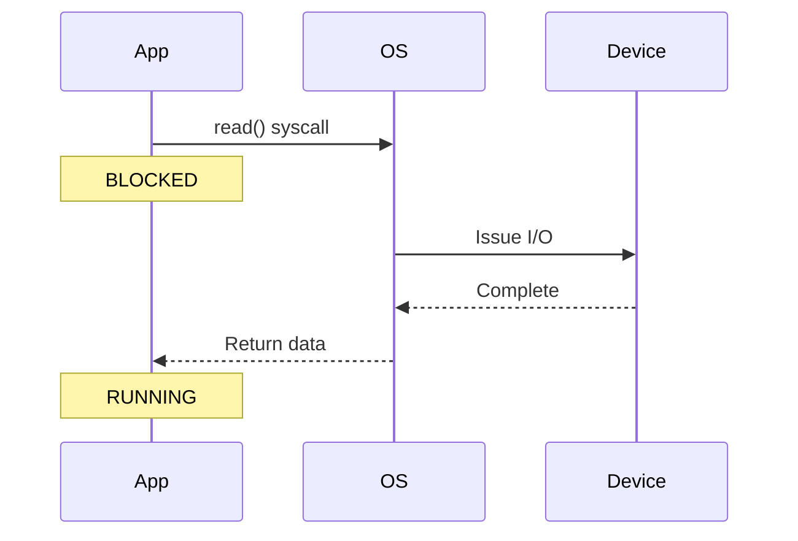
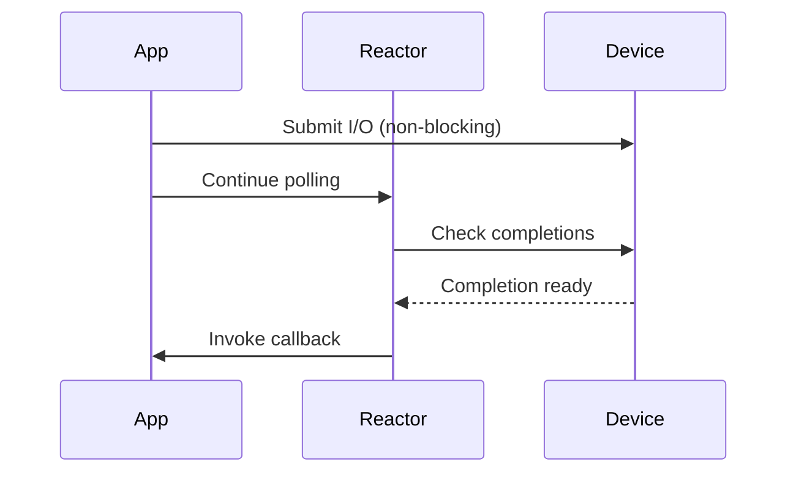
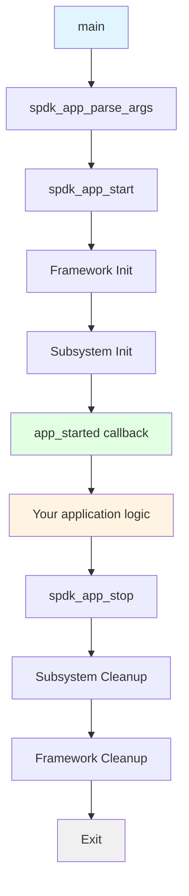
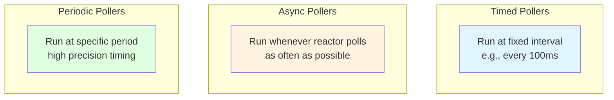
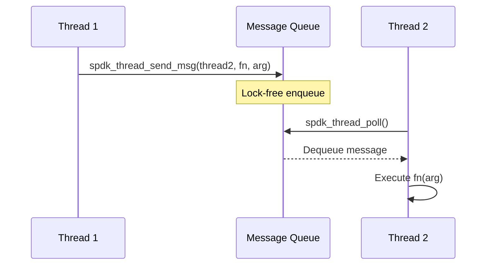
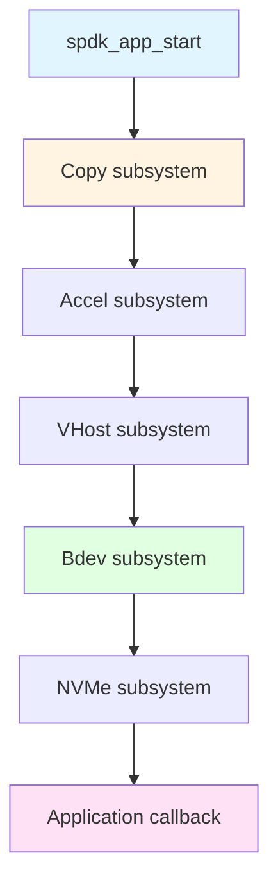

# Module 12: Event Framework

**Stage**: 2 (Implementation)
**Difficulty**: Intermediate
**Estimated Time**: 4 hours
**Prerequisites**: Modules 01-11

---

## Learning Objectives

- Understand SPDK's event-driven programming model
- Use the spdk_app framework for application structure
- Create and manage pollers (timed and async)
- Submit events across threads
- Initialize subsystems properly
- Set up JSON-RPC server for management

---

## Core Concepts

### Concept 1: Event-Driven Architecture

**Traditional Blocking I/O**:


**SPDK Event-Driven**:


**Key Differences**:

| Aspect | Blocking | Event-Driven |
|--------|----------|--------------|
| I/O submission | Blocks thread | Returns immediately |
| Completion | Blocking wait | Callback invoked |
| Thread usage | One per operation | Shared across many |
| Latency | Higher (context switches) | Lower (polling) |
| Throughput | Limited by threads | Very high |

---

### Concept 2: The spdk_app Framework

**Application Structure**:


**Basic Application Template**:
```c
#include "spdk/stdinc.h"
#include "spdk/event.h"
#include "spdk/log.h"

static void
app_started(void *arg1)
{
    SPDK_NOTICELOG("Application started!\n");

    // Your initialization code here

    // When done, optionally stop:
    // spdk_app_stop(0);
}

static void
app_stopped(void *arg1)
{
    SPDK_NOTICELOG("Application stopped\n");
}

int
main(int argc, char **argv)
{
    struct spdk_app_opts opts = {};
    int rc;

    // Set application name and default config
    spdk_app_opts_init(&opts, sizeof(opts));
    opts.name = "my_app";
    opts.config_file = NULL;  // Or path to JSON config
    opts.reactor_mask = "0x3"; // CPUs 0 and 1
    opts.shutdown_cb = app_stopped;

    // Parse arguments
    rc = spdk_app_parse_args(argc, argv, &opts, "", NULL, NULL, NULL);
    if (rc != 0) {
        return rc;
    }

    // Start the framework
    rc = spdk_app_start(&opts, app_started, NULL);

    // Clean up and return
    spdk_app_fini();
    return rc;
}
```

---

### Concept 3: Pollers

**Poller Types**:



**Poller Callback Signature**:
```c
// Return values:
// SPDK_POLLER_BUSY - did work, call me again soon
// SPDK_POLLER_IDLE - no work, can wait longer
static int
my_poller(void *arg)
{
    struct my_context *ctx = arg;

    // Do some work
    if (work_available(ctx)) {
        process_work(ctx);
        return SPDK_POLLER_BUSY;
    }

    return SPDK_POLLER_IDLE;
}
```

**Creating Pollers**:
```c
#include "spdk/thread.h"

struct spdk_poller *poller;

// Timed poller: run every 1000 microseconds
poller = SPDK_POLLER_REGISTER(my_poller, ctx, 1000);

// Async poller: run as fast as possible
poller = SPDK_POLLER_REGISTER(my_poller, ctx, 0);

// Later, unregister when done
spdk_poller_unregister(&poller);
```

**Practical Example - Periodic Status Monitor**:
```c
struct status_monitor {
    uint64_t io_count;
    uint64_t last_count;
    struct spdk_poller *poller;
};

static int
status_poller(void *arg)
{
    struct status_monitor *mon = arg;
    uint64_t ios_per_sec;

    ios_per_sec = mon->io_count - mon->last_count;
    mon->last_count = mon->io_count;

    SPDK_NOTICELOG("I/O rate: %lu IOPS\n", ios_per_sec);

    return SPDK_POLLER_BUSY;
}

// In initialization:
struct status_monitor *mon = calloc(1, sizeof(*mon));
mon->poller = SPDK_POLLER_REGISTER(status_poller, mon, 1000000); // 1 second
```

---

### Concept 4: Events and Messages

**Event Submission**:


**Sending Messages Between Threads**:
```c
#include "spdk/thread.h"

static void
work_on_thread2(void *arg)
{
    struct my_data *data = arg;

    SPDK_NOTICELOG("Executing on thread: %s\n",
                   spdk_thread_get_name(spdk_get_thread()));

    // Do work on thread 2
    process_data(data);
}

// From thread 1, send work to thread 2
void
send_work_to_thread2(struct spdk_thread *thread2, struct my_data *data)
{
    spdk_thread_send_msg(thread2, work_on_thread2, data);
}
```

**Critical Message Passing**:
```c
// Use for operations that MUST execute
static void
critical_work(void *arg)
{
    // This will execute even during shutdown
}

spdk_thread_send_critical_msg(target_thread, critical_work, arg);
```

---

### Concept 5: Subsystem Framework

**Subsystem Initialization Order**:


**Built-in Subsystems**:

| Subsystem | Purpose | Dependencies |
|-----------|---------|--------------|
| copy | Accelerator framework | None |
| bdev | Block device layer | copy |
| nvme | NVMe driver | - |
| nvmf | NVMe-oF target | bdev |
| vhost | Vhost target | bdev |
| iscsi | iSCSI target | bdev, scsi |

**Checking Subsystem State**:
```c
#include "spdk/init.h"

static void
subsystems_initialized(int rc, void *arg)
{
    if (rc != 0) {
        SPDK_ERRLOG("Subsystem init failed: %d\n", rc);
        spdk_app_stop(-1);
        return;
    }

    SPDK_NOTICELOG("All subsystems ready\n");
    // Start your application logic
}

// In app_started callback:
spdk_subsystem_init(subsystems_initialized, NULL);
```

---

## SPDK Application APIs

### API 1: Application Lifecycle

**spdk_app_opts**:
```c
struct spdk_app_opts {
    const char *name;              // Application name
    const char *json_config_file;  // JSON-RPC config file
    const char *rpc_addr;          // RPC listen address (default: /var/tmp/spdk.sock)
    const char *reactor_mask;      // CPU core mask (e.g., "0x3" for cores 0,1)
    int shm_id;                    // Shared memory ID (-1 for auto)
    spdk_app_shutdown_cb shutdown_cb;
    spdk_msg_fn usr1_handler;      // SIGUSR1 handler
    bool enable_coredump;          // Allow core dumps
    int mem_channel;               // DPDK memory channels
    int main_core;                 // Main lcore
    int mem_size;                  // Memory pool size in MB (-1 for all)
    bool no_pci;                   // Don't use PCI devices
    bool hugepage_single_segments; // Use single-file segments
    uint64_t tpoint_group_mask;    // Tracepoint group mask
};
```

**Initialization**:
```c
struct spdk_app_opts opts = {};

// Initialize with defaults
spdk_app_opts_init(&opts, sizeof(opts));

// Customize
opts.name = "my_storage_app";
opts.reactor_mask = "0xF";  // Use CPUs 0-3
opts.rpc_addr = "/tmp/my_app.sock";
opts.mem_size = 2048;  // 2GB memory

int rc = spdk_app_parse_args(argc, argv, &opts, "", NULL,
                              parse_arg, usage);
```

---

### API 2: Poller Management

**SPDK_POLLER_REGISTER**:
```c
struct spdk_poller *
SPDK_POLLER_REGISTER(spdk_poller_fn fn, void *arg, uint64_t period_microseconds);

// Example: Run every 100ms
poller = SPDK_POLLER_REGISTER(my_callback, ctx, 100000);

// Example: Run continuously (period = 0)
poller = SPDK_POLLER_REGISTER(fast_callback, ctx, 0);
```

**spdk_poller_unregister**:
```c
void spdk_poller_unregister(struct spdk_poller **ppoller);

// Unregister and set to NULL
spdk_poller_unregister(&my_poller);
```

**spdk_poller_pause/resume**:
```c
void spdk_poller_pause(struct spdk_poller *poller);
void spdk_poller_resume(struct spdk_poller *poller);

// Temporarily stop polling
spdk_poller_pause(poller);

// Resume later
spdk_poller_resume(poller);
```

---

### API 3: Thread Operations

**spdk_get_thread**:
```c
struct spdk_thread *spdk_get_thread(void);

// Get current thread
struct spdk_thread *thread = spdk_get_thread();
const char *name = spdk_thread_get_name(thread);
```

**spdk_thread_send_msg**:
```c
int spdk_thread_send_msg(struct spdk_thread *thread,
                         spdk_msg_fn fn, void *ctx);

// Send message to specific thread
spdk_thread_send_msg(target_thread, my_callback, my_data);
```

**Thread-local Context**:
```c
void *spdk_thread_get_ctx(struct spdk_thread *thread);
int spdk_thread_set_ctx(struct spdk_thread *thread, void *ctx);

// Store application-specific data
struct my_thread_ctx *ctx = malloc(sizeof(*ctx));
spdk_thread_set_ctx(thread, ctx);

// Retrieve later
struct my_thread_ctx *ctx = spdk_thread_get_ctx(thread);
```

---

## Common Patterns

### Pattern 1: Application with Poller

```c
#include "spdk/stdinc.h"
#include "spdk/event.h"
#include "spdk/thread.h"

struct app_context {
    struct spdk_poller *poller;
    uint64_t tick_count;
};

static int
tick_poller(void *arg)
{
    struct app_context *ctx = arg;

    ctx->tick_count++;
    SPDK_NOTICELOG("Tick %lu\n", ctx->tick_count);

    if (ctx->tick_count >= 10) {
        SPDK_NOTICELOG("Done, stopping\n");
        spdk_poller_unregister(&ctx->poller);
        spdk_app_stop(0);
        return SPDK_POLLER_IDLE;
    }

    return SPDK_POLLER_BUSY;
}

static void
app_started(void *arg1)
{
    struct app_context *ctx = calloc(1, sizeof(*ctx));

    // Register poller for 1-second ticks
    ctx->poller = SPDK_POLLER_REGISTER(tick_poller, ctx, 1000000);

    SPDK_NOTICELOG("Application started\n");
}

int main(int argc, char **argv)
{
    struct spdk_app_opts opts = {};
    int rc;

    spdk_app_opts_init(&opts, sizeof(opts));
    opts.name = "tick_app";

    rc = spdk_app_start(&opts, app_started, NULL);
    spdk_app_fini();

    return rc;
}
```

---

### Pattern 2: Multi-Thread Coordination

```c
struct work_item {
    void (*callback)(void *arg);
    void *arg;
};

static void
execute_work(void *arg)
{
    struct work_item *work = arg;

    work->callback(work->arg);
    free(work);
}

void
dispatch_work_to_thread(struct spdk_thread *thread,
                       void (*callback)(void *), void *arg)
{
    struct work_item *work = malloc(sizeof(*work));

    work->callback = callback;
    work->arg = arg;

    spdk_thread_send_msg(thread, execute_work, work);
}
```

---

### Pattern 3: JSON-RPC Setup

```c
#include "spdk/rpc.h"
#include "spdk/json.h"

struct rpc_hello_world {
    char *name;
};

static void
free_rpc_hello_world(struct rpc_hello_world *req)
{
    free(req->name);
}

static const struct spdk_json_object_decoder rpc_hello_world_decoders[] = {
    {"name", offsetof(struct rpc_hello_world, name), spdk_json_decode_string},
};

static void
rpc_hello_world(struct spdk_jsonrpc_request *request,
                const struct spdk_json_val *params)
{
    struct rpc_hello_world req = {};
    struct spdk_json_write_ctx *w;

    if (spdk_json_decode_object(params, rpc_hello_world_decoders,
                                SPDK_COUNTOF(rpc_hello_world_decoders),
                                &req)) {
        spdk_jsonrpc_send_error_response(request, SPDK_JSONRPC_ERROR_INVALID_PARAMS,
                                        "Invalid parameters");
        return;
    }

    w = spdk_jsonrpc_begin_result(request);
    spdk_json_write_object_begin(w);
    spdk_json_write_named_string(w, "message", "Hello");
    spdk_json_write_named_string(w, "name", req.name);
    spdk_json_write_object_end(w);
    spdk_jsonrpc_end_result(request, w);

    free_rpc_hello_world(&req);
}
SPDK_RPC_REGISTER("hello_world", rpc_hello_world, SPDK_RPC_RUNTIME)
```

**Using the RPC**:
```bash
# Call from command line
scripts/rpc.py hello_world -n "SPDK"

# Response:
# {
#   "message": "Hello",
#   "name": "SPDK"
# }
```

---

## Exercises

### Exercise 1: Timer Application

Create an application that:
1. Starts with spdk_app framework
2. Creates a 500ms poller
3. Prints timestamp each tick
4. Stops after 10 ticks

### Exercise 2: Multi-Thread Echo

Create an application with 2 threads where:
1. Thread 1 sends messages to Thread 2
2. Thread 2 echoes them back
3. Stop after 5 round trips

### Exercise 3: RPC Method

Add a custom RPC method that:
1. Accepts a number parameter
2. Returns the square of that number
3. Test with scripts/rpc.py

---

## Summary

**Key Takeaways**:
1. spdk_app framework handles initialization/cleanup
2. Pollers enable event-driven programming
3. Messages provide thread communication
4. Subsystems initialize in dependency order
5. JSON-RPC enables runtime management

**Next Steps**:
- Module 13: Bdev Layer (using the event framework)
- Practice with pollers and events
- Explore RPC methods in SPDK source

---

## References

- `lib/event/app.c` - spdk_app implementation
- `lib/thread/thread.c` - Thread and poller implementation
- `include/spdk/event.h` - Event framework API
- `include/spdk/thread.h` - Thread API
- `include/spdk/rpc.h` - JSON-RPC API
- `examples/hello_world/` - Complete example application
