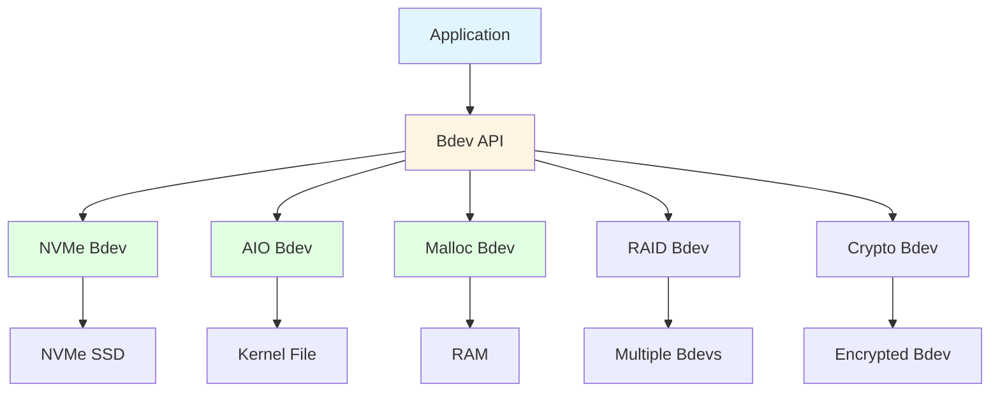
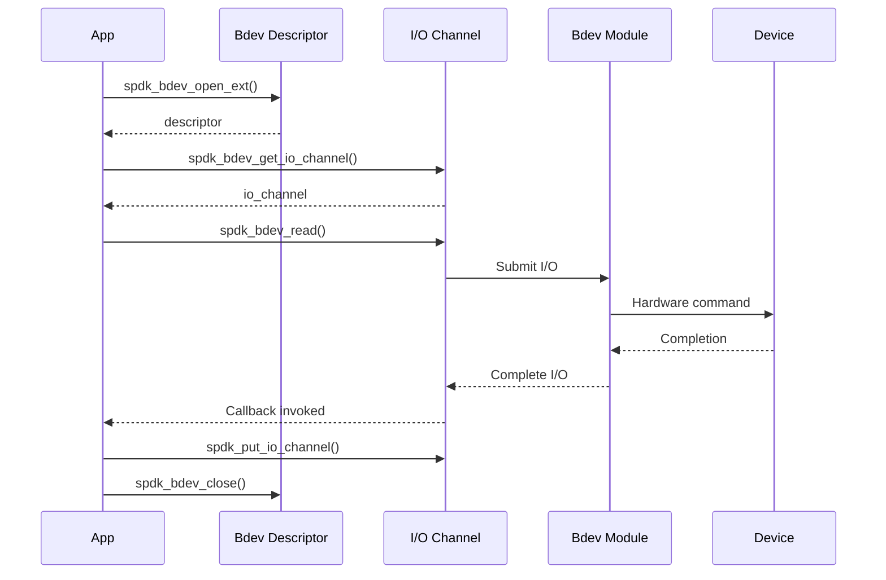
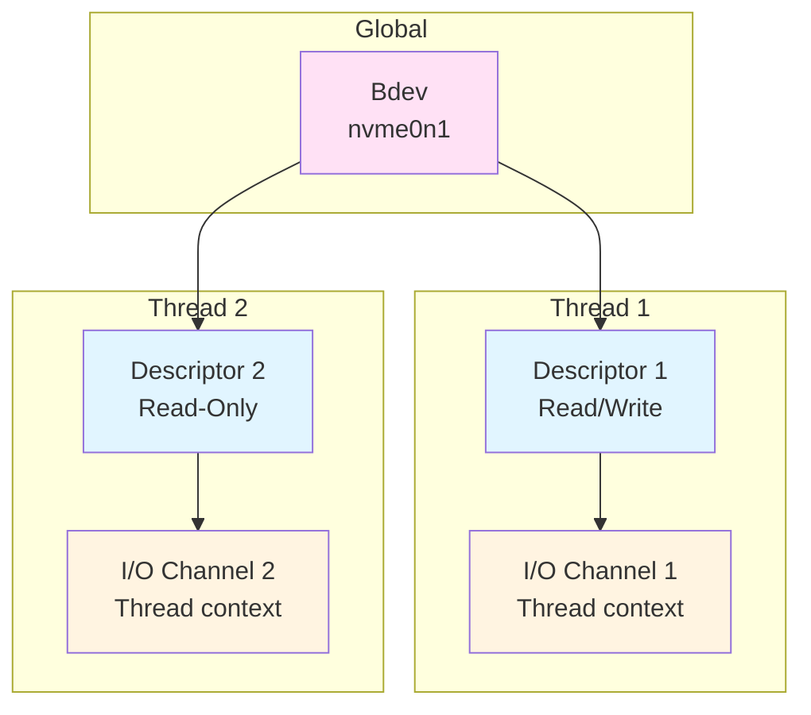

# Module 13: Bdev Layer

**Stage**: 2 (Implementation)
**Difficulty**: Intermediate
**Estimated Time**: 4 hours
**Prerequisites**: Modules 01-12

---

## Learning Objectives

- Understand the Bdev (Block Device) abstraction layer
- Open and use bdevs in applications
- Perform I/O operations (read/write)
- Handle I/O completions properly
- Use bdev descriptors and I/O channels
- Implement error handling for I/O
- Work with bdev examine and claims

---

## Core Concepts

### Concept 1: Bdev Abstraction

**Purpose**: Uniform interface for all storage backends.



**Key Benefits**:
- **Portability**: Same code works with any backend
- **Flexibility**: Easy to switch storage types
- **Layering**: Stack bdevs (RAID on NVMe, Crypto on RAID)
- **Testing**: Use malloc bdevs for unit tests

---

### Concept 2: Bdev Operations Flow



---

### Concept 3: Bdev, Descriptor, and Channel

**Relationships**:


**Definitions**:
- **Bdev**: Global object representing the block device
- **Descriptor**: Handle with specific access permissions (R/W or R/O)
- **Channel**: Per-thread I/O context (queue pair, etc.)

---

## Bdev API Usage

### API 1: Opening and Closing Bdevs

**spdk_bdev_open_ext**:
```c
#include "spdk/bdev.h"

struct spdk_bdev_desc *desc;
struct spdk_bdev *bdev;
int rc;

// Open for read/write
rc = spdk_bdev_open_ext("nvme0n1", true, event_cb, NULL, &desc);
if (rc != 0) {
    SPDK_ERRLOG("Failed to open bdev: %d\n", rc);
    return rc;
}

// Get bdev from descriptor
bdev = spdk_bdev_desc_get_bdev(desc);

SPDK_NOTICELOG("Opened %s: %lu blocks of %u bytes\n",
               spdk_bdev_get_name(bdev),
               spdk_bdev_get_num_blocks(bdev),
               spdk_bdev_get_block_size(bdev));
```

**Event Callback**:
```c
static void
event_cb(enum spdk_bdev_event_type type, struct spdk_bdev *bdev,
         void *event_ctx)
{
    SPDK_NOTICELOG("Bdev event: type %d bdev %s\n",
                   type, spdk_bdev_get_name(bdev));

    switch (type) {
    case SPDK_BDEV_EVENT_REMOVE:
        // Bdev is being removed
        SPDK_NOTICELOG("Bdev removed, cleaning up\n");
        cleanup_and_close();
        break;
    case SPDK_BDEV_EVENT_RESIZE:
        // Bdev size changed
        SPDK_NOTICELOG("Bdev resized\n");
        break;
    default:
        break;
    }
}
```

**spdk_bdev_close**:
```c
void
cleanup(struct spdk_bdev_desc *desc, struct spdk_io_channel *ch)
{
    // Put channel first
    if (ch) {
        spdk_put_io_channel(ch);
    }

    // Then close descriptor
    if (desc) {
        spdk_bdev_close(desc);
    }
}
```

---

### API 2: I/O Channels

**spdk_bdev_get_io_channel**:
```c
struct spdk_io_channel *ch;

// Get I/O channel for current thread
ch = spdk_bdev_get_io_channel(desc);
if (ch == NULL) {
    SPDK_ERRLOG("Failed to get I/O channel\n");
    spdk_bdev_close(desc);
    return -1;
}
```

**Why Channels Matter**:
- Each thread needs its own channel
- Channels contain thread-local state (queue pairs, buffers)
- Enables lock-free I/O submission
- Automatic load balancing

---

### API 3: I/O Operations

**spdk_bdev_read**:
```c
void
read_complete(struct spdk_bdev_io *bdev_io, bool success, void *cb_arg)
{
    if (!success) {
        SPDK_ERRLOG("Read failed\n");
    } else {
        SPDK_NOTICELOG("Read completed successfully\n");
        // Process data in buffer
    }

    // Free the I/O
    spdk_bdev_free_io(bdev_io);
}

void
do_read(struct spdk_bdev_desc *desc, struct spdk_io_channel *ch)
{
    void *buf;
    uint64_t offset = 0;  // Block offset
    uint64_t num_blocks = 1;
    int rc;

    // Allocate DMA buffer
    buf = spdk_dma_malloc(512, 512, NULL);
    if (buf == NULL) {
        return;
    }

    // Submit read
    rc = spdk_bdev_read(desc, ch, buf, offset, num_blocks,
                       read_complete, NULL);
    if (rc != 0) {
        SPDK_ERRLOG("Failed to submit read: %d\n", rc);
        spdk_dma_free(buf);
    }
}
```

**spdk_bdev_write**:
```c
void
write_complete(struct spdk_bdev_io *bdev_io, bool success, void *cb_arg)
{
    void *buf = cb_arg;

    if (!success) {
        SPDK_ERRLOG("Write failed\n");
    } else {
        SPDK_NOTICELOG("Write completed\n");
    }

    spdk_dma_free(buf);
    spdk_bdev_free_io(bdev_io);
}

void
do_write(struct spdk_bdev_desc *desc, struct spdk_io_channel *ch,
         uint64_t offset, const void *data, size_t len)
{
    struct spdk_bdev *bdev = spdk_bdev_desc_get_bdev(desc);
    uint32_t block_size = spdk_bdev_get_block_size(bdev);
    uint64_t num_blocks = len / block_size;
    void *buf;
    int rc;

    // Allocate and copy data
    buf = spdk_dma_malloc(len, block_size, NULL);
    memcpy(buf, data, len);

    // Submit write
    rc = spdk_bdev_write(desc, ch, buf, offset, num_blocks,
                        write_complete, buf);
    if (rc != 0) {
        SPDK_ERRLOG("Failed to submit write: %d\n", rc);
        spdk_dma_free(buf);
    }
}
```

**spdk_bdev_write_zeroes**:
```c
// Efficient zero-fill (uses hardware if available)
rc = spdk_bdev_write_zeroes(desc, ch, offset, num_blocks,
                            completion_cb, NULL);
```

**spdk_bdev_unmap**:
```c
// TRIM/UNMAP for SSDs
rc = spdk_bdev_unmap(desc, ch, offset, num_blocks,
                     completion_cb, NULL);
```

---

### API 4: Bdev Information

**Getting Bdev Properties**:
```c
struct spdk_bdev *bdev = spdk_bdev_desc_get_bdev(desc);

// Basic properties
const char *name = spdk_bdev_get_name(bdev);
uint64_t num_blocks = spdk_bdev_get_num_blocks(bdev);
uint32_t block_size = spdk_bdev_get_block_size(bdev);
uint64_t size_bytes = num_blocks * block_size;

// Capabilities
bool supports_unmap = spdk_bdev_io_type_supported(bdev, SPDK_BDEV_IO_TYPE_UNMAP);
bool supports_write_zeroes = spdk_bdev_io_type_supported(bdev,
                                                         SPDK_BDEV_IO_TYPE_WRITE_ZEROES);

// Alignment requirements
uint32_t buf_align = spdk_bdev_get_buf_align(bdev);

// Optimal I/O sizes
uint32_t optimal_blocks = spdk_bdev_get_optimal_io_boundary(bdev);

SPDK_NOTICELOG("Bdev %s:\n"
               "  Size: %lu blocks x %u bytes = %lu bytes\n"
               "  Alignment: %u\n"
               "  Optimal I/O: %u blocks\n"
               "  UNMAP: %s\n"
               "  WRITE_ZEROES: %s\n",
               name, num_blocks, block_size, size_bytes,
               buf_align, optimal_blocks,
               supports_unmap ? "yes" : "no",
               supports_write_zeroes ? "yes" : "no");
```

---

## Common Patterns

### Pattern 1: Simple Read Application

```c
#include "spdk/stdinc.h"
#include "spdk/event.h"
#include "spdk/bdev.h"
#include "spdk/log.h"

struct app_context {
    struct spdk_bdev_desc *desc;
    struct spdk_io_channel *ch;
    void *buf;
};

static void
read_complete(struct spdk_bdev_io *bdev_io, bool success, void *cb_arg)
{
    struct app_context *ctx = cb_arg;

    if (success) {
        SPDK_NOTICELOG("Read successful\n");
        // Print first 64 bytes
        spdk_log_dump(stdout, "Data:", ctx->buf, 64);
    } else {
        SPDK_ERRLOG("Read failed\n");
    }

    spdk_bdev_free_io(bdev_io);
    spdk_dma_free(ctx->buf);
    spdk_put_io_channel(ctx->ch);
    spdk_bdev_close(ctx->desc);
    free(ctx);

    spdk_app_stop(success ? 0 : -1);
}

static void
do_read(void *arg)
{
    struct app_context *ctx = arg;
    struct spdk_bdev *bdev;
    int rc;

    bdev = spdk_bdev_desc_get_bdev(ctx->desc);
    ctx->buf = spdk_dma_malloc(4096, 4096, NULL);

    rc = spdk_bdev_read(ctx->desc, ctx->ch, ctx->buf, 0, 1,
                       read_complete, ctx);
    if (rc != 0) {
        SPDK_ERRLOG("Failed to submit read\n");
        spdk_dma_free(ctx->buf);
        spdk_put_io_channel(ctx->ch);
        spdk_bdev_close(ctx->desc);
        free(ctx);
        spdk_app_stop(-1);
    }
}

static void
bdev_event_cb(enum spdk_bdev_event_type type, struct spdk_bdev *bdev,
              void *event_ctx)
{
    SPDK_WARNLOG("Bdev event: %d\n", type);
}

static void
app_started(void *arg1)
{
    struct app_context *ctx;
    int rc;

    ctx = calloc(1, sizeof(*ctx));

    rc = spdk_bdev_open_ext("Malloc0", true, bdev_event_cb, NULL, &ctx->desc);
    if (rc != 0) {
        SPDK_ERRLOG("Failed to open bdev\n");
        free(ctx);
        spdk_app_stop(-1);
        return;
    }

    ctx->ch = spdk_bdev_get_io_channel(ctx->desc);
    if (ctx->ch == NULL) {
        SPDK_ERRLOG("Failed to get I/O channel\n");
        spdk_bdev_close(ctx->desc);
        free(ctx);
        spdk_app_stop(-1);
        return;
    }

    do_read(ctx);
}

int
main(int argc, char **argv)
{
    struct spdk_app_opts opts = {};
    int rc;

    spdk_app_opts_init(&opts, sizeof(opts));
    opts.name = "bdev_reader";
    opts.json_config_file = "bdev.json";  // Contains Malloc0 config

    rc = spdk_app_start(&opts, app_started, NULL);
    spdk_app_fini();

    return rc;
}
```

**Configuration File (bdev.json)**:
```json
{
  "subsystems": [
    {
      "subsystem": "bdev",
      "config": [
        {
          "method": "bdev_malloc_create",
          "params": {
            "name": "Malloc0",
            "num_blocks": 65536,
            "block_size": 4096
          }
        }
      ]
    }
  ]
}
```

---

### Pattern 2: Sequential I/O with Callbacks

```c
struct io_context {
    struct spdk_bdev_desc *desc;
    struct spdk_io_channel *ch;
    uint64_t current_offset;
    uint64_t total_blocks;
    uint64_t blocks_per_io;
};

static void read_next(struct io_context *io_ctx);

static void
read_complete(struct spdk_bdev_io *bdev_io, bool success, void *cb_arg)
{
    struct io_context *io_ctx = cb_arg;
    void *buf;

    if (!success) {
        SPDK_ERRLOG("I/O failed at offset %lu\n", io_ctx->current_offset);
        spdk_bdev_free_io(bdev_io);
        cleanup_and_exit(io_ctx);
        return;
    }

    // Get buffer from I/O
    buf = spdk_bdev_io_get_buf(bdev_io);

    // Process data
    SPDK_NOTICELOG("Read %lu blocks at offset %lu\n",
                   io_ctx->blocks_per_io, io_ctx->current_offset);

    spdk_bdev_free_io(bdev_io);

    // Move to next chunk
    io_ctx->current_offset += io_ctx->blocks_per_io;

    if (io_ctx->current_offset < io_ctx->total_blocks) {
        // Continue reading
        read_next(io_ctx);
    } else {
        // Done
        SPDK_NOTICELOG("Completed sequential read\n");
        cleanup_and_exit(io_ctx);
    }
}

static void
read_next(struct io_context *io_ctx)
{
    void *buf;
    uint64_t num_blocks;
    int rc;

    // Calculate blocks to read
    num_blocks = spdk_min(io_ctx->blocks_per_io,
                         io_ctx->total_blocks - io_ctx->current_offset);

    // Allocate buffer
    buf = spdk_dma_malloc(num_blocks * 4096, 4096, NULL);

    // Submit I/O
    rc = spdk_bdev_read(io_ctx->desc, io_ctx->ch, buf,
                       io_ctx->current_offset, num_blocks,
                       read_complete, io_ctx);
    if (rc != 0) {
        SPDK_ERRLOG("Failed to submit I/O\n");
        spdk_dma_free(buf);
        cleanup_and_exit(io_ctx);
    }
}
```

---

### Pattern 3: Bdev Iteration

```c
static void
print_bdev_info(struct spdk_bdev *bdev)
{
    SPDK_NOTICELOG("Bdev: %s\n", spdk_bdev_get_name(bdev));
    SPDK_NOTICELOG("  Product: %s\n", spdk_bdev_get_product_name(bdev));
    SPDK_NOTICELOG("  Size: %lu blocks x %u bytes\n",
                   spdk_bdev_get_num_blocks(bdev),
                   spdk_bdev_get_block_size(bdev));
}

static void
enumerate_bdevs(void)
{
    struct spdk_bdev *bdev;

    // Iterate over all bdevs
    bdev = spdk_bdev_first();
    while (bdev != NULL) {
        print_bdev_info(bdev);
        bdev = spdk_bdev_next(bdev);
    }
}

// Or get by name
struct spdk_bdev *bdev = spdk_bdev_get_by_name("nvme0n1");
if (bdev) {
    print_bdev_info(bdev);
}
```

---

## Error Handling

### I/O Error Types

```c
static void
io_complete(struct spdk_bdev_io *bdev_io, bool success, void *cb_arg)
{
    if (!success) {
        enum spdk_bdev_io_status status;

        status = spdk_bdev_io_get_status(bdev_io);

        switch (status) {
        case SPDK_BDEV_IO_STATUS_SUCCESS:
            // Won't happen if success == false
            break;
        case SPDK_BDEV_IO_STATUS_FAILED:
            SPDK_ERRLOG("I/O failed\n");
            break;
        case SPDK_BDEV_IO_STATUS_NVME_ERROR:
            SPDK_ERRLOG("NVMe error\n");
            // Can get detailed NVMe status
            break;
        case SPDK_BDEV_IO_STATUS_SCSI_ERROR:
            SPDK_ERRLOG("SCSI error\n");
            break;
        case SPDK_BDEV_IO_STATUS_ABORTED:
            SPDK_ERRLOG("I/O aborted\n");
            break;
        default:
            SPDK_ERRLOG("Unknown error: %d\n", status);
            break;
        }
    }

    spdk_bdev_free_io(bdev_io);
}
```

---

## Memory Management

### DMA Buffer Allocation

```c
// Allocate DMA-safe buffer
void *buf = spdk_dma_malloc(size, alignment, NULL);

// Allocate from specific socket (NUMA)
void *buf = spdk_dma_malloc_socket(size, alignment, NULL, socket_id);

// Allocate with zeroing
void *buf = spdk_dma_zmalloc(size, alignment, NULL);

// Free
spdk_dma_free(buf);
```

**Important**: Always use spdk_dma_malloc for I/O buffers, not regular malloc!

---

## Exercises

### Exercise 1: Bdev Enumerator

Create an application that:
1. Lists all available bdevs
2. Prints their size, block size, and capabilities
3. Exits cleanly

### Exercise 2: Write and Verify

Create an application that:
1. Writes a pattern to block 0
2. Reads it back
3. Verifies the data matches
4. Reports success/failure

### Exercise 3: Sequential Scanner

Create an application that:
1. Reads a bdev sequentially
2. Counts non-zero blocks
3. Reports statistics at completion

---

## Summary

**Key Concepts**:
1. Bdev provides uniform storage interface
2. Descriptor controls access permissions
3. Channels enable lock-free I/O per thread
4. All I/O is asynchronous with callbacks
5. DMA buffers required for I/O operations

**Best Practices**:
- Always check return codes
- Free I/O in completion callback
- Put channel before closing descriptor
- Use proper buffer alignment
- Handle bdev events (removal, resize)

**Next Steps**:
- Module 14: NVMe Driver (underlying implementation)
- Module 16: Custom Bdev Module (create your own)

---

## References

- `lib/bdev/bdev.c` - Bdev core implementation
- `include/spdk/bdev.h` - Bdev API
- `include/spdk/bdev_module.h` - Bdev module interface
- `examples/bdev/hello_world/` - Complete example
- `module/bdev/` - Built-in bdev modules
