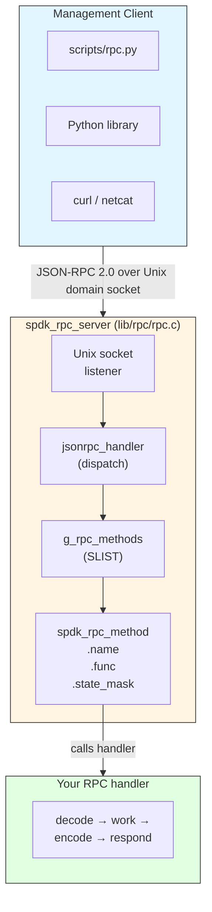

# Module 15: JSON-RPC Interface

**Stage**: 2 (Implementation)
**Difficulty**: Intermediate
**Estimated Time**: 4 hours
**Prerequisites**: Modules 01-14

---

## Learning Objectives

By the end of this module you will be able to:

- Describe the architecture of SPDK's JSON-RPC 2.0 framework
- Register custom RPC methods using `SPDK_RPC_REGISTER`
- Parse request parameters with `spdk_json_decode_object`
- Build structured responses with `spdk_json_write_*` functions
- Implement synchronous and asynchronous RPC handlers
- Use `scripts/rpc.py` and the Python client library programmatically
- Apply proper error reporting using standard JSON-RPC error codes
- Apply security best practices for production RPC deployments
- Implement a complete custom RPC method from scratch

---

## 1. RPC Framework Architecture

### 1.1 Overview

SPDK exposes a **JSON-RPC 2.0** management interface over a Unix domain socket
(default: `/var/tmp/spdk.sock`). Every subsystem that needs runtime
configurability registers its methods at startup via C constructor functions.
The server is polled on the SPDK app thread, keeping the interface single-threaded
and lock-free.



### 1.2 Key Source Files

| File | Purpose |
|------|---------|
| `include/spdk/rpc.h` | Public registration API and state masks |
| `include/spdk/jsonrpc.h` | JSON-RPC 2.0 protocol types and response API |
| `include/spdk/json.h` | JSON encoding/decoding primitives |
| `lib/rpc/rpc.c` | RPC server implementation (dispatch, allowlist) |
| `lib/jsonrpc/` | Low-level JSON-RPC framing over sockets |
| `scripts/rpc.py` | Command-line client |
| `python/spdk/rpc/client.py` | Python `JSONRPCClient` class |

### 1.3 Server Lifecycle

The RPC server is integrated into the SPDK app framework:

```c
/* Simplified from lib/event/app.c */

/* 1. Server starts listening at app startup */
g_rpc_server = spdk_rpc_server_listen("/var/tmp/spdk.sock");

/* 2. An event loop poller calls accept/poll on every reactor cycle */
spdk_rpc_server_accept(g_rpc_server);

/* 3. Subsystems register their RPC methods as C constructors */
/*    (executed before main(), ordered by priority 1000) */

/* 4. After framework_start_init, state transitions STARTUP -> RUNTIME */
spdk_rpc_set_state(SPDK_RPC_RUNTIME);

/* 5. At shutdown */
spdk_rpc_server_close(g_rpc_server);
```

### 1.4 RPC State Machine

The server enforces a two-phase state model. Methods must declare which phase
they are valid in:

```mermaid
stateDiagram-v2
    [*] --> STARTUP: App starts

    state "SPDK_RPC_STARTUP (0x1)" as STARTUP {
        note right of STARTUP
            Only STARTUP or (STARTUP | RUNTIME)
            methods are callable.
            Example: scheduler_set_options,
            sock_impl_set_options
        end note
    }

    STARTUP --> RUNTIME: framework_start_init RPC called

    state "SPDK_RPC_RUNTIME (0x2)" as RUNTIME {
        note right of RUNTIME
            Only RUNTIME or (STARTUP | RUNTIME)
            methods are callable.
            Example: bdev_get_bdevs,
            spdk_kill_instance
        end note
    }
```

The macros that correspond to each phase:

```c
#define SPDK_RPC_STARTUP  0x1   /* callable before framework_start_init */
#define SPDK_RPC_RUNTIME  0x2   /* callable after  framework_start_init */
/* Both phases: SPDK_RPC_STARTUP | SPDK_RPC_RUNTIME */
```

Attempting to call a STARTUP-only method at RUNTIME produces:

```json
{
  "error": {
    "code": -1,
    "message": "Method may only be called before framework is initialized. ..."
  }
}
```

---

## 2. Registering RPC Methods

### 2.1 The SPDK_RPC_REGISTER Macro

```c
/* include/spdk/rpc.h */
#define SPDK_RPC_REGISTER(method, func, state_mask) \
static void __attribute__((constructor(1000))) rpc_register_##func(void) \
{ \
    spdk_rpc_register_method(method, func, state_mask); \
}
```

The `__attribute__((constructor(1000)))` means the function runs automatically
before `main()`, at priority 1000. This is why you never need to call any
"register_all_rpcs" function — the linker arranges it.

The underlying registry is a singly-linked list (`SLIST`) in `lib/rpc/rpc.c`:

```c
struct spdk_rpc_method {
    const char              *name;
    spdk_rpc_method_handler  func;
    SLIST_ENTRY(spdk_rpc_method) slist;
    uint32_t                 state_mask;
    bool                     is_deprecated;
    struct spdk_rpc_method  *is_alias_of;
    bool                     deprecation_warning_printed;
};
```

### 2.2 Handler Function Signature

Every RPC handler has the same prototype:

```c
typedef void (*spdk_rpc_method_handler)(struct spdk_jsonrpc_request *request,
                                        const struct spdk_json_val *params);
```

- `request` — opaque handle; pass to `spdk_jsonrpc_begin_result()` or
  `spdk_jsonrpc_send_error_response()`.
- `params` — parsed JSON value for the `"params"` field; `NULL` if the caller
  did not send parameters.

The handler **must** respond exactly once. Failing to respond leaks the request
object and hangs the client.

### 2.3 Deprecated Aliases

When you rename an RPC method, register the old name as a deprecated alias so
existing scripts keep working:

```c
/* New canonical name */
SPDK_RPC_REGISTER("bdev_malloc_create", rpc_bdev_malloc_create, SPDK_RPC_RUNTIME)

/* Old name — emits a WARN log on first use */
SPDK_RPC_REGISTER_ALIAS_DEPRECATED(bdev_malloc_create, construct_malloc_bdev)
```

---

## 3. Request Parameter Parsing

### 3.1 JSON Decoder Infrastructure

SPDK provides a declarative decoder table that maps JSON object fields to
C struct members by offset:

```c
struct spdk_json_object_decoder {
    const char    *name;         /* JSON field name */
    size_t         offset;       /* offsetof() into your struct */
    spdk_json_decode_fn decoder; /* type-specific decode function */
    bool           optional;     /* true = field may be absent */
};
```

Built-in decoder functions:

| Decoder | C type |
|---------|--------|
| `spdk_json_decode_string` | `char *` (heap-allocated, caller frees) |
| `spdk_json_decode_bool` | `bool` |
| `spdk_json_decode_int32` | `int32_t` |
| `spdk_json_decode_uint32` | `uint32_t` |
| `spdk_json_decode_int64` | `int64_t` |
| `spdk_json_decode_uint64` | `uint64_t` |
| `spdk_json_decode_object` | nested struct (recursive) |
| `spdk_json_decode_array` | array iteration |

### 3.2 Decoding a Simple Object

```c
struct rpc_set_threshold {
    uint32_t  threshold_mb;
    bool      enable_alerts;
    char     *label;          /* optional */
};

/* Decoder table — order matches JSON; optional fields marked true */
static const struct spdk_json_object_decoder rpc_set_threshold_decoders[] = {
    {"threshold_mb",   offsetof(struct rpc_set_threshold, threshold_mb),
     spdk_json_decode_uint32},
    {"enable_alerts",  offsetof(struct rpc_set_threshold, enable_alerts),
     spdk_json_decode_bool},
    {"label",          offsetof(struct rpc_set_threshold, label),
     spdk_json_decode_string, true},   /* optional */
};

static void
free_rpc_set_threshold(struct rpc_set_threshold *req)
{
    free(req->label);   /* safe even if NULL */
}

static void
rpc_set_threshold(struct spdk_jsonrpc_request *request,
                  const struct spdk_json_val *params)
{
    struct rpc_set_threshold req = {};

    /* Require params to be present */
    if (params == NULL) {
        spdk_jsonrpc_send_error_response(request,
            SPDK_JSONRPC_ERROR_INVALID_PARAMS,
            "Parameters required");
        return;
    }

    if (spdk_json_decode_object(params, rpc_set_threshold_decoders,
                                SPDK_COUNTOF(rpc_set_threshold_decoders),
                                &req)) {
        SPDK_ERRLOG("spdk_json_decode_object failed\n");
        spdk_jsonrpc_send_error_response(request,
            SPDK_JSONRPC_ERROR_INVALID_PARAMS,
            "Invalid parameters");
        free_rpc_set_threshold(&req);
        return;
    }

    /* Validate business rules */
    if (req.threshold_mb == 0) {
        spdk_jsonrpc_send_error_response(request,
            SPDK_JSONRPC_ERROR_INVALID_PARAMS,
            "threshold_mb must be > 0");
        free_rpc_set_threshold(&req);
        return;
    }

    /* Apply the setting */
    g_threshold_mb   = req.threshold_mb;
    g_enable_alerts  = req.enable_alerts;

    free_rpc_set_threshold(&req);
    spdk_jsonrpc_send_bool_response(request, true);
}
SPDK_RPC_REGISTER("set_threshold", rpc_set_threshold, SPDK_RPC_RUNTIME)
```

### 3.3 Nested Objects

```c
struct rpc_qos_limits {
    uint64_t read_iops;
    uint64_t write_iops;
};

struct rpc_create_volume {
    char              *name;
    uint64_t           size_mb;
    struct rpc_qos_limits qos;
};

static const struct spdk_json_object_decoder rpc_qos_decoders[] = {
    {"read_iops",  offsetof(struct rpc_qos_limits, read_iops),
     spdk_json_decode_uint64, true},
    {"write_iops", offsetof(struct rpc_qos_limits, write_iops),
     spdk_json_decode_uint64, true},
};

/* Wrapper: decode nested QoS object */
static int
decode_qos(const struct spdk_json_val *val, void *out)
{
    return spdk_json_decode_object(val, rpc_qos_decoders,
                                   SPDK_COUNTOF(rpc_qos_decoders), out);
}

static const struct spdk_json_object_decoder rpc_create_volume_decoders[] = {
    {"name",    offsetof(struct rpc_create_volume, name),
     spdk_json_decode_string},
    {"size_mb", offsetof(struct rpc_create_volume, size_mb),
     spdk_json_decode_uint64},
    {"qos",     offsetof(struct rpc_create_volume, qos),
     decode_qos, true},
};
```

### 3.4 Checking for Extra / Unknown Fields

`spdk_json_decode_object` returns non-zero on any failure, including unknown
required fields. Unknown optional fields are silently ignored. This means you
should always check the return value and report the error cleanly rather than
silently continuing with default values.

---

## 4. Building Responses

### 4.1 Response Lifecycle

Every RPC handler must call exactly one of:

1. `spdk_jsonrpc_begin_result()` followed by `spdk_jsonrpc_end_result()` — for success.
2. `spdk_jsonrpc_send_bool_response()` — shortcut for `true`/`false` results.
3. `spdk_jsonrpc_send_error_response()` — for failures.
4. `spdk_jsonrpc_send_error_response_fmt()` — printf-style error messages.

### 4.2 Writing Primitive Values

```c
struct spdk_json_write_ctx *w = spdk_jsonrpc_begin_result(request);

/* Primitives */
spdk_json_write_null(w);
spdk_json_write_bool(w, true);
spdk_json_write_int32(w, -42);
spdk_json_write_uint32(w, 4096u);
spdk_json_write_uint64(w, UINT64_MAX);
spdk_json_write_double(w, 3.14);
spdk_json_write_string(w, "hello");
spdk_json_write_string_fmt(w, "value-%d", idx);   /* printf style */
spdk_json_write_bytearray(w, buf, len);            /* base64 encoded */
spdk_json_write_uuid(w, &uuid);

spdk_jsonrpc_end_result(request, w);
```

### 4.3 Writing Objects

```c
w = spdk_jsonrpc_begin_result(request);
spdk_json_write_object_begin(w);

spdk_json_write_named_string(w,  "name",    dev->name);
spdk_json_write_named_uint64(w,  "size_mb", dev->size_mb);
spdk_json_write_named_bool(w,    "active",  dev->active);
spdk_json_write_named_int32(w,   "numa",    dev->numa_node);
spdk_json_write_named_null(w,    "parent");  /* explicit null */

spdk_json_write_object_end(w);
spdk_jsonrpc_end_result(request, w);
```

### 4.4 Writing Arrays

```c
w = spdk_jsonrpc_begin_result(request);
spdk_json_write_array_begin(w);

TAILQ_FOREACH(dev, &g_devices, link) {
    spdk_json_write_object_begin(w);
    spdk_json_write_named_string(w, "name",  dev->name);
    spdk_json_write_named_uint64(w, "iops",  dev->stats.iops);
    spdk_json_write_named_uint64(w, "bw_mb", dev->stats.bw_mb);
    spdk_json_write_object_end(w);
}

spdk_json_write_array_end(w);
spdk_jsonrpc_end_result(request, w);
```

### 4.5 Named Nested Structures

```c
w = spdk_jsonrpc_begin_result(request);
spdk_json_write_object_begin(w);

spdk_json_write_named_string(w, "name", vol->name);

/* Nested object for QoS */
spdk_json_write_named_object_begin(w, "qos");
spdk_json_write_named_uint64(w, "read_iops",  vol->qos.read_iops);
spdk_json_write_named_uint64(w, "write_iops", vol->qos.write_iops);
spdk_json_write_object_end(w);

/* Nested array for tags */
spdk_json_write_named_array_begin(w, "tags");
for (i = 0; i < vol->num_tags; i++) {
    spdk_json_write_string(w, vol->tags[i]);
}
spdk_json_write_array_end(w);

spdk_json_write_object_end(w);
spdk_jsonrpc_end_result(request, w);
```

---

## 5. Error Reporting

### 5.1 Standard JSON-RPC Error Codes

These codes are defined in `include/spdk/jsonrpc.h`:

| Constant | Code | When to use |
|----------|------|-------------|
| `SPDK_JSONRPC_ERROR_PARSE_ERROR` | -32700 | Malformed JSON (set by framework) |
| `SPDK_JSONRPC_ERROR_INVALID_REQUEST` | -32600 | Missing required JSON-RPC fields |
| `SPDK_JSONRPC_ERROR_METHOD_NOT_FOUND` | -32601 | Unknown method name |
| `SPDK_JSONRPC_ERROR_INVALID_PARAMS` | -32602 | Parameter validation failure |
| `SPDK_JSONRPC_ERROR_INTERNAL_ERROR` | -32603 | Unexpected internal failure |
| `SPDK_JSONRPC_ERROR_INVALID_STATE` | -1 | Method called in wrong RPC state |

### 5.2 Sending Errors

```c
/* Simple string message */
spdk_jsonrpc_send_error_response(request,
    SPDK_JSONRPC_ERROR_INVALID_PARAMS,
    "name parameter must not be empty");

/* printf-style formatted message */
spdk_jsonrpc_send_error_response_fmt(request,
    SPDK_JSONRPC_ERROR_INVALID_PARAMS,
    "device '%s' not found (checked %d entries)",
    req.name, count);

/* Map errno to an appropriate message */
if (rc == -ENOENT) {
    spdk_jsonrpc_send_error_response_fmt(request,
        SPDK_JSONRPC_ERROR_INVALID_PARAMS,
        "device '%s' does not exist: %s",
        req.name, spdk_strerror(-rc));
} else if (rc == -ENOMEM) {
    spdk_jsonrpc_send_error_response(request,
        SPDK_JSONRPC_ERROR_INTERNAL_ERROR,
        "out of memory");
} else {
    spdk_jsonrpc_send_error_response_fmt(request,
        SPDK_JSONRPC_ERROR_INTERNAL_ERROR,
        "operation failed: %s", spdk_strerror(-rc));
}
```

### 5.3 Error Handling Patterns from Real SPDK Code

The pattern from `lib/event/app_rpc.c` (kill instance handler) is exemplary:

```c
/* 1. Declare a free helper for any heap-allocated fields */
static void
free_rpc_my_method(struct rpc_my_method *req)
{
    free(req->name);   /* safe on NULL */
    free(req->path);
}

/* 2. Use goto for cleanup to avoid duplicating the free call */
static void
rpc_my_method(struct spdk_jsonrpc_request *request,
              const struct spdk_json_val *params)
{
    struct rpc_my_method req = {};
    int rc;

    if (spdk_json_decode_object(params, decoders,
                                SPDK_COUNTOF(decoders), &req)) {
        goto invalid;
    }

    rc = do_the_work(&req);
    if (rc != 0) {
        spdk_jsonrpc_send_error_response_fmt(request,
            SPDK_JSONRPC_ERROR_INTERNAL_ERROR,
            "work failed: %s", spdk_strerror(-rc));
        goto cleanup;
    }

    spdk_jsonrpc_send_bool_response(request, true);
    goto cleanup;

invalid:
    spdk_jsonrpc_send_error_response(request,
        SPDK_JSONRPC_ERROR_INVALID_PARAMS,
        "Invalid parameters");
cleanup:
    free_rpc_my_method(&req);
}
```

---

## 6. Asynchronous RPC Methods

Many SPDK operations complete asynchronously. The RPC handler must preserve the
`request` pointer in a context structure and respond only from the completion
callback.

### 6.1 Basic Async Pattern

```c
struct rpc_format_ctx {
    struct spdk_jsonrpc_request *request;
    char                        *bdev_name;
};

static void
rpc_bdev_format_complete(void *arg, int bserrno)
{
    struct rpc_format_ctx *ctx = arg;

    if (bserrno != 0) {
        spdk_jsonrpc_send_error_response_fmt(ctx->request,
            SPDK_JSONRPC_ERROR_INTERNAL_ERROR,
            "format failed: %s", spdk_strerror(-bserrno));
    } else {
        spdk_jsonrpc_send_bool_response(ctx->request, true);
    }

    free(ctx->bdev_name);
    free(ctx);
}

struct rpc_format_bdev_args {
    char    *name;
    uint32_t block_size;
};

static const struct spdk_json_object_decoder rpc_format_bdev_decoders[] = {
    {"name",       offsetof(struct rpc_format_bdev_args, name),
     spdk_json_decode_string},
    {"block_size", offsetof(struct rpc_format_bdev_args, block_size),
     spdk_json_decode_uint32, true},
};

static void
rpc_format_bdev(struct spdk_jsonrpc_request *request,
                const struct spdk_json_val *params)
{
    struct rpc_format_bdev_args args = {.block_size = 4096};
    struct rpc_format_ctx *ctx;

    if (params == NULL ||
        spdk_json_decode_object(params, rpc_format_bdev_decoders,
                                SPDK_COUNTOF(rpc_format_bdev_decoders),
                                &args)) {
        spdk_jsonrpc_send_error_response(request,
            SPDK_JSONRPC_ERROR_INVALID_PARAMS, "Invalid parameters");
        free(args.name);
        return;
    }

    ctx = calloc(1, sizeof(*ctx));
    if (ctx == NULL) {
        spdk_jsonrpc_send_error_response(request,
            SPDK_JSONRPC_ERROR_INTERNAL_ERROR, "out of memory");
        free(args.name);
        return;
    }

    ctx->request   = request;
    ctx->bdev_name = args.name;   /* transfer ownership */

    /* Launch async operation — do NOT respond here */
    my_bdev_format(ctx->bdev_name, args.block_size,
                   rpc_bdev_format_complete, ctx);
}
SPDK_RPC_REGISTER("format_bdev", rpc_format_bdev, SPDK_RPC_RUNTIME)
```

### 6.2 Handling Async Cancellation

If the client disconnects before the response is sent, SPDK will internally
free the request object. Your completion callback must still call
`spdk_jsonrpc_send_*` — the framework handles the no-op case safely.

---

## 7. Configuration Management via RPC

### 7.1 Startup Configuration (SPDK_RPC_STARTUP)

Startup-only RPC methods configure the framework before reactor threads begin.
Register these with `SPDK_RPC_STARTUP`:

```c
struct rpc_set_core_mask {
    char *mask;
};

static const struct spdk_json_object_decoder rpc_set_core_mask_decoders[] = {
    {"mask", offsetof(struct rpc_set_core_mask, mask), spdk_json_decode_string},
};

static void
rpc_set_core_mask(struct spdk_jsonrpc_request *request,
                  const struct spdk_json_val *params)
{
    struct rpc_set_core_mask req = {};

    if (spdk_json_decode_object(params, rpc_set_core_mask_decoders,
                                SPDK_COUNTOF(rpc_set_core_mask_decoders),
                                &req)) {
        spdk_jsonrpc_send_error_response(request,
            SPDK_JSONRPC_ERROR_INVALID_PARAMS, "Invalid parameters");
        return;
    }

    g_core_mask = req.mask;   /* applied before reactors start */
    spdk_jsonrpc_send_bool_response(request, true);
}
SPDK_RPC_REGISTER("set_core_mask", rpc_set_core_mask, SPDK_RPC_STARTUP)
```

To exercise startup-only RPCs, launch SPDK with `--wait-for-rpc`:

```bash
./build/bin/spdk_tgt --wait-for-rpc &
sleep 1
./scripts/rpc.py set_core_mask --mask 0x3
./scripts/rpc.py framework_start_init
```

### 7.2 Runtime Configuration Export

A common pattern is exporting the current configuration as a JSON document
that can be fed back on next startup:

```c
static void
rpc_export_config(struct spdk_jsonrpc_request *request,
                  const struct spdk_json_val *params)
{
    struct spdk_json_write_ctx *w;
    struct my_volume *vol;

    w = spdk_jsonrpc_begin_result(request);
    spdk_json_write_object_begin(w);

    spdk_json_write_named_array_begin(w, "volumes");
    TAILQ_FOREACH(vol, &g_volumes, link) {
        spdk_json_write_object_begin(w);
        spdk_json_write_named_string(w,  "name",     vol->name);
        spdk_json_write_named_uint64(w,  "size_mb",  vol->size_mb);
        spdk_json_write_named_uint32(w,  "block_sz", vol->block_size);
        spdk_json_write_named_bool(w,    "thin_prov", vol->thin_provisioned);
        spdk_json_write_object_end(w);
    }
    spdk_json_write_array_end(w);

    spdk_json_write_named_string(w, "version", "1.0");
    spdk_json_write_object_end(w);
    spdk_jsonrpc_end_result(request, w);
}
SPDK_RPC_REGISTER("export_config", rpc_export_config,
                  SPDK_RPC_STARTUP | SPDK_RPC_RUNTIME)
```

### 7.3 Methods Valid in Both States

Use the bitwise OR to allow a method in both startup and runtime:

```c
SPDK_RPC_REGISTER("log_set_level", rpc_log_set_level,
                  SPDK_RPC_STARTUP | SPDK_RPC_RUNTIME)
```

---

## 8. Common Management Operation Patterns

### 8.1 Create / Destroy

```c
/* CREATE: returns the created object's name */
static void
rpc_volume_create(struct spdk_jsonrpc_request *request,
                  const struct spdk_json_val *params)
{
    /* ... decode params ... */

    vol = volume_create(req.name, req.size_mb);
    if (vol == NULL) {
        spdk_jsonrpc_send_error_response(request,
            SPDK_JSONRPC_ERROR_INTERNAL_ERROR, "create failed");
        goto cleanup;
    }

    struct spdk_json_write_ctx *w = spdk_jsonrpc_begin_result(request);
    spdk_json_write_string(w, vol->name);
    spdk_jsonrpc_end_result(request, w);
cleanup:
    /* free decoded strings */;
}
SPDK_RPC_REGISTER("volume_create", rpc_volume_create, SPDK_RPC_RUNTIME)

/* DESTROY: returns true on success */
static void
rpc_volume_delete(struct spdk_jsonrpc_request *request,
                  const struct spdk_json_val *params)
{
    /* ... decode name ... */

    rc = volume_delete(req.name);
    if (rc != 0) {
        spdk_jsonrpc_send_error_response_fmt(request,
            SPDK_JSONRPC_ERROR_INVALID_PARAMS,
            "volume '%s' not found", req.name);
    } else {
        spdk_jsonrpc_send_bool_response(request, true);
    }
    free(req.name);
}
SPDK_RPC_REGISTER("volume_delete", rpc_volume_delete, SPDK_RPC_RUNTIME)
```

### 8.2 List / Get

```c
/* LIST: returns an array of objects */
static void
rpc_volume_list(struct spdk_jsonrpc_request *request,
                const struct spdk_json_val *params)
{
    struct spdk_json_write_ctx *w;
    struct my_volume *vol;
    char name_filter[256] = {};

    /* Optional filter parameter */
    if (params != NULL) {
        /* try decoding optional name filter */
    }

    w = spdk_jsonrpc_begin_result(request);
    spdk_json_write_array_begin(w);

    TAILQ_FOREACH(vol, &g_volumes, link) {
        if (name_filter[0] && strcmp(vol->name, name_filter) != 0) {
            continue;
        }
        spdk_json_write_object_begin(w);
        spdk_json_write_named_string(w,  "name",    vol->name);
        spdk_json_write_named_uint64(w,  "size_mb", vol->size_mb);
        spdk_json_write_named_bool(w,    "online",  vol->online);
        spdk_json_write_named_uint64(w,  "read_ios",  vol->stats.read_ios);
        spdk_json_write_named_uint64(w,  "write_ios", vol->stats.write_ios);
        spdk_json_write_object_end(w);
    }

    spdk_json_write_array_end(w);
    spdk_jsonrpc_end_result(request, w);
}
SPDK_RPC_REGISTER("volume_list", rpc_volume_list, SPDK_RPC_RUNTIME)
```

### 8.3 Atomic Get + Set (RPC Pair)

Always implement `get` and `set` as separate methods:

```c
SPDK_RPC_REGISTER("volume_get_options",  rpc_volume_get_options, SPDK_RPC_RUNTIME)
SPDK_RPC_REGISTER("volume_set_options",  rpc_volume_set_options, SPDK_RPC_RUNTIME)
```

---

## 9. Using the RPC Client

### 9.1 scripts/rpc.py Command-Line Tool

```bash
# Default socket: /var/tmp/spdk.sock
./scripts/rpc.py <method> [args...]

# Alternate socket
./scripts/rpc.py -s /tmp/my.sock <method>

# TCP target (for remote management)
./scripts/rpc.py -s 192.168.1.10 -p 5260 <method>

# Retry on connection failure (0.2 s between attempts)
./scripts/rpc.py -r 5 bdev_get_bdevs

# Verbose: show JSON request + response
./scripts/rpc.py -v bdev_get_bdevs

# Dry run: print the JSON that would be sent, then exit
./scripts/rpc.py --dry-run bdev_malloc_create -b Malloc0 -n 64 -s 512

# Pipe through jq for pretty output
./scripts/rpc.py bdev_get_bdevs | jq '.[].name'
```

Common built-in commands:

```bash
# Framework
./scripts/rpc.py spdk_get_version
./scripts/rpc.py rpc_get_methods
./scripts/rpc.py rpc_get_methods --current   # only methods valid right now

# Block devices
./scripts/rpc.py bdev_get_bdevs
./scripts/rpc.py bdev_malloc_create -b Malloc0 -n 64 -s 4096
./scripts/rpc.py bdev_malloc_delete -b Malloc0

# Logging
./scripts/rpc.py log_set_level DEBUG
./scripts/rpc.py log_set_flag bdev

# Thread stats
./scripts/rpc.py thread_get_stats
./scripts/rpc.py framework_get_reactors

# Graceful shutdown
./scripts/rpc.py spdk_kill_instance SIGTERM
```

### 9.2 Python Client Library

The library in `python/spdk/rpc/client.py` provides `JSONRPCClient`:

```python
#!/usr/bin/env python3
"""
Example: programmatic SPDK management via Python client library.
"""
import sys
sys.path.insert(0, '/path/to/spdk/python')

from spdk.rpc.client import JSONRPCClient, JSONRPCException

def main():
    with JSONRPCClient('/var/tmp/spdk.sock') as client:
        # Get SPDK version
        version = client.call('spdk_get_version')
        print(f"SPDK {version['version']}")

        # List all bdevs
        bdevs = client.call('bdev_get_bdevs')
        print(f"Found {len(bdevs)} bdevs:")
        for b in bdevs:
            print(f"  {b['name']}  {b['block_size']} B/block  "
                  f"{b['num_blocks']} blocks")

        # Create a malloc bdev
        try:
            result = client.call('bdev_malloc_create', {
                'name': 'TestMalloc',
                'num_blocks': 1024,
                'block_size': 4096,
            })
            print(f"Created bdev: {result}")
        except JSONRPCException as e:
            print(f"Error: {e.message}")

        # Delete it
        client.call('bdev_malloc_delete', {'name': 'TestMalloc'})

if __name__ == '__main__':
    main()
```

### 9.3 Low-Level Raw Socket Client

When you cannot import the SPDK Python library, talk the protocol directly:

```python
#!/usr/bin/env python3
"""
Minimal JSON-RPC 2.0 client using only stdlib.
Suitable for health checks and CI automation.
"""
import json
import socket
import itertools

_id_counter = itertools.count(1)

def rpc_call(socket_path, method, params=None, timeout=10.0):
    """
    Send one JSON-RPC 2.0 request and return the result.
    Raises RuntimeError on JSON-RPC error responses.
    """
    request = {
        'jsonrpc': '2.0',
        'id':      next(_id_counter),
        'method':  method,
    }
    if params is not None:
        request['params'] = params

    with socket.socket(socket.AF_UNIX, socket.SOCK_STREAM) as sock:
        sock.settimeout(timeout)
        sock.connect(socket_path)
        sock.sendall(json.dumps(request).encode())

        # Read until we have a complete JSON object
        buf = b''
        while True:
            chunk = sock.recv(65536)
            if not chunk:
                break
            buf += chunk
            try:
                response = json.loads(buf.decode())
                break
            except json.JSONDecodeError:
                continue  # need more data

    if 'error' in response:
        err = response['error']
        raise RuntimeError(f"RPC error {err['code']}: {err['message']}")

    return response.get('result')


# Usage
SOCK = '/var/tmp/spdk.sock'

ver = rpc_call(SOCK, 'spdk_get_version')
print(f"Version: {ver['version']}")

bdevs = rpc_call(SOCK, 'bdev_get_bdevs')
for b in bdevs:
    size_gb = b['block_size'] * b['num_blocks'] / 1e9
    print(f"  {b['name']:20s}  {size_gb:.1f} GB")
```

### 9.4 Batch Operations with rpc.py --server Mode

For automation scripts that issue many commands, use `--server` mode to reuse
the socket connection:

```bash
#!/bin/bash
# Launch rpc.py in server mode (stdin/stdout pipe)
coproc RPC { ./scripts/rpc.py --server; }

rpc_call() {
    echo "$@" >&"${RPC[1]}"
    # Read until STATUS line
    while IFS= read -r -u "${RPC[0]}" line; do
        case "$line" in
            "**STATUS=0") return 0 ;;
            "**STATUS=1") return 1 ;;
            *) echo "$line" ;;
        esac
    done
}

rpc_call bdev_malloc_create -b M0 -n 1024 -s 4096
rpc_call bdev_malloc_create -b M1 -n 1024 -s 4096
rpc_call bdev_get_bdevs

# Cleanup
kill "${RPC_PID}"
```

---

## 10. Complete Example: Custom Rate-Limiter RPC

This section walks through implementing a complete, production-quality RPC
subsystem for a hypothetical I/O rate limiter.

### 10.1 Data Model

```c
/* rate_limiter.h */
#pragma once
#include <stdint.h>
#include <stdbool.h>
#include "spdk/queue.h"

struct rate_limit_entry {
    char    name[64];
    uint64_t read_iops_limit;
    uint64_t write_iops_limit;
    bool     enabled;
    TAILQ_ENTRY(rate_limit_entry) link;
};

extern TAILQ_HEAD(, rate_limit_entry) g_rate_limits;

struct rate_limit_entry *rate_limit_find(const char *name);
int  rate_limit_create(const char *name, uint64_t read_iops,
                       uint64_t write_iops);
int  rate_limit_delete(const char *name);
int  rate_limit_set_enabled(const char *name, bool enabled);
```

### 10.2 RPC Handler File

```c
/* rate_limiter_rpc.c */
#include "spdk/rpc.h"
#include "spdk/json.h"
#include "spdk/jsonrpc.h"
#include "spdk/util.h"
#include "spdk/log.h"
#include "rate_limiter.h"
#include <string.h>
#include <stdlib.h>

/* ------------------------------------------------------------------ */
/* rate_limit_create                                                   */
/* ------------------------------------------------------------------ */

struct rpc_rate_limit_create {
    char     *name;
    uint64_t  read_iops;
    uint64_t  write_iops;
};

static void
free_rpc_rate_limit_create(struct rpc_rate_limit_create *req)
{
    free(req->name);
}

static const struct spdk_json_object_decoder rpc_rate_limit_create_decoders[] = {
    {"name",       offsetof(struct rpc_rate_limit_create, name),
     spdk_json_decode_string},
    {"read_iops",  offsetof(struct rpc_rate_limit_create, read_iops),
     spdk_json_decode_uint64},
    {"write_iops", offsetof(struct rpc_rate_limit_create, write_iops),
     spdk_json_decode_uint64, true},  /* optional, defaults to 0 = unlimited */
};

static void
rpc_rate_limit_create(struct spdk_jsonrpc_request *request,
                      const struct spdk_json_val *params)
{
    struct rpc_rate_limit_create req = {};
    int rc;

    if (params == NULL ||
        spdk_json_decode_object(params, rpc_rate_limit_create_decoders,
                                SPDK_COUNTOF(rpc_rate_limit_create_decoders),
                                &req)) {
        spdk_jsonrpc_send_error_response(request,
            SPDK_JSONRPC_ERROR_INVALID_PARAMS,
            "name and read_iops are required");
        free_rpc_rate_limit_create(&req);
        return;
    }

    if (req.name[0] == '\0') {
        spdk_jsonrpc_send_error_response(request,
            SPDK_JSONRPC_ERROR_INVALID_PARAMS,
            "name must not be empty");
        free_rpc_rate_limit_create(&req);
        return;
    }

    rc = rate_limit_create(req.name, req.read_iops, req.write_iops);
    if (rc == -EEXIST) {
        spdk_jsonrpc_send_error_response_fmt(request,
            SPDK_JSONRPC_ERROR_INVALID_PARAMS,
            "rate limit '%s' already exists", req.name);
    } else if (rc != 0) {
        spdk_jsonrpc_send_error_response_fmt(request,
            SPDK_JSONRPC_ERROR_INTERNAL_ERROR,
            "create failed: %s", spdk_strerror(-rc));
    } else {
        spdk_jsonrpc_send_bool_response(request, true);
    }

    free_rpc_rate_limit_create(&req);
}
SPDK_RPC_REGISTER("rate_limit_create", rpc_rate_limit_create,
                  SPDK_RPC_RUNTIME)

/* ------------------------------------------------------------------ */
/* rate_limit_delete                                                   */
/* ------------------------------------------------------------------ */

struct rpc_rate_limit_delete {
    char *name;
};

static const struct spdk_json_object_decoder rpc_rate_limit_delete_decoders[] = {
    {"name", offsetof(struct rpc_rate_limit_delete, name),
     spdk_json_decode_string},
};

static void
rpc_rate_limit_delete(struct spdk_jsonrpc_request *request,
                      const struct spdk_json_val *params)
{
    struct rpc_rate_limit_delete req = {};
    int rc;

    if (params == NULL ||
        spdk_json_decode_object(params, rpc_rate_limit_delete_decoders,
                                SPDK_COUNTOF(rpc_rate_limit_delete_decoders),
                                &req)) {
        spdk_jsonrpc_send_error_response(request,
            SPDK_JSONRPC_ERROR_INVALID_PARAMS, "name required");
        return;
    }

    rc = rate_limit_delete(req.name);
    if (rc == -ENOENT) {
        spdk_jsonrpc_send_error_response_fmt(request,
            SPDK_JSONRPC_ERROR_INVALID_PARAMS,
            "rate limit '%s' not found", req.name);
    } else if (rc != 0) {
        spdk_jsonrpc_send_error_response_fmt(request,
            SPDK_JSONRPC_ERROR_INTERNAL_ERROR,
            "delete failed: %s", spdk_strerror(-rc));
    } else {
        spdk_jsonrpc_send_bool_response(request, true);
    }

    free(req.name);
}
SPDK_RPC_REGISTER("rate_limit_delete", rpc_rate_limit_delete,
                  SPDK_RPC_RUNTIME)

/* ------------------------------------------------------------------ */
/* rate_limit_get_limits  (list all)                                   */
/* ------------------------------------------------------------------ */

static void
rpc_rate_limit_get_limits(struct spdk_jsonrpc_request *request,
                          const struct spdk_json_val *params)
{
    struct spdk_json_write_ctx *w;
    struct rate_limit_entry *entry;

    /* This method takes no parameters */
    if (params != NULL) {
        spdk_jsonrpc_send_error_response(request,
            SPDK_JSONRPC_ERROR_INVALID_PARAMS, "No parameters expected");
        return;
    }

    w = spdk_jsonrpc_begin_result(request);
    spdk_json_write_array_begin(w);

    TAILQ_FOREACH(entry, &g_rate_limits, link) {
        spdk_json_write_object_begin(w);
        spdk_json_write_named_string(w,  "name",        entry->name);
        spdk_json_write_named_uint64(w,  "read_iops",   entry->read_iops_limit);
        spdk_json_write_named_uint64(w,  "write_iops",  entry->write_iops_limit);
        spdk_json_write_named_bool(w,    "enabled",     entry->enabled);
        spdk_json_write_object_end(w);
    }

    spdk_json_write_array_end(w);
    spdk_jsonrpc_end_result(request, w);
}
SPDK_RPC_REGISTER("rate_limit_get_limits", rpc_rate_limit_get_limits,
                  SPDK_RPC_RUNTIME)

/* ------------------------------------------------------------------ */
/* rate_limit_set_enabled                                              */
/* ------------------------------------------------------------------ */

struct rpc_rate_limit_set_enabled {
    char *name;
    bool  enabled;
};

static const struct spdk_json_object_decoder rpc_rate_limit_set_enabled_decoders[] = {
    {"name",    offsetof(struct rpc_rate_limit_set_enabled, name),
     spdk_json_decode_string},
    {"enabled", offsetof(struct rpc_rate_limit_set_enabled, enabled),
     spdk_json_decode_bool},
};

static void
rpc_rate_limit_set_enabled(struct spdk_jsonrpc_request *request,
                            const struct spdk_json_val *params)
{
    struct rpc_rate_limit_set_enabled req = {};
    int rc;

    if (params == NULL ||
        spdk_json_decode_object(params, rpc_rate_limit_set_enabled_decoders,
                                SPDK_COUNTOF(rpc_rate_limit_set_enabled_decoders),
                                &req)) {
        spdk_jsonrpc_send_error_response(request,
            SPDK_JSONRPC_ERROR_INVALID_PARAMS, "name and enabled required");
        free(req.name);
        return;
    }

    rc = rate_limit_set_enabled(req.name, req.enabled);
    if (rc == -ENOENT) {
        spdk_jsonrpc_send_error_response_fmt(request,
            SPDK_JSONRPC_ERROR_INVALID_PARAMS,
            "rate limit '%s' not found", req.name);
    } else {
        spdk_jsonrpc_send_bool_response(request, true);
    }

    free(req.name);
}
SPDK_RPC_REGISTER("rate_limit_set_enabled", rpc_rate_limit_set_enabled,
                  SPDK_RPC_RUNTIME)
```

### 10.3 Python Client Wrapper

```python
# python/spdk/rpc/rate_limiter.py

def rate_limit_create(client, name, read_iops, write_iops=0):
    """
    Create a rate limit entry.

    Args:
        name:       Unique identifier for this limit.
        read_iops:  Maximum read IOPS (required).
        write_iops: Maximum write IOPS (0 = unlimited, optional).

    Returns:
        True on success.
    """
    params = {'name': name, 'read_iops': read_iops}
    if write_iops:
        params['write_iops'] = write_iops
    return client.call('rate_limit_create', params)


def rate_limit_delete(client, name):
    return client.call('rate_limit_delete', {'name': name})


def rate_limit_get_limits(client):
    return client.call('rate_limit_get_limits')


def rate_limit_set_enabled(client, name, enabled):
    return client.call('rate_limit_set_enabled',
                       {'name': name, 'enabled': enabled})
```

### 10.4 Shell Script Workflow

```bash
#!/bin/bash
RPC="./scripts/rpc.py"

# Create rate limits
$RPC rate_limit_create --name web-traffic   --read_iops 50000 --write_iops 20000
$RPC rate_limit_create --name backup-traffic --read_iops 5000

# List all
$RPC rate_limit_get_limits | jq '.[] | {name, read_iops, enabled}'

# Disable backup traffic limit during peak hours
$RPC rate_limit_set_enabled --name backup-traffic --enabled false

# Re-enable off-peak
$RPC rate_limit_set_enabled --name backup-traffic --enabled true

# Cleanup
$RPC rate_limit_delete --name web-traffic
$RPC rate_limit_delete --name backup-traffic
```

---

## 11. Security Considerations

### 11.1 Unix Socket Permissions

The default socket at `/var/tmp/spdk.sock` inherits the umask of the process.
Set restrictive permissions explicitly in production:

```bash
# Run SPDK with a dedicated socket owned by a service account
./build/bin/spdk_tgt -S /run/spdk
# The socket at /run/spdk/spdk.sock will be created mode 0660
# owned by the SPDK process's uid/gid

# Use filesystem ACLs for fine-grained access
setfacl -m u:storage-admin:rw /var/tmp/spdk.sock
```

### 11.2 RPC Allowlisting

`spdk_rpc_set_allowlist()` restricts which methods may be called. Use it to
implement a minimal-privilege management interface:

```c
/* At startup, restrict to only the methods your orchestrator needs */
static const char *g_allowed_rpcs[] = {
    "spdk_get_version",
    "bdev_get_bdevs",
    "bdev_malloc_create",
    "bdev_malloc_delete",
    "rpc_get_methods",
    NULL,   /* sentinel */
};

spdk_rpc_set_allowlist(g_allowed_rpcs);
```

Attempting to call any other method returns `SPDK_JSONRPC_ERROR_METHOD_NOT_FOUND`.

### 11.3 Input Validation Checklist

For every RPC handler:

- [ ] Reject `NULL` params when parameters are required.
- [ ] Check all string lengths before copying to fixed-size buffers.
- [ ] Validate numeric ranges (zero, negative, overflow).
- [ ] Verify referenced objects (bdev names, NQNs) actually exist before use.
- [ ] Use `spdk_json_decode_object` — never parse JSON manually.
- [ ] Free all heap-allocated decode fields even on error paths.
- [ ] Log with `SPDK_ERRLOG` (not `printf`) so logs stay on the SPDK thread.

### 11.4 Preventing Double-Response

A handler that sends two responses corrupts the wire protocol. Guard against it:

```c
static void
rpc_safe_handler(struct spdk_jsonrpc_request *request,
                 const struct spdk_json_val *params)
{
    int rc;

    /* One decode section */
    if (params == NULL) {
        spdk_jsonrpc_send_error_response(request,
            SPDK_JSONRPC_ERROR_INVALID_PARAMS, "params required");
        return;   /* <-- early return, NOT a fall-through */
    }

    rc = do_work();
    if (rc != 0) {
        spdk_jsonrpc_send_error_response_fmt(request,
            SPDK_JSONRPC_ERROR_INTERNAL_ERROR,
            "work failed: %s", spdk_strerror(-rc));
        return;   /* <-- separate return, only one response sent */
    }

    /* Only reaches here if no error was sent above */
    spdk_jsonrpc_send_bool_response(request, true);
}
```

### 11.5 TCP Socket Caution

SPDK can serve RPC over TCP (`-r` flag) for remote management. This should
only be used over a trusted management network — there is no built-in
authentication or TLS. Prefer SSH port forwarding or a management VPN:

```bash
# Secure remote access: forward the Unix socket over SSH
ssh -L /tmp/remote-spdk.sock:/var/tmp/spdk.sock storage-host

# Use the forwarded socket locally
./scripts/rpc.py -s /tmp/remote-spdk.sock bdev_get_bdevs
```

---

## 12. Debugging RPC Issues

### 12.1 Enable RPC Request/Response Logging

```bash
# At runtime, enable DEBUG logging for the rpc module
./scripts/rpc.py log_set_level DEBUG
./scripts/rpc.py log_set_flag rpc

# Or start SPDK with debug flags
./build/bin/spdk_tgt --logflag rpc
```

### 12.2 Inspect the Wire Protocol

```bash
# Manually send a JSON-RPC request with netcat
echo '{"jsonrpc":"2.0","id":1,"method":"spdk_get_version"}' | \
    nc -U /var/tmp/spdk.sock

# Check what methods are currently available
./scripts/rpc.py rpc_get_methods --current | jq '.[]' | sort
```

### 12.3 Verify Method Registration

If your RPC method does not appear in `rpc_get_methods`, check:

1. The `.c` file containing `SPDK_RPC_REGISTER` is compiled and linked.
2. There is no duplicate name — SPDK logs `"duplicate RPC registered..."` at
   startup and sets an internal error flag.
3. The state mask is correct for the current phase.

```bash
# Check for duplicate registrations at startup
./build/bin/spdk_tgt 2>&1 | grep "duplicate RPC"
```

### 12.4 Using --dry-run for Testing

```bash
# Print the exact JSON that would be sent without connecting to SPDK
./scripts/rpc.py --dry-run rate_limit_create \
    --name test --read_iops 10000
# Output:
# {"jsonrpc":"2.0","id":1,"method":"rate_limit_create",
#  "params":{"name":"test","read_iops":10000}}
```

---

## 13. Practice Exercises

### Exercise 1: Hello World RPC (Beginner)

Implement an RPC method `hello_world` that:
- Takes no parameters.
- Returns `{"greeting": "Hello from SPDK!", "timestamp_ns": <current time>}`.

Hints:
- Use `spdk_get_ticks()` divided by `spdk_get_ticks_hz()` for seconds.
- Multiply by 1e9 for nanoseconds.
- Use `spdk_json_write_named_string` and `spdk_json_write_named_uint64`.

### Exercise 2: Counter RPC (Intermediate)

Implement two RPC methods:
- `counter_increment` — increments a global uint64 counter; optional `step`
  parameter (default 1).
- `counter_get` — returns `{"value": <current count>}`.

Both methods should be callable at `SPDK_RPC_RUNTIME`.

Verify with:
```bash
./scripts/rpc.py counter_get
./scripts/rpc.py counter_increment
./scripts/rpc.py counter_increment --step 5
./scripts/rpc.py counter_get
```

### Exercise 3: Async Ping RPC (Intermediate)

Implement `ping_async` that:
1. Records the request.
2. Uses `spdk_poller_register` to fire a callback after 100 ms.
3. In the callback, unregisters the poller and sends `true` as the response.

This simulates a real async I/O completion path.

### Exercise 4: Named Pipe Subsystem (Advanced)

Design and implement a small RPC subsystem for a "named pipes" feature:

| Method | Description |
|--------|-------------|
| `pipe_create` | Create a named pipe with a depth parameter |
| `pipe_delete` | Delete a named pipe by name |
| `pipe_list` | Return array of all pipes with name and depth |
| `pipe_get_stats` | Return send/recv counts for one pipe |

Requirements:
- Startup: `pipe_create` may be called during `SPDK_RPC_STARTUP` to pre-configure.
- Runtime: all methods available.
- Error handling: duplicate names, missing names, invalid depth (<1).
- Write a Python wrapper module for all four methods.

---

## Summary

**Key Concepts Recap**:

| Concept | Key Point |
|---------|-----------|
| Registration | `SPDK_RPC_REGISTER` runs as a C constructor before `main()` |
| State mask | `STARTUP`, `RUNTIME`, or both control when a method is callable |
| Decoding | Declarative decoder tables with `spdk_json_decode_object` |
| Encoding | `spdk_jsonrpc_begin_result` + `spdk_json_write_*` + `spdk_jsonrpc_end_result` |
| Error codes | Use `SPDK_JSONRPC_ERROR_INVALID_PARAMS` for bad input, `INTERNAL_ERROR` for system errors |
| Async | Save `request` pointer; respond only from completion callback |
| Threading | All RPC handlers execute on the SPDK app thread — no locks needed |
| Security | Restrict socket permissions, use allowlisting in production |

**Best Practices**:
- Always write a `free_rpc_*` helper for structs with heap-allocated fields.
- Use `goto cleanup` to avoid duplicating free calls.
- Validate all parameters before any side effects.
- Register STARTUP-only methods for anything that configures pre-reactor state.
- Use `spdk_jsonrpc_send_bool_response` for simple success/failure methods.
- Never leave a request unanswered — always respond on both success and error paths.
- Test with `--dry-run` before connecting to a live SPDK instance.

**Next Steps**:
- Module 16: Custom Bdev Module
- Module 17: Application Development Patterns

---

## References

| Resource | Location |
|----------|----------|
| RPC registration API | `include/spdk/rpc.h` |
| JSON-RPC 2.0 protocol types | `include/spdk/jsonrpc.h` |
| JSON encoding/decoding | `include/spdk/json.h` |
| RPC server implementation | `lib/rpc/rpc.c` |
| Framework RPC examples | `lib/event/app_rpc.c`, `lib/event/log_rpc.c` |
| Python client class | `python/spdk/rpc/client.py` |
| Python RPC modules | `python/spdk/rpc/` |
| Command-line client | `scripts/rpc.py` |
| JSON-RPC specification | `doc/jsonrpc.md` |
