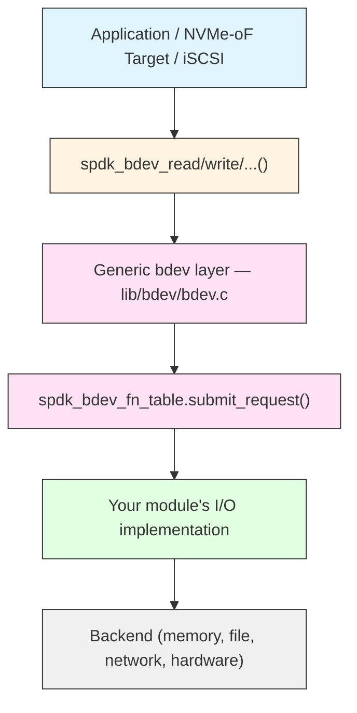

# Module 16: Custom Bdev Module

**Stage**: 2 (Implementation)
**Difficulty**: Advanced
**Estimated Time**: 5 hours
**Prerequisites**: Modules 01-15

---

## Learning Objectives

- Understand the full bdev module interface (`spdk_bdev_module`, `spdk_bdev_fn_table`)
- Implement all required and common optional callbacks
- Build a working I/O path: submit_request, io_type_supported, channel management
- Register and initialize a module using `SPDK_BDEV_MODULE_REGISTER`
- Expose JSON-RPC methods for create/delete
- Build the module as an internal target or as an external shared library
- Walk through a complete passthrough bdev implementation from scratch
- Test and debug custom bdevs effectively

---

## Core Concepts

### Concept 1: Bdev Module Architecture

Every bdev in SPDK is backed by a module. The bdev layer is a generic dispatch layer: it receives I/O from the application and routes it to the appropriate module through well-defined callback tables.



There are two conceptual kinds of bdev modules:

- **Physical bdev modules**: expose real storage (malloc, aio, nvme, uring). They own the backing storage directly.
- **Virtual bdev modules (vbdev)**: sit on top of one or more existing bdevs and transform I/O (passthru, crypto, lvol, split, raid). They claim a base bdev and present a new bdev to upper layers.

This module covers both kinds, with an emphasis on building a physical bdev first, then a simple vbdev passthrough.

---

### Concept 2: Two Callback Tables

A bdev module must fill in two structures:

| Structure | Purpose |
|---|---|
| `struct spdk_bdev_module` | Module lifecycle: init, fini, JSON config |
| `struct spdk_bdev_fn_table` | Per-bdev I/O operations: submit, channel, destruct |

The module struct is registered once at startup. The fn_table is attached to each bdev instance at creation time.

---

## Part 1: The spdk_bdev_module Interface

### Full Structure Definition

From `include/spdk/bdev_module.h`:

```c
struct spdk_bdev_module {
    /* REQUIRED: Called by bdev layer at subsystem init */
    int (*module_init)(void);

    /* Optional: Called when ALL modules have finished init */
    void (*init_complete)(void);

    /* Optional: Called when bdev subsystem begins shutdown,
     * before bdevs are unregistered. Virtual bdev modules
     * must release bdev claims here if no vbdev sits on top. */
    void (*fini_start)(void);

    /* Optional: Called after all bdevs are unregistered.
     * Use for final module cleanup. */
    void (*module_fini)(void);

    /* Optional: Write JSON-RPC config to regenerate this module's
     * bdevs on restart. */
    int (*config_json)(struct spdk_json_write_ctx *w);

    /* REQUIRED: Name string, must be unique across all modules */
    const char *name;

    /* Optional: Size in bytes of the per-IO driver context
     * embedded in spdk_bdev_io->driver_ctx[]. If non-NULL,
     * the bdev layer allocates this much extra space per I/O. */
    int (*get_ctx_size)(void);

    /* Optional: For vbdev modules. Called synchronously when a
     * new bdev is registered. Module may claim the bdev here. */
    void (*examine_config)(struct spdk_bdev *bdev);

    /* Optional: For vbdev modules. Called after examine_config,
     * may issue I/O. Must call spdk_bdev_module_examine_done(). */
    void (*examine_disk)(struct spdk_bdev *bdev);

    /* Set true if module_init completes asynchronously.
     * Must call spdk_bdev_module_init_done() when finished. */
    bool async_init;

    /* Set true if module_fini completes asynchronously.
     * Must call spdk_bdev_module_fini_done() when finished. */
    bool async_fini;

    /* Internal fields - do not touch */
    struct __bdev_module_internal_fields internal;
};
```

### Minimal Module Definition

```c
#include "spdk/bdev_module.h"

static int my_bdev_module_init(void);
static void my_bdev_module_fini(void);

static struct spdk_bdev_module my_bdev_module = {
    .name        = "my_bdev",
    .module_init = my_bdev_module_init,
    .module_fini = my_bdev_module_fini,
    .get_ctx_size = my_bdev_get_ctx_size,
};

SPDK_BDEV_MODULE_REGISTER(my_bdev, &my_bdev_module)
```

`SPDK_BDEV_MODULE_REGISTER` uses a GCC constructor attribute to insert the module pointer into a global list before `main()` runs. The bdev subsystem iterates this list during startup and calls each `module_init`.

---

## Part 2: The spdk_bdev_fn_table Interface

Every bdev instance points to an fn_table. The table is typically declared `static const` and shared by all instances of the same module.

```c
struct spdk_bdev_fn_table {
    /* REQUIRED: Free the bdev and its resources.
     * Return 0 for synchronous destruct, 1 for async
     * (call spdk_bdev_destruct_done() when done). */
    int (*destruct)(void *ctx);

    /* REQUIRED: Submit an I/O request to the backend. */
    void (*submit_request)(struct spdk_io_channel *ch,
                           struct spdk_bdev_io *bdev_io);

    /* REQUIRED: Return true if the bdev supports this I/O type. */
    bool (*io_type_supported)(void *ctx,
                              enum spdk_bdev_io_type io_type);

    /* REQUIRED: Return an spdk_io_channel for this bdev on
     * the calling thread. Almost always:
     *   return spdk_get_io_channel(bdev_ctx_ptr); */
    struct spdk_io_channel *(*get_io_channel)(void *ctx);

    /* Optional: Write JSON to describe this bdev instance
     * (used for bdev_get_bdevs RPC response). */
    int (*dump_info_json)(void *ctx, struct spdk_json_write_ctx *w);

    /* Optional: Write the JSON-RPC call to re-create this bdev.
     * Used by save_config. If the module uses config_json at
     * module level instead, this can be NULL. */
    void (*write_config_json)(struct spdk_bdev *bdev,
                              struct spdk_json_write_ctx *w);

    /* Optional: Microseconds of spin time per channel. */
    uint64_t (*get_spin_time)(struct spdk_io_channel *ch);
};
```

### Practical fn_table example (null bdev pattern)

```c
static const struct spdk_bdev_fn_table my_bdev_fn_table = {
    .destruct           = my_bdev_destruct,
    .submit_request     = my_bdev_submit_request,
    .io_type_supported  = my_bdev_io_type_supported,
    .get_io_channel     = my_bdev_get_io_channel,
    .write_config_json  = my_bdev_write_config_json,
    .dump_info_json     = my_bdev_dump_info_json,
};
```

---

## Part 3: Data Structures

### 3.1 The Bdev Instance Structure

Embed `struct spdk_bdev` as the first field. This allows casting between the outer struct and `spdk_bdev *`.

```c
struct my_bdev {
    struct spdk_bdev    bdev;       /* Must be first */
    void               *buf;        /* Backing memory */
    uint64_t            buf_size;
    TAILQ_ENTRY(my_bdev) link;      /* Module's global list */
};

static TAILQ_HEAD(, my_bdev) g_my_bdevs =
    TAILQ_HEAD_INITIALIZER(g_my_bdevs);
```

Key fields in `struct spdk_bdev` that you must set before calling `spdk_bdev_register()`:

| Field | Type | Description |
|---|---|---|
| `name` | `char *` | Unique bdev name (heap-allocated) |
| `product_name` | `const char *` | Display name (static string OK) |
| `blocklen` | `uint32_t` | Logical block size in bytes |
| `phys_blocklen` | `uint32_t` | Physical block size (optional, defaults to blocklen) |
| `blockcnt` | `uint64_t` | Number of logical blocks |
| `module` | `struct spdk_bdev_module *` | Pointer to your module |
| `fn_table` | `const struct spdk_bdev_fn_table *` | Pointer to your fn_table |
| `ctxt` | `void *` | Your private context (typically `my_bdev` pointer) |
| `write_cache` | `int` | 1 if write cache enabled |
| `required_alignment` | `uint32_t` | DMA alignment requirement |

### 3.2 Per-IO Context Structure

The bdev layer allocates `spdk_bdev_io` structs. Embedded at `bdev_io->driver_ctx` is a region of size `get_ctx_size()` bytes, zeroed before each I/O. Use this for per-IO module state.

```c
struct my_bdev_io {
    /* Track outstanding async operations */
    int         num_outstanding;
    enum spdk_bdev_io_status status;
    /* For I/O wait queue if backend returns -ENOMEM */
    struct spdk_bdev_io_wait_entry bdev_io_wait;
};

static int
my_bdev_get_ctx_size(void)
{
    return sizeof(struct my_bdev_io);
}
```

Access in submit_request:

```c
struct my_bdev_io *my_io =
    (struct my_bdev_io *)bdev_io->driver_ctx;
```

### 3.3 Per-Thread Channel Structure

Channels provide per-thread state. The bdev layer creates one channel per (bdev, thread) pair on demand and destroys it when the thread's last reference closes.

```c
struct my_bdev_channel {
    struct spdk_poller              *poller;
    TAILQ_HEAD(, my_bdev_io)        pending_ios;
    /* Optionally, a lower-layer channel */
    struct spdk_io_channel          *base_ch;
};
```

---

## Part 4: Module Lifecycle

### 4.1 module_init

Called once during SPDK startup on the main thread. Register the I/O device here so channels can be obtained later.

```c
static int
my_bdev_module_init(void)
{
    /*
     * Register the I/O device. The address passed as the first
     * argument must be unique - typically the address of a
     * module-global variable. The bdev layer will call
     * create_cb / destroy_cb when threads open/close channels.
     */
    spdk_io_device_register(
        &g_my_bdevs,            /* unique io_device id */
        my_bdev_channel_create, /* create_cb */
        my_bdev_channel_destroy,/* destroy_cb */
        sizeof(struct my_bdev_channel),
        "my_bdev_module");

    SPDK_NOTICELOG("my_bdev module initialized\n");
    return 0;
}
```

For async init (e.g., if you need to probe hardware):

```c
static struct spdk_bdev_module my_bdev_module = {
    /* ... */
    .async_init  = true,
};

static int
my_bdev_module_init(void)
{
    /* Start async work, then call: */
    /* spdk_bdev_module_init_done(&my_bdev_module); */
    return 0;
}
```

### 4.2 module_fini

Called after all bdevs of this module have been unregistered. Unregister the I/O device here.

```c
static void
my_bdev_channel_unregister_done(void *io_device)
{
    SPDK_NOTICELOG("my_bdev module finished\n");
    spdk_bdev_module_fini_done(); /* required if async_fini = true */
}

static void
my_bdev_module_fini(void)
{
    spdk_io_device_unregister(&g_my_bdevs,
                              my_bdev_channel_unregister_done);
    /* If async_fini = false, no further call needed.
     * If async_fini = true, spdk_bdev_module_fini_done()
     * must be called from the callback above. */
}
```

### 4.3 Bdev Destruct

Called when the bdev is unregistered (e.g., from `spdk_bdev_unregister()`). Free resources here.

```c
static int
my_bdev_destruct(void *ctx)
{
    struct my_bdev *mybdev = ctx;

    TAILQ_REMOVE(&g_my_bdevs, mybdev, link);

    spdk_free(mybdev->buf);      /* DMA memory */
    free(mybdev->bdev.name);
    free(mybdev);

    return 0;  /* 0 = synchronous */
}
```

---

## Part 5: I/O Channel Management

### 5.1 Channel Create Callback

Called on the thread that first requests a channel for this bdev. Initialize per-thread resources.

```c
static int
my_bdev_channel_create(void *io_device, void *ctx_buf)
{
    struct my_bdev_channel *ch = ctx_buf;

    TAILQ_INIT(&ch->pending_ios);

    /* Register a zero-delay poller to drain the pending queue */
    ch->poller = SPDK_POLLER_REGISTER(my_bdev_poll, ch, 0);
    if (!ch->poller) {
        return -ENOMEM;
    }

    return 0;
}
```

### 5.2 Channel Destroy Callback

Called when the last reference to a channel is released on a thread.

```c
static void
my_bdev_channel_destroy(void *io_device, void *ctx_buf)
{
    struct my_bdev_channel *ch = ctx_buf;

    spdk_poller_unregister(&ch->poller);
    /* Any remaining IOs should have been completed or aborted */
    assert(TAILQ_EMPTY(&ch->pending_ios));
}
```

### 5.3 get_io_channel

The bdev layer calls this to get a channel for the calling thread. For a module-level channel (shared across all bdevs in the module):

```c
static struct spdk_io_channel *
my_bdev_get_io_channel(void *ctx)
{
    /* Return a channel keyed on g_my_bdevs (module-wide) */
    return spdk_get_io_channel(&g_my_bdevs);
}
```

For a per-bdev-instance channel (more common):

```c
static struct spdk_io_channel *
my_bdev_get_io_channel(void *ctx)
{
    struct my_bdev *mybdev = ctx;
    /* Each bdev instance has its own channel set */
    return spdk_get_io_channel(mybdev);
}

/* And in create_bdev(), register per-instance: */
spdk_io_device_register(mybdev, create_cb, destroy_cb,
                        sizeof(struct my_bdev_channel),
                        mybdev->bdev.name);
```

---

## Part 6: I/O Path Implementation

### 6.1 io_type_supported

This callback is called before submit_request to check if the bdev handles a given I/O type. Be conservative: only return true for types you handle in submit_request.

```c
static bool
my_bdev_io_type_supported(void *ctx, enum spdk_bdev_io_type io_type)
{
    switch (io_type) {
    case SPDK_BDEV_IO_TYPE_READ:
    case SPDK_BDEV_IO_TYPE_WRITE:
    case SPDK_BDEV_IO_TYPE_RESET:
    case SPDK_BDEV_IO_TYPE_WRITE_ZEROES:
    case SPDK_BDEV_IO_TYPE_ABORT:
        return true;
    case SPDK_BDEV_IO_TYPE_FLUSH:
    case SPDK_BDEV_IO_TYPE_UNMAP:
    default:
        return false;
    }
}
```

Common I/O types:

| Type | Description |
|---|---|
| `SPDK_BDEV_IO_TYPE_READ` | Read data from blocks |
| `SPDK_BDEV_IO_TYPE_WRITE` | Write data to blocks |
| `SPDK_BDEV_IO_TYPE_FLUSH` | Flush write cache to media |
| `SPDK_BDEV_IO_TYPE_UNMAP` | Deallocate blocks (TRIM) |
| `SPDK_BDEV_IO_TYPE_RESET` | Reset device |
| `SPDK_BDEV_IO_TYPE_WRITE_ZEROES` | Zero blocks without data transfer |
| `SPDK_BDEV_IO_TYPE_ABORT` | Abort a specific in-flight I/O |
| `SPDK_BDEV_IO_TYPE_COMPARE` | Compare blocks to data |
| `SPDK_BDEV_IO_TYPE_ZCOPY` | Zero-copy operations |

### 6.2 submit_request: Synchronous Pattern

For a memory-backed bdev (like malloc), the simplest pattern completes I/O inline but defers completion to a poller to avoid stack overflows from completion callbacks calling more I/O.

```c
static void
my_bdev_submit_request(struct spdk_io_channel *_ch,
                       struct spdk_bdev_io *bdev_io)
{
    struct my_bdev         *mybdev = bdev_io->bdev->ctxt;
    struct my_bdev_channel *ch = spdk_io_channel_get_ctx(_ch);
    struct my_bdev_io      *my_io =
        (struct my_bdev_io *)bdev_io->driver_ctx;
    void    *buf  = mybdev->buf;
    uint64_t offset = bdev_io->u.bdev.offset_blocks
                      * mybdev->bdev.blocklen;
    uint64_t len    = bdev_io->u.bdev.num_blocks
                      * mybdev->bdev.blocklen;

    switch (bdev_io->type) {

    case SPDK_BDEV_IO_TYPE_READ:
        spdk_copy_buf_to_iovs(bdev_io->u.bdev.iovs,
                              bdev_io->u.bdev.iovcnt,
                              buf + offset, len);
        /* Queue for deferred completion */
        TAILQ_INSERT_TAIL(&ch->pending_ios, my_io, link);
        my_io->status = SPDK_BDEV_IO_STATUS_SUCCESS;
        break;

    case SPDK_BDEV_IO_TYPE_WRITE:
        spdk_copy_iovs_to_buf(buf + offset, len,
                              bdev_io->u.bdev.iovs,
                              bdev_io->u.bdev.iovcnt);
        TAILQ_INSERT_TAIL(&ch->pending_ios, my_io, link);
        my_io->status = SPDK_BDEV_IO_STATUS_SUCCESS;
        break;

    case SPDK_BDEV_IO_TYPE_WRITE_ZEROES:
        memset(buf + offset, 0, len);
        TAILQ_INSERT_TAIL(&ch->pending_ios, my_io, link);
        my_io->status = SPDK_BDEV_IO_STATUS_SUCCESS;
        break;

    case SPDK_BDEV_IO_TYPE_RESET:
        /* No-op for memory bdev: all I/O already complete */
        spdk_bdev_io_complete(bdev_io, SPDK_BDEV_IO_STATUS_SUCCESS);
        return;

    case SPDK_BDEV_IO_TYPE_ABORT:
        /* Try to abort a pending I/O */
        if (my_bdev_abort_io(ch, bdev_io->u.abort.bio_to_abort)) {
            spdk_bdev_io_complete(bdev_io,
                                  SPDK_BDEV_IO_STATUS_SUCCESS);
        } else {
            spdk_bdev_io_complete(bdev_io,
                                  SPDK_BDEV_IO_STATUS_FAILED);
        }
        return;

    default:
        spdk_bdev_io_complete(bdev_io, SPDK_BDEV_IO_STATUS_FAILED);
        return;
    }
}
```

### 6.3 The Poller: Draining Completed I/O

The null and malloc bdevs both use a zero-delay poller to batch-complete queued I/Os. This prevents completion callbacks from recursively issuing more I/O on the same call stack.

```c
static int
my_bdev_poll(void *arg)
{
    struct my_bdev_channel              *ch = arg;
    TAILQ_HEAD(, my_bdev_io)             done;
    struct my_bdev_io                   *my_io;
    struct spdk_bdev_io                 *bdev_io;

    TAILQ_INIT(&done);
    /* Atomically swap out pending list */
    TAILQ_SWAP(&ch->pending_ios, &done, my_bdev_io, link);

    if (TAILQ_EMPTY(&done)) {
        return SPDK_POLLER_IDLE;
    }

    while (!TAILQ_EMPTY(&done)) {
        my_io = TAILQ_FIRST(&done);
        TAILQ_REMOVE(&done, my_io, link);
        bdev_io = spdk_bdev_io_from_ctx(my_io);
        spdk_bdev_io_complete(bdev_io, my_io->status);
    }

    return SPDK_POLLER_BUSY;
}
```

Key API: `spdk_bdev_io_from_ctx(driver_ctx_ptr)` converts the embedded driver_ctx pointer back to the containing `spdk_bdev_io`.

### 6.4 Abort I/O Support

```c
static bool
my_bdev_abort_io(struct my_bdev_channel *ch,
                 struct spdk_bdev_io *bio_to_abort)
{
    struct my_bdev_io *my_io;
    struct spdk_bdev_io *bdev_io;

    TAILQ_FOREACH(my_io, &ch->pending_ios, link) {
        bdev_io = spdk_bdev_io_from_ctx(my_io);
        if (bdev_io == bio_to_abort) {
            TAILQ_REMOVE(&ch->pending_ios, my_io, link);
            spdk_bdev_io_complete(bio_to_abort,
                                  SPDK_BDEV_IO_STATUS_ABORTED);
            return true;
        }
    }
    return false;
}
```

### 6.5 Handling -ENOMEM from the Backend

If your backend (e.g., a lower-layer bdev) returns `-ENOMEM`, do not complete the I/O with FAILED. Instead, queue it and retry using `spdk_bdev_io_wait_entry`:

```c
static void
my_bdev_resubmit_io(void *arg)
{
    struct spdk_bdev_io *bdev_io = arg;
    my_bdev_submit_request(
        spdk_bdev_io_get_io_channel(bdev_io), bdev_io);
}

/* In submit_request, if lower layer returns -ENOMEM: */
struct my_bdev_io *my_io =
    (struct my_bdev_io *)bdev_io->driver_ctx;
my_io->bdev_io_wait.bdev   = base_bdev;
my_io->bdev_io_wait.cb_fn  = my_bdev_resubmit_io;
my_io->bdev_io_wait.cb_arg = bdev_io;
spdk_bdev_queue_io_wait(base_bdev, base_ch,
                        &my_io->bdev_io_wait);
```

---

## Part 7: Bdev Registration and Creation

### 7.1 Creating a Physical Bdev

```c
int
create_my_bdev(const char *name, uint64_t size_mb)
{
    struct my_bdev *mybdev;
    uint64_t        buf_size;
    int             rc;

    if (name == NULL || size_mb == 0) {
        return -EINVAL;
    }

    mybdev = calloc(1, sizeof(*mybdev));
    if (!mybdev) {
        return -ENOMEM;
    }

    buf_size = size_mb * 1024 * 1024;

    /* Allocate DMA-capable memory for the backing store */
    mybdev->buf = spdk_zmalloc(buf_size, 512, NULL,
                               SPDK_ENV_NUMA_ID_ANY,
                               SPDK_MALLOC_DMA);
    if (!mybdev->buf) {
        free(mybdev);
        return -ENOMEM;
    }
    mybdev->buf_size = buf_size;

    /* Fill in spdk_bdev fields */
    mybdev->bdev.name = strdup(name);
    if (!mybdev->bdev.name) {
        spdk_free(mybdev->buf);
        free(mybdev);
        return -ENOMEM;
    }

    mybdev->bdev.product_name      = "My Custom Bdev";
    mybdev->bdev.blocklen          = 512;
    mybdev->bdev.blockcnt          = buf_size / 512;
    mybdev->bdev.module            = &my_bdev_module;
    mybdev->bdev.fn_table          = &my_bdev_fn_table;
    mybdev->bdev.ctxt              = mybdev;
    mybdev->bdev.write_cache       = 0;
    mybdev->bdev.required_alignment = 512;

    /* Register the I/O device (per-instance channel) */
    spdk_io_device_register(mybdev,
                            my_bdev_channel_create,
                            my_bdev_channel_destroy,
                            sizeof(struct my_bdev_channel),
                            name);

    /* Register the bdev with the bdev layer */
    rc = spdk_bdev_register(&mybdev->bdev);
    if (rc != 0) {
        SPDK_ERRLOG("Failed to register bdev %s: %d\n", name, rc);
        spdk_io_device_unregister(mybdev, NULL);
        spdk_free(mybdev->buf);
        free(mybdev->bdev.name);
        free(mybdev);
        return rc;
    }

    TAILQ_INSERT_TAIL(&g_my_bdevs, mybdev, link);
    SPDK_NOTICELOG("Created my_bdev: %s (%" PRIu64 " MB)\n",
                   name, size_mb);
    return 0;
}
```

### 7.2 Deleting a Bdev

```c
void
delete_my_bdev(const char *name,
               spdk_delete_null_complete cb_fn,
               void *cb_arg)
{
    int rc;

    rc = spdk_bdev_unregister_by_name(name, &my_bdev_module,
                                      cb_fn, cb_arg);
    if (rc != 0) {
        cb_fn(cb_arg, rc);
    }
    /* The bdev layer will call destruct() asynchronously */
}
```

`spdk_bdev_unregister_by_name` looks up the bdev by name, verifies it belongs to this module, drains all in-flight I/O, then calls `destruct()`.

---

## Part 8: JSON-RPC Integration

### 8.1 Write Config JSON (per-bdev)

This function is called by `bdev_get_bdevs` and `save_config` to serialize the bdev's configuration:

```c
static void
my_bdev_write_config_json(struct spdk_bdev *bdev,
                          struct spdk_json_write_ctx *w)
{
    struct my_bdev *mybdev = bdev->ctxt;

    spdk_json_write_object_begin(w);
    spdk_json_write_named_string(w, "method", "my_bdev_create");
    spdk_json_write_named_object_begin(w, "params");
    spdk_json_write_named_string(w, "name", bdev->name);
    spdk_json_write_named_uint64(w, "size_mb",
        mybdev->buf_size / (1024 * 1024));
    spdk_json_write_object_end(w);  /* params */
    spdk_json_write_object_end(w);  /* top-level */
}
```

### 8.2 dump_info_json (optional, diagnostic)

```c
static int
my_bdev_dump_info_json(void *ctx, struct spdk_json_write_ctx *w)
{
    struct my_bdev *mybdev = ctx;

    spdk_json_write_named_object_begin(w, "my_bdev");
    spdk_json_write_named_uint64(w, "buf_size", mybdev->buf_size);
    spdk_json_write_object_end(w);

    return 0;
}
```

### 8.3 Registering JSON-RPC Methods

RPC handlers are registered with `SPDK_RPC_REGISTER`. Place these in a separate `rpc_my_bdev.c` file:

```c
#include "spdk/rpc.h"
#include "spdk/util.h"
#include "spdk/string.h"
#include "my_bdev.h"

/* ---- bdev_my_create ---- */

struct rpc_my_bdev_create {
    char    *name;
    uint64_t size_mb;
};

static const struct spdk_json_object_decoder rpc_my_bdev_create_decoders[] = {
    {"name",    offsetof(struct rpc_my_bdev_create, name),
     spdk_json_decode_string},
    {"size_mb", offsetof(struct rpc_my_bdev_create, size_mb),
     spdk_json_decode_uint64},
};

static void
rpc_bdev_my_create(struct spdk_jsonrpc_request *request,
                   const struct spdk_json_val *params)
{
    struct rpc_my_bdev_create req = {};
    struct spdk_json_write_ctx *w;
    int rc;

    if (spdk_json_decode_object(params,
                                rpc_my_bdev_create_decoders,
                                SPDK_COUNTOF(rpc_my_bdev_create_decoders),
                                &req)) {
        SPDK_ERRLOG("spdk_json_decode_object failed\n");
        spdk_jsonrpc_send_error_response(request,
            SPDK_JSONRPC_ERROR_INTERNAL_ERROR,
            "JSON decode failed");
        goto cleanup;
    }

    rc = create_my_bdev(req.name, req.size_mb);
    if (rc != 0) {
        spdk_jsonrpc_send_error_response(request,
            rc, spdk_strerror(-rc));
        goto cleanup;
    }

    w = spdk_jsonrpc_begin_result(request);
    spdk_json_write_string(w, req.name);
    spdk_jsonrpc_end_result(request, w);

cleanup:
    free(req.name);
}

SPDK_RPC_REGISTER("bdev_my_create", rpc_bdev_my_create,
                  SPDK_RPC_RUNTIME)

/* ---- bdev_my_delete ---- */

struct rpc_my_bdev_delete {
    char *name;
};

static const struct spdk_json_object_decoder rpc_my_bdev_delete_decoders[] = {
    {"name", offsetof(struct rpc_my_bdev_delete, name),
     spdk_json_decode_string},
};

static void
rpc_bdev_my_delete_done(void *cb_arg, int rc)
{
    struct spdk_jsonrpc_request *request = cb_arg;

    if (rc != 0) {
        spdk_jsonrpc_send_error_response(request,
            rc, spdk_strerror(-rc));
        return;
    }

    spdk_jsonrpc_send_bool_response(request, true);
}

static void
rpc_bdev_my_delete(struct spdk_jsonrpc_request *request,
                   const struct spdk_json_val *params)
{
    struct rpc_my_bdev_delete req = {};

    if (spdk_json_decode_object(params,
                                rpc_my_bdev_delete_decoders,
                                SPDK_COUNTOF(rpc_my_bdev_delete_decoders),
                                &req)) {
        spdk_jsonrpc_send_error_response(request,
            SPDK_JSONRPC_ERROR_INTERNAL_ERROR,
            "JSON decode failed");
        goto cleanup;
    }

    delete_my_bdev(req.name, rpc_bdev_my_delete_done, request);

cleanup:
    free(req.name);
}

SPDK_RPC_REGISTER("bdev_my_delete", rpc_bdev_my_delete,
                  SPDK_RPC_RUNTIME)
```

---

## Part 9: Building the Module

### 9.1 Internal Module (compiled into SPDK app)

Add your module to the application's module list. In your app's `Makefile`:

```makefile
SPDK_LIB_LIST += bdev_my_bdev

# In lib/bdev/Makefile or your module dir:
LIBNAME = bdev_my_bdev
C_SRCS  = bdev_my_bdev.c rpc_my_bdev.c
```

Or if using the top-level build system, add an entry in `module/bdev/CMakeLists.txt` (if using CMake) or `mk/spdk.modules.mk`.

For the hello_world-style app, link against your library:

```makefile
# app/my_app/Makefile
APP = my_app
C_SRCS = my_app.c
SPDK_LIB_LIST = bdev_my_bdev bdev malloc log ...
include $(SPDK_ROOT_DIR)/mk/spdk.app.mk
```

### 9.2 External / Out-of-Tree Module

SPDK supports external modules compiled outside the SPDK source tree. The key is that `SPDK_BDEV_MODULE_REGISTER` uses a linker section (`__attribute__((constructor))` equivalent via `SPDK_STATIC_ASSERT` and section magic) to self-register at load time.

**Directory structure:**

```
my_bdev_module/
  bdev_my_bdev.c
  bdev_my_bdev.h
  rpc_my_bdev.c
  Makefile
```

**Makefile for external module:**

```makefile
SPDK_ROOT_DIR := /path/to/spdk

include $(SPDK_ROOT_DIR)/mk/spdk.common.mk

LIBNAME = bdev_my_bdev
C_SRCS  = bdev_my_bdev.c rpc_my_bdev.c

CFLAGS += -I$(SPDK_ROOT_DIR)/include

include $(SPDK_ROOT_DIR)/mk/spdk.lib.mk
```

**Loading at runtime:**

```json
{
  "subsystems": [
    {
      "subsystem": "bdev",
      "config": [
        {
          "method": "framework_set_bdev_opts",
          "params": {}
        }
      ]
    }
  ]
}
```

Use `spdk_app_opts.json_config_file` or the `--json` flag. External shared libraries are loaded via `--bdev-module` flag or `LD_PRELOAD`.

---

## Part 10: Complete Walkthrough - Simple Passthrough Bdev

A passthrough (vbdev) sits on top of an existing bdev and forwards all I/O transparently. This is the simplest possible vbdev and is the foundation for crypto, compression, latency injection, etc.

Reference: `module/bdev/passthru/vbdev_passthru.c`

### 10.1 Full Header (`my_passthru.h`)

```c
#pragma once

#include "spdk/bdev.h"

typedef void (*spdk_delete_my_passthru_complete)(void *cb_arg, int rc);

int  create_my_passthru(const char *pt_name,
                         const char *base_bdev_name);
void delete_my_passthru(const char *pt_name,
                         spdk_delete_my_passthru_complete cb_fn,
                         void *cb_arg);
```

### 10.2 Data Structures

```c
struct my_pt_bdev {
    struct spdk_bdev        *base_bdev;  /* bdev we wrap */
    struct spdk_bdev_desc   *base_desc;  /* open descriptor */
    struct spdk_bdev         pt_bdev;    /* virtual bdev we expose */
    struct spdk_thread      *opener_thread; /* thread that opened base */
    TAILQ_ENTRY(my_pt_bdev)  link;
};

struct my_pt_channel {
    struct spdk_io_channel *base_ch;    /* channel to base bdev */
};

struct my_pt_io {
    struct spdk_io_channel      *ch;
    struct spdk_bdev_io_wait_entry bdev_io_wait;
};
```

### 10.3 Module Registration

```c
static int my_pt_init(void);
static void my_pt_fini(void);
static void my_pt_examine(struct spdk_bdev *bdev);
static int my_pt_get_ctx_size(void);

static struct spdk_bdev_module my_pt_module = {
    .name           = "my_passthru",
    .module_init    = my_pt_init,
    .module_fini    = my_pt_fini,
    .examine_config = my_pt_examine,
    .get_ctx_size   = my_pt_get_ctx_size,
};

SPDK_BDEV_MODULE_REGISTER(my_passthru, &my_pt_module)
```

### 10.4 I/O Submit: Forward to Base Bdev

```c
static void
_my_pt_complete_io(struct spdk_bdev_io *base_io,
                   bool success, void *cb_arg)
{
    struct spdk_bdev_io *orig_io = cb_arg;
    int status = success ? SPDK_BDEV_IO_STATUS_SUCCESS
                         : SPDK_BDEV_IO_STATUS_FAILED;

    spdk_bdev_io_complete(orig_io, status);
    spdk_bdev_free_io(base_io);
}

static void
my_pt_submit_request(struct spdk_io_channel *_ch,
                     struct spdk_bdev_io *bdev_io)
{
    struct my_pt_bdev    *pt  = bdev_io->bdev->ctxt;
    struct my_pt_channel *ch  = spdk_io_channel_get_ctx(_ch);
    int rc = 0;

    switch (bdev_io->type) {
    case SPDK_BDEV_IO_TYPE_READ:
        rc = spdk_bdev_readv_blocks(
            pt->base_desc, ch->base_ch,
            bdev_io->u.bdev.iovs, bdev_io->u.bdev.iovcnt,
            bdev_io->u.bdev.offset_blocks,
            bdev_io->u.bdev.num_blocks,
            _my_pt_complete_io, bdev_io);
        break;
    case SPDK_BDEV_IO_TYPE_WRITE:
        rc = spdk_bdev_writev_blocks(
            pt->base_desc, ch->base_ch,
            bdev_io->u.bdev.iovs, bdev_io->u.bdev.iovcnt,
            bdev_io->u.bdev.offset_blocks,
            bdev_io->u.bdev.num_blocks,
            _my_pt_complete_io, bdev_io);
        break;
    case SPDK_BDEV_IO_TYPE_FLUSH:
        rc = spdk_bdev_flush_blocks(
            pt->base_desc, ch->base_ch,
            bdev_io->u.bdev.offset_blocks,
            bdev_io->u.bdev.num_blocks,
            _my_pt_complete_io, bdev_io);
        break;
    case SPDK_BDEV_IO_TYPE_RESET:
        rc = spdk_bdev_reset(pt->base_desc, ch->base_ch,
                             _my_pt_complete_io, bdev_io);
        break;
    case SPDK_BDEV_IO_TYPE_UNMAP:
        rc = spdk_bdev_unmap_blocks(
            pt->base_desc, ch->base_ch,
            bdev_io->u.bdev.offset_blocks,
            bdev_io->u.bdev.num_blocks,
            _my_pt_complete_io, bdev_io);
        break;
    default:
        spdk_bdev_io_complete(bdev_io, SPDK_BDEV_IO_STATUS_FAILED);
        return;
    }

    if (rc == -ENOMEM) {
        struct my_pt_io *pt_io =
            (struct my_pt_io *)bdev_io->driver_ctx;
        pt_io->ch = _ch;
        pt_io->bdev_io_wait.bdev   = pt->base_bdev;
        pt_io->bdev_io_wait.cb_fn  = my_pt_resubmit;
        pt_io->bdev_io_wait.cb_arg = bdev_io;
        spdk_bdev_queue_io_wait(pt->base_bdev,
                                ch->base_ch,
                                &pt_io->bdev_io_wait);
    } else if (rc != 0) {
        spdk_bdev_io_complete(bdev_io, SPDK_BDEV_IO_STATUS_FAILED);
    }
}
```

### 10.5 Vbdev Channel: Wrapping Base Channel

```c
static int
my_pt_channel_create(void *io_device, void *ctx_buf)
{
    struct my_pt_bdev    *pt = io_device;
    struct my_pt_channel *ch = ctx_buf;

    ch->base_ch = spdk_bdev_get_io_channel(pt->base_desc);
    if (!ch->base_ch) {
        return -ENOMEM;
    }
    return 0;
}

static void
my_pt_channel_destroy(void *io_device, void *ctx_buf)
{
    struct my_pt_channel *ch = ctx_buf;
    spdk_put_io_channel(ch->base_ch);
}
```

### 10.6 Creating the Vbdev

```c
static void
my_pt_bdev_event_cb(enum spdk_bdev_event_type type,
                    struct spdk_bdev *bdev, void *ctx)
{
    /* Handle REMOVE event: unregister the pt bdev */
    if (type == SPDK_BDEV_EVENT_REMOVE) {
        struct my_pt_bdev *pt = ctx;
        spdk_bdev_unregister(&pt->pt_bdev, NULL, NULL);
    }
}

int
create_my_passthru(const char *pt_name,
                   const char *base_bdev_name)
{
    struct my_pt_bdev *pt;
    struct spdk_bdev  *base;
    int rc;

    pt = calloc(1, sizeof(*pt));
    if (!pt) {
        return -ENOMEM;
    }

    /* Open the base bdev */
    rc = spdk_bdev_open_ext(base_bdev_name, true,
                             my_pt_bdev_event_cb, pt,
                             &pt->base_desc);
    if (rc != 0) {
        SPDK_ERRLOG("Cannot open base bdev %s: %d\n",
                    base_bdev_name, rc);
        free(pt);
        return rc;
    }

    base = spdk_bdev_desc_get_bdev(pt->base_desc);
    pt->base_bdev    = base;
    pt->opener_thread = spdk_get_thread();

    /* Claim exclusive write access */
    rc = spdk_bdev_module_claim_bdev(base, pt->base_desc,
                                     &my_pt_module);
    if (rc != 0) {
        SPDK_ERRLOG("Cannot claim bdev %s: %d\n",
                    base_bdev_name, rc);
        spdk_bdev_close(pt->base_desc);
        free(pt);
        return rc;
    }

    /* Inherit geometry from base bdev */
    pt->pt_bdev.name         = strdup(pt_name);
    pt->pt_bdev.product_name = "Passthru";
    pt->pt_bdev.blocklen     = base->blocklen;
    pt->pt_bdev.blockcnt     = base->blockcnt;
    pt->pt_bdev.module       = &my_pt_module;
    pt->pt_bdev.fn_table     = &my_pt_fn_table;
    pt->pt_bdev.ctxt         = pt;
    pt->pt_bdev.write_cache  = base->write_cache;

    spdk_io_device_register(pt, my_pt_channel_create,
                            my_pt_channel_destroy,
                            sizeof(struct my_pt_channel),
                            pt_name);

    rc = spdk_bdev_register(&pt->pt_bdev);
    if (rc != 0) {
        spdk_io_device_unregister(pt, NULL);
        spdk_bdev_module_release_bdev(base);
        spdk_bdev_close(pt->base_desc);
        free(pt->pt_bdev.name);
        free(pt);
        return rc;
    }

    TAILQ_INSERT_TAIL(&g_pt_bdevs, pt, link);
    return 0;
}
```

---

## Part 11: Testing Your Module

### 11.1 Unit Test with bdev_ut Framework

SPDK provides `test/bdev/bdev_ut.c` which sets up a fake reactor and bdev layer without needing real hardware. Create `test/bdev/my_bdev_ut.c`:

```c
#include "spdk/bdev.h"
#include "spdk_internal/mock.h"
#include "bdev/bdev.c"   /* include internals for unit testing */
#include "my_bdev.h"

static void
test_create_delete(void)
{
    int rc;

    rc = create_my_bdev("test0", 4 /* MB */);
    CU_ASSERT(rc == 0);

    /* Verify bdev exists */
    struct spdk_bdev *bdev = spdk_bdev_get_by_name("test0");
    CU_ASSERT_PTR_NOT_NULL(bdev);
    CU_ASSERT_EQUAL(bdev->blocklen, 512);
    CU_ASSERT_EQUAL(bdev->blockcnt, 4 * 1024 * 1024 / 512);

    delete_my_bdev("test0", NULL, NULL);
    CU_ASSERT_PTR_NULL(spdk_bdev_get_by_name("test0"));
}
```

### 11.2 Integration Test with spdk_tgt

Run SPDK target and issue RPCs:

```bash
# Start target
build/bin/spdk_tgt --config my_config.json &

# Create bdev
scripts/rpc.py bdev_my_create --name MyBdev0 --size_mb 64

# Verify
scripts/rpc.py bdev_get_bdevs --name MyBdev0

# Run fio performance test
scripts/rpc.py bdev_get_bdevs

# Use bdevperf
build/bin/bdevperf -c my_config.json -q 128 -o 4096 -t 10 -w randread
```

### 11.3 bdevperf for Performance Validation

```bash
build/bin/bdevperf \
    --json <(scripts/rpc.py save_config) \
    -q 128 \         # queue depth
    -o 131072 \      # I/O size (128KB)
    -t 30 \          # duration seconds
    -w randrw \      # workload type
    -M 70            # 70% read mix
```

---

## Part 12: Common Pitfalls and Debugging

### Pitfall 1: Completing I/O from the Wrong Thread

`spdk_bdev_io_complete()` must be called from the same thread that submitted the I/O (the thread associated with the io_channel). If your backend is async and calls back on a different thread, use `spdk_thread_send_msg()` to hop back.

```c
/* Wrong: calling complete from an arbitrary callback thread */
/* Right: */
spdk_thread_send_msg(bdev_io_thread, complete_io, bdev_io);
```

### Pitfall 2: Forgetting spdk_bdev_module_examine_done

If you implement `examine_config`, you MUST call `spdk_bdev_module_examine_done(&my_module)` before returning, even if you decide not to create a vbdev. Failing to do so stalls SPDK startup permanently.

```c
static void
my_pt_examine(struct spdk_bdev *bdev)
{
    /* Check if we should wrap this bdev */
    if (should_wrap(bdev)) {
        create_my_passthru("pt_" + bdev->name, bdev->name);
    }
    /* Always call this, even on the no-op path */
    spdk_bdev_module_examine_done(&my_pt_module);
}
```

### Pitfall 3: Double-Free in Destruct

The bdev layer calls `destruct()` only after all I/O channels are destroyed and all in-flight I/O is complete. Do not attempt to drain I/O yourself in destruct. The layer guarantees it.

### Pitfall 4: Name Allocation

`bdev->name` must be a heap-allocated string (`strdup()`). The bdev layer does not copy it. Passing a stack or static string will cause a crash when the bdev is freed.

### Pitfall 5: io_device vs bdev

The io_device registered with `spdk_io_device_register()` is a unique address used as a key. The bdev registered with `spdk_bdev_register()` is the logical device. They are separate. You unregister the io_device in `module_fini` (after all bdevs are gone), not in `destruct()`.

### Pitfall 6: Required Alignment

If your DMA buffer requires alignment, set `bdev->required_alignment`. The bdev layer will bounce-buffer unaligned I/O automatically if you set it. Without this, applications may pass misaligned buffers and your DMA operations will fault.

### Debugging Tips

```bash
# Enable SPDK trace logging for bdev layer
export SPDK_LOG_LEVEL=DEBUG
export SPDK_LOG_PRINT_LEVEL=DEBUG
build/bin/spdk_tgt --log-level bdev:DEBUG ...

# Check registered bdevs
scripts/rpc.py bdev_get_bdevs | python3 -m json.tool

# Dump detailed bdev info (calls dump_info_json)
scripts/rpc.py bdev_get_bdevs --name MyBdev0 | python3 -m json.tool

# Check I/O statistics
scripts/rpc.py bdev_get_iostat --name MyBdev0

# Trace macro in your module
SPDK_DEBUGLOG(my_bdev, "Submitting %s offset=%" PRIu64 "\n",
              bdev_io->type == SPDK_BDEV_IO_TYPE_READ ? "READ" : "WRITE",
              bdev_io->u.bdev.offset_blocks);

# At the top of your .c file:
SPDK_LOG_REGISTER_COMPONENT(my_bdev)
```

---

## Part 13: Practice Exercises

### Exercise 1: Zero-Fill Bdev (Warmup)

Implement a bdev that:
- Always returns zeros on READ
- Accepts WRITE and silently discards data
- Supports WRITE_ZEROES and RESET
- Configurable size via JSON-RPC (`bdev_zero_create`)

Expected behavior: similar to `/dev/zero` but with block device semantics.

**Hint:** Start from `module/bdev/null/bdev_null.c`. The null bdev already does this - but try to write it from scratch without looking at the implementation, only the header.

### Exercise 2: Statistics-Tracking Bdev

Extend Exercise 1 to track per-channel statistics:
- Read I/O count and bytes
- Write I/O count and bytes
- Latency histogram (bucket by powers of 2 from 1us to 1s)

Expose statistics via `dump_device_stat_json` in the fn_table and via a custom RPC `bdev_zero_get_stats`.

### Exercise 3: Latency Injection Vbdev

Build a vbdev that:
- Wraps any base bdev
- Injects a configurable artificial delay (microseconds) on reads
- Uses a `spdk_poller` to simulate the delay without blocking the reactor
- Configurable at runtime via RPC

**Hint:** Reference `module/bdev/delay/vbdev_delay.c` for the poller-based delay pattern.

### Exercise 4: Mirror Write Vbdev

Build a vbdev that:
- Takes two base bdevs of equal size
- Writes to both on WRITE (complete when both succeed)
- Reads from the primary, falls back to secondary on error
- Handles the case where one base bdev is removed at runtime

This exercises the `examine_config`, `fini_start`, and error path handling.

---

## Summary

**The minimum viable bdev module requires:**

1. `struct spdk_bdev_module` with `name` and `module_init`
2. `SPDK_BDEV_MODULE_REGISTER` macro to self-register
3. `struct spdk_bdev_fn_table` with `destruct`, `submit_request`, `io_type_supported`, `get_io_channel`
4. `spdk_io_device_register` with channel create/destroy callbacks
5. `spdk_bdev_register` to expose the bdev to the layer

**Critical rules:**

- Complete I/O on the submitting thread only
- Always call `spdk_bdev_module_examine_done()` if you implement `examine_config`
- Use `spdk_free()` for DMA memory allocated with `spdk_zmalloc()`
- Never touch `spdk_bdev.internal` fields
- Heap-allocate `bdev->name` with `strdup()`
- Register io_device before registering bdev; unregister in reverse order

**Next Steps:**

- Module 17: Application Development - building a complete SPDK application
- Explore `module/bdev/delay/` for poller-based async patterns
- Explore `module/bdev/crypto/` for pipeline patterns with acceleration APIs
- Explore `lib/bdev/bdev.c` to understand the generic layer that dispatches to your callbacks

---

## References

| Source | Description |
|---|---|
| `include/spdk/bdev_module.h` | Full module and fn_table interface definitions |
| `include/spdk/bdev.h` | Public bdev API (spdk_bdev_register, spdk_bdev_io_complete, etc.) |
| `module/bdev/null/bdev_null.c` | Minimal physical bdev implementation |
| `module/bdev/malloc/bdev_malloc.c` | Memory bdev with accel API integration |
| `module/bdev/passthru/vbdev_passthru.c` | Canonical vbdev example |
| `module/bdev/delay/vbdev_delay.c` | Poller-based latency injection vbdev |
| `module/bdev/aio/bdev_aio.c` | File-backed bdev using Linux AIO |
| `lib/bdev/bdev.c` | Generic bdev layer implementation |
| `test/bdev/bdev_ut.c` | Unit test framework for bdev modules |
