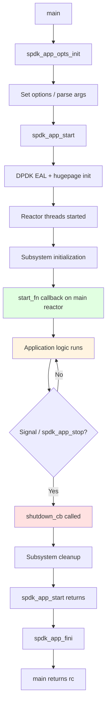

# Module 17: Application Development Patterns

**Stage**: 2 (Implementation)
**Difficulty**: Intermediate
**Estimated Time**: 5 hours
**Prerequisites**: Modules 01-16

---

## Learning Objectives

By the end of this module you will be able to:

- Structure a complete SPDK application following production patterns
- Implement the full initialization sequence using `spdk_app_opts` and `spdk_app_start`
- Parse custom command-line arguments alongside the standard SPDK flags
- Register and use a custom shutdown callback for graceful teardown
- Allocate resources safely and release them in the correct order
- Apply SPDK logging macros with the right severity level for each situation
- Register per-component debug flags and enable them at runtime
- Configure an application through JSON-based configuration files
- Recognize and avoid the most common application-development mistakes

---

## Why Application Structure Matters

SPDK's event-driven, polled-mode architecture is fundamentally different from a
conventional multi-threaded server. The rules are strict:

- All SPDK API calls must be made **on the thread that owns the resource**.
- There is **no blocking**. Every wait becomes a callback.
- Resources have a strict acquisition and release order.
- Signals are delivered on the reactor; you cannot handle them yourself unless
  you opt out of SPDK's signal handling.

Getting the structure wrong usually shows up as:

- Segfaults during shutdown (double-free, use-after-free)
- Hangs caused by a missing `spdk_app_stop()` call
- Spurious assertion failures when calling SPDK APIs from the wrong thread

This module teaches patterns that avoid all of these problems.

---

## Concept 1: The Application Lifecycle

Every SPDK application follows the same sequence regardless of what it does.



The key insight: `spdk_app_start()` **blocks** until `spdk_app_stop()` is
called. Your application logic lives entirely inside the callbacks launched from
`start_fn`. Cleanup logic lives in `shutdown_cb` or in the function that calls
`spdk_app_stop()`.

---

## Concept 2: spdk_app_opts — What Every Field Does

`struct spdk_app_opts` controls DPDK, the reactor, and the RPC server. Always
initialize it with `spdk_app_opts_init()` before touching any field; this
ensures ABI compatibility as new fields are added.

```c
struct spdk_app_opts {
    /* Application identity */
    const char *name;              /* Used for hugepage file names and logging */

    /* Configuration */
    const char *json_config_file;  /* Path to JSON config file */
    bool json_config_ignore_errors;/* Continue even if config has errors */
    void *json_data;               /* Inline JSON (mutually exclusive with file) */
    size_t json_data_size;

    /* RPC server */
    const char *rpc_addr;          /* UNIX socket path or IP:port */
    const char **rpc_allowlist;    /* NULL-terminated list of allowed methods */

    /* CPU / memory */
    const char *reactor_mask;      /* e.g. "0x3" for cores 0 and 1 */
    int main_core;                 /* Core for the main reactor (default: 0) */
    int mem_size;                  /* Hugepage memory in MB (-1 = auto) */
    bool no_pci;                   /* Skip PCI enumeration */
    bool no_huge;                  /* Use malloc instead of hugepages (testing only) */

    /* Shutdown and signals */
    spdk_app_shutdown_cb shutdown_cb; /* Called when shutdown begins */
    bool disable_signal_handlers;    /* If true, you must call spdk_app_start_shutdown() */

    /* Logging */
    enum spdk_log_level print_level; /* Minimum level printed to stderr */
    spdk_log_cb *log;                /* Custom log sink (NULL = default) */

    /* Tracing */
    const char *tpoint_group_mask;   /* Enable tracepoint groups */
    uint64_t num_entries;            /* Trace ring buffer entries per core */

    /* ABI safety — must equal sizeof(struct spdk_app_opts) */
    size_t opts_size;
};
```

### Mandatory initialization pattern

```c
struct spdk_app_opts opts = {};           /* zero the struct */
spdk_app_opts_init(&opts, sizeof(opts));  /* fill defaults, set opts_size */
opts.name = "my_app";                     /* now override what you need */
```

Never skip `spdk_app_opts_init()`. Without it, `opts_size` is zero, and SPDK
will either reject the opts or silently misread fields.

---

## Concept 3: Parsing Command-Line Arguments

`spdk_app_parse_args()` extends `getopt_long` so that your application-specific
flags and SPDK's built-in flags (`-m` for core mask, `-s` for memory size, etc.)
are all parsed in one pass.

### Standard SPDK flags (always available)

| Flag | Long form | Effect |
|------|-----------|--------|
| `-c` | `--config` | JSON config file path |
| `-m` | `--cpumask` | Reactor core mask |
| `-s` | `--mem-size` | Hugepage memory in MB |
| `-r` | `--rpc-socket` | RPC socket path |
| `-L` | `--logflag` | Enable a named log flag |
| `-u` | `--no-pci` | Skip PCI |
| `-g` | `--single-file-segments` | One file per hugepage segment |
| `-h` | `--help` | Print help |

### Adding application-specific flags

```c
/* Step 1: define your option characters (must not conflict with SPDK's set) */
/* SPDK uses: c d e g h i m n p r s u v A B L R W                           */
/* Safe characters to add: f j k o q t w x y z and upper-case letters       */

static const char g_my_opts[] = "f:T:";  /* -f <file>, -T <timeout> */

static const char *g_config_path = NULL;
static int g_timeout_sec = 30;

static int
my_parse_arg(int ch, char *arg)
{
    switch (ch) {
    case 'f':
        g_config_path = arg;
        break;
    case 'T':
        g_timeout_sec = atoi(arg);
        if (g_timeout_sec <= 0) {
            fprintf(stderr, "Invalid timeout: %s\n", arg);
            return -EINVAL;
        }
        break;
    default:
        return -EINVAL;
    }
    return 0;  /* 0 = success */
}

static void
my_usage(void)
{
    printf(" -f <path>    path to application config file\n");
    printf(" -T <sec>     operation timeout in seconds (default: 30)\n");
}

int
main(int argc, char **argv)
{
    struct spdk_app_opts opts = {};
    spdk_app_parse_args_rvals_t rval;
    int rc;

    spdk_app_opts_init(&opts, sizeof(opts));
    opts.name = "my_app";

    rval = spdk_app_parse_args(argc, argv, &opts,
                               g_my_opts,      /* app-specific opt chars */
                               NULL,           /* no long options */
                               my_parse_arg,   /* callback for app opts */
                               my_usage);      /* callback for help text */
    if (rval != SPDK_APP_PARSE_ARGS_SUCCESS) {
        return rval;
    }

    rc = spdk_app_start(&opts, app_started, NULL);
    spdk_app_fini();
    return rc;
}
```

### Real-world example: spdk_tgt

The SPDK target (`app/spdk_tgt/spdk_tgt.c`) is deliberately minimal — its only
extra flag is `-f` for a PID file:

```c
static void
spdk_tgt_started(void *arg1)
{
    if (g_pid_path) {
        spdk_tgt_save_pid(g_pid_path);
    }
    /* No further setup needed — config drives everything via JSON-RPC */
}

int
main(int argc, char **argv)
{
    struct spdk_app_opts opts = {};
    int rc;

    spdk_app_opts_init(&opts, sizeof(opts));
    opts.name = "spdk_tgt";

    if ((rc = spdk_app_parse_args(argc, argv, &opts,
                                  "f:" SPDK_SOCK_PATH,
                                  NULL,
                                  spdk_tgt_parse_arg,
                                  spdk_tgt_usage)) !=
        SPDK_APP_PARSE_ARGS_SUCCESS) {
        return rc;
    }

    rc = spdk_app_start(&opts, spdk_tgt_started, NULL);
    spdk_app_fini();
    return rc;
}
```

Notice: `spdk_tgt_started` does almost nothing. The entire target configuration
comes from the JSON config file and JSON-RPC calls at runtime. This is the
recommended pattern for production targets.

---

## Concept 4: Application Context and Resource Allocation

SPDK does not have global implicit state. You manage state through a context
struct that you own, allocate at startup, and free during cleanup.

### Context design rules

1. Allocate with `calloc` (not `malloc`) so every field starts at zero/NULL.
2. Use a `shutdown_started` flag to prevent double-cleanup.
3. Keep all SPDK handles (`spdk_bdev_desc *`, `spdk_io_channel *`, etc.) in the
   context, not as bare globals.

```c
struct app_context {
    /* SPDK resources */
    struct spdk_bdev_desc   *bdev_desc;
    struct spdk_io_channel  *io_channel;

    /* Application state */
    uint64_t    bytes_written;
    uint64_t    bytes_read;
    bool        shutdown_started;   /* guard against double cleanup */

    /* Completion tracking */
    int         outstanding_ios;
};
```

### Allocation in start_fn

```c
static void
app_started(void *arg1)
{
    struct app_context *ctx;
    int rc;

    ctx = calloc(1, sizeof(*ctx));
    if (ctx == NULL) {
        SPDK_ERRLOG("Failed to allocate app context\n");
        spdk_app_stop(-1);
        return;
    }

    /* All SPDK resource acquisition happens here */
    rc = spdk_bdev_open_ext("Malloc0", true,
                            app_bdev_event_cb, ctx,
                            &ctx->bdev_desc);
    if (rc != 0) {
        SPDK_ERRLOG("Failed to open bdev: %s\n", spdk_strerror(rc));
        free(ctx);
        spdk_app_stop(-1);
        return;
    }

    ctx->io_channel = spdk_bdev_get_io_channel(ctx->bdev_desc);
    if (ctx->io_channel == NULL) {
        SPDK_ERRLOG("Failed to get I/O channel\n");
        spdk_bdev_close(ctx->bdev_desc);
        free(ctx);
        spdk_app_stop(-1);
        return;
    }

    SPDK_NOTICELOG("Resources acquired, starting I/O\n");
    app_start_io(ctx);
}
```

---

## Concept 5: Resource Release Order

SPDK resources must be released in **reverse acquisition order**. Failing to do
so is the most common cause of shutdown crashes.

```
Acquire order:            Release order (reverse):
1. bdev_open_ext     ←→  4. bdev_close
2. get_io_channel    ←→  3. put_io_channel
3. (submit I/Os)     ←→  2. wait for completion callbacks
4. (use results)     ←→  1. free context
```

### Safe cleanup pattern

```c
static void
app_cleanup(struct app_context *ctx)
{
    /* Guard: only run cleanup once */
    if (ctx->shutdown_started) {
        return;
    }
    ctx->shutdown_started = true;

    /*
     * If there are outstanding I/Os, we cannot free the channel yet.
     * Instead, set a flag and let the completion callbacks drain.
     * When outstanding_ios reaches 0, they will call this function again.
     */
    if (ctx->outstanding_ios > 0) {
        SPDK_NOTICELOG("Waiting for %d outstanding I/Os\n",
                       ctx->outstanding_ios);
        return;
    }

    /* Release resources in reverse acquisition order */
    if (ctx->io_channel) {
        spdk_put_io_channel(ctx->io_channel);
        ctx->io_channel = NULL;
    }
    if (ctx->bdev_desc) {
        spdk_bdev_close(ctx->bdev_desc);
        ctx->bdev_desc = NULL;
    }

    free(ctx);
    spdk_app_stop(0);
}
```

### Completion callback that drains

```c
static void
write_complete(struct spdk_bdev_io *bdev_io,
               bool success,
               void *cb_arg)
{
    struct app_context *ctx = cb_arg;

    spdk_bdev_free_io(bdev_io);
    ctx->outstanding_ios--;

    if (!success) {
        SPDK_ERRLOG("Write failed\n");
        /* Still decrement; cleanup will run when count reaches 0 */
    } else {
        ctx->bytes_written += g_io_size;
    }

    /* If shutdown was requested while this I/O was in flight, clean up now */
    if (ctx->shutdown_started && ctx->outstanding_ios == 0) {
        app_cleanup(ctx);
    }
}
```

---

## Concept 6: Shutdown and Signal Handling

### Default signal behavior

By default, SPDK intercepts `SIGINT` and `SIGTERM`. When either arrives, the
framework calls `opts.shutdown_cb` (if set) and then begins subsystem teardown.

```c
/* Simple shutdown callback */
static void
my_shutdown_cb(void)
{
    /* This is called on the main reactor thread — safe to call SPDK APIs */
    SPDK_NOTICELOG("Shutdown signal received\n");
    g_shutdown = true;

    /* Send a drain message to every worker thread */
    struct worker_ctx *worker;
    TAILQ_FOREACH(worker, &g_workers, link) {
        spdk_thread_send_msg(worker->thread, worker_drain, worker);
    }
}

/* In main, register it */
opts.shutdown_cb = my_shutdown_cb;
```

### When shutdown_cb is the right place vs. cleanup function

| Scenario | Where to put teardown |
|----------|-----------------------|
| Simple single-resource app | Directly call `spdk_app_stop()` from error paths; no `shutdown_cb` needed |
| Multi-resource or multi-thread | `shutdown_cb` to signal workers; workers call `spdk_app_stop` when drained |
| Need async teardown | `shutdown_cb` starts async chain; last callback calls `spdk_app_stop` |

### Real-world example: bdevperf shutdown

```c
/* From examples/bdev/bdevperf/bdevperf.c */
static void
spdk_bdevperf_shutdown_cb(void)
{
    g_shutdown = true;
    struct bdevperf_job *job, *tmp;

    if (g_bdevperf.running_jobs == 0) {
        /* Nothing in flight — immediate stop */
        bdevperf_test_done(NULL);
        return;
    }

    /* Drain each job on its own thread */
    TAILQ_FOREACH_SAFE(job, &g_bdevperf.jobs, link, tmp) {
        spdk_thread_send_msg(job->thread, _bdevperf_job_drain, job);
    }
}
```

### Disabling SPDK's signal handlers

In embedded scenarios or when the application wants full signal control:

```c
opts.disable_signal_handlers = true;
/* Now you must call spdk_app_start_shutdown() yourself */
```

When using this option, SPDK will not stop unless `spdk_app_start_shutdown()` or
`spdk_app_stop()` is called explicitly.

---

## Concept 7: Logging

SPDK provides five severity levels and a system of named per-component flags.

### Severity macros

```c
SPDK_ERRLOG("...");    /* SPDK_LOG_ERROR  — failures, always emitted unless disabled */
SPDK_WARNLOG("...");   /* SPDK_LOG_WARN   — recoverable issues */
SPDK_NOTICELOG("..."); /* SPDK_LOG_NOTICE — important operational events */
SPDK_INFOLOG(flag, "...");  /* SPDK_LOG_INFO  — gated by named flag */
SPDK_DEBUGLOG(flag, "..."); /* SPDK_LOG_DEBUG — gated by named flag, only in debug builds */
```

All macros accept `printf`-style format strings. They automatically include
file, line, and function name in the output.

### Choosing the right level

| Level | When to use |
|-------|-------------|
| `SPDK_ERRLOG` | Any condition that prevents the operation from succeeding |
| `SPDK_WARNLOG` | Operation succeeded but something is unusual (retry, fallback) |
| `SPDK_NOTICELOG` | Lifecycle events: startup, shutdown, config loaded |
| `SPDK_INFOLOG` | Per-I/O details useful for debugging but too verbose for production |
| `SPDK_DEBUGLOG` | Internal state dumps, only useful when tracing a specific bug |

### Registering a per-component log flag

```c
/* In your .c file — one per component */
SPDK_LOG_REGISTER_COMPONENT(my_app)

/* Now use the flag */
static void
process_request(struct request *req)
{
    SPDK_INFOLOG(my_app, "Processing request id=%" PRIu64 " len=%zu\n",
                 req->id, req->length);
}
```

Enable the flag at runtime:

```bash
# Command-line flag (before startup)
./my_app -L my_app

# JSON-RPC at runtime
spdk_rpc.py log_set_flag my_app
```

### Setting log level in opts

```c
/* Print NOTICE and above to stderr during startup */
opts.print_level = SPDK_LOG_NOTICE;

/* After startup, change via RPC:
   spdk_rpc.py log_set_print_level DEBUG
*/
```

### Rate-limited error logging

For hot paths where a failure can repeat millions of times per second, use the
rate-limited variant to avoid flooding logs:

```c
static void
io_completion_cb(struct spdk_bdev_io *bdev_io, bool success, void *cb_arg)
{
    if (!success) {
        /* Logs at most once per second; counts suppressed messages */
        SPDK_ERRLOG_RATELIMIT("I/O failed on bdev %s\n",
                              spdk_bdev_get_name(spdk_bdev_io_get_bdev(bdev_io)));
    }
    spdk_bdev_free_io(bdev_io);
}
```

### Custom log sink

For integration with an external logging system:

```c
static void
my_log_cb(int level, const char *file, const int line,
          const char *func, const char *format, va_list args)
{
    /* Forward to syslog, journald, or a structured logger */
    char msg[1024];
    vsnprintf(msg, sizeof(msg), format, args);
    syslog(spdk_log_to_syslog_level(level), "%s:%d %s: %s", file, line, func, msg);
}

/* Register before spdk_app_start */
opts.log = my_log_cb;
```

---

## Concept 8: JSON-RPC Configuration

SPDK uses JSON-RPC 2.0 as its management plane. Configuration is not stored in
a static config file at startup — instead, a JSON file contains a sequence of
RPC calls that the framework replays during initialization.

### JSON config file structure

```json
{
  "subsystems": [
    {
      "subsystem": "bdev",
      "config": [
        {
          "method": "bdev_malloc_create",
          "params": {
            "name": "Malloc0",
            "num_blocks": 131072,
            "block_size": 512
          }
        },
        {
          "method": "bdev_malloc_create",
          "params": {
            "name": "Malloc1",
            "num_blocks": 131072,
            "block_size": 4096
          }
        }
      ]
    },
    {
      "subsystem": "nvmf",
      "config": [
        {
          "method": "nvmf_create_transport",
          "params": {
            "trtype": "TCP"
          }
        },
        {
          "method": "nvmf_create_subsystem",
          "params": {
            "nqn": "nqn.2024-01.io.spdk:cnode1",
            "allow_any_host": true
          }
        }
      ]
    }
  ]
}
```

### Loading config from file vs. inline JSON

```c
/* Option A: file path */
opts.json_config_file = "/etc/spdk/config.json";

/* Option B: inline (useful for embedded or test scenarios) */
static const char g_json_config[] = "{\"subsystems\": [...]}";
opts.json_data = (void *)g_json_config;
opts.json_data_size = sizeof(g_json_config) - 1;

/* Cannot use both simultaneously */
```

### Deferred initialization (--wait-for-rpc)

For dynamic configuration workflows, use `delay_subsystem_init`:

```c
opts.delay_subsystem_init = true;
```

When set, SPDK starts a limited RPC server but does not call `start_fn` until the
operator sends `rpc_framework_start_init`. This allows configuring the subsystems
(e.g., adding bdevs) before any I/O starts.

```bash
# Start the application in wait mode
./my_app --wait-for-rpc &

# Configure via RPC
spdk_rpc.py bdev_malloc_create Malloc0 131072 512
spdk_rpc.py nvmf_create_transport -t TCP

# Signal ready to proceed
spdk_rpc.py framework_start_init
```

### Exporting running config

```bash
# Dump current config to file (can be replayed on next start)
spdk_rpc.py save_config > /etc/spdk/config.json
```

---

## Concept 9: Error Handling Patterns

SPDK functions return `int` (0 or negative errno) or `NULL` for pointer returns.
There is no exception mechanism. Every failure path must:

1. Log the error with `SPDK_ERRLOG`.
2. Release any resources already acquired.
3. Either call `spdk_app_stop(-1)` (for fatal errors) or propagate the error
   to the caller.

### Pattern: early-return with cleanup labels (goto)

For functions that acquire multiple resources, `goto` cleanup is the standard
C pattern and is used throughout the SPDK codebase:

```c
static int
app_init_resources(struct app_context *ctx)
{
    int rc;

    rc = spdk_bdev_open_ext("Malloc0", true, app_bdev_event_cb,
                            ctx, &ctx->bdev_desc);
    if (rc != 0) {
        SPDK_ERRLOG("Failed to open Malloc0: %s\n", spdk_strerror(rc));
        goto err_no_bdev;
    }

    ctx->io_channel = spdk_bdev_get_io_channel(ctx->bdev_desc);
    if (ctx->io_channel == NULL) {
        SPDK_ERRLOG("Failed to get I/O channel\n");
        rc = -ENOMEM;
        goto err_no_channel;
    }

    ctx->buf = spdk_malloc(BUFFER_SIZE, 0x1000, NULL,
                           SPDK_ENV_SOCKET_ID_ANY, SPDK_MALLOC_DMA);
    if (ctx->buf == NULL) {
        SPDK_ERRLOG("Failed to allocate DMA buffer\n");
        rc = -ENOMEM;
        goto err_no_buf;
    }

    return 0;

err_no_buf:
    spdk_put_io_channel(ctx->io_channel);
    ctx->io_channel = NULL;
err_no_channel:
    spdk_bdev_close(ctx->bdev_desc);
    ctx->bdev_desc = NULL;
err_no_bdev:
    return rc;
}
```

### Pattern: propagating errors from async callbacks

When an async operation fails inside a callback, you cannot return an error
code (the callback returns `void`). Instead, stop the application:

```c
static void
read_complete(struct spdk_bdev_io *bdev_io, bool success, void *cb_arg)
{
    struct app_context *ctx = cb_arg;

    spdk_bdev_free_io(bdev_io);

    if (!success) {
        SPDK_ERRLOG("Read operation failed\n");
        app_cleanup(ctx);   /* sets rc = -1 internally and calls spdk_app_stop */
        return;
    }

    /* Continue processing */
    app_process_data(ctx);
}
```

### Pattern: error codes and spdk_strerror

Always convert SPDK error codes to strings for log messages:

```c
rc = some_spdk_function(...);
if (rc != 0) {
    SPDK_ERRLOG("Function failed: %s (rc=%d)\n", spdk_strerror(rc), rc);
}
```

`spdk_strerror` handles both POSIX `errno` values and SPDK-specific codes. It is
always safe to call (unlike `strerror_r`) because it returns a string literal.

---

## Concept 10: Complete Application Template

The following is a complete, production-ready template that integrates all the
patterns from this module.

```c
/*
 * my_app.c — Complete SPDK application template
 * Demonstrates: opts, parse_args, start_fn, shutdown_cb, logging, cleanup
 */

#include "spdk/stdinc.h"
#include "spdk/event.h"
#include "spdk/bdev.h"
#include "spdk/log.h"
#include "spdk/string.h"
#include "spdk/env.h"

/* Register our component's log flag */
SPDK_LOG_REGISTER_COMPONENT(my_app)

/* Application-wide configuration (set from command line) */
static struct {
    const char *bdev_name;
    uint32_t    queue_depth;
    uint64_t    io_size;
} g_config = {
    .bdev_name   = "Malloc0",
    .queue_depth = 64,
    .io_size     = 4096,
};

/* Per-run context */
struct app_context {
    struct spdk_bdev_desc  *bdev_desc;
    struct spdk_io_channel *io_channel;
    void                   *buf;
    int                     outstanding_ios;
    bool                    shutdown_started;
    int                     rc;
};

/* Forward declarations */
static void app_cleanup(struct app_context *ctx);
static void app_submit_io(struct app_context *ctx);

/* ── Bdev event callback ─────────────────────────────────────────────────── */

static void
app_bdev_event_cb(enum spdk_bdev_event_type type,
                  struct spdk_bdev *bdev,
                  void *event_ctx)
{
    struct app_context *ctx = event_ctx;

    SPDK_WARNLOG("Bdev event %d on %s\n", type,
                 spdk_bdev_get_name(bdev));

    if (type == SPDK_BDEV_EVENT_REMOVE) {
        SPDK_NOTICELOG("Bdev removed — initiating shutdown\n");
        ctx->rc = -ENODEV;
        app_cleanup(ctx);
    }
}

/* ── I/O completion ──────────────────────────────────────────────────────── */

static void
io_complete(struct spdk_bdev_io *bdev_io, bool success, void *cb_arg)
{
    struct app_context *ctx = cb_arg;

    spdk_bdev_free_io(bdev_io);
    ctx->outstanding_ios--;

    if (!success) {
        SPDK_ERRLOG_RATELIMIT("I/O failed\n");
        ctx->rc = -EIO;
    } else {
        SPDK_DEBUGLOG(my_app, "I/O complete, outstanding=%d\n",
                      ctx->outstanding_ios);
    }

    /* If shutdown was requested and all I/Os are done, clean up now */
    if (ctx->shutdown_started && ctx->outstanding_ios == 0) {
        app_cleanup(ctx);
    }
}

/* ── I/O submission ──────────────────────────────────────────────────────── */

static void
app_submit_io(struct app_context *ctx)
{
    int rc;
    uint64_t offset_blocks = 0;
    uint64_t num_blocks = g_config.io_size /
                          spdk_bdev_get_block_size(
                              spdk_bdev_desc_get_bdev(ctx->bdev_desc));

    rc = spdk_bdev_write(ctx->bdev_desc, ctx->io_channel,
                         ctx->buf, offset_blocks, num_blocks,
                         io_complete, ctx);
    if (rc == 0) {
        ctx->outstanding_ios++;
        SPDK_INFOLOG(my_app, "Submitted write, outstanding=%d\n",
                     ctx->outstanding_ios);
    } else if (rc == -ENOMEM) {
        /* Queue full — acceptable backpressure, retry via poller */
        SPDK_DEBUGLOG(my_app, "Queue full, will retry\n");
    } else {
        SPDK_ERRLOG("spdk_bdev_write failed: %s\n", spdk_strerror(rc));
        ctx->rc = rc;
        app_cleanup(ctx);
    }
}

/* ── Resource cleanup ────────────────────────────────────────────────────── */

static void
app_cleanup(struct app_context *ctx)
{
    if (ctx->shutdown_started) {
        return;
    }
    ctx->shutdown_started = true;

    SPDK_NOTICELOG("Cleaning up resources\n");

    /* If I/Os are still in flight, let them drain first */
    if (ctx->outstanding_ios > 0) {
        SPDK_NOTICELOG("Draining %d outstanding I/Os\n",
                       ctx->outstanding_ios);
        return;
    }

    /* Release in reverse acquisition order */
    if (ctx->buf) {
        spdk_free(ctx->buf);
        ctx->buf = NULL;
    }
    if (ctx->io_channel) {
        spdk_put_io_channel(ctx->io_channel);
        ctx->io_channel = NULL;
    }
    if (ctx->bdev_desc) {
        spdk_bdev_close(ctx->bdev_desc);
        ctx->bdev_desc = NULL;
    }

    int rc = ctx->rc;
    free(ctx);

    SPDK_NOTICELOG("Shutdown complete, rc=%d\n", rc);
    spdk_app_stop(rc);
}

/* ── Shutdown callback (called on SIGINT/SIGTERM) ────────────────────────── */

static struct app_context *g_ctx;   /* only needed so shutdown_cb can reach it */

static void
app_shutdown_cb(void)
{
    SPDK_NOTICELOG("Shutdown requested\n");
    if (g_ctx) {
        app_cleanup(g_ctx);
    }
}

/* ── Application entry point (called by SPDK after subsystem init) ─────── */

static void
app_started(void *arg1)
{
    struct spdk_bdev *bdev;
    int rc;

    SPDK_NOTICELOG("Application started\n");

    g_ctx = calloc(1, sizeof(*g_ctx));
    if (g_ctx == NULL) {
        SPDK_ERRLOG("Failed to allocate context\n");
        spdk_app_stop(-1);
        return;
    }

    /* Open the bdev */
    rc = spdk_bdev_open_ext(g_config.bdev_name, true,
                            app_bdev_event_cb, g_ctx,
                            &g_ctx->bdev_desc);
    if (rc != 0) {
        SPDK_ERRLOG("Failed to open %s: %s\n",
                    g_config.bdev_name, spdk_strerror(rc));
        free(g_ctx);
        g_ctx = NULL;
        spdk_app_stop(-1);
        return;
    }

    bdev = spdk_bdev_desc_get_bdev(g_ctx->bdev_desc);
    SPDK_NOTICELOG("Opened bdev %s: %" PRIu64 " blocks x %u bytes\n",
                   spdk_bdev_get_name(bdev),
                   spdk_bdev_get_num_blocks(bdev),
                   spdk_bdev_get_block_size(bdev));

    /* Get I/O channel */
    g_ctx->io_channel = spdk_bdev_get_io_channel(g_ctx->bdev_desc);
    if (g_ctx->io_channel == NULL) {
        SPDK_ERRLOG("Failed to get I/O channel\n");
        spdk_bdev_close(g_ctx->bdev_desc);
        free(g_ctx);
        g_ctx = NULL;
        spdk_app_stop(-1);
        return;
    }

    /* Allocate DMA-safe buffer */
    g_ctx->buf = spdk_malloc(g_config.io_size, 0x1000, NULL,
                             SPDK_ENV_SOCKET_ID_ANY, SPDK_MALLOC_DMA);
    if (g_ctx->buf == NULL) {
        SPDK_ERRLOG("Failed to allocate DMA buffer\n");
        spdk_put_io_channel(g_ctx->io_channel);
        spdk_bdev_close(g_ctx->bdev_desc);
        free(g_ctx);
        g_ctx = NULL;
        spdk_app_stop(-1);
        return;
    }

    /* Start I/O */
    app_submit_io(g_ctx);
}

/* ── Command-line argument parsing ───────────────────────────────────────── */

static void
my_usage(void)
{
    printf(" -b <bdev>    name of bdev to use (default: Malloc0)\n");
    printf(" -q <depth>   I/O queue depth (default: 64)\n");
    printf(" -o <bytes>   I/O size in bytes (default: 4096)\n");
}

static int
my_parse_arg(int ch, char *arg)
{
    switch (ch) {
    case 'b':
        g_config.bdev_name = arg;
        break;
    case 'q':
        g_config.queue_depth = atoi(arg);
        break;
    case 'o':
        g_config.io_size = atoll(arg);
        break;
    default:
        return -EINVAL;
    }
    return 0;
}

/* ── main ─────────────────────────────────────────────────────────────────── */

int
main(int argc, char **argv)
{
    struct spdk_app_opts opts = {};
    int rc;

    spdk_app_opts_init(&opts, sizeof(opts));
    opts.name         = "my_app";
    opts.print_level  = SPDK_LOG_NOTICE;
    opts.shutdown_cb  = app_shutdown_cb;

    if ((rc = spdk_app_parse_args(argc, argv, &opts,
                                  "b:q:o:", NULL,
                                  my_parse_arg, my_usage)) !=
        SPDK_APP_PARSE_ARGS_SUCCESS) {
        return rc;
    }

    /* Blocks until spdk_app_stop() is called */
    rc = spdk_app_start(&opts, app_started, NULL);

    /* Framework cleanup (frees DPDK memory, closes log) */
    spdk_app_fini();

    return rc;
}
```

---

## Common Mistakes and How to Avoid Them

### Mistake 1: Forgetting spdk_app_opts_init

```c
/* WRONG */
struct spdk_app_opts opts;      /* uninitialized garbage */
opts.name = "my_app";
rc = spdk_app_start(&opts, ...); /* opts_size is garbage — likely crash */

/* CORRECT */
struct spdk_app_opts opts = {};              /* zero the stack struct */
spdk_app_opts_init(&opts, sizeof(opts));     /* set defaults and opts_size */
opts.name = "my_app";
```

### Mistake 2: Calling spdk_app_stop before releasing resources

```c
/* WRONG — bdev_desc leaked, use-after-free possible */
static void cleanup(struct app_context *ctx) {
    spdk_app_stop(0);           /* SPDK tears down subsystems */
    spdk_bdev_close(ctx->bdev_desc); /* too late! */
}

/* CORRECT */
static void cleanup(struct app_context *ctx) {
    spdk_put_io_channel(ctx->io_channel);
    spdk_bdev_close(ctx->bdev_desc);
    free(ctx);
    spdk_app_stop(0);           /* only after all resources are freed */
}
```

### Mistake 3: Double-calling cleanup

```c
/* WRONG — no guard */
static void cleanup(struct app_context *ctx) {
    spdk_put_io_channel(ctx->io_channel); /* called twice if signal + error both fire */
    ...
}

/* CORRECT — guard with shutdown_started */
static void cleanup(struct app_context *ctx) {
    if (ctx->shutdown_started) return;
    ctx->shutdown_started = true;
    ...
}
```

### Mistake 4: Ignoring -ENOMEM from spdk_bdev_write

```c
/* WRONG — if queue is full, rc = -ENOMEM is silently lost */
spdk_bdev_write(desc, ch, buf, offset, len, cb, ctx);

/* CORRECT — handle backpressure */
rc = spdk_bdev_write(desc, ch, buf, offset, len, cb, ctx);
if (rc == -ENOMEM) {
    /* Queue full, retry later via a poller */
} else if (rc != 0) {
    SPDK_ERRLOG("Write submission failed: %s\n", spdk_strerror(rc));
    app_cleanup(ctx);
}
```

### Mistake 5: Using global state instead of context

```c
/* WRONG — not reusable, not testable */
static struct spdk_bdev_desc *g_desc;
static struct spdk_io_channel *g_ch;

/* CORRECT — all state in context struct */
struct app_context {
    struct spdk_bdev_desc *bdev_desc;
    struct spdk_io_channel *io_channel;
};
```

---

## Practice Exercises

### Exercise 1: Custom Opts (Beginner)

Modify the template application to accept two new command-line flags:
- `-n <count>` — number of I/Os to perform before shutting down
- `-V` — enable verbose logging (set `print_level = SPDK_LOG_DEBUG`)

Requirements:
- Use `spdk_app_parse_args` with your new flags added.
- After `count` I/Os complete, call `app_cleanup`.
- Verify with `./my_app -n 10 -V -c config.json`.

### Exercise 2: Multiple Bdev Resources (Intermediate)

Extend the template to open two bdevs ("Malloc0" and "Malloc1") and perform
writes to both simultaneously.

Requirements:
- Add a second `bdev_desc` and `io_channel` to the context struct.
- Acquire both resources before starting any I/O.
- During cleanup, release both in reverse order.
- Track outstanding I/Os for both, and call `spdk_app_stop` only when both
  reach zero.

### Exercise 3: Shutdown Drain Pattern (Intermediate)

Implement a poller-based I/O loop that continuously submits writes up to
`queue_depth`. When a SIGINT arrives:

1. `shutdown_cb` sets `g_shutdown = true` and stops submitting new I/Os.
2. Existing I/Os complete normally through `io_complete`.
3. When `outstanding_ios` reaches 0, `io_complete` calls `app_cleanup`.

Hint: Use `SPDK_POLLER_REGISTER` from Module 12 to drive the submission loop.

### Exercise 4: Custom Log Sink (Advanced)

Implement a custom log callback that writes JSON-formatted log entries to a
file:

```json
{"ts": 1706745600.123, "level": "NOTICE", "file": "app.c", "line": 42, "msg": "Started"}
```

Register it via `opts.log` and verify the output file is created when the
application runs.

---

## Key Takeaways

1. **Always call `spdk_app_opts_init` before setting any field.** ABI safety
   depends on `opts_size` being correct.

2. **`spdk_app_start` blocks.** Your application lives entirely in callbacks.
   The only way to exit is to call `spdk_app_stop`.

3. **Acquire resources in `start_fn`, release in reverse order in cleanup.**
   Never release a resource that you did not successfully acquire.

4. **Guard cleanup with `shutdown_started`.** Signals and error paths can both
   trigger cleanup; the guard prevents double-free.

5. **Drain in-flight I/Os before releasing the I/O channel.** Releasing a
   channel with outstanding I/Os is undefined behavior.

6. **`-ENOMEM` from submission means queue full, not a fatal error.** Retry
   later rather than treating it as a crash.

7. **Log at the right level.** `SPDK_ERRLOG` for failures; `SPDK_NOTICELOG`
   for lifecycle events; `SPDK_INFOLOG`/`SPDK_DEBUGLOG` (gated by flags) for
   per-I/O details.

8. **Use `spdk_strerror(rc)` to convert error codes to readable strings.**

9. **JSON config is a sequence of RPC calls replayed at startup.** Use
   `save_config` to export a running configuration; use `--wait-for-rpc` for
   dynamic pre-initialization workflows.

10. **Keep all SPDK handles in a context struct, not bare globals.** Globals
    make testing and reuse difficult; a context struct keeps everything
    traceable and lifetime-scoped.

---

## Summary

This module covered the complete anatomy of an SPDK application:

- The lifecycle from `main` through `spdk_app_start`, `start_fn`, and back
  through `spdk_app_fini`.
- The `spdk_app_opts` structure and how to initialize and extend it safely.
- Argument parsing with `spdk_app_parse_args`.
- Context-based resource management and the reverse-release rule.
- Shutdown callbacks and signal handling, including draining in-flight I/Os.
- The SPDK logging system: severity levels, per-component flags, rate limiting,
  and custom sinks.
- JSON-RPC based configuration, inline JSON, and deferred initialization.
- A complete, buildable application template incorporating all patterns.
- Ten common mistakes with correct alternatives.

With these patterns you can build any SPDK application with confidence that
initialization, I/O, and shutdown will behave correctly under all conditions.

---

## Next Steps

- **Module 18**: Custom Bdev Modules — implementing the `spdk_bdev_fn_table`
  interface to create new bdev backends.
- **Module 19**: JSON-RPC Server Integration — registering custom RPC methods
  and handling them from your application.
- **Module 20**: Performance Optimization — queue depth tuning, CPU pinning,
  and NUMA-aware memory allocation.
