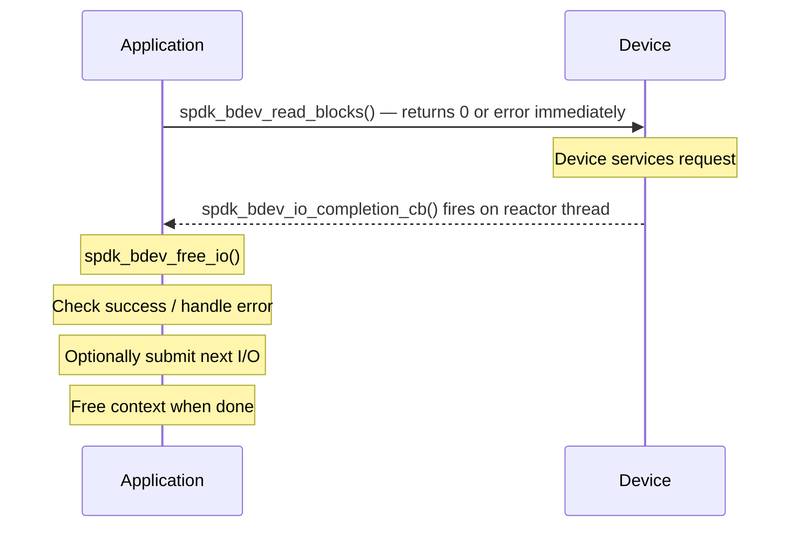

# Module 19: Async I/O Patterns

**Stage**: 2 (Implementation)
**Difficulty**: Intermediate
**Estimated Time**: 4 hours
**Prerequisites**: Modules 01-18

---

## Learning Objectives

After completing this module you will be able to:

- Explain why SPDK uses an async, non-blocking I/O model instead of synchronous calls
- Implement `spdk_bdev_io_completion_cb` callbacks correctly
- Chain dependent async operations without nesting callbacks indefinitely
- Submit batched I/O for maximum throughput and queue-depth utilization
- Propagate errors cleanly through multi-step async sequences
- Release all resources safely when outstanding I/O is still in flight
- Apply queue-depth management and flow-control patterns
- Recognize and avoid the most common async anti-patterns

---

## 1. Why Async? The Fundamental Model

### 1.1 The Cost of Blocking

Traditional storage stacks block the calling thread while a device services the request:

```
Thread A:  submit → [blocked waiting] → resume → next work
Thread B:  submit → [blocked waiting] → resume → next work
```

With NVMe devices capable of sub-100 µs latency and 1M+ IOPS, a thread blocking for even
one I/O wastes thousands of CPU cycles. Worse, OS context switches add another 1–5 µs of
overhead per switch. At scale this collapses throughput.

### 1.2 SPDK's Answer: Polling + Callbacks

SPDK never blocks threads on I/O. Every I/O submission returns immediately. The reactor loop
polls the NVMe queue pairs for completions and invokes completion callbacks inline, all on the
same thread, with no locking:

```
Reactor thread loop:
  while (running) {
      spdk_thread_poll();     /* drains completion queues   */
      /* user callbacks fire here, synchronously            */
      /* new I/Os submitted inside callbacks are safe       */
  }
```

This means:
- Zero context switches during I/O
- Cache-hot data paths (same CPU core throughout)
- No mutexes or condition variables needed
- Callbacks MUST NOT block (no sleep, no mutex wait, no syscall that blocks)

### 1.3 The Completion Callback Contract

The central type in bdev async I/O is:

```c
/*
 * From include/spdk/bdev.h (line 169):
 *
 * typedef void (*spdk_bdev_io_completion_cb)(
 *     struct spdk_bdev_io *bdev_io,
 *     bool success,
 *     void *cb_arg);
 *
 * bdev_io  - the completed I/O object; caller MUST call spdk_bdev_free_io()
 * success  - true if the I/O completed without error
 * cb_arg   - the opaque pointer passed at submission time
 */
```

Critical rules derived from the source (`lib/bdev/bdev.c`, `_bdev_io_complete()`):

1. The callback fires on the SAME thread that submitted the I/O.
2. `spdk_bdev_free_io(bdev_io)` MUST be called exactly once inside the callback.
3. If a submission function returns non-zero, the callback will NOT be called. You must
   handle that error path without relying on the callback.
4. Submitting a new I/O from inside a callback is safe and common — the bdev layer
   defers completion if the new submission would cause infinite recursion.

---

## 2. API Reference: Key Submission Functions

### 2.1 Single-Buffer Read and Write

```c
/*
 * Byte-offset variants (offset and nbytes must be block-size aligned).
 */
int spdk_bdev_read(struct spdk_bdev_desc *desc,
                   struct spdk_io_channel *ch,
                   void *buf,
                   uint64_t offset,   /* bytes */
                   uint64_t nbytes,
                   spdk_bdev_io_completion_cb cb,
                   void *cb_arg);

int spdk_bdev_write(struct spdk_bdev_desc *desc,
                    struct spdk_io_channel *ch,
                    void *buf,
                    uint64_t offset,  /* bytes */
                    uint64_t nbytes,
                    spdk_bdev_io_completion_cb cb,
                    void *cb_arg);

/*
 * Block-offset variants (preferred in new code).
 */
int spdk_bdev_read_blocks(struct spdk_bdev_desc *desc,
                          struct spdk_io_channel *ch,
                          void *buf,
                          uint64_t offset_blocks,
                          uint64_t num_blocks,
                          spdk_bdev_io_completion_cb cb,
                          void *cb_arg);

int spdk_bdev_write_blocks(struct spdk_bdev_desc *desc,
                           struct spdk_io_channel *ch,
                           void *buf,
                           uint64_t offset_blocks,
                           uint64_t num_blocks,
                           spdk_bdev_io_completion_cb cb,
                           void *cb_arg);
```

Return values:
- `0` — submitted; callback will be called
- `-EINVAL` — bad offset or length; callback will NOT be called
- `-ENOMEM` — no `spdk_bdev_io` slots available; callback will NOT be called

### 2.2 Scatter-Gather (vectored) Read and Write

```c
int spdk_bdev_readv_blocks(struct spdk_bdev_desc *desc,
                           struct spdk_io_channel *ch,
                           struct iovec *iov,
                           int iovcnt,
                           uint64_t offset_blocks,
                           uint64_t num_blocks,
                           spdk_bdev_io_completion_cb cb,
                           void *cb_arg);

int spdk_bdev_writev_blocks(struct spdk_bdev_desc *desc,
                            struct spdk_io_channel *ch,
                            struct iovec *iov,
                            int iovcnt,
                            uint64_t offset_blocks,
                            uint64_t num_blocks,
                            spdk_bdev_io_completion_cb cb,
                            void *cb_arg);
```

Use the vectored variants when data spans non-contiguous DMA buffers — for example, when
assembling a network packet header and payload into a single NVMe write without a copy.

---

## 3. Pattern 1: Simple Sequential Chain

The most common pattern: read a block, transform it, write it back.

### 3.1 Context Structure

Every async sequence needs a context structure that carries state across callback
invocations. Never use stack variables — by the time the callback fires, the call stack
that allocated them has long since unwound.

```c
/*
 * Context for a read-modify-write sequence.
 * Allocated before the first submission, freed in the final callback.
 */
struct rmw_ctx {
    struct spdk_bdev_desc   *desc;
    struct spdk_io_channel  *ch;
    void                    *buf;           /* DMA-safe buffer          */
    uint64_t                 offset_blocks;
    uint64_t                 num_blocks;
    void                   (*done_cb)(void *arg, int status);
    void                    *done_arg;
};
```

### 3.2 Full Read-Modify-Write Implementation

```c
/* Forward declarations */
static void rmw_write_done(struct spdk_bdev_io *bdev_io,
                           bool success, void *arg);
static void rmw_read_done(struct spdk_bdev_io *bdev_io,
                          bool success, void *arg);

/*
 * Entry point: initiates the async read-modify-write sequence.
 * Returns 0 if the sequence was started; the caller's done_cb will
 * be invoked on completion or error.
 * Returns negative errno if startup failed (done_cb will NOT fire).
 */
int
start_rmw(struct spdk_bdev_desc *desc,
          struct spdk_io_channel *ch,
          uint64_t offset_blocks,
          uint64_t num_blocks,
          void (*done_cb)(void *arg, int status),
          void *done_arg)
{
    struct rmw_ctx *ctx;
    uint32_t block_size;
    int rc;

    ctx = calloc(1, sizeof(*ctx));
    if (!ctx) {
        return -ENOMEM;
    }

    block_size = spdk_bdev_get_block_size(spdk_bdev_desc_get_bdev(desc));

    ctx->buf = spdk_dma_malloc(num_blocks * block_size,
                               block_size,   /* alignment */
                               NULL);
    if (!ctx->buf) {
        free(ctx);
        return -ENOMEM;
    }

    ctx->desc          = desc;
    ctx->ch            = ch;
    ctx->offset_blocks = offset_blocks;
    ctx->num_blocks    = num_blocks;
    ctx->done_cb       = done_cb;
    ctx->done_arg      = done_arg;

    rc = spdk_bdev_read_blocks(desc, ch, ctx->buf,
                               offset_blocks, num_blocks,
                               rmw_read_done, ctx);
    if (rc != 0) {
        SPDK_ERRLOG("Read submission failed: %d\n", rc);
        spdk_dma_free(ctx->buf);
        free(ctx);
        return rc;
    }

    return 0;
}

/*
 * Step 1 completion: read is done.
 * Transform the data, then submit the write.
 */
static void
rmw_read_done(struct spdk_bdev_io *bdev_io, bool success, void *arg)
{
    struct rmw_ctx *ctx = arg;
    int rc;

    spdk_bdev_free_io(bdev_io);   /* always free before returning */

    if (!success) {
        SPDK_ERRLOG("Read failed at block %" PRIu64 "\n",
                    ctx->offset_blocks);
        ctx->done_cb(ctx->done_arg, -EIO);
        spdk_dma_free(ctx->buf);
        free(ctx);
        return;
    }

    /*
     * Data is in ctx->buf. Modify it in-place.
     * This is synchronous work — keep it short; the reactor is stalled
     * while this callback executes.
     */
    transform_block(ctx->buf, ctx->num_blocks);

    rc = spdk_bdev_write_blocks(ctx->desc, ctx->ch, ctx->buf,
                                ctx->offset_blocks, ctx->num_blocks,
                                rmw_write_done, ctx);
    if (rc != 0) {
        SPDK_ERRLOG("Write submission failed: %d\n", rc);
        ctx->done_cb(ctx->done_arg, rc);
        spdk_dma_free(ctx->buf);
        free(ctx);
    }
    /* On success: returns to the reactor; rmw_write_done fires later */
}

/*
 * Step 2 completion: write is done. Clean up and notify caller.
 */
static void
rmw_write_done(struct spdk_bdev_io *bdev_io, bool success, void *arg)
{
    struct rmw_ctx *ctx = arg;
    int status = success ? 0 : -EIO;

    spdk_bdev_free_io(bdev_io);

    if (!success) {
        SPDK_ERRLOG("Write failed at block %" PRIu64 "\n",
                    ctx->offset_blocks);
    }

    ctx->done_cb(ctx->done_arg, status);
    spdk_dma_free(ctx->buf);
    free(ctx);
}
```

Key observations:
- `spdk_bdev_free_io()` is the first substantive call in every callback.
- On submission failure in `rmw_read_done`, we clean up the same as a regular error — the
  callback for the failed write will never fire.
- `ctx` is always freed on every exit path, including the error paths.

---

## 4. Pattern 2: Parallel I/O with Fan-Out / Fan-In

When multiple independent blocks need to be read or written, submit them all at once and
use a reference count to detect when all have completed.

### 4.1 Fan-Out Context

```c
struct parallel_ctx {
    uint32_t  total;           /* total I/Os submitted        */
    uint32_t  completed;       /* completed so far            */
    int       status;          /* first error seen, or 0      */
    void    (*done_cb)(void *arg, int status);
    void     *done_arg;
    /* Per-IO buffers are owned separately (see below) */
};

struct single_io_ctx {
    struct parallel_ctx *parent;
    void                *buf;
    uint64_t             offset_blocks;
};
```

### 4.2 Implementation

```c
static void
parallel_read_done(struct spdk_bdev_io *bdev_io, bool success, void *arg)
{
    struct single_io_ctx *io_ctx = arg;
    struct parallel_ctx  *pctx   = io_ctx->parent;

    spdk_bdev_free_io(bdev_io);

    if (!success && pctx->status == 0) {
        pctx->status = -EIO;   /* record first error; don't overwrite */
    }

    /* Process the buffer if no error has been seen yet */
    if (success) {
        process_block(io_ctx->buf, io_ctx->offset_blocks);
    }

    spdk_dma_free(io_ctx->buf);
    free(io_ctx);

    pctx->completed++;
    if (pctx->completed == pctx->total) {
        /* All done — fire the parent callback */
        pctx->done_cb(pctx->done_arg, pctx->status);
        free(pctx);
    }
}

int
submit_parallel_reads(struct spdk_bdev_desc *desc,
                      struct spdk_io_channel *ch,
                      uint64_t start_block,
                      uint32_t num_ios,
                      uint32_t blocks_per_io,
                      void (*done_cb)(void *arg, int status),
                      void *done_arg)
{
    struct parallel_ctx *pctx;
    uint32_t block_size;
    uint32_t i;
    int rc;

    pctx = calloc(1, sizeof(*pctx));
    if (!pctx) {
        return -ENOMEM;
    }

    pctx->total   = num_ios;
    pctx->done_cb = done_cb;
    pctx->done_arg = done_arg;

    block_size = spdk_bdev_get_block_size(spdk_bdev_desc_get_bdev(desc));

    for (i = 0; i < num_ios; i++) {
        struct single_io_ctx *io_ctx;

        io_ctx = calloc(1, sizeof(*io_ctx));
        if (!io_ctx) {
            /*
             * Partial submission: we already have (i) I/Os in flight.
             * We cannot cancel them; adjust total so the fan-in still
             * fires when those complete, then return error to caller.
             */
            if (i == 0) {
                free(pctx);
                return -ENOMEM;
            }
            pctx->status = -ENOMEM;
            pctx->total  = i;   /* only i I/Os were actually submitted */
            return -ENOMEM;
        }

        io_ctx->buf = spdk_dma_malloc(blocks_per_io * block_size,
                                      block_size, NULL);
        if (!io_ctx->buf) {
            free(io_ctx);
            if (i == 0) {
                free(pctx);
                return -ENOMEM;
            }
            pctx->status = -ENOMEM;
            pctx->total  = i;
            return -ENOMEM;
        }

        io_ctx->parent        = pctx;
        io_ctx->offset_blocks = start_block + (i * blocks_per_io);

        rc = spdk_bdev_read_blocks(desc, ch, io_ctx->buf,
                                   io_ctx->offset_blocks, blocks_per_io,
                                   parallel_read_done, io_ctx);
        if (rc != 0) {
            spdk_dma_free(io_ctx->buf);
            free(io_ctx);
            if (i == 0) {
                free(pctx);
                return rc;
            }
            pctx->status = rc;
            pctx->total  = i;
            return rc;
        }
    }

    return 0;
}
```

The fan-in check (`completed == total`) is safe because all callbacks fire on the same
reactor thread — no atomic operations or locks are needed.

---

## 5. Pattern 3: Scatter-Gather I/O

Scatter-gather is essential when data is not contiguous in memory. Common cases:
- Network receive buffers assembled into a storage write
- Reading into multiple independent application buffers

```c
struct sg_write_ctx {
    struct spdk_bdev_desc  *desc;
    struct spdk_io_channel *ch;
    struct iovec            iov[4];   /* up to 4 segments */
    int                     iovcnt;
    uint64_t                offset_blocks;
    uint64_t                num_blocks;
    void                  (*done_cb)(void *arg, int status);
    void                   *done_arg;
};

static void
sg_write_done(struct spdk_bdev_io *bdev_io, bool success, void *arg)
{
    struct sg_write_ctx *ctx = arg;
    int i;

    spdk_bdev_free_io(bdev_io);

    /* Free each DMA segment */
    for (i = 0; i < ctx->iovcnt; i++) {
        spdk_dma_free(ctx->iov[i].iov_base);
    }

    ctx->done_cb(ctx->done_arg, success ? 0 : -EIO);
    free(ctx);
}

int
submit_sg_write(struct spdk_bdev_desc *desc,
                struct spdk_io_channel *ch,
                void **bufs,
                size_t *lens,
                int iovcnt,
                uint64_t offset_blocks,
                uint64_t num_blocks,
                void (*done_cb)(void *arg, int status),
                void *done_arg)
{
    struct sg_write_ctx *ctx;
    int i, rc;

    if (iovcnt > 4) {
        return -EINVAL;
    }

    ctx = calloc(1, sizeof(*ctx));
    if (!ctx) {
        return -ENOMEM;
    }

    ctx->desc          = desc;
    ctx->ch            = ch;
    ctx->offset_blocks = offset_blocks;
    ctx->num_blocks    = num_blocks;
    ctx->done_cb       = done_cb;
    ctx->done_arg      = done_arg;
    ctx->iovcnt        = iovcnt;

    for (i = 0; i < iovcnt; i++) {
        ctx->iov[i].iov_base = bufs[i];
        ctx->iov[i].iov_len  = lens[i];
    }

    rc = spdk_bdev_writev_blocks(desc, ch, ctx->iov, iovcnt,
                                 offset_blocks, num_blocks,
                                 sg_write_done, ctx);
    if (rc != 0) {
        free(ctx);  /* buffers freed by caller on submission failure */
        return rc;
    }

    return 0;
}
```

---

## 6. Pattern 4: Error Recovery with Retry

Transient device errors (e.g., NVMe status `ABORTED`) can often be retried. Use a retry
counter in the context structure.

```c
#define MAX_IO_RETRIES  3

struct retrying_io_ctx {
    struct spdk_bdev_desc   *desc;
    struct spdk_io_channel  *ch;
    void                    *buf;
    uint64_t                 offset_blocks;
    uint64_t                 num_blocks;
    uint32_t                 retries;
    void                   (*done_cb)(void *arg, int status);
    void                    *done_arg;
};

/* Forward declaration */
static int submit_retrying_read(struct retrying_io_ctx *ctx);

static void
retrying_read_done(struct spdk_bdev_io *bdev_io, bool success, void *arg)
{
    struct retrying_io_ctx *ctx = arg;
    int rc;

    spdk_bdev_free_io(bdev_io);

    if (success) {
        ctx->done_cb(ctx->done_arg, 0);
        spdk_dma_free(ctx->buf);
        free(ctx);
        return;
    }

    ctx->retries++;
    if (ctx->retries >= MAX_IO_RETRIES) {
        SPDK_ERRLOG("I/O at block %" PRIu64 " failed after %u retries\n",
                    ctx->offset_blocks, MAX_IO_RETRIES);
        ctx->done_cb(ctx->done_arg, -EIO);
        spdk_dma_free(ctx->buf);
        free(ctx);
        return;
    }

    SPDK_WARNLOG("I/O at block %" PRIu64 " failed, retry %u/%u\n",
                 ctx->offset_blocks, ctx->retries, MAX_IO_RETRIES);

    rc = submit_retrying_read(ctx);
    if (rc != 0) {
        SPDK_ERRLOG("Retry submission failed: %d\n", rc);
        ctx->done_cb(ctx->done_arg, rc);
        spdk_dma_free(ctx->buf);
        free(ctx);
    }
}

static int
submit_retrying_read(struct retrying_io_ctx *ctx)
{
    return spdk_bdev_read_blocks(ctx->desc, ctx->ch, ctx->buf,
                                 ctx->offset_blocks, ctx->num_blocks,
                                 retrying_read_done, ctx);
}
```

Note: Do not retry on every error. Consult `spdk_bdev_io_get_nvme_status()` to distinguish
retryable status codes from permanent failures (e.g., bad block).

---

## 7. Queue Depth Management and Flow Control

### 7.1 Why Queue Depth Matters

NVMe devices perform best when fed many concurrent commands (typical optimal queue depth:
32–128 commands per queue). Submitting only one I/O at a time leaves device parallelism
idle. Submitting too many causes `-ENOMEM` returns because the bdev layer's `spdk_bdev_io`
pool is exhausted.

### 7.2 Flow-Controlled Submission

```c
#define TARGET_QUEUE_DEPTH  32

struct flow_ctx {
    struct spdk_bdev_desc   *desc;
    struct spdk_io_channel  *ch;
    uint64_t                 next_block;      /* next block to submit    */
    uint64_t                 total_blocks;    /* total to process        */
    uint32_t                 outstanding;     /* currently in-flight     */
    uint32_t                 block_size;
    int                      error;
    void                   (*done_cb)(void *arg, int status);
    void                    *done_arg;
};

/* Forward declaration */
static void fill_queue(struct flow_ctx *ctx);

static void
flow_read_done(struct spdk_bdev_io *bdev_io, bool success, void *arg)
{
    struct flow_ctx *ctx = arg;

    spdk_bdev_free_io(bdev_io);

    if (!success && ctx->error == 0) {
        ctx->error = -EIO;
    }

    ctx->outstanding--;

    if (ctx->outstanding == 0 && ctx->next_block >= ctx->total_blocks) {
        /* All submitted I/Os have completed */
        ctx->done_cb(ctx->done_arg, ctx->error);
        free(ctx);
        return;
    }

    /* A slot freed up; submit more work */
    fill_queue(ctx);
}

static void
fill_queue(struct flow_ctx *ctx)
{
    int rc;

    while (ctx->outstanding < TARGET_QUEUE_DEPTH &&
           ctx->next_block < ctx->total_blocks) {

        void *buf = spdk_dma_malloc(ctx->block_size, ctx->block_size, NULL);
        if (!buf) {
            /* Pool temporarily exhausted — back off until a completion
             * frees a slot and calls fill_queue() again.             */
            break;
        }

        rc = spdk_bdev_read_blocks(ctx->desc, ctx->ch, buf,
                                   ctx->next_block, 1,
                                   flow_read_done, ctx);
        if (rc == -ENOMEM) {
            /* bdev_io pool exhausted */
            spdk_dma_free(buf);
            break;
        }
        if (rc != 0) {
            spdk_dma_free(buf);
            if (ctx->error == 0) {
                ctx->error = rc;
            }
            break;
        }

        ctx->next_block++;
        ctx->outstanding++;
    }
}

int
start_flow_reads(struct spdk_bdev_desc *desc,
                 struct spdk_io_channel *ch,
                 uint64_t total_blocks,
                 void (*done_cb)(void *arg, int status),
                 void *done_arg)
{
    struct flow_ctx *ctx;

    ctx = calloc(1, sizeof(*ctx));
    if (!ctx) {
        return -ENOMEM;
    }

    ctx->desc         = desc;
    ctx->ch           = ch;
    ctx->total_blocks = total_blocks;
    ctx->next_block   = 0;
    ctx->outstanding  = 0;
    ctx->block_size   = spdk_bdev_get_block_size(
                            spdk_bdev_desc_get_bdev(desc));
    ctx->done_cb      = done_cb;
    ctx->done_arg     = done_arg;

    fill_queue(ctx);

    if (ctx->outstanding == 0) {
        /* Nothing started */
        int err = ctx->error ? ctx->error : -ENOMEM;
        free(ctx);
        return err;
    }

    return 0;
}
```

`fill_queue()` is called both at startup and inside each completion callback. This keeps
the device fed at `TARGET_QUEUE_DEPTH` without overflowing the pool.

---

## 8. Resource Cleanup with Outstanding I/O

### 8.1 The Problem

You cannot free a descriptor or I/O channel while I/O is in flight. Attempting to do so
corrupts internal SPDK state and usually causes a crash or silent data corruption.

### 8.2 Drain Pattern

Use a "draining" flag and an I/O counter to defer resource release:

```c
struct bdev_session {
    struct spdk_bdev_desc   *desc;
    struct spdk_io_channel  *ch;
    uint32_t                 io_count;    /* I/Os currently in flight */
    bool                     draining;    /* true: no new I/Os        */
    void                   (*close_cb)(void *arg);
    void                    *close_arg;
};

static void
session_io_done(struct spdk_bdev_io *bdev_io, bool success, void *arg)
{
    struct bdev_session *sess = arg;

    spdk_bdev_free_io(bdev_io);

    sess->io_count--;

    if (sess->draining && sess->io_count == 0) {
        /* All I/O drained. Safe to release resources now. */
        spdk_put_io_channel(sess->ch);
        spdk_bdev_close(sess->desc);
        sess->close_cb(sess->close_arg);
        free(sess);
    }
}

/*
 * Call this when you want to close the session.
 * If I/O is in flight, release is deferred until all I/O completes.
 */
void
bdev_session_close(struct bdev_session *sess,
                   void (*close_cb)(void *arg),
                   void *close_arg)
{
    sess->draining   = true;
    sess->close_cb   = close_cb;
    sess->close_arg  = close_arg;

    if (sess->io_count == 0) {
        spdk_put_io_channel(sess->ch);
        spdk_bdev_close(sess->desc);
        close_cb(close_arg);
        free(sess);
    }
    /* Otherwise: last in-flight I/O's callback will close */
}

/*
 * Internal: submit a session I/O (increments io_count before submitting).
 */
static int
session_submit_read(struct bdev_session *sess, void *buf,
                    uint64_t offset_blocks, uint64_t num_blocks)
{
    int rc;

    if (sess->draining) {
        return -ESHUTDOWN;
    }

    sess->io_count++;
    rc = spdk_bdev_read_blocks(sess->desc, sess->ch, buf,
                               offset_blocks, num_blocks,
                               session_io_done, sess);
    if (rc != 0) {
        sess->io_count--;
    }

    return rc;
}
```

---

## 9. Error Propagation in Async Context

### 9.1 Two Categories of Error

| Category | When | Callback fires? |
|---|---|---|
| Submission error | `spdk_bdev_*()` returns non-zero | NO |
| Completion error | `success == false` in callback | YES (with `success=false`) |

### 9.2 Extended Error Information

When `success` is false you can retrieve NVMe-level status codes:

```c
static void
error_aware_cb(struct spdk_bdev_io *bdev_io, bool success, void *arg)
{
    if (!success) {
        uint32_t cdw0;
        int sct, sc;

        spdk_bdev_io_get_nvme_status(bdev_io, &cdw0, &sct, &sc);
        SPDK_ERRLOG("NVMe error: sct=%d sc=0x%02x\n", sct, sc);

        /*
         * sct == SPDK_NVME_SCT_GENERIC && sc == SPDK_NVME_SC_ABORTED_BY_REQUEST
         * → retryable
         *
         * sct == SPDK_NVME_SCT_MEDIA_ERROR
         * → permanent; do not retry
         */
    }

    spdk_bdev_free_io(bdev_io);
}
```

### 9.3 Propagating Errors Through a Chain

In a multi-step chain, early failure should short-circuit remaining steps:

```c
static void
step2_cb(struct spdk_bdev_io *bdev_io, bool success, void *arg)
{
    struct chain_ctx *ctx = arg;

    spdk_bdev_free_io(bdev_io);

    /* Always call done with the right status; let caller decide policy */
    ctx->done_cb(ctx->done_arg, success ? 0 : -EIO);
    cleanup_chain_ctx(ctx);
}

static void
step1_cb(struct spdk_bdev_io *bdev_io, bool success, void *arg)
{
    struct chain_ctx *ctx = arg;
    int rc;

    spdk_bdev_free_io(bdev_io);

    if (!success) {
        /* Short-circuit: skip step 2, propagate error immediately */
        ctx->done_cb(ctx->done_arg, -EIO);
        cleanup_chain_ctx(ctx);
        return;
    }

    rc = spdk_bdev_write_blocks(ctx->desc, ctx->ch, ctx->buf,
                                ctx->offset, ctx->num_blocks,
                                step2_cb, ctx);
    if (rc != 0) {
        ctx->done_cb(ctx->done_arg, rc);
        cleanup_chain_ctx(ctx);
    }
}
```

---

## 10. Anti-Patterns to Avoid

### 10.1 Blocking Inside a Callback

```c
/* WRONG: never block in a callback */
static void
bad_callback(struct spdk_bdev_io *bdev_io, bool success, void *arg)
{
    spdk_bdev_free_io(bdev_io);
    sleep(1);                       /* blocks the reactor */
    pthread_mutex_lock(&g_lock);    /* may block if another thread holds it */
    write(fd, buf, len);            /* syscall; can block */
}

/* RIGHT: schedule deferred work via spdk_thread_send_msg() if needed,
 * or restructure to avoid blocking entirely.                          */
```

### 10.2 Forgetting to Free the bdev_io

```c
/* WRONG: leaks a bdev_io slot; pool exhaustion will occur over time */
static void
leaking_callback(struct spdk_bdev_io *bdev_io, bool success, void *arg)
{
    if (!success) {
        return;   /* bdev_io not freed! */
    }
    spdk_bdev_free_io(bdev_io);
}

/* RIGHT: free on every path */
static void
correct_callback(struct spdk_bdev_io *bdev_io, bool success, void *arg)
{
    spdk_bdev_free_io(bdev_io);   /* first line, always */

    if (!success) {
        handle_error(arg);
        return;
    }
    handle_success(arg);
}
```

### 10.3 Using Stack Buffers for DMA

```c
/* WRONG: stack memory is not DMA-safe */
static void
bad_submit(struct spdk_bdev_desc *desc, struct spdk_io_channel *ch)
{
    char buf[4096];   /* stack allocation */
    spdk_bdev_read_blocks(desc, ch, buf, 0, 1, my_cb, NULL);
}

/* RIGHT: always use spdk_dma_malloc() */
static void
correct_submit(struct spdk_bdev_desc *desc, struct spdk_io_channel *ch)
{
    void *buf = spdk_dma_malloc(4096, 4096, NULL);
    if (!buf) { return; }
    spdk_bdev_read_blocks(desc, ch, buf, 0, 1, my_cb, buf);
}
```

### 10.4 Ignoring the Submission Return Value

```c
/* WRONG: if rc != 0, the callback will never fire */
static void
bad_submit_call(struct spdk_bdev_desc *desc, struct spdk_io_channel *ch,
                void *buf)
{
    spdk_bdev_read_blocks(desc, ch, buf, 0, 1, my_cb, NULL);
    /* no check on return value */
}

/* RIGHT: always check */
static int
correct_submit_call(struct spdk_bdev_desc *desc, struct spdk_io_channel *ch,
                    void *buf)
{
    int rc = spdk_bdev_read_blocks(desc, ch, buf, 0, 1, my_cb, NULL);
    if (rc != 0) {
        SPDK_ERRLOG("Submission failed: %d\n", rc);
        spdk_dma_free(buf);
    }
    return rc;
}
```

### 10.5 Accessing Context After Free

```c
/* WRONG: ctx used after free */
static void
use_after_free_cb(struct spdk_bdev_io *bdev_io, bool success, void *arg)
{
    struct my_ctx *ctx = arg;
    spdk_bdev_free_io(bdev_io);
    ctx->done_cb(ctx->done_arg, 0);
    free(ctx);
    SPDK_NOTICELOG("Done: offset=%" PRIu64 "\n", ctx->offset);  /* UAF! */
}

/* RIGHT: read what you need before freeing */
static void
correct_free_cb(struct spdk_bdev_io *bdev_io, bool success, void *arg)
{
    struct my_ctx *ctx = arg;
    void (*done_cb)(void *, int) = ctx->done_cb;
    void *done_arg               = ctx->done_arg;

    spdk_bdev_free_io(bdev_io);
    free(ctx);
    done_cb(done_arg, 0);
}
```

---

## 11. Summary

### Core Rules

| Rule | Reason |
|---|---|
| Call `spdk_bdev_free_io()` as the first act in every callback | Slots are finite; leaks cause -ENOMEM |
| Check the return of every submission call | Non-zero means callback will NOT fire |
| Never block in a callback | The reactor thread is stalled until you return |
| Use `spdk_dma_malloc()` for all I/O buffers | Stack and heap memory may not be DMA-safe |
| Carry all state in heap-allocated context structs | The submitting stack frame is gone by the time the callback fires |
| Increment `io_count` before submit, decrement in callback | Enables correct drain logic for shutdown |
| Keep `outstanding <= queue_depth` and handle -ENOMEM gracefully | Device queues and pools are bounded |

### Async I/O Lifecycle



---

## 12. Practice Exercises

### Exercise 1: Three-Step Sequential Chain

Implement a function `copy_and_verify()` that:
1. Reads N blocks from source offset A
2. Writes the same data to destination offset B
3. Reads back from B and compares with the original buffer

All three steps must be chained asynchronously. The caller receives a single `done_cb`
with `status == 0` on success or negative errno on any failure.

Hint: your context struct needs to hold both the original buffer (for comparison) and
a second buffer for the read-back.

### Exercise 2: Throttled Parallel Writes

Implement `throttled_write_all()` that writes 1024 blocks sequentially but keeps at most
16 writes in flight at any time. Print a log message for every 256 blocks completed.

Hint: use the flow-control pattern from Section 7 with `TARGET_QUEUE_DEPTH = 16`.

### Exercise 3: Graceful Drain on Signal

Given a running session that continuously submits read I/O, implement `signal_shutdown()`
which sets a `draining` flag and arranges for `shutdown_complete_cb()` to be called
exactly once after all in-flight I/O has completed and all DMA buffers have been freed.

### Exercise 4: Error Classification

Extend the retry pattern from Section 6 so that it retries only when the NVMe status
code indicates an aborted command (`SPDK_NVME_SCT_GENERIC` + `SPDK_NVME_SC_ABORTED_BY_REQUEST`),
and immediately fails for media errors (`SPDK_NVME_SCT_MEDIA_ERROR`).

---

## References

- `include/spdk/bdev.h` — full API: `spdk_bdev_io_completion_cb`, `spdk_bdev_read_blocks`,
  `spdk_bdev_write_blocks`, `spdk_bdev_readv_blocks`, `spdk_bdev_writev_blocks`,
  `spdk_bdev_free_io`, `spdk_bdev_io_get_nvme_status`
- `lib/bdev/bdev.c` — internal completion flow: `bdev_io_complete()`, `_bdev_io_complete()`,
  `bdev_io_complete_unsubmitted()`
- `test/unit/lib/bdev/` — unit test patterns showing mock callback wiring
- Module 13 (Bdev Layer) — descriptor and channel lifecycle
- Module 05 (Memory Management) — `spdk_dma_malloc` and DMA safety requirements
- Module 04 (Threading Model) — reactor loop and why blocking is forbidden
