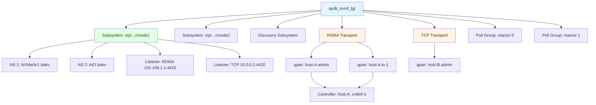

# Module 20: NVMe-oF Target Architecture

**Stage**: 3 - Mastery
**Prerequisites**: Modules 1-19 (SPDK fundamentals, bdev layer, threading model)
**Estimated Time**: 4-5 hours

---

## Table of Contents

1. [NVMe-oF Protocol Overview](#1-nvme-of-protocol-overview)
2. [SPDK NVMe-oF Target Architecture](#2-spdk-nvme-of-target-architecture)
3. [Transport Abstraction Layer](#3-transport-abstraction-layer)
4. [RDMA Transport Internals](#4-rdma-transport-internals)
5. [TCP Transport Internals](#5-tcp-transport-internals)
6. [FC Transport Overview](#6-fc-transport-overview)
7. [Connection Lifecycle and Management](#7-connection-lifecycle-and-management)
8. [Namespace Sharing and Multipath](#8-namespace-sharing-and-multipath)
9. [Discovery Service Implementation](#9-discovery-service-implementation)
10. [Configuration via JSON-RPC](#10-configuration-via-json-rpc)
11. [Performance Tuning](#11-performance-tuning)
12. [Key Takeaways](#12-key-takeaways)
13. [Exercises](#13-exercises)
14. [References](#14-references)

---

## 1. NVMe-oF Protocol Overview

### 1.1 What is NVMe over Fabrics?

NVMe over Fabrics (NVMe-oF) extends the NVMe protocol beyond PCIe to allow NVMe commands
to be sent over network fabrics: RDMA (RoCE, iWARP, InfiniBand), TCP, and Fibre Channel.
The NVMe-oF specification (published by NVM Express, Inc.) defines how NVMe commands and
data are encapsulated and transported across these fabrics.

The key insight is that the NVMe command set is preserved end-to-end. An initiator sends
the same NVMe Read/Write/Admin commands over the fabric that it would send locally over
PCIe. The target unpacks these commands and executes them against real storage, returning
NVMe completions.

**Why NVMe-oF matters for SPDK**:
- SPDK is designed for poll-mode, zero-copy, high-throughput I/O
- NVMe-oF lets SPDK serve as a high-performance storage target for disaggregated storage
- Single SPDK target can serve hundreds of initiators with sub-100 microsecond latency

### 1.2 Protocol Hierarchy

```
Initiator Side                          Target Side
─────────────────────────────────────────────────────────
┌──────────────────┐                ┌──────────────────────┐
│  NVMe Driver     │                │  SPDK NVMe-oF Target  │
│  (host kernel or │                │  (spdk_nvmf_tgt)      │
│   SPDK nvme lib) │                │                       │
└────────┬─────────┘                └──────────┬───────────┘
         │  NVMe Commands (Fabrics Capsules)    │
         │◄────────────────────────────────────►│
┌────────┴─────────┐                ┌──────────┴───────────┐
│  Fabric Driver   │                │  Transport Layer      │
│  (RDMA/TCP/FC)   │                │  (RDMA/TCP/FC)        │
└────────┬─────────┘                └──────────┬───────────┘
         │  Network Fabric                      │
         └──────────────────────────────────────┘
```

### 1.3 NVMe-oF Fabric Commands

The NVMe-oF spec adds a new command type: **Fabric Commands** (opcode 0x7F). These are
used for connection management and are distinct from normal NVMe commands:

| Fabric Command   | Purpose                                   |
|------------------|-------------------------------------------|
| `Connect`        | Establish admin or I/O queue pair         |
| `Property Get`   | Read target controller properties         |
| `Property Set`   | Write target controller properties        |
| `Auth Send`      | Send DH-HMAC-CHAP authentication data     |
| `Auth Recv`      | Receive DH-HMAC-CHAP authentication data  |
| `Disconnect`     | Tear down a queue pair                    |

### 1.4 Queue Pairs and Controllers

NVMe-oF maintains the NVMe queue model:
- Each connection to a target establishes a **Queue Pair** (QP): one submission queue
  and one completion queue.
- The first QP is always the **Admin Queue** (QID=0). It handles controller-level
  commands: Identify, Get Log Page, Set Features, etc.
- Subsequent QPs are **I/O Queues**. Each carries data read/write commands.
- All QPs connecting to the same subsystem from the same host are grouped under a
  **Controller** (a virtual NVMe controller).

```
Host (Initiator)
  ├── Admin QP  (QID=0)  ──►  Controller (cntlid=N)
  ├── I/O QP   (QID=1)  ──►  Controller (cntlid=N)
  ├── I/O QP   (QID=2)  ──►  Controller (cntlid=N)
  └── I/O QP   (QID=N)  ──►  Controller (cntlid=N)
```

### 1.5 NQN - NVMe Qualified Name

Every subsystem and host is identified by an **NQN** (NVMe Qualified Name):

```
nqn.2014-08.org.nvmexpress:uuid:<UUID>          # Standard host NQN
nqn.2016-06.io.spdk:<name>                      # SPDK subsystem NQN
nqn.2014-08.org.nvmexpress.discovery            # Well-known discovery NQN
```

The NQN is used during the Connect command to identify which subsystem and which host
is connecting. Access control is enforced by matching host NQNs.

---

## 2. SPDK NVMe-oF Target Architecture

### 2.1 Top-Level Structure

```
spdk_nvmf_tgt
  ├── name (e.g., "nvmf_tgt")
  ├── max_subsystems
  ├── discovery_genctr (generation counter for discovery log)
  ├── subsystems (red-black tree, indexed by subsystem ID)
  ├── transports (TAILQ: RDMA, TCP, FC instances)
  ├── poll_groups (one per reactor thread)
  └── referrals (for distributed discovery)
```

The target struct (`struct spdk_nvmf_tgt` in `lib/nvmf/nvmf_internal.h`) is the root
object. All subsystems, transports, and poll groups hang off the target.

### 2.2 Subsystems

A **subsystem** (`struct spdk_nvmf_subsystem`) represents a logical NVMe storage target.
It has:
- An NQN identifying it uniquely
- A set of **namespaces** (bdev mappings)
- A set of **listeners** (transport + address combinations)
- An **allowed hosts** list (access control)

```c
// From include/spdk/nvmf.h - creating a subsystem
struct spdk_nvmf_subsystem *spdk_nvmf_subsystem_create(
    struct spdk_nvmf_tgt *tgt,
    const char *nqn,
    enum spdk_nvmf_subtype type,    // NVME or DISCOVERY
    uint32_t num_ns);               // initial namespace count
```

Subsystem states (from `lib/nvmf/nvmf_internal.h`):

```
INACTIVE ──► ACTIVATING ──► ACTIVE ──► PAUSING ──► PAUSED
                                             ▲            │
                                             └────────────┘ (RESUMING)
ACTIVE ──► DEACTIVATING ──► INACTIVE
```

State transitions are explicit and asynchronous. The subsystem must be paused before
modifying namespace or listener lists. This prevents races with in-flight I/O.

### 2.3 Namespaces

A **namespace** maps an NSID (1-based integer) to a bdev:

```c
struct spdk_nvmf_ns_opts {
    uint32_t nsid;          // 0 = auto-assign
    struct spdk_uuid uuid;
    uint32_t nguid[2];      // Namespace GUID
    uint32_t eui64[2];      // IEEE EUI-64
    uint32_t anagrpid;      // ANA group ID
    bool     no_auto_visible; // hide from hosts not explicitly allowed
};

// Adding a namespace
int spdk_nvmf_subsystem_add_ns_ext(
    struct spdk_nvmf_subsystem *subsystem,
    const char *bdev_name,
    const struct spdk_nvmf_ns_opts *opts,
    size_t opts_size,
    const char *ptpl_file);  // persistent through power loss reservation file
```

The namespace layer translates NVMe LBA operations to bdev I/O. It handles:
- LBA-to-bdev offset translation
- NVMe metadata (DIF/DIX protection information)
- Reservation handling (SCSI-style persistent reservations over NVMe)
- ANA (Asymmetric Namespace Access) state reporting

### 2.4 Listeners

A **listener** is a (transport type, IP address, port) tuple on which the subsystem
accepts connections:

```c
// Add a listener to a subsystem
int spdk_nvmf_subsystem_add_listener(
    struct spdk_nvmf_subsystem *subsystem,
    struct spdk_nvme_transport_id *trid,
    spdk_nvmf_tgt_subsystem_listen_done_fn cb_fn,
    void *cb_arg);
```

One subsystem can have multiple listeners across different transports and addresses.
A single listener (transport endpoint) can serve multiple subsystems.

### 2.5 Architecture Diagram



### 2.6 Poll Groups

Each reactor thread has a **poll group** (`struct spdk_nvmf_poll_group`). When a new
queue pair is connected, it is assigned to a poll group. The poll group's reactor then
owns that qpair for all future polling.

Statistics tracked per poll group (from `include/spdk/nvmf.h`):

```c
struct spdk_nvmf_poll_group_stat {
    uint32_t admin_qpairs;          // cumulative admin qpairs seen
    uint32_t io_qpairs;             // cumulative I/O qpairs seen
    uint32_t current_admin_qpairs;  // currently active admin qpairs
    uint32_t current_io_qpairs;     // currently active I/O qpairs
    uint64_t pending_bdev_io;       // I/O waiting on bdev
    uint64_t completed_nvme_io;     // completed I/O commands
};
```

---

## 3. Transport Abstraction Layer

### 3.1 Design Philosophy

SPDK's transport abstraction (`lib/nvmf/transport.c`, `include/spdk/nvmf_transport.h`)
allows new fabric transports to be added as plugins without modifying the core NVMe-oF
target code. Each transport registers a set of operation callbacks.

### 3.2 Transport Operations Structure

The key interface is `struct spdk_nvmf_transport_ops` defined in
`include/spdk/nvmf_transport.h`. Each transport must implement these callbacks:

```c
struct spdk_nvmf_transport_ops {
    const char *name;                   // "RDMA", "TCP", "FC"
    enum spdk_nvme_transport_type type; // SPDK_NVME_TRANSPORT_RDMA, etc.

    // Transport lifecycle
    struct spdk_nvmf_transport *(*create)(struct spdk_nvmf_transport_opts *opts);
    int (*destroy)(struct spdk_nvmf_transport *transport, ...);

    // Listener management
    int (*listen)(struct spdk_nvmf_transport *transport,
                  const struct spdk_nvme_transport_id *trid,
                  struct spdk_nvmf_listen_opts *opts);
    void (*stop_listen)(struct spdk_nvmf_transport *transport,
                        const struct spdk_nvme_transport_id *trid);
    void (*accept)(struct spdk_nvmf_transport *transport, ...);

    // Poll group management (per-reactor)
    struct spdk_nvmf_transport_poll_group *(*poll_group_create)(
        struct spdk_nvmf_transport *transport,
        struct spdk_nvmf_poll_group *group);
    int (*poll_group_destroy)(struct spdk_nvmf_transport_poll_group *group);
    int (*poll_group_add)(struct spdk_nvmf_transport_poll_group *group,
                          struct spdk_nvmf_qpair *qpair);
    int (*poll_group_remove)(struct spdk_nvmf_transport_poll_group *group,
                             struct spdk_nvmf_qpair *qpair);
    int (*poll_group_poll)(struct spdk_nvmf_transport_poll_group *group);

    // Queue pair operations
    void (*qpair_fini)(struct spdk_nvmf_qpair *qpair, ...);
    int (*qpair_get_peer_trid)(struct spdk_nvmf_qpair *qpair,
                               struct spdk_nvme_transport_id *trid);
    int (*qpair_get_local_trid)(struct spdk_nvmf_qpair *qpair,
                                struct spdk_nvme_transport_id *trid);

    // Request completion
    int (*req_complete)(struct spdk_nvmf_request *req);
    void (*req_free)(struct spdk_nvmf_request *req);
};
```

### 3.3 Transport Registration

Transports register themselves at startup using:

```c
void spdk_nvmf_transport_register(const struct spdk_nvmf_transport_ops *ops);
```

From `lib/nvmf/transport.c`, the registry is a simple linked list:

```c
TAILQ_HEAD(nvmf_transport_ops_list, nvmf_transport_ops_list_element)
g_spdk_nvmf_transport_ops = TAILQ_HEAD_INITIALIZER(g_spdk_nvmf_transport_ops);
```

At the bottom of `rdma.c` and `tcp.c`, each transport exports its ops struct:

```c
// From rdma.c
const struct spdk_nvmf_transport_ops spdk_nvmf_transport_rdma;

// From tcp.c
const struct spdk_nvmf_transport_ops spdk_nvmf_transport_tcp;
```

### 3.4 Request Lifecycle in the Transport Layer

Every incoming NVMe-oF command becomes a `struct spdk_nvmf_request`:

```c
struct spdk_nvmf_request {
    struct spdk_nvmf_qpair  *qpair;     // which queue pair
    uint32_t                 length;    // data length
    uint8_t                  xfer;      // H2C, C2H, or BIDIRECTIONAL
    union nvmf_h2c_msg      *cmd;       // command capsule (64 bytes)
    union nvmf_c2h_msg      *rsp;       // response (16 bytes)
    struct iovec             iov[...];  // data scatter-gather list
    struct spdk_memory_domain *memory_domain; // for zero-copy/DMA
    struct spdk_accel_sequence *accel_sequence; // for crypto/CRC offload
    enum spdk_nvmf_zcopy_phase zcopy_phase;     // zero-copy state
    // ...
};
```

The command and response unions hold the raw NVMe-oF wire format:

```c
union nvmf_h2c_msg {
    struct spdk_nvmf_capsule_cmd     nvmf_cmd;     // generic NVMe-oF
    struct spdk_nvme_cmd             nvme_cmd;     // standard NVMe
    struct spdk_nvmf_fabric_connect_cmd connect_cmd; // Connect fabric cmd
    struct spdk_nvmf_fabric_prop_set_cmd prop_set_cmd;
    struct spdk_nvmf_fabric_prop_get_cmd prop_get_cmd;
    // ...
};
```

### 3.5 Buffer Management

SPDK NVMe-oF uses the **iobuf** subsystem for data buffers. Rather than allocating
per-request buffers, buffers are drawn from a shared pool:

```c
// Transport opts fields controlling the pool
struct spdk_nvmf_transport_opts {
    uint32_t num_shared_buffers;    // size of the shared pool
    uint32_t buf_cache_size;        // per-thread cache size
    uint32_t in_capsule_data_size;  // max data in the command capsule itself
    uint32_t io_unit_size;          // size of each buffer unit
    uint32_t max_io_size;           // max total I/O size (sets MDTS)
    bool     zcopy;                 // use zero-copy if bdev supports it
    // ...
};
```

When `in_capsule_data_size` is large enough to hold the entire write payload, no
separate buffer allocation is needed: the data arrives inline in the capsule.

---

## 4. RDMA Transport Internals

### 4.1 RDMA Concepts Relevant to NVMe-oF

RDMA (Remote Direct Memory Access) allows a remote host to read from or write to
memory on the target without involving the target CPU:

- **RDMA READ**: Initiator reads data directly from target memory
- **RDMA WRITE**: Initiator writes data directly into target memory
- **Send/Receive**: Used for command and response capsules
- **Memory Registration (MR)**: Pinned memory regions that can be used in RDMA ops
- **Queue Pair (QP)**: The fundamental RDMA communication endpoint
- **Completion Queue (CQ)**: Where RDMA operation completions are reported
- **Work Request (WR)**: A descriptor submitted to a QP to trigger an RDMA operation
- **Scatter-Gather Entry (SGE)**: A (addr, length, lkey) tuple in a WR

### 4.2 RDMA Transport Defaults

From `lib/nvmf/rdma.c`:

```c
#define NVMF_DEFAULT_TX_SGE      SPDK_NVMF_MAX_SGL_ENTRIES  // 16
#define NVMF_DEFAULT_RSP_SGE     1
#define NVMF_DEFAULT_RX_SGE      2
#define NVMF_DEFAULT_MSDBD       16   // max SGL descriptors per I/O

#define DEFAULT_NVMF_RDMA_CQ_SIZE   4096
// Work requests per QP = queue_depth * 3 + 2
#define MAX_WR_PER_QP(queue_depth)  (queue_depth * 3 + 2)
```

The `3x` multiplier arises because each I/O request may require:
1. One Receive WR (for the capsule/command)
2. One RDMA READ or WRITE WR (for the data)
3. One Send WR (for the completion response)

### 4.3 RDMA Request State Machine

The RDMA transport uses an explicit state machine for each request:

```
FREE
  │
  ▼
NEW  ──► NEED_BUFFER ──► HAVE_BUFFER
                              │
              ┌───────────────┤
              │               │
              ▼               ▼
  DATA_TRANSFER_TO_CONTROLLER_PENDING
              │
              ▼
  TRANSFERRING_HOST_TO_CONTROLLER  (RDMA READ in flight)
              │
              ▼
  READY_TO_EXECUTE
              │
              ▼
  EXECUTING   (bdev I/O in flight)
              │
              ▼
  EXECUTED
              │
              ▼
  DATA_TRANSFER_TO_HOST_PENDING
              │
              ▼
  TRANSFERRING_CONTROLLER_TO_HOST (RDMA WRITE in flight)
              │
              ▼
  READY_TO_COMPLETE_PENDING
              │
              ▼
  COMPLETING  (Send WR for completion response in flight)
              │
              ▼
  COMPLETED ──► FREE
```

### 4.4 Memory Registration Strategy

For RDMA to work, all data buffers must be **memory-registered** (pinned and given
an lkey/rkey pair). SPDK does this at buffer pool creation time, not per-I/O:

```
Startup time:
  spdk_dma_malloc() → contiguous huge page memory
  ibv_reg_mr()      → register with RDMA device
  Store lkey/rkey   → use in WR SGEs at I/O time

Per I/O (no allocation, no registration):
  Pick buffer from pool
  Build WR with stored lkey
  Post WR to QP
```

This is a key performance advantage over kernel RDMA stacks which may register
memory per-I/O.

### 4.5 RDMA Transport Data Flow (Read I/O)

```
Initiator                                    Target (SPDK)
─────────────────────────────────────────────────────────────
1. Send(NVMe Read CMD capsule) ──────────────►
                                              Receive capsule
                                              Allocate request
                                              Allocate buffer
2.               ◄─────────────── RDMA READ (pull data from initiator)
   (for write:    RDMA WRITE to push data to initiator)
                                              Wait for RDMA completion
                                              Submit bdev I/O
                                              Wait for bdev completion
3.               ◄─────────────── Send(NVMe Completion capsule)
   Complete I/O
```

### 4.6 InfiniBand, RoCE, and iWARP

SPDK's RDMA transport supports multiple RDMA providers via the
`spdk_internal/rdma_provider.h` abstraction:

- **InfiniBand**: Native RDMA, lossless fabric, requires IB switch
- **RoCE v1**: RDMA over Converged Ethernet (Layer 2), requires lossless Ethernet
- **RoCE v2**: RDMA over UDP/IP (Layer 3), requires ECN/PFC for lossless behavior
- **iWARP**: RDMA over TCP, works on any IP network, lower performance than RoCE

The provider is selected at compile time or via the `rdma_provider` parameter.
Performance ranking: InfiniBand ~ RoCE v2 > iWARP.

---

## 5. TCP Transport Internals

### 5.1 NVMe/TCP Protocol

NVMe/TCP (defined in NVMe-oF TP 8000) encapsulates NVMe-oF capsules in TCP using
a PDU (Protocol Data Unit) format. Each PDU has:

```
┌─────────────────────────────┐
│  Common Header (8 bytes)    │  PDU type, flags, hlen, pdo, plen
├─────────────────────────────┤
│  PDU-specific Header        │  Varies by PDU type
├─────────────────────────────┤
│  Header Digest (optional)   │  CRC32C of header
├─────────────────────────────┤
│  Data (optional)            │  Inline data for capsules
├─────────────────────────────┤
│  Data Digest (optional)     │  CRC32C of data
└─────────────────────────────┘
```

PDU types:
| PDU Type   | Direction | Purpose                                    |
|------------|-----------|--------------------------------------------|
| ICReq      | H→T       | Initialize Connection Request              |
| ICResp     | T→H       | Initialize Connection Response             |
| CapsuleCmd | H→T       | NVMe command capsule                       |
| CapsuleResp| T→H       | NVMe completion capsule                    |
| H2CData    | H→T       | Host-to-controller data (for writes)       |
| C2HData    | T→H       | Controller-to-host data (for reads)        |
| R2T         | T→H       | Ready-to-transfer (write flow control)     |
| TermReq    | H↔T       | Terminate connection                       |

### 5.2 TCP Transport Defaults

From `lib/nvmf/tcp.c`:

```c
#define SPDK_NVMF_TCP_DEFAULT_MAX_IO_QUEUE_DEPTH       128
#define SPDK_NVMF_TCP_DEFAULT_MAX_ADMIN_QUEUE_DEPTH    128
#define SPDK_NVMF_TCP_DEFAULT_MAX_QPAIRS_PER_CTRLR    128
#define SPDK_NVMF_TCP_DEFAULT_IN_CAPSULE_DATA_SIZE     4096   // bytes
#define SPDK_NVMF_TCP_DEFAULT_MAX_IO_SIZE              131072 // 128 KiB
#define SPDK_NVMF_TCP_DEFAULT_IO_UNIT_SIZE             131072 // 128 KiB
#define SPDK_NVMF_TCP_DEFAULT_NUM_SHARED_BUFFERS       511
#define NVMF_TCP_MAX_ACCEPT_SOCK_ONE_TIME              16
```

The `in_capsule_data_size` of 4096 bytes means write I/Os up to 4 KiB can be
sent inline with the command capsule, eliminating the R2T round-trip.

### 5.3 TCP Request State Machine

The TCP transport has a detailed state machine for each request:

```
FREE
 │
 ▼
NEW
 │
 ▼
NEED_BUFFER ──► HAVE_BUFFER
                    │
          ┌─────────┴──────────┐
          │                    │
          ▼                    ▼
AWAITING_ZCOPY_START    TRANSFERRING_HOST_TO_CONTROLLER
          │                    │
          ▼                    ▼
ZCOPY_START_COMPLETED   AWAITING_R2T_ACK
          │                    │
          └─────────┬──────────┘
                    ▼
             READY_TO_EXECUTE
                    │
                    ▼
               EXECUTING
                    │
                    ▼
               EXECUTED
                    │
                    ▼
           READY_TO_COMPLETE
                    │
                    ▼
  TRANSFERRING_CONTROLLER_TO_HOST
                    │
                    ▼
                 COMPLETED ──► FREE
```

Zero-copy (ZCOPY) states apply when the underlying bdev supports zcopy and the
transport opts have `zcopy = true`. In this case, the bdev provides its own buffer
directly, avoiding a copy between the bdev and the network layer.

### 5.4 TCP Connection Establishment

```
Initiator                            Target
──────────────────────────────────────────────────
TCP connect ──────────────────────►
                                    Accept socket
Send ICReq PDU ──────────────────►  (Initialize Connection Request)
                                    Negotiate params (MAXH2CDATA, MAXR2T, etc.)
             ◄─────────────────── Send ICResp PDU
Send Connect capsule (Admin QP) ──► (NVMe-oF Fabric Connect command)
                                    Create controller
                                    Assign cntlid
             ◄─────────────────── Send Connect response (cntlid in response)
Admin QP established
Send Connect capsule (I/O QP N) ──► (second Connect for I/O queue)
             ◄─────────────────── Connect response
I/O QP established
NVMe commands flow normally...
```

### 5.5 TCP Socket Layer

SPDK's TCP transport uses the SPDK sock abstraction (`spdk/sock.h`) rather than
calling POSIX `read()`/`write()` directly. This allows:
- **TLS support**: The sock impl can wrap the socket with TLS (via OpenSSL/ktls)
- **Kernel TLS (kTLS)**: Offload TLS record processing to the kernel
- **Vectored I/O**: `readv()`/`writev()` for efficient scatter-gather

The acceptor polls for new connections at a configurable rate:

```c
#define SPDK_NVMF_DEFAULT_ACCEPT_POLL_RATE_US  10000  // 10ms default
```

### 5.6 TLS Security

SPDK supports TLS 1.3 for NVMe/TCP. Configuration via listen options:

```c
struct spdk_nvmf_listen_opts {
    bool secure_channel; // require TLS on all new connections
    // ...
};
```

Pre-Shared Keys (PSK) for TLS are managed via the SPDK keyring subsystem and
referenced by name in the listener configuration.

---

## 6. FC Transport Overview

### 6.1 NVMe/FC Architecture

NVMe over Fibre Channel (NVMe/FC) uses an FC fabric as the transport. It is defined
in the FC-NVMe-2 standard (T11 working group).

Key differences from RDMA and TCP:
- FC uses a dedicated hardware FC HBA (Host Bus Adapter)
- Addressing uses N_Port IDs (24-bit FC addresses) and WWPNs (64-bit names)
- FC provides lossless, ordered delivery natively
- The SPDK FC transport (`lib/nvmf/fc.c`) acts as the FC target logic
  layer; the actual FC hardware driver is a separate lower-level component

### 6.2 FC Transport Structure

```
SPDK NVMe-oF Target
  └── FC Transport (fc.c, fc_ls.c)
        ├── LS (Link Service) handler (fc_ls.c)
        │     Handles: PLOGI, FLOGI, PRLI, etc.
        └── I/O handler (fc.c)
              Handles: FCP commands mapped to NVMe
```

The FC transport in SPDK is used with SoC-based FC adapters that expose a
management interface; the SPDK FC transport drives that interface via callbacks
rather than direct ibv_ / socket calls.

### 6.3 FC vs RDMA vs TCP Summary

| Feature           | RDMA (RoCE/IB)  | TCP              | FC               |
|-------------------|-----------------|------------------|------------------|
| Latency           | Lowest (~5 µs)  | Low (~20-50 µs)  | Low (~15-30 µs)  |
| Network Infra     | RDMA fabric     | Standard Ethernet| FC SAN fabric    |
| CPU Overhead      | Minimal (offload)| Moderate         | Minimal (offload)|
| Distance          | Short (DC)      | Any IP network   | Short-mid (DC)   |
| Security          | IPsec (fabric)  | TLS 1.3          | FC-SP-2          |
| Typical Use       | HPC, low-latency| Cloud, general   | Enterprise SAN   |

---

## 7. Connection Lifecycle and Management

### 7.1 Queue Pair States

From `include/spdk/nvmf_transport.h`:

```c
enum spdk_nvmf_qpair_state {
    SPDK_NVMF_QPAIR_UNINITIALIZED = 0,
    SPDK_NVMF_QPAIR_CONNECTING,       // Connect fabric command received
    SPDK_NVMF_QPAIR_AUTHENTICATING,   // DH-HMAC-CHAP in progress
    SPDK_NVMF_QPAIR_ENABLED,          // Ready for NVMe commands
    SPDK_NVMF_QPAIR_DEACTIVATING,     // Disconnect initiated
    SPDK_NVMF_QPAIR_ERROR,            // Fatal error, pending cleanup
};
```

### 7.2 Connection Establishment Flow

```
Transport accept() detects new connection
    │
    ▼
Transport creates qpair (state: UNINITIALIZED)
    │
    ▼
Target assigns qpair to a poll group (round-robin or custom policy)
    │
    ▼
poll_group_add() called on transport
    │
    ▼
NVMe-oF Connect command received (state: CONNECTING)
    │
    ├── Is this Admin QP (QID=0)?
    │     ├── YES: Create new Controller, assign cntlid
    │     └── NO:  Find existing Controller by hostnqn+cntlid
    │
    ▼
Authentication (if configured, state: AUTHENTICATING)
    │
    ▼
State: ENABLED - I/O can begin
```

### 7.3 Keep-Alive and Association Timeout

NVMe-oF requires keep-alive to detect dead connections:

```c
// From nvmf_internal.h
#define NVMF_DISC_KATO_IN_MS       120000   // 120s discovery keep-alive
#define NVMF_KAS_TIME_UNIT_IN_MS   100      // Keep-Alive Granularity: 100ms
#define NVMF_DEFAULT_KAS           100      // Default KAS: 10 seconds
#define NVMF_DEFAULT_MIN_KATO      10000    // Min keep-alive timeout: 10s
```

The KAS (Keep-Alive Support) value is advertised in the controller Identify data.
The host sets a KATO (Keep-Alive Timeout) via Set Features. If the target does not
receive any command from the host within the KATO period, the association is
terminated.

The association timeout also covers the time for the host to complete the full
connection sequence (ICReq/ICResp + Connect):

```c
// From transport opts
uint32_t association_timeout;  // ms, default 120000
```

### 7.4 Disconnect and Cleanup

```c
// Disconnect a single qpair
void nvmf_qpair_disconnect(struct spdk_nvmf_qpair *qpair, ...);

// Internal context for sequential qpair disconnection
struct nvmf_qpair_disconnect_many_ctx {
    struct spdk_nvmf_subsystem   *subsystem;
    struct spdk_nvmf_poll_group  *group;
    spdk_nvmf_poll_group_mod_done cpl_fn;
    void                         *cpl_ctx;
};
```

Disconnect is asynchronous. The qpair moves to DEACTIVATING, all in-flight requests
complete or abort, then the transport layer frees the qpair resources.

### 7.5 Authentication (DH-HMAC-CHAP)

SPDK supports NVMe-oF DH-HMAC-CHAP authentication (NVMe-oF spec section 8):

```c
// From nvmf_internal.h
enum nvmf_auth_key_type {
    NVMF_AUTH_KEY_HOST,    // key used to authenticate the host
    NVMF_AUTH_KEY_CTRLR,   // key used for bidirectional auth
};
```

Authentication uses the Auth Send/Auth Recv fabric commands and is managed by
the `lib/nvmf/auth.c` module. Keys are stored in the SPDK keyring.

---

## 8. Namespace Sharing and Multipath

### 8.1 Sharing a Namespace Across Multiple Hosts

A single namespace (bdev) can be exposed to multiple hosts simultaneously. SPDK
handles concurrent access at the bdev layer:

```json
{
    "method": "nvmf_subsystem_add_ns",
    "params": {
        "nqn": "nqn.2016-06.io.spdk:cnode1",
        "namespace": {
            "nsid": 1,
            "bdev_name": "NVMe0n1"
        }
    }
}
```

Both `host-A` and `host-B` can connect to this subsystem and access NS 1. The bdev
layer provides the necessary locking for concurrent access to the same LBAs.

### 8.2 NVMe Reservations

For exclusive access control, SPDK implements NVMe Persistent Reservations (PR).
These are SCSI-style reservations adapted for NVMe:

```
Reservation Types:
  Write Exclusive (WE)           - one registrant can write
  Exclusive Access (EA)          - one registrant has full access
  Write Exclusive - Registrants Only (WERO)
  Exclusive Access - Registrants Only (EARO)
  Write Exclusive - All Registrants (WEAR)
  Exclusive Access - All Registrants (EAAR)
```

Persistent through power loss (PTPL) reservations are stored in a file specified
at namespace creation time via the `ptpl_file` parameter.

### 8.3 ANA - Asymmetric Namespace Access

ANA (defined in NVMe TP 4004) allows a namespace to report different access states
per controller (path):

| ANA State        | Meaning                                              |
|------------------|------------------------------------------------------|
| Optimized        | Best path: full performance, use preferentially      |
| Non-Optimized    | Available but not preferred (e.g., longer path)      |
| Inaccessible     | Path is down, do not use                             |
| Persistent Loss  | Path will not recover without admin intervention     |
| Change           | State is transitioning, retry soon                   |

SPDK sets ANA state per-listener when the listener is added to a subsystem:

```c
struct spdk_nvmf_listen_opts {
    enum spdk_nvme_ana_state ana_state; // SPDK_NVME_ANA_OPTIMIZED_STATE by default
    // ...
};
```

This enables active-active and active-passive multipath configurations:

```
Host
 ├── Path 1 ──► SPDK Target A (ANA: Optimized)    ──► Shared bdev
 └── Path 2 ──► SPDK Target B (ANA: Non-Optimized) ──► Shared bdev
```

### 8.4 Multipath Configuration Example

Two SPDK targets sharing the same NVMe drive (e.g., via vfio-user or a shared bdev):

```bash
# Target A (primary)
rpc.py nvmf_subsystem_add_listener nqn.2016-06.io.spdk:cnode1 \
    -t tcp -a 192.168.1.1 -s 4420 --ana-state optimized

# Target B (secondary)
rpc.py nvmf_subsystem_add_listener nqn.2016-06.io.spdk:cnode1 \
    -t tcp -a 192.168.1.2 -s 4420 --ana-state non_optimized
```

The host NVMe multipath driver (dm-multipath or native NVMe multipath) will use
Target A preferentially and fail over to Target B if needed.

---

## 9. Discovery Service Implementation

### 9.1 What is the Discovery Service?

Before connecting to a subsystem, a host must first discover what subsystems are
available and where to connect to them. This is done via the **Discovery Service**:

1. Host connects to the well-known Discovery NQN: `nqn.2014-08.org.nvmexpress.discovery`
2. Host sends an Admin command: `Get Log Page (LID=70h)` to retrieve the Discovery
   Log Page (DLP)
3. The DLP lists all subsystem NQNs and their transport/address information
4. Host disconnects from discovery and connects directly to desired subsystems

### 9.2 Discovery Subsystem in SPDK

SPDK automatically creates a discovery subsystem. When you add a listener to any
regular subsystem, that listener is automatically advertised in the discovery log.

```c
// From nvmf.c - referrals are added to the discovery log
spdk_nvmf_send_discovery_log_notice(tgt, NULL);
```

The `discovery_genctr` (generation counter) in `spdk_nvmf_tgt` is incremented any
time the discovery log changes. Hosts use Asynchronous Event Requests (AER) to be
notified of discovery log changes without polling.

### 9.3 Discovery Log Filtering

From `include/spdk/nvmf.h`, SPDK supports fine-grained filtering of what appears
in the discovery log:

```c
enum spdk_nvmf_tgt_discovery_filter {
    // Show all listeners to all hosts
    SPDK_NVMF_TGT_DISCOVERY_MATCH_ANY = 0,
    // Only show listeners of the same transport type the host used for discovery
    SPDK_NVMF_TGT_DISCOVERY_MATCH_TRANSPORT_TYPE = 1u << 0u,
    // Only show listeners with the same address the host used for discovery
    SPDK_NVMF_TGT_DISCOVERY_MATCH_TRANSPORT_ADDRESS = 1u << 1u,
    // Only show listeners with the same service ID
    SPDK_NVMF_TGT_DISCOVERY_MATCH_TRANSPORT_SVCID = 1u << 2u,
    // Apply a custom filter function
    SPDK_NVMF_TGT_DISCOVERY_MATCH_CUSTOM = 1u << 3u,
};
```

Custom filter function signature:

```c
typedef bool (*spdk_nvmf_custom_discovery_filter)(
    const struct spdk_nvme_transport_id *listener_trid,
    const struct spdk_nvme_transport_id *discovery_cmd_source_trid);
```

### 9.4 Discovery Referrals

For large deployments, a single SPDK target may not know about all subsystems. SPDK
supports **discovery referrals**: the discovery log can point a host to another
discovery service:

```c
// From nvmf.c
int spdk_nvmf_tgt_add_referral(
    struct spdk_nvmf_tgt *tgt,
    const struct spdk_nvmf_referral_opts *opts);
```

```bash
# Add a referral to another discovery service
rpc.py nvmf_discovery_add_referral \
    -t tcp -a 10.0.0.5 -s 4420 --subnqn nqn.2014-08.org.nvmexpress.discovery
```

### 9.5 Central Discovery Controller (CDC)

For large NVMe-oF deployments, SPDK can act as a **Central Discovery Controller**:

```
Hosts ──► CDC (SPDK Discovery Target) ──► Referrals to multiple storage targets
```

The CDC aggregates the discovery information from multiple storage targets and
presents a unified view to the hosts.

---

## 10. Configuration via JSON-RPC

### 10.1 Creating a Transport

```bash
# RDMA transport
rpc.py nvmf_create_transport \
    --trtype RDMA \
    --max-queue-depth 128 \
    --max-qpairs-per-ctrlr 64 \
    --max-io-size 131072 \
    --io-unit-size 131072 \
    --num-shared-buffers 4095 \
    --in-capsule-data-size 4096

# TCP transport
rpc.py nvmf_create_transport \
    --trtype TCP \
    --max-queue-depth 128 \
    --in-capsule-data-size 4096 \
    --max-io-size 131072 \
    --io-unit-size 131072 \
    --num-shared-buffers 511 \
    --zcopy true
```

### 10.2 Creating and Configuring a Subsystem

```bash
# 1. Create subsystem
rpc.py nvmf_create_subsystem \
    nqn.2016-06.io.spdk:storage1 \
    --allow-any-host \
    --serial-number SPDKSTOR0001 \
    --model-number "SPDK NVMe-oF Target"

# 2. Add a namespace
rpc.py nvmf_subsystem_add_ns \
    nqn.2016-06.io.spdk:storage1 \
    NVMe0n1 \
    --nsid 1

# 3. Add listeners
rpc.py nvmf_subsystem_add_listener \
    nqn.2016-06.io.spdk:storage1 \
    --trtype RDMA \
    --traddr 192.168.100.1 \
    --trsvcid 4420 \
    --adrfam IPv4

rpc.py nvmf_subsystem_add_listener \
    nqn.2016-06.io.spdk:storage1 \
    --trtype TCP \
    --traddr 192.168.100.1 \
    --trsvcid 4420

# 4. Add specific host (if not using allow-any-host)
rpc.py nvmf_subsystem_add_host \
    nqn.2016-06.io.spdk:storage1 \
    nqn.2014-08.org.nvmexpress:uuid:11111111-...
```

### 10.3 Full JSON Configuration File

```json
{
  "subsystems": [
    {
      "subsystem": "nvmf",
      "config": [
        {
          "method": "nvmf_create_transport",
          "params": {
            "trtype": "TCP",
            "max_queue_depth": 128,
            "in_capsule_data_size": 4096,
            "max_io_size": 131072,
            "io_unit_size": 131072,
            "num_shared_buffers": 511,
            "zcopy": true
          }
        },
        {
          "method": "nvmf_create_subsystem",
          "params": {
            "nqn": "nqn.2016-06.io.spdk:cnode1",
            "allow_any_host": true,
            "serial_number": "SPDK00001",
            "model_number": "SPDK Target"
          }
        },
        {
          "method": "nvmf_subsystem_add_ns",
          "params": {
            "nqn": "nqn.2016-06.io.spdk:cnode1",
            "namespace": {
              "nsid": 1,
              "bdev_name": "NVMe0n1"
            }
          }
        },
        {
          "method": "nvmf_subsystem_add_listener",
          "params": {
            "nqn": "nqn.2016-06.io.spdk:cnode1",
            "listen_address": {
              "trtype": "TCP",
              "traddr": "192.168.1.100",
              "trsvcid": "4420",
              "adrfam": "IPv4"
            }
          }
        }
      ]
    }
  ]
}
```

### 10.4 Useful Monitoring RPCs

```bash
# List all subsystems
rpc.py nvmf_get_subsystems

# Get transport statistics
rpc.py nvmf_get_stats

# List active connections (qpairs) per subsystem
rpc.py nvmf_subsystem_get_controllers nqn.2016-06.io.spdk:cnode1

# Get poll group statistics
rpc.py nvmf_get_stats

# Get all listeners
rpc.py nvmf_subsystem_get_listeners nqn.2016-06.io.spdk:cnode1
```

---

## 11. Performance Tuning

### 11.1 Queue Depth

Queue depth controls how many outstanding I/Os each queue pair can have:

```bash
# Create transport with high queue depth
rpc.py nvmf_create_transport --trtype TCP \
    --max-queue-depth 256 \        # 256 outstanding I/Os per QP
    --max-qpairs-per-ctrlr 32      # 32 I/O queues per controller
```

Larger queue depth:
- Allows more I/O pipelining, better utilization of bdev parallelism
- Requires more pre-allocated request and buffer resources
- Increase `num-shared-buffers` proportionally

Rule of thumb: `num_shared_buffers >= max_queue_depth * num_expected_connections * 2`

### 11.2 In-Capsule Data Size

```bash
rpc.py nvmf_create_transport --trtype TCP \
    --in-capsule-data-size 8192    # 8 KiB inline data
```

Increasing `in_capsule_data_size`:
- Eliminates R2T round-trip for writes <= this size
- Reduces latency for small writes significantly
- Increases memory per command capsule (pre-allocated)
- Best setting depends on your write I/O size distribution

### 11.3 CPU Affinity and Poll Groups

Each poll group runs on one reactor thread. Assign reactors to specific cores:

```bash
# In the SPDK app startup, mask cores (hexadecimal bitmask)
nvmf_tgt -m 0xF0    # cores 4,5,6,7

# Or via config
{
  "subsystems": [
    {
      "subsystem": "bdev",
      "config": [{ "method": "bdev_set_options", "params": { "bdev_io_pool_size": 65535 } }]
    }
  ]
}
```

Best practices for CPU assignment:
- Dedicate cores to the NVMe-oF target, avoid sharing with application workloads
- Pin NUMA-local cores to NUMA-local NICs/HBAs
- Use separate cores for the acceptor (connection setup) and I/O polling
- Consider isolcpus in the Linux kernel to prevent OS scheduler interference

### 11.4 NUMA Awareness

```bash
# Check NUMA topology
numactl --hardware

# SPDK hugepage allocation respects NUMA when using --mem-channel
nvmf_tgt --mem-size 4096 --master-core 0 --socket-mem 2048,2048
```

Memory buffers and queue pairs should be on the same NUMA node as:
- The NIC/HBA handling the traffic
- The NVMe device serving the I/O

### 11.5 Buffer Pool Sizing

The shared buffer pool feeds all queue pairs in the target:

```
Required buffers = num_active_qpairs * max_queue_depth * iodepth_per_req
```

For a target with 10 hosts, 4 QPs each, queue depth 128:

```
10 hosts × 4 QPs × 128 depth = 5120 concurrent outstanding requests
Each request needs up to (max_io_size / io_unit_size) buffers
For 128 KiB I/O with 128 KiB io_unit_size: 1 buffer per request
Minimum: 5120 buffers
Recommended: 5120 × 1.5 = 7680 (for buffer cache headroom)
```

```bash
rpc.py nvmf_create_transport --trtype TCP \
    --num-shared-buffers 8192 \
    --buf-cache-size 64         # per-thread cache to reduce contention
```

### 11.6 Zero-Copy (ZCOPY)

When the bdev supports it (NVMe passthrough, some vbdev modules), enable zcopy
to eliminate a buffer copy between the bdev layer and the network layer:

```bash
rpc.py nvmf_create_transport --trtype TCP --zcopy true
```

TCP transport request states `AWAITING_ZCOPY_START` and `ZCOPY_START_COMPLETED`
(visible in `tcp.c`) show the zcopy buffer handoff path.

Zcopy requires:
- The bdev to support `spdk_bdev_zcopy_start()` / `spdk_bdev_zcopy_end()`
- Sufficient bdev-side buffer alignment for DMA
- No DIF/T10 PI processing on the path (DIF requires a copy)

### 11.7 Acceptor Poll Rate

The acceptor polls for new incoming connections:

```c
#define SPDK_NVMF_DEFAULT_ACCEPT_POLL_RATE_US  10000  // 10ms
```

For production targets expecting frequent new connections, reduce this:

```bash
rpc.py nvmf_create_transport --trtype TCP \
    --acceptor-poll-rate 1000   # 1ms, faster connection setup
```

### 11.8 Performance Measurement

Key metrics to monitor:

```bash
# IOPS and bandwidth per poll group
rpc.py nvmf_get_stats

# Per-subsystem controller stats
rpc.py nvmf_subsystem_get_controllers nqn.2016-06.io.spdk:cnode1

# bdev I/O stats (shows pending I/O, completions)
rpc.py bdev_get_iostat -b NVMe0n1
```

Typical SPDK NVMe-oF performance targets:
- RDMA RoCE: < 10 µs latency, 5+ million IOPS with 4 KiB random reads
- TCP (25 GbE): < 50 µs latency, 1+ million IOPS with 4 KiB random reads
- TCP (100 GbE): 3+ million IOPS, approaching RDMA performance

### 11.9 Transport Options Summary

| Parameter               | TCP Default | RDMA Default | Effect                                    |
|-------------------------|-------------|--------------|-------------------------------------------|
| `max_queue_depth`       | 128         | 128          | Outstanding I/Os per QP                  |
| `max_qpairs_per_ctrlr`  | 128         | 128          | I/O queues per host                       |
| `in_capsule_data_size`  | 4096 B      | 4096 B       | Inline write data, reduces RTT            |
| `max_io_size`           | 128 KiB     | 128 KiB      | Sets MDTS in Identify Controller          |
| `io_unit_size`          | 128 KiB     | 128 KiB      | Individual buffer size                    |
| `num_shared_buffers`    | 511         | (varies)     | Total buffer pool size                    |
| `buf_cache_size`        | UINT32_MAX  | (varies)     | Per-thread buffer cache                   |
| `zcopy`                 | false       | N/A          | Zero-copy with bdev                       |
| `acceptor_poll_rate`    | 10 ms       | 10 ms        | New connection poll interval              |
| `association_timeout`   | 120 s       | 120 s        | Max time for connect sequence             |

---

## 12. Key Takeaways

1. **NVMe-oF preserves the NVMe command set end-to-end.** Initiators use the same
   commands as local NVMe, making SPDK an NVMe-native target without protocol translation.

2. **The transport abstraction layer (`struct spdk_nvmf_transport_ops`) decouples
   the NVMe-oF core from transport specifics.** New transports register callbacks;
   the core does not need to know whether it is talking over RDMA, TCP, or FC.

3. **RDMA's zero-copy memory registration at startup (not per-I/O) is the key to
   its low CPU overhead.** SPDK pre-registers hugepage memory and reuses lkeys in
   work requests, avoiding per-I/O registration overhead.

4. **TCP transport uses an explicit per-request state machine with 15+ states.**
   Understanding this state machine is essential for debugging slow or hung requests.

5. **Subsystem state transitions (INACTIVE → ACTIVE → PAUSED) are asynchronous.**
   You must pause a subsystem before modifying its namespace or listener list to
   avoid races with in-flight I/O.

6. **ANA enables active-active multipath with per-path quality hints.** The target
   sets `ana_state` per-listener; the host multipath driver uses it for path selection.

7. **Discovery referrals allow federated discovery** in large deployments without
   a single point of knowledge.

8. **The shared buffer pool is a shared resource** across all queue pairs on the
   target. Undersizing it causes I/O to queue waiting for buffers, hurting latency.

9. **NUMA topology matters.** Buffers, CPU cores, NICs, and NVMe devices should all
   be on the same NUMA node for maximum performance.

10. **`in_capsule_data_size` is a critical small-write optimization.** Setting it
    to match your expected write I/O size eliminates an entire network round-trip
    (the R2T flow control message) for every write.

---

## 13. Exercises

### Exercise 1: Set Up a Basic NVMe/TCP Target

**Goal**: Create a working NVMe/TCP target and connect to it from a Linux host.

**Steps**:
1. Build SPDK with TCP support (`./configure --with-nvmf-tcp` is the default)
2. Create a null bdev as a backing device:
   ```bash
   rpc.py bdev_null_create Null0 1024 4096  # 1024 blocks of 4096 bytes
   ```
3. Create a TCP transport:
   ```bash
   rpc.py nvmf_create_transport --trtype TCP --in-capsule-data-size 4096
   ```
4. Create a subsystem, add the namespace and a listener
5. On the initiator (Linux):
   ```bash
   nvme discover -t tcp -a <target_ip> -s 4420
   nvme connect -t tcp -a <target_ip> -s 4420 -n nqn.2016-06.io.spdk:cnode1
   nvme list
   fio --filename=/dev/nvmeXn1 --rw=randread --bs=4k --iodepth=32 --numjobs=1 \
       --runtime=30 --time_based --name=test
   ```

**Validation**: The `fio` run should show IOPS and latency. Compare with direct
NVMe IOPS from the underlying bdev.

### Exercise 2: Analyze TCP Request State Transitions

**Goal**: Understand how a write I/O flows through the TCP transport.

**Steps**:
1. Enable SPDK tracing for the nvmf component:
   ```bash
   rpc.py trace_enable_tpoint_group nvmf_tcp
   ```
2. Run a write workload:
   ```bash
   fio --filename=/dev/nvmeXn1 --rw=write --bs=8k --iodepth=1 --numjobs=1 \
       --runtime=5 --time_based --name=write_test
   ```
3. Dump the trace:
   ```bash
   spdk_trace_analyzer -f /dev/shm/spdk_trace
   ```
4. In the trace, identify the state transitions for a single write request:
   - `TCP_REQUEST_STATE_NEW`
   - `TCP_REQUEST_STATE_NEED_BUFFER` → `HAVE_BUFFER`
   - `TCP_REQUEST_STATE_TRANSFERRING_HOST_TO_CONTROLLER`
   - `TCP_REQUEST_STATE_EXECUTING`
   - `TCP_REQUEST_STATE_TRANSFERRING_CONTROLLER_TO_HOST`

**Validation**: You should see each state transition with a timestamp. Calculate
the time spent in each state.

### Exercise 3: Configure ANA Multipath

**Goal**: Set up active-active multipath with two SPDK targets and verify path
failover on the initiator.

**Steps**:
1. On two separate machines (or two IPs on the same machine), start SPDK targets
2. Both targets expose the same bdev (use a null bdev or a shared NVMe over vfio-user)
3. Configure Target A with `--ana-state optimized`
4. Configure Target B with `--ana-state non_optimized`
5. On the initiator:
   ```bash
   nvme connect -t tcp -a <target_a_ip> -s 4420 -n nqn.2016-06.io.spdk:cnode1
   nvme connect -t tcp -a <target_b_ip> -s 4420 -n nqn.2016-06.io.spdk:cnode1
   nvme list  # Should show one namespace, two paths
   cat /sys/class/nvme-fabrics/ctl/nvme*/ana_state
   ```
6. Simulate failover by stopping Target A. Verify I/O continues on Target B.

**Validation**: `nvme list` shows a single device with two controllers. I/O continues
after killing Target A (failover time < 30 seconds with default NVMe multipath settings).

### Exercise 4: Buffer Pool Capacity Planning

**Goal**: Calculate and validate the correct buffer pool size for a production scenario.

**Scenario**:
- 50 initiators
- Each initiator has 1 admin QP + 4 I/O QPs
- Queue depth per I/O QP: 64
- Workload: 64 KiB random reads
- `io_unit_size`: 64 KiB

**Steps**:
1. Calculate minimum buffer count: `50 × 4 × 64 × 1 = 12,800`
2. Add 50% headroom: `12,800 × 1.5 = 19,200`
3. Create the transport with `--num-shared-buffers 20000`
4. Run the workload and monitor buffer exhaustion:
   ```bash
   watch -n1 'rpc.py nvmf_get_stats | python3 -m json.tool | grep pending'
   ```
5. If `pending_bdev_io` stays near zero, the pool is adequate.
   If it is consistently non-zero, the pool is a bottleneck.

---

## 14. References

### Source Files
- `/Users/heesungyang/workspace/spdk/lib/nvmf/nvmf.c` - Target and subsystem core
- `/Users/heesungyang/workspace/spdk/lib/nvmf/tcp.c` - TCP transport implementation
- `/Users/heesungyang/workspace/spdk/lib/nvmf/rdma.c` - RDMA transport implementation
- `/Users/heesungyang/workspace/spdk/lib/nvmf/fc.c` - FC transport implementation
- `/Users/heesungyang/workspace/spdk/lib/nvmf/transport.c` - Transport abstraction layer
- `/Users/heesungyang/workspace/spdk/lib/nvmf/subsystem.c` - Subsystem management
- `/Users/heesungyang/workspace/spdk/lib/nvmf/ctrlr.c` - Virtual controller logic
- `/Users/heesungyang/workspace/spdk/lib/nvmf/ctrlr_bdev.c` - Controller to bdev bridge
- `/Users/heesungyang/workspace/spdk/lib/nvmf/auth.c` - DH-HMAC-CHAP authentication
- `/Users/heesungyang/workspace/spdk/lib/nvmf/nvmf_rpc.c` - JSON-RPC handlers
- `/Users/heesungyang/workspace/spdk/app/nvmf_tgt/nvmf_main.c` - Target application entry

### Header Files
- `/Users/heesungyang/workspace/spdk/include/spdk/nvmf.h` - Public NVMe-oF target API
- `/Users/heesungyang/workspace/spdk/include/spdk/nvmf_transport.h` - Transport plugin API
- `/Users/heesungyang/workspace/spdk/lib/nvmf/nvmf_internal.h` - Internal structures
- `/Users/heesungyang/workspace/spdk/lib/nvmf/transport.h` - Transport internal API

### RPC Methods (via `scripts/rpc.py`)
- `nvmf_create_transport` - Create a transport instance
- `nvmf_create_subsystem` - Create a subsystem
- `nvmf_delete_subsystem` - Delete a subsystem
- `nvmf_subsystem_add_ns` - Add namespace to subsystem
- `nvmf_subsystem_remove_ns` - Remove namespace from subsystem
- `nvmf_subsystem_add_listener` - Add listener to subsystem
- `nvmf_subsystem_add_host` - Add allowed host to subsystem
- `nvmf_get_subsystems` - List all subsystems
- `nvmf_get_stats` - Get target statistics
- `nvmf_discovery_add_referral` - Add a discovery referral

### External Specifications
- **NVMe-oF Specification 1.1**: https://nvmexpress.org/developers/nvme-of-specification/
- **NVMe Base Specification 2.0**: https://nvmexpress.org/developers/nvme-specification/
- **FC-NVMe-2**: https://www.t11.org/
- **RDMA Verbs**: `libibverbs` man pages, RDMA-Core project

### Related SPDK Documentation
- SPDK NVMe-oF Target Guide: `doc/nvmf.md` (in SPDK repository)
- SPDK Performance Reports: https://ci.spdk.io/
- SPDK mailing list: spdk@lists.01.org
