# Module 21: Vhost Target

**Stage**: 3 (Mastery)
**Difficulty**: Advanced
**Estimated Time**: 5 hours
**Prerequisites**: Module 01 (Intro), Module 04 (Threading Model), Module 05 (Bdev Layer), Module 11 (NVMe Driver), Module 14 (iSCSI Target)

**Version History**:
- v1.0 (2026-03-30): Initial version

---

## Learning Objectives

By the end of this module, you will be able to:
- Explain the vhost-user protocol and how SPDK participates as a back-end server
- Describe the virtqueue ring structure and how descriptors are chained
- Trace an I/O request from QEMU guest through SPDK vhost to the bdev layer
- Distinguish the design differences between vhost-blk and vhost-scsi targets
- Configure QEMU and SPDK vhost for a working storage setup
- Apply interrupt coalescing and multi-queue tuning for performance
- Understand the packed ring optimization introduced in virtio 1.1

---

## Overview

SPDK's vhost target solves a specific problem: how do you give a virtual machine (VM) access to high-performance storage without the overhead of QEMU's I/O emulation path?

The answer is vhost-user, a protocol that lets the VM's virtio driver talk directly to a user-space back-end — in this case, SPDK — through shared memory. QEMU acts only as a thin broker during setup. After that, SPDK polls virtqueues and processes I/O at full NVMe speeds without ever entering QEMU's emulation layer.

### Why This Matters

Traditional QEMU storage emulation goes through multiple layers:

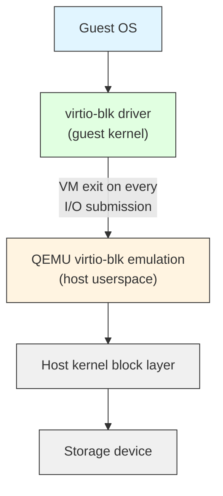

With SPDK vhost-user:

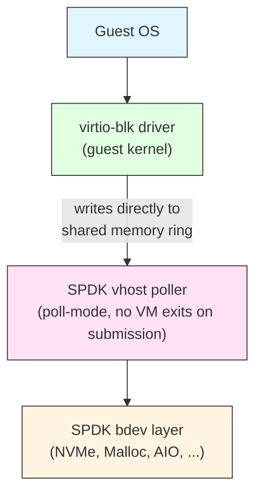

The elimination of VM exits on I/O submission is the key performance gain. SPDK's polling model also avoids the overhead of virtio kick notifications.

---

## Core Concepts

### Concept 1: The Virtio / Vhost Hierarchy

Understanding three distinct layers prevents confusion throughout this module.

**Virtio** is the I/O virtualization standard. It defines:
- Device types (block, network, SCSI, etc.)
- Virtqueue ring structures and descriptor format
- Feature negotiation between driver and device

**Vhost** (kernel) is the Linux kernel's in-kernel implementation of the vhost back-end, primarily for networking (`vhost_net`).

**Vhost-user** is an extension of the vhost protocol that runs the device back-end in user space. It uses a Unix domain socket for control messages and shared memory (via `mmap`) for data rings.

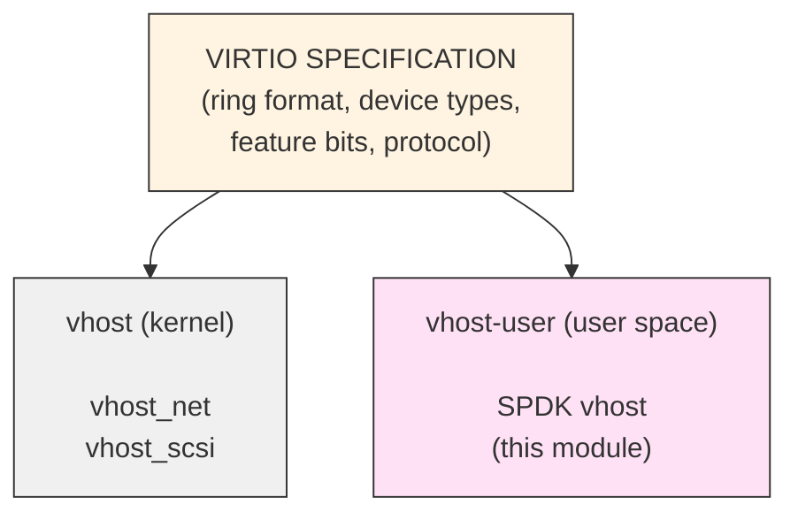

SPDK implements a **vhost-user back-end server**. It listens on Unix domain sockets and waits for connections from front-end clients — most commonly QEMU.

---

### Concept 2: Virtqueue Ring Structure

The virtqueue is the core data structure for passing I/O between the driver (guest) and device (SPDK). The split ring format (virtio 1.0) consists of three regions in shared memory:

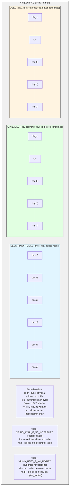

A read I/O request uses a chain of three descriptors:

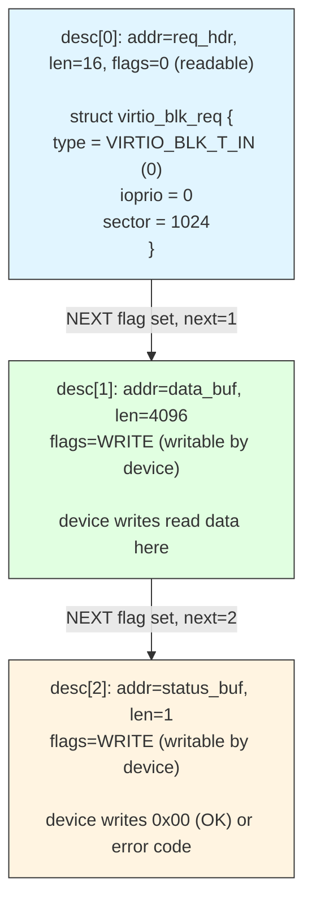

The virtio descriptor struct from the SPDK source (`vhost_processing.md`):

```c
struct virtq_desc {
    /* Address (guest-physical). */
    le64 addr;
    /* Length. */
    le32 len;

    /* VIRTQ_DESC_F_NEXT:  buffer continues via 'next' field */
    /* VIRTQ_DESC_F_WRITE: device write-only (otherwise read-only) */
    le16 flags;
    /* Next field if flags & NEXT */
    le16 next;
};
```

---

### Concept 3: Vhost-User Protocol — Setup Phase

Before any I/O flows, QEMU and SPDK exchange vhost-user messages over the Unix domain socket. This is the control plane.

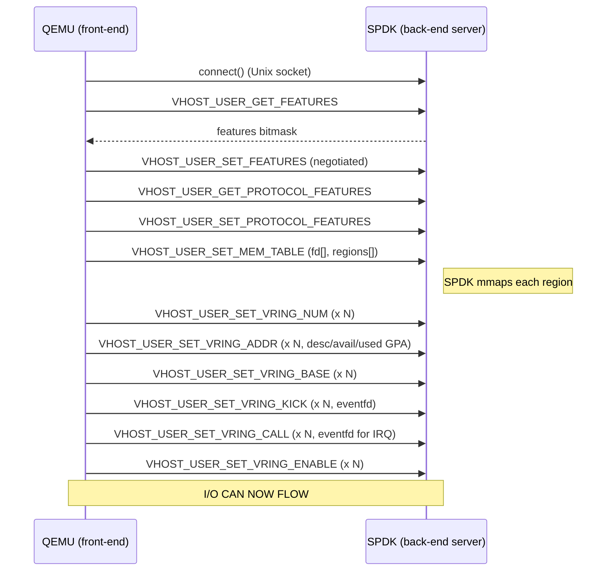

Key features negotiated by SPDK (from `vhost_internal.h`):

```c
#define SPDK_VHOST_FEATURES \
    (1ULL << VHOST_F_LOG_ALL)           | \  /* live migration support */
    (1ULL << VHOST_USER_F_PROTOCOL_FEATURES) | \
    (1ULL << VIRTIO_F_VERSION_1)        | \  /* virtio 1.0 */
    (1ULL << VIRTIO_F_NOTIFY_ON_EMPTY)  | \
    (1ULL << VIRTIO_RING_F_EVENT_IDX)   | \  /* fine-grained interrupt suppression */
    (1ULL << VIRTIO_RING_F_INDIRECT_DESC) | \/* indirect descriptor tables */
    (1ULL << VIRTIO_F_ANY_LAYOUT)
```

Additional blk-specific features:

```c
#define SPDK_VHOST_BLK_FEATURES_BASE (SPDK_VHOST_FEATURES | \
    (1ULL << VIRTIO_BLK_F_SIZE_MAX) |   /* max segment size */
    (1ULL << VIRTIO_BLK_F_SEG_MAX)  |   /* max number of segments */
    (1ULL << VIRTIO_BLK_F_BLK_SIZE) |   /* block size field in config */
    (1ULL << VIRTIO_BLK_F_TOPOLOGY) |   /* I/O alignment topology */
    (1ULL << VIRTIO_BLK_F_MQ))          /* multi-queue support */
```

---

### Concept 4: GPA-to-VVA Translation

The guest places buffer addresses in descriptors as guest physical addresses (GPA). SPDK must translate these to addresses it can access — vhost virtual addresses (VVA).

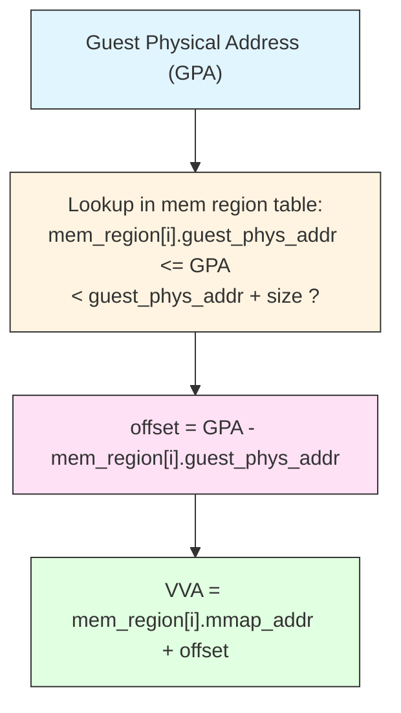

SPDK's translation function (from `vhost_internal.h`):

```c
void *vhost_gpa_to_vva(struct spdk_vhost_session *vsession,
                       uint64_t addr, uint64_t len);
```

This is called for every buffer in every descriptor. The implementation walks `vsession->mem->regions[]` (populated during `SET_MEM_TABLE` handling) and returns the mapped pointer.

**Critical constraint**: SPDK requires that the request header and response status byte each fit within a single memory region. I/O data buffers may span regions and are split into iovecs automatically.

---

### Concept 5: SPDK Internal Data Structures

The vhost subsystem has a clear three-level hierarchy:

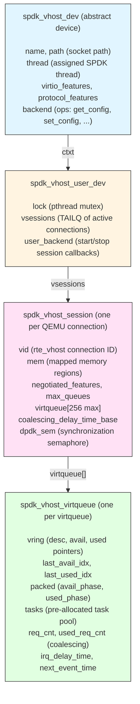

Key constant limits:

| Constant | Value | Meaning |
|----------|-------|---------|
| `SPDK_VHOST_MAX_VQUEUES` | 256 | Max virtqueues per device |
| `SPDK_VHOST_MAX_VQ_SIZE` | 1024 | Max descriptors per virtqueue |
| `SPDK_VHOST_SCSI_CTRLR_MAX_DEVS` | 8 | Max SCSI targets per controller |
| `SPDK_VHOST_IOVS_MAX` | 129 | Max iovecs per request |
| `SPDK_VHOST_VQ_MAX_SUBMISSIONS` | 32 | Max requests per poll iteration |

---

### Concept 6: Vhost-BLK Target — I/O Path

The vhost-blk target exposes a single bdev as a virtio-blk device to the guest. This is the simpler of the two target types.

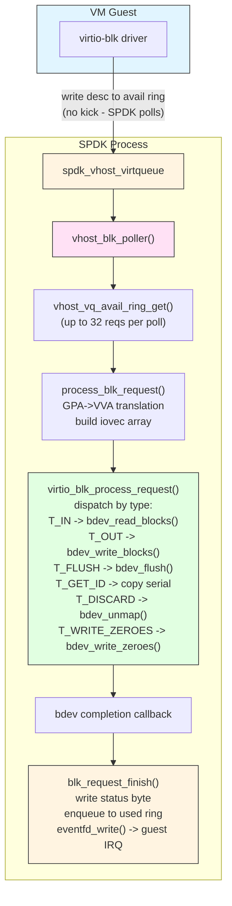

**Data structures for vhost-blk** (from `vhost_blk.c`):

```c
/* The blk device — wraps the abstract vhost_dev */
struct spdk_vhost_blk_dev {
    struct spdk_vhost_dev vdev;   /* must be first */
    struct spdk_bdev *bdev;
    struct spdk_bdev_desc *bdev_desc;
    const struct spdk_virtio_blk_transport_ops *ops;
    bool readonly;
};

/* Per-session state */
struct spdk_vhost_blk_session {
    struct spdk_vhost_session vsession;  /* must be first */
    struct spdk_vhost_blk_dev *bvdev;
    struct spdk_poller *requestq_poller;
    struct spdk_io_channel *io_channel;
    struct spdk_poller *stop_poller;
};

/* Per-request task (allocated once per virtqueue slot) */
struct spdk_vhost_user_blk_task {
    struct spdk_vhost_blk_task blk_task;  /* contains iovec array */
    struct spdk_vhost_blk_session *bvsession;
    struct spdk_vhost_virtqueue *vq;
    uint16_t req_idx;
    uint16_t num_descs;
    uint16_t buffer_id;
    uint16_t inflight_head;
    bool used;
};
```

**Feature flags for blk** (from `vhost_blk.c`):

```c
/* Advertised but disabled features */
#define SPDK_VHOST_BLK_DISABLED_FEATURES (SPDK_VHOST_DISABLED_FEATURES | \
    (1ULL << VIRTIO_BLK_F_GEOMETRY) |   /* not exposed */
    (1ULL << VIRTIO_BLK_F_CONFIG_WCE) | /* write cache control */
    (1ULL << VIRTIO_BLK_F_BARRIER)  |   /* barrier ordering */
    (1ULL << VIRTIO_BLK_F_SCSI))        /* SCSI passthrough via blk */
```

The processing entry point is `virtio_blk_process_request()` (in `vhost_blk.c`), which handles all request types and maps them to the appropriate bdev API:

```c
int
virtio_blk_process_request(struct spdk_vhost_dev *vdev,
                            struct spdk_io_channel *ch,
                            struct spdk_vhost_blk_task *task,
                            virtio_blk_request_cb cb,
                            void *cb_arg)
{
    /* task->iovs[] is already filled with GPA->VVA translations */
    switch (req->type) {
    case VIRTIO_BLK_T_IN:
        /* read */
        spdk_bdev_readv_blocks(bdev_desc, ch, task->iovs, task->iovcnt,
                               sector_num, num_blocks, blk_request_complete_cb, task);
        break;
    case VIRTIO_BLK_T_OUT:
        /* write */
        spdk_bdev_writev_blocks(bdev_desc, ch, task->iovs, task->iovcnt,
                                sector_num, num_blocks, blk_request_complete_cb, task);
        break;
    case VIRTIO_BLK_T_FLUSH:
        spdk_bdev_flush_blocks(bdev_desc, ch, 0, num_blocks,
                               blk_request_complete_cb, task);
        break;
    case VIRTIO_BLK_T_GET_ID:
        /* copy device serial number string into buffer */
        memcpy(task->iovs[1].iov_base, bdev->name, len);
        blk_request_finish(VIRTIO_BLK_S_OK, task);
        break;
    case VIRTIO_BLK_T_DISCARD:
        spdk_bdev_unmap_blocks(bdev_desc, ch, offset, num_blocks,
                               blk_request_complete_cb, task);
        break;
    case VIRTIO_BLK_T_WRITE_ZEROES:
        spdk_bdev_write_zeroes_blocks(bdev_desc, ch, offset, num_blocks,
                                      blk_request_complete_cb, task);
        break;
    default:
        blk_request_finish(VIRTIO_BLK_S_UNSUPP, task);
    }
}
```

---

### Concept 7: Vhost-SCSI Target — I/O Path

The vhost-scsi target exposes a SCSI controller with up to 8 targets to the guest. Each target maps to an SPDK bdev via the SCSI layer. This allows hot-attach and hot-detach of storage targets while the VM runs.

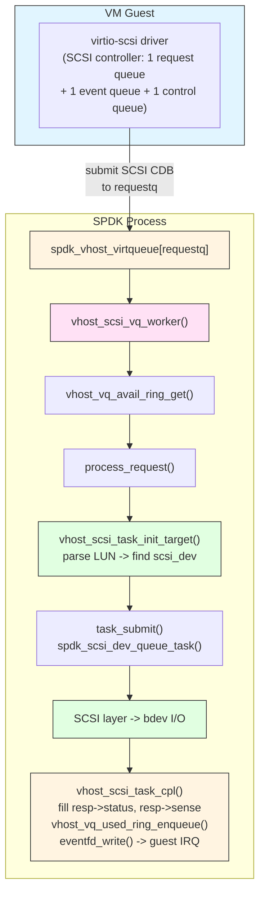

**Data structures for vhost-scsi** (from `vhost_scsi.c`):

```c
struct spdk_vhost_scsi_task {
    struct spdk_scsi_task scsi;           /* must be first — cast target */
    struct iovec iovs[SPDK_VHOST_IOVS_MAX];

    union {
        struct virtio_scsi_cmd_resp  *resp;    /* for I/O requests */
        struct virtio_scsi_ctrl_tmf_resp *tmf_resp;  /* for TMF */
    };

    struct spdk_vhost_scsi_session *svsession;
    struct spdk_scsi_dev *scsi_dev;

    uint32_t used_len;   /* bytes written to guest */
    int req_idx;         /* descriptor table index */
    bool used;
    struct spdk_vhost_virtqueue *vq;
};
```

**Virtio-SCSI request layout** (as documented in `vhost_processing.md`):

```c
struct virtio_scsi_req_cmd {
    /* descriptor 0: read-only by device */
    struct virtio_scsi_cmd_req *req;  /* LUN, tag, CDB */

    /* descriptors 1..N: scatter-gather for WRITE direction */
    struct iovec read_only_buffers[];

    /* descriptor N+1: write-only by device */
    struct virtio_scsi_cmd_resp *resp;  /* status, sense data */

    /* descriptors N+2..M: scatter-gather for READ direction */
    struct iovec write_only_buffers[];
};
```

**SCSI target management** (vhost-scsi specific):

```c
struct spdk_vhost_scsi_dev {
    struct spdk_vhost_dev vdev;   /* must be first */
    struct spdk_scsi_dev_vhost_state scsi_dev_state[SPDK_VHOST_SCSI_CTRLR_MAX_DEVS];
};

/* Each SCSI target slot holds a device and its hotplug state */
struct spdk_scsi_dev_vhost_state {
    struct spdk_scsi_dev *dev;
    bool removed;
    spdk_vhost_event_fn remove_cb;
    void *remove_ctx;
};
```

Backend registration for vhost-scsi:

```c
static const struct spdk_vhost_user_dev_backend spdk_vhost_scsi_user_device_backend = {
    .session_ctx_size = sizeof(struct spdk_vhost_scsi_session) -
                        sizeof(struct spdk_vhost_session),
    .start_session =  vhost_scsi_start,
    .stop_session  =  vhost_scsi_stop,
    .alloc_vq_tasks = alloc_vq_task_pool,
};

static const struct spdk_vhost_dev_backend spdk_vhost_scsi_device_backend = {
    .type            = VHOST_BACKEND_SCSI,
    .dump_info_json  = vhost_scsi_dump_info_json,
    .write_config_json = vhost_scsi_write_config_json,
    .remove_device   = vhost_scsi_dev_remove,
    .set_coalescing  = vhost_user_set_coalescing,
    .get_coalescing  = vhost_user_get_coalescing,
};
```

---

### Concept 8: Packed Ring (Virtio 1.1)

The packed ring format, introduced in virtio 1.1, replaces the three-region split ring with a single descriptor ring. This improves cache locality and reduces memory bandwidth.

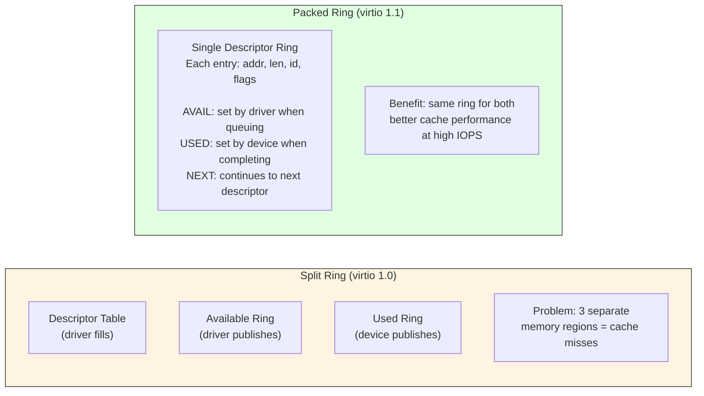

SPDK tracks packed ring state in `spdk_vhost_virtqueue`:

```c
struct spdk_vhost_virtqueue {
    struct rte_vhost_vring vring;
    uint16_t last_avail_idx;
    uint16_t last_used_idx;

    struct {
        uint8_t avail_phase : 1;  /* wrap counter for avail (from spec) */
        uint8_t used_phase  : 1;  /* wrap counter for used  (from spec) */
        uint8_t padding     : 5;
        bool    packed_ring : 1;  /* true if packed ring negotiated */
    } packed;
    /* ... */
};
```

SPDK's packed ring helpers:

```c
/* Check if next descriptor is available from driver */
bool vhost_vq_packed_ring_is_avail(struct spdk_vhost_virtqueue *virtqueue);

/* Get descriptor from packed ring */
int vhost_vq_get_desc_packed(struct spdk_vhost_session *vsession,
                              struct spdk_vhost_virtqueue *virtqueue,
                              uint16_t req_idx,
                              struct vring_packed_desc **desc,
                              struct vring_packed_desc **desc_table,
                              uint32_t *desc_table_size);

/* Enqueue completion to packed ring */
void vhost_vq_packed_ring_enqueue(struct spdk_vhost_session *vsession,
                                   struct spdk_vhost_virtqueue *virtqueue,
                                   uint16_t num_descs, uint16_t buffer_id,
                                   uint32_t length, uint16_t inflight_head);
```

---

### Concept 9: Interrupt Coalescing

At very high IOPS, sending an IRQ (via `eventfd_write`) for every completed request causes significant CPU overhead in the guest. SPDK vhost supports interrupt coalescing to batch IRQs.

**Coalescing formula** (from `spdk/vhost.h`):

```
if (delay_base == 0 || IOPS < iops_threshold):
    delay = 0   (no coalescing)
else:
    delay = delay_base * (iops - iops_threshold) / iops_threshold
```

**Default values** (from `vhost_internal.h`):

```c
/* Coalescing disabled by default */
#define SPDK_VHOST_COALESCING_DELAY_BASE_US       0

/* Threshold at which coalescing activates */
#define SPDK_VHOST_VQ_IOPS_COALESCING_THRESHOLD   60000

/* How often to check IOPS for coalescing decisions */
#define SPDK_VHOST_STATS_CHECK_INTERVAL_MS        10
```

Configure coalescing via RPC or API:

```c
int spdk_vhost_set_coalescing(struct spdk_vhost_dev *vdev,
                               uint32_t delay_base_us,
                               uint32_t iops_threshold);
```

Example: enable coalescing above 100K IOPS with 50µs base delay:

```sh
scripts/rpc.py vhost_controller_set_coalescing vhost.0 50 100000
```

The coalescing state is tracked per virtqueue:

```c
struct spdk_vhost_virtqueue {
    uint32_t req_cnt;         /* requests since last stats check */
    uint16_t used_req_cnt;    /* requests since last IRQ */
    uint32_t irq_delay_time;  /* current computed delay (cycles) */
    uint64_t next_event_time; /* TSC value when next IRQ is due */
    /* ... */
};
```

---

### Concept 10: Thread Model and CPU Pinning

SPDK vhost integrates cleanly with SPDK's reactor/thread model.

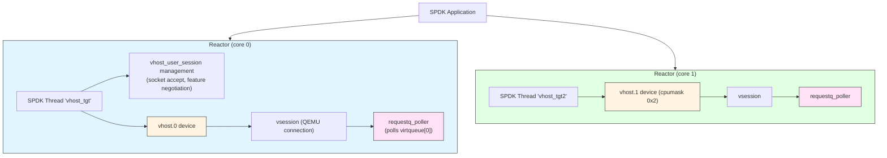

The `cpumask` parameter controls which reactor core(s) can service a vhost device:

```sh
# Pin vhost.0 to core 0
scripts/rpc.py vhost_create_scsi_controller --cpumask 0x1 vhost.0

# Pin vhost.1 to core 1
scripts/rpc.py vhost_create_blk_controller --cpumask 0x2 vhost.1 Malloc0
```

**CPU affinity rule**: For NUMA systems, always pin the vhost device to a core on the same socket as the VM's vCPUs. Cross-socket memory access adds significant latency.

---

## Architecture Diagram

Full system view from VM guest to NVMe device:

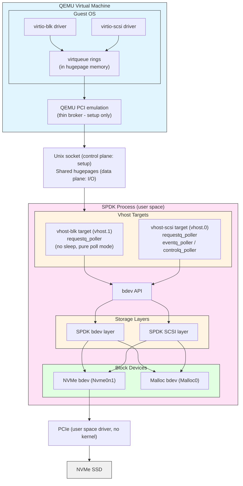

---

## Configuration Walkthrough

### Step 1: System Preparation

```sh
# Allocate hugepages for SPDK + VM
HUGEMEM=4096 scripts/setup.sh

# 4096 MB: 1024 for SPDK + 3072 for VM(s)
# Hugepage memory is shared between SPDK and QEMU
```

### Step 2: Start SPDK vhost Application

```sh
# Start on cores 0 and 1, socket directory /var/tmp
build/bin/vhost -S /var/tmp -m 0x3

# -S: directory for vhost socket files
# -m: CPU mask (0x3 = core 0 + core 1)
```

### Step 3: Create Storage Backends

```sh
# NVMe bdev (real hardware)
scripts/rpc.py bdev_nvme_attach_controller -b Nvme0 -t pcie -a 0000:01:00.0

# Malloc bdev (ramdisk, for testing)
scripts/rpc.py bdev_malloc_create 128 4096 -b Malloc0
# 128 MB, 4096-byte block size

# AIO bdev (Linux file/device)
scripts/rpc.py bdev_aio_create /dev/sdb AioDisk 512
```

### Step 4: Create Vhost-SCSI Controller

```sh
# Create controller with socket at /var/tmp/vhost.0
# Pinned to core 0 (cpumask 0x1)
scripts/rpc.py vhost_create_scsi_controller --cpumask 0x1 vhost.0

# Attach NVMe bdev as SCSI target 0
scripts/rpc.py vhost_scsi_controller_add_target vhost.0 0 Nvme0n1

# Attach Malloc bdev as SCSI target 1
scripts/rpc.py vhost_scsi_controller_add_target vhost.0 1 Malloc0
```

### Step 5: Create Vhost-BLK Controller

```sh
# Create blk controller with socket at /var/tmp/vhost.1
# Pinned to core 1 (cpumask 0x2)
scripts/rpc.py vhost_create_blk_controller --cpumask 0x2 vhost.1 Malloc0

# Read-only variant:
scripts/rpc.py vhost_create_blk_controller --cpumask 0x2 -r vhost.1 Malloc0
```

### Step 6: Launch QEMU VM

```sh
taskset -c 2,3 qemu-system-x86_64 \
  --enable-kvm \
  -cpu host -smp 2 \
  -m 1G \
  \
  # Shared hugepage memory (required for vhost-user)
  -object memory-backend-file,id=mem0,size=1G,\
mem-path=/dev/hugepages,share=on \
  -numa node,memdev=mem0 \
  \
  # Boot disk (not vhost)
  -drive file=guest_os_image.qcow2,if=none,id=disk \
  -device ide-hd,drive=disk,bootindex=0 \
  \
  # vhost-SCSI device (2 queues for 2 vCPUs)
  -chardev socket,id=spdk_vhost_scsi0,path=/var/tmp/vhost.0 \
  -device vhost-user-scsi-pci,id=scsi0,chardev=spdk_vhost_scsi0,\
num_queues=2 \
  \
  # vhost-BLK device (2 queues)
  -chardev socket,id=spdk_vhost_blk0,path=/var/tmp/vhost.1 \
  -device vhost-user-blk-pci,chardev=spdk_vhost_blk0,num-queues=2
```

**Critical QEMU parameters**:

| Parameter | Purpose |
|-----------|---------|
| `memory-backend-file,share=on` | Enables shared hugepage memory between QEMU and SPDK |
| `mem-path=/dev/hugepages` | Uses hugepages for low-latency mapping |
| `-numa node,memdev=mem0` | Assigns all VM memory to the hugepage backend |
| `num_queues=N` | Number of virtqueues (match to vCPU count for best performance) |

### Step 7: Verify in the Guest VM

```sh
# Inside the guest VM
lsblk --output "NAME,KNAME,MODEL,HCTL,SIZE,VENDOR,SUBSYSTEMS"

# Expected output:
# sdb    - NVMe bdev via vhost-scsi (block:scsi:virtio:pci)
# sdc    - Malloc bdev via vhost-scsi
# vda    - Malloc bdev via vhost-blk (block:virtio:pci)
```

---

## Hot-Attach and Hot-Detach (vhost-SCSI only)

Vhost-SCSI supports adding and removing SCSI targets while the VM is running. This requires the VM's virtio-scsi driver to have negotiated `VIRTIO_SCSI_F_HOTPLUG`.

**Hot-attach** (VM already running):

```sh
# Add a new target on slot 2
scripts/rpc.py vhost_scsi_controller_add_target vhost.0 2 Malloc1

# SPDK sends VIRTIO_SCSI_T_TRANSPORT_RESET event to the guest
# Guest detects new device via virtio event queue
```

**Hot-detach**:

```sh
# Remove target from slot 0
scripts/rpc.py vhost_scsi_controller_remove_target vhost.0 0

# Or: deleting the bdev triggers automatic hot-detach
scripts/rpc.py bdev_malloc_delete Malloc0
```

**Note**: Vhost-BLK does not support hot-attach/detach. If the backing bdev disappears (e.g., NVMe physically removed), all I/O on that vhost-blk device returns `VIRTIO_BLK_S_IOERR` and the guest will see I/O errors.

---

## RPC Reference

| RPC | Purpose |
|-----|---------|
| `vhost_create_scsi_controller [--cpumask M] name` | Create vhost-SCSI controller |
| `vhost_create_scsi_controller_no_start [--cpumask M] name` | Create but do not start |
| `vhost_scsi_controller_add_target name tgt_num bdev_name` | Attach bdev as SCSI target |
| `vhost_scsi_controller_remove_target name tgt_num` | Detach SCSI target |
| `vhost_create_blk_controller [--cpumask M] [-r] name bdev_name` | Create vhost-BLK controller |
| `vhost_delete_controller name` | Remove a vhost controller |
| `vhost_get_controllers [name]` | List controller info (JSON) |
| `vhost_controller_set_coalescing name delay_base_us iops_threshold` | Configure coalescing |

---

## Performance Considerations and Tuning

### Multi-Queue Configuration

For maximum throughput, match the number of virtqueues to the number of VM vCPUs:

```
num_queues = num_vcpus
```

Each virtqueue has its own poll loop. More queues allow more parallel I/O but require more SPDK poller cycles per device.

```sh
# VM with 4 vCPUs: use 4 queues
-device vhost-user-scsi-pci,...,num_queues=4
```

Enable Linux multi-queue block layer inside the guest:

```sh
# In /etc/default/grub inside the guest:
GRUB_CMDLINE_LINUX="scsi_mod.use_blk_mq=1"
update-grub
# Reboot
```

### CPU Isolation and Polling

SPDK vhost uses 100% CPU polling by design. Assign dedicated cores:

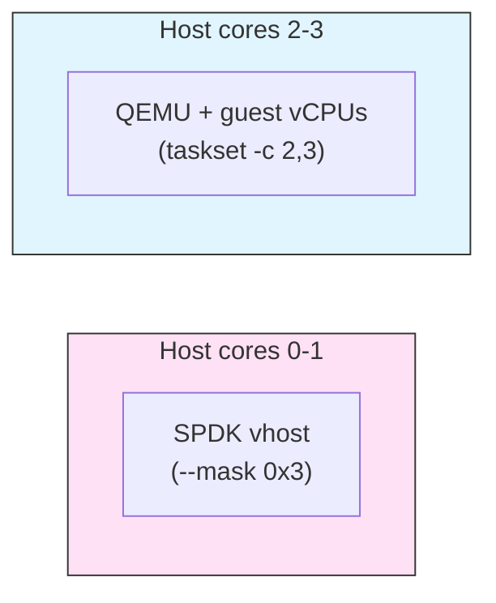

This prevents SPDK pollers from competing with QEMU scheduling.

### NUMA Topology

For NUMA servers, always keep SPDK, QEMU, and the NVMe device on the same socket:

```
Socket 0:              Socket 1:
  cores 0-11             cores 12-23
  NVMe PCIe x16         (other workloads)
  SPDK (--mask 0x3)
  QEMU (taskset -c 2,3)
  hugepages (node 0)
```

Cross-socket memory access (QPI/UPI) adds 50-100ns latency per operation.

### Interrupt Coalescing vs. Latency

| Mode | Configuration | Use Case |
|------|--------------|---------|
| No coalescing | `delay_base_us=0` | Latency-sensitive (databases) |
| Light coalescing | `delay=50, iops=60000` | Balanced |
| Heavy coalescing | `delay=500, iops=30000` | High-throughput sequential I/O |

### Packed Ring

Enable packed ring in QEMU (requires virtio 1.1 support in guest):

```sh
-device vhost-user-blk-pci,...,packed=on
```

Packed ring reduces cache pressure at high queue depths. Measure with `fio` before and after to confirm benefit for your workload.

### Queue Depth Tuning

The virtqueue ring size is fixed at up to `SPDK_VHOST_MAX_VQ_SIZE` (1024) descriptors. SPDK processes up to `SPDK_VHOST_VQ_MAX_SUBMISSIONS` (32) requests per poll iteration to avoid starvation of other pollers.

For storage workloads targeting maximum IOPS, use large fio queue depth:

```sh
# Inside the guest
fio --name=randread --ioengine=libaio --iodepth=128 \
    --rw=randread --bs=4k --direct=1 \
    --filename=/dev/sdb --size=10G --time_based --runtime=30
```

---

## Deep Dive: The Polling Loop

Here is how SPDK's vhost request polling works for vhost-blk (simplified):

```c
/* Called by the requestq_poller at reactor rate (no sleep) */
static int
vhost_blk_poll(void *arg)
{
    struct spdk_vhost_blk_session *bvsession = arg;
    struct spdk_vhost_session *vsession = &bvsession->vsession;
    int reqs_cnt = 0;

    for (uint16_t q = 0; q < vsession->max_queues; q++) {
        struct spdk_vhost_virtqueue *vq = &vsession->virtqueue[q];

        if (vq->packed.packed_ring) {
            reqs_cnt += vhost_blk_process_packed_vq(bvsession, vq);
        } else {
            reqs_cnt += vhost_blk_process_split_vq(bvsession, vq);
        }
    }

    vhost_session_vq_used_signal(vq);  /* send pending IRQs */
    return reqs_cnt > 0 ? SPDK_POLLER_BUSY : SPDK_POLLER_IDLE;
}

/* Process one split-ring virtqueue */
static int
vhost_blk_process_split_vq(struct spdk_vhost_blk_session *bvsession,
                             struct spdk_vhost_virtqueue *vq)
{
    uint16_t reqs[SPDK_VHOST_VQ_MAX_SUBMISSIONS];
    uint16_t reqs_cnt;

    /* Drain available ring (up to 32 at once) */
    reqs_cnt = vhost_vq_avail_ring_get(vq, reqs, SPDK_VHOST_VQ_MAX_SUBMISSIONS);

    for (uint16_t i = 0; i < reqs_cnt; i++) {
        struct spdk_vhost_user_blk_task *task = &vq->tasks[reqs[i]];

        if (task->used) {
            /* Task slot still in use — drop (shouldn't happen) */
            vhost_user_blk_request_finish(VIRTIO_BLK_S_IOERR,
                                          &task->blk_task, NULL);
            continue;
        }

        /* Fill task fields from descriptor chain */
        if (vhost_blk_task_init_exlpicit(task, reqs[i]) != 0) {
            vhost_user_blk_request_finish(VIRTIO_BLK_S_UNSUPP,
                                          &task->blk_task, NULL);
            continue;
        }

        /* Dispatch to bdev layer (async, non-blocking) */
        vhost_user_process_blk_request(task);
    }

    return reqs_cnt;
}
```

**Key insight**: The poller never blocks. `virtio_blk_process_request()` submits to the bdev layer and returns immediately. The completion callback (`blk_request_finish`) runs later when the bdev I/O completes, writes the status byte, and enqueues the used ring entry.

---

## Deep Dive: Descriptor Chain Traversal

Translating a descriptor chain into iovecs is core to the vhost implementation:

```c
/* vhost_internal.h */
int vhost_vq_get_desc(struct spdk_vhost_session *vsession,
                      struct spdk_vhost_virtqueue *vq,
                      uint16_t req_idx,
                      struct vring_desc **desc,
                      struct vring_desc **desc_table,
                      uint32_t *desc_table_size);

/* Walk the chain: req -> data bufs -> status */
static int
task_data_setup(struct spdk_vhost_scsi_task *task,
                struct virtio_scsi_cmd_req **req)
{
    struct spdk_vhost_virtqueue *vq = task->vq;
    struct vring_desc *desc, *desc_table;
    uint32_t desc_table_size;

    /* Get head descriptor (may be indirect table pointer) */
    if (vhost_vq_get_desc(vsession, vq, task->req_idx,
                           &desc, &desc_table, &desc_table_size) != 0) {
        return -1;
    }

    /* Descriptor 0: SCSI command request (read-only) */
    *req = vhost_gpa_to_vva(vsession, desc->addr, sizeof(**req));

    /* Walk remaining descriptors */
    while (vhost_vring_desc_get_next(&desc, desc_table,
                                      desc_table_size) == 0 && desc != NULL) {
        if (vhost_vring_desc_is_wr(desc)) {
            /* Device-writable: READ data or response */
            vhost_vring_desc_to_iov(vsession, task->iovs,
                                    &task->iovcnt, desc);
        } else {
            /* Device-readable: WRITE data */
            vhost_vring_desc_to_iov(vsession, task->iovs,
                                    &task->iovcnt, desc);
        }
    }
    return 0;
}
```

**Indirect descriptors**: When `VIRTIO_RING_F_INDIRECT_DESC` is negotiated, a single descriptor in the main ring can point to a table of additional descriptors in guest memory. This allows I/O requests with many scatter-gather segments without consuming multiple main ring slots.

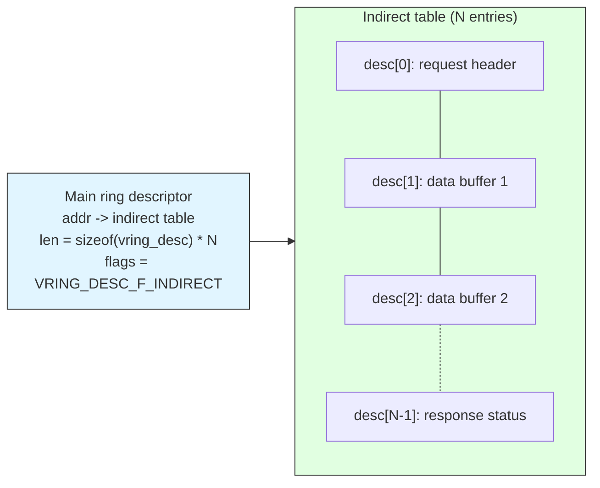

---

## Comparison: Vhost-BLK vs Vhost-SCSI

| Aspect | Vhost-BLK | Vhost-SCSI |
|--------|-----------|------------|
| Protocol | virtio-blk | virtio-scsi |
| Targets per controller | 1 bdev | Up to 8 SCSI targets |
| LUNs per target | N/A | 1 (current SPDK limit) |
| Hot-attach/detach | Not supported | Supported |
| Request queues | Configurable (num-queues) | 1 requestq + 1 eventq + 1 controlq |
| Guest driver | virtio_blk | virtio_scsi |
| Guest block device | `/dev/vda` (virtio-blk) | `/dev/sdb` (SCSI) |
| SCSI command set | Subset via VIRTIO_BLK_F_SCSI (disabled in SPDK) | Full SCSI |
| TMF (Task Management) | Not supported | Supported |
| Use case | Single-disk, simple setup | Multi-disk, dynamic attach |

---

## Comparison: Vhost vs Other SPDK Storage Targets

| Feature | Vhost | NVMe-oF TCP | NVMe-oF RDMA | iSCSI |
|---------|-------|-------------|--------------|-------|
| Use case | Local VM storage | Network storage | Network storage | Network storage |
| Transport | Unix socket + shared memory | TCP/IP | InfiniBand/RoCE | TCP/IP |
| VM exit on submit | No (poll mode) | N/A | N/A | N/A |
| Zero copy | Yes (shared memory) | No | Yes (RDMA) | No |
| Guest driver | virtio-blk/scsi | nvme | nvme | iscsi |
| Latency | ~5-10µs | ~20-50µs | ~5-15µs | ~50-100µs |

---

## Inflight I/O Tracking

SPDK vhost supports tracking in-flight I/O for crash recovery. This is used with the `VHOST_USER_PROTOCOL_F_INFLIGHT_SHMFD` protocol feature.

```c
/* spdk_vhost_virtqueue has an inflight ring alongside the normal ring */
struct spdk_vhost_virtqueue {
    struct rte_vhost_vring vring;
    struct rte_vhost_ring_inflight vring_inflight;  /* crash recovery state */
    /* ... */
};
```

When live migration or crash recovery is required, the inflight ring records which requests were submitted but not completed. On reconnect, SPDK can resubmit or fail these requests rather than leaving the guest in an inconsistent state.

---

## Key Takeaways

1. **Vhost-user is a control + data plane split**: QEMU negotiates setup over a Unix socket, but all I/O flows through shared hugepage memory without QEMU involvement.

2. **SPDK's poll-mode eliminates VM exits on submission**: The guest writes to the avail ring; SPDK polls it continuously. No kick notification, no VMEXIT.

3. **The virtqueue has three roles**: The descriptor table describes buffers; the available ring is the producer queue (driver); the used ring is the completion queue (device).

4. **GPA-to-VVA translation is on the critical path**: Every buffer in every descriptor requires a lookup in the memory region table. SPDK constrains headers/responses to single regions for performance.

5. **Vhost-blk is simpler, vhost-scsi is more flexible**: Choose vhost-blk for single-bdev direct access and maximum simplicity. Choose vhost-scsi when you need multiple targets or hot-attach/detach capability.

6. **CPU affinity is critical**: SPDK pollers and QEMU VCPUs must be on the same NUMA node as the backing storage. Cross-socket access degrades performance significantly.

7. **Interrupt coalescing trades latency for throughput**: At high IOPS, enabling coalescing reduces guest CPU overhead. At low IOPS or latency-sensitive workloads, leave it disabled.

8. **Packed ring improves cache efficiency**: At high queue depths, the virtio 1.1 packed ring format reduces cache misses by colocating avail and used information in a single ring.

9. **Task pools are pre-allocated**: SPDK allocates one task per descriptor slot at session start. This avoids dynamic allocation on the I/O path.

10. **The bdev abstraction makes vhost storage-agnostic**: The vhost layer never talks to NVMe or AIO directly. It only calls bdev APIs, meaning any bdev backend (NVMe, Malloc, AIO, Ceph RBD, etc.) works transparently.

---

## Exercises

### Exercise 1: Basic Vhost Setup

Set up a working vhost-blk and vhost-scsi pair:

1. Start SPDK vhost on cores 0-1 with `/var/tmp` socket directory
2. Create a 512MB malloc bdev with 4096-byte blocks named `Malloc0`
3. Create a vhost-scsi controller `vhost.0` pinned to core 0, attach `Malloc0` as target 0
4. Create a vhost-blk controller `vhost.1` pinned to core 1, backed by `Malloc0`
5. Compose the QEMU command line to attach both devices to a VM
6. Inside the guest, confirm `sdb` (scsi) and `vda` (blk) appear

Expected: both devices visible in `lsblk`, readable with `dd`.

### Exercise 2: Hot-Attach/Detach

Explore dynamic target management on a running VM:

1. Start with vhost.0 having one target (Malloc0 on slot 0)
2. Boot the VM and confirm the device appears
3. Create a second bdev `Malloc1` and hot-attach it to slot 1 while the VM runs
4. Verify the guest detects the new device without reboot
5. Hot-detach slot 0 and verify the device disappears
6. Confirm pending I/O on the removed target completes or errors cleanly

Expected: no VM reboot required; guest sees attach/detach events.

### Exercise 3: Performance Benchmarking

Measure and compare vhost performance modes:

1. Run `fio` inside the guest with `iodepth=128, rw=randread, bs=4k` on vhost-blk
2. Record baseline IOPS and latency
3. Enable interrupt coalescing: `delay_base_us=100, iops_threshold=50000`
4. Re-run `fio` and compare: does IOPS increase? Does latency increase?
5. Disable coalescing and re-measure
6. Try `num-queues=1` vs `num-queues=4` (with 4 vCPUs) and compare IOPS

Expected: coalescing increases throughput at cost of latency; more queues improve IOPS with multiple vCPUs.

### Exercise 4: Trace an I/O Through the Source

Read the source code and answer these questions:

1. In `vhost_blk.c`: what function is called first when a new avail ring entry is detected?
2. Where is `vhost_gpa_to_vva()` called for the request header, and why must it fit in a single memory region?
3. In `vhost_scsi.c`: what is the difference between `process_request()` and `process_ctrl_request()`?
4. What happens if `vsession->task_cnt` reaches the virtqueue size limit?
5. Where and how does SPDK signal the guest that an I/O completed?

Answers should include file names and approximate line numbers from the SPDK source.

### Exercise 5: Multi-Device NUMA Configuration

Design a vhost configuration for a server with:
- 2 NUMA sockets (24 cores each)
- 2 NVMe drives: one on PCIe socket 0, one on PCIe socket 1
- 4 VMs: 2 on socket 0, 2 on socket 1

Answer:
1. How would you assign vhost devices and cpumasks?
2. How would you run SPDK to serve both sockets?
3. What hugepage configuration is required?
4. How would you verify NUMA affinity is correct?

---

## Additional Resources

- SPDK source: `/lib/vhost/` (vhost.c, vhost_blk.c, vhost_scsi.c, vhost_internal.h)
- SPDK source: `/include/spdk/vhost.h`
- SPDK docs: `doc/vhost.md` — configuration and QEMU command reference
- SPDK docs: `doc/vhost_processing.md` — protocol deep dive
- Virtio specification: [OASIS virtio v1.2](https://docs.oasis-open.org/virtio/virtio/v1.2/)
- Vhost-user specification: [QEMU vhost-user docs](https://qemu-project.gitlab.io/qemu/interop/vhost-user.html)
- DPDK rte_vhost library: SPDK uses this for the low-level virtqueue handling
- Kernel docs: `Documentation/driver-api/virtio/` for virtio driver internals
