# Module 22: iSCSI Target

**Stage**: 3 (Mastery)
**Difficulty**: Advanced
**Estimated Time**: 5 hours
**Prerequisites**: Module 04 (Threading Model), Module 07 (bdev Layer), Module 15 (NVMe-oF Target Architecture)

**Version History**:
- v1.0 (2026-03-30): Initial version

---

## Learning Objectives

By the end of this module, you will be able to:
- Explain the iSCSI protocol stack and how it maps onto SPDK's architecture
- Describe the relationship between portal groups, initiator groups, and target nodes
- Trace a SCSI command from TCP socket through PDU parsing to bdev I/O
- Configure an SPDK iSCSI target via RPC with CHAP authentication
- Explain how SPDK's polling model applies to iSCSI connection handling
- Understand parameter negotiation during the iSCSI login phase
- Apply performance tuning knobs specific to iSCSI workloads

---

## Overview

iSCSI (Internet Small Computer Systems Interface) encapsulates SCSI commands inside TCP/IP packets, allowing block storage to be accessed over standard Ethernet networks. SPDK provides a high-performance iSCSI target implementation that runs in user space, using its poll-mode driver philosophy to eliminate kernel context switches on the I/O path.

### Why This Matters

iSCSI is the dominant SAN protocol in enterprises that cannot justify the cost of Fibre Channel infrastructure. While NVMe-oF has gained traction for latency-sensitive workloads, iSCSI remains the most widely deployed block storage protocol and is supported by every operating system without special drivers. Understanding SPDK's iSCSI target lets you serve existing iSCSI initiators at NVMe-class throughput.

### How iSCSI Fits in SPDK

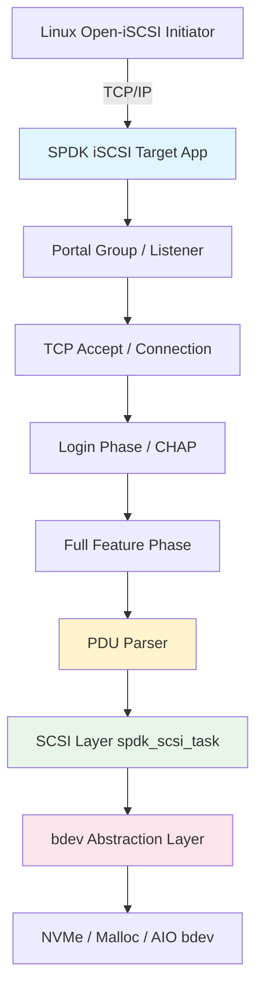

---

## Core Concepts

### Concept 1: iSCSI Protocol Fundamentals

iSCSI is defined in RFC 3720. Before diving into SPDK's implementation, you need to understand the key protocol entities.

**iSCSI Naming**

Every iSCSI entity has an IQN (iSCSI Qualified Name):

```
iqn.2016-06.io.spdk:target0
│   │          │     │
│   │          │     └── Unique string within the naming authority
│   │          └── Naming authority (reverse domain)
│   └── Year-month the domain was registered
└── IQN format indicator
```

SPDK's default node base is `iqn.2016-06.io.spdk` (defined in `iscsi.h`):

```c
#define SPDK_ISCSI_DEFAULT_NODEBASE "iqn.2016-06.io.spdk"
```

**iSCSI Session and Connection**

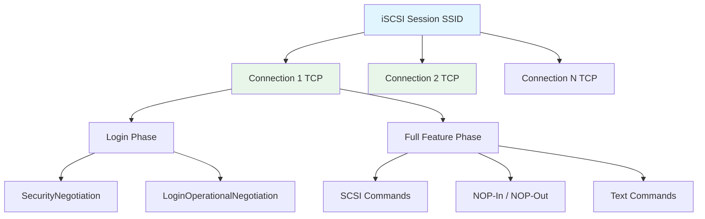

A **session** is a logical relationship between an initiator and a target (identified by SSID + ISID). A session can have multiple **connections** (separate TCP streams). Each connection carries iSCSI PDUs.

**Key Constants from SPDK**

```c
/* From lib/iscsi/iscsi.h */
#define DEFAULT_PORT                        3260
#define DEFAULT_MAX_SESSIONS                128
#define DEFAULT_MAX_CONNECTIONS_PER_SESSION 2
#define MAX_ISCSI_CONNECTIONS               1024
#define DEFAULT_MAX_QUEUE_DEPTH             64
#define DEFAULT_MAXR2T                      4
```

**PDU Structure**

Every iSCSI PDU has a Basic Header Segment (BHS) of exactly 48 bytes:

```c
/* From include/spdk/iscsi_spec.h */
struct iscsi_bhs {
    uint8_t opcode      : 6;    /* operation code */
    uint8_t immediate   : 1;    /* immediate delivery */
    uint8_t reserved    : 1;
    uint8_t flags;
    uint8_t rsv[2];
    uint8_t total_ahs_len;
    uint8_t data_segment_len[3]; /* data payload length */
    uint64_t lun;               /* logical unit number */
    uint32_t itt;               /* initiator task tag */
    uint32_t ttt;               /* target transfer tag */
    uint32_t stat_sn;           /* status sequence number */
    uint32_t exp_stat_sn;
    uint32_t max_stat_sn;
    uint8_t res3[12];
};
/* Compile-time size check: must be exactly 48 bytes */
SPDK_STATIC_ASSERT(sizeof(struct iscsi_bhs) == ISCSI_BHS_LEN, ...);
```

**iSCSI Opcodes**

```c
/* Initiator → Target opcodes */
ISCSI_OP_NOPOUT       = 0x00,  /* NOP-Out (keepalive) */
ISCSI_OP_SCSI         = 0x01,  /* SCSI command */
ISCSI_OP_TASK         = 0x02,  /* Task management */
ISCSI_OP_LOGIN        = 0x03,  /* Login request */
ISCSI_OP_TEXT         = 0x04,  /* Text negotiation */
ISCSI_OP_SCSI_DATAOUT = 0x05,  /* Data-Out (write data) */
ISCSI_OP_LOGOUT       = 0x06,  /* Logout request */

/* Target → Initiator opcodes */
ISCSI_OP_NOPIN        = 0x20,  /* NOP-In (keepalive response) */
ISCSI_OP_SCSI_RSP     = 0x21,  /* SCSI response */
ISCSI_OP_TASK_RSP     = 0x22,  /* Task management response */
ISCSI_OP_LOGIN_RSP    = 0x23,  /* Login response */
ISCSI_OP_SCSI_DATAIN  = 0x25,  /* Data-In (read data) */
ISCSI_OP_R2T          = 0x31,  /* Ready-To-Transfer */
ISCSI_OP_REJECT       = 0x3f,  /* Reject */
```

---

### Concept 2: SPDK iSCSI Target Architecture

SPDK's iSCSI target is built on three configuration objects that form an access control matrix.

**The Three Building Blocks**

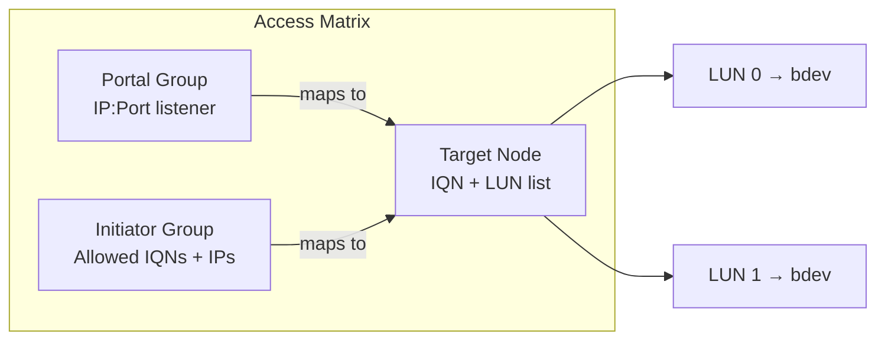

| Object | Description | Key Fields |
|--------|-------------|------------|
| **Portal Group** | One or more IP:port listeners | Portal address, tag ID |
| **Initiator Group** | Whitelist of initiator IQNs and IP netmasks | Initiator names, netmasks |
| **Target Node** | The iSCSI target with LUN mappings | IQN, PG-IG map, LUNs |

**Architecture Layers**

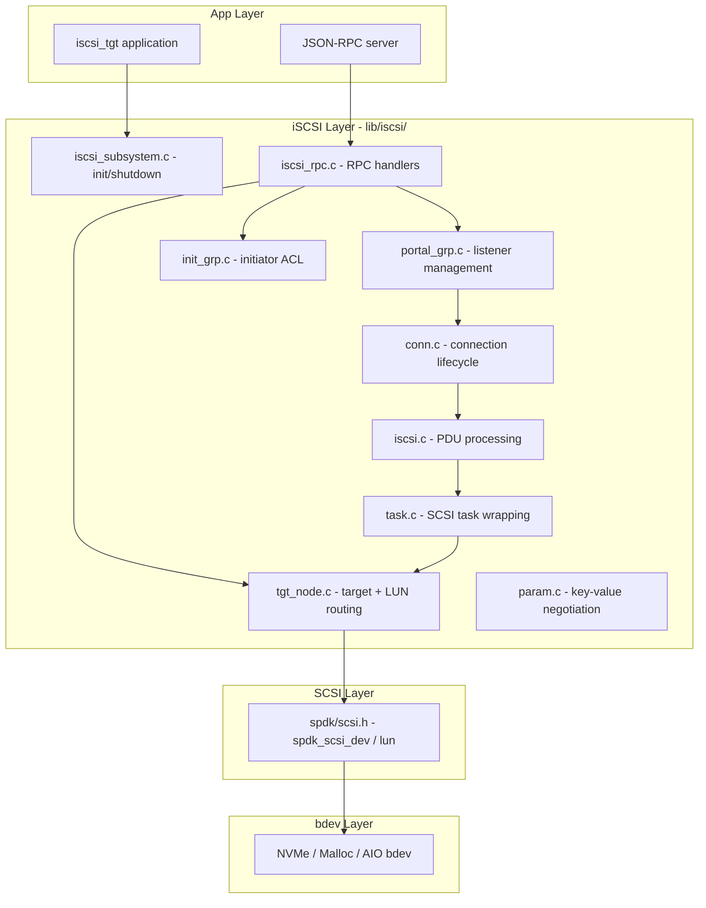

**Thread Pinning**

SPDK assigns each accepted TCP connection to an SPDK reactor (polling thread). All I/O for that connection runs lock-free on the assigned reactor. The connection pool is protected by a single mutex only during allocation/deallocation, never on the data path:

```c
/* From lib/iscsi/conn.c */
static struct spdk_iscsi_conn *g_conns_array = NULL;
static TAILQ_HEAD(, spdk_iscsi_conn) g_free_conns = ...;
static TAILQ_HEAD(, spdk_iscsi_conn) g_active_conns = ...;
static pthread_mutex_t g_conns_mutex = PTHREAD_MUTEX_INITIALIZER;

/* Mutex is held only during allocation, NOT during I/O */
static struct spdk_iscsi_conn *
allocate_conn(void)
{
    pthread_mutex_lock(&g_conns_mutex);
    conn = TAILQ_FIRST(&g_free_conns);
    if (conn != NULL) {
        TAILQ_REMOVE(&g_free_conns, conn, conn_link);
        conn->is_valid = 1;
        TAILQ_INSERT_TAIL(&g_active_conns, conn, conn_link);
    }
    pthread_mutex_unlock(&g_conns_mutex);
    return conn;
}
```

---

### Concept 3: Portal Groups and Connection Acceptance

A portal group is a set of IP address + port combinations where the iSCSI target listens for incoming connections.

**Portal Group Internals**

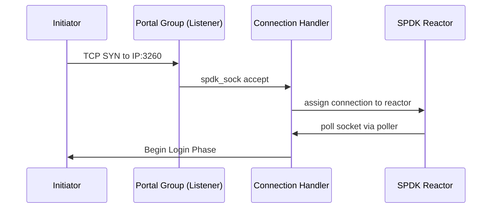

**RPC Configuration**

```bash
# Create portal group tag=1, listening on 10.0.0.1:3260
scripts/rpc.py iscsi_create_portal_group 1 10.0.0.1:3260

# Create portal group with multiple portals
scripts/rpc.py iscsi_create_portal_group 1 "10.0.0.1:3260 10.0.0.2:3260"

# List portal groups
scripts/rpc.py iscsi_get_portal_groups
```

**Portal Group Limits**

```c
#define MAX_PORTAL      1024    /* max portals (IP:port pairs) */
#define MAX_PORTAL_ADDR 256     /* max IP address string length */
#define MAX_PORTAL_PORT 32      /* max port string length */
```

---

### Concept 4: Login Phase and Parameter Negotiation

The login phase is where the initiator and target authenticate each other and negotiate operational parameters. It consists of multiple PDU exchanges across two sub-phases.

**Login State Machine**

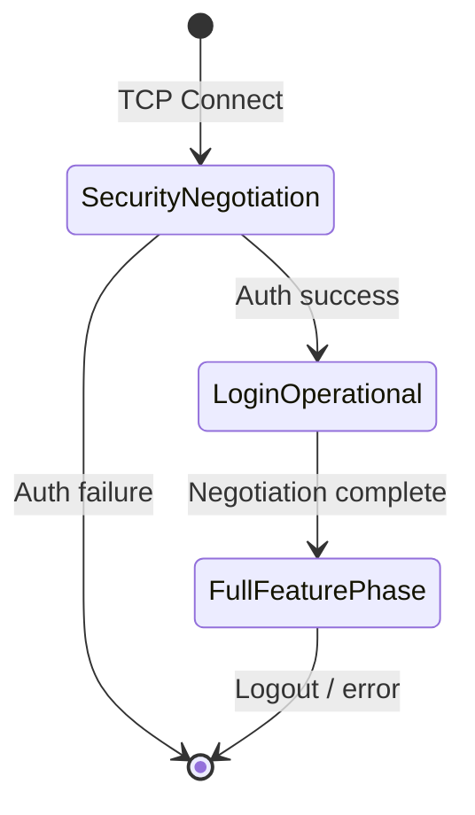

**Login PDU Header**

```c
struct iscsi_bhs_login_req {
    uint8_t opcode      : 6;   /* 0x03 */
    uint8_t immediate   : 1;
    uint8_t reserved    : 1;
    uint8_t flags;             /* T/C/CSG/NSG bits */
    uint8_t version_max;       /* max iSCSI version supported */
    uint8_t version_min;       /* min iSCSI version supported */
    uint8_t total_ahs_len;
    uint8_t data_segment_len[3];
    uint8_t isid[6];           /* Initiator Session ID */
    uint16_t tsih;             /* Target Session ID Handle */
    uint32_t itt;
    /* ... */
};
```

**Negotiated Parameters**

The data segment of login PDUs contains key=value text pairs. SPDK negotiates the following:

| Parameter | Default | Description |
|-----------|---------|-------------|
| `MaxRecvDataSegmentLength` | 65536 | Max PDU data payload (per connection) |
| `MaxBurstLength` | 1048576 | Max unsolicited + Data-Out per command |
| `FirstBurstLength` | 8192 | Max unsolicited data per command |
| `InitialR2T` | Yes | Whether R2T is required before Data-Out |
| `ImmediateData` | Yes | Allow unsolicited data with command PDU |
| `DataPDUInOrder` | Yes | PDUs must arrive in order |
| `DataSequenceInOrder` | Yes | Sequences must be in order |
| `ErrorRecoveryLevel` | 0 | 0=session, 1=digest, 2=connection |
| `HeaderDigest` | None | CRC32C digest on PDU headers |
| `DataDigest` | None | CRC32C digest on PDU data |
| `MaxOutstandingR2T` | 1 | Max simultaneous R2T per command |
| `DefaultTime2Wait` | 2 | Seconds to wait before reconnect |
| `DefaultTime2Retain` | 20 | Seconds to retain session after failure |

**SPDK defaults from `lib/iscsi/iscsi.h`**:

```c
#define SPDK_ISCSI_MAX_RECV_DATA_SEGMENT_LENGTH  65536
#define SPDK_ISCSI_MAX_BURST_LENGTH   \
        (SPDK_ISCSI_MAX_RECV_DATA_SEGMENT_LENGTH * MAX_DATA_OUT_PER_CONNECTION)
/* = 65536 * 16 = 1,048,576 bytes */
#define SPDK_ISCSI_FIRST_BURST_LENGTH  8192

#define DEFAULT_MAXR2T                 4
#define DEFAULT_MAXOUTSTANDINGR2T      1
#define DEFAULT_INITIALR2T             true
#define DEFAULT_IMMEDIATEDATA          true
#define DEFAULT_DATAPDUINORDER         true
#define DEFAULT_DATASEQUENCEINORDER    true
#define DEFAULT_ERRORRECOVERYLEVEL     0
#define DEFAULT_DEFAULTTIME2WAIT       2
#define DEFAULT_DEFAULTTIME2RETAIN     20
```

---

### Concept 5: CHAP Authentication

Challenge Handshake Authentication Protocol (CHAP) is the standard authentication mechanism for iSCSI. SPDK supports both one-way and mutual CHAP.

**CHAP Exchange**

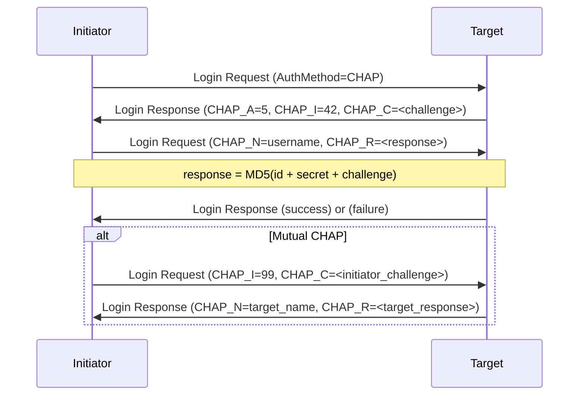

**Configuring CHAP via RPC**

```bash
# Set global CHAP authentication mode
# 0 = disabled, 1 = CHAP (one-way), 2 = mutual CHAP
scripts/rpc.py iscsi_set_options \
    --chap-group 0 \
    --require-chap \
    --mutual-chap

# Add CHAP credentials to an authentication group
scripts/rpc.py iscsi_create_auth_group 1
scripts/rpc.py iscsi_auth_group_add_secrets 1 \
    --user myuser \
    --secret mysecret \
    --muser mytargetname \
    --msecret mytargetsecret

# Bind auth group to a target node
scripts/rpc.py iscsi_create_target_node \
    Target0 Target0_alias \
    MyBdev:0 \
    1:2 \
    64 \
    --chap-group 1 \
    --require-chap
```

**One-Way vs Mutual CHAP**

| Mode | Initiator authenticates to Target | Target authenticates to Initiator |
|------|----------------------------------|----------------------------------|
| None | No | No |
| One-Way CHAP | Yes | No |
| Mutual CHAP | Yes | Yes |

Mutual CHAP prevents man-in-the-middle attacks where a rogue target impersonates the real storage target.

---

### Concept 6: Target Node and LUN Configuration

A target node is the iSCSI target identity. It maps one IQN to one or more LUNs, each backed by an SPDK bdev.

**Target Node Structure**

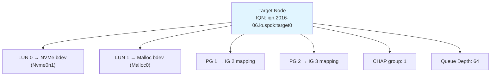

**Creating a Complete Target**

```bash
# Step 1: Create a bdev to back storage
scripts/rpc.py bdev_malloc_create -b Malloc0 64 512

# Step 2: Create portal group (which IP:port to listen on)
scripts/rpc.py iscsi_create_portal_group 1 10.0.0.1:3260

# Step 3: Create initiator group (who can connect)
# ANY = accept any IQN; netmask restricts by IP
scripts/rpc.py iscsi_create_initiator_group 2 ANY 10.0.0.0/24

# Step 4: Create target node
# Syntax: iscsi_create_target_node <name> <alias> <bdev:lun_id> \
#         <portal_grp_tag:initiator_grp_tag> <queue_depth> [options]
scripts/rpc.py iscsi_create_target_node \
    Target0 \
    "Target0 Alias" \
    "Malloc0:0" \
    "1:2" \
    64

# Step 5: Verify
scripts/rpc.py iscsi_get_target_nodes
```

**Multiple LUNs**

```bash
# Create target with multiple LUNs
scripts/rpc.py iscsi_create_target_node \
    Target0 \
    "Multi-LUN Target" \
    "NVMe0n1:0 Malloc0:1 Malloc1:2" \
    "1:2" \
    64
```

**Adding a LUN to an Existing Target**

```bash
scripts/rpc.py iscsi_target_node_add_lun \
    iqn.2016-06.io.spdk:Target0 \
    Malloc2 \
    3   # LUN ID
```

**Target Node Limits**

```c
/* From lib/iscsi/iscsi.h */
#define MAX_INITIATOR    256    /* max initiators per target */
#define MAX_NETMASK      256    /* max netmask entries */
#define MAX_TARGET_NAME  223    /* max IQN length (RFC 3720) */
#define MAX_INITIATOR_NAME 223
```

---

### Concept 7: Discovery Service

Before an initiator can connect to a target, it must discover what targets are available. iSCSI uses a discovery session for this purpose.

**Discovery Flow**

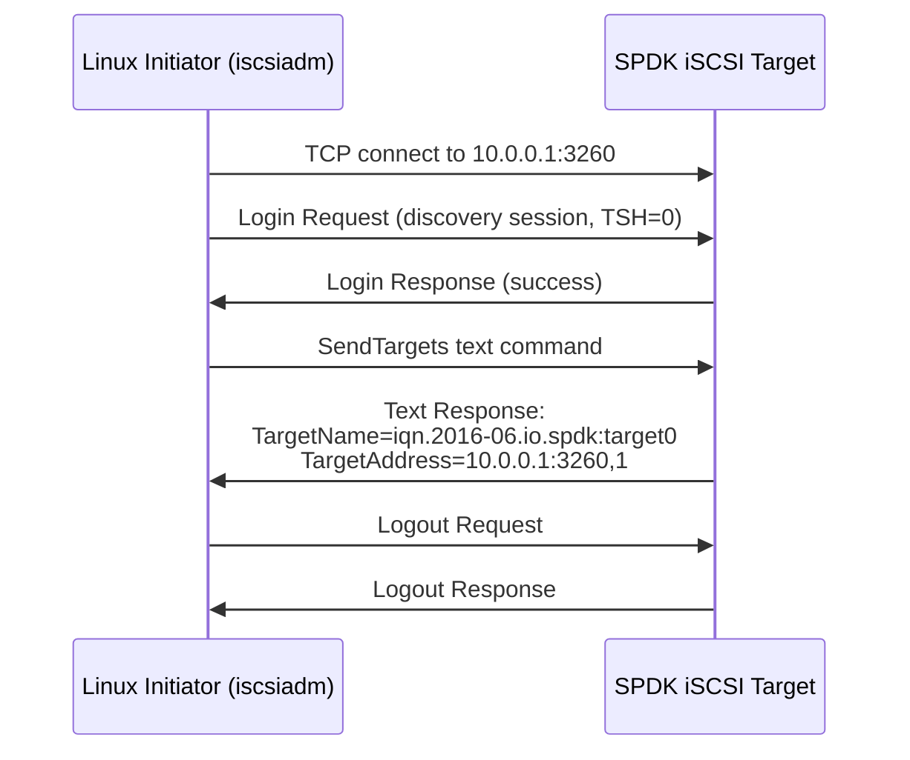

**Discovery Commands**

```bash
# Discover all targets at a portal
iscsiadm -m discovery -t sendtargets -p 10.0.0.1

# Expected output:
# 10.0.0.1:3260,1 iqn.2016-06.io.spdk:Target0

# Login to all discovered targets
iscsiadm -m node --login

# Login to specific target
iscsiadm -m node \
    --targetname iqn.2016-06.io.spdk:Target0 \
    --portal 10.0.0.1:3260 \
    --login
```

**Discovery vs Normal Session**

| Aspect | Discovery Session | Normal Session |
|--------|-------------------|----------------|
| TSIH | 0 | Non-zero |
| Commands allowed | SendTargets text only | Full SCSI |
| LUN access | None | Full |
| Authentication | Optional (configurable) | Per target config |

SPDK handles discovery sessions through the same connection path — the target responds to `SendTargets` text commands by enumerating all target nodes that the initiator's IP is allowed to see (based on initiator group membership).

---

### Concept 8: PDU Processing Pipeline

This is the core I/O path. Understanding it is essential for performance analysis.

**Write Path (Initiator → Target)**

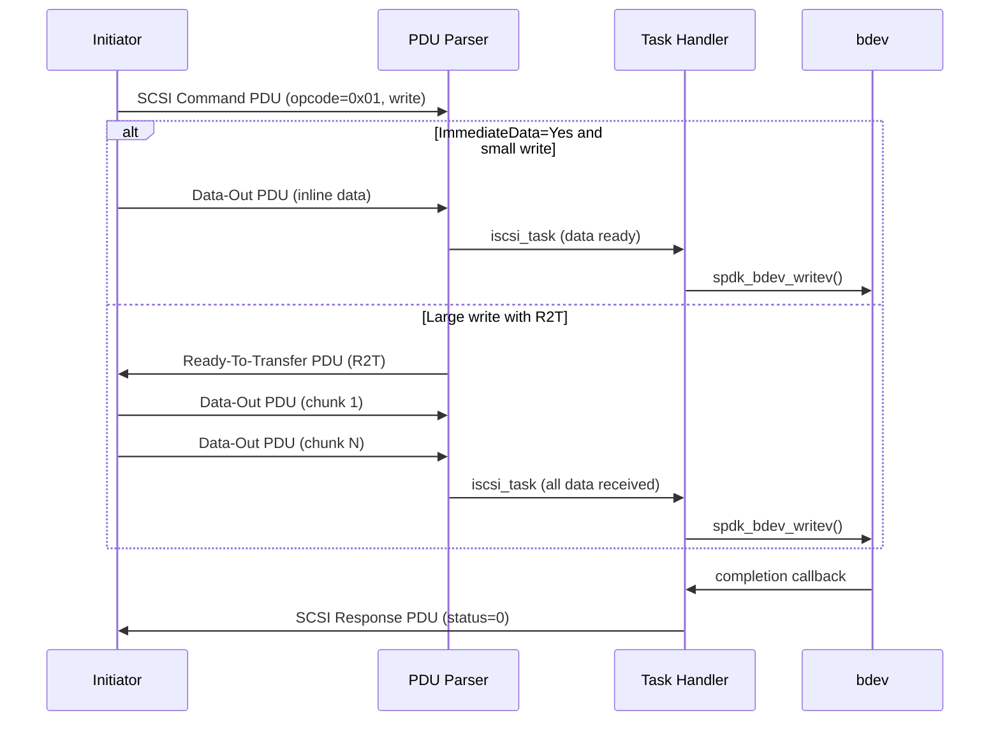

**Read Path (Target → Initiator)**

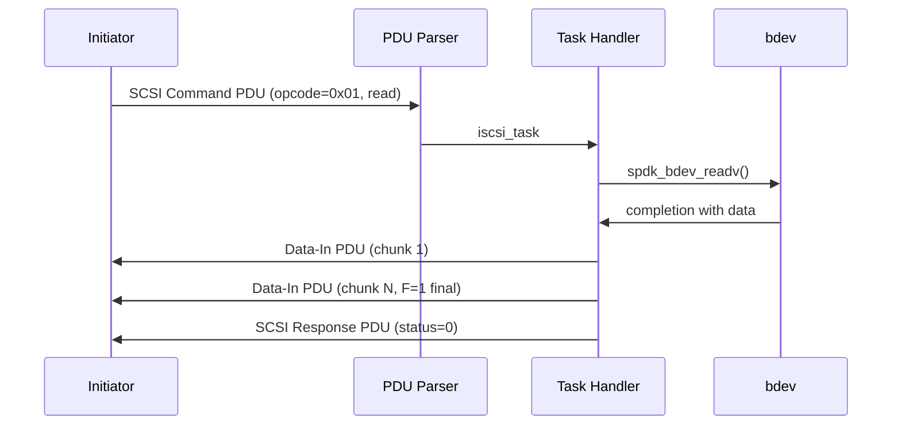

**Task Flow Through SPDK Layers**

```c
/*
 * Simplified call chain for a SCSI read command:
 *
 * iscsi_conn_sock_cb()          <- socket poller fires
 *   -> iscsi_conn_read_pdu()    <- read bytes from TCP
 *     -> iscsi_pdu_payload_op_scsi()   <- decode SCSI opcode
 *       -> spdk_iscsi_task_alloc()     <- allocate task
 *         -> iscsi_tgt_node_execute()  <- route to LUN
 *           -> spdk_scsi_dev_queue_task()  <- SCSI layer
 *             -> spdk_bdev_readv()         <- bdev I/O
 *
 * Completion:
 * spdk_bdev_readv completion
 *   -> spdk_scsi_task_process_status()
 *     -> iscsi_task_cpl()              <- task completion
 *       -> iscsi_conn_write_pdu()      <- send Data-In + response
 */
```

**Socket Polling**

The iSCSI connection I/O is driven by SPDK's socket poller, not by epoll/select:

```c
/* From lib/iscsi/conn.c */
static void
iscsi_conn_sock_cb(void *arg, struct spdk_sock_group *group,
                   struct spdk_sock *sock)
{
    struct spdk_iscsi_conn *conn = arg;
    /* Non-blocking read of available data */
    /* Process complete PDUs */
    /* Queue responses */
}
```

This callback fires on every reactor poll iteration when data is available on the socket — no kernel blocking, no thread wakeup.

---

### Concept 9: Data Digests and Error Handling

iSCSI supports optional CRC32C digests on PDU headers and data segments. SPDK supports both.

**Digest Configuration**

```bash
# Enable header and data digests globally
scripts/rpc.py iscsi_set_options \
    --header-digest \
    --data-digest

# Or per target node during creation
scripts/rpc.py iscsi_create_target_node \
    Target0 "Target0" "NVMe0n1:0" "1:2" 64 \
    --header-digest \
    --data-digest
```

**Digest Overhead**

| Digest Mode | Overhead | Use Case |
|-------------|----------|----------|
| None | 0 bytes | Trusted private network |
| HeaderDigest only | 4 bytes per PDU | Detect header corruption |
| DataDigest only | 4 bytes per data PDU | Detect data corruption |
| Both | 4+4 bytes per data PDU | Maximum integrity |

The CRC32C computation is accelerated by hardware instructions (SSE4.2 `PCRC32` on x86) when available.

**Task Management Functions**

SPDK handles the full set of iSCSI task management functions:

```c
/* From include/spdk/iscsi_spec.h */
enum iscsi_task_func {
    ISCSI_TASK_FUNC_ABORT_TASK           = 1,
    ISCSI_TASK_FUNC_ABORT_TASK_SET       = 2,
    ISCSI_TASK_FUNC_CLEAR_ACA            = 3,
    ISCSI_TASK_FUNC_CLEAR_TASK_SET       = 4,
    ISCSI_TASK_FUNC_LOGICAL_UNIT_RESET   = 5,
    ISCSI_TASK_FUNC_TARGET_WARM_RESET    = 6,
    ISCSI_TASK_FUNC_TARGET_COLD_RESET    = 7,
    ISCSI_TASK_FUNC_TASK_REASSIGN        = 8,
};
```

These map to the SPDK SCSI layer:

```c
/* From include/spdk/scsi.h */
enum spdk_scsi_task_func {
    SPDK_SCSI_TASK_FUNC_ABORT_TASK     = 0,
    SPDK_SCSI_TASK_FUNC_ABORT_TASK_SET,
    SPDK_SCSI_TASK_FUNC_CLEAR_TASK_SET,
    SPDK_SCSI_TASK_FUNC_LUN_RESET,
    SPDK_SCSI_TASK_FUNC_TARGET_RESET,
};
```

---

### Concept 10: SCSI Layer Integration

The SPDK iSCSI target does not talk to bdevs directly. It goes through the SCSI emulation layer (`lib/scsi`), which presents a proper SCSI device model to the iSCSI protocol layer.

**SCSI Task Structure**

```c
/* From include/spdk/scsi.h */
struct spdk_scsi_task {
    uint8_t status;                /* SAM-5 status (GOOD, CHECK CONDITION, etc.) */
    uint8_t function;              /* task management function */
    uint8_t response;             /* task management response */

    struct spdk_scsi_lun    *lun;           /* target LUN */
    struct spdk_scsi_port   *target_port;
    struct spdk_scsi_port   *initiator_port;

    spdk_scsi_task_cpl  cpl_fn;    /* completion callback */
    spdk_scsi_task_free free_fn;   /* free callback */

    uint32_t transfer_len;         /* requested bytes */
    uint32_t data_transferred;     /* actual bytes moved */
    uint64_t offset;               /* byte offset */
    uint8_t *cdb;                  /* SCSI Command Descriptor Block */
    /* ... */
};
```

**SCSI → bdev Translation**

The SCSI layer translates SCSI CDBs (READ(10), WRITE(10), INQUIRY, etc.) into bdev operations:

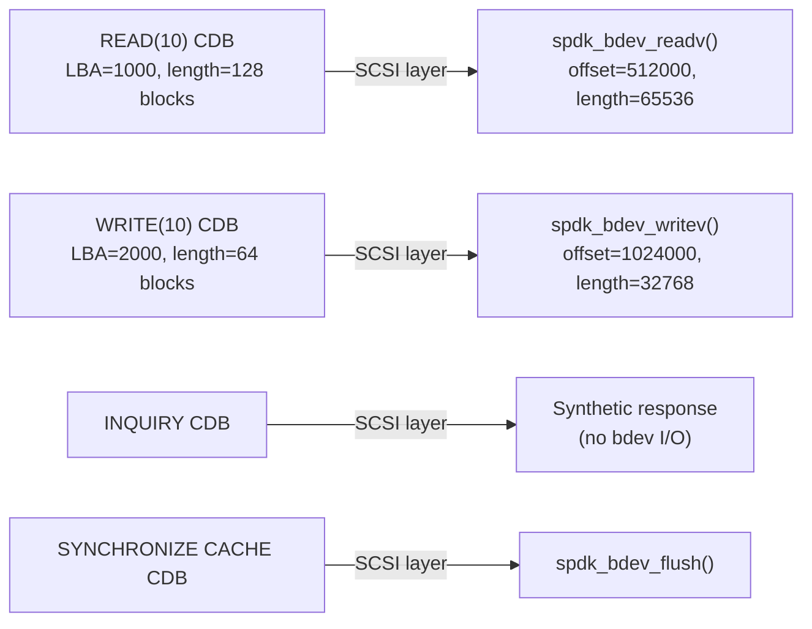

**LUN Numbers**

```
┌──────────────────────────────────────────────────┐
│ Target Node: iqn.2016-06.io.spdk:target0         │
│                                                  │
│ LUN 0 ──► spdk_scsi_lun ──► NVMe0n1 (bdev)      │
│ LUN 1 ──► spdk_scsi_lun ──► Malloc0 (bdev)       │
│ LUN 2 ──► spdk_scsi_lun ──► AIO0 (bdev)          │
└──────────────────────────────────────────────────┘
```

---

## Complete Configuration Example

### Full iSCSI Target Setup

This example sets up a production-like configuration with NVMe-backed storage, CHAP, and dual-portal HA configuration.

```bash
#!/bin/bash
# Complete SPDK iSCSI target configuration

SPDK_DIR="/path/to/spdk"
RPC="$SPDK_DIR/scripts/rpc.py"

# 1. Start the application (2 cores for iSCSI polling)
$SPDK_DIR/build/bin/iscsi_tgt -m 0x3 &
sleep 2

# 2. Set global iSCSI options
$RPC iscsi_set_options \
    --node-base "iqn.2016-06.io.spdk" \
    --max-sessions 128 \
    --max-connections-per-session 2 \
    --max-queue-depth 64 \
    --no-discovery-auth

# 3. Create NVMe bdev
$RPC bdev_nvme_attach_controller \
    -b NVMe0 \
    -t pcie \
    -a 0000:00:01.0

# 4. Create portal groups
#    PG 1: primary portal
$RPC iscsi_create_portal_group 1 10.0.0.1:3260

#    PG 2: secondary portal for HA
$RPC iscsi_create_portal_group 2 10.0.0.2:3260

# 5. Create initiator groups
#    IG 1: trusted servers by IQN
$RPC iscsi_create_initiator_group 1 \
    iqn.1993-08.org.debian:server01 \
    192.168.1.0/24

#    IG 2: open access (dev/test only)
$RPC iscsi_create_initiator_group 2 ANY 0.0.0.0/0

# 6. Create CHAP auth group for production
$RPC iscsi_create_auth_group 1
$RPC iscsi_auth_group_add_secrets 1 \
    --user spdk_client \
    --secret "s3cr3t_p@ssword" \
    --muser spdk_target \
    --msecret "t@rget_s3cr3t"

# 7. Create production target node (NVMe, CHAP, both portals)
$RPC iscsi_create_target_node \
    NVMeTarget \
    "NVMe Production Target" \
    "NVMe0n1:0" \
    "1:1 2:1" \
    64 \
    --chap-group 1 \
    --require-chap \
    --mutual-chap

# 8. Create dev target (no auth, malloc bdev)
$RPC bdev_malloc_create -b Malloc0 256 512
$RPC iscsi_create_target_node \
    DevTarget \
    "Dev Target - No Auth" \
    "Malloc0:0" \
    "1:2" \
    64 \
    --no-auth-chap

# 9. Verify configuration
echo "=== Portal Groups ==="
$RPC iscsi_get_portal_groups

echo "=== Initiator Groups ==="
$RPC iscsi_get_initiator_groups

echo "=== Target Nodes ==="
$RPC iscsi_get_target_nodes
```

### Linux Initiator Connection

```bash
# Install open-iscsi
apt-get install -y open-iscsi   # Ubuntu/Debian
yum install -y iscsi-initiator-utils  # RHEL/CentOS/Fedora

# Performance tuning for /etc/iscsi/iscsid.conf
cat >> /etc/iscsi/iscsid.conf << 'EOF'
node.session.cmds_max = 4096
node.session.queue_depth = 128
EOF

# Apply kernel network tuning
sysctl -w net.ipv4.tcp_timestamps=1
sysctl -w net.ipv4.tcp_sack=0
sysctl -w net.ipv4.tcp_rmem="10000000 10000000 10000000"
sysctl -w net.ipv4.tcp_wmem="10000000 10000000 10000000"
sysctl -w net.core.rmem_max=524287
sysctl -w net.core.wmem_max=524287
sysctl -w net.core.netdev_max_backlog=300000

# Restart iscsid
systemctl restart iscsid

# Discover targets
iscsiadm -m discovery -t sendtargets -p 10.0.0.1

# Connect (sets up CHAP credentials first)
iscsiadm -m node \
    --targetname iqn.2016-06.io.spdk:NVMeTarget \
    --op update \
    --name node.session.auth.authmethod \
    --value CHAP

iscsiadm -m node \
    --targetname iqn.2016-06.io.spdk:NVMeTarget \
    --op update \
    --name node.session.auth.username \
    --value spdk_client

iscsiadm -m node \
    --targetname iqn.2016-06.io.spdk:NVMeTarget \
    --op update \
    --name node.session.auth.password \
    --value "s3cr3t_p@ssword"

# Login
iscsiadm -m node \
    --targetname iqn.2016-06.io.spdk:NVMeTarget \
    --login

# Verify - device should appear as /dev/sdX
lsblk
dmesg | tail -20

# Run quick perf test
fio --name=test \
    --filename=/dev/sdb \
    --rw=randread \
    --bs=4k \
    --iodepth=128 \
    --numjobs=1 \
    --runtime=60 \
    --time_based \
    --ioengine=libaio \
    --direct=1
```

---

## Performance Tuning

### CPU Core Assignment

iSCSI is CPU-intensive because every byte of data passes through user-space TCP processing. Pin iSCSI polling threads to cores physically close to both the NIC and NVMe device on the same NUMA node.

```bash
# Check NUMA topology
numactl --hardware
lspci -v | grep -A5 "Ethernet\|NVMe"

# Run iscsi_tgt on NUMA node 0 cores 0-7
build/bin/iscsi_tgt \
    -m 0xFF \              # cores 0-7
    --huge-unlink \
    -L iscsi               # enable iSCSI debug log

# Or with explicit NUMA allocation
numactl --cpunodebind=0 --membind=0 \
    build/bin/iscsi_tgt -m 0xFF
```

### Key Tuning Parameters

**Queue Depth**

```bash
# Per-target queue depth (default 64, range 1-128)
# Higher = more concurrent commands = better throughput
# Lower = less memory, lower latency under light load
scripts/rpc.py iscsi_create_target_node \
    Target0 "Target0" "NVMe0n1:0" "1:2" \
    128   # <-- queue depth
```

**MaxR2T and Data Out**

```bash
# MaxR2T: max simultaneous Ready-To-Transfer per command
# More R2Ts = more parallelism for large writes
scripts/rpc.py iscsi_set_options --max-r2t 8

# First Burst Length: inline data without R2T
# Larger = fewer round trips for small writes
# Must be <= MaxBurstLength
scripts/rpc.py iscsi_set_options --first-burst-length 65536
```

**Disable ImmediateData for Large Block Workloads**

```bash
# For large sequential writes, disabling ImmediateData
# lets the target control data flow entirely via R2T,
# reducing buffer pressure
scripts/rpc.py iscsi_set_options --no-immediate-data
```

**Disable Digests for Trusted Networks**

```bash
# Digests add ~200ns per PDU of CRC32C computation
# On a trusted private network, skip them
scripts/rpc.py iscsi_create_target_node \
    Target0 "Target0" "NVMe0n1:0" "1:2" 64
    # --header-digest and --data-digest omitted
```

### Tuning Comparison Table

| Setting | Latency | Throughput | CPU | Memory | Recommendation |
|---------|---------|------------|-----|--------|----------------|
| Queue Depth 64 | Baseline | Baseline | Baseline | Low | Default |
| Queue Depth 128 | +2% | +15% | +5% | 2x | High throughput |
| HeaderDigest ON | +5% | -3% | +10% | Minimal | Untrusted networks |
| DataDigest ON | +8% | -5% | +15% | Minimal | Untrusted networks |
| FirstBurst 64KB | -10% | +8% | Neutral | +buffer | Large write workloads |
| MaxR2T 8 | Neutral | +12% | +5% | +buffer | Large write parallelism |

### Monitoring

```bash
# Watch active connections and sessions
scripts/rpc.py iscsi_get_connections

# Expected output format:
# {
#   "id": 0,
#   "cid": 0,
#   "tsih": 1,
#   "lcore_id": 2,
#   "initiator_addr": "192.168.1.100",
#   "target_addr": "10.0.0.1",
#   "target_node_name": "iqn.2016-06.io.spdk:Target0"
# }

# Enable SPDK tracing for iSCSI
scripts/rpc.py trace_enable_tpoint_group iscsi

# View bdev I/O statistics per LUN
scripts/rpc.py bdev_get_iostat

# SPDK performance report (live)
scripts/spdk_top.py
```

---

## Common Pitfalls and Troubleshooting

### Pitfall 1: NUMA Mismatch

**Symptom**: Low throughput, high CPU usage, random latency spikes.

**Cause**: iSCSI polling thread is on a different NUMA node than the NIC or NVMe device.

**Fix**:
```bash
# Find NIC NUMA node
cat /sys/class/net/eth0/device/numa_node

# Find NVMe NUMA node
cat /sys/bus/pci/devices/0000:00:01.0/numa_node

# Assign iscsi_tgt cores to matching NUMA node
build/bin/iscsi_tgt -m 0xFF  # use cores on correct node
```

### Pitfall 2: Initiator Group Mismatch

**Symptom**: Login fails with "initiator not found" or discovery returns no targets.

**Cause**: Initiator IQN or IP is not in any initiator group mapped to the target.

**Fix**:
```bash
# Check what IP the initiator is connecting from
scripts/rpc.py iscsi_get_connections

# Ensure initiator group includes that IP
scripts/rpc.py iscsi_get_initiator_groups

# Add initiator if missing
scripts/rpc.py iscsi_initiator_group_add_initiators 2 \
    --initiators "iqn.1993-08.org.debian:server02" \
    --netmasks "192.168.2.0/24"
```

### Pitfall 3: MaxConnections Exhaustion

**Symptom**: New connections rejected with "too many connections".

**Cause**: Reached `MAX_ISCSI_CONNECTIONS` (1024) or per-session limit.

**Fix**:
```bash
# Check active connections
scripts/rpc.py iscsi_get_connections | python3 -c \
    "import json,sys; d=json.load(sys.stdin); print(f'Active: {len(d)}')"

# Increase per-session connections
scripts/rpc.py iscsi_set_options \
    --max-connections-per-session 4
```

### Pitfall 4: TCP Buffer Exhaustion

**Symptom**: Throughput drops, TCP retransmits visible in `netstat -s`.

**Cause**: Kernel TCP buffers too small for high-throughput iSCSI.

**Fix**:
```bash
# Apply on initiator side
sysctl -w net.ipv4.tcp_rmem="10000000 10000000 10000000"
sysctl -w net.ipv4.tcp_wmem="10000000 10000000 10000000"
sysctl -w net.core.rmem_max=524287
sysctl -w net.core.wmem_max=524287
```

### Pitfall 5: Stale Target Cache on Initiator

**Symptom**: Initiator connects to old portal after target reconfiguration.

**Fix**:
```bash
# Delete cached node info
iscsiadm -m node -o delete

# Rediscover
iscsiadm -m discovery -t sendtargets -p 10.0.0.1
iscsiadm -m node --login
```

---

## Architecture Deep Dive: Connection Lifecycle

Understanding the full lifecycle of an iSCSI connection illuminates where performance is gained and lost.

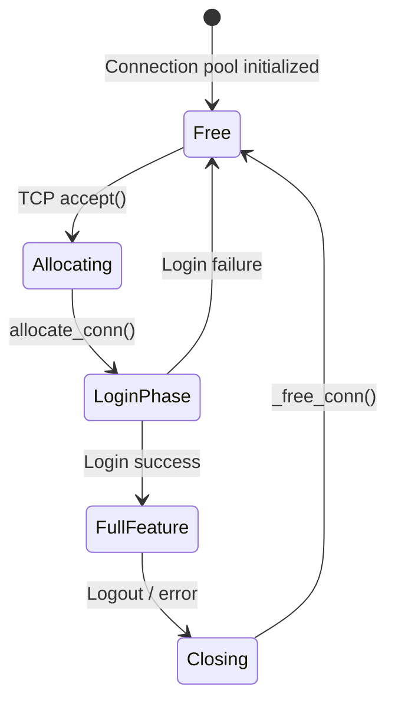

**Connection Pool**

SPDK pre-allocates all connection structures at startup to avoid malloc on the hot path:

```c
/* From lib/iscsi/conn.c */
int
initialize_iscsi_conns(void)
{
    /* Pre-allocate all MAX_ISCSI_CONNECTIONS (1024) connection structs */
    g_conns_array = calloc(MAX_ISCSI_CONNECTIONS,
                           sizeof(struct spdk_iscsi_conn));

    for (i = 0; i < MAX_ISCSI_CONNECTIONS; i++) {
        TAILQ_INSERT_TAIL(&g_free_conns, &g_conns_array[i], conn_link);
    }
}
```

**Connection Assignment to Reactor**

When a new TCP connection is accepted, it is assigned to a reactor (SPDK thread) using a round-robin or least-loaded policy. After assignment, all I/O for that connection runs on that reactor with zero cross-thread synchronization.

**Digest on the Fast Path**

CRC32C computation happens inline during PDU send/receive:

```c
/* Conceptual: CRC32C computed inline, not offloaded */
#define MAKE_DIGEST_WORD(BUF, CRC32C) \
    ((*((uint8_t *)(BUF)+0)) = (uint8_t)((uint32_t)(CRC32C) >> 0)),  \
    ((*((uint8_t *)(BUF)+1)) = (uint8_t)((uint32_t)(CRC32C) >> 8)),  \
    ((*((uint8_t *)(BUF)+2)) = (uint8_t)((uint32_t)(CRC32C) >> 16)), \
    ((*((uint8_t *)(BUF)+3)) = (uint8_t)((uint32_t)(CRC32C) >> 24)))
```

---

## iSCSI vs NVMe-oF Comparison

Both protocols serve block storage over network. Understanding when to choose which matters for system design.

| Dimension | iSCSI | NVMe-oF (TCP) | NVMe-oF (RDMA) |
|-----------|-------|---------------|-----------------|
| Client OS support | Universal | Linux 5.0+, Win 2022+ | Special RDMA HW |
| Latency | ~100-200us | ~50-100us | ~10-30us |
| Throughput | Good (10GbE+) | Excellent | Excellent |
| CPU overhead | High (TCP + SCSI) | Medium (TCP + NVMe) | Low (RDMA offload) |
| Protocol stack | iSCSI→SCSI→bdev | NVMe-oF→bdev | NVMe-oF→bdev |
| Max LUNs/target | 255 (SCSI limit) | 65535 (NVMe) | 65535 (NVMe) |
| Multi-pathing | MPIO | ANA (Asymmetric NS) | ANA |
| Auth | CHAP | NVMe authentication | NVMe authentication |
| Deployment | Existing infra | Modern deployments | HPC / hyperscale |

**When to Use iSCSI**:
- Existing iSCSI SAN infrastructure that must be retained
- Clients running Windows Server 2012 or older Linux without NVMe-oF support
- Environments where the storage team manages access control via iSCSI initiator groups
- When SCSI semantics (reservation, persistent reserve) are required

**When to Use NVMe-oF**:
- New deployments where all clients are modern
- Latency-sensitive workloads (databases, VMs)
- When CPU budget is tight and RDMA NICs are available

---

## Key Takeaways

- iSCSI encapsulates SCSI over TCP. Every PDU starts with a 48-byte Basic Header Segment (BHS) and carries sequence numbers for in-order delivery.
- SPDK's iSCSI target uses **three configuration objects**: portal groups (listeners), initiator groups (access control), and target nodes (IQN + LUN mappings). A target node references a PG:IG pair to specify which initiators can connect through which portal.
- The **login phase** negotiates operational parameters (burst sizes, digest, R2T behavior) before SCSI commands are allowed. CHAP authentication runs during the security negotiation sub-phase.
- SPDK assigns each accepted connection to an **SPDK reactor**. After assignment, all PDU processing and bdev I/O for that connection runs on that reactor with no cross-thread locking.
- The **SCSI emulation layer** sits between iSCSI and bdev. It translates SCSI CDBs (READ/WRITE/INQUIRY etc.) into bdev operations and synthesizes responses for management commands like INQUIRY.
- **Discovery sessions** allow initiators to enumerate available targets via SendTargets text commands. SPDK handles discovery through the same connection infrastructure.
- **Performance** is primarily determined by: NUMA alignment of cores to NIC/NVMe, queue depth, burst length parameters, and whether digests are enabled. Disable digests on trusted networks for maximum throughput.
- `MAX_ISCSI_CONNECTIONS` is 1024 by default. All connection structures are **pre-allocated** at startup to keep allocation off the hot path.

---

## Exercises

### Exercise 1: Basic Target Setup and Discovery

Set up an SPDK iSCSI target with a malloc bdev and connect from the Linux initiator.

**Tasks**:
1. Start `iscsi_tgt` with a single core.
2. Create a malloc bdev (`Malloc0`, 1GB, 512-byte blocks).
3. Create portal group 1 on localhost:3260.
4. Create initiator group 2 with `ANY` initiator and `127.0.0.1/32` netmask.
5. Create target node `TestTarget` mapping `Malloc0:0` to portal group 1, initiator group 2.
6. Run `iscsiadm -m discovery -t sendtargets -p 127.0.0.1` and verify the target appears.
7. Login and verify a block device appears in `lsblk`.

**Expected Result**:
```
$ iscsiadm -m discovery -t sendtargets -p 127.0.0.1
127.0.0.1:3260,1 iqn.2016-06.io.spdk:TestTarget

$ lsblk
NAME   MAJ:MIN RM  SIZE RO TYPE MOUNTPOINT
sdb      8:16   0    1G  0 disk
```

### Exercise 2: CHAP Authentication

Extend Exercise 1 to require mutual CHAP authentication.

**Tasks**:
1. Create an auth group with username `client1`, secret `client_secret`, target name `spdk`, target secret `target_secret`.
2. Delete and recreate the target node with `--chap-group 1 --require-chap --mutual-chap`.
3. Configure open-iscsi on the initiator with the CHAP credentials.
4. Verify connection succeeds with CHAP and fails without credentials.

**Key Check**:
```bash
# This should fail (no CHAP configured on initiator)
iscsiadm -m node --targetname iqn.2016-06.io.spdk:TestTarget --login
# Expected: Login failed: initiator error (02/00)
```

### Exercise 3: Multi-LUN Target and Performance

Create a target with multiple LUNs and benchmark throughput.

**Tasks**:
1. Create three malloc bdevs: `Malloc0` (4GB), `Malloc1` (4GB), `Malloc2` (4GB).
2. Create a target node `MultiTarget` with all three as LUN 0, 1, 2.
3. Connect from the initiator and verify three block devices appear.
4. Run `fio` with `--filename=/dev/sdb:/dev/sdc:/dev/sdd` to benchmark aggregate throughput.
5. Compare throughput with queue depth 32 vs 128.

**Analysis Questions**:
- Why does higher queue depth improve throughput for malloc bdev?
- What limits throughput when using a real NVMe bdev instead?
- How does `fio --iodepth` on the initiator relate to `--max-queue-depth` on the target?

### Exercise 4: Portal Group Failover

Configure two portal groups and test failover behavior.

**Tasks**:
1. Create two portal groups on two different IP addresses (use loopback aliases: `127.0.0.1` and `127.0.0.2`).
2. Create an initiator group accessible from both IPs.
3. Create a target node mapped to both portal groups: `"1:2 2:2"`.
4. Connect initiator through portal group 1.
5. Delete portal group 1 via RPC while connected.
6. Observe initiator behavior (reconnect, error, etc.).

**Discussion**: How does this compare to NVMe-oF ANA (Asymmetric Namespace Access) failover?

### Exercise 5: Tracing iSCSI PDUs

Use SPDK's built-in tracing to observe the PDU exchange during a write operation.

**Tasks**:
1. Enable iSCSI tracing: `scripts/rpc.py trace_enable_tpoint_group iscsi`.
2. Perform a 64KB write from the initiator: `dd if=/dev/zero of=/dev/sdb bs=64k count=1`.
3. Dump the trace: `scripts/spdk_trace.py -f /dev/shm/spdk_trace`.
4. Identify the sequence: SCSI command → R2T → Data-Out → SCSI response.
5. Measure the time between SCSI command receipt and SCSI response transmission.

**Expected Trace Events**:
```
[SCSI_CMD] itt=0x1 cdb=WRITE(10) lba=0 len=128
[ISCSI_R2T] itt=0x1 ttt=0x1 offset=0 len=65536
[ISCSI_DATAIN] itt=0x1 offset=0 len=65536
[SCSI_RSP] itt=0x1 status=GOOD
```

---

## Additional Resources

- **RFC 3720**: iSCSI specification (the authoritative reference)
- **RFC 3721**: iSCSI Naming Conventions
- **RFC 3723**: Securing Block Storage Protocols over IP (CHAP security)
- **SPDK iSCSI documentation**: `doc/iscsi.md` in the SPDK tree
- **SPDK source**: `lib/iscsi/` directory — start with `iscsi.h`, then `conn.c`, `tgt_node.c`
- **include/spdk/iscsi_spec.h**: All PDU structures and opcodes
- **include/spdk/scsi.h**: SCSI task interface used by iSCSI layer
- **Open-iSCSI project**: `open-iscsi.org` — Linux initiator source and documentation
- **SPDK mailing list**: `spdk@lists.01.org`
- **Conference talk**: "SPDK iSCSI Target Performance" — SPDK Summit presentations

---
