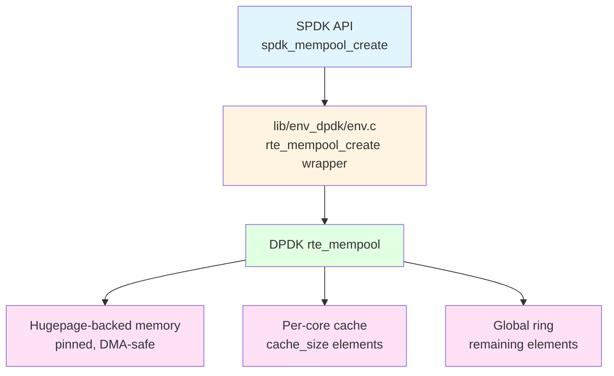
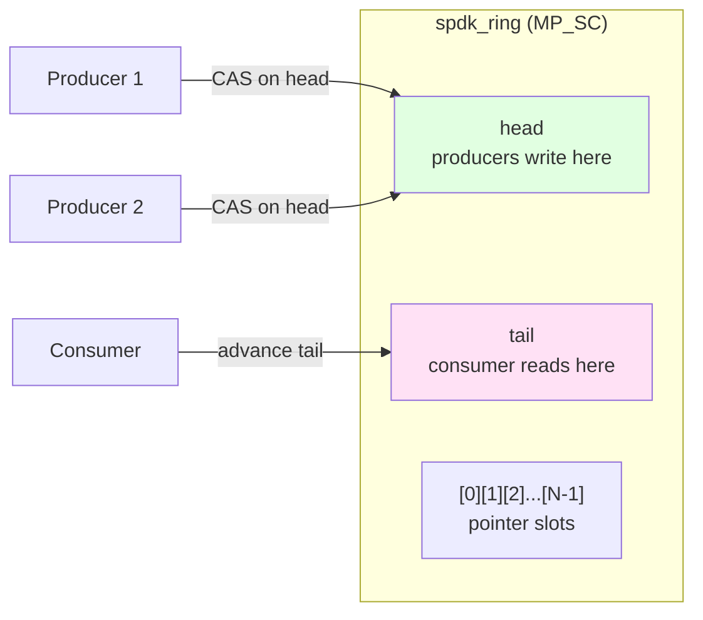
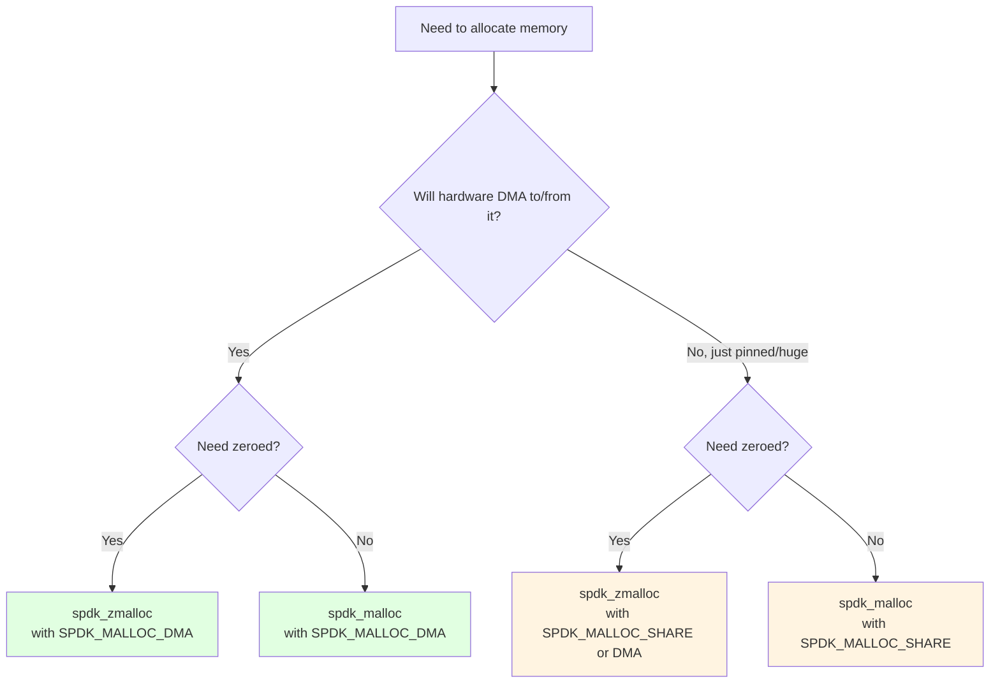
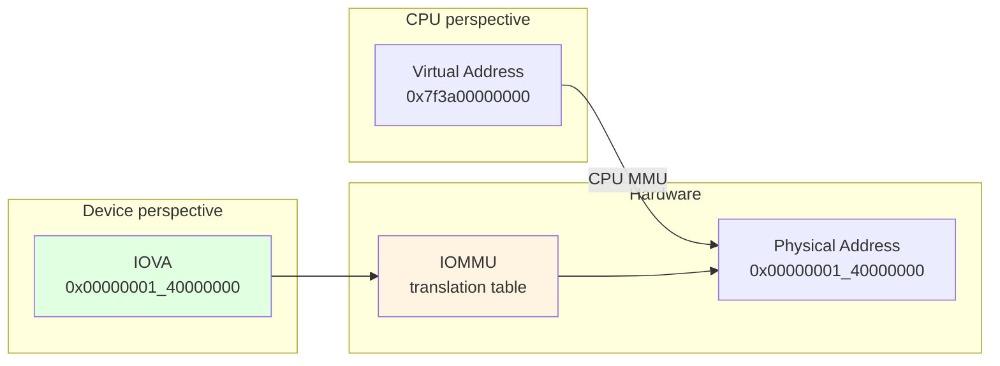
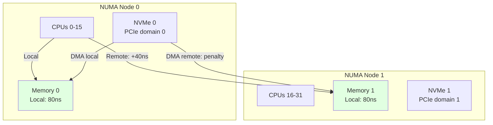
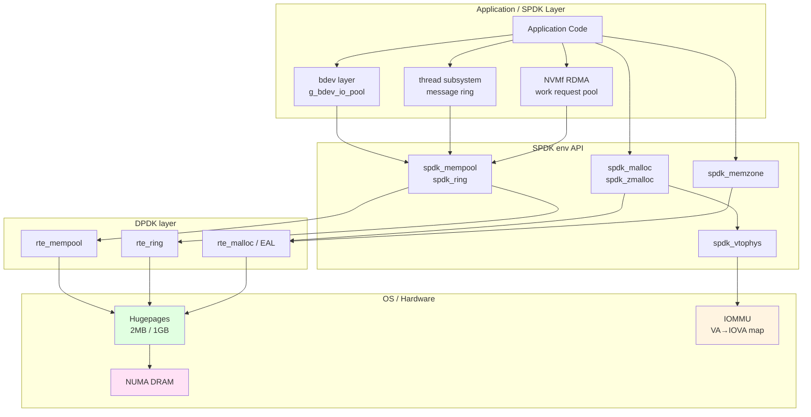

# Module 25: Memory Pool Internals

**Stage**: 3 (Mastery)
**Difficulty**: Advanced
**Estimated Time**: 5 hours
**Prerequisites**: Module 05 (Memory Management), Module 10 (Threading Model), Module 15 (NVMe Driver Internals)

**Version History**:
- v1.0 (2026-03-30): Initial version

---

## Learning Objectives

By the end of this module, you will be able to:
- Explain how `spdk_mempool` maps to DPDK `rte_mempool` internally
- Size and configure memory pools correctly for production workloads
- Use `spdk_ring` for lock-free inter-thread communication
- Apply cache-aligned allocation techniques to eliminate false sharing
- Choose between `spdk_malloc`, `spdk_zmalloc`, and `spdk_dma_malloc` for each use case
- Manage IOVA (I/O Virtual Address) mappings for DMA-capable memory
- Allocate NUMA-local memory and measure the performance impact of getting it wrong
- Monitor pool health with `spdk_mempool_count` and the memory iteration callbacks
- Implement custom pre-initialization patterns using `spdk_mempool_create_ctor`

---

## Overview

Module 05 taught you that SPDK requires DMA-safe, pinned memory backed by hugepages.
This module goes one level deeper: how does SPDK manage _pools_ of such memory, how are
those pools wired to the hardware, and what does every allocation path cost?

The answer matters because every I/O submitted through SPDK passes through at least one
pool allocation. The bdev layer allocates an `spdk_bdev_io` from `g_bdev_mgr.bdev_io_pool`
on every I/O submission path. The NVMf RDMA transport allocates work-request descriptors
from a dedicated pool. The thread subsystem enqueues messages via an `spdk_ring`. If any
of these pools are sized incorrectly, the result is either allocation failure or avoidable
memory overhead — both are production bugs.

### Why This Matters

```
Every SPDK I/O path:

  Application submit
        |
        v
  spdk_mempool_get(bdev_io_pool)   <-- this must never fail
        |
        v
  [dispatch to driver]
        |
        v
  spdk_mempool_put(bdev_io_pool)   <-- must always return element
```

Getting pool sizing and placement wrong manifests as:
- `ENOMEM` under load with no obvious memory pressure
- Cache-line contention showing up in `perf stat` as high LLC-load-misses
- NUMA remote accesses degrading latency by 40-80ns per I/O on multi-socket systems
- Memory leaks when pools are freed before all elements are returned

---

## Core Concepts

### Concept 1: spdk_mempool Architecture

`struct spdk_mempool` is an opaque type — its implementation lives entirely inside
`lib/env_dpdk/env.c` as a thin wrapper over DPDK's `rte_mempool`.



The pool maintains two levels of storage:

| Level | Location | Access pattern | Locking |
|-------|----------|----------------|---------|
| Per-core cache | CPU-local cache array | Fast path (lcore) | None |
| Global ring | Shared ring buffer | Slow path (fallback) | Atomic CAS |

When a thread running on lcore N calls `spdk_mempool_get()`:
1. Check lcore N's local cache — O(1), no atomic operations
2. If cache empty, bulk-refill from the global ring
3. If global ring empty, return NULL

This two-level design is why `cache_size` is a critical parameter.

#### Internal Layout of a Pool Element

Each pool element is padded so that it starts on a cache-line boundary:

```
+---------------------------+  <- 64-byte aligned
| rte_mempool_objhdr        |  (internal DPDK header, 8 bytes)
+---------------------------+
| user data (ele_size bytes)|
+---------------------------+
| padding to cache line     |
+---------------------------+  <- next element starts here, 64-byte aligned
```

The padding is automatic when `ele_size` is not a multiple of 64 bytes. This means
the actual memory consumed per element is `ALIGN_UP(sizeof(hdr) + ele_size, 64)`.

**Implication**: if you store a 65-byte struct in a pool, each slot consumes 128 bytes.
Always round your struct sizes to cache-line multiples when they will live in a pool.

---

### Concept 2: Creating and Destroying Pools

#### Basic Creation

```c
struct spdk_mempool *pool;

pool = spdk_mempool_create(
    "my_io_pool",               /* name: max 29 chars (SPDK_MAX_MEMPOOL_NAME_LEN) */
    4096,                       /* count: number of elements */
    sizeof(struct my_io_ctx),   /* ele_size: bytes per element */
    SPDK_MEMPOOL_DEFAULT_CACHE_SIZE, /* cache_size: per-core cache */
    SPDK_ENV_NUMA_ID_ANY        /* numa_id: any NUMA node */
);
if (pool == NULL) {
    SPDK_ERRLOG("Failed to create pool\n");
    return -ENOMEM;
}
```

#### With Per-Element Initialization

Use `spdk_mempool_create_ctor` when elements need initialization before first use.
This is a one-time cost paid at pool creation, not at get/put time:

```c
static void
init_io_ctx(struct spdk_mempool *mp, void *opaque, void *obj, unsigned obj_idx)
{
    struct my_io_ctx *ctx = obj;

    /* Pre-initialize fields that are constant across uses */
    ctx->magic = MY_IO_MAGIC;
    ctx->pool = mp;
    /* Pre-register any DMA buffers attached to each element */
}

pool = spdk_mempool_create_ctor(
    "my_io_pool",
    4096,
    sizeof(struct my_io_ctx),
    SPDK_MEMPOOL_DEFAULT_CACHE_SIZE,
    SPDK_ENV_NUMA_ID_ANY,
    init_io_ctx,     /* called once per element at pool creation */
    NULL             /* opaque argument to callback */
);
```

#### Destruction and Leak Detection

A common pattern for safe pool destruction verifies all elements are returned first:

```c
/* From lib/bdev/bdev.c - canonical pattern */
if (g_bdev_mgr.bdev_io_pool != NULL) {
    if (spdk_mempool_count(g_bdev_mgr.bdev_io_pool) !=
        g_bdev_opts.bdev_io_pool_size) {
        SPDK_ERRLOG("bdev_io_pool: %zu of %u elements outstanding at shutdown\n",
                    g_bdev_opts.bdev_io_pool_size -
                    spdk_mempool_count(g_bdev_mgr.bdev_io_pool),
                    g_bdev_opts.bdev_io_pool_size);
    }
    spdk_mempool_free(g_bdev_mgr.bdev_io_pool);
}
```

**Rule**: always check `spdk_mempool_count(pool) == initial_count` before calling
`spdk_mempool_free()`. A count mismatch means you have a use-after-free or memory leak.

---

### Concept 3: Pool Sizing Strategies

Pool sizing is the single most common configuration mistake in production SPDK deployments.
Too small and I/O fails under load. Too large and you waste locked hugepage memory.

#### Formula for I/O Pools

```
pool_size = (max_qpairs × queue_depth) + (num_lcores × cache_size) + safety_margin

Where:
  max_qpairs    = maximum simultaneous NVMe/NVMf queue pairs
  queue_depth   = maximum outstanding I/Os per queue pair
  num_lcores    = number of reactor lcores
  cache_size    = per-core cache size (default: typically 250 elements)
  safety_margin = ~10% overhead
```

**Example**: 4 NVMe drives × 128 queue depth, 4 reactors, default cache:

```
pool_size = (4 × 128) + (4 × 250) + 10%
          = 512 + 1000 + 152
          = 1664  →  round up to 2048 (power of 2 preferred by DPDK)
```

The bdev layer exposes this as `bdev_io_pool_size` in the configuration:

```json
{
  "subsystem": "bdev",
  "config": [
    {
      "method": "bdev_set_options",
      "params": {
        "bdev_io_pool_size": 65535,
        "bdev_io_cache_size": 512
      }
    }
  ]
}
```

#### Cache Size Impact

The cache size controls the maximum number of elements a single lcore can hold locally
without going to the global ring. The trade-off:

| cache_size | Benefit | Cost |
|-----------|---------|------|
| 0 | Zero wasted memory | Every get/put hits global ring (atomic) |
| 64 | Low memory waste | Still frequent ring contention under load |
| 250 (default) | Good for most workloads | 250 × num_cores elements "stuck" in caches |
| 0 (large pool, single-thread) | Save memory, no contention | Correct when only one producer/consumer |

For the bdev I/O pool used in production, the default cache size of 0 (disabled) set
in the bdev init path (`spdk_mempool_create(..., 0, ...)`) is intentional — the bdev
layer manages its own I/O submission and the pool is accessed from a single reactor thread
context per I/O path, so the global ring overhead is acceptable and avoids cache waste.

---

### Concept 4: spdk_ring — Lock-Free Ring Buffers

`spdk_ring` wraps DPDK's `rte_ring`. It is a fixed-size, lock-free circular buffer used
for passing pointers between threads.

#### Ring Types

```c
enum spdk_ring_type {
    SPDK_RING_TYPE_SP_SC,  /* Single-producer, single-consumer: fastest */
    SPDK_RING_TYPE_MP_SC,  /* Multi-producer, single-consumer */
    SPDK_RING_TYPE_MP_MC,  /* Multi-producer, multi-consumer */
};
```

The SPDK thread subsystem uses `SPDK_RING_TYPE_MP_SC` for the per-thread message ring
because multiple threads can send messages to a single reactor:

```c
/* From lib/thread/thread.c */
thread->messages = spdk_ring_create(SPDK_RING_TYPE_MP_SC,
                                    65536,
                                    SPDK_ENV_NUMA_ID_ANY);
```

#### Ring Internal Layout



For SP_SC rings, no atomic operations are needed — only memory barriers. This makes
SP_SC rings suitable for single-producer hotpaths where latency matters.

#### Ring Usage Pattern

```c
/* Creating a ring */
struct spdk_ring *ring = spdk_ring_create(SPDK_RING_TYPE_MP_SC,
                                          65536,
                                          SPDK_ENV_NUMA_ID_ANY);

/* Enqueue (producer side) */
void *msg = allocate_message();
size_t free_space;
size_t enqueued = spdk_ring_enqueue(ring, &msg, 1, &free_space);
if (enqueued == 0) {
    /* Ring full — backpressure needed */
    free_message(msg);
    return -ENOSPC;
}

/* Dequeue (consumer side — from lib/thread/thread.c) */
void *messages[SPDK_MSG_BATCH_SIZE];
size_t count = spdk_ring_dequeue(ring, messages, SPDK_MSG_BATCH_SIZE);
for (size_t i = 0; i < count; i++) {
    process_message(messages[i]);
}

/* Cleanup */
spdk_ring_free(ring);
```

#### Ring Sizing Rules

- Size must be a power of 2 (DPDK requirement, enforced by `spdk_ring_create`)
- Minimum useful size is 2× the maximum burst size
- For the thread message ring: 65536 is the default, sufficient for nearly all workloads
- A ring that is consistently > 80% full indicates the consumer is the bottleneck

---

### Concept 5: DMA Memory Allocation APIs

SPDK provides a hierarchy of DMA allocation functions. Choosing the wrong one is the
most common beginner mistake and the source of silent corruption bugs.

#### API Decision Tree



#### API Reference

```c
/* SPDK_MALLOC_DMA   = 0x01 — DMA-capable (required for device I/O) */
/* SPDK_MALLOC_SHARE = 0x02 — Sharable across process boundaries    */

/* General DMA allocation — preferred modern API */
void *spdk_malloc(size_t size, size_t align, uint64_t *unused,
                  int numa_id, uint32_t flags);

void *spdk_zmalloc(size_t size, size_t align, uint64_t *unused,
                   int numa_id, uint32_t flags);

/* Legacy DMA allocation — equivalent to spdk_malloc(..., SPDK_MALLOC_DMA) */
void *spdk_dma_malloc(size_t size, size_t align, uint64_t *unused);
void *spdk_dma_zmalloc(size_t size, size_t align, uint64_t *unused);

/* NUMA-aware legacy variants */
void *spdk_dma_malloc_socket(size_t size, size_t align, uint64_t *unused, int numa_id);
void *spdk_dma_zmalloc_socket(size_t size, size_t align, uint64_t *unused, int numa_id);

/* Free — works for both spdk_malloc and spdk_dma_malloc families */
void spdk_free(void *buf);
void spdk_dma_free(void *buf);  /* legacy alias */

/* Resize with content preservation */
void *spdk_realloc(void *buf, size_t size, size_t align);
void *spdk_dma_realloc(void *buf, size_t size, size_t align, uint64_t *unused);
```

#### Real Usage from NVMe Driver

The NVMe controller initialization allocates several DMA buffers:

```c
/* From lib/nvme/nvme_ctrlr.c — shadow doorbell buffer */
ctrlr->shadow_doorbell = spdk_zmalloc(
    ctrlr->page_size,    /* size: one page */
    ctrlr->page_size,    /* align: page-aligned */
    NULL,                /* unused (must be NULL) */
    SPDK_ENV_NUMA_ID_ANY,
    SPDK_MALLOC_SHARE    /* shared: visible to controller process */
);

/* NVMe namespace data — DMA-capable for admin command response */
ns->nsdata_zns = spdk_zmalloc(
    sizeof(*ns->nsdata_zns),
    64,                  /* align: cache-line aligned */
    NULL,
    SPDK_ENV_NUMA_ID_ANY,
    SPDK_MALLOC_DMA      /* DMA: NVMe controller writes here */
);
```

**Key observations from real code**:
1. The `unused` parameter is always `NULL` — passing any other value causes failure
2. `SPDK_MALLOC_DMA` is used when the NVMe device will write to the buffer
3. `SPDK_MALLOC_SHARE` is used when the buffer is shared across processes
4. Alignment is typically either `64` (cache line) or `page_size`

---

### Concept 6: Cache-Aligned Allocation and False Sharing

False sharing occurs when two threads write to different variables that share a cache
line. The result is cache-line ping-pong between CPU caches, degrading performance by
5-10x for hot structures.

#### Detecting False Sharing Risk

```c
/* BAD: two frequently-written fields may share a cache line */
struct thread_stats {
    uint64_t io_completed;    /* written by thread A */
    uint64_t io_errors;       /* written by thread B */
    /* both fields fit in one 64-byte cache line → false sharing */
};

/* GOOD: pad to cache line boundary */
struct thread_stats {
    uint64_t io_completed;
    uint8_t  _pad0[56];       /* pad to 64 bytes */
    uint64_t io_errors;
    uint8_t  _pad1[56];
};

/* BETTER: use SPDK's alignment macro */
struct thread_stats {
    uint64_t io_completed __attribute__((aligned(64)));
    uint64_t io_errors    __attribute__((aligned(64)));
};
```

#### Allocating Cache-Aligned DMA Buffers

```c
/* Allocate a 4KB command buffer, cache-line aligned, DMA capable */
#define CMD_BUF_SIZE  4096
#define CACHE_LINE_SZ 64

void *cmd_buf = spdk_zmalloc(CMD_BUF_SIZE, CACHE_LINE_SZ, NULL,
                              SPDK_ENV_NUMA_ID_ANY, SPDK_MALLOC_DMA);
if (cmd_buf == NULL) {
    SPDK_ERRLOG("Failed to allocate command buffer\n");
    return -ENOMEM;
}
```

`spdk_malloc` guarantees at least cache-line alignment regardless of the `align`
parameter. The `align` parameter specifies an _additional_ minimum alignment that must
be a power of two.

#### Pool Element Alignment

When creating a pool for DMA-capable structures, ensure the element size is a multiple
of the cache line size to avoid inter-element false sharing:

```c
/* Compute aligned element size */
size_t raw_size    = sizeof(struct my_nvme_cmd);
size_t aligned_sz  = SPDK_ALIGN_CEIL(raw_size, 64);  /* round up to 64 */

pool = spdk_mempool_create("nvme_cmd_pool", 1024, aligned_sz,
                           SPDK_MEMPOOL_DEFAULT_CACHE_SIZE,
                           SPDK_ENV_NUMA_ID_ANY);
```

---

### Concept 7: IOVA (I/O Virtual Address) Management

When the IOMMU is enabled, devices do not access physical memory addresses directly —
they use IOVA addresses that the IOMMU translates to physical addresses. SPDK handles
this transparently via `spdk_vtophys`.

#### Address Translation



#### Translating a Virtual Address to IOVA

```c
/* Get IOVA for a DMA buffer */
void *buf = spdk_zmalloc(4096, 4096, NULL, SPDK_ENV_NUMA_ID_ANY, SPDK_MALLOC_DMA);

uint64_t region_size = 4096;
uint64_t iova = spdk_vtophys(buf, &region_size);

if (iova == SPDK_VTOPHYS_ERROR) {
    SPDK_ERRLOG("Failed to translate virtual address to IOVA\n");
    spdk_free(buf);
    return -EFAULT;
}

/* iova is now safe to program into the NVMe controller's PRP list */
/* region_size tells you the contiguous IOVA region size */
SPDK_DEBUGLOG(my_driver, "buf vaddr=%p iova=0x%"PRIx64" region_sz=%"PRIu64"\n",
              buf, iova, region_size);
```

#### IOVA Contiguity for Large Transfers

Hugepages provide IOVA-contiguous regions by default. For buffers larger than one
hugepage, verify contiguity:

```c
void *large_buf = spdk_zmalloc(2 * 1024 * 1024, /* 2MB */
                               2 * 1024 * 1024,  /* 2MB aligned */
                               NULL, SPDK_ENV_NUMA_ID_ANY, SPDK_MALLOC_DMA);

uint64_t remaining = 2 * 1024 * 1024;
uint64_t iova = spdk_vtophys(large_buf, &remaining);

if (iova == SPDK_VTOPHYS_ERROR) {
    SPDK_ERRLOG("Address translation failed\n");
    goto err;
}

if (remaining < 2 * 1024 * 1024) {
    /* IOVA region is not contiguous for the full 2MB */
    /* Must use scatter-gather or a memzone with IOVA contiguity */
    SPDK_WARNLOG("IOVA not contiguous: only %"PRIu64" bytes\n", remaining);
}
```

#### Memzone for Guaranteed IOVA Contiguity

When you need a large buffer that is guaranteed IOVA-contiguous:

```c
/* spdk_memzone_reserve guarantees IOVA contiguity by default */
void *zone = spdk_memzone_reserve("my_large_buf",
                                  64 * 1024 * 1024, /* 64MB */
                                  SPDK_ENV_NUMA_ID_ANY,
                                  0 /* no flags: IOVA contiguous */);

/* With SPDK_MEMZONE_NO_IOVA_CONTIG flag: skip contiguity (faster alloc) */
void *zone_nc = spdk_memzone_reserve("my_scattered",
                                     64 * 1024 * 1024,
                                     SPDK_ENV_NUMA_ID_ANY,
                                     SPDK_MEMZONE_NO_IOVA_CONTIG);

/* Lookup by name (useful for shared memory between processes) */
void *existing = spdk_memzone_lookup("my_large_buf");

/* Free */
spdk_memzone_free("my_large_buf");
```

#### IOMMU vs Physical Addresses

```c
/* Check at runtime whether IOMMU is active */
if (spdk_iommu_is_enabled()) {
    /* spdk_vtophys returns IOVA */
    SPDK_NOTICELOG("Running with IOMMU: using IOVA addresses\n");
} else {
    /* spdk_vtophys returns physical address */
    SPDK_NOTICELOG("Running without IOMMU: using physical addresses\n");
}
```

The `iova_mode` field in `spdk_env_opts` controls this at initialization:
- `"pa"` — physical address mode (requires no IOMMU or IOMMU passthrough)
- `"va"` — virtual address mode (uses IOMMU, safer for virtualized environments)

---

### Concept 8: NUMA-Aware Allocation

On multi-socket systems, accessing memory on a remote NUMA node adds 40-80ns of latency
compared to local access. For NVMe I/O paths running at microsecond timescales, this is
a 5-15% latency overhead.

#### NUMA Architecture



#### Getting NUMA ID for a Core or Device

```c
/* Get the NUMA node of the current lcore */
uint32_t lcore = spdk_env_get_current_core();
int32_t  numa_id = spdk_env_get_numa_id(lcore);

/* Allocate pool on the same NUMA node as this reactor */
pool = spdk_mempool_create("reactor_pool", 4096,
                           sizeof(struct my_io), 0,
                           numa_id);  /* NUMA-local allocation */

/* Iterate all NUMA nodes */
int32_t node;
SPDK_ENV_FOREACH_NUMA_ID(node) {
    SPDK_NOTICELOG("Creating pool for NUMA node %d\n", node);
    per_numa_pool[node] = spdk_mempool_create("per_numa_io", 1024,
                                               sizeof(struct my_io), 0,
                                               node);
}
```

#### NUMA-Aware DMA Allocation

```c
/* Allocate DMA buffer local to the NVMe device's NUMA node */
struct spdk_pci_device *pci_dev = spdk_nvme_ctrlr_get_pci_device(ctrlr);
int32_t device_numa = pci_dev->numa_id;

void *io_buf = spdk_zmalloc(buf_size, 4096, NULL,
                             device_numa,      /* match device NUMA node */
                             SPDK_MALLOC_DMA);
```

#### Verifying NUMA Placement

```c
/* Check that an allocation landed on the expected NUMA node */
uint64_t iova;
uint64_t size = 4096;
void *buf = spdk_zmalloc(4096, 4096, NULL, target_numa, SPDK_MALLOC_DMA);

iova = spdk_vtophys(buf, &size);
SPDK_NOTICELOG("Allocated buffer: vaddr=%p iova=0x%"PRIx64"\n", buf, iova);
/* Use /proc/iomem or rte_malloc_get_numa_socket() to verify placement */
```

---

### Concept 9: Pool Statistics and Monitoring

#### Checking Available Elements

```c
/* From lib/iscsi/iscsi_subsystem.c — canonical leak check pattern */
static void
check_pool_on_shutdown(struct spdk_mempool *pool, size_t expected_count)
{
    size_t available = spdk_mempool_count(pool);

    if (available != expected_count) {
        SPDK_ERRLOG("Pool '%s': %zu elements outstanding at shutdown "
                    "(expected all %zu returned)\n",
                    spdk_mempool_get_name(pool),
                    expected_count - available,
                    expected_count);
        /* Log a stack trace or dump pool state here */
    }
}
```

#### Iterating Pool Objects for Diagnostics

`spdk_mempool_obj_iter` calls a function on every element in the pool. Use it to inspect
state of all allocated or free objects:

```c
struct dump_ctx {
    uint32_t count;
    FILE    *fp;
};

static void
dump_io_ctx(struct spdk_mempool *mp, void *opaque, void *obj, unsigned obj_idx)
{
    struct dump_ctx  *ctx = opaque;
    struct my_io_ctx *io  = obj;

    fprintf(ctx->fp, "  [%u] state=%d, tag=%s\n",
            obj_idx, io->state, io->tag);
    ctx->count++;
}

/* Dump all pool elements to a file */
struct dump_ctx dctx = { .count = 0, .fp = stderr };
uint32_t n = spdk_mempool_obj_iter(pool, dump_io_ctx, &dctx);
SPDK_NOTICELOG("Iterated %u elements (pool count=%zu)\n",
               n, spdk_mempool_count(pool));
```

#### Iterating Memory Chunks for IOVA Mapping

`spdk_mempool_mem_iter` walks the pool's underlying memory chunks. Each chunk is
described by its virtual address, IOVA, and size:

```c
static void
register_pool_memory(struct spdk_mempool *mp, void *opaque,
                     void *addr, uint64_t iova, size_t len, unsigned mem_idx)
{
    struct rdma_context *rdma_ctx = opaque;

    SPDK_DEBUGLOG(my_driver,
                  "Pool chunk[%u]: vaddr=%p iova=0x%"PRIx64" len=%zu\n",
                  mem_idx, addr, iova, len);

    /* Register this memory region with the RDMA device */
    rdma_register_mr(rdma_ctx->pd, addr, len, IBV_ACCESS_LOCAL_WRITE);
}

/* Called once at initialization to register all pool memory with RDMA */
spdk_mempool_mem_iter(pool, register_pool_memory, rdma_ctx);
```

This pattern is used in the NVMf RDMA transport to register pool memory with RDMA
hardware for zero-copy I/O.

---

### Concept 10: Avoiding Memory Fragmentation

Hugepage-backed memory cannot be compacted by the OS. Fragmentation is permanent for
the lifetime of the application. The primary cause is mixing long-lived and short-lived
allocations in the same pool.

#### Fragmentation Anti-Patterns

```
BAD: Mixing lifetimes in one pool
+--[short]--[long]--[short]--[long]--[short]--+
            After short frees:
+--[ free ]--[long]--[ free ]--[long]--[ free]+
            Large contiguous allocation fails!

GOOD: Separate pools by lifetime
Long-lived pool:  +--[long]--[long]--[long]--+
Short-lived pool: +--[short]--[short]--[  ]--+  (free slots reused)
```

#### Pool Isolation Strategy

```c
/* Create separate pools for different object lifetimes */

/* Persistent: allocated at startup, freed at shutdown */
g_ctrl_pool = spdk_mempool_create("ctrl_pool", MAX_CONTROLLERS,
                                   sizeof(struct my_controller), 0,
                                   SPDK_ENV_NUMA_ID_ANY);

/* Per-I/O: allocated and freed rapidly on the hot path */
g_io_pool = spdk_mempool_create("io_pool", MAX_OUTSTANDING_IOS,
                                 sizeof(struct my_io_ctx), 0,
                                 SPDK_ENV_NUMA_ID_ANY);

/* Large I/O buffers: fixed-size to prevent fragmentation */
g_buf_pool = spdk_mempool_create("buf_pool", MAX_OUTSTANDING_IOS,
                                  MAX_IO_SIZE,  /* all buffers same size */
                                  0,
                                  SPDK_ENV_NUMA_ID_ANY);
```

#### Fixed-Size Pool Buffers

Using variable-size allocations from hugepage memory is the most direct path to
fragmentation. Instead, use fixed-size pool elements:

```c
/* BAD: variable-size allocations from hugepage memory */
for (int i = 0; i < n_ios; i++) {
    io[i].buf = spdk_zmalloc(io[i].requested_size, 4096, NULL,
                              SPDK_ENV_NUMA_ID_ANY, SPDK_MALLOC_DMA);
}

/* GOOD: fixed-size pool with an upper bound on I/O size */
#define MAX_IO_SIZE (128 * 1024)  /* 128KB max I/O */

pool = spdk_mempool_create("io_buf_pool", MAX_OUTSTANDING_IOS,
                            MAX_IO_SIZE, 0, SPDK_ENV_NUMA_ID_ANY);

for (int i = 0; i < n_ios; i++) {
    io[i].buf = spdk_mempool_get(pool);  /* always MAX_IO_SIZE bytes */
}
```

---

### Concept 11: Custom Allocators

For specialized workloads, you may need allocators beyond what `spdk_mempool` provides.
The common patterns are slab allocators built on top of `spdk_malloc` and object pools
with reference counting.

#### Reference-Counted Pool Object

```c
struct my_shared_buf {
    uint32_t         ref_count;
    uint32_t         size;
    uint8_t          _pad[56];  /* pad to separate ref_count from data */
    uint8_t          data[];    /* flexible array member */
};

static struct spdk_mempool *g_buf_pool;

static struct my_shared_buf *
my_buf_alloc(void)
{
    struct my_shared_buf *buf = spdk_mempool_get(g_buf_pool);
    if (buf) {
        buf->ref_count = 1;
    }
    return buf;
}

static void
my_buf_ref(struct my_shared_buf *buf)
{
    /* Use atomic increment for thread safety */
    __atomic_fetch_add(&buf->ref_count, 1, __ATOMIC_RELAXED);
}

static void
my_buf_unref(struct my_shared_buf *buf)
{
    uint32_t prev = __atomic_fetch_sub(&buf->ref_count, 1, __ATOMIC_ACQ_REL);
    if (prev == 1) {
        /* Last reference dropped — return to pool */
        spdk_mempool_put(g_buf_pool, buf);
    }
}
```

#### Slab Allocator on spdk_malloc

When pool element sizes vary, implement a simple slab allocator with size classes:

```c
#define NUM_SLABS  4
static const size_t slab_sizes[NUM_SLABS] = { 64, 256, 1024, 4096 };
static struct spdk_mempool *g_slabs[NUM_SLABS];

static void *
slab_alloc(size_t size)
{
    for (int i = 0; i < NUM_SLABS; i++) {
        if (size <= slab_sizes[i]) {
            return spdk_mempool_get(g_slabs[i]);
        }
    }
    /* Fall back to direct allocation for oversized requests */
    return spdk_zmalloc(size, 64, NULL, SPDK_ENV_NUMA_ID_ANY, SPDK_MALLOC_DMA);
}

static void
slab_free(void *ptr, size_t size)
{
    for (int i = 0; i < NUM_SLABS; i++) {
        if (size <= slab_sizes[i]) {
            spdk_mempool_put(g_slabs[i], ptr);
            return;
        }
    }
    spdk_free(ptr);
}
```

---

### Architecture Diagram: Full Memory Subsystem



---

### Common Mistakes and How to Avoid Them

#### Mistake 1: Passing Non-NULL `unused` Parameter

```c
/* WRONG: The unused parameter must always be NULL */
uint64_t phys_addr;
void *buf = spdk_zmalloc(4096, 4096, &phys_addr,  /* BUG: returns NULL */
                          SPDK_ENV_NUMA_ID_ANY, SPDK_MALLOC_DMA);

/* CORRECT */
void *buf = spdk_zmalloc(4096, 4096, NULL,
                          SPDK_ENV_NUMA_ID_ANY, SPDK_MALLOC_DMA);
uint64_t iova = spdk_vtophys(buf, NULL);  /* get IOVA separately */
```

The `unused` parameter is a vestige of an old API where physical addresses were
returned inline. It now always causes `NULL` to be returned if non-NULL is passed.

#### Mistake 2: Using Standard malloc for DMA Buffers

```c
/* WRONG: malloc returns non-hugepage, non-pinned memory */
struct nvme_cmd *cmd = malloc(sizeof(*cmd));
/* Device programs cmd's address into PRP list — data corruption! */

/* CORRECT */
struct nvme_cmd *cmd = spdk_zmalloc(sizeof(*cmd), 64, NULL,
                                     SPDK_ENV_NUMA_ID_ANY, SPDK_MALLOC_DMA);
```

#### Mistake 3: Using spdk_mempool Before spdk_env_init

```c
/* WRONG: pool creation before environment initialization */
pool = spdk_mempool_create("my_pool", 1024, 64, 0, 0);  /* NULL returned */
spdk_env_init(&opts);

/* CORRECT */
spdk_env_init(&opts);
pool = spdk_mempool_create("my_pool", 1024, 64, 0, SPDK_ENV_NUMA_ID_ANY);
```

#### Mistake 4: Pool Count Mismatch at Shutdown

```c
/* WRONG: freeing pool while elements are still checked out */
spdk_mempool_free(pool);  /* use-after-free when outstanding I/Os complete */

/* CORRECT */
assert(spdk_mempool_count(pool) == initial_size);  /* verify all returned */
spdk_mempool_free(pool);
```

#### Mistake 5: Non-Power-of-Two Ring Size

```c
/* WRONG: ring size must be a power of 2 */
ring = spdk_ring_create(SPDK_RING_TYPE_MP_SC, 1000, SPDK_ENV_NUMA_ID_ANY);
/* Returns NULL — DPDK requires power-of-2 count */

/* CORRECT */
ring = spdk_ring_create(SPDK_RING_TYPE_MP_SC, 1024, SPDK_ENV_NUMA_ID_ANY);
```

---

## Key Takeaways

- `spdk_mempool` is a thin wrapper over DPDK `rte_mempool` with per-core caches and a
  shared lock-free ring. The per-core cache eliminates atomic operations on the fast path.
- Pool sizing = (qpairs × queue_depth) + (num_lcores × cache_size) + 10% margin. Too
  small causes I/O failures; too large wastes pinned hugepage memory permanently.
- `spdk_ring` is the inter-thread communication primitive. Use `MP_SC` for multiple
  senders to one reactor (the common case). Size must be a power of two.
- Always pass `NULL` for the `unused` parameter to `spdk_malloc`/`spdk_zmalloc`.
  Retrieving IOVA is a separate operation: `spdk_vtophys(buf, &size)`.
- Use `SPDK_MALLOC_DMA` for any buffer that hardware will DMA to or from. Use
  `SPDK_MALLOC_SHARE` for buffers shared across SPDK processes.
- NUMA placement matters: allocate pools and DMA buffers on the same NUMA node as the
  reactor and NVMe device to avoid 40-80ns remote access penalties.
- `spdk_mempool_count(pool)` at shutdown should equal the original pool size. Any
  shortfall indicates outstanding I/Os or memory leaks.
- `spdk_mempool_mem_iter` walks the physical memory chunks backing a pool. Use this
  to register pool memory with RDMA hardware or to audit IOVA coverage.
- Separate pools by object lifetime to prevent hugepage fragmentation. Fixed-size pool
  elements eliminate fragmentation entirely.

---

## Exercises

### Exercise 1: Correct Pool Sizing

**Scenario**: You are deploying SPDK with:
- 8 NVMe drives, each with 4 I/O queues
- Queue depth of 256 per queue
- 4 reactor lcores
- Default cache size (250 elements per lcore)

**Task**: Calculate the minimum `bdev_io_pool_size` to ensure no allocation failures
under full load. Show your work. Then write the JSON configuration snippet to apply
this setting.

**Expected answer walkthrough**:
```
Outstanding I/Os = 8 drives × 4 queues × 256 depth = 8192
Cache overhead   = 4 lcores × 250 = 1000
Safety margin    = 10% of (8192 + 1000) = 919
Total            = 8192 + 1000 + 919 = 10111 → round up to 16384
```

### Exercise 2: Diagnose a Pool Leak

The following test harness reports `spdk_mempool_count` returning a value less than
the initial pool size after 10,000 I/Os. Write the diagnostic code to identify which
I/Os are not returning their pool elements.

```c
/* Setup */
struct spdk_mempool *pool = spdk_mempool_create("test_pool", 1024,
                                                sizeof(struct test_io), 0,
                                                SPDK_ENV_NUMA_ID_ANY);
size_t initial_count = spdk_mempool_count(pool);

/* Run 10,000 I/Os here */
run_io_workload(pool, 10000);

/* Observation: count is 1020, not 1024 — 4 elements leaked */
size_t final_count = spdk_mempool_count(pool);
assert(final_count == initial_count);  /* FAILS */
```

**Task**: Add `spdk_mempool_obj_iter` instrumentation to the `test_io` structure to
track which allocations are outstanding. Print the allocation site for each leaked
element.

### Exercise 3: NUMA-Aware Pool Per Reactor

**Task**: Write an initialization function that creates one `spdk_mempool` per NUMA
node present in the system, sizes each pool proportionally to the number of lcores
on that NUMA node, and implements `get_pool_for_current_lcore()` to return the
correct NUMA-local pool.

```c
static struct spdk_mempool *g_numa_pools[8];  /* max 8 NUMA nodes */

int init_numa_pools(size_t elements_per_lcore, size_t ele_size);
struct spdk_mempool *get_pool_for_current_lcore(void);
void fini_numa_pools(void);
```

Verify your solution handles systems with non-contiguous NUMA node IDs correctly
by using `SPDK_ENV_FOREACH_NUMA_ID`.

### Exercise 4: Ring Buffer Backpressure

The SPDK thread subsystem enqueues messages via `spdk_ring_enqueue`. Write a wrapper
function that implements exponential backoff when the ring is full, with a maximum
retry timeout of 1ms, and returns `-ETIMEDOUT` if the ring remains full.

```c
int
send_msg_with_backoff(struct spdk_ring *ring, void *msg, uint64_t timeout_us);
```

Use `spdk_get_ticks()` and `spdk_get_ticks_hz()` for timing. Test that your
implementation correctly reports `-ETIMEDOUT` when the consumer thread is stalled.

---

## Additional Resources

- SPDK source: `/lib/env_dpdk/env.c` — full implementation of `spdk_mempool` and `spdk_ring`
- SPDK source: `/lib/bdev/bdev.c` — canonical pool creation, get/put, and leak detection
- SPDK source: `/lib/thread/thread.c` — ring creation and message dispatch
- DPDK documentation: `rte_mempool.h` — underlying implementation details
- DPDK documentation: `rte_ring.h` — ring buffer algorithm (Boudreau algorithm)
- `include/spdk/env.h` — complete SPDK memory API reference
- SPDK mailing list: performance tuning threads on pool sizing and NUMA placement
- Intel whitepaper: "DPDK Memory Management" — explains hugepage registration and IOVA mapping
