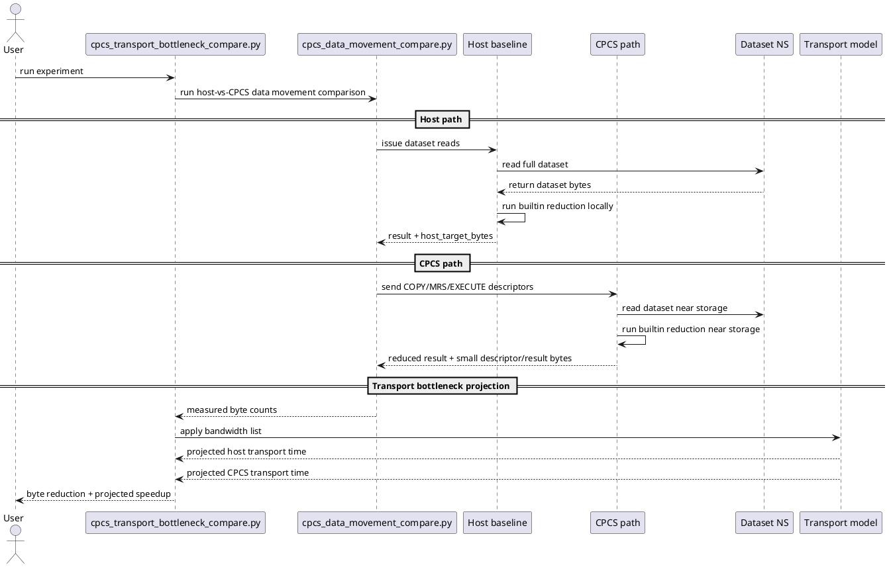
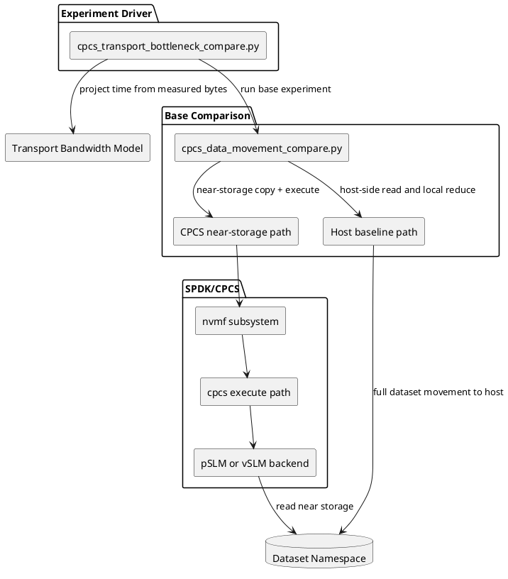

# CPCS Transport-Bottleneck Experiment

## 1) Background

Computational storage is most valuable when moving raw data to the host is expensive. If the host-storage transport is bandwidth-limited, then workloads that reduce data near storage can outperform host-side execution even when the device still scans the same input internally.

Typical examples are:

- database filtering,
- aggregation,
- predicate counting,
- partial reductions.

These workloads have an important asymmetry:

- input bytes are large,
- output bytes are small.

For the current prototype, we use builtin CPCS functions such as `sum64`, `max64`, or `min64` as stand-ins for those workloads. They are not the final database operators, but they preserve the main transport property that matters for this experiment: the host would normally pull a large dataset, while CPCS can return only a small descriptor/result stream.

## 2) Purpose

This experiment is designed to show the transport-side benefit of computational storage.

Primary question:

- If transport bandwidth is the bottleneck, how much time can be saved by executing the reduction near storage instead of moving the full dataset to the host?

The comparison has two parts:

- **Host path:** the host reads the dataset and performs the builtin reduction locally.
- **CPCS path:** the host sends control descriptors to CPCS, CPCS performs the builtin reduction near storage, and the host receives only descriptors and reduced results.

The experiment therefore focuses on:

- host-target byte reduction,
- projected transport time under limited bandwidth,
- projected transport speedup as bandwidth becomes scarce.

## 3) What the Scripts Do

The unified platform runner is:

- `test/cpcs/cpcs_experiments.py` (subcommand: `transport-bottleneck`)

Internal scenario engines:

- `test/cpcs/cpcs_transport_bottleneck_compare.py`
- `test/cpcs/cpcs_data_movement_compare.py`

Behavior:

1. Runs the existing host-vs-CPCS data-movement comparison.
2. Collects measured byte counts for:
   - host path bytes crossing the host-target boundary,
   - CPCS path bytes crossing the host-target boundary.
3. Projects transport-only time at one or more bandwidth points, for example:
   - 1 Gbps
   - 10 Gbps
   - 25 Gbps
   - 100 Gbps
4. Reports the transport speedup due to reduced data movement.

The result is a transport-bottleneck study built from existing CPCS resources, without requiring a separate network emulator.

## 4) Why `sum64` Is Acceptable for Now

`sum64` is a reasonable placeholder because it has the same transport structure as many useful database operations:

- the device reads a large input,
- the computation shrinks it to a very small result,
- the host receives only the reduced output.

Later, you can replace `sum64` with a real filter or predicate workload without changing the core experiment shape.

## 5) Sequence Diagram (PlantUML)



## 6) Module Diagram (PlantUML)



## 7) Metrics and Interpretation

The base comparison produces:

- `host.host_target_bytes`
- `cpcs.host_target_bytes`
- `byte_reduction_pct`

The wrapper adds a projection table for each bandwidth:

- `host_transport_seconds`
- `cpcs_transport_seconds`
- `transport_speedup_x`

How to read them:

- If `byte_reduction_pct` is large, CPCS is reducing traffic across the transport.
- If `host_transport_seconds` is much larger than `cpcs_transport_seconds` at low bandwidth, then computational storage helps when the transport is the bottleneck.
- The lower the bandwidth, the more strongly the reduced-byte CPCS path should benefit.

Important scope note:

- This is a **transport projection** experiment, not a physical NIC bandwidth shaper.
- It is intended to show why computational storage helps when the transport dominates.

## 8) Recommended Command

The simplest version uses `sum64` with a pSLM backend sized to fit the dataset:

```bash
sudo -E python3 ./test/cpcs/cpcs_experiments.py \
  --inventory ./test/cpcs/examples/inventory_loopback.yaml \
  transport-bottleneck -- \
  --pcie-bdf 0000:01:00.0 \
  --dataset-bdev Nvme0n1 \
  --backing-bdev Nvme0n2 \
  --dataset-size-gb 1 \
  --backend pslm \
  --pslm-size-mb 1024 \
  --builtin-program sum64 \
  --builtin-exec-max-mb 256 \
  --transport-bandwidth-gbps 1,10,25,100 \
  --core-mask 0xFF
```

If you want to study the same question with vSLM:

```bash
sudo -E python3 ./test/cpcs/cpcs_experiments.py \
  --inventory ./test/cpcs/examples/inventory_loopback.yaml \
  transport-bottleneck -- \
  --pcie-bdf 0000:01:00.0 \
  --dataset-bdev Nvme0n1 \
  --backing-bdev Nvme0n2 \
  --dataset-size-gb 1 \
  --backend vslm \
  --sram-mb 32 \
  --builtin-program sum64 \
  --builtin-exec-max-mb 256 \
  --transport-bandwidth-gbps 1,10,25,100 \
  --core-mask 0xFF
```

## 9) Caveats

- `sum64` is a reduction proxy, not a true filter operator.
- The device still reads the dataset internally; the benefit here is reduced **transported** data, not zero input I/O.
- The projection assumes bandwidth-limited transport is the dominant problem.
- A future filter workload can reuse the same experiment structure with a more realistic selectivity model.
