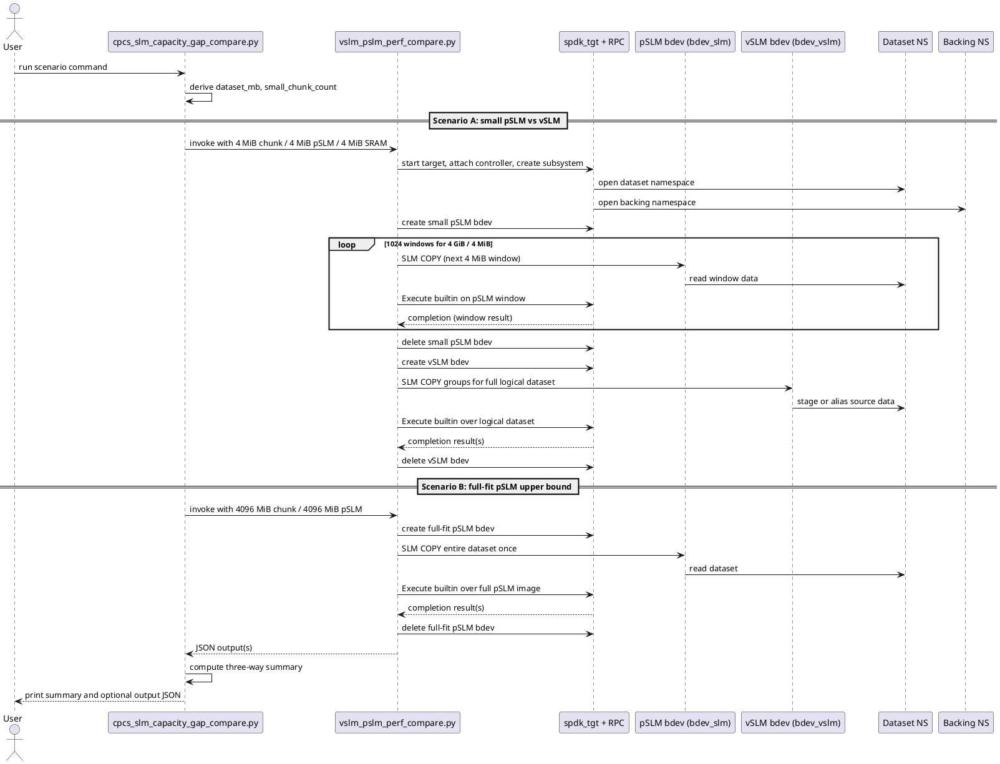
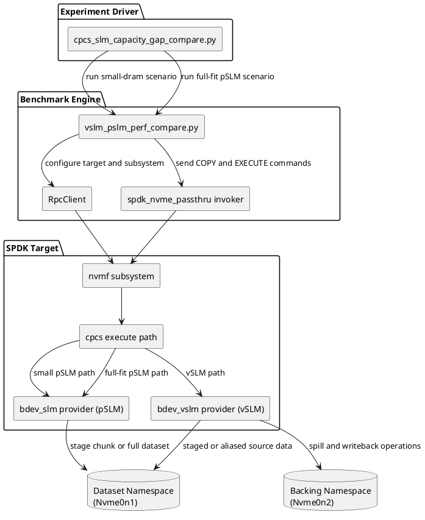

# CPCS Capacity-Gap Experiment (Small pSLM vs vSLM vs Full-Fit pSLM)

## 1) Background

CPCS programs execute over SLM namespaces. In a hard-cap pSLM configuration, the visible SLM capacity is exactly the physical volatile memory size. If the dataset is larger than that memory, the host cannot stage the full dataset at once and must iterate over many windows.

For example, with:

- pSLM capacity: 4 MiB
- dataset size: 4 GiB

the host must break the logical job into:

- copy 4 MiB into pSLM,
- execute on that 4 MiB,
- collect the result for that 4 MiB,
- repeat for all 1024 windows.

vSLM changes the host-visible interface. It exposes a large logical SLM namespace backed by limited SRAM/DRAM plus backing storage, so the host can stage the full logical dataset with far fewer control operations while the controller/runtime manages the capacity gap internally.

There is also an important reference point: a system with enough physical pSLM to hold the full dataset at once. That configuration represents the best-case pSLM baseline because it avoids both host-side windowing and virtualization overhead.

## 2) Purpose

This experiment now answers two related questions.

1. How much control-path amplification is caused by a small hard-cap pSLM?
2. How much of that degradation can vSLM recover, relative to a full-fit pSLM upper bound?

The comparison is therefore three-way:

- **Small pSLM**: 4 MiB pSLM for a 4 GiB dataset.
- **vSLM**: 4 MiB SRAM-backed vSLM exposing a 4 GiB logical SLM view.
- **Full-fit pSLM**: 4 GiB pSLM so the dataset fits in volatile memory at once.

Interpretation goal:

- **Small pSLM** shows the performance penalty caused by insufficient volatile memory.
- **Full-fit pSLM** shows the upper bound when physical memory is sufficient.
- **vSLM** shows whether logical capacity virtualization can recover performance and reduce command amplification without requiring 4 GiB of physical SLM.

## 3) What the Scripts Do

The unified platform runner is:

- `test/cpcs/cpcs_experiments.py` (subcommand: `capacity-gap`)

Internal scenario engines:

- `test/cpcs/cpcs_slm_capacity_gap_compare.py`
- `test/cpcs/vslm_pslm_perf_compare.py`

Current behavior:

1. Runs the original small-DRAM comparison:
   - small pSLM (`--physical-slm-mb`, default 4)
   - vSLM with small SRAM (`--sram-mb`, default 4)
2. Runs an additional full-fit pSLM baseline:
   - chunk size = dataset size
   - pSLM size = dataset size (default 4096 MiB for a 4 GiB dataset)
3. Extracts and reports:
   - `small_pslm`
   - `small_vslm`
   - `fullfit_pslm`
4. Computes ratios showing:
   - small pSLM vs vSLM
   - small pSLM vs full-fit pSLM
   - vSLM vs full-fit pSLM

Note on "retrieve":

- In the current builtin flow, retrieve is counted as execute-result completion parsing, not as a separate explicit NVMe read command.

## 4) Sequence Diagram (PlantUML)



## 5) Module Diagram (PlantUML)



## 6) Key Metrics and Interpretation

The wrapper now reports three mean result groups:

- `means.small_pslm`
- `means.small_vslm`
- `means.fullfit_pslm`

Each group includes:

- `copy_cmd_count`
- `execute_cmd_count`
- `total_control_cmd_count`
- `end_to_end_seconds`
- `copy_seconds`
- `execute_total_seconds`

Key ratio fields:

- `small_pslm_vs_small_vslm_total_cmd_reduction_x`
- `small_pslm_vs_small_vslm_end_to_end_penalty_x`
- `small_pslm_vs_fullfit_pslm_end_to_end_penalty_x`
- `small_vslm_vs_fullfit_pslm_end_to_end_ratio_x`

How to read them:

- If `small_pslm.copy_cmd_count` is near 1024, the small-memory windowing effect is active.
- If `small_vslm.copy_cmd_count` is much smaller, vSLM is reducing host staging command pressure.
- If `small_pslm.end_to_end_seconds` is much larger than `fullfit_pslm.end_to_end_seconds`, the slowdown is due to insufficient physical SLM capacity.
- If `small_vslm.end_to_end_seconds` is substantially lower than `small_pslm.end_to_end_seconds`, vSLM is recovering performance without needing a 4 GiB physical SLM.
- `fullfit_pslm` should be treated as the physical-memory upper bound, not necessarily a target that vSLM must beat.

## 7) Recommended Command

The new runner performs both scenarios by default, including the full-fit pSLM baseline.

```bash
sudo -E python3 ./test/cpcs/cpcs_experiments.py \
  --inventory ./test/cpcs/examples/inventory_loopback.yaml \
  capacity-gap -- \
  --pcie-bdf 0000:01:00.0 \
  --dataset-bdev Nvme0n1 \
  --backing-bdev Nvme0n2 \
  --dataset-size-gb 4 \
  --physical-slm-mb 4 \
  --sram-mb 4 \
  --fullfit-pslm-mb 4096 \
  --builtin-program sum64 \
  --builtin-exec-max-mb 256 \
  --vslm-max-copy-mb 4096 \
  --runs 3 \
  --core-mask 0xFF
```

If you want the older behavior only:

```bash
sudo -E python3 ./test/cpcs/cpcs_experiments.py \
  --inventory ./test/cpcs/examples/inventory_loopback.yaml \
  capacity-gap -- \
  --pcie-bdf 0000:01:00.0 \
  --dataset-bdev Nvme0n1 \
  --backing-bdev Nvme0n2 \
  --dataset-size-gb 4 \
  --physical-slm-mb 4 \
  --sram-mb 4 \
  --builtin-program sum64 \
  --builtin-exec-max-mb 256 \
  --vslm-max-copy-mb 4096 \
  --runs 3 \
  --core-mask 0xFF \
  --fullfit-pslm-disabled
```

## 8) Caveats

- This experiment emphasizes host control-path amplification and capacity-driven slowdown, not only raw compute throughput.
- If `--builtin-exec-max-mb` is small, even full-fit pSLM or vSLM can require multiple Execute commands.
- The full-fit pSLM result is the best-case physical-memory baseline for this workload size.
- vSLM may still be slower than full-fit pSLM because virtualization and backing-aware management add overhead; the main question is whether it materially improves over the small pSLM regime.
